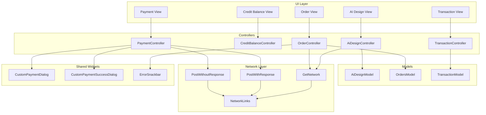
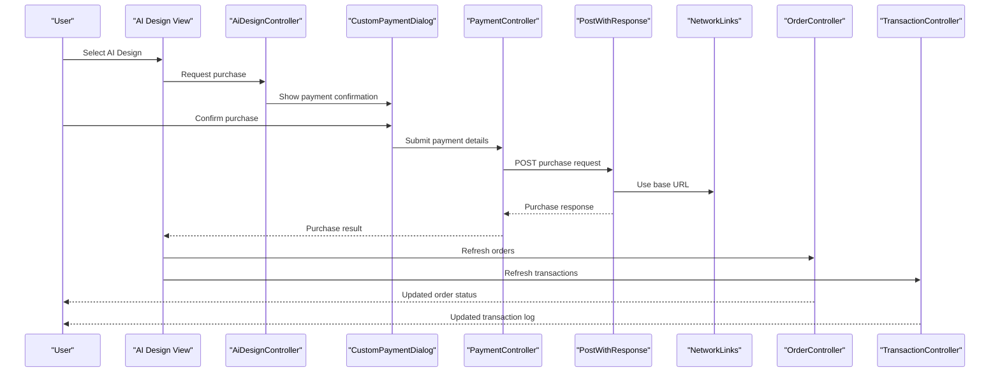
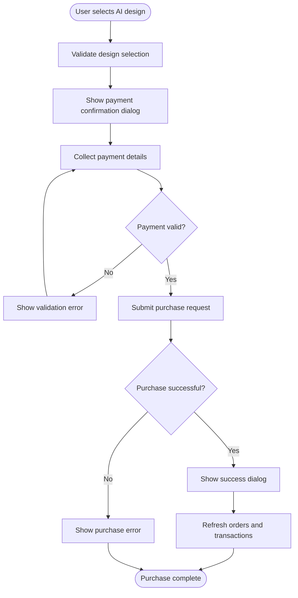
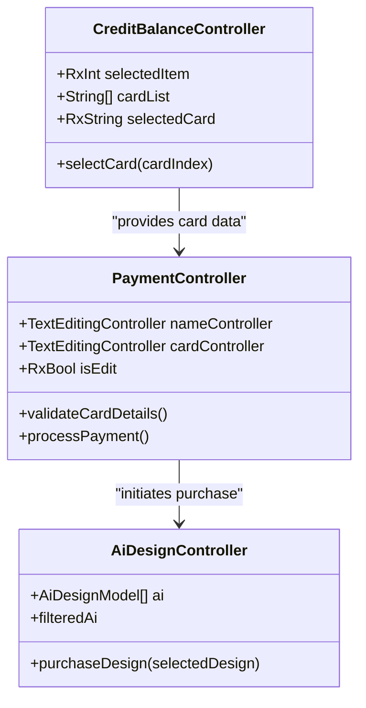
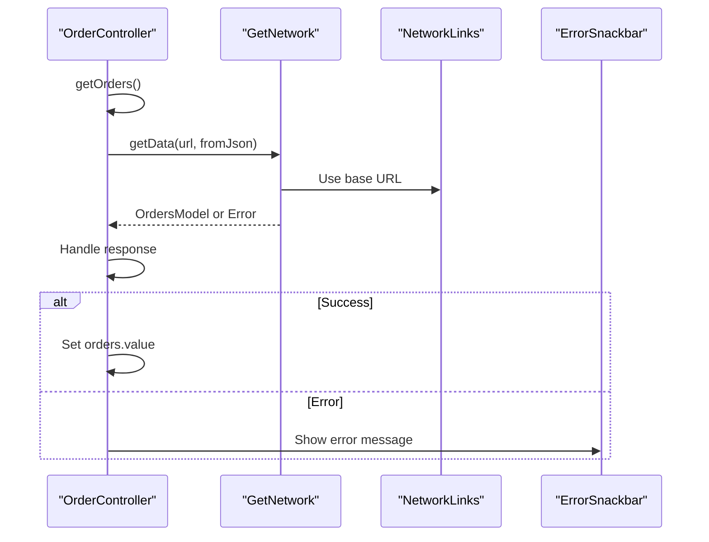
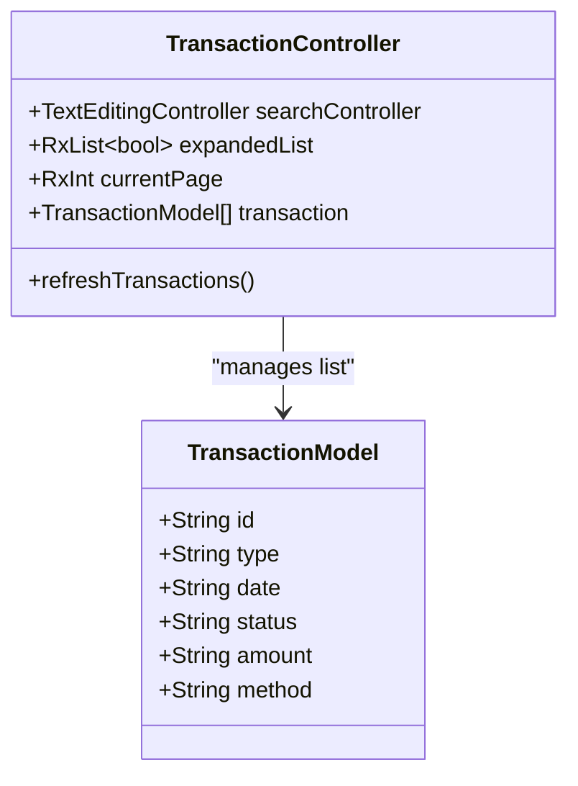
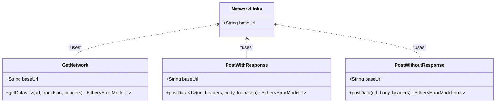
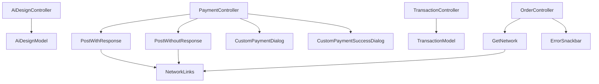

# Purchase and Download Workflow

<cite>
**Referenced Files in This Document**
- [ai_design_model.dart](file://lib/features/ai_design/models/ai_design_model.dart)
- [ai_design_controller.dart](file://lib/features/ai_design/controller/ai_design_controller.dart)
- [credit_balance_controller.dart](file://lib/features/credit_balance/controller/credit_balance_controller.dart)
- [order_controller.dart](file://lib/features/order/controllers/order_controller.dart)
- [transaction_controller.dart](file://lib/features/transaction/controller/transaction_controller.dart)
- [payment_controller.dart](file://lib/features/payment/controller/payment_controller.dart)
- [get_network.dart](file://lib/core/data/networks/get_network.dart)
- [post_with_response.dart](file://lib/core/data/networks/post_with_response.dart)
- [post_without_response.dart](file://lib/core/data/networks/post_without_response.dart)
- [networks_path.dart](file://lib/core/constant/networks_path.dart)
- [custom_payment_dialog.dart](file://lib/shared/widgets/custom_dialog/custom_payment_dialog.dart)
- [custom_payment_success_dialog.dart](file://lib/shared/widgets/custom_dialog/custom_payment_success_dialog.dart)
- [error_model.dart](file://lib/core/data/global_models/error_model.dart)
- [error_snackbar.dart](file://lib/shared/widgets/snackbars/error_snackbar.dart)
</cite>

## Table of Contents
1. [Introduction](#introduction)
2. [Project Structure](#project-structure)
3. [Core Components](#core-components)
4. [Architecture Overview](#architecture-overview)
5. [Detailed Component Analysis](#detailed-component-analysis)
6. [Dependency Analysis](#dependency-analysis)
7. [Performance Considerations](#performance-considerations)
8. [Troubleshooting Guide](#troubleshooting-guide)
9. [Conclusion](#conclusion)

## Introduction
This document provides comprehensive documentation for the AI design purchase and download workflow. It covers the purchase process implementation, including design pricing, credit system integration, and transaction handling. It also explains the download functionality, file format management, and delivery mechanisms. The document details the purchase confirmation flow, payment processing integration, and order management. It covers the design model structure with purchase-related properties and status tracking, documents the network integration for purchase requests and download initiation, and addresses error handling for failed purchases, retry mechanisms, and user feedback systems. Finally, it outlines the integration with the credit balance system and transaction logging.

## Project Structure
The purchase and download workflow spans several feature modules and core infrastructure components:
- AI Design module: Manages design listings and selection
- Credit Balance module: Handles user credit cards and balances
- Payment module: Processes payment forms and validation
- Order module: Manages order retrieval and status
- Transaction module: Tracks transaction history
- Network layer: Provides HTTP client wrappers for GET, POST with response, and POST without response
- Shared widgets: Payment dialogs and success notifications

**Diagram sources**
- [ai_design_controller.dart:1-71](file://lib/features/ai_design/controller/ai_design_controller.dart#L1-L71)
- [credit_balance_controller.dart:1-8](file://lib/features/credit_balance/controller/credit_balance_controller.dart#L1-L8)
- [payment_controller.dart:1-23](file://lib/features/payment/controller/payment_controller.dart#L1-L23)
- [order_controller.dart:1-41](file://lib/features/order/controllers/order_controller.dart#L1-L41)
- [transaction_controller.dart:1-66](file://lib/features/transaction/controller/transaction_controller.dart#L1-L66)
- [get_network.dart:1-39](file://lib/core/data/networks/get_network.dart#L1-L39)
- [post_with_response.dart:1-45](file://lib/core/data/networks/post_with_response.dart#L1-L45)
- [post_without_response.dart:1-47](file://lib/core/data/networks/post_without_response.dart#L1-L47)
- [networks_path.dart:1-3](file://lib/core/constant/networks_path.dart#L1-L3)

**Section sources**
- [ai_design_controller.dart:1-71](file://lib/features/ai_design/controller/ai_design_controller.dart#L1-L71)
- [get_network.dart:1-39](file://lib/core/data/networks/get_network.dart#L1-L39)
- [post_with_response.dart:1-45](file://lib/core/data/networks/post_with_response.dart#L1-L45)
- [post_without_response.dart:1-47](file://lib/core/data/networks/post_without_response.dart#L1-L47)

## Core Components
This section documents the primary components involved in the purchase and download workflow:

- AiDesignController: Manages AI design listings, filtering, pagination, and selection state
- CreditBalanceController: Handles credit card selection and balance representation
- PaymentController: Manages payment form inputs and edit state
- OrderController: Retrieves and displays order information with error handling
- TransactionController: Maintains transaction history with status tracking
- Network layer: Provides standardized HTTP client implementations for GET and POST operations
- Shared widgets: Payment dialog components for purchase confirmation and success notifications

**Section sources**
- [ai_design_controller.dart:1-71](file://lib/features/ai_design/controller/ai_design_controller.dart#L1-L71)
- [credit_balance_controller.dart:1-8](file://lib/features/credit_balance/controller/credit_balance_controller.dart#L1-L8)
- [payment_controller.dart:1-23](file://lib/features/payment/controller/payment_controller.dart#L1-L23)
- [order_controller.dart:1-41](file://lib/features/order/controllers/order_controller.dart#L1-L41)
- [transaction_controller.dart:1-66](file://lib/features/transaction/controller/transaction_controller.dart#L1-L66)

## Architecture Overview
The purchase and download workflow follows a layered architecture with clear separation of concerns:

**Diagram sources**
- [ai_design_controller.dart:1-71](file://lib/features/ai_design/controller/ai_design_controller.dart#L1-L71)
- [payment_controller.dart:1-23](file://lib/features/payment/controller/payment_controller.dart#L1-L23)
- [post_with_response.dart:1-45](file://lib/core/data/networks/post_with_response.dart#L1-L45)
- [networks_path.dart:1-3](file://lib/core/constant/networks_path.dart#L1-L3)
- [order_controller.dart:1-41](file://lib/features/order/controllers/order_controller.dart#L1-L41)
- [transaction_controller.dart:1-66](file://lib/features/transaction/controller/transaction_controller.dart#L1-L66)

## Detailed Component Analysis

### AI Design Purchase Flow
The AI design purchase flow begins with design selection and proceeds through payment confirmation and order processing:

**Diagram sources**
- [ai_design_controller.dart:1-71](file://lib/features/ai_design/controller/ai_design_controller.dart#L1-L71)
- [payment_controller.dart:1-23](file://lib/features/payment/controller/payment_controller.dart#L1-L23)

### Credit System Integration
The credit system integrates with the purchase workflow through card selection and balance validation:

**Diagram sources**
- [credit_balance_controller.dart:1-8](file://lib/features/credit_balance/controller/credit_balance_controller.dart#L1-L8)
- [payment_controller.dart:1-23](file://lib/features/payment/controller/payment_controller.dart#L1-L23)
- [ai_design_controller.dart:1-71](file://lib/features/ai_design/controller/ai_design_controller.dart#L1-L71)

### Order Management and Status Tracking
Order management encompasses order retrieval, status updates, and error handling:

**Diagram sources**
- [order_controller.dart:1-41](file://lib/features/order/controllers/order_controller.dart#L1-L41)
- [get_network.dart:1-39](file://lib/core/data/networks/get_network.dart#L1-L39)
- [networks_path.dart:1-3](file://lib/core/constant/networks_path.dart#L1-L3)

### Transaction Logging and History
Transaction logging maintains a comprehensive record of all financial activities:

**Diagram sources**
- [transaction_controller.dart:1-66](file://lib/features/transaction/controller/transaction_controller.dart#L1-L66)

### Network Integration for Purchase Requests
The network layer provides standardized HTTP client implementations for purchase processing:

**Diagram sources**
- [networks_path.dart:1-3](file://lib/core/constant/networks_path.dart#L1-L3)
- [get_network.dart:1-39](file://lib/core/data/networks/get_network.dart#L1-L39)
- [post_with_response.dart:1-45](file://lib/core/data/networks/post_with_response.dart#L1-L45)
- [post_without_response.dart:1-47](file://lib/core/data/networks/post_without_response.dart#L1-L47)

**Section sources**
- [ai_design_model.dart:1-12](file://lib/features/ai_design/models/ai_design_model.dart#L1-L12)
- [ai_design_controller.dart:1-71](file://lib/features/ai_design/controller/ai_design_controller.dart#L1-L71)
- [order_controller.dart:1-41](file://lib/features/order/controllers/order_controller.dart#L1-L41)
- [transaction_controller.dart:1-66](file://lib/features/transaction/controller/transaction_controller.dart#L1-L66)
- [get_network.dart:1-39](file://lib/core/data/networks/get_network.dart#L1-L39)
- [post_with_response.dart:1-45](file://lib/core/data/networks/post_with_response.dart#L1-L45)
- [post_without_response.dart:1-47](file://lib/core/data/networks/post_without_response.dart#L1-L47)

## Dependency Analysis
The purchase and download workflow exhibits clear dependency relationships:

**Diagram sources**
- [ai_design_controller.dart:1-71](file://lib/features/ai_design/controller/ai_design_controller.dart#L1-L71)
- [payment_controller.dart:1-23](file://lib/features/payment/controller/payment_controller.dart#L1-L23)
- [order_controller.dart:1-41](file://lib/features/order/controllers/order_controller.dart#L1-L41)
- [transaction_controller.dart:1-66](file://lib/features/transaction/controller/transaction_controller.dart#L1-L66)
- [post_with_response.dart:1-45](file://lib/core/data/networks/post_with_response.dart#L1-L45)
- [post_without_response.dart:1-47](file://lib/core/data/networks/post_without_response.dart#L1-L47)
- [get_network.dart:1-39](file://lib/core/data/networks/get_network.dart#L1-L39)

**Section sources**
- [payment_controller.dart:1-23](file://lib/features/payment/controller/payment_controller.dart#L1-L23)
- [order_controller.dart:1-41](file://lib/features/order/controllers/order_controller.dart#L1-L41)
- [transaction_controller.dart:1-66](file://lib/features/transaction/controller/transaction_controller.dart#L1-L66)

## Performance Considerations
The current implementation demonstrates several performance characteristics:
- Controllers use reactive programming patterns with RxJS for efficient state management
- Network operations are asynchronous with proper error handling
- Local data caching through reactive variables reduces unnecessary network calls
- Pagination is implemented with fixed total pages, which can be optimized for dynamic loading

Recommendations for improvement:
- Implement lazy loading for AI design lists to reduce initial load time
- Add request debouncing for search functionality to minimize network calls
- Introduce local caching strategies for frequently accessed designs
- Optimize image loading with progressive enhancement techniques

## Troubleshooting Guide
Common issues and their resolutions:

### Purchase Failures
Purchase failures can occur due to various reasons:
- Insufficient credit balance
- Invalid payment card details
- Network connectivity issues
- Server-side validation errors

Error handling mechanisms:
- Network layer returns Either type for graceful error handling
- ErrorSnackbar provides user-friendly error messages
- Payment validation prevents invalid submissions
- Retry logic can be implemented for transient network errors

### Download Issues
Download problems typically involve:
- File format compatibility
- Storage permission issues
- Network interruption during download
- Corrupted file downloads

Resolution strategies:
- Validate file formats before download initiation
- Implement resume capability for interrupted downloads
- Add checksum verification for downloaded files
- Provide user feedback during download progress

### Order Synchronization
Order synchronization challenges:
- Real-time order status updates
- Conflict resolution for concurrent modifications
- Offline order persistence

Best practices:
- Implement optimistic updates for immediate UI feedback
- Use conflict detection algorithms for concurrent edits
- Maintain offline queue for order operations
- Provide sync indicators for order state consistency

**Section sources**
- [error_model.dart:1-200](file://lib/core/data/global_models/error_model.dart#L1-L200)
- [error_snackbar.dart:1-200](file://lib/shared/widgets/snackbars/error_snackbar.dart#L1-L200)
- [get_network.dart:1-39](file://lib/core/data/networks/get_network.dart#L1-L39)
- [post_with_response.dart:1-45](file://lib/core/data/networks/post_with_response.dart#L1-L45)
- [post_without_response.dart:1-47](file://lib/core/data/networks/post_without_response.dart#L1-L47)

## Conclusion
The AI design purchase and download workflow demonstrates a well-structured architecture with clear separation of concerns. The implementation leverages reactive programming patterns for efficient state management and provides comprehensive error handling through the Either type pattern. The modular design allows for easy maintenance and future enhancements.

Key strengths of the current implementation:
- Clean separation between UI, business logic, and data layers
- Comprehensive error handling with user feedback
- Reactive state management for responsive UI updates
- Extensible network layer supporting various HTTP operations

Areas for potential improvement:
- Enhanced performance optimization through lazy loading and caching
- Improved error recovery mechanisms for network failures
- Expanded support for different file formats and download methods
- Advanced order synchronization for real-time updates

The current architecture provides a solid foundation for scaling the purchase and download functionality while maintaining code quality and user experience standards.