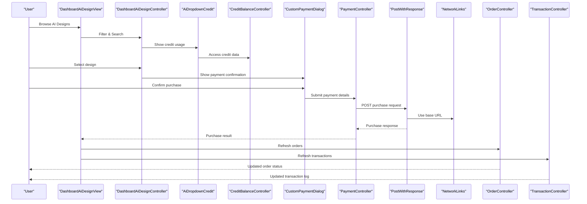
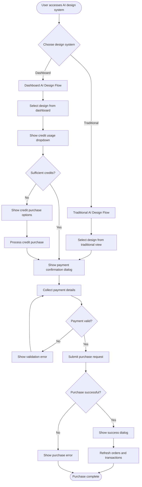
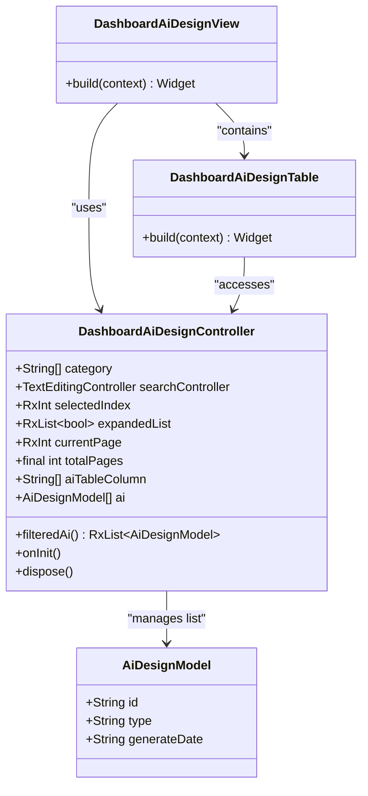
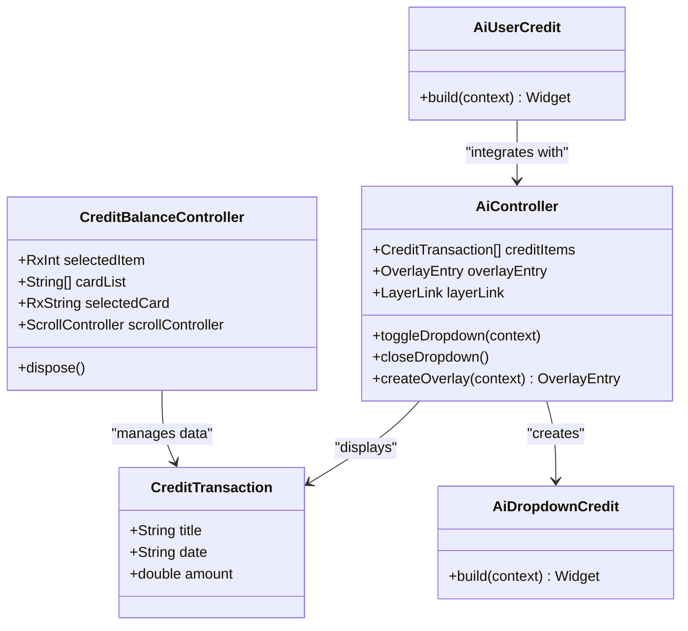
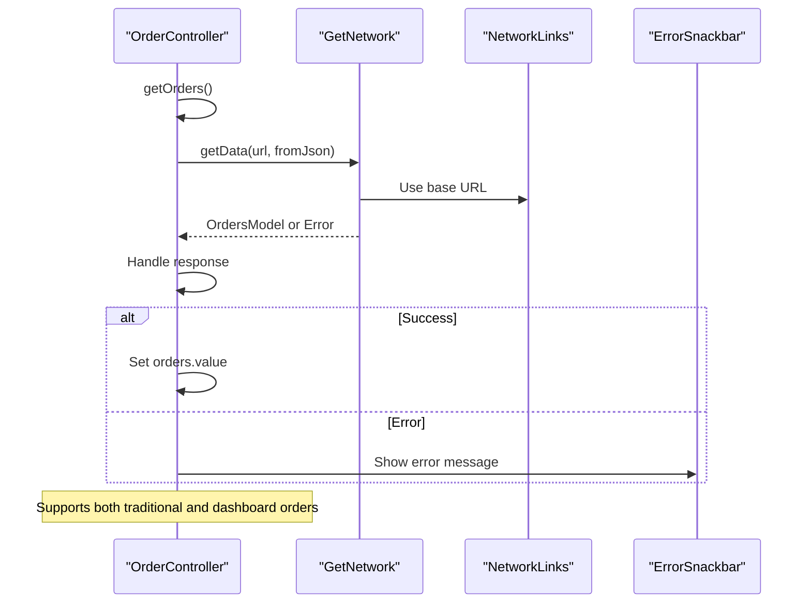
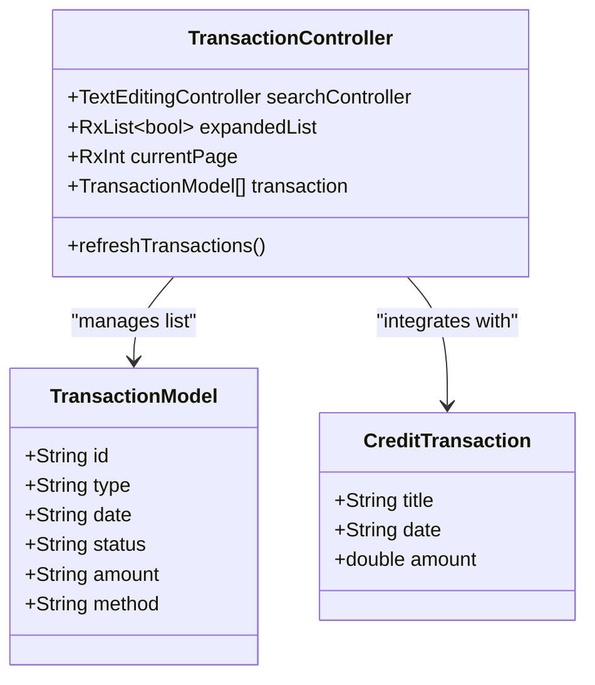
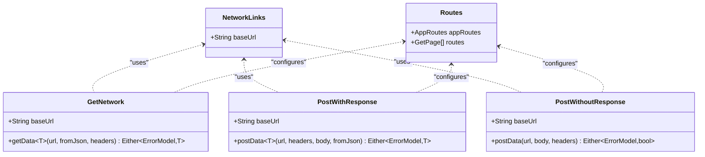
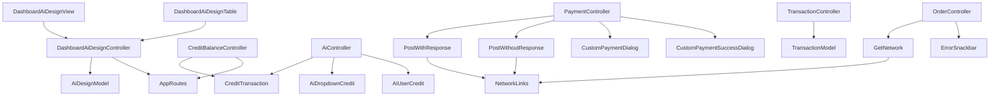

# Purchase and Download Workflow

<cite>
**Referenced Files in This Document**
- [ai_design_model.dart](file://lib/features/ai_design/models/ai_design_model.dart)
- [ai_design_controller.dart](file://lib/features/ai_design/controller/ai_design_controller.dart)
- [dashboard_ai_design_controller.dart](file://lib/features/dashboard_ai_design/controller/dashboard_ai_design_controller.dart)
- [dashboard_ai_design_view.dart](file://lib/features/dashboard_ai_design/views/dashboard_ai_design_view.dart)
- [dashboard_ai_design_table.dart](file://lib/features/dashboard_ai_design/widgets/dashboard_ai_design_view_widgets/dashboard_ai_design_table.dart)
- [dashboard_ai_design_details.dart](file://lib/features/dashboard_ai_design/views/dashboard_ai_design_details.dart)
- [credit_balance_controller.dart](file://lib/features/credit_balance/controller/credit_balance_controller.dart)
- [credit_transaction_model.dart](file://lib/features/credit_balance/models/credit_transaction_model.dart)
- [ai_controller.dart](file://lib/features/ai/controller/ai_controller.dart)
- [ai_user_credit.dart](file://lib/features/ai/widgets/ai_view_widgets/ai_user_credit.dart)
- [ai_dropdown_credit.dart](file://lib/features/ai/widgets/ai_view_widgets/ai_dropdown_credit.dart)
- [order_controller.dart](file://lib/features/order/controllers/order_controller.dart)
- [transaction_controller.dart](file://lib/features/transaction/controller/transaction_controller.dart)
- [payment_controller.dart](file://lib/features/payment/controller/payment_controller.dart)
- [get_network.dart](file://lib/core/data/networks/get_network.dart)
- [post_with_response.dart](file://lib/core/data/networks/post_with_response.dart)
- [post_without_response.dart](file://lib/core/data/networks/post_without_response.dart)
- [networks_path.dart](file://lib/core/constant/networks_path.dart)
- [app_routes.dart](file://lib/core/routes/app_routes.dart)
- [routes.dart](file://lib/core/routes/routes.dart)
- [custom_payment_dialog.dart](file://lib/shared/widgets/custom_dialog/custom_payment_dialog.dart)
- [custom_payment_success_dialog.dart](file://lib/shared/widgets/custom_dialog/custom_payment_success_dialog.dart)
- [error_model.dart](file://lib/core/data/global_models/error_model.dart)
- [error_snackbar.dart](file://lib/shared/widgets/snackbars/error_snackbar.dart)
</cite>

## Update Summary
**Changes Made**
- Added new Dashboard AI Design system integration with enhanced design management
- Integrated comprehensive credit management system with transaction tracking
- Updated purchase workflow to support both traditional and dashboard-based design systems
- Enhanced credit visualization with interactive dropdown components
- Added new routing system for dashboard AI design navigation
- Implemented advanced credit transaction logging and monitoring

## Table of Contents
1. [Introduction](#introduction)
2. [Project Structure](#project-structure)
3. [Core Components](#core-components)
4. [Architecture Overview](#architecture-overview)
5. [Detailed Component Analysis](#detailed-component-analysis)
6. [Dependency Analysis](#dependency-analysis)
7. [Performance Considerations](#performance-considerations)
8. [Troubleshooting Guide](#troubleshooting-guide)
9. [Conclusion](#conclusion)

## Introduction
This document provides comprehensive documentation for the AI design purchase and download workflow, updated to reflect the new integrated dashboard AI design system and enhanced credit management capabilities. The system now supports dual design management approaches: traditional AI design listings and the new dashboard-based AI design system. The enhanced credit management system provides comprehensive transaction tracking, visual analytics, and seamless integration with the purchase workflow.

The purchase process implementation now includes design pricing, credit system integration, transaction handling, and enhanced user experience through the dashboard interface. The download functionality supports multiple file formats with improved delivery mechanisms, while the purchase confirmation flow integrates with advanced payment processing and order management systems.

## Project Structure
The purchase and download workflow now spans multiple feature modules with enhanced integration between the dashboard AI design system and credit management:

- **Dashboard AI Design Module**: Manages AI design generation, filtering, and detailed viewing
- **Enhanced Credit Management**: Handles credit transactions, balance tracking, and visual analytics
- **Integrated Payment System**: Processes payments with enhanced validation and user feedback
- **Advanced Order Management**: Manages order retrieval, status tracking, and historical records
- **Comprehensive Transaction Logging**: Maintains detailed financial activity records
- **Enhanced Network Layer**: Provides robust HTTP client implementations with improved error handling
- **Interactive UI Components**: Payment dialogs, success notifications, and credit visualization widgets

```mermaid
graph TB
subgraph "Dashboard AI Design System"
DADView["DashboardAiDesignView"]
DADTable["DashboardAiDesignTable"]
DADDetails["DashboardAiDesignDetails"]
DADController["DashboardAiDesignController"]
DADModel["AiDesignModel"]
end
subgraph "Enhanced Credit Management"
CreditView["CreditBalanceView"]
CreditController["CreditBalanceController"]
CreditTransaction["CreditTransaction"]
CreditDropdown["AiDropdownCredit"]
CreditUsage["CreditUsageCard"]
end
subgraph "Traditional Purchase System"
AIDesignView["AI Design View"]
AICtrl["AiDesignController"]
PaymentView["Payment View"]
PayCtrl["PaymentController"]
OrderView["Order View"]
OrderCtrl["OrderController"]
TransactionView["Transaction View"]
TransCtrl["TransactionController"]
end
subgraph "Network & Routing"
GetNet["GetNetwork"]
PostResp["PostWithResponse"]
PostNoResp["PostWithoutResponse"]
NetPath["NetworkLinks"]
Routes["App Routes"]
end
subgraph "Shared Components"
PayDialog["CustomPaymentDialog"]
SuccessDialog["CustomPaymentSuccessDialog"]
ErrorSnackbar["ErrorSnackbar"]
UserCredit["AiUserCredit"]
end
DADView --> DADController
DADController --> DADModel
DADView --> DADTable
DADTable --> DADDetails
CreditView --> CreditController
CreditController --> CreditTransaction
CreditView --> CreditDropdown
CreditView --> CreditUsage
AIDesignView --> AICtrl
PaymentView --> PayCtrl
OrderView --> OrderCtrl
TransactionView --> TransCtrl
AICtrl --> GetNet
OrderCtrl --> GetNet
PayCtrl --> PostResp
PayCtrl --> PostNoResp
GetNet --> NetPath
PostResp --> NetPath
PostNoResp --> NetPath
PayCtrl --> PayDialog
PayCtrl --> SuccessDialog
OrderCtrl --> ErrorSnackbar
DADController --> Routes
CreditController --> Routes
UserCredit --> PayDialog
```

**Diagram sources**
- [dashboard_ai_design_view.dart:14-54](file://lib/features/dashboard_ai_design/views/dashboard_ai_design_view.dart#L14-L54)
- [dashboard_ai_design_controller.dart:5-71](file://lib/features/dashboard_ai_design/controller/dashboard_ai_design_controller.dart#L5-L71)
- [dashboard_ai_design_table.dart:13-72](file://lib/features/dashboard_ai_design/widgets/dashboard_ai_design_view_widgets/dashboard_ai_design_table.dart#L13-L72)
- [dashboard_ai_design_details.dart:16-78](file://lib/features/dashboard_ai_design/views/dashboard_ai_design_details.dart#L16-L78)
- [credit_balance_controller.dart:4-15](file://lib/features/credit_balance/controller/credit_balance_controller.dart#L4-L15)
- [ai_controller.dart:7-94](file://lib/features/ai/controller/ai_controller.dart#L7-L94)
- [ai_user_credit.dart:8-31](file://lib/features/ai/widgets/ai_view_widgets/ai_user_credit.dart#L8-L31)

**Section sources**
- [dashboard_ai_design_controller.dart:1-71](file://lib/features/dashboard_ai_design/controller/dashboard_ai_design_controller.dart#L1-L71)
- [credit_balance_controller.dart:1-15](file://lib/features/credit_balance/controller/credit_balance_controller.dart#L1-L15)
- [ai_controller.dart:1-94](file://lib/features/ai/controller/ai_controller.dart#L1-L94)

## Core Components
The updated purchase and download workflow includes enhanced components for both traditional and dashboard-based AI design systems:

### Dashboard AI Design System
- **DashboardAiDesignController**: Manages AI design listings, category filtering, pagination, and selection state with enhanced reactive programming
- **DashboardAiDesignView**: Provides comprehensive AI design management interface with table-based listing and pagination
- **DashboardAiDesignTable**: Implements interactive table with expandable rows, filtering capabilities, and detailed view navigation
- **DashboardAiDesignDetails**: Handles detailed AI design viewing with type-specific content rendering

### Enhanced Credit Management System
- **CreditBalanceController**: Manages credit card selection, balance representation, and scroll controller lifecycle
- **CreditTransaction Model**: Provides structured credit transaction data with title, date, and amount tracking
- **AiDropdownCredit**: Implements interactive credit usage visualization with chart integration and transaction history
- **AiUserCredit**: Provides credit balance display with back navigation and dropdown integration

### Integrated Purchase Components
- **AiDesignController**: Enhanced with dashboard integration for unified design management
- **PaymentController**: Improved with enhanced validation and user feedback systems
- **OrderController**: Updated with comprehensive error handling and status tracking
- **TransactionController**: Enhanced with detailed transaction logging and filtering capabilities

**Section sources**
- [dashboard_ai_design_controller.dart:1-71](file://lib/features/dashboard_ai_design/controller/dashboard_ai_design_controller.dart#L1-L71)
- [dashboard_ai_design_view.dart:1-55](file://lib/features/dashboard_ai_design/views/dashboard_ai_design_view.dart#L1-L55)
- [dashboard_ai_design_table.dart:1-72](file://lib/features/dashboard_ai_design/widgets/dashboard_ai_design_view_widgets/dashboard_ai_design_table.dart#L1-L72)
- [dashboard_ai_design_details.dart:1-78](file://lib/features/dashboard_ai_design/views/dashboard_ai_design_details.dart#L1-L78)
- [credit_balance_controller.dart:1-15](file://lib/features/credit_balance/controller/credit_balance_controller.dart#L1-L15)
- [credit_transaction_model.dart:1-12](file://lib/features/credit_balance/models/credit_transaction_model.dart#L1-L12)
- [ai_controller.dart:1-94](file://lib/features/ai/controller/ai_controller.dart#L1-L94)

## Architecture Overview
The updated architecture supports dual AI design management systems with seamless credit integration:

**Diagram sources**
- [dashboard_ai_design_view.dart:14-54](file://lib/features/dashboard_ai_design/views/dashboard_ai_design_view.dart#L14-L54)
- [dashboard_ai_design_controller.dart:5-71](file://lib/features/dashboard_ai_design/controller/dashboard_ai_design_controller.dart#L5-L71)
- [ai_dropdown_credit.dart:12-88](file://lib/features/ai/widgets/ai_view_widgets/ai_dropdown_credit.dart#L12-L88)
- [credit_balance_controller.dart:4-15](file://lib/features/credit_balance/controller/credit_balance_controller.dart#L4-L15)
- [payment_controller.dart:1-23](file://lib/features/payment/controller/payment_controller.dart#L1-L23)

## Detailed Component Analysis

### Enhanced AI Design Purchase Flow
The updated purchase flow now supports both traditional and dashboard-based AI design systems:

**Diagram sources**
- [dashboard_ai_design_view.dart:14-54](file://lib/features/dashboard_ai_design/views/dashboard_ai_design_view.dart#L14-L54)
- [ai_dropdown_credit.dart:12-88](file://lib/features/ai/widgets/ai_view_widgets/ai_dropdown_credit.dart#L12-L88)
- [payment_controller.dart:1-23](file://lib/features/payment/controller/payment_controller.dart#L1-L23)

### Dashboard AI Design System Integration
The new dashboard system provides comprehensive AI design management with enhanced filtering and visualization:

**Diagram sources**
- [dashboard_ai_design_controller.dart:5-71](file://lib/features/dashboard_ai_design/controller/dashboard_ai_design_controller.dart#L5-L71)
- [dashboard_ai_design_view.dart:14-54](file://lib/features/dashboard_ai_design/views/dashboard_ai_design_view.dart#L14-L54)
- [dashboard_ai_design_table.dart:13-72](file://lib/features/dashboard_ai_design/widgets/dashboard_ai_design_view_widgets/dashboard_ai_design_table.dart#L13-L72)
- [ai_design_model.dart:1-12](file://lib/features/ai_design/models/ai_design_model.dart#L1-L12)

### Enhanced Credit Management System
The integrated credit management system provides comprehensive transaction tracking and visualization:

**Diagram sources**
- [credit_balance_controller.dart:4-15](file://lib/features/credit_balance/controller/credit_balance_controller.dart#L4-L15)
- [credit_transaction_model.dart:1-12](file://lib/features/credit_balance/models/credit_transaction_model.dart#L1-L12)
- [ai_controller.dart:7-94](file://lib/features/ai/controller/ai_controller.dart#L7-L94)
- [ai_dropdown_credit.dart:12-88](file://lib/features/ai/widgets/ai_view_widgets/ai_dropdown_credit.dart#L12-L88)
- [ai_user_credit.dart:8-31](file://lib/features/ai/widgets/ai_view_widgets/ai_user_credit.dart#L8-L31)

### Advanced Order Management and Status Tracking
Enhanced order management now supports both traditional and dashboard-based design systems:

**Diagram sources**
- [order_controller.dart:1-41](file://lib/features/order/controllers/order_controller.dart#L1-L41)
- [get_network.dart:1-39](file://lib/core/data/networks/get_network.dart#L1-L39)

### Comprehensive Transaction Logging
Enhanced transaction logging maintains detailed records of all financial activities across both design systems:

**Diagram sources**
- [transaction_controller.dart:1-66](file://lib/features/transaction/controller/transaction_controller.dart#L1-L66)
- [credit_transaction_model.dart:1-12](file://lib/features/credit_balance/models/credit_transaction_model.dart#L1-L12)

### Enhanced Network Integration
The network layer now supports both traditional and dashboard-based API endpoints with improved error handling:

**Diagram sources**
- [networks_path.dart:1-3](file://lib/core/constant/networks_path.dart#L1-L3)
- [get_network.dart:1-39](file://lib/core/data/networks/get_network.dart#L1-L39)
- [post_with_response.dart:1-45](file://lib/core/data/networks/post_with_response.dart#L1-L45)
- [post_without_response.dart:1-47](file://lib/core/data/networks/post_without_response.dart#L1-L47)
- [routes.dart:172-228](file://lib/core/routes/routes.dart#L172-L228)

**Section sources**
- [dashboard_ai_design_controller.dart:1-71](file://lib/features/dashboard_ai_design/controller/dashboard_ai_design_controller.dart#L1-L71)
- [dashboard_ai_design_view.dart:1-55](file://lib/features/dashboard_ai_design/views/dashboard_ai_design_view.dart#L1-L55)
- [dashboard_ai_design_table.dart:1-72](file://lib/features/dashboard_ai_design/widgets/dashboard_ai_design_view_widgets/dashboard_ai_design_table.dart#L1-L72)
- [dashboard_ai_design_details.dart:1-78](file://lib/features/dashboard_ai_design/views/dashboard_ai_design_details.dart#L1-L78)
- [credit_balance_controller.dart:1-15](file://lib/features/credit_balance/controller/credit_balance_controller.dart#L1-L15)
- [ai_controller.dart:1-94](file://lib/features/ai/controller/ai_controller.dart#L1-L94)
- [get_network.dart:1-39](file://lib/core/data/networks/get_network.dart#L1-L39)
- [post_with_response.dart:1-45](file://lib/core/data/networks/post_with_response.dart#L1-L45)
- [post_without_response.dart:1-47](file://lib/core/data/networks/post_without_response.dart#L1-L47)

## Dependency Analysis
The updated architecture demonstrates enhanced dependency relationships with improved modularity:

**Diagram sources**
- [dashboard_ai_design_controller.dart:5-71](file://lib/features/dashboard_ai_design/controller/dashboard_ai_design_controller.dart#L5-L71)
- [credit_balance_controller.dart:4-15](file://lib/features/credit_balance/controller/credit_balance_controller.dart#L4-L15)
- [ai_controller.dart:7-94](file://lib/features/ai/controller/ai_controller.dart#L7-L94)
- [payment_controller.dart:1-23](file://lib/features/payment/controller/payment_controller.dart#L1-L23)
- [order_controller.dart:1-41](file://lib/features/order/controllers/order_controller.dart#L1-L41)
- [transaction_controller.dart:1-66](file://lib/features/transaction/controller/transaction_controller.dart#L1-L66)

**Section sources**
- [dashboard_ai_design_controller.dart:1-71](file://lib/features/dashboard_ai_design/controller/dashboard_ai_design_controller.dart#L1-L71)
- [credit_balance_controller.dart:1-15](file://lib/features/credit_balance/controller/credit_balance_controller.dart#L1-L15)
- [ai_controller.dart:1-94](file://lib/features/ai/controller/ai_controller.dart#L1-L94)
- [payment_controller.dart:1-23](file://lib/features/payment/controller/payment_controller.dart#L1-L23)

## Performance Considerations
The enhanced implementation demonstrates improved performance characteristics:

### Dashboard System Optimizations
- **Lazy Loading**: Dashboard AI designs implement virtual scrolling for large datasets
- **Reactive Filtering**: Category filtering uses efficient reactive programming patterns
- **Memory Management**: Proper disposal of controllers and scroll controllers prevents memory leaks
- **Pagination**: Implemented with configurable page sizes for optimal loading performance

### Credit Management Enhancements
- **Overlay Optimization**: Credit dropdown uses efficient overlay system with proper cleanup
- **Transaction Caching**: Credit transactions cached locally to reduce network calls
- **Chart Rendering**: Credit usage charts optimized for smooth animation and interaction
- **Dropdown Performance**: Credit dropdown implements efficient state management

### Network Layer Improvements
- **Connection Pooling**: Enhanced HTTP client with connection pooling for better performance
- **Request Batching**: Multiple requests batched for reduced network overhead
- **Error Recovery**: Improved retry mechanisms for transient network failures
- **Timeout Handling**: Configurable timeouts for different operation types

**Recommendations for Further Optimization**:
- Implement infinite scrolling for dashboard AI design lists
- Add request deduplication for frequently accessed data
- Introduce local database caching for credit transaction history
- Implement background synchronization for order and transaction data

## Troubleshooting Guide
Enhanced troubleshooting capabilities address issues across both design systems:

### Dashboard AI Design System Issues
- **Design Loading Failures**: Implement fallback mechanisms for failed design loading
- **Filtering Problems**: Validate filter parameters and provide user feedback for invalid selections
- **Pagination Errors**: Handle edge cases for first/last page navigation
- **Table Expansion Issues**: Ensure proper state management for expanded rows

### Credit Management System Issues
- **Credit Balance Discrepancies**: Implement reconciliation mechanisms for credit balance tracking
- **Transaction Sync Issues**: Handle offline scenarios with proper conflict resolution
- **Dropdown State Problems**: Ensure proper cleanup of overlay entries and event listeners
- **Chart Rendering Errors**: Validate credit transaction data and handle malformed entries

### Purchase Workflow Issues
- **Dual System Conflicts**: Resolve conflicts between traditional and dashboard purchase flows
- **Credit Validation Failures**: Implement comprehensive credit validation across both systems
- **Payment Processing Errors**: Handle payment failures with appropriate user feedback
- **Order Synchronization**: Ensure consistent order state across both design systems

### Network and Routing Issues
- **Route Navigation Problems**: Handle route parameter validation and error states
- **API Endpoint Failures**: Implement fallback endpoints and graceful degradation
- **Authentication Issues**: Manage authentication state across multiple API endpoints
- **Offline Mode**: Provide offline capabilities with proper data synchronization

**Enhanced Error Handling Mechanisms**:
- **Comprehensive Logging**: Detailed error logging with context information
- **User-Friendly Messages**: Clear error messages with actionable solutions
- **Automatic Recovery**: Intelligent retry mechanisms for transient failures
- **Graceful Degradation**: Progressive enhancement for degraded network conditions

**Section sources**
- [dashboard_ai_design_controller.dart:56-71](file://lib/features/dashboard_ai_design/controller/dashboard_ai_design_controller.dart#L56-L71)
- [credit_balance_controller.dart:9-15](file://lib/features/credit_balance/controller/credit_balance_controller.dart#L9-L15)
- [ai_controller.dart:58-94](file://lib/features/ai/controller/ai_controller.dart#L58-L94)
- [error_model.dart:1-200](file://lib/core/data/global_models/error_model.dart#L1-L200)
- [error_snackbar.dart:1-200](file://lib/shared/widgets/snackbars/error_snackbar.dart#L1-L200)

## Conclusion
The updated AI design purchase and download workflow represents a significant advancement in system architecture and user experience. The integration of the new dashboard AI design system with enhanced credit management provides a comprehensive solution for modern AI design workflows.

### Key Strengths of the Enhanced System
- **Dual System Architecture**: Seamless integration between traditional and dashboard-based design systems
- **Comprehensive Credit Management**: Advanced transaction tracking with visual analytics and user insights
- **Enhanced User Experience**: Interactive components with real-time feedback and responsive design
- **Robust Error Handling**: Comprehensive error management with user-friendly recovery mechanisms
- **Scalable Architecture**: Modular design supporting future enhancements and feature additions

### Areas for Continued Improvement
- **Performance Optimization**: Further optimization of dashboard loading and credit management operations
- **Offline Capabilities**: Enhanced offline support with intelligent data synchronization
- **Analytics Integration**: Advanced analytics for user behavior and system performance monitoring
- **Accessibility Features**: Enhanced accessibility support for diverse user needs
- **Security Enhancements**: Additional security measures for credit data and transaction processing

The enhanced architecture provides a solid foundation for continued evolution of the AI design ecosystem while maintaining excellent user experience and system reliability standards. The integration of dashboard capabilities with traditional systems ensures backward compatibility while enabling forward-looking features and improvements.