# Authentication System

<cite>
**Referenced Files in This Document**
- [lib/main.dart](file://lib/main.dart)
- [lib/firebase_options.dart](file://lib/firebase_options.dart)
- [lib/core/services/firebase_google_auth.dart](file://lib/core/services/firebase_google_auth.dart)
- [lib/features/auth/bindings/auth_bindings.dart](file://lib/features/auth/bindings/auth_bindings.dart)
- [lib/features/auth/bindings/onboard_bindings.dart](file://lib/features/auth/bindings/onboard_bindings.dart)
- [lib/features/auth/controller/onboarding_controller.dart](file://lib/features/auth/controller/onboarding_controller.dart)
- [lib/features/auth/views/onboarding_view.dart](file://lib/features/auth/views/onboarding_view.dart)
- [lib/features/auth/controller/signin_controller.dart](file://lib/features/auth/controller/signin_controller.dart)
- [lib/features/auth/views/signin_view.dart](file://lib/features/auth/views/signin_view.dart)
- [lib/features/auth/controller/signup_controller.dart](file://lib/features/auth/controller/signup_controller.dart)
- [lib/features/auth/views/signup_view.dart](file://lib/features/auth/views/signup_view.dart)
- [lib/features/auth/controller/user_mode_controller.dart](file://lib/features/auth/controller/user_mode_controller.dart)
- [lib/features/auth/views/user_mode_view.dart](file://lib/features/auth/views/user_mode_view.dart)
- [lib/features/auth/views/signup_option_view.dart](file://lib/features/auth/views/signup_option_view.dart)
- [lib/features/auth/controller/signup_option_controller.dart](file://lib/features/auth/controller/signup_option_controller.dart)
- [lib/features/auth/views/email_verification_view.dart](file://lib/features/auth/views/email_verification_view.dart)
- [lib/features/auth/controller/email_verification_controller.dart](file://lib/features/auth/controller/email_verification_controller.dart)
- [lib/features/auth/views/otp_view.dart](file://lib/features/auth/views/otp_view.dart)
- [lib/features/auth/controller/otp_controller.dart](file://lib/features/auth/controller/otp_controller.dart)
- [lib/features/auth/views/forgot_password_view.dart](file://lib/features/auth/views/forgot_password_view.dart)
- [lib/features/auth/controller/forgot_password_controller.dart](file://lib/features/auth/controller/forgot_password_controller.dart)
- [lib/features/auth/views/new_password_view.dart](file://lib/features/auth/views/new_password_view.dart)
- [lib/features/auth/controller/new_password_controller.dart](file://lib/features/auth/controller/new_password_controller.dart)
- [lib/features/auth/repositories/login_repo.dart](file://lib/features/auth/repositories/login_repo.dart)
- [lib/features/auth/repositories/register_repo.dart](file://lib/features/auth/repositories/register_repo.dart)
- [lib/features/auth/repositories/forgot_password_repo.dart](file://lib/features/auth/repositories/forgot_password_repo.dart)
- [lib/features/auth/models/login_model.dart](file://lib/features/auth/models/login_model.dart)
- [lib/features/auth/models/register_model.dart](file://lib/features/auth/models/register_model.dart)
- [lib/features/auth/models/forgot_password_model.dart](file://lib/features/auth/models/forgot_password_model.dart)
- [lib/features/auth/controller/google_login_controller.dart](file://lib/features/auth/controller/google_login_controller.dart)
- [lib/features/auth/models/google_login_model.dart](file://lib/features/auth/models/google_login_model.dart)
- [lib/features/auth/repositories/google_login_repo.dart](file://lib/features/auth/repositories/google_login_repo.dart)
- [lib/core/data/global_models/google_user_info_model.dart](file://lib/core/data/global_models/google_user_info_model.dart)
- [lib/features/auth/widgets/onboard_login.dart](file://lib/features/auth/widgets/onboard_login.dart)
- [lib/features/auth/widgets/onboarding_footer.dart](file://lib/features/auth/widgets/onboarding_footer.dart)
- [lib/features/auth/widgets/login_button.dart](file://lib/features/auth/widgets/login_button.dart)
- [lib/features/auth/widgets/signin_form.dart](file://lib/features/auth/widgets/signin_form.dart)
- [lib/features/auth/controller/logout_controller.dart](file://lib/features/auth/controller/logout_controller.dart)
- [lib/features/auth/repositories/logout_repo.dart](file://lib/features/auth/repositories/logout_repo.dart)
</cite>

## Update Summary
**Changes Made**
- Added comprehensive Google Login Authentication System with new GoogleLoginController, GoogleLoginModel, and GoogleLoginRepository components
- Enhanced Firebase integration with platform-specific configurations for Android and iOS
- Integrated Google Sign-In functionality with Firebase Authentication
- Added Google user info model for standardized user data handling
- Implemented Google login button widget with loading states and error handling
- Added logout functionality with repository pattern

## Table of Contents
1. [Introduction](#introduction)
2. [Project Structure](#project-structure)
3. [Core Components](#core-components)
4. [Architecture Overview](#architecture-overview)
5. [Detailed Component Analysis](#detailed-component-analysis)
6. [Dependency Analysis](#dependency-analysis)
7. [Performance Considerations](#performance-considerations)
8. [Troubleshooting Guide](#troubleshooting-guide)
9. [Conclusion](#conclusion)

## Introduction
This document describes the Authentication System feature of the application. It covers the complete user authentication workflow from onboarding, registration, login, email verification, OTP verification, password reset, and user mode selection (client/provider). The system now includes a comprehensive Google Login Authentication System with enhanced Firebase integration supporting platform-specific configurations for Android and iOS. It also explains the MVVM architecture implemented with GetX controllers, view bindings, and state management patterns, along with integration points for Firebase Authentication and Google Sign-In.

## Project Structure
The authentication feature is organized under the features/auth package with clear separation of concerns:
- Controllers: stateful business logic and coordination
- Views: UI rendered via GetView with reactive updates
- Repositories: encapsulate network/API interactions
- Models: typed request/response data structures
- Bindings: dependency injection wiring via GetX
- Services: platform integrations (Firebase/Google)

```mermaid
graph TB
subgraph "Auth Feature"
subgraph "Controllers"
OC["OnboardingController"]
SC["SigninController"]
SGC["SignupController"]
UMC["UserModeController"]
EVC["EmailVerificationController"]
OPC["OtpController"]
FPC["ForgotPasswordController"]
NPC["NewPasswordController"]
GLC["GoogleLoginController"]
LGC["LogoutController"]
end
subgraph "Views"
OV["OnboardingView"]
SV["SigninView"]
SGV["SignupView"]
UMV["UserModeView"]
EVO["EmailVerificationView"]
OPV["OtpView"]
FPV["ForgotPasswordView"]
NPV["NewPasswordView"]
OLV["OnboardLogin"]
end
subgraph "Repositories"
LR["LoginRepository"]
RR["RegisterRepository"]
FR["ForgotPasswordRepository"]
GLR["GoogleLoginRepository"]
LOGR["LogoutRepository"]
end
subgraph "Models"
LM["LoginModel"]
RM["RegisterModel"]
FPM["ForgotPasswordModel"]
GLM["GoogleLoginModel"]
GUIM["GoogleUserInfoModel"]
end
subgraph "Bindings"
AB["AuthBindings"]
OB["OnboardBindings"]
end
subgraph "Services"
FGAS["FirebaseGoogleAuthService"]
end
OV --> OC
SV --> SC
SGV --> SGC
UMV --> UMC
EVO --> EVC
OPV --> OPC
FPV --> FPC
NPV --> NPC
SC --> LR
SGC --> RR
FPC --> FR
GLC --> GLR
LGC --> LOGR
OC -.-> AB
SC -.-> AB
SGC -.-> AB
UMC -.-> AB
EVC -.-> AB
OPC -.-> AB
FPC -.-> AB
NPC -.-> AB
GLC -.-> OB
OLV --> GLC
FGAS --> SV
```

**Diagram sources**
- [lib/features/auth/bindings/auth_bindings.dart:13-28](file://lib/features/auth/bindings/auth_bindings.dart#L13-L28)
- [lib/features/auth/bindings/onboard_bindings.dart:1-13](file://lib/features/auth/bindings/onboard_bindings.dart#L1-L13)
- [lib/features/auth/controller/onboarding_controller.dart:7-123](file://lib/features/auth/controller/onboarding_controller.dart#L7-L123)
- [lib/features/auth/views/onboarding_view.dart:8-54](file://lib/features/auth/views/onboarding_view.dart#L8-L54)
- [lib/features/auth/controller/signin_controller.dart:9-51](file://lib/features/auth/controller/signin_controller.dart#L9-L51)
- [lib/features/auth/views/signin_view.dart:17-93](file://lib/features/auth/views/signin_view.dart#L17-L93)
- [lib/features/auth/controller/signup_controller.dart:10-66](file://lib/features/auth/controller/signup_controller.dart#L10-L66)
- [lib/features/auth/views/signup_view.dart:18-96](file://lib/features/auth/views/signup_view.dart#L18-L96)
- [lib/features/auth/controller/user_mode_controller.dart](file://lib/features/auth/controller/user_mode_controller.dart)
- [lib/features/auth/views/user_mode_view.dart](file://lib/features/auth/views/user_mode_view.dart)
- [lib/features/auth/views/email_verification_view.dart](file://lib/features/auth/views/email_verification_view.dart)
- [lib/features/auth/controller/email_verification_controller.dart](file://lib/features/auth/controller/email_verification_controller.dart)
- [lib/features/auth/views/otp_view.dart](file://lib/features/auth/views/otp_view.dart)
- [lib/features/auth/controller/otp_controller.dart](file://lib/features/auth/controller/otp_controller.dart)
- [lib/features/auth/views/forgot_password_view.dart](file://lib/features/auth/views/forgot_password_view.dart)
- [lib/features/auth/controller/forgot_password_controller.dart](file://lib/features/auth/controller/forgot_password_controller.dart)
- [lib/features/auth/views/new_password_view.dart](file://lib/features/auth/views/new_password_view.dart)
- [lib/features/auth/controller/new_password_controller.dart](file://lib/features/auth/controller/new_password_controller.dart)
- [lib/features/auth/controller/google_login_controller.dart:1-38](file://lib/features/auth/controller/google_login_controller.dart#L1-L38)
- [lib/features/auth/models/google_login_model.dart:1-263](file://lib/features/auth/models/google_login_model.dart#L1-L263)
- [lib/features/auth/repositories/google_login_repo.dart:1-30](file://lib/features/auth/repositories/google_login_repo.dart#L1-L30)
- [lib/core/data/global_models/google_user_info_model.dart:1-21](file://lib/core/data/global_models/google_user_info_model.dart#L1-L21)
- [lib/features/auth/widgets/onboard_login.dart:1-85](file://lib/features/auth/widgets/onboard_login.dart#L1-L85)
- [lib/features/auth/controller/logout_controller.dart:1-30](file://lib/features/auth/controller/logout_controller.dart#L1-L30)
- [lib/features/auth/repositories/logout_repo.dart:1-21](file://lib/features/auth/repositories/logout_repo.dart#L1-L21)

**Section sources**
- [lib/features/auth/bindings/auth_bindings.dart:13-28](file://lib/features/auth/bindings/auth_bindings.dart#L13-L28)
- [lib/features/auth/bindings/onboard_bindings.dart:1-13](file://lib/features/auth/bindings/onboard_bindings.dart#L1-L13)
- [lib/features/auth/controller/onboarding_controller.dart:7-123](file://lib/features/auth/controller/onboarding_controller.dart#L7-L123)
- [lib/features/auth/views/onboarding_view.dart:8-54](file://lib/features/auth/views/onboarding_view.dart#L8-L54)

## Core Components
- Onboarding: animated onboarding screens with page navigation and theme-aware visuals.
- Sign-in: email/password login with repository-driven execution and token persistence.
- Registration: multi-field form with terms agreement, user type selection, and post-registration token handling.
- User Mode Selection: toggles between client and provider modes influencing registration routing and model population.
- Email Verification: dedicated view and controller for verifying email after registration.
- OTP Verification: OTP entry screen and controller coordinating verification steps.
- Password Reset: forgot password view/controller and repository for initiating reset; new password view/controller for setting a new password.
- Google Sign-In: comprehensive service wrapper integrating Firebase Auth with Google Sign-In, including user info model and repository pattern.
- Logout: repository-driven logout functionality with token cleanup and navigation.

**Section sources**
- [lib/features/auth/controller/signin_controller.dart:9-51](file://lib/features/auth/controller/signin_controller.dart#L9-L51)
- [lib/features/auth/views/signin_view.dart:17-93](file://lib/features/auth/views/signin_view.dart#L17-L93)
- [lib/features/auth/controller/signup_controller.dart:10-66](file://lib/features/auth/controller/signup_controller.dart#L10-L66)
- [lib/features/auth/views/signup_view.dart:18-96](file://lib/features/auth/views/signup_view.dart#L18-L96)
- [lib/features/auth/controller/user_mode_controller.dart](file://lib/features/auth/controller/user_mode_controller.dart)
- [lib/features/auth/views/user_mode_view.dart](file://lib/features/auth/views/user_mode_view.dart)
- [lib/features/auth/views/signup_option_view.dart](file://lib/features/auth/views/signup_option_view.dart)
- [lib/features/auth/controller/signup_option_controller.dart](file://lib/features/auth/controller/signup_option_controller.dart)
- [lib/features/auth/views/email_verification_view.dart](file://lib/features/auth/views/email_verification_view.dart)
- [lib/features/auth/controller/email_verification_controller.dart](file://lib/features/auth/controller/email_verification_controller.dart)
- [lib/features/auth/views/otp_view.dart](file://lib/features/auth/views/otp_view.dart)
- [lib/features/auth/controller/otp_controller.dart](file://lib/features/auth/controller/otp_controller.dart)
- [lib/features/auth/views/forgot_password_view.dart](file://lib/features/auth/views/forgot_password_view.dart)
- [lib/features/auth/controller/forgot_password_controller.dart](file://lib/features/auth/controller/forgot_password_controller.dart)
- [lib/features/auth/views/new_password_view.dart](file://lib/features/auth/views/new_password_view.dart)
- [lib/features/auth/controller/new_password_controller.dart](file://lib/features/auth/controller/new_password_controller.dart)
- [lib/core/services/firebase_google_auth.dart:6-69](file://lib/core/services/firebase_google_auth.dart#L6-L69)
- [lib/features/auth/controller/google_login_controller.dart:1-38](file://lib/features/auth/controller/google_login_controller.dart#L1-L38)
- [lib/features/auth/models/google_login_model.dart:1-263](file://lib/features/auth/models/google_login_model.dart#L1-L263)
- [lib/features/auth/repositories/google_login_repo.dart:1-30](file://lib/features/auth/repositories/google_login_repo.dart#L1-L30)
- [lib/core/data/global_models/google_user_info_model.dart:1-21](file://lib/core/data/global_models/google_user_info_model.dart#L1-L21)
- [lib/features/auth/controller/logout_controller.dart:1-30](file://lib/features/auth/controller/logout_controller.dart#L1-L30)
- [lib/features/auth/repositories/logout_repo.dart:1-21](file://lib/features/auth/repositories/logout_repo.dart#L1-L21)

## Architecture Overview
The system follows MVVM with GetX:
- Models define typed request/response structures.
- Controllers manage state and orchestrate business logic.
- Views render UI and bind to controller state via Obx.
- Repositories encapsulate network/API calls.
- Bindings wire dependencies lazily for DI.

```mermaid
classDiagram
class LoginModel
class RegisterModel
class ForgotPasswordModel
class GoogleLoginModel {
+User user
+String providerId
+TokenResponse tokenResponse
+String operationType
}
class GoogleUserInfoModel {
+String name
+String email
+String avatarUrl
+String idToken
+String uid
}
class LoginRepository {
+execute(email, password)
}
class RegisterRepository {
+execute(name, email, phone, password, confirmPassword, abn, userType)
}
class ForgotPasswordRepository {
+execute(email)
}
class GoogleLoginRepository {
+execute(name, email, avatar, token)
}
class LogoutRepository {
+execute()
}
class OnboardingController {
+currentIndex
+dragOffset
+onInit()
+dispose()
}
class SigninController {
+email
+password
+isLoading
+userLogin(formKey)
+signup(formKey)
+dispose()
}
class SignupController {
+isChecked
+nameController
+emailController
+passwordController
+confirmPasswordController
+phoneController
+abnController
+isLoading
+register(formKey)
+dispose()
}
class UserModeController {
+selectedIndex
}
class EmailVerificationController
class OtpController
class ForgotPasswordController
class NewPasswordController
class GoogleLoginController {
+isLoading
+googleLogin(user)
}
class LogoutController {
+isLoading
+logout()
}
GoogleLoginModel <|-- User
GoogleLoginModel <|-- TokenResponse
GoogleLoginModel <|-- StsTokenManager
GoogleLoginModel <|-- ProviderData
GoogleLoginController --> GoogleLoginRepository : "uses"
LogoutController --> LogoutRepository : "uses"
SigninController --> LoginRepository : "uses"
SignupController --> RegisterRepository : "uses"
ForgotPasswordController --> ForgotPasswordRepository : "uses"
GoogleLoginController --> GoogleUserInfoModel : "receives"
```

**Diagram sources**
- [lib/features/auth/models/login_model.dart](file://lib/features/auth/models/login_model.dart)
- [lib/features/auth/models/register_model.dart](file://lib/features/auth/models/register_model.dart)
- [lib/features/auth/models/forgot_password_model.dart](file://lib/features/auth/models/forgot_password_model.dart)
- [lib/features/auth/models/google_login_model.dart:1-263](file://lib/features/auth/models/google_login_model.dart#L1-L263)
- [lib/core/data/global_models/google_user_info_model.dart:1-21](file://lib/core/data/global_models/google_user_info_model.dart#L1-L21)
- [lib/features/auth/repositories/login_repo.dart](file://lib/features/auth/repositories/login_repo.dart)
- [lib/features/auth/repositories/register_repo.dart](file://lib/features/auth/repositories/register_repo.dart)
- [lib/features/auth/repositories/forgot_password_repo.dart](file://lib/features/auth/repositories/forgot_password_repo.dart)
- [lib/features/auth/repositories/google_login_repo.dart:1-30](file://lib/features/auth/repositories/google_login_repo.dart#L1-L30)
- [lib/features/auth/repositories/logout_repo.dart:1-21](file://lib/features/auth/repositories/logout_repo.dart#L1-L21)
- [lib/features/auth/controller/signin_controller.dart:9-51](file://lib/features/auth/controller/signin_controller.dart#L9-L51)
- [lib/features/auth/controller/signup_controller.dart:10-66](file://lib/features/auth/controller/signup_controller.dart#L10-L66)
- [lib/features/auth/controller/user_mode_controller.dart](file://lib/features/auth/controller/user_mode_controller.dart)
- [lib/features/auth/controller/email_verification_controller.dart](file://lib/features/auth/controller/email_verification_controller.dart)
- [lib/features/auth/controller/otp_controller.dart](file://lib/features/auth/controller/otp_controller.dart)
- [lib/features/auth/controller/forgot_password_controller.dart](file://lib/features/auth/controller/forgot_password_controller.dart)
- [lib/features/auth/controller/new_password_controller.dart](file://lib/features/auth/controller/new_password_controller.dart)
- [lib/features/auth/controller/google_login_controller.dart:1-38](file://lib/features/auth/controller/google_login_controller.dart#L1-L38)
- [lib/features/auth/controller/logout_controller.dart:1-30](file://lib/features/auth/controller/logout_controller.dart#L1-L30)

## Detailed Component Analysis

### Onboarding Workflow
- Controller manages page transitions, drag gestures, and animated arrows.
- View renders onboarding slides with theme-aware assets and footer actions.
- Navigation leads to user mode selection upon completion.

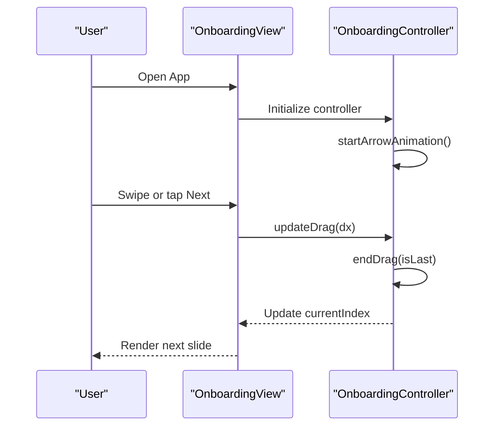

**Diagram sources**
- [lib/features/auth/views/onboarding_view.dart:14-50](file://lib/features/auth/views/onboarding_view.dart#L14-L50)
- [lib/features/auth/controller/onboarding_controller.dart:38-68](file://lib/features/auth/controller/onboarding_controller.dart#L38-L68)

**Section sources**
- [lib/features/auth/controller/onboarding_controller.dart:7-123](file://lib/features/auth/controller/onboarding_controller.dart#L7-L123)
- [lib/features/auth/views/onboarding_view.dart:8-54](file://lib/features/auth/views/onboarding_view.dart#L8-L54)

### User Mode Selection (Client/Provider)
- User selects either personal or business account during registration.
- Controller maintains selected index and influences registration payload.
- View reflects current selection and routes accordingly.

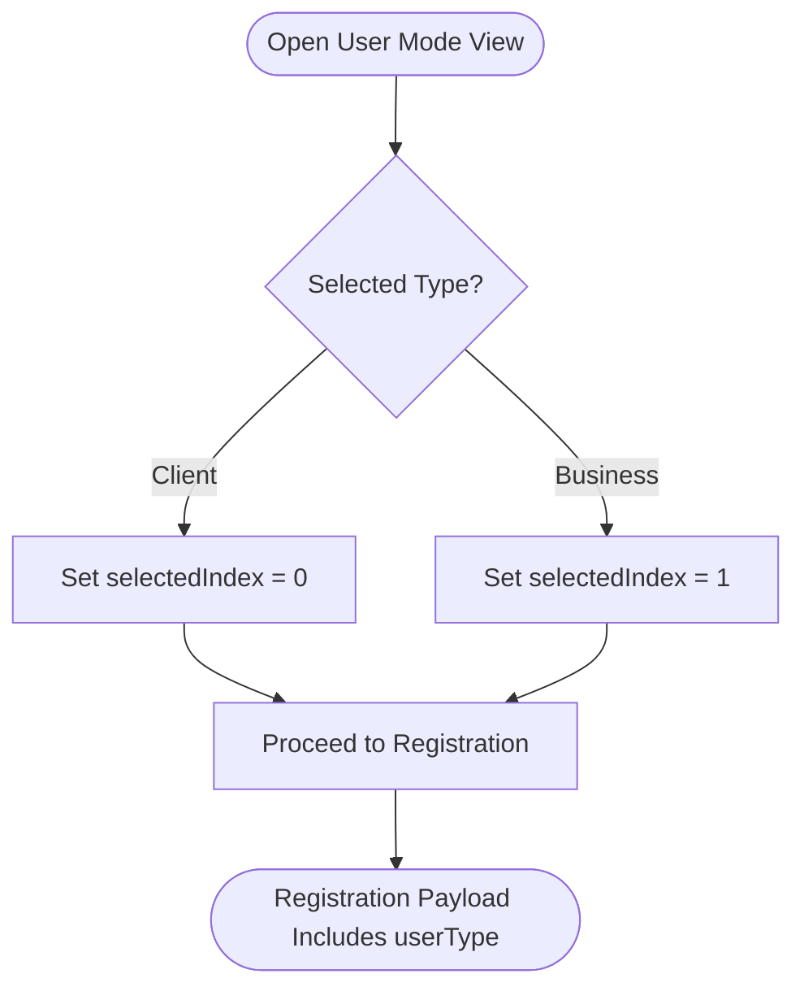

**Diagram sources**
- [lib/features/auth/controller/user_mode_controller.dart](file://lib/features/auth/controller/user_mode_controller.dart)
- [lib/features/auth/views/user_mode_view.dart](file://lib/features/auth/views/user_mode_view.dart)
- [lib/features/auth/views/signup_option_view.dart](file://lib/features/auth/views/signup_option_view.dart)
- [lib/features/auth/controller/signup_option_controller.dart](file://lib/features/auth/controller/signup_option_controller.dart)
- [lib/features/auth/controller/signup_controller.dart:35-37](file://lib/features/auth/controller/signup_controller.dart#L35-L37)

**Section sources**
- [lib/features/auth/controller/user_mode_controller.dart](file://lib/features/auth/controller/user_mode_controller.dart)
- [lib/features/auth/views/user_mode_view.dart](file://lib/features/auth/views/user_mode_view.dart)
- [lib/features/auth/views/signup_option_view.dart](file://lib/features/auth/views/signup_option_view.dart)
- [lib/features/auth/controller/signup_option_controller.dart](file://lib/features/auth/controller/signup_option_controller.dart)
- [lib/features/auth/controller/signup_controller.dart:35-37](file://lib/features/auth/controller/signup_controller.dart#L35-L37)

### Registration and Email Verification
- Registration collects personal/business details, validates terms, and submits to repository.
- Repository executes registration and returns a token; controller persists token and navigates to email verification.
- Email verification view/controller handles verification flow.

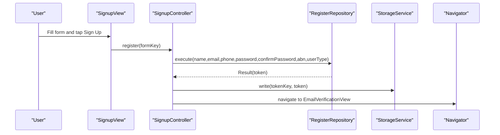

**Diagram sources**
- [lib/features/auth/views/signup_view.dart:78-88](file://lib/features/auth/views/signup_view.dart#L78-L88)
- [lib/features/auth/controller/signup_controller.dart:25-54](file://lib/features/auth/controller/signup_controller.dart#L25-L54)
- [lib/features/auth/repositories/register_repo.dart](file://lib/features/auth/repositories/register_repo.dart)
- [lib/features/auth/views/email_verification_view.dart](file://lib/features/auth/views/email_verification_view.dart)
- [lib/features/auth/controller/email_verification_controller.dart](file://lib/features/auth/controller/email_verification_controller.dart)

**Section sources**
- [lib/features/auth/controller/signup_controller.dart:10-66](file://lib/features/auth/controller/signup_controller.dart#L10-L66)
- [lib/features/auth/views/signup_view.dart:18-96](file://lib/features/auth/views/signup_view.dart#L18-L96)
- [lib/features/auth/repositories/register_repo.dart](file://lib/features/auth/repositories/register_repo.dart)
- [lib/features/auth/views/email_verification_view.dart](file://lib/features/auth/views/email_verification_view.dart)
- [lib/features/auth/controller/email_verification_controller.dart](file://lib/features/auth/controller/email_verification_controller.dart)

### Login and Token Persistence
- Login view validates credentials and delegates to repository.
- On success, token is persisted and user is navigated to bottom navigation.

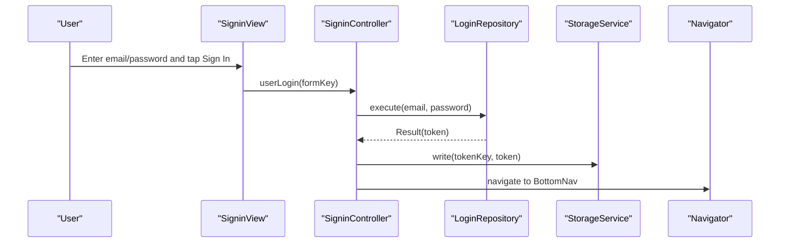

**Diagram sources**
- [lib/features/auth/views/signin_view.dart:58-61](file://lib/features/auth/views/signin_view.dart#L58-L61)
- [lib/features/auth/controller/signin_controller.dart:17-36](file://lib/features/auth/controller/signin_controller.dart#L17-L36)
- [lib/features/auth/repositories/login_repo.dart](file://lib/features/auth/repositories/login_repo.dart)
- [lib/core/data/local/storage_service.dart](file://lib/core/data/local/storage_service.dart)

**Section sources**
- [lib/features/auth/controller/signin_controller.dart:9-51](file://lib/features/auth/controller/signin_controller.dart#L9-L51)
- [lib/features/auth/views/signin_view.dart:17-93](file://lib/features/auth/views/signin_view.dart#L17-L93)
- [lib/features/auth/repositories/login_repo.dart](file://lib/features/auth/repositories/login_repo.dart)

### Google Login Authentication System
- **New Component**: GoogleLoginController manages Google authentication flow with reactive loading states.
- **New Component**: GoogleLoginRepository handles HTTP requests for Google authentication with proper headers and token handling.
- **New Component**: GoogleLoginModel provides comprehensive user data structures including nested User, TokenResponse, and ProviderData models.
- **Enhanced Service**: FirebaseGoogleAuthService now returns standardized GoogleUserInfoModel for consistent data handling.
- **Integration**: Google login button in OnboardLogin widget integrates with both Firebase service and custom GoogleLoginController.

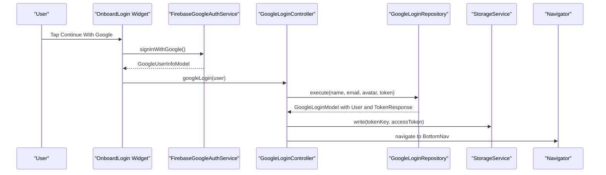

**Diagram sources**
- [lib/features/auth/widgets/onboard_login.dart:35-42](file://lib/features/auth/widgets/onboard_login.dart#L35-L42)
- [lib/core/services/firebase_google_auth.dart:15-58](file://lib/core/services/firebase_google_auth.dart#L15-L58)
- [lib/features/auth/controller/google_login_controller.dart:15-37](file://lib/features/auth/controller/google_login_controller.dart#L15-L37)
- [lib/features/auth/repositories/google_login_repo.dart:12-29](file://lib/features/auth/repositories/google_login_repo.dart#L12-L29)
- [lib/features/auth/models/google_login_model.dart:14-34](file://lib/features/auth/models/google_login_model.dart#L14-L34)

**Section sources**
- [lib/features/auth/controller/google_login_controller.dart:1-38](file://lib/features/auth/controller/google_login_controller.dart#L1-L38)
- [lib/features/auth/models/google_login_model.dart:1-263](file://lib/features/auth/models/google_login_model.dart#L1-L263)
- [lib/features/auth/repositories/google_login_repo.dart:1-30](file://lib/features/auth/repositories/google_login_repo.dart#L1-L30)
- [lib/core/data/global_models/google_user_info_model.dart:1-21](file://lib/core/data/global_models/google_user_info_model.dart#L1-L21)
- [lib/features/auth/widgets/onboard_login.dart:1-85](file://lib/features/auth/widgets/onboard_login.dart#L1-L85)
- [lib/core/services/firebase_google_auth.dart:6-69](file://lib/core/services/firebase_google_auth.dart#L6-L69)

### OTP Verification
- OTP view/controller coordinates user input and verification submission.
- Integrates with backend verification endpoint via repository pattern.

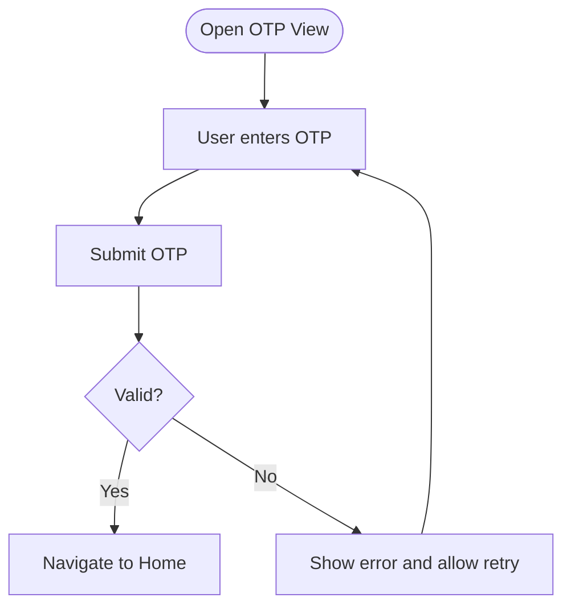

**Diagram sources**
- [lib/features/auth/views/otp_view.dart](file://lib/features/auth/views/otp_view.dart)
- [lib/features/auth/controller/otp_controller.dart](file://lib/features/auth/controller/otp_controller.dart)

**Section sources**
- [lib/features/auth/views/otp_view.dart](file://lib/features/auth/views/otp_view.dart)
- [lib/features/auth/controller/otp_controller.dart](file://lib/features/auth/controller/otp_controller.dart)

### Password Reset and New Password
- Forgot password view/controller triggers reset initiation.
- New password view/controller sets a new password after verification.

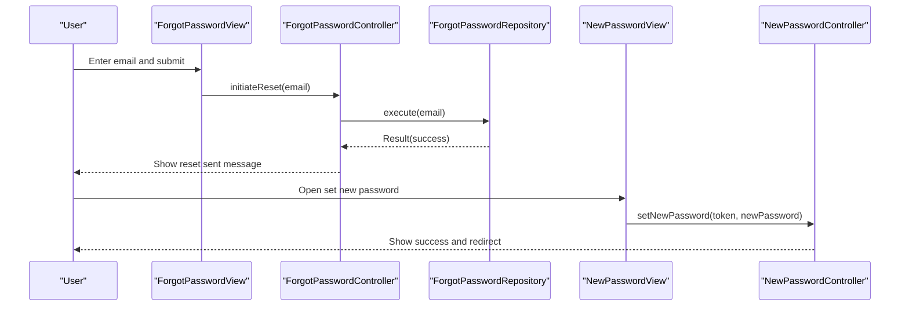

**Diagram sources**
- [lib/features/auth/views/forgot_password_view.dart](file://lib/features/auth/views/forgot_password_view.dart)
- [lib/features/auth/controller/forgot_password_controller.dart](file://lib/features/auth/controller/forgot_password_controller.dart)
- [lib/features/auth/repositories/forgot_password_repo.dart](file://lib/features/auth/repositories/forgot_password_repo.dart)
- [lib/features/auth/views/new_password_view.dart](file://lib/features/auth/views/new_password_view.dart)
- [lib/features/auth/controller/new_password_controller.dart](file://lib/features/auth/controller/new_password_controller.dart)

**Section sources**
- [lib/features/auth/views/forgot_password_view.dart](file://lib/features/auth/views/forgot_password_view.dart)
- [lib/features/auth/controller/forgot_password_controller.dart](file://lib/features/auth/controller/forgot_password_controller.dart)
- [lib/features/auth/repositories/forgot_password_repo.dart](file://lib/features/auth/repositories/forgot_password_repo.dart)
- [lib/features/auth/views/new_password_view.dart](file://lib/features/auth/views/new_password_view.dart)
- [lib/features/auth/controller/new_password_controller.dart](file://lib/features/auth/controller/new_password_controller.dart)

### Logout Functionality
- Logout controller manages logout process with reactive loading states.
- Repository handles HTTP logout request and token cleanup.
- Navigates to sign-in view regardless of logout success/failure.

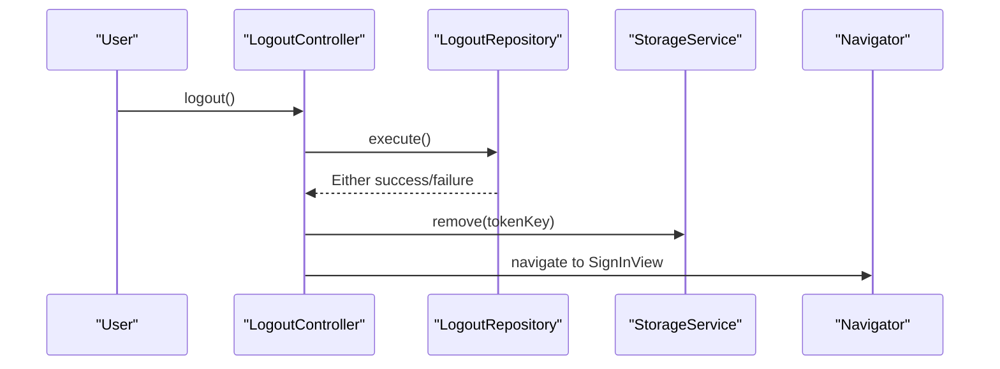

**Diagram sources**
- [lib/features/auth/controller/logout_controller.dart:13-28](file://lib/features/auth/controller/logout_controller.dart#L13-L28)
- [lib/features/auth/repositories/logout_repo.dart:12-19](file://lib/features/auth/repositories/logout_repo.dart#L12-L19)

**Section sources**
- [lib/features/auth/controller/logout_controller.dart:1-30](file://lib/features/auth/controller/logout_controller.dart#L1-L30)
- [lib/features/auth/repositories/logout_repo.dart:1-21](file://lib/features/auth/repositories/logout_repo.dart#L1-L21)

### Google Sign-In Integration
- Service wrapper integrates Google Sign-In with Firebase Auth.
- Provides sign-in and sign-out operations returning user info or null on failure.
- Enhanced with platform-specific configurations for Android and iOS.

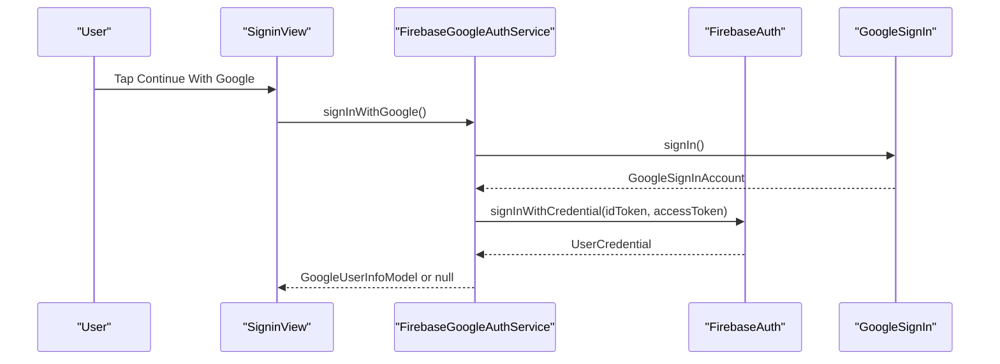

**Diagram sources**
- [lib/core/services/firebase_google_auth.dart:15-58](file://lib/core/services/firebase_google_auth.dart#L15-L58)
- [lib/features/auth/views/signin_view.dart:73-86](file://lib/features/auth/views/signin_view.dart#L73-L86)

**Section sources**
- [lib/core/services/firebase_google_auth.dart:6-69](file://lib/core/services/firebase_google_auth.dart#L6-L69)
- [lib/features/auth/views/signin_view.dart:73-86](file://lib/features/auth/views/signin_view.dart#L73-L86)

## Dependency Analysis
- Bindings: AuthBindings wires controllers and repositories for lazy loading.
- OnboardBindings: New binding specifically for Google authentication components.
- Controllers depend on repositories and shared services (storage, routes).
- Views depend on controllers and reactive state via Obx.
- Models are consumed by repositories and passed to APIs.
- Google authentication components integrate with Firebase configuration.

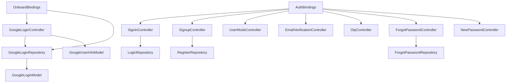

**Diagram sources**
- [lib/features/auth/bindings/auth_bindings.dart:13-28](file://lib/features/auth/bindings/auth_bindings.dart#L13-L28)
- [lib/features/auth/bindings/onboard_bindings.dart:6-12](file://lib/features/auth/bindings/onboard_bindings.dart#L6-L12)
- [lib/features/auth/controller/signin_controller.dart:9-11](file://lib/features/auth/controller/signin_controller.dart#L9-L11)
- [lib/features/auth/controller/signup_controller.dart:10-13](file://lib/features/auth/controller/signup_controller.dart#L10-L13)
- [lib/features/auth/repositories/login_repo.dart](file://lib/features/auth/repositories/login_repo.dart)
- [lib/features/auth/repositories/register_repo.dart](file://lib/features/auth/repositories/register_repo.dart)
- [lib/features/auth/repositories/forgot_password_repo.dart](file://lib/features/auth/repositories/forgot_password_repo.dart)
- [lib/features/auth/controller/google_login_controller.dart:9-11](file://lib/features/auth/controller/google_login_controller.dart#L9-L11)
- [lib/features/auth/repositories/google_login_repo.dart:8-10](file://lib/features/auth/repositories/google_login_repo.dart#L8-L10)
- [lib/core/data/global_models/google_user_info_model.dart:1-21](file://lib/core/data/global_models/google_user_info_model.dart#L1-L21)
- [lib/features/auth/models/google_login_model.dart:1-263](file://lib/features/auth/models/google_login_model.dart#L1-L263)

**Section sources**
- [lib/features/auth/bindings/auth_bindings.dart:13-28](file://lib/features/auth/bindings/auth_bindings.dart#L13-L28)
- [lib/features/auth/bindings/onboard_bindings.dart:1-13](file://lib/features/auth/bindings/onboard_bindings.dart#L1-L13)

## Performance Considerations
- Reactive state updates: Prefer Obx for granular UI refreshes to avoid unnecessary rebuilds.
- Lazy loading: Get.lazyPut defers instantiation until needed, reducing startup overhead.
- Gesture handling: Clamp drag offsets and throttle animations to prevent excessive recomposition.
- Token persistence: Persist tokens efficiently to avoid repeated login attempts.
- Network calls: Debounce form submissions and show loading indicators to improve UX and reduce redundant requests.
- **New**: Google authentication caching: Store user tokens locally to minimize repeated authentication flows.
- **New**: Platform-specific optimizations: Leverage native Google Sign-In SDKs for better performance on Android/iOS.

## Troubleshooting Guide
- Authentication errors: Catch and surface user-friendly messages via snackbars; log underlying exceptions for diagnostics.
- Form validation failures: Ensure form keys are properly scoped and validators return clear feedback.
- Navigation issues: Verify route names and binding registrations to prevent runtime navigation errors.
- Google sign-in failures: Handle cancellation and error cases gracefully; confirm Google Play services availability on Android devices.
- Token persistence: Confirm storage keys and secure token handling to prevent unauthorized access.
- **New**: Google authentication issues: Verify Firebase configuration for both Android and iOS platforms; check Google Services JSON and Plist files.
- **New**: Platform-specific problems: Ensure proper Firebase initialization for each platform with correct configuration values.
- **New**: Google login errors: Check network connectivity, verify OAuth client IDs, and ensure proper Firebase Auth configuration.

**Section sources**
- [lib/features/auth/controller/signin_controller.dart:25-34](file://lib/features/auth/controller/signin_controller.dart#L25-L34)
- [lib/features/auth/controller/signup_controller.dart:40-52](file://lib/features/auth/controller/signup_controller.dart#L40-L52)
- [lib/core/services/firebase_google_auth.dart:51-57](file://lib/core/services/firebase_google_auth.dart#L51-L57)
- [lib/features/auth/controller/google_login_controller.dart:24-27](file://lib/features/auth/controller/google_login_controller.dart#L24-L27)
- [lib/firebase_options.dart:18-69](file://lib/firebase_options.dart#L18-L69)

## Conclusion
The Authentication System leverages a clean MVVM architecture with GetX for state management and DI. It supports a complete user journey from onboarding to verified login, with robust integration for Google Sign-In and extensible repositories for backend interactions. The newly added Google Login Authentication System provides comprehensive support for social authentication with proper error handling, token management, and platform-specific configurations for Android and iOS. The modular design ensures maintainability and scalability across authentication flows, with enhanced security considerations and performance optimizations for modern mobile applications.