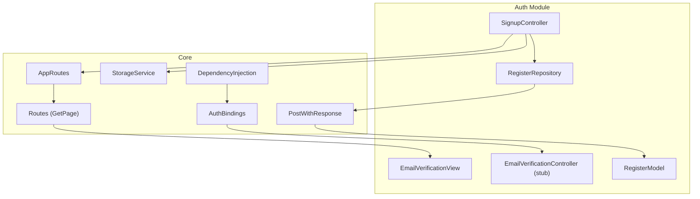
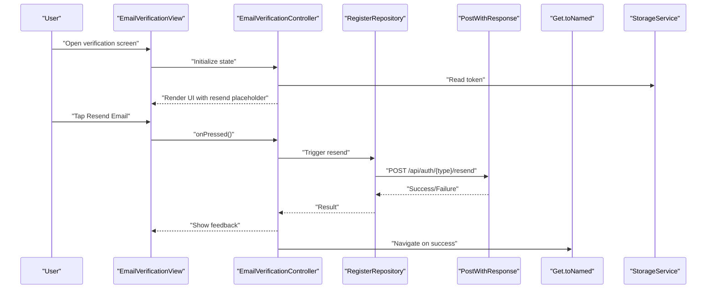
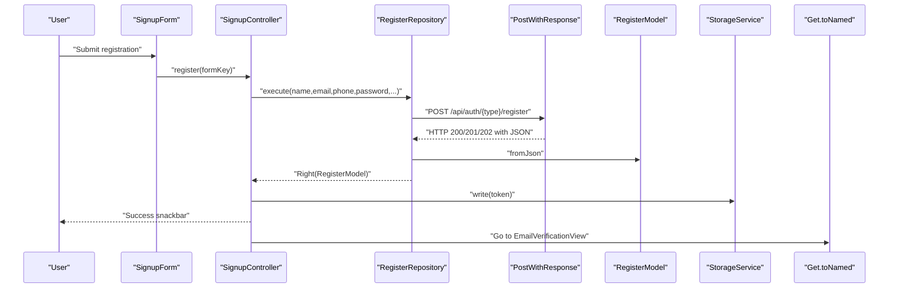
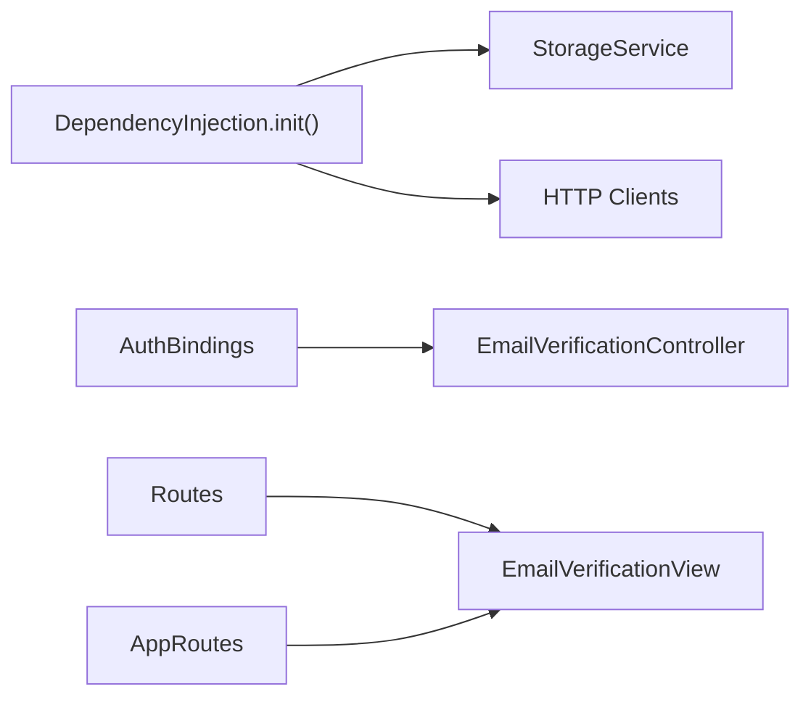
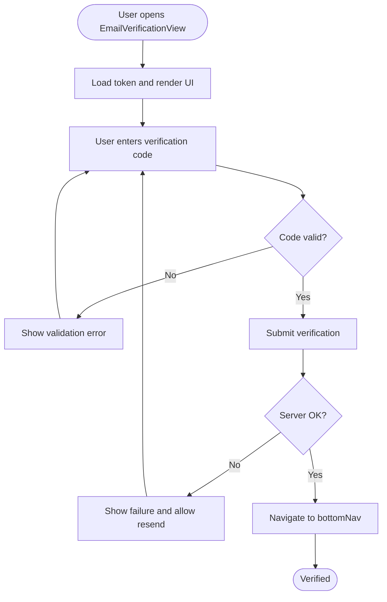
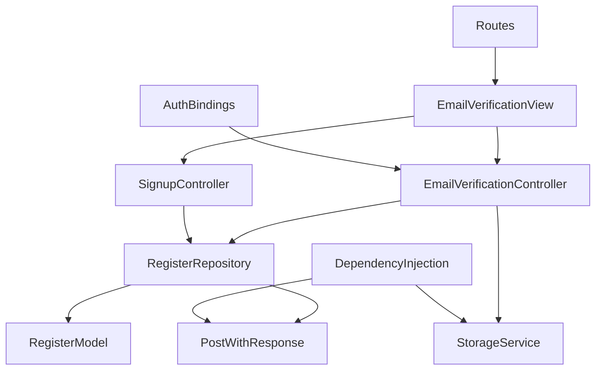

# Email Verification

<cite>
**Referenced Files in This Document**
- [email_verification_controller.dart](file://lib/features/auth/controller/email_verification_controller.dart)
- [email_verification_view.dart](file://lib/features/auth/views/email_verification_view.dart)
- [signup_controller.dart](file://lib/features/auth/controller/signup_controller.dart)
- [register_repo.dart](file://lib/features/auth/repositories/register_repo.dart)
- [register_model.dart](file://lib/features/auth/models/register_model.dart)
- [post_with_response.dart](file://lib/core/data/networks/post_with_response.dart)
- [app_routes.dart](file://lib/core/routes/app_routes.dart)
- [routes.dart](file://lib/core/routes/routes.dart)
- [auth_bindings.dart](file://lib/features/auth/bindings/auth_bindings.dart)
- [storage_service.dart](file://lib/core/data/local/storage_service.dart)
- [dependency_injection.dart](file://lib/core/di/dependency_injection.dart)
- [main.dart](file://lib/main.dart)
</cite>

## Table of Contents
1. [Introduction](#introduction)
2. [Project Structure](#project-structure)
3. [Core Components](#core-components)
4. [Architecture Overview](#architecture-overview)
5. [Detailed Component Analysis](#detailed-component-analysis)
6. [Dependency Analysis](#dependency-analysis)
7. [Performance Considerations](#performance-considerations)
8. [Troubleshooting Guide](#troubleshooting-guide)
9. [Conclusion](#conclusion)

## Introduction
This document describes the Email Verification component in the application. It explains the end-to-end workflow from initiating registration to navigating to the verified state, including the current UI and controller stubs, the registration flow that triggers email verification, and the integration points with routing, dependency injection, and storage. It also outlines the missing pieces for verification code entry, resend functionality, timer-based resend logic, and verification status management, along with recommended implementations and security considerations.

## Project Structure
The Email Verification feature is part of the Authentication module and integrates with the broader routing and DI systems:
- Views: EmailVerificationView renders the verification prompt and a placeholder for Resend Email.
- Controllers: EmailVerificationController is currently a stub; SignupController orchestrates registration and navigates to the verification screen after a successful server response.
- Repositories and Models: RegisterRepository performs the registration request; RegisterModel encapsulates the server response including the token.
- Routing: EmailVerificationView is registered under a named route and bound via AuthBindings.
- DI: Dependencies are provisioned globally and per-binding; EmailVerificationController is registered via AuthBindings.

**Diagram sources**
- [email_verification_view.dart:13-69](file://lib/features/auth/views/email_verification_view.dart#L13-L69)
- [email_verification_controller.dart:1-3](file://lib/features/auth/controller/email_verification_controller.dart#L1-L3)
- [signup_controller.dart:10-67](file://lib/features/auth/controller/signup_controller.dart#L10-L67)
- [register_repo.dart:9-39](file://lib/features/auth/repositories/register_repo.dart#L9-L39)
- [register_model.dart:1-74](file://lib/features/auth/models/register_model.dart#L1-L74)
- [post_with_response.dart:7-45](file://lib/core/data/networks/post_with_response.dart#L7-L45)
- [app_routes.dart:1-34](file://lib/core/routes/app_routes.dart#L1-L34)
- [routes.dart:106-110](file://lib/core/routes/routes.dart#L106-L110)
- [auth_bindings.dart:13-29](file://lib/features/auth/bindings/auth_bindings.dart#L13-L29)
- [dependency_injection.dart:11-27](file://lib/core/di/dependency_injection.dart#L11-L27)

**Section sources**
- [email_verification_view.dart:13-69](file://lib/features/auth/views/email_verification_view.dart#L13-L69)
- [email_verification_controller.dart:1-3](file://lib/features/auth/controller/email_verification_controller.dart#L1-L3)
- [signup_controller.dart:10-67](file://lib/features/auth/controller/signup_controller.dart#L10-L67)
- [register_repo.dart:9-39](file://lib/features/auth/repositories/register_repo.dart#L9-L39)
- [register_model.dart:1-74](file://lib/features/auth/models/register_model.dart#L1-L74)
- [post_with_response.dart:7-45](file://lib/core/data/networks/post_with_response.dart#L7-L45)
- [app_routes.dart:1-34](file://lib/core/routes/app_routes.dart#L1-L34)
- [routes.dart:106-110](file://lib/core/routes/routes.dart#L106-L110)
- [auth_bindings.dart:13-29](file://lib/features/auth/bindings/auth_bindings.dart#L13-L29)
- [dependency_injection.dart:11-27](file://lib/core/di/dependency_injection.dart#L11-L27)

## Core Components
- EmailVerificationView: Stateless UI displaying the verification prompt, email address, optional “Check My Inbox” action, and a placeholder for “Resend Email.”
- EmailVerificationController: Current implementation is a Getx controller stub; future implementation should manage verification state, resend timer, and validation.
- SignupController: Executes registration, stores the returned token, shows success feedback, and navigates to the EmailVerificationView.
- RegisterRepository: Encapsulates the registration HTTP request and parses the response into RegisterModel.
- RegisterModel: Describes the server response shape including token and user fields.
- PostWithResponse: Generic HTTP client wrapper returning Either<ErrorModel, T>.
- Routing and DI: AppRoutes defines the route name; Routes registers the page and binding; AuthBindings registers EmailVerificationController; DependencyInjection wires core services.

**Section sources**
- [email_verification_view.dart:13-69](file://lib/features/auth/views/email_verification_view.dart#L13-L69)
- [email_verification_controller.dart:1-3](file://lib/features/auth/controller/email_verification_controller.dart#L1-L3)
- [signup_controller.dart:10-67](file://lib/features/auth/controller/signup_controller.dart#L10-L67)
- [register_repo.dart:9-39](file://lib/features/auth/repositories/register_repo.dart#L9-L39)
- [register_model.dart:1-74](file://lib/features/auth/models/register_model.dart#L1-L74)
- [post_with_response.dart:7-45](file://lib/core/data/networks/post_with_response.dart#L7-L45)
- [app_routes.dart:1-34](file://lib/core/routes/app_routes.dart#L1-L34)
- [routes.dart:106-110](file://lib/core/routes/routes.dart#L106-L110)
- [auth_bindings.dart:13-29](file://lib/features/auth/bindings/auth_bindings.dart#L13-L29)
- [dependency_injection.dart:11-27](file://lib/core/di/dependency_injection.dart#L11-L27)

## Architecture Overview
The Email Verification workflow begins after registration. The client stores the token, navigates to the verification screen, and awaits user action (checking inbox or resending). The current implementation does not include verification code entry, resend timer, or status checks. The following conceptual architecture shows the intended flow and integration points.

[No sources needed since this diagram shows conceptual workflow, not actual code structure]

## Detailed Component Analysis

### EmailVerificationView
- Purpose: Presents the user with a message indicating an email was sent and provides actions like checking the inbox and resending.
- Current behavior:
  - Displays the recipient email from the SignupController’s email field.
  - Provides a button to navigate to the bottom navigation.
  - Includes a placeholder for “Resend Email” with an empty tap handler.
- Recommendations:
  - Add a verification code input and submit button.
  - Implement resend logic with a timer and disabled UI while resending.
  - Integrate with EmailVerificationController for state management.

**Section sources**
- [email_verification_view.dart:13-69](file://lib/features/auth/views/email_verification_view.dart#L13-L69)

### EmailVerificationController
- Current state: Empty Getx controller stub.
- Required responsibilities:
  - Manage verification code input state.
  - Validate verification code length/format.
  - Trigger resend with rate-limiting/timer.
  - Track verification status and navigate on success.
  - Persist and refresh token/state as needed.
- Implementation pattern:
  - Use Rx fields for UI state (isLoading, isResendEnabled, timeRemaining).
  - Use Get.find<SomeRepository>() to call backend APIs.
  - Use Get.snackbar or similar for user feedback.

**Section sources**
- [email_verification_controller.dart:1-3](file://lib/features/auth/controller/email_verification_controller.dart#L1-L3)

### Registration Flow and Token Management
- SignupController.register:
  - Validates form, calls RegisterRepository.execute, stores token via StorageService, shows success snackbar, and navigates to EmailVerificationView.
- RegisterRepository.execute:
  - Sends a POST request to the registration endpoint with user data and parses the response into RegisterModel.
- RegisterModel:
  - Contains token and user metadata; emailVerifiedAt indicates verification status.
- StorageService:
  - Provides read/write/remove/clear for persisted keys (e.g., token).

**Diagram sources**
- [signup_controller.dart:25-54](file://lib/features/auth/controller/signup_controller.dart#L25-L54)
- [register_repo.dart:14-37](file://lib/features/auth/repositories/register_repo.dart#L14-L37)
- [post_with_response.dart:9-43](file://lib/core/data/networks/post_with_response.dart#L9-L43)
- [register_model.dart:7-20](file://lib/features/auth/models/register_model.dart#L7-L20)
- [storage_service.dart:7-17](file://lib/core/data/local/storage_service.dart#L7-L17)

**Section sources**
- [signup_controller.dart:25-54](file://lib/features/auth/controller/signup_controller.dart#L25-L54)
- [register_repo.dart:14-37](file://lib/features/auth/repositories/register_repo.dart#L14-L37)
- [post_with_response.dart:9-43](file://lib/core/data/networks/post_with_response.dart#L9-L43)
- [register_model.dart:7-20](file://lib/features/auth/models/register_model.dart#L7-L20)
- [storage_service.dart:7-17](file://lib/core/data/local/storage_service.dart#L7-L17)

### Routing and Dependency Injection
- Route registration:
  - EmailVerificationView is mapped to AppRoutes.emailVerificationView via GetPage.
- Binding:
  - AuthBindings registers EmailVerificationController for the Auth module.
- Global DI:
  - DependencyInjection initializes StorageService, ThemeService, and HTTP clients; returns stored token for app initialization.

**Diagram sources**
- [routes.dart:106-110](file://lib/core/routes/routes.dart#L106-L110)
- [auth_bindings.dart:13-29](file://lib/features/auth/bindings/auth_bindings.dart#L13-L29)
- [dependency_injection.dart:11-27](file://lib/core/di/dependency_injection.dart#L11-L27)
- [app_routes.dart:12](file://lib/core/routes/app_routes.dart#L12)

**Section sources**
- [routes.dart:106-110](file://lib/core/routes/routes.dart#L106-L110)
- [auth_bindings.dart:13-29](file://lib/features/auth/bindings/auth_bindings.dart#L13-L29)
- [dependency_injection.dart:11-27](file://lib/core/di/dependency_injection.dart#L11-L27)
- [app_routes.dart:12](file://lib/core/routes/app_routes.dart#L12)

### Conceptual Verification Workflow
The following flow illustrates the desired end-to-end process, including verification code entry, resend logic, and status transitions.

[No sources needed since this diagram shows conceptual workflow, not actual code structure]

## Dependency Analysis
- EmailVerificationView depends on:
  - Get dependencies for routing and theme.
  - SignupController to display the email address.
- EmailVerificationController depends on:
  - Repositories/services for resend and verification requests.
  - StorageService for token persistence.
  - Get.snackbar for user feedback.
- SignupController depends on:
  - RegisterRepository for registration.
  - StorageService for token storage.
  - AppRoutes for navigation.
- RegisterRepository depends on:
  - PostWithResponse for HTTP calls.
  - RegisterModel for parsing.
- Routing and DI:
  - AuthBindings registers EmailVerificationController.
  - Routes binds EmailVerificationView to AppRoutes.emailVerificationView.
  - DependencyInjection wires StorageService and HTTP clients.

**Diagram sources**
- [email_verification_view.dart:37-37](file://lib/features/auth/views/email_verification_view.dart#L37-L37)
- [email_verification_controller.dart:1-3](file://lib/features/auth/controller/email_verification_controller.dart#L1-L3)
- [signup_controller.dart:10-13](file://lib/features/auth/controller/signup_controller.dart#L10-L13)
- [register_repo.dart:9-12](file://lib/features/auth/repositories/register_repo.dart#L9-L12)
- [post_with_response.dart:7-8](file://lib/core/data/networks/post_with_response.dart#L7-L8)
- [register_model.dart:1-5](file://lib/features/auth/models/register_model.dart#L1-L5)
- [routes.dart:106-110](file://lib/core/routes/routes.dart#L106-L110)
- [auth_bindings.dart:26-26](file://lib/features/auth/bindings/auth_bindings.dart#L26-L26)
- [dependency_injection.dart:14-20](file://lib/core/di/dependency_injection.dart#L14-L20)

**Section sources**
- [email_verification_view.dart:37-37](file://lib/features/auth/views/email_verification_view.dart#L37-L37)
- [email_verification_controller.dart:1-3](file://lib/features/auth/controller/email_verification_controller.dart#L1-L3)
- [signup_controller.dart:10-13](file://lib/features/auth/controller/signup_controller.dart#L10-L13)
- [register_repo.dart:9-12](file://lib/features/auth/repositories/register_repo.dart#L9-L12)
- [post_with_response.dart:7-8](file://lib/core/data/networks/post_with_response.dart#L7-L8)
- [register_model.dart:1-5](file://lib/features/auth/models/register_model.dart#L1-L5)
- [routes.dart:106-110](file://lib/core/routes/routes.dart#L106-L110)
- [auth_bindings.dart:26-26](file://lib/features/auth/bindings/auth_bindings.dart#L26-L26)
- [dependency_injection.dart:14-20](file://lib/core/di/dependency_injection.dart#L14-L20)

## Performance Considerations
- UI responsiveness:
  - Debounce resend taps to prevent rapid repeated requests.
  - Disable input fields during network operations.
- Network efficiency:
  - Reuse HttpClient instances via PostWithResponse.
  - Apply exponential backoff for resend retries if supported by backend.
- State management:
  - Keep verification state minimal and reactive to reduce rebuilds.
- Navigation:
  - Avoid unnecessary route rebuilds by passing only required data.

[No sources needed since this section provides general guidance]

## Troubleshooting Guide
- Resend Email placeholder:
  - The “Resend Email” action is currently a placeholder. Implement a method in EmailVerificationController to trigger resend and update UI state.
- Verification code entry:
  - Add a form field and validation logic to ensure the code matches expected format and length.
- Timeout handling:
  - Track remaining time for resend cooldown and re-enable controls accordingly.
- User feedback:
  - Use Get.snackbar or similar to inform users of success, validation errors, and network failures.
- Token lifecycle:
  - Ensure token is cleared or refreshed appropriately after verification or on logout.

**Section sources**
- [email_verification_view.dart:53-63](file://lib/features/auth/views/email_verification_view.dart#L53-L63)
- [email_verification_controller.dart:1-3](file://lib/features/auth/controller/email_verification_controller.dart#L1-L3)

## Conclusion
The Email Verification feature currently provides a UI scaffold and a registration flow that leads to the verification screen. To complete the feature, implement EmailVerificationController with verification code validation, resend logic with timers, and integration with backend endpoints for verification and resend. Align the UI with the controller state, ensure robust error handling and user feedback, and maintain secure token management and DI wiring.