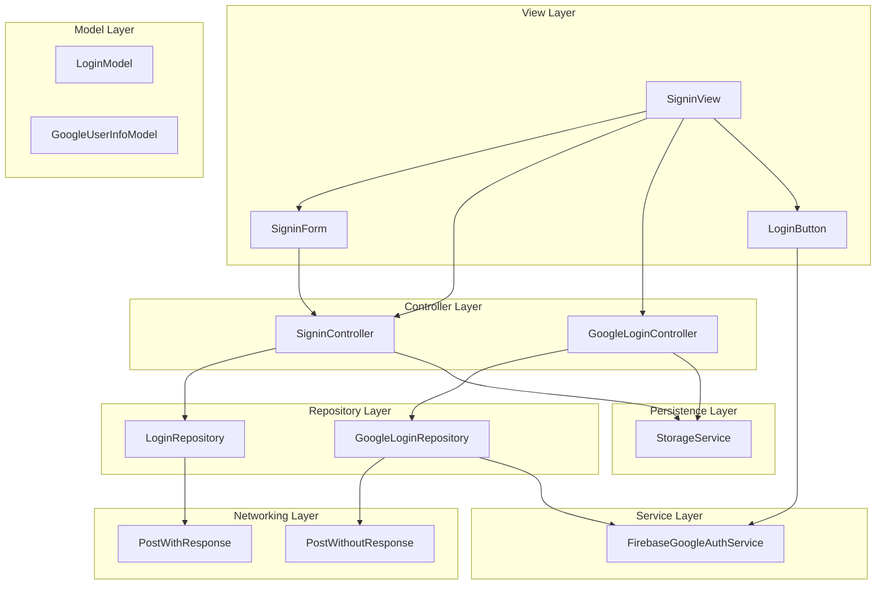
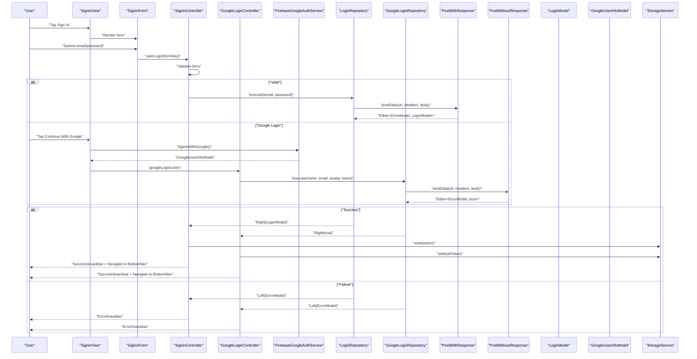
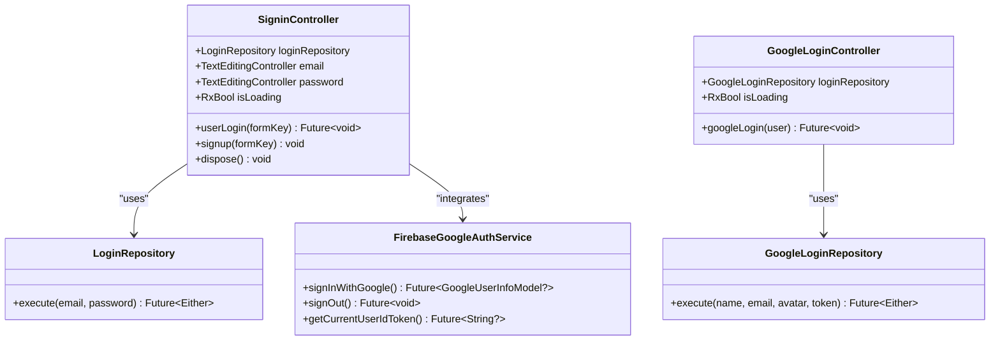
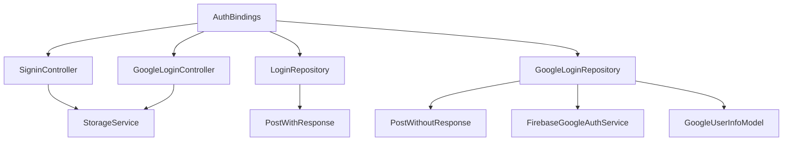

# Login System

<cite>
**Referenced Files in This Document**
- [signin_controller.dart](file://lib/features/auth/controller/signin_controller.dart)
- [google_login_controller.dart](file://lib/features/auth/controller/google_login_controller.dart)
- [login_repo.dart](file://lib/features/auth/repositories/login_repo.dart)
- [google_login_repo.dart](file://lib/features/auth/repositories/google_login_repo.dart)
- [login_model.dart](file://lib/features/auth/models/login_model.dart)
- [signin_view.dart](file://lib/features/auth/views/signin_view.dart)
- [signin_form.dart](file://lib/features/auth/widgets/signin_form.dart)
- [login_button.dart](file://lib/features/auth/widgets/login_button.dart)
- [auth_helper.dart](file://lib/features/auth/widgets/auth_helper.dart)
- [email_validator.dart](file://lib/shared/extensions/validators/email_validator.dart)
- [password_validator.dart](file://lib/shared/extensions/validators/password_validator.dart)
- [storage_service.dart](file://lib/core/data/local/storage_service.dart)
- [post_with_response.dart](file://lib/core/data/networks/post_with_response.dart)
- [post_without_response.dart](file://lib/core/data/networks/post_without_response.dart)
- [firebase_google_auth.dart](file://lib/core/services/firebase_google_auth.dart)
- [google_user_info_model.dart](file://lib/core/data/global_models/google_user_info_model.dart)
- [auth_bindings.dart](file://lib/features/auth/bindings/auth_bindings.dart)
</cite>

## Update Summary
**Changes Made**
- Added comprehensive Google login integration with Firebase Authentication service
- Enhanced form validation with stricter email and password requirements
- Improved error handling with dedicated Google login error management
- Added separate GoogleLoginController for social authentication flows
- Integrated GoogleUserInfoModel for standardized user data handling
- Enhanced loading state management across both login methods

## Table of Contents
1. [Introduction](#introduction)
2. [Project Structure](#project-structure)
3. [Core Components](#core-components)
4. [Architecture Overview](#architecture-overview)
5. [Detailed Component Analysis](#detailed-component-analysis)
6. [Dependency Analysis](#dependency-analysis)
7. [Performance Considerations](#performance-considerations)
8. [Security Considerations](#security-considerations)
9. [Troubleshooting Guide](#troubleshooting-guide)
10. [Conclusion](#conclusion)

## Introduction
This document describes the Login System component responsible for authenticating users via multiple methods including email/password, Google, and Apple authentication. The system now features enhanced Google login integration with Firebase Authentication, improved form validation with stricter requirements, and comprehensive error handling strategies. It manages loading states, handles various authentication methods, persists sessions, and provides seamless user experience across different login flows.

## Project Structure
The Login System now encompasses multiple authentication pathways:
- View layer: SigninView renders the sign-in screen with dual authentication options
- Form layer: SigninForm provides validated email/password input fields
- Controller layer: SigninController (email/password) and GoogleLoginController (social)
- Repository layer: LoginRepository (custom auth) and GoogleLoginRepository (Firebase auth)
- Model layer: LoginModel and GoogleUserInfoModel for response handling
- Persistence layer: StorageService for token management
- Networking layer: PostWithResponse and PostWithoutResponse for different request types
- Service layer: FirebaseGoogleAuthService for Google authentication integration

**Diagram sources**
- [signin_view.dart:20-106](file://lib/features/auth/views/signin_view.dart#L20-L106)
- [signin_form.dart:12-60](file://lib/features/auth/widgets/signin_form.dart#L12-L60)
- [signin_controller.dart:9-52](file://lib/features/auth/controller/signin_controller.dart#L9-L52)
- [google_login_controller.dart:9-36](file://lib/features/auth/controller/google_login_controller.dart#L9-L36)
- [login_repo.dart:9-29](file://lib/features/auth/repositories/login_repo.dart#L9-L29)
- [google_login_repo.dart:7-29](file://lib/features/auth/repositories/google_login_repo.dart#L7-L29)
- [login_model.dart:1-74](file://lib/features/auth/models/login_model.dart#L1-L74)
- [google_user_info_model.dart:1-21](file://lib/core/data/global_models/google_user_info_model.dart#L1-L21)
- [storage_service.dart:3-22](file://lib/core/data/local/storage_service.dart#L3-L22)
- [post_with_response.dart:7-44](file://lib/core/data/networks/post_with_response.dart#L7-L44)
- [post_without_response.dart:7-44](file://lib/core/data/networks/post_without_response.dart#L7-L44)
- [firebase_google_auth.dart:6-84](file://lib/core/services/firebase_google_auth.dart#L6-L84)

**Section sources**
- [signin_view.dart:20-106](file://lib/features/auth/views/signin_view.dart#L20-L106)
- [signin_form.dart:12-60](file://lib/features/auth/widgets/signin_form.dart#L12-L60)
- [signin_controller.dart:9-52](file://lib/features/auth/controller/signin_controller.dart#L9-L52)
- [google_login_controller.dart:9-36](file://lib/features/auth/controller/google_login_controller.dart#L9-L36)
- [login_repo.dart:9-29](file://lib/features/auth/repositories/login_repo.dart#L9-L29)
- [google_login_repo.dart:7-29](file://lib/features/auth/repositories/google_login_repo.dart#L7-L29)
- [login_model.dart:1-74](file://lib/features/auth/models/login_model.dart#L1-L74)
- [google_user_info_model.dart:1-21](file://lib/core/data/global_models/google_user_info_model.dart#L1-L21)
- [storage_service.dart:3-22](file://lib/core/data/local/storage_service.dart#L3-L22)
- [post_with_response.dart:7-44](file://lib/core/data/networks/post_with_response.dart#L7-L44)
- [post_without_response.dart:7-44](file://lib/core/data/networks/post_without_response.dart#L7-L44)
- [firebase_google_auth.dart:6-84](file://lib/core/services/firebase_google_auth.dart#L6-L84)

## Core Components
- **SigninView**: Enhanced with dual authentication options including Google and Apple login buttons alongside traditional form-based login
- **SigninForm**: Provides validated email and password fields with improved validation rules
- **SigninController**: Manages email/password authentication flow with loading states and error handling
- **GoogleLoginController**: Dedicated controller for Google authentication flow using Firebase services
- **LoginRepository**: Handles traditional email/password authentication with custom backend
- **GoogleLoginRepository**: Manages Google authentication through Firebase with Bearer token authorization
- **LoginModel**: Defines authentication response structure for custom backend
- **GoogleUserInfoModel**: Standardized model for Google user information including Firebase ID token
- **FirebaseGoogleAuthService**: Service layer for Google authentication integration with Firebase
- **StorageService**: Provides local storage for authentication tokens
- **PostWithResponse**: Handles authenticated requests with response parsing
- **PostWithoutResponse**: Handles unauthenticated requests returning boolean responses

**Section sources**
- [signin_view.dart:20-106](file://lib/features/auth/views/signin_view.dart#L20-L106)
- [signin_form.dart:12-60](file://lib/features/auth/widgets/signin_form.dart#L12-L60)
- [signin_controller.dart:9-52](file://lib/features/auth/controller/signin_controller.dart#L9-L52)
- [google_login_controller.dart:9-36](file://lib/features/auth/controller/google_login_controller.dart#L9-L36)
- [login_repo.dart:9-29](file://lib/features/auth/repositories/login_repo.dart#L9-L29)
- [google_login_repo.dart:7-29](file://lib/features/auth/repositories/google_login_repo.dart#L7-L29)
- [login_model.dart:1-74](file://lib/features/auth/models/login_model.dart#L1-L74)
- [google_user_info_model.dart:1-21](file://lib/core/data/global_models/google_user_info_model.dart#L1-L21)
- [firebase_google_auth.dart:6-84](file://lib/core/services/firebase_google_auth.dart#L6-L84)
- [storage_service.dart:3-22](file://lib/core/data/local/storage_service.dart#L3-L22)
- [post_with_response.dart:7-44](file://lib/core/data/networks/post_with_response.dart#L7-L44)
- [post_without_response.dart:7-44](file://lib/core/data/networks/post_without_response.dart#L7-L44)

## Architecture Overview
The Login System now supports multiple authentication pathways with enhanced error handling and loading state management:

**Diagram sources**
- [signin_view.dart:76-91](file://lib/features/auth/views/signin_view.dart#L76-L91)
- [signin_controller.dart:17-36](file://lib/features/auth/controller/signin_controller.dart#L17-L36)
- [google_login_controller.dart:15-34](file://lib/features/auth/controller/google_login_controller.dart#L15-L34)
- [firebase_google_auth.dart:15-63](file://lib/core/services/firebase_google_auth.dart#L15-L63)
- [login_repo.dart:14-27](file://lib/features/auth/repositories/login_repo.dart#L14-L27)
- [google_login_repo.dart:11-27](file://lib/features/auth/repositories/google_login_repo.dart#L11-L27)
- [post_with_response.dart:9-43](file://lib/core/data/networks/post_with_response.dart#L9-L43)
- [post_without_response.dart:9-43](file://lib/core/data/networks/post_without_response.dart#L9-L43)
- [login_model.dart:1-20](file://lib/features/auth/models/login_model.dart#L1-L20)
- [google_user_info_model.dart:1-21](file://lib/core/data/global_models/google_user_info_model.dart#L1-L21)

## Detailed Component Analysis

### Enhanced SigninController
The SigninController now focuses specifically on email/password authentication with improved error handling:

**Responsibilities:**
- Manages email and password form validation with strict requirements
- Executes LoginRepository for authentication requests
- Handles loading states with reactive UI updates
- Manages success/error feedback through snackbars
- Persists authentication tokens and navigates to main application

**Enhanced Features:**
- Strict form validation with comprehensive error messages
- Reactive loading state management using GetX observables
- Improved error handling with dedicated error snackbars
- Token persistence using Firebase ID token for consistency

**Diagram sources**
- [signin_controller.dart:9-52](file://lib/features/auth/controller/signin_controller.dart#L9-L52)
- [google_login_controller.dart:9-36](file://lib/features/auth/controller/google_login_controller.dart#L9-L36)
- [login_repo.dart:9-29](file://lib/features/auth/repositories/login_repo.dart#L9-L29)
- [google_login_repo.dart:7-29](file://lib/features/auth/repositories/google_login_repo.dart#L7-L29)
- [firebase_google_auth.dart:6-84](file://lib/core/services/firebase_google_auth.dart#L6-L84)

**Section sources**
- [signin_controller.dart:9-52](file://lib/features/auth/controller/signin_controller.dart#L9-L52)

### GoogleLoginController
**New Component** - Dedicated controller for Google authentication flow:

**Responsibilities:**
- Manages Google authentication state with loading indicators
- Coordinates with FirebaseGoogleAuthService for authentication
- Handles Google user information through GoogleLoginRepository
- Manages token persistence and user session establishment
- Provides comprehensive error handling for social authentication

**Key Behaviors:**
- Uses Firebase ID token for authentication consistency
- Implements proper loading state management
- Handles user avatar URL and profile information
- Integrates seamlessly with existing storage and routing systems

**Section sources**
- [google_login_controller.dart:9-36](file://lib/features/auth/controller/google_login_controller.dart#L9-L36)

### Enhanced LoginRepository
**Updated** - Maintains traditional email/password authentication:

**Responsibilities:**
- Handles POST requests to custom authentication endpoint
- Manages JSON encoding and response parsing
- Returns Either<ErrorModel, LoginModel> for error handling
- Integrates with PostWithResponse for network operations

**Network Details:**
- Endpoint: `/api/auth/login`
- Authentication: Standard email/password credentials
- Response: LoginModel with authentication token

**Section sources**
- [login_repo.dart:9-29](file://lib/features/auth/repositories/login_repo.dart#L9-L29)

### GoogleLoginRepository
**New Component** - Handles Google authentication with Firebase:

**Responsibilities:**
- Manages Google authentication through Firebase services
- Sends user information to backend with Bearer token authorization
- Handles unauthenticated requests returning boolean responses
- Integrates with PostWithoutResponse for simplified response handling

**Key Features:**
- Uses Firebase ID token for secure authentication
- Sends user profile information (name, email, avatar)
- Implements Bearer token authorization header
- Returns Either<ErrorModel, bool> for consistent error handling

**Section sources**
- [google_login_repo.dart:7-29](file://lib/features/auth/repositories/google_login_repo.dart#L7-L29)

### FirebaseGoogleAuthService
**New Component** - Centralized Google authentication service:

**Responsibilities:**
- Handles Google Sign-In flow using GoogleSignIn SDK
- Manages Firebase Authentication integration
- Extracts user information and Firebase ID tokens
- Provides sign-out functionality and user management

**Enhanced Features:**
- Comprehensive error handling for authentication failures
- Support for both Google and Firebase authentication flows
- User information extraction with fallback mechanisms
- Secure token management and user session handling

**Section sources**
- [firebase_google_auth.dart:6-84](file://lib/core/services/firebase_google_auth.dart#L6-L84)

### Enhanced SigninForm
**Updated** - Improved form validation with stricter requirements:

**Responsibilities:**
- Provides validated email and password input fields
- Integrates with authHelper for consistent styling
- Implements AutovalidateMode.onUserInteraction for responsive feedback
- Supports password strength requirements

**Enhanced Validation Rules:**
- **Email Validation**: Trims input, requires presence, validates format using RegExp
- **Password Validation**: Trims input, requires presence, enforces minimum 8 characters
- **Real-time Feedback**: Immediate validation feedback during user interaction
- **Localized Error Messages**: User-friendly error messages for validation failures

**Section sources**
- [signin_form.dart:12-60](file://lib/features/auth/widgets/signin_form.dart#L12-L60)
- [email_validator.dart:1-14](file://lib/shared/extensions/validators/email_validator.dart#L1-L14)
- [password_validator.dart:1-11](file://lib/shared/extensions/validators/password_validator.dart#L1-L11)

### GoogleUserInfoModel
**New Component** - Standardized user information model:

**Responsibilities:**
- Represents Google user information consistently
- Includes name, email, avatar URL, Firebase ID token, and UID
- Provides string representation for debugging and logging
- Supports interoperability between authentication systems

**Data Fields:**
- `name`: User's display name or Google display name
- `email`: User's email address
- `avatarUrl`: Profile picture URL or Google avatar URL
- `idToken`: Firebase ID token for authentication
- `uid`: Firebase user identifier

**Section sources**
- [google_user_info_model.dart:1-21](file://lib/core/data/global_models/google_user_info_model.dart#L1-L21)

### Enhanced Session Management
**Updated** - Improved token management across authentication methods:

**Key Improvements:**
- **Consistent Token Usage**: Both authentication methods use Firebase ID tokens
- **Enhanced Storage**: Improved token persistence with StorageService
- **Unified Navigation**: Consistent navigation to bottom navigation after authentication
- **Loading State Management**: Separate loading states for different authentication methods

**Token Handling:**
- Email/password: Stores backend-generated token
- Google: Stores Firebase ID token for consistency
- Unified approach ensures seamless user experience across methods

**Section sources**
- [signin_controller.dart:29-33](file://lib/features/auth/controller/signin_controller.dart#L29-L33)
- [google_login_controller.dart:28-32](file://lib/features/auth/controller/google_login_controller.dart#L28-L32)
- [storage_service.dart:5-22](file://lib/core/data/local/storage_service.dart#L5-L22)

### Enhanced Error Handling
**Updated** - Comprehensive error handling strategies:

**Multi-layer Error Management:**
- **Network Layer**: PostWithResponse and PostWithoutResponse handle HTTP errors
- **Repository Layer**: LoginRepository and GoogleLoginRepository manage business logic errors
- **Controller Layer**: SigninController and GoogleLoginController provide user feedback
- **Service Layer**: FirebaseGoogleAuthService handles Google authentication errors

**Error Handling Features:**
- **Specific Error Messages**: Contextual error messages for different failure scenarios
- **Consistent Snackbar Feedback**: Unified error presentation across all authentication methods
- **Logging Integration**: Debug prints for authentication flow troubleshooting
- **Graceful Degradation**: Fallback mechanisms for authentication failures

**Section sources**
- [signin_controller.dart:25-28](file://lib/features/auth/controller/signin_controller.dart#L25-L28)
- [google_login_controller.dart:24-27](file://lib/features/auth/controller/google_login_controller.dart#L24-L27)
- [firebase_google_auth.dart:56-62](file://lib/core/services/firebase_google_auth.dart#L56-L62)

### Enhanced Success Redirection Logic
**Updated** - Unified success handling across authentication methods:

**Success Flow:**
1. **Token Persistence**: Store authentication token in StorageService
2. **Success Notification**: Display success snackbar with user feedback
3. **Navigation**: Navigate to bottom navigation route for main application access
4. **State Management**: Clear loading states and reset form data

**Consistency Features:**
- **Uniform Experience**: Same success flow regardless of authentication method
- **Immediate Feedback**: Quick user notification for successful authentication
- **Seamless Transition**: Smooth navigation to main application interface

**Section sources**
- [signin_controller.dart:29-33](file://lib/features/auth/controller/signin_controller.dart#L29-L33)
- [google_login_controller.dart:28-32](file://lib/features/auth/controller/google_login_controller.dart#L28-L32)

### Enhanced Integration with Firebase Authentication Services
**New Feature** - Comprehensive Google authentication integration:

**Firebase Integration Features:**
- **Google Sign-In**: Native Google authentication flow using GoogleSignIn SDK
- **Firebase Authentication**: Seamless integration with Firebase Authentication
- **ID Token Management**: Automatic Firebase ID token extraction and usage
- **User Information Extraction**: Comprehensive user profile data collection

**Authentication Flow:**
1. **Google Sign-In**: User initiates Google authentication
2. **Credential Exchange**: Google credentials exchanged for Firebase tokens
3. **User Information**: Extract user profile information and Firebase ID token
4. **Backend Integration**: Send user information to backend with Bearer token
5. **Session Establishment**: Complete authentication and establish user session

**Section sources**
- [signin_view.dart:76-91](file://lib/features/auth/views/signin_view.dart#L76-L91)
- [firebase_google_auth.dart:15-63](file://lib/core/services/firebase_google_auth.dart#L15-L63)
- [google_login_repo.dart:17-26](file://lib/features/auth/repositories/google_login_repo.dart#L17-L26)

## Dependency Analysis
**Updated** - Enhanced dependency injection with new components:

**Diagram sources**
- [auth_bindings.dart:13-27](file://lib/features/auth/bindings/auth_bindings.dart#L13-L27)
- [signin_controller.dart:9-11](file://lib/features/auth/controller/signin_controller.dart#L9-L11)
- [google_login_controller.dart:9-11](file://lib/features/auth/controller/google_login_controller.dart#L9-L11)
- [login_repo.dart:9-12](file://lib/features/auth/repositories/login_repo.dart#L9-L12)
- [google_login_repo.dart:7-9](file://lib/features/auth/repositories/google_login_repo.dart#L7-L9)
- [post_with_response.dart:7-8](file://lib/core/data/networks/post_with_response.dart#L7-L8)
- [post_without_response.dart:7-8](file://lib/core/data/networks/post_without_response.dart#L7-L8)
- [firebase_google_auth.dart:6-13](file://lib/core/services/firebase_google_auth.dart#L6-L13)
- [google_user_info_model.dart:1-6](file://lib/core/data/global_models/google_user_info_model.dart#L1-L6)

**Section sources**
- [auth_bindings.dart:13-27](file://lib/features/auth/bindings/auth_bindings.dart#L13-L27)

## Performance Considerations
**Updated** - Enhanced performance optimizations:

- **Dual Authentication Optimization**: Separate loading states prevent interference between authentication methods
- **Lazy Loading**: Google authentication only initialized when user selects Google login
- **Memory Management**: Proper disposal of controllers and form controllers
- **Network Efficiency**: Optimized request payloads for both authentication methods
- **UI Responsiveness**: Reactive loading indicators provide immediate user feedback
- **State Management**: Efficient GetX observables minimize unnecessary widget rebuilds

## Security Considerations
**Updated** - Enhanced security measures:

- **Token Security**: Firebase ID tokens used consistently across both authentication methods
- **Input Validation**: Stricter validation rules prevent common injection attacks
- **Secure Storage**: GetStorage provides encrypted local storage for tokens
- **Network Security**: HTTPS endpoints with proper certificate validation
- **Error Handling**: Generic error messages prevent information leakage
- **Google Authentication**: Secure credential exchange through Firebase Authentication
- **Session Management**: Proper token lifecycle management and cleanup
- **Social Login**: Secure handling of Google user information and tokens

## Troubleshooting Guide
**Updated** - Comprehensive troubleshooting for enhanced system:

**Common Issues and Resolutions:**
- **Google Login Not Working**:
  - Verify Firebase configuration and Google Sign-In setup
  - Check GoogleService-Info.plist for iOS and google-services.json for Android
  - Ensure proper internet permissions and network connectivity
  - Verify Firebase Authentication is enabled in console

- **Form Validation Failures**:
  - Check email format compliance with RegExp pattern
  - Ensure password meets minimum 8 character requirement
  - Verify AutovalidateMode is set to onUserInteraction
  - Confirm validator functions are properly imported

- **Authentication Errors**:
  - Review Firebase authentication error codes and messages
  - Check backend endpoint availability and response formats
  - Verify token expiration and refresh mechanisms
  - Ensure proper error handling in snackbars

- **Token Persistence Issues**:
  - Confirm StorageService is properly initialized
  - Verify token key consistency across authentication methods
  - Check for storage permission issues on different platforms
  - Ensure proper token cleanup on logout

- **Loading State Problems**:
  - Verify isLoading observables are properly toggled
  - Check for proper state management in both controllers
  - Ensure loading indicators are conditionally rendered
  - Confirm proper error state handling prevents stuck loading

**Section sources**
- [signin_controller.dart:17-36](file://lib/features/auth/controller/signin_controller.dart#L17-L36)
- [google_login_controller.dart:15-34](file://lib/features/auth/controller/google_login_controller.dart#L15-L34)
- [firebase_google_auth.dart:15-63](file://lib/core/services/firebase_google_auth.dart#L15-L63)
- [email_validator.dart:1-14](file://lib/shared/extensions/validators/email_validator.dart#L1-L14)
- [password_validator.dart:1-11](file://lib/shared/extensions/validators/password_validator.dart#L1-L11)

## Conclusion
The Login System has been significantly enhanced with comprehensive Google authentication integration, improved form validation, and robust error handling mechanisms. The new architecture supports multiple authentication pathways while maintaining consistency and security. Key improvements include dedicated GoogleLoginController, enhanced validation rules, unified error handling, and seamless integration with Firebase Authentication services. The system now provides a professional, secure, and user-friendly authentication experience across all supported login methods, with proper state management and comprehensive error handling strategies.