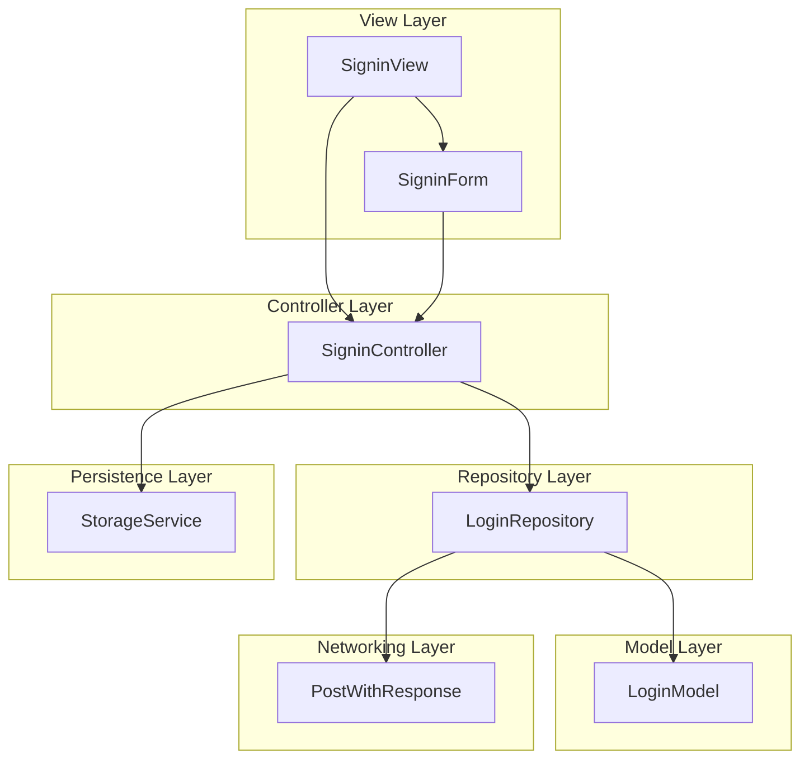
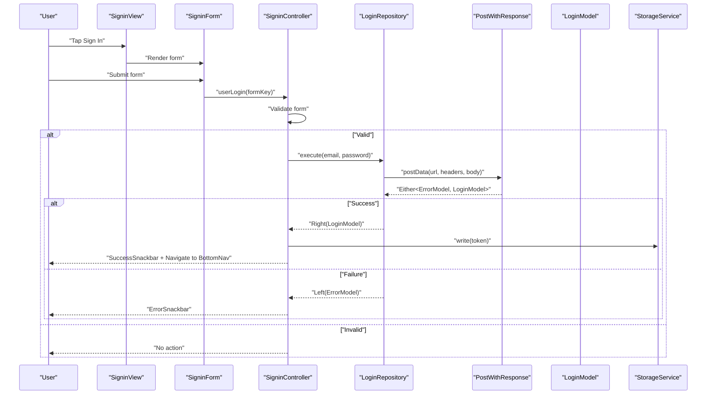
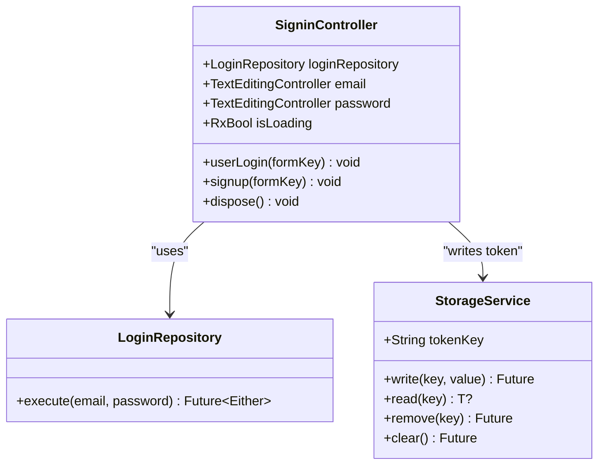
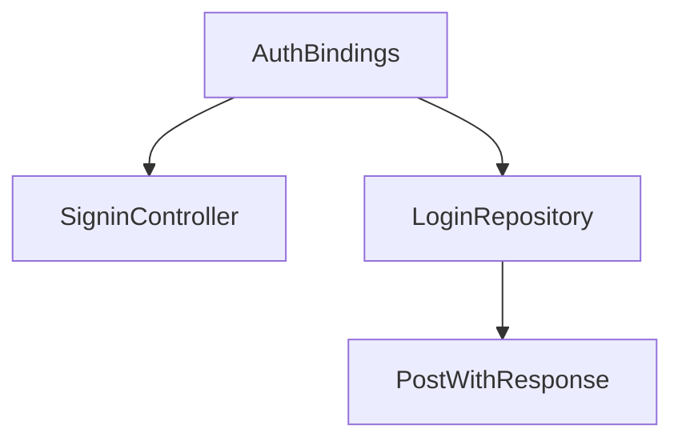

# Login System

<cite>
**Referenced Files in This Document**
- [signin_controller.dart](file://lib/features/auth/controller/signin_controller.dart)
- [login_repo.dart](file://lib/features/auth/repositories/login_repo.dart)
- [login_model.dart](file://lib/features/auth/models/login_model.dart)
- [signin_view.dart](file://lib/features/auth/views/signin_view.dart)
- [signin_form.dart](file://lib/features/auth/widgets/signin_form.dart)
- [auth_helper.dart](file://lib/features/auth/widgets/auth_helper.dart)
- [email_validator.dart](file://lib/shared/extensions/validators/email_validator.dart)
- [password_validator.dart](file://lib/shared/extensions/validators/password_validator.dart)
- [storage_service.dart](file://lib/core/data/local/storage_service.dart)
- [post_with_response.dart](file://lib/core/data/networks/post_with_response.dart)
- [auth_bindings.dart](file://lib/features/auth/bindings/auth_bindings.dart)
</cite>

## Table of Contents
1. [Introduction](#introduction)
2. [Project Structure](#project-structure)
3. [Core Components](#core-components)
4. [Architecture Overview](#architecture-overview)
5. [Detailed Component Analysis](#detailed-component-analysis)
6. [Dependency Analysis](#dependency-analysis)
7. [Performance Considerations](#performance-considerations)
8. [Security Considerations](#security-considerations)
9. [Troubleshooting Guide](#troubleshooting-guide)
10. [Conclusion](#conclusion)

## Introduction
This document describes the Login System component responsible for authenticating users via email and password, validating form inputs, managing loading states, handling errors, persisting sessions, and redirecting users upon successful authentication. It explains the SigninController implementation with GetX state management, the LoginRepository integration, and the end-to-end login workflow from form submission to session establishment.

## Project Structure
The Login System spans several layers:
- View layer: SigninView renders the sign-in screen and triggers actions.
- Form layer: SigninForm composes validated input fields using authHelper and validators.
- Controller layer: SigninController orchestrates validation, repository calls, loading states, snackbars, and navigation.
- Repository layer: LoginRepository encapsulates network requests and response parsing.
- Model layer: LoginModel defines the shape of authentication responses.
- Persistence layer: StorageService persists tokens locally.
- Networking layer: PostWithResponse handles HTTP requests and maps responses to Either<ErrorModel, T>.

**Diagram sources**
- [signin_view.dart:17-93](file://lib/features/auth/views/signin_view.dart#L17-L93)
- [signin_form.dart:12-59](file://lib/features/auth/widgets/signin_form.dart#L12-L59)
- [signin_controller.dart:9-51](file://lib/features/auth/controller/signin_controller.dart#L9-L51)
- [login_repo.dart:9-28](file://lib/features/auth/repositories/login_repo.dart#L9-L28)
- [login_model.dart:1-74](file://lib/features/auth/models/login_model.dart#L1-L74)
- [storage_service.dart:3-22](file://lib/core/data/local/storage_service.dart#L3-L22)
- [post_with_response.dart:7-44](file://lib/core/data/networks/post_with_response.dart#L7-L44)

**Section sources**
- [signin_view.dart:17-93](file://lib/features/auth/views/signin_view.dart#L17-L93)
- [signin_form.dart:12-59](file://lib/features/auth/widgets/signin_form.dart#L12-L59)
- [signin_controller.dart:9-51](file://lib/features/auth/controller/signin_controller.dart#L9-L51)
- [login_repo.dart:9-28](file://lib/features/auth/repositories/login_repo.dart#L9-L28)
- [login_model.dart:1-74](file://lib/features/auth/models/login_model.dart#L1-L74)
- [storage_service.dart:3-22](file://lib/core/data/local/storage_service.dart#L3-L22)
- [post_with_response.dart:7-44](file://lib/core/data/networks/post_with_response.dart#L7-L44)

## Core Components
- SigninView: Renders the sign-in UI, manages the form key, and binds button actions to the controller.
- SigninForm: Composes validated email and password fields using reusable helper widgets and validators.
- SigninController: Manages form validation, loading state, repository execution, error/success feedback, and navigation.
- LoginRepository: Encapsulates HTTP POST to the authentication endpoint with JSON body and parses the response into LoginModel.
- LoginModel: Defines the structure of the authentication response (token and user).
- StorageService: Provides local storage for the authentication token using GetStorage.
- PostWithResponse: Handles HTTP requests and maps success/failure to an Either<ErrorModel, T>.
- AuthBindings: Registers controllers and repositories with GetX dependency injection.

**Section sources**
- [signin_view.dart:17-93](file://lib/features/auth/views/signin_view.dart#L17-L93)
- [signin_form.dart:12-59](file://lib/features/auth/widgets/signin_form.dart#L12-L59)
- [signin_controller.dart:9-51](file://lib/features/auth/controller/signin_controller.dart#L9-L51)
- [login_repo.dart:9-28](file://lib/features/auth/repositories/login_repo.dart#L9-L28)
- [login_model.dart:1-74](file://lib/features/auth/models/login_model.dart#L1-L74)
- [storage_service.dart:3-22](file://lib/core/data/local/storage_service.dart#L3-L22)
- [post_with_response.dart:7-44](file://lib/core/data/networks/post_with_response.dart#L7-L44)
- [auth_bindings.dart:13-27](file://lib/features/auth/bindings/auth_bindings.dart#L13-L27)

## Architecture Overview
The Login System follows a layered architecture:
- UI triggers userLogin with a validated form.
- Controller delegates to LoginRepository.
- Repository performs HTTP request via PostWithResponse.
- On success, controller writes token to StorageService and navigates to bottom navigation.
- On failure, controller displays an error snackbar.

**Diagram sources**
- [signin_view.dart:51-62](file://lib/features/auth/views/signin_view.dart#L51-L62)
- [signin_form.dart:12-59](file://lib/features/auth/widgets/signin_form.dart#L12-L59)
- [signin_controller.dart:17-36](file://lib/features/auth/controller/signin_controller.dart#L17-L36)
- [login_repo.dart:14-27](file://lib/features/auth/repositories/login_repo.dart#L14-L27)
- [post_with_response.dart:9-43](file://lib/core/data/networks/post_with_response.dart#L9-L43)
- [login_model.dart:1-20](file://lib/features/auth/models/login_model.dart#L1-L20)
- [storage_service.dart:11-13](file://lib/core/data/local/storage_service.dart#L11-L13)

## Detailed Component Analysis

### SigninController
Responsibilities:
- Holds email and password controllers and exposes an observable loading flag.
- Validates the form via the provided GlobalKey<FormState>.
- Calls LoginRepository.execute with sanitized inputs.
- Handles Either result: shows error snackbar on Left, writes token and navigates on Right.
- Clears form and navigates to signup route on demand.

Key behaviors:
- Loading state toggled around repository call.
- Uses StorageService to persist token under a fixed key.
- Navigates to bottom navigation route after successful login.

**Diagram sources**
- [signin_controller.dart:9-51](file://lib/features/auth/controller/signin_controller.dart#L9-L51)
- [login_repo.dart:9-28](file://lib/features/auth/repositories/login_repo.dart#L9-L28)
- [storage_service.dart:3-22](file://lib/core/data/local/storage_service.dart#L3-L22)

**Section sources**
- [signin_controller.dart:9-51](file://lib/features/auth/controller/signin_controller.dart#L9-L51)

### LoginRepository
Responsibilities:
- Accepts email and password.
- Sends a POST request to the authentication endpoint with appropriate headers.
- Encodes the body as JSON.
- Parses the response into LoginModel.
- Returns an Either<ErrorModel, LoginModel> to the controller.

Network specifics:
- URL: "/api/auth/login".
- Headers: managed by HeadersManager with content-type enabled.
- Body: JSON-encoded map containing email and password.
- Parsing: fromJson factory on LoginModel.

**Section sources**
- [login_repo.dart:9-28](file://lib/features/auth/repositories/login_repo.dart#L9-L28)
- [login_model.dart:1-20](file://lib/features/auth/models/login_model.dart#L1-L20)

### LoginModel
Responsibilities:
- Represents the authentication response.
- Contains token and optional user details.
- Implements fromJson and toJson for serialization/deserialization.

User details include identifiers, contact info, and timestamps.

**Section sources**
- [login_model.dart:1-74](file://lib/features/auth/models/login_model.dart#L1-L74)

### SigninView
Responsibilities:
- Renders the sign-in layout with branding and navigation links.
- Creates a GlobalKey<FormState> and passes it to SigninForm.
- Observes controller.isLoading to show a loading indicator or the primary button.
- Triggers controller.userLogin on button press.
- Navigates to the signup mode on “Create New Account” tap.

**Section sources**
- [signin_view.dart:17-93](file://lib/features/auth/views/signin_view.dart#L17-L93)

### SigninForm
Responsibilities:
- Builds validated input fields for email and password.
- Uses authHelper to render styled fields with icons and labels.
- Integrates email and password validators.
- Provides a “Forgot Password?” link.

**Section sources**
- [signin_form.dart:12-59](file://lib/features/auth/widgets/signin_form.dart#L12-L59)
- [auth_helper.dart:7-42](file://lib/features/auth/widgets/auth_helper.dart#L7-L42)

### Validation Rules and Input Sanitization
- Email validation trims input and checks for presence and format.
- Password validation trims input and enforces minimum length.
- Both validators return null when valid and localized error messages otherwise.
- Inputs are trimmed before validation to reduce common typos.

**Section sources**
- [email_validator.dart:1-14](file://lib/shared/extensions/validators/email_validator.dart#L1-L14)
- [password_validator.dart:1-11](file://lib/shared/extensions/validators/password_validator.dart#L1-L11)

### Session Management and Persistence
- On successful authentication, the controller writes the token to StorageService using a fixed key.
- StorageService leverages GetStorage for asynchronous read/write/remove/clear operations.
- Navigation to the bottom navigation route completes the session establishment.

**Section sources**
- [signin_controller.dart:29-33](file://lib/features/auth/controller/signin_controller.dart#L29-L33)
- [storage_service.dart:5-22](file://lib/core/data/local/storage_service.dart#L5-L22)

### Error Handling Strategies
- LoginRepository wraps network responses in Either.
- PostWithResponse maps HTTP status codes to either success or ErrorModel.
- On Left, SigninController displays an error snackbar with the message derived from the ErrorModel.
- On exceptions during HTTP calls, Left(ErrorModel) is returned.

**Section sources**
- [login_repo.dart:14-27](file://lib/features/auth/repositories/login_repo.dart#L14-L27)
- [post_with_response.dart:9-43](file://lib/core/data/networks/post_with_response.dart#L9-L43)
- [signin_controller.dart:25-28](file://lib/features/auth/controller/signin_controller.dart#L25-L28)

### Success Redirection Logic
- On Right(LoginModel), the controller:
  - Writes the token to persistent storage.
  - Shows a success snackbar.
  - Navigates to the bottom navigation route.

**Section sources**
- [signin_controller.dart:29-33](file://lib/features/auth/controller/signin_controller.dart#L29-L33)

### Integration with Firebase Authentication Services
- The current implementation uses a custom backend endpoint and does not integrate with Firebase Authentication.
- Social login buttons are present in the UI but lack functional handlers in the referenced files.

**Section sources**
- [signin_view.dart:73-86](file://lib/features/auth/views/signin_view.dart#L73-L86)

## Dependency Analysis
GetX dependency injection registers controllers and repositories lazily. The bindings ensure that SigninController receives a LoginRepository instance, which in turn depends on PostWithResponse.

**Diagram sources**
- [auth_bindings.dart:13-27](file://lib/features/auth/bindings/auth_bindings.dart#L13-L27)
- [signin_controller.dart:9-11](file://lib/features/auth/controller/signin_controller.dart#L9-L11)
- [login_repo.dart:9-12](file://lib/features/auth/repositories/login_repo.dart#L9-L12)
- [post_with_response.dart:7-8](file://lib/core/data/networks/post_with_response.dart#L7-L8)

**Section sources**
- [auth_bindings.dart:13-27](file://lib/features/auth/bindings/auth_bindings.dart#L13-L27)

## Performance Considerations
- Prefer trimming inputs early to minimize revalidation churn.
- Debounce or throttle repeated submissions while isLoading is true.
- Cache frequently accessed UI constants (colors, sizes) to reduce rebuild costs.
- Avoid unnecessary widget rebuilds by scoping Obx to minimal subtrees.

## Security Considerations
- Token storage: Using local storage is suitable for short-lived tokens but not ideal for long-term secure storage. Consider platform-specific secure storage for production-grade apps.
- Input sanitization: Trim inputs to prevent trivial injection; the existing validators enforce presence and format.
- Network security: Ensure HTTPS endpoints and validate server certificates.
- Error messages: Avoid leaking sensitive information in error responses; the current implementation surfaces user-friendly messages derived from the backend.
- Social login: The UI includes social providers, but functional integration with Firebase is not present in the referenced files.

## Troubleshooting Guide
Common issues and resolutions:
- Form does not submit:
  - Ensure the formKey is passed to both SigninForm and SigninController.userLogin.
  - Verify AutovalidateMode is set appropriately in authField.
- Authentication fails silently:
  - Confirm PostWithResponse maps non-2xx responses to Left(ErrorModel).
  - Check that LoginRepository.url and headers are correct.
- Token not persisted:
  - Verify StorageService.write is called with the correct key and value.
  - Ensure the token exists in the LoginModel response.
- Navigation not triggered:
  - Confirm the route name matches AppRoutes.bottomNav.
  - Ensure GetMaterialApp routes include the target route.

**Section sources**
- [signin_controller.dart:17-36](file://lib/features/auth/controller/signin_controller.dart#L17-L36)
- [login_repo.dart:14-27](file://lib/features/auth/repositories/login_repo.dart#L14-L27)
- [post_with_response.dart:9-43](file://lib/core/data/networks/post_with_response.dart#L9-L43)
- [storage_service.dart:11-13](file://lib/core/data/local/storage_service.dart#L11-L13)

## Conclusion
The Login System integrates a clean separation of concerns with GetX for state management, a repository pattern for networking, and a model-driven response handling strategy. It validates inputs, manages loading states, persists tokens securely, and redirects users upon success. While the current implementation targets a custom backend, the architecture supports future integration with Firebase Authentication services by wiring social login handlers and adjusting repository logic accordingly.