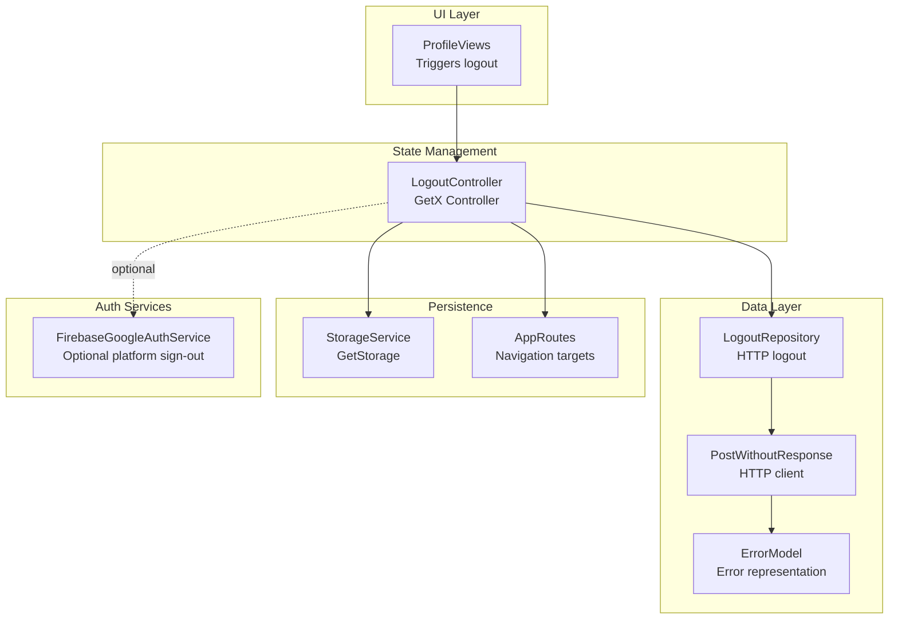
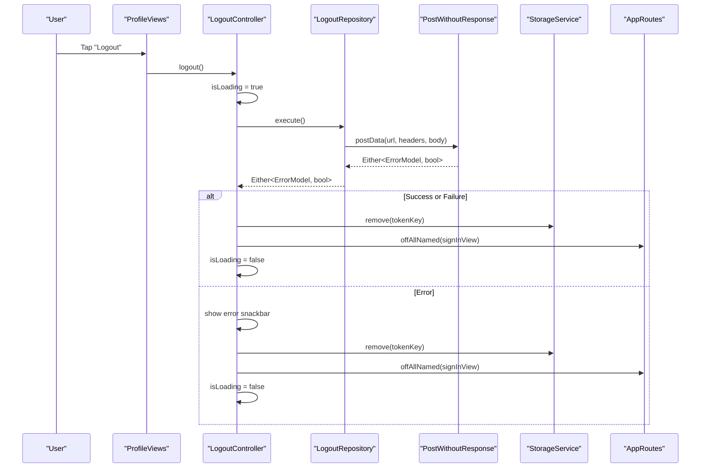
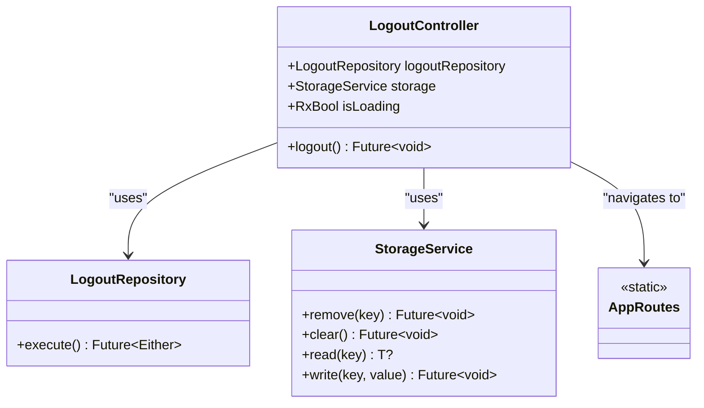
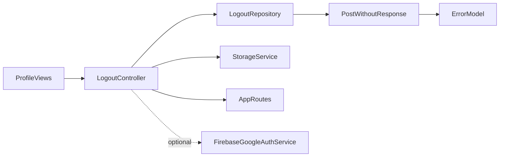

# Logout and Session Management

<cite>
**Referenced Files in This Document**
- [main.dart](file://lib/main.dart)
- [dependency_injection.dart](file://lib/core/di/dependency_injection.dart)
- [storage_service.dart](file://lib/core/data/local/storage_service.dart)
- [app_routes.dart](file://lib/core/routes/app_routes.dart)
- [routes.dart](file://lib/core/routes/routes.dart)
- [logout_repo.dart](file://lib/features/auth/repositories/logout_repo.dart)
- [post_without_response.dart](file://lib/core/data/networks/post_without_response.dart)
- [logout_controller.dart](file://lib/features/auth/controller/logout_controller.dart)
- [profile_views.dart](file://lib/features/profile/views/profile_views.dart)
- [profile_bindings.dart](file://lib/features/profile/bindings/profile_bindings.dart)
- [auth_bindings.dart](file://lib/features/auth/bindings/auth_bindings.dart)
- [error_model.dart](file://lib/core/data/global_models/error_model.dart)
- [error_snackbar.dart](file://lib/shared/widgets/snackbars/error_snackbar.dart)
- [firebase_google_auth.dart](file://lib/core/services/firebase_google_auth.dart)
</cite>

## Table of Contents
1. [Introduction](#introduction)
2. [Project Structure](#project-structure)
3. [Core Components](#core-components)
4. [Architecture Overview](#architecture-overview)
5. [Detailed Component Analysis](#detailed-component-analysis)
6. [Dependency Analysis](#dependency-analysis)
7. [Performance Considerations](#performance-considerations)
8. [Security Considerations](#security-considerations)
9. [Troubleshooting Guide](#troubleshooting-guide)
10. [Conclusion](#conclusion)

## Introduction
This document describes the Logout and Session Management component of the application. It explains how user sessions are terminated, including backend logout, local session cleanup, state reset, and navigation to the login screen. It also documents the LogoutController implementation with GetX state management, session invalidation, and integration with authentication services. The guide covers session data clearing, token invalidation, background process termination, and user confirmation handling, along with security considerations and session persistence management.

## Project Structure
The logout and session management functionality spans several layers:
- Application bootstrap initializes dependency injection and storage.
- Profile screens trigger logout via LogoutController.
- LogoutController coordinates repository calls and state updates.
- StorageService clears tokens and other persisted data.
- Routes handle navigation after logout.
- Optional Firebase Google Auth service supports platform-level sign-out.

**Diagram sources**
- [profile_views.dart:44-46](file://lib/features/profile/views/profile_views.dart#L44-L46)
- [logout_controller.dart:13-28](file://lib/features/auth/controller/logout_controller.dart#L13-L28)
- [logout_repo.dart:12-19](file://lib/features/auth/repositories/logout_repo.dart#L12-L19)
- [post_without_response.dart:12-45](file://lib/core/data/networks/post_without_response.dart#L12-L45)
- [storage_service.dart:15-21](file://lib/core/data/local/storage_service.dart#L15-L21)
- [app_routes.dart:2-33](file://lib/core/routes/app_routes.dart#L2-L33)
- [firebase_google_auth.dart:60-68](file://lib/core/services/firebase_google_auth.dart#L60-L68)

**Section sources**
- [main.dart:12-46](file://lib/main.dart#L12-L46)
- [dependency_injection.dart:11-26](file://lib/core/di/dependency_injection.dart#L11-L26)
- [profile_views.dart:15-57](file://lib/features/profile/views/profile_views.dart#L15-L57)
- [logout_controller.dart:7-28](file://lib/features/auth/controller/logout_controller.dart#L7-L28)
- [logout_repo.dart:8-19](file://lib/features/auth/repositories/logout_repo.dart#L8-L19)
- [storage_service.dart:3-22](file://lib/core/data/local/storage_service.dart#L3-L22)
- [app_routes.dart:1-33](file://lib/core/routes/app_routes.dart#L1-L33)
- [routes.dart:55-211](file://lib/core/routes/routes.dart#L55-L211)
- [firebase_google_auth.dart:60-68](file://lib/core/services/firebase_google_auth.dart#L60-L68)

## Core Components
- LogoutController: Orchestrates logout flow, toggles loading state, invokes repository, handles errors, clears token, and navigates to the sign-in route.
- LogoutRepository: Performs the HTTP logout request and returns a typed result.
- PostWithoutResponse: Encapsulates HTTP POST calls and maps responses to Either<ErrorModel, bool>.
- StorageService: Provides token and general storage operations including removal and clearing.
- AppRoutes: Defines named routes used for navigation after logout.
- ProfileBindings/AuthBindings: Register controllers and repositories for DI.
- ErrorModel/ErrorSnackbar: Standardized error handling and user feedback.
- FirebaseGoogleAuthService: Optional platform-level sign-out for Google/Firebase.

**Section sources**
- [logout_controller.dart:7-28](file://lib/features/auth/controller/logout_controller.dart#L7-L28)
- [logout_repo.dart:8-19](file://lib/features/auth/repositories/logout_repo.dart#L8-L19)
- [post_without_response.dart:9-46](file://lib/core/data/networks/post_without_response.dart#L9-L46)
- [storage_service.dart:3-22](file://lib/core/data/local/storage_service.dart#L3-L22)
- [app_routes.dart:1-33](file://lib/core/routes/app_routes.dart#L1-L33)
- [profile_bindings.dart:8-16](file://lib/features/profile/bindings/profile_bindings.dart#L8-L16)
- [auth_bindings.dart:13-27](file://lib/features/auth/bindings/auth_bindings.dart#L13-L27)
- [error_model.dart:1-14](file://lib/core/data/global_models/error_model.dart#L1-L14)
- [error_snackbar.dart:7-76](file://lib/shared/widgets/snackbars/error_snackbar.dart#L7-L76)
- [firebase_google_auth.dart:60-68](file://lib/core/services/firebase_google_auth.dart#L60-L68)

## Architecture Overview
The logout workflow integrates UI triggers, state management, repository calls, persistence, and navigation. The flow is designed to be resilient: it attempts server-side logout, clears local tokens, and ensures the UI navigates to the sign-in screen regardless of server outcome.

**Diagram sources**
- [profile_views.dart:44-46](file://lib/features/profile/views/profile_views.dart#L44-L46)
- [logout_controller.dart:13-28](file://lib/features/auth/controller/logout_controller.dart#L13-L28)
- [logout_repo.dart:12-19](file://lib/features/auth/repositories/logout_repo.dart#L12-L19)
- [post_without_response.dart:12-45](file://lib/core/data/networks/post_without_response.dart#L12-L45)
- [storage_service.dart:15-17](file://lib/core/data/local/storage_service.dart#L15-L17)
- [app_routes.dart:2-3](file://lib/core/routes/app_routes.dart#L2-L3)

## Detailed Component Analysis

### LogoutController
Responsibilities:
- Toggle loading state during logout.
- Call repository to perform server logout.
- Handle Either result: on error, show snackbar, clear token, navigate; on success, clear token, navigate.
- Use Get.offAllNamed to replace the entire navigation stack with the sign-in route.

Key behaviors:
- Uses Get.find<StorageService>() to access storage.
- Observes isLoading with RxBool for reactive UI updates.
- Navigates using AppRoutes.signInView.

**Diagram sources**
- [logout_controller.dart:7-28](file://lib/features/auth/controller/logout_controller.dart#L7-L28)
- [logout_repo.dart:8-19](file://lib/features/auth/repositories/logout_repo.dart#L8-L19)
- [storage_service.dart:3-22](file://lib/core/data/local/storage_service.dart#L3-L22)
- [app_routes.dart:1-33](file://lib/core/routes/app_routes.dart#L1-L33)

**Section sources**
- [logout_controller.dart:7-28](file://lib/features/auth/controller/logout_controller.dart#L7-L28)

### LogoutRepository
Responsibilities:
- Perform HTTP POST to the logout endpoint.
- Use HeadersManager for request headers.
- Return Either<ErrorModel, bool> to indicate success or failure.

Processing logic:
- Calls PostWithoutResponse.postData with URL, headers, and empty body.
- Returns the raw Either result.

**Section sources**
- [logout_repo.dart:8-19](file://lib/features/auth/repositories/logout_repo.dart#L8-L19)

### PostWithoutResponse
Responsibilities:
- Send HTTP POST requests.
- Parse response status codes and body.
- Map failures to ErrorModel.

Processing logic:
- Construct URI from base URL and provided path.
- On success (200/201/202), return Right(true).
- On HTTP error, parse message and return Left(ErrorModel).
- On exceptions, return Left(ErrorModel.fromUnknown()).

**Section sources**
- [post_without_response.dart:9-46](file://lib/core/data/networks/post_without_response.dart#L9-L46)
- [error_model.dart:1-14](file://lib/core/data/global_models/error_model.dart#L1-L14)

### StorageService
Responsibilities:
- Persist and retrieve tokens and other data.
- Remove individual keys and clear all data.
- Used to invalidate local session by removing the token.

Behavior:
- read/write/remove/clear methods wrap GetStorage operations.
- tokenKey is the identifier for the stored token.

**Section sources**
- [storage_service.dart:3-22](file://lib/core/data/local/storage_service.dart#L3-L22)

### UI Trigger: ProfileViews
Responsibilities:
- Render the profile screen and the Logout button.
- Invoke LogoutController.logout() when pressed.
- Show loading indicator while logout is in progress.

Integration:
- Uses Get.find<LogoutController>() to access the controller.
- Displays ButtonLoading when LogoutController.isLoading is true.

**Section sources**
- [profile_views.dart:15-57](file://lib/features/profile/views/profile_views.dart#L15-L57)

### Dependency Injection and Registration
Responsibilities:
- Initialize GetStorage and register services.
- Provide StorageService, ThemeService, ThemeController, and network clients.
- Expose token via StorageService.read(tokenKey).

Registration:
- ProfileBindings registers LogoutRepository and LogoutController.
- AuthBindings registers related auth controllers and repositories.

**Section sources**
- [dependency_injection.dart:11-26](file://lib/core/di/dependency_injection.dart#L11-L26)
- [profile_bindings.dart:8-16](file://lib/features/profile/bindings/profile_bindings.dart#L8-L16)
- [auth_bindings.dart:13-27](file://lib/features/auth/bindings/auth_bindings.dart#L13-L27)

### Navigation After Logout
Responsibilities:
- Navigate to the sign-in route after logout completes.
- Replace the entire navigation stack to prevent returning to protected screens.

Implementation:
- Uses Get.offAllNamed(AppRoutes.signInView) to reset navigation.

**Section sources**
- [logout_controller.dart:17-27](file://lib/features/auth/controller/logout_controller.dart#L17-L27)
- [app_routes.dart:2-3](file://lib/core/routes/app_routes.dart#L2-L3)
- [routes.dart:124-125](file://lib/core/routes/routes.dart#L124-L125)

### Optional Platform-Level Sign-Out (FirebaseGoogleAuthService)
Responsibilities:
- Optionally sign out from Google/Firebase services.
- Useful for apps supporting multiple authentication providers.

Behavior:
- Calls GoogleSignIn.signOut() and FirebaseAuth.signOut().
- Logs success or errors.

**Section sources**
- [firebase_google_auth.dart:60-68](file://lib/core/services/firebase_google_auth.dart#L60-L68)

## Dependency Analysis
The logout flow exhibits low coupling and clear separation of concerns:
- UI depends on LogoutController via GetX.
- LogoutController depends on LogoutRepository and StorageService.
- LogoutRepository depends on PostWithoutResponse.
- PostWithoutResponse depends on HTTP client and ErrorModel.
- Navigation relies on AppRoutes.

**Diagram sources**
- [profile_views.dart:44-46](file://lib/features/profile/views/profile_views.dart#L44-L46)
- [logout_controller.dart:13-28](file://lib/features/auth/controller/logout_controller.dart#L13-L28)
- [logout_repo.dart:12-19](file://lib/features/auth/repositories/logout_repo.dart#L12-L19)
- [post_without_response.dart:12-45](file://lib/core/data/networks/post_without_response.dart#L12-L45)
- [storage_service.dart:15-17](file://lib/core/data/local/storage_service.dart#L15-L17)
- [app_routes.dart:2-3](file://lib/core/routes/app_routes.dart#L2-L3)
- [firebase_google_auth.dart:60-68](file://lib/core/services/firebase_google_auth.dart#L60-L68)

**Section sources**
- [profile_views.dart:15-57](file://lib/features/profile/views/profile_views.dart#L15-L57)
- [logout_controller.dart:7-28](file://lib/features/auth/controller/logout_controller.dart#L7-L28)
- [logout_repo.dart:8-19](file://lib/features/auth/repositories/logout_repo.dart#L8-L19)
- [post_without_response.dart:9-46](file://lib/core/data/networks/post_without_response.dart#L9-L46)
- [storage_service.dart:3-22](file://lib/core/data/local/storage_service.dart#L3-L22)
- [app_routes.dart:1-33](file://lib/core/routes/app_routes.dart#L1-L33)
- [firebase_google_auth.dart:60-68](file://lib/core/services/firebase_google_auth.dart#L60-L68)

## Performance Considerations
- Minimize network calls: logout is a single POST; ensure the endpoint responds quickly.
- Reactive UI updates: GetX isLoading toggles reduce unnecessary rebuilds.
- Avoid redundant storage writes: only remove token on logout completion.
- Navigation stack replacement: Get.offAllNamed prevents memory leaks from retained routes.

## Security Considerations
- Token invalidation: Local token removal occurs regardless of server outcome to prevent accidental reuse.
- Error handling: Errors are surfaced via snackbar and logged; ensure sensitive data is not exposed.
- Session persistence: StorageService.clear() can be used to wipe all data if needed; current logout removes only the token.
- Platform sign-out: Optional FirebaseGoogleAuthService complements app-level logout for provider-managed sessions.
- Confirmation handling: No explicit confirmation dialog exists; consider adding a confirmation step for production-grade UX.

## Troubleshooting Guide
Common issues and resolutions:
- Logout fails silently:
  - Verify PostWithoutResponse returns Left(ErrorModel) and that ErrorSnackbar displays the message.
  - Check server status codes and ensure the endpoint returns 200/201/202 for success.
- Token remains after logout:
  - Confirm StorageService.remove(tokenKey) executes in both success and error branches.
- Navigation does not occur:
  - Ensure AppRoutes.signInView is registered and Get.offAllNamed is called.
- UI does not reflect loading state:
  - Confirm LogoutController.isLoading is toggled around repository call.

**Section sources**
- [logout_controller.dart:17-27](file://lib/features/auth/controller/logout_controller.dart#L17-L27)
- [post_without_response.dart:24-41](file://lib/core/data/networks/post_without_response.dart#L24-L41)
- [error_snackbar.dart:8-76](file://lib/shared/widgets/snackbars/error_snackbar.dart#L8-L76)
- [storage_service.dart:15-17](file://lib/core/data/local/storage_service.dart#L15-L17)
- [app_routes.dart:2-3](file://lib/core/routes/app_routes.dart#L2-L3)

## Conclusion
The Logout and Session Management component provides a robust, reactive logout flow using GetX. It performs server-side logout when available, clears local tokens, and resets application state by navigating to the sign-in screen. Optional integration with Firebase Google Auth enhances provider-level session termination. The design emphasizes resilience, clear error handling, and secure session invalidation.