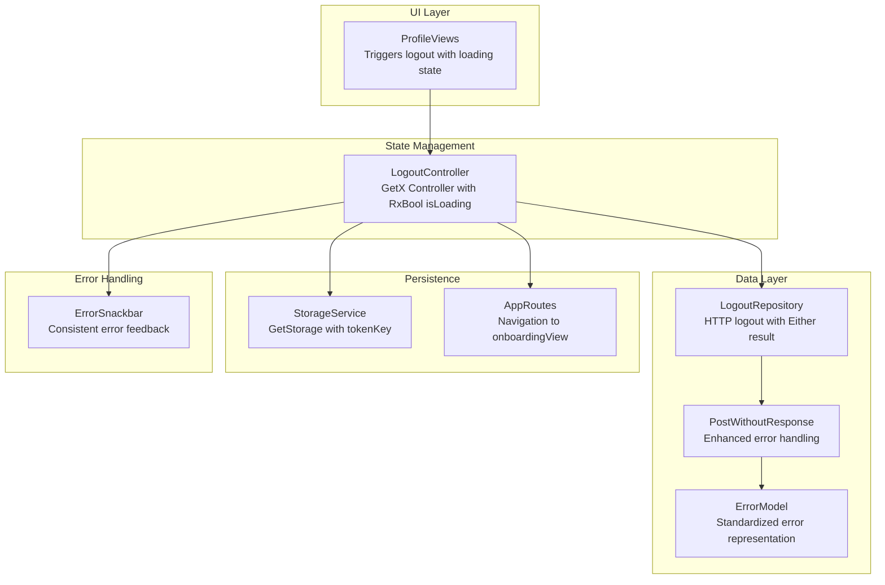
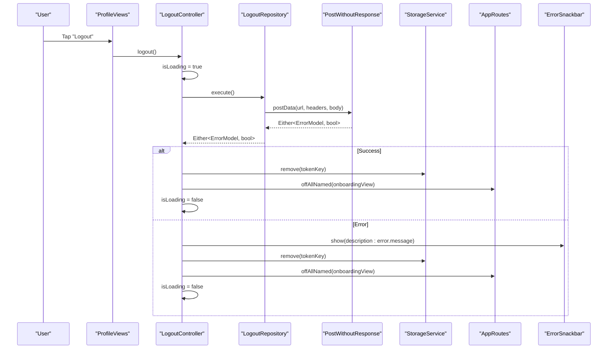
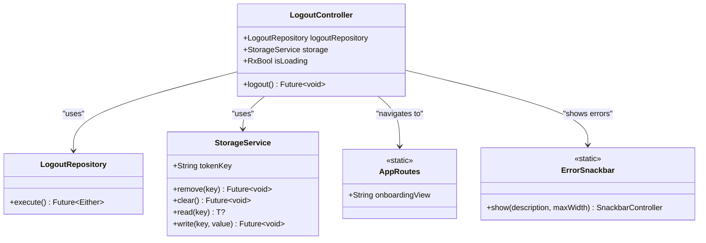
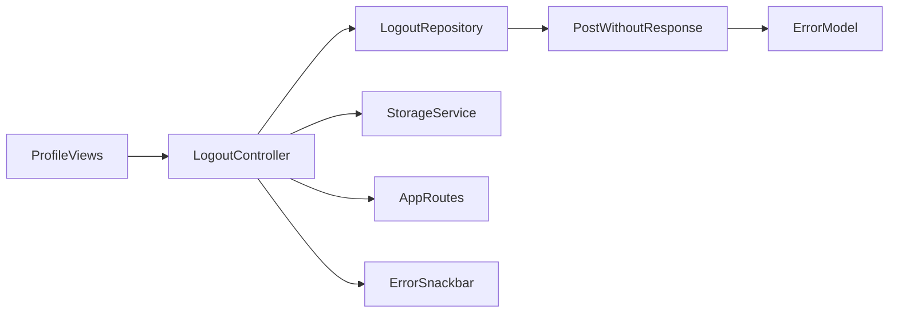

# Logout and Session Management

<cite>
**Referenced Files in This Document**
- [main.dart](file://lib/main.dart)
- [dependency_injection.dart](file://lib/core/di/dependency_injection.dart)
- [storage_service.dart](file://lib/core/data/local/storage_service.dart)
- [app_routes.dart](file://lib/core/routes/app_routes.dart)
- [logout_repo.dart](file://lib/features/auth/repositories/logout_repo.dart)
- [post_without_response.dart](file://lib/core/data/networks/post_without_response.dart)
- [logout_controller.dart](file://lib/features/auth/controller/logout_controller.dart)
- [profile_views.dart](file://lib/features/profile/views/profile_views.dart)
- [profile_bindings.dart](file://lib/features/profile/bindings/profile_bindings.dart)
- [error_model.dart](file://lib/core/data/global_models/error_model.dart)
- [error_snackbar.dart](file://lib/shared/widgets/snackbars/error_snackbar.dart)
</cite>

## Update Summary
**Changes Made**
- Enhanced error handling in logout process with improved error snackbar integration
- Better loading state management with reactive UI updates
- Enhanced token cleanup with consistent removal across all scenarios
- Updated navigation flow to use onboardingView instead of signInView

## Table of Contents
1. [Introduction](#introduction)
2. [Project Structure](#project-structure)
3. [Core Components](#core-components)
4. [Architecture Overview](#architecture-overview)
5. [Detailed Component Analysis](#detailed-component-analysis)
6. [Dependency Analysis](#dependency-analysis)
7. [Performance Considerations](#performance-considerations)
8. [Security Considerations](#security-considerations)
9. [Troubleshooting Guide](#troubleshooting-guide)
10. [Conclusion](#conclusion)

## Introduction
This document describes the Logout and Session Management component of the application. It explains how user sessions are terminated, including backend logout, local session cleanup, state reset, and navigation to the onboarding screen. The component features improved error handling, better loading state management, and enhanced token cleanup processes. It documents the LogoutController implementation with GetX state management, session invalidation, and integration with authentication services.

## Project Structure
The logout and session management functionality spans several layers:
- Application bootstrap initializes dependency injection and storage services.
- Profile screens trigger logout via LogoutController with reactive loading states.
- LogoutController coordinates repository calls and state updates with enhanced error handling.
- StorageService clears tokens and other persisted data with improved reliability.
- Routes handle navigation to the onboarding screen after logout completion.
- Error handling is standardized through ErrorSnackbar for consistent user feedback.

**Diagram sources**
- [profile_views.dart:39-46](file://lib/features/profile/views/profile_views.dart#L39-L46)
- [logout_controller.dart:11-28](file://lib/features/auth/controller/logout_controller.dart#L11-L28)
- [logout_repo.dart:12-19](file://lib/features/auth/repositories/logout_repo.dart#L12-L19)
- [post_without_response.dart:12-45](file://lib/core/data/networks/post_without_response.dart#L12-L45)
- [storage_service.dart:5-22](file://lib/core/data/local/storage_service.dart#L5-L22)
- [app_routes.dart:2](file://lib/core/routes/app_routes.dart#L2)
- [error_snackbar.dart:8-77](file://lib/shared/widgets/snackbars/error_snackbar.dart#L8-L77)

**Section sources**
- [main.dart:12-46](file://lib/main.dart#L12-L46)
- [dependency_injection.dart:14-30](file://lib/core/di/dependency_injection.dart#L14-L30)
- [profile_views.dart:15-58](file://lib/features/profile/views/profile_views.dart#L15-L58)
- [logout_controller.dart:7-29](file://lib/features/auth/controller/logout_controller.dart#L7-L29)
- [logout_repo.dart:8-20](file://lib/features/auth/repositories/logout_repo.dart#L8-L20)
- [storage_service.dart:3-24](file://lib/core/data/local/storage_service.dart#L3-L24)
- [app_routes.dart:1-34](file://lib/core/routes/app_routes.dart#L1-L34)
- [error_model.dart:1-15](file://lib/core/data/global_models/error_model.dart#L1-L15)
- [error_snackbar.dart:7-77](file://lib/shared/widgets/snackbars/error_snackbar.dart#L7-L77)

## Core Components
- **LogoutController**: Orchestrates logout flow with improved error handling, toggles loading state using RxBool, invokes repository, handles Either result with consistent error feedback, clears token, and navigates to onboardingView.
- **LogoutRepository**: Performs the HTTP logout request and returns Either<ErrorModel, bool> with enhanced error mapping.
- **PostWithoutResponse**: Enhanced HTTP POST calls with improved error handling and standardized response mapping.
- **StorageService**: Provides token and general storage operations including removal and clearing with tokenKey constant.
- **AppRoutes**: Defines named routes used for navigation after logout, now uses onboardingView instead of signInView.
- **ProfileBindings**: Registers controllers and repositories for dependency injection.
- **ErrorModel/ErrorSnackbar**: Standardized error handling and user feedback with consistent styling and behavior.

**Section sources**
- [logout_controller.dart:7-29](file://lib/features/auth/controller/logout_controller.dart#L7-L29)
- [logout_repo.dart:8-20](file://lib/features/auth/repositories/logout_repo.dart#L8-L20)
- [post_without_response.dart:9-47](file://lib/core/data/networks/post_without_response.dart#L9-L47)
- [storage_service.dart:3-24](file://lib/core/data/local/storage_service.dart#L3-L24)
- [app_routes.dart:1-34](file://lib/core/routes/app_routes.dart#L1-L34)
- [profile_bindings.dart:9-19](file://lib/features/profile/bindings/profile_bindings.dart#L9-L19)
- [error_model.dart:1-15](file://lib/core/data/global_models/error_model.dart#L1-L15)
- [error_snackbar.dart:7-77](file://lib/shared/widgets/snackbars/error_snackbar.dart#L7-L77)

## Architecture Overview
The logout workflow integrates UI triggers, state management, repository calls, persistence, and navigation. The flow is designed to be resilient with improved error handling: it attempts server-side logout, clears local tokens, and ensures the UI navigates to the onboarding screen regardless of server outcome.

**Diagram sources**
- [profile_views.dart:44-46](file://lib/features/profile/views/profile_views.dart#L44-L46)
- [logout_controller.dart:13-28](file://lib/features/auth/controller/logout_controller.dart#L13-L28)
- [logout_repo.dart:12-19](file://lib/features/auth/repositories/logout_repo.dart#L12-L19)
- [post_without_response.dart:12-45](file://lib/core/data/networks/post_without_response.dart#L12-L45)
- [storage_service.dart:16-18](file://lib/core/data/local/storage_service.dart#L16-L18)
- [app_routes.dart:2](file://lib/core/routes/app_routes.dart#L2)
- [error_snackbar.dart:8-77](file://lib/shared/widgets/snackbars/error_snackbar.dart#L8-L77)

## Detailed Component Analysis

### LogoutController
**Updated** Enhanced with improved error handling, better loading state management, and consistent token cleanup.

Responsibilities:
- Toggle loading state during logout using RxBool for reactive UI updates.
- Call repository to perform server logout with enhanced error handling.
- Handle Either result: on error, show snackbar with error message, clear token, navigate; on success, clear token, navigate.
- Use Get.offAllNamed to replace the entire navigation stack with the onboarding route.

Key behaviors:
- Uses Get.find<StorageService>() to access storage with tokenKey constant.
- Observes isLoading with RxBool for reactive UI updates in both ProfileViews and LogoutController.
- Navigates using AppRoutes.onboardingView instead of signInView.
- Ensures token removal in both success and error scenarios.

**Diagram sources**
- [logout_controller.dart:7-29](file://lib/features/auth/controller/logout_controller.dart#L7-L29)
- [logout_repo.dart:8-20](file://lib/features/auth/repositories/logout_repo.dart#L8-L20)
- [storage_service.dart:3-24](file://lib/core/data/local/storage_service.dart#L3-L24)
- [app_routes.dart:1-34](file://lib/core/routes/app_routes.dart#L1-L34)
- [error_snackbar.dart:7-77](file://lib/shared/widgets/snackbars/error_snackbar.dart#L7-L77)

**Section sources**
- [logout_controller.dart:7-29](file://lib/features/auth/controller/logout_controller.dart#L7-L29)

### LogoutRepository
Responsibilities:
- Perform HTTP POST to the logout endpoint.
- Use HeadersManager for request headers.
- Return Either<ErrorModel, bool> to indicate success or failure.

Processing logic:
- Calls PostWithoutResponse.postData with URL, headers, and empty body.
- Returns the raw Either result.

**Section sources**
- [logout_repo.dart:8-20](file://lib/features/auth/repositories/logout_repo.dart#L8-L20)

### PostWithoutResponse
**Updated** Enhanced error handling with improved error mapping and standardized response processing.

Responsibilities:
- Send HTTP POST requests with enhanced error handling.
- Parse response status codes and body with improved error mapping.
- Map failures to ErrorModel with standardized error representation.

Processing logic:
- Construct URI from base URL and provided path.
- On success (200/201/202), return Right(true).
- On HTTP error, parse message and return Left(ErrorModel.fromHttp) with status code and message.
- On exceptions, return Left(ErrorModel.fromUnknown()) with standardized error message.

**Section sources**
- [post_without_response.dart:9-47](file://lib/core/data/networks/post_without_response.dart#L9-L47)
- [error_model.dart:1-15](file://lib/core/data/global_models/error_model.dart#L1-L15)

### StorageService
Responsibilities:
- Persist and retrieve tokens and other data.
- Remove individual keys and clear all data.
- Used to invalidate local session by removing the token.

Behavior:
- read/write/remove/clear methods wrap GetStorage operations.
- tokenKey is the constant identifier for the stored token.

**Section sources**
- [storage_service.dart:3-24](file://lib/core/data/local/storage_service.dart#L3-L24)

### UI Trigger: ProfileViews
**Updated** Enhanced with improved loading state management and consistent integration with LogoutController.

Responsibilities:
- Render the profile screen and the Logout button.
- Invoke LogoutController.logout() when pressed.
- Show loading indicator while logout is in progress using reactive UI updates.

Integration:
- Uses Get.find<LogoutController>() to access the controller.
- Displays ButtonLoading when either ProfileController.isLoading or LogoutController.isLoading is true.
- Provides consistent loading state feedback across the application.

**Section sources**
- [profile_views.dart:15-58](file://lib/features/profile/views/profile_views.dart#L15-L58)

### Dependency Injection and Registration
Responsibilities:
- Initialize GetStorage and register services.
- Provide StorageService, ThemeService, ThemeController, and network clients.
- Expose token via StorageService.read(tokenKey).

Registration:
- ProfileBindings registers LogoutRepository and LogoutController.
- DependencyInjection initializes StorageService, ThemeService, and network clients.

**Section sources**
- [dependency_injection.dart:14-30](file://lib/core/di/dependency_injection.dart#L14-L30)
- [profile_bindings.dart:9-19](file://lib/features/profile/bindings/profile_bindings.dart#L9-L19)

### Navigation After Logout
**Updated** Changed from signInView to onboardingView for improved user experience.

Responsibilities:
- Navigate to the onboarding route after logout completes.
- Replace the entire navigation stack to prevent returning to protected screens.

Implementation:
- Uses Get.offAllNamed(AppRoutes.onboardingView) to reset navigation to onboarding screen.

**Section sources**
- [logout_controller.dart:20-26](file://lib/features/auth/controller/logout_controller.dart#L20-L26)
- [app_routes.dart:2](file://lib/core/routes/app_routes.dart#L2)
- [profile_views.dart:44-46](file://lib/features/profile/views/profile_views.dart#L44-L46)

### Error Handling Enhancement
**New** Comprehensive error handling system with standardized feedback.

Responsibilities:
- Provide consistent error feedback across the application.
- Display user-friendly error messages with standardized styling.
- Close all existing snackbars before showing new errors.

Behavior:
- ErrorSnackbar.show() creates a standardized error notification.
- Uses Material Design principles with custom styling and animations.
- Automatically closes after 4 seconds or when user interacts.

**Section sources**
- [error_snackbar.dart:7-77](file://lib/shared/widgets/snackbars/error_snackbar.dart#L7-L77)
- [error_model.dart:1-15](file://lib/core/data/global_models/error_model.dart#L1-L15)

## Dependency Analysis
The logout flow exhibits low coupling and clear separation of concerns with enhanced error handling:
- UI depends on LogoutController via GetX with reactive loading states.
- LogoutController depends on LogoutRepository and StorageService.
- LogoutRepository depends on PostWithoutResponse.
- PostWithoutResponse depends on HTTP client and ErrorModel.
- Navigation relies on AppRoutes with onboardingView.
- Error handling relies on ErrorSnackbar for consistent user feedback.

**Diagram sources**
- [profile_views.dart:39-46](file://lib/features/profile/views/profile_views.dart#L39-L46)
- [logout_controller.dart:13-28](file://lib/features/auth/controller/logout_controller.dart#L13-L28)
- [logout_repo.dart:12-19](file://lib/features/auth/repositories/logout_repo.dart#L12-L19)
- [post_without_response.dart:12-45](file://lib/core/data/networks/post_without_response.dart#L12-L45)
- [storage_service.dart:16-18](file://lib/core/data/local/storage_service.dart#L16-L18)
- [app_routes.dart:2](file://lib/core/routes/app_routes.dart#L2)
- [error_snackbar.dart:8-77](file://lib/shared/widgets/snackbars/error_snackbar.dart#L8-L77)

**Section sources**
- [profile_views.dart:15-58](file://lib/features/profile/views/profile_views.dart#L15-L58)
- [logout_controller.dart:7-29](file://lib/features/auth/controller/logout_controller.dart#L7-L29)
- [logout_repo.dart:8-20](file://lib/features/auth/repositories/logout_repo.dart#L8-L20)
- [post_without_response.dart:9-47](file://lib/core/data/networks/post_without_response.dart#L9-L47)
- [storage_service.dart:3-24](file://lib/core/data/local/storage_service.dart#L3-L24)
- [app_routes.dart:1-34](file://lib/core/routes/app_routes.dart#L1-L34)
- [error_snackbar.dart:7-77](file://lib/shared/widgets/snackbars/error_snackbar.dart#L7-L77)

## Performance Considerations
- **Minimize network calls**: logout is a single POST; ensure the endpoint responds quickly.
- **Reactive UI updates**: GetX isLoading toggles reduce unnecessary rebuilds with improved performance.
- **Avoid redundant storage writes**: only remove token on logout completion.
- **Navigation stack replacement**: Get.offAllNamed prevents memory leaks from retained routes.
- **Error handling optimization**: ErrorSnackbar automatically closes previous snackbars to prevent UI clutter.

## Security Considerations
- **Token invalidation**: Local token removal occurs regardless of server outcome to prevent accidental reuse.
- **Error handling**: Errors are surfaced via standardized ErrorSnackbar with consistent styling; ensure sensitive data is not exposed.
- **Session persistence**: StorageService.clear() can be used to wipe all data if needed; current logout removes only the token.
- **Confirmation handling**: No explicit confirmation dialog exists; consider adding a confirmation step for production-grade UX.
- **Navigation security**: Using onboardingView ensures users cannot access protected routes after logout.

## Troubleshooting Guide
**Updated** Enhanced troubleshooting with improved error handling guidance.

Common issues and resolutions:
- **Logout fails silently**:
  - Verify PostWithoutResponse returns Left(ErrorModel) and that ErrorSnackbar displays the message.
  - Check server status codes and ensure the endpoint returns 200/201/202 for success.
- **Token remains after logout**:
  - Confirm StorageService.remove(tokenKey) executes in both success and error branches.
- **Navigation does not occur**:
  - Ensure AppRoutes.onboardingView is registered and Get.offAllNamed is called.
- **UI does not reflect loading state**:
  - Confirm LogoutController.isLoading is toggled around repository call.
- **Error messages not displaying**:
  - Verify ErrorSnackbar.show() is called with proper error.message.
  - Check that ErrorModel.fromHttp() properly parses server error responses.

**Section sources**
- [logout_controller.dart:17-27](file://lib/features/auth/controller/logout_controller.dart#L17-L27)
- [post_without_response.dart:24-44](file://lib/core/data/networks/post_without_response.dart#L24-L44)
- [error_snackbar.dart:8-77](file://lib/shared/widgets/snackbars/error_snackbar.dart#L8-L77)
- [storage_service.dart:16-18](file://lib/core/data/local/storage_service.dart#L16-L18)
- [app_routes.dart:2](file://lib/core/routes/app_routes.dart#L2)

## Conclusion
The Logout and Session Management component provides a robust, reactive logout flow using GetX with significant improvements in error handling, loading state management, and token cleanup. It performs server-side logout when available, clears local tokens consistently, and resets application state by navigating to the onboarding screen. The enhanced error handling system provides standardized user feedback through ErrorSnackbar, while improved loading state management ensures responsive UI updates. The design emphasizes resilience, clear error handling, secure session invalidation, and improved user experience through consistent navigation flows.