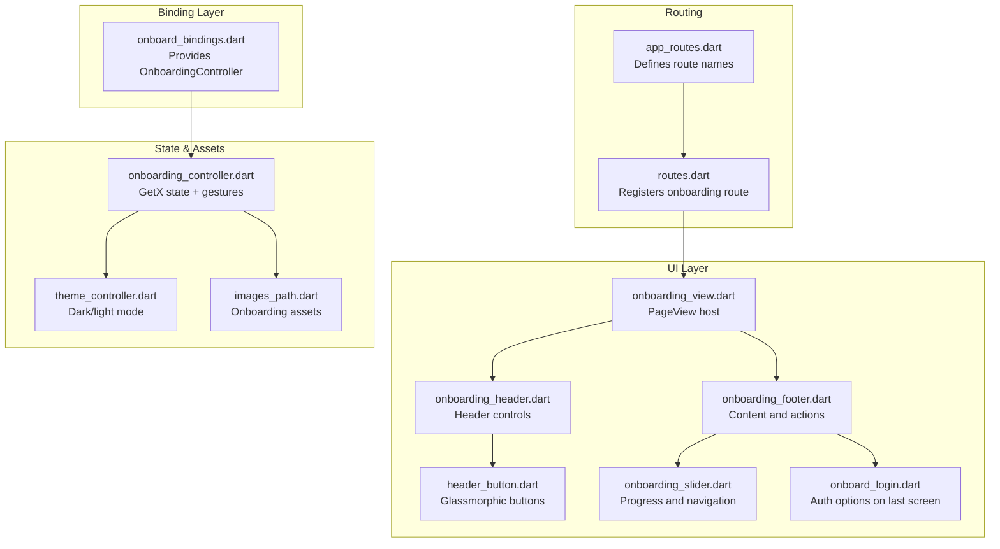
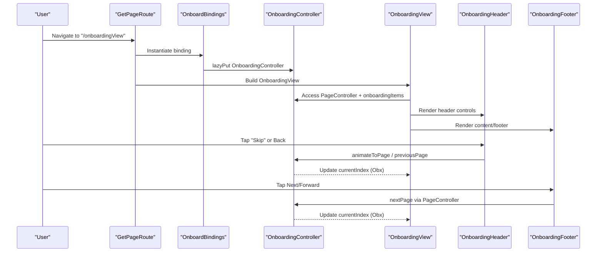
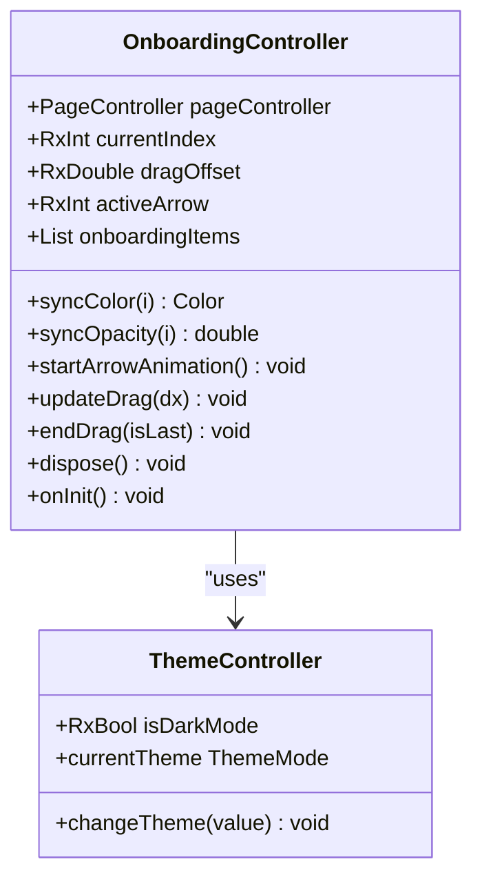
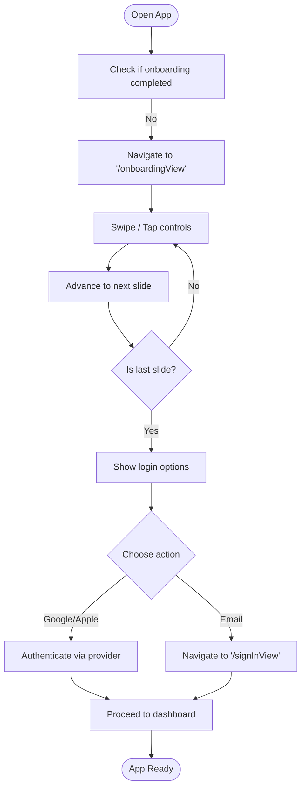
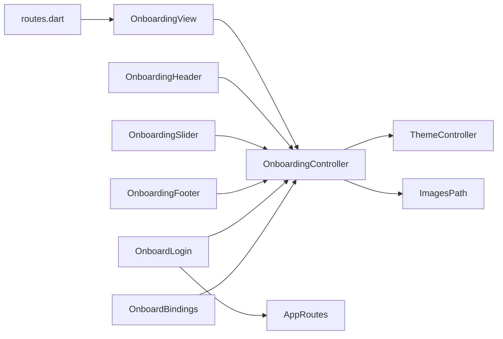

# Onboarding Flow

<cite>
**Referenced Files in This Document**
- [onboarding_controller.dart](file://lib/features/auth/controller/onboarding_controller.dart)
- [onboard_bindings.dart](file://lib/features/auth/bindings/onboard_bindings.dart)
- [onboarding_view.dart](file://lib/features/auth/views/onboarding_view.dart)
- [routes.dart](file://lib/core/routes/routes.dart)
- [app_routes.dart](file://lib/core/routes/app_routes.dart)
- [onboarding_footer.dart](file://lib/features/auth/widgets/onboarding_footer.dart)
- [onboarding_header.dart](file://lib/features/auth/widgets/onboarding_header.dart)
- [onboarding_slider.dart](file://lib/features/auth/widgets/onboarding_slider.dart)
- [header_button.dart](file://lib/features/auth/widgets/header_button.dart)
- [onboard_login.dart](file://lib/features/auth/widgets/onboard_login.dart)
- [images_path.dart](file://lib/core/constant/images_path.dart)
- [theme_controller.dart](file://lib/core/theme/theme_controller.dart)
</cite>

## Table of Contents
1. [Introduction](#introduction)
2. [Project Structure](#project-structure)
3. [Core Components](#core-components)
4. [Architecture Overview](#architecture-overview)
5. [Detailed Component Analysis](#detailed-component-analysis)
6. [Dependency Analysis](#dependency-analysis)
7. [Performance Considerations](#performance-considerations)
8. [Troubleshooting Guide](#troubleshooting-guide)
9. [Conclusion](#conclusion)

## Introduction
This document describes the Onboarding Flow component that introduces new users to the application through a guided, interactive experience. It covers the onboarding sequence, user engagement patterns, and completion criteria. The implementation leverages GetX for reactive state management, view binding configuration, and navigation flow. It integrates with the broader authentication flow to transition users into sign-in or registration after completing onboarding.

## Project Structure
The Onboarding Flow spans several layers:
- Route definition and registration
- View binding configuration for dependency injection
- Controller implementing onboarding state and gestures
- Reusable widgets for header, footer, slider, and login options
- Asset paths for onboarding images and icons
- Theme-aware rendering via ThemeController

**Diagram sources**
- [routes.dart:55-60](file://lib/core/routes/routes.dart#L55-L60)
- [app_routes.dart:1-34](file://lib/core/routes/app_routes.dart#L1-L34)
- [onboard_bindings.dart:4-9](file://lib/features/auth/bindings/onboard_bindings.dart#L4-L9)
- [onboarding_view.dart:8-54](file://lib/features/auth/views/onboarding_view.dart#L8-L54)
- [onboarding_header.dart:11-88](file://lib/features/auth/widgets/onboarding_header.dart#L11-L88)
- [onboarding_footer.dart:8-68](file://lib/features/auth/widgets/onboarding_footer.dart#L8-L68)
- [onboarding_slider.dart:8-131](file://lib/features/auth/widgets/onboarding_slider.dart#L8-L131)
- [header_button.dart:5-47](file://lib/features/auth/widgets/header_button.dart#L5-L47)
- [onboard_login.dart:12-75](file://lib/features/auth/widgets/onboard_login.dart#L12-L75)
- [onboarding_controller.dart:7-123](file://lib/features/auth/controller/onboarding_controller.dart#L7-L123)
- [theme_controller.dart:5-22](file://lib/core/theme/theme_controller.dart#L5-L22)
- [images_path.dart:1-20](file://lib/core/constant/images_path.dart#L1-L20)

**Section sources**
- [routes.dart:55-60](file://lib/core/routes/routes.dart#L55-L60)
- [app_routes.dart:1-34](file://lib/core/routes/app_routes.dart#L1-L34)
- [onboard_bindings.dart:4-9](file://lib/features/auth/bindings/onboard_bindings.dart#L4-L9)
- [onboarding_view.dart:8-54](file://lib/features/auth/views/onboarding_view.dart#L8-L54)
- [onboarding_controller.dart:7-123](file://lib/features/auth/controller/onboarding_controller.dart#L7-L123)
- [images_path.dart:1-20](file://lib/core/constant/images_path.dart#L1-L20)
- [theme_controller.dart:5-22](file://lib/core/theme/theme_controller.dart#L5-L22)

## Core Components
- OnboardingController: Manages onboarding state, PageController, drag gestures, arrow animation, and onboarding items list. It reacts to theme changes and selects appropriate assets for light/dark modes.
- OnboardingView: Hosts a PageView.builder that renders each onboarding item and coordinates with OnboardingHeader and OnboardingFooter.
- OnboardingHeader: Provides navigation controls (back/skip) and brand identity, reacting to current index.
- OnboardingFooter: Switches between “Next” content and “Login” options on the last slide.
- OnboardingSlider: Renders progress dots and forward navigation, adapting visuals for the second-last slide.
- OnboardLogin: Presents social and email login options on the final slide.
- Route Registration: Registers the onboarding route with its binding.
- ThemeController: Supplies dark/light mode state used by the controller and widgets.

**Section sources**
- [onboarding_controller.dart:7-123](file://lib/features/auth/controller/onboarding_controller.dart#L7-L123)
- [onboarding_view.dart:8-54](file://lib/features/auth/views/onboarding_view.dart#L8-L54)
- [onboarding_header.dart:11-88](file://lib/features/auth/widgets/onboarding_header.dart#L11-L88)
- [onboarding_footer.dart:8-68](file://lib/features/auth/widgets/onboarding_footer.dart#L8-L68)
- [onboarding_slider.dart:8-131](file://lib/features/auth/widgets/onboarding_slider.dart#L8-L131)
- [onboard_login.dart:12-75](file://lib/features/auth/widgets/onboard_login.dart#L12-L75)
- [routes.dart:55-60](file://lib/core/routes/routes.dart#L55-L60)
- [theme_controller.dart:5-22](file://lib/core/theme/theme_controller.dart#L5-L22)

## Architecture Overview
The Onboarding Flow follows a layered architecture:
- Routing layer defines the onboarding route and binds dependencies.
- Binding layer injects OnboardingController lazily.
- UI layer composes reusable widgets and delegates state updates to the controller.
- State layer manages reactive state and asset selection based on theme.

**Diagram sources**
- [routes.dart:55-60](file://lib/core/routes/routes.dart#L55-L60)
- [onboard_bindings.dart:4-9](file://lib/features/auth/bindings/onboard_bindings.dart#L4-L9)
- [onboarding_controller.dart:7-123](file://lib/features/auth/controller/onboarding_controller.dart#L7-L123)
- [onboarding_view.dart:8-54](file://lib/features/auth/views/onboarding_view.dart#L8-L54)
- [onboarding_header.dart:11-88](file://lib/features/auth/widgets/onboarding_header.dart#L11-L88)
- [onboarding_footer.dart:8-68](file://lib/features/auth/widgets/onboarding_footer.dart#L8-L68)

## Detailed Component Analysis

### OnboardingController
Responsibilities:
- Owns PageController and exposes currentIndex, dragOffset, and activeArrow for animations.
- Defines onboardingItems list with image paths, titles, and subtitles.
- Synchronizes colors and opacity based on activeArrow and theme mode.
- Animates the indicator arrow periodically.
- Handles gesture-driven page transitions with thresholds.
- Disposes PageController on teardown.

Key behaviors:
- Color synchronization uses ThemeController.isDarkMode to select light/dark gradients.
- Drag-based paging triggers page advancement when threshold is exceeded.
- Animation loop runs continuously to cycle activeArrow.

**Diagram sources**
- [onboarding_controller.dart:7-123](file://lib/features/auth/controller/onboarding_controller.dart#L7-L123)
- [theme_controller.dart:5-22](file://lib/core/theme/theme_controller.dart#L5-L22)

**Section sources**
- [onboarding_controller.dart:7-123](file://lib/features/auth/controller/onboarding_controller.dart#L7-L123)
- [theme_controller.dart:5-22](file://lib/core/theme/theme_controller.dart#L5-L22)

### OnboardingView
Responsibilities:
- Hosts PageView.builder configured with controller.pageController and controller.onboardingItems.
- Updates controller.currentIndex on page changes.
- Composes OnboardingHeader and OnboardingFooter per page.
- Applies background images from onboardingItems.

User interaction:
- Horizontal swipes trigger page changes.
- onPageChanged updates reactive currentIndex.

**Section sources**
- [onboarding_view.dart:8-54](file://lib/features/auth/views/onboarding_view.dart#L8-L54)

### OnboardingHeader
Responsibilities:
- Conditionally renders Back button and Skip action based on currentIndex.
- Uses HeaderButton for glassmorphic UI with rounded borders and backdrop blur.
- Navigates to previous page or jumps to the last page depending on position.

Behavior highlights:
- Back button hidden on the first page.
- Skip button hidden on the last two pages.
- Uses IconsPath assets for navigation icons.

**Section sources**
- [onboarding_header.dart:11-88](file://lib/features/auth/widgets/onboarding_header.dart#L11-L88)
- [header_button.dart:5-47](file://lib/features/auth/widgets/header_button.dart#L5-L47)

### OnboardingFooter
Responsibilities:
- Displays title and subtitle for the current slide.
- On the last slide, replaces “Next” content with OnboardLogin options.
- On intermediate slides, shows animated subtitle and OnboardingSlider.

Dynamic rendering:
- AnimatedSize transitions between “Next” and “Login” views.
- Shadow effects applied to text for readability against backgrounds.

**Section sources**
- [onboarding_footer.dart:8-68](file://lib/features/auth/widgets/onboarding_footer.dart#L8-L68)
- [onboard_login.dart:12-75](file://lib/features/auth/widgets/onboard_login.dart#L12-L75)

### OnboardingSlider
Responsibilities:
- Renders a row of progress indicators aligned with onboardingItems length minus one.
- Adapts widths and radii for the currently selected indicator.
- Provides a forward navigation control that becomes expandable on the second-last slide.
- Uses gradient backgrounds and shadows consistent with theme mode.

Gesture integration:
- Forward navigation triggers nextPage on PageController when not on the last slide.

**Section sources**
- [onboarding_slider.dart:8-131](file://lib/features/auth/widgets/onboarding_slider.dart#L8-L131)

### OnboardLogin
Responsibilities:
- Presents three login options: Google, Apple, and Email.
- Integrates with FirebaseGoogleAuthService for Google sign-in.
- Navigates to sign-in view for email-based login.

UX considerations:
- Consistent spacing and typography with shadow effects.
- Theme-aware icon coloring for Apple button.

**Section sources**
- [onboard_login.dart:12-75](file://lib/features/auth/widgets/onboard_login.dart#L12-L75)

### Route Registration and Navigation Flow
- Route registration maps the onboarding route to OnboardingView with OnboardBindings.
- On the last slide, tapping the expandable forward control triggers navigation to the sign-in view.
- The route names are centralized in AppRoutes.

**Diagram sources**
- [routes.dart:55-60](file://lib/core/routes/routes.dart#L55-L60)
- [app_routes.dart:1-34](file://lib/core/routes/app_routes.dart#L1-L34)
- [onboarding_footer.dart:42-63](file://lib/features/auth/widgets/onboarding_footer.dart#L42-L63)
- [onboard_login.dart:30-57](file://lib/features/auth/widgets/onboard_login.dart#L30-L57)

**Section sources**
- [routes.dart:55-60](file://lib/core/routes/routes.dart#L55-L60)
- [app_routes.dart:1-34](file://lib/core/routes/app_routes.dart#L1-L34)
- [onboarding_footer.dart:42-63](file://lib/features/auth/widgets/onboarding_footer.dart#L42-L63)
- [onboard_login.dart:30-57](file://lib/features/auth/widgets/onboard_login.dart#L30-L57)

## Dependency Analysis
- OnboardingController depends on ThemeController for theme-aware color selection and on ImagesPath for asset resolution.
- OnboardingView depends on OnboardingController for state and PageController.
- OnboardingHeader and OnboardingSlider depend on OnboardingController for reactive updates.
- OnboardLogin depends on AppRoutes for navigation and FirebaseGoogleAuthService for authentication.
- Routes register the onboarding page with OnboardBindings to inject OnboardingController.

**Diagram sources**
- [onboarding_controller.dart:7-123](file://lib/features/auth/controller/onboarding_controller.dart#L7-L123)
- [theme_controller.dart:5-22](file://lib/core/theme/theme_controller.dart#L5-L22)
- [images_path.dart:1-20](file://lib/core/constant/images_path.dart#L1-L20)
- [onboarding_view.dart:8-54](file://lib/features/auth/views/onboarding_view.dart#L8-L54)
- [onboarding_header.dart:11-88](file://lib/features/auth/widgets/onboarding_header.dart#L11-L88)
- [onboarding_slider.dart:8-131](file://lib/features/auth/widgets/onboarding_slider.dart#L8-L131)
- [onboarding_footer.dart:8-68](file://lib/features/auth/widgets/onboarding_footer.dart#L8-L68)
- [onboard_login.dart:12-75](file://lib/features/auth/widgets/onboard_login.dart#L12-L75)
- [routes.dart:55-60](file://lib/core/routes/routes.dart#L55-L60)
- [onboard_bindings.dart:4-9](file://lib/features/auth/bindings/onboard_bindings.dart#L4-L9)
- [app_routes.dart:1-34](file://lib/core/routes/app_routes.dart#L1-L34)

**Section sources**
- [onboarding_controller.dart:7-123](file://lib/features/auth/controller/onboarding_controller.dart#L7-L123)
- [onboarding_view.dart:8-54](file://lib/features/auth/views/onboarding_view.dart#L8-L54)
- [onboarding_header.dart:11-88](file://lib/features/auth/widgets/onboarding_header.dart#L11-L88)
- [onboarding_slider.dart:8-131](file://lib/features/auth/widgets/onboarding_slider.dart#L8-L131)
- [onboarding_footer.dart:8-68](file://lib/features/auth/widgets/onboarding_footer.dart#L8-L68)
- [onboard_login.dart:12-75](file://lib/features/auth/widgets/onboard_login.dart#L12-L75)
- [routes.dart:55-60](file://lib/core/routes/routes.dart#L55-L60)
- [onboard_bindings.dart:4-9](file://lib/features/auth/bindings/onboard_bindings.dart#L4-L9)
- [app_routes.dart:1-34](file://lib/core/routes/app_routes.dart#L1-L34)
- [images_path.dart:1-20](file://lib/core/constant/images_path.dart#L1-L20)
- [theme_controller.dart:5-22](file://lib/core/theme/theme_controller.dart#L5-L22)

## Performance Considerations
- PageView.builder ensures efficient rendering of onboarding pages.
- Reactive updates via Obx minimize rebuild scope to affected widgets.
- Continuous arrow animation loop should be started once during initialization and disposed appropriately.
- Drag-based paging uses clamp and delayed animations to avoid jank; keep durations reasonable.
- Asset loading relies on pre-bundled images; ensure assets are optimized for size and resolution.

## Troubleshooting Guide
Common issues and resolutions:
- Pages not advancing on swipe:
  - Verify PageController is attached and has clients before calling nextPage.
  - Confirm onPageChanged updates currentIndex.
- Arrow animation not visible:
  - Ensure startArrowAnimation is invoked during onInit.
  - Check activeArrow updates and syncColor/syncOpacity logic.
- Wrong assets shown in dark mode:
  - Confirm ThemeController isDarkMode is properly detected and ImagesPath values are set.
- Skip or Back buttons not working:
  - Validate index checks and PageController calls in OnboardingHeader.
- Login options not appearing on last slide:
  - Ensure currentIndex comparison matches onboardingItems length and OnboardingFooter switches to OnboardLogin.

**Section sources**
- [onboarding_controller.dart:38-68](file://lib/features/auth/controller/onboarding_controller.dart#L38-L68)
- [onboarding_header.dart:20-87](file://lib/features/auth/widgets/onboarding_header.dart#L20-L87)
- [onboarding_footer.dart:37-67](file://lib/features/auth/widgets/onboarding_footer.dart#L37-L67)
- [theme_controller.dart:5-22](file://lib/core/theme/theme_controller.dart#L5-L22)
- [images_path.dart:1-20](file://lib/core/constant/images_path.dart#L1-L20)

## Conclusion
The Onboarding Flow provides a polished, theme-aware introduction to the application using GetX for reactive state and navigation. The modular widget architecture enables easy maintenance and extension. By centralizing routes and bindings, the flow integrates seamlessly with the authentication system, guiding users toward sign-in or registration upon completion.