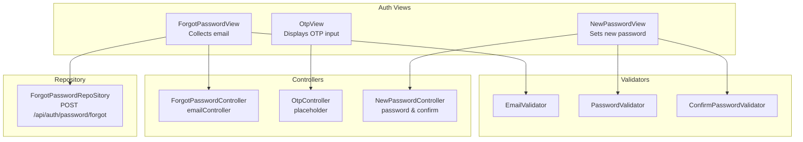
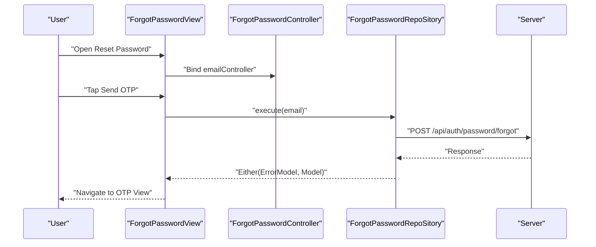
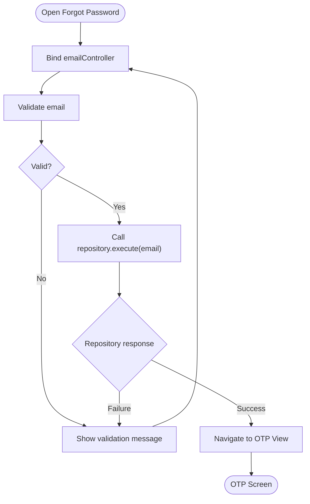
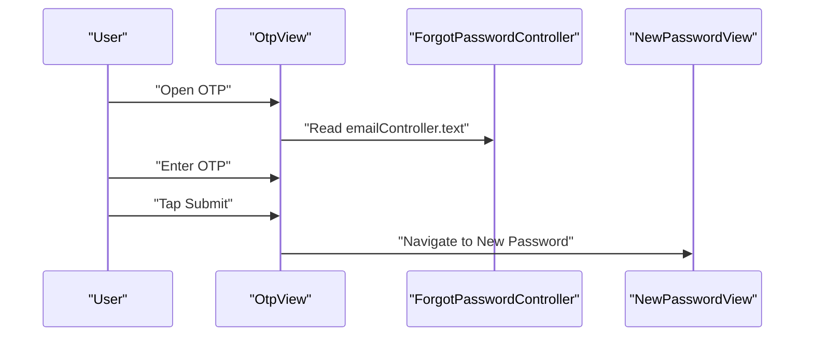
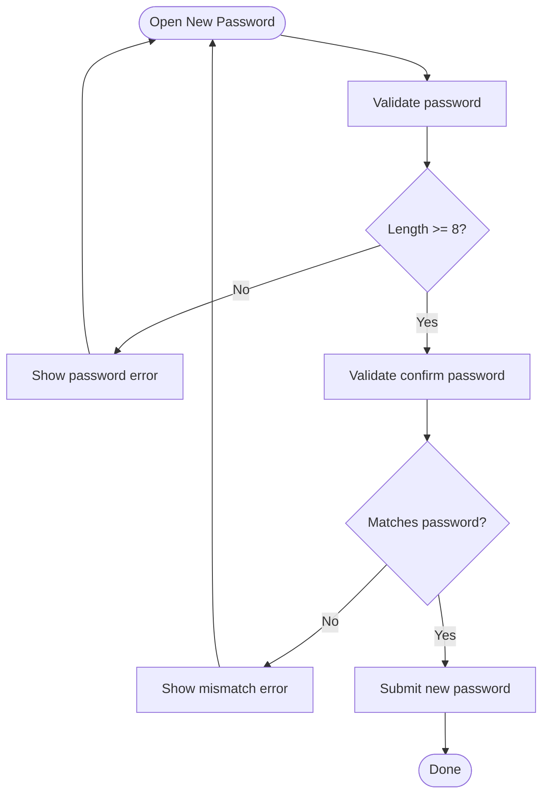
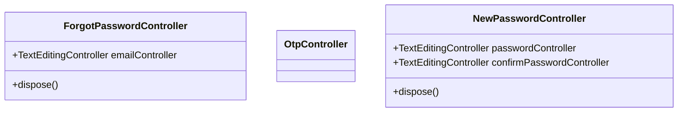
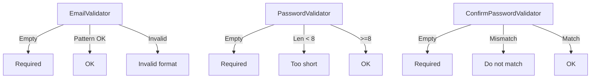
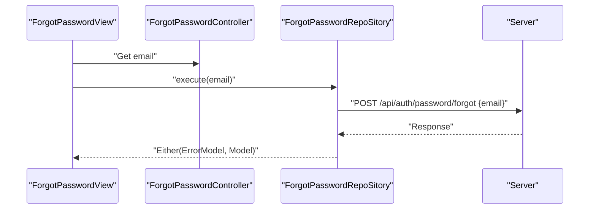
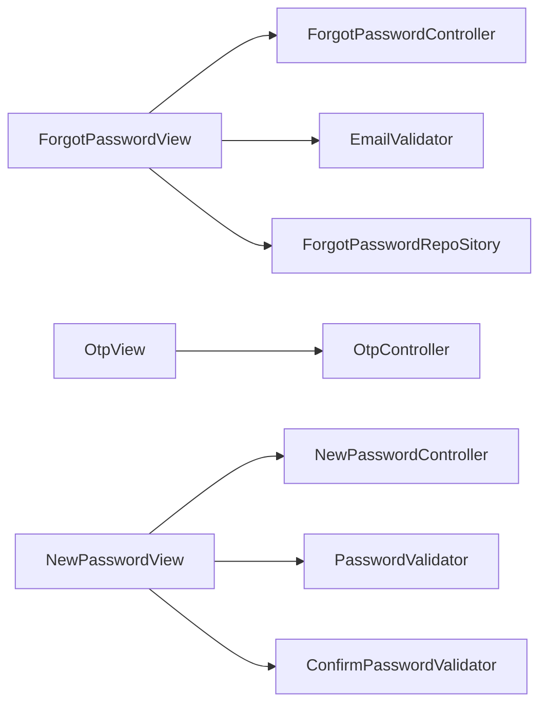

# Password Reset

<cite>
**Referenced Files in This Document**
- [forgot_password_controller.dart](file://lib/features/auth/controller/forgot_password_controller.dart)
- [otp_controller.dart](file://lib/features/auth/controller/otp_controller.dart)
- [new_password_controller.dart](file://lib/features/auth/controller/new_password_controller.dart)
- [forgot_password_view.dart](file://lib/features/auth/views/forgot_password_view.dart)
- [otp_view.dart](file://lib/features/auth/views/otp_view.dart)
- [new_password_view.dart](file://lib/features/auth/views/new_password_view.dart)
- [email_validator.dart](file://lib/shared/extensions/validators/email_validator.dart)
- [password_validator.dart](file://lib/shared/extensions/validators/password_validator.dart)
- [confirm_password_validator.dart](file://lib/shared/extensions/validators/confirm_password_validator.dart)
- [forgot_password_repo.dart](file://lib/features/auth/repositories/forgot_password_repo.dart)
</cite>

## Table of Contents
1. [Introduction](#introduction)
2. [Project Structure](#project-structure)
3. [Core Components](#core-components)
4. [Architecture Overview](#architecture-overview)
5. [Detailed Component Analysis](#detailed-component-analysis)
6. [Dependency Analysis](#dependency-analysis)
7. [Performance Considerations](#performance-considerations)
8. [Troubleshooting Guide](#troubleshooting-guide)
9. [Conclusion](#conclusion)

## Introduction
This document describes the Password Reset component end-to-end. It covers the complete workflow from initiating a password reset via email, verifying an OTP, to setting a new password. It documents the controllers and views involved, validation rules, and outlines the repository integration for sending reset requests. It also highlights current implementation gaps and provides guidance for extending the feature with robust OTP handling, password strength enforcement, error handling, timeouts, and integration with authentication services.

## Project Structure
The Password Reset feature is organized around three primary screens and their associated controllers:
- Forgot Password screen: collects the user’s email and triggers the reset request.
- OTP Verification screen: displays a 5-digit OTP input and navigates to the new password screen.
- New Password screen: accepts the new password and confirmation, enforcing password rules.

Controllers manage UI state and text editing using GetX. Validation utilities enforce input correctness. A repository encapsulates the network call to send the reset request.

**Diagram sources**
- [forgot_password_view.dart:16-71](file://lib/features/auth/views/forgot_password_view.dart#L16-L71)
- [otp_view.dart:13-79](file://lib/features/auth/views/otp_view.dart#L13-L79)
- [new_password_view.dart:14-93](file://lib/features/auth/views/new_password_view.dart#L14-L93)
- [forgot_password_controller.dart:4-12](file://lib/features/auth/controller/forgot_password_controller.dart#L4-L12)
- [otp_controller.dart:3-3](file://lib/features/auth/controller/otp_controller.dart#L3-L3)
- [new_password_controller.dart:4-14](file://lib/features/auth/controller/new_password_controller.dart#L4-L14)
- [email_validator.dart:1-14](file://lib/shared/extensions/validators/email_validator.dart#L1-L14)
- [password_validator.dart:1-11](file://lib/shared/extensions/validators/password_validator.dart#L1-L11)
- [confirm_password_validator.dart:1-11](file://lib/shared/extensions/validators/confirm_password_validator.dart#L1-L11)
- [forgot_password_repo.dart:9-24](file://lib/features/auth/repositories/forgot_password_repo.dart#L9-L24)

**Section sources**
- [forgot_password_view.dart:16-71](file://lib/features/auth/views/forgot_password_view.dart#L16-L71)
- [otp_view.dart:13-79](file://lib/features/auth/views/otp_view.dart#L13-L79)
- [new_password_view.dart:14-93](file://lib/features/auth/views/new_password_view.dart#L14-L93)
- [forgot_password_controller.dart:4-12](file://lib/features/auth/controller/forgot_password_controller.dart#L4-L12)
- [otp_controller.dart:3-3](file://lib/features/auth/controller/otp_controller.dart#L3-L3)
- [new_password_controller.dart:4-14](file://lib/features/auth/controller/new_password_controller.dart#L4-L14)
- [email_validator.dart:1-14](file://lib/shared/extensions/validators/email_validator.dart#L1-L14)
- [password_validator.dart:1-11](file://lib/shared/extensions/validators/password_validator.dart#L1-L11)
- [confirm_password_validator.dart:1-11](file://lib/shared/extensions/validators/confirm_password_validator.dart#L1-L11)
- [forgot_password_repo.dart:9-24](file://lib/features/auth/repositories/forgot_password_repo.dart#L9-L24)

## Core Components
- ForgotPasswordController: Manages the email input field and lifecycle.
- OtpController: Placeholder controller for OTP state management.
- NewPasswordController: Manages password and confirm-password input fields.
- Validators:
  - EmailValidator: Ensures a properly formatted email.
  - PasswordValidator: Enforces minimum length for passwords.
  - ConfirmPasswordValidator: Ensures password and confirmation match.
- Repository:
  - ForgotPasswordRepoSitory: Sends the reset request to the backend endpoint.

Key responsibilities:
- View-layer validation binding and navigation.
- Controller-managed state for inputs.
- Repository abstraction for network operations.

**Section sources**
- [forgot_password_controller.dart:4-12](file://lib/features/auth/controller/forgot_password_controller.dart#L4-L12)
- [otp_controller.dart:3-3](file://lib/features/auth/controller/otp_controller.dart#L3-L3)
- [new_password_controller.dart:4-14](file://lib/features/auth/controller/new_password_controller.dart#L4-L14)
- [email_validator.dart:1-14](file://lib/shared/extensions/validators/email_validator.dart#L1-L14)
- [password_validator.dart:1-11](file://lib/shared/extensions/validators/password_validator.dart#L1-L11)
- [confirm_password_validator.dart:1-11](file://lib/shared/extensions/validators/confirm_password_validator.dart#L1-L11)
- [forgot_password_repo.dart:9-24](file://lib/features/auth/repositories/forgot_password_repo.dart#L9-L24)

## Architecture Overview
The Password Reset flow integrates UI, state management, validation, and networking:

**Diagram sources**
- [forgot_password_view.dart:58-65](file://lib/features/auth/views/forgot_password_view.dart#L58-L65)
- [forgot_password_controller.dart:4-12](file://lib/features/auth/controller/forgot_password_controller.dart#L4-L12)
- [forgot_password_repo.dart:13-23](file://lib/features/auth/repositories/forgot_password_repo.dart#L13-L23)

## Detailed Component Analysis

### Forgot Password Screen
Purpose:
- Collect user email.
- Validate input.
- Navigate to OTP screen.
- Trigger repository call to send reset request.

Implementation highlights:
- Uses a dedicated controller to own the email text editing logic.
- Integrates email validation via a reusable validator extension.
- Navigates to OTP view upon submit.

**Diagram sources**
- [forgot_password_view.dart:48-65](file://lib/features/auth/views/forgot_password_view.dart#L48-L65)
- [email_validator.dart:1-14](file://lib/shared/extensions/validators/email_validator.dart#L1-L14)
- [forgot_password_repo.dart:13-23](file://lib/features/auth/repositories/forgot_password_repo.dart#L13-L23)

**Section sources**
- [forgot_password_view.dart:16-71](file://lib/features/auth/views/forgot_password_view.dart#L16-L71)
- [forgot_password_controller.dart:4-12](file://lib/features/auth/controller/forgot_password_controller.dart#L4-L12)
- [email_validator.dart:1-14](file://lib/shared/extensions/validators/email_validator.dart#L1-L14)
- [forgot_password_repo.dart:9-24](file://lib/features/auth/repositories/forgot_password_repo.dart#L9-L24)

### OTP Verification Screen
Purpose:
- Present a 5-digit OTP input.
- Allow user to submit OTP.
- Navigate to New Password screen.

Current behavior:
- Displays a message referencing the email from the Forgot Password controller.
- Provides an OTP input field.
- Navigates to the New Password view on submit.

**Diagram sources**
- [otp_view.dart:40-73](file://lib/features/auth/views/otp_view.dart#L40-L73)
- [forgot_password_controller.dart:4-12](file://lib/features/auth/controller/forgot_password_controller.dart#L4-L12)

**Section sources**
- [otp_view.dart:13-79](file://lib/features/auth/views/otp_view.dart#L13-L79)
- [otp_controller.dart:3-3](file://lib/features/auth/controller/otp_controller.dart#L3-L3)

### New Password Screen
Purpose:
- Accept new password and confirmation.
- Enforce password rules.
- Navigate to sign-in on completion.

Implementation highlights:
- Uses two controllers for password and confirmation.
- Applies password and confirm-password validators.
- Provides navigation back to sign-in.

**Diagram sources**
- [new_password_view.dart:45-65](file://lib/features/auth/views/new_password_view.dart#L45-L65)
- [password_validator.dart:1-11](file://lib/shared/extensions/validators/password_validator.dart#L1-L11)
- [confirm_password_validator.dart:1-11](file://lib/shared/extensions/validators/confirm_password_validator.dart#L1-L11)

**Section sources**
- [new_password_view.dart:14-93](file://lib/features/auth/views/new_password_view.dart#L14-L93)
- [new_password_controller.dart:4-14](file://lib/features/auth/controller/new_password_controller.dart#L4-L14)
- [password_validator.dart:1-11](file://lib/shared/extensions/validators/password_validator.dart#L1-L11)
- [confirm_password_validator.dart:1-11](file://lib/shared/extensions/validators/confirm_password_validator.dart#L1-L11)

### Controllers and State Management (GetX)
- ForgotPasswordController: Owns email input lifecycle.
- OtpController: Currently empty; intended for OTP state and submission.
- NewPasswordController: Owns password and confirm-password inputs.

**Diagram sources**
- [forgot_password_controller.dart:4-12](file://lib/features/auth/controller/forgot_password_controller.dart#L4-L12)
- [otp_controller.dart:3-3](file://lib/features/auth/controller/otp_controller.dart#L3-L3)
- [new_password_controller.dart:4-14](file://lib/features/auth/controller/new_password_controller.dart#L4-L14)

**Section sources**
- [forgot_password_controller.dart:4-12](file://lib/features/auth/controller/forgot_password_controller.dart#L4-L12)
- [otp_controller.dart:3-3](file://lib/features/auth/controller/otp_controller.dart#L3-L3)
- [new_password_controller.dart:4-14](file://lib/features/auth/controller/new_password_controller.dart#L4-L14)

### Validation Rules
- Email: Required and must match a standard email pattern.
- Password: Required and minimum length of 8 characters.
- Confirm Password: Required and must match the password value.

**Diagram sources**
- [email_validator.dart:1-14](file://lib/shared/extensions/validators/email_validator.dart#L1-L14)
- [password_validator.dart:1-11](file://lib/shared/extensions/validators/password_validator.dart#L1-L11)
- [confirm_password_validator.dart:1-11](file://lib/shared/extensions/validators/confirm_password_validator.dart#L1-L11)

**Section sources**
- [email_validator.dart:1-14](file://lib/shared/extensions/validators/email_validator.dart#L1-L14)
- [password_validator.dart:1-11](file://lib/shared/extensions/validators/password_validator.dart#L1-L11)
- [confirm_password_validator.dart:1-11](file://lib/shared/extensions/validators/confirm_password_validator.dart#L1-L11)

### Repository Integration
- Purpose: Encapsulate the network call to send the reset request.
- Endpoint: POST /api/auth/password/forgot
- Input: JSON body containing the email.
- Output: Either an error model or a successful model.

**Diagram sources**
- [forgot_password_view.dart:62-64](file://lib/features/auth/views/forgot_password_view.dart#L62-L64)
- [forgot_password_repo.dart:13-23](file://lib/features/auth/repositories/forgot_password_repo.dart#L13-L23)

**Section sources**
- [forgot_password_repo.dart:9-24](file://lib/features/auth/repositories/forgot_password_repo.dart#L9-L24)

## Dependency Analysis
- Views depend on their respective controllers for state and input handling.
- Views bind to validators for real-time feedback.
- Repository depends on a network utility to perform HTTP requests.
- Navigation is handled via named routes.

**Diagram sources**
- [forgot_password_view.dart:16-71](file://lib/features/auth/views/forgot_password_view.dart#L16-L71)
- [otp_view.dart:13-79](file://lib/features/auth/views/otp_view.dart#L13-L79)
- [new_password_view.dart:14-93](file://lib/features/auth/views/new_password_view.dart#L14-L93)
- [forgot_password_controller.dart:4-12](file://lib/features/auth/controller/forgot_password_controller.dart#L4-L12)
- [otp_controller.dart:3-3](file://lib/features/auth/controller/otp_controller.dart#L3-L3)
- [new_password_controller.dart:4-14](file://lib/features/auth/controller/new_password_controller.dart#L4-L14)
- [email_validator.dart:1-14](file://lib/shared/extensions/validators/email_validator.dart#L1-L14)
- [password_validator.dart:1-11](file://lib/shared/extensions/validators/password_validator.dart#L1-L11)
- [confirm_password_validator.dart:1-11](file://lib/shared/extensions/validators/confirm_password_validator.dart#L1-L11)
- [forgot_password_repo.dart:9-24](file://lib/features/auth/repositories/forgot_password_repo.dart#L9-L24)

**Section sources**
- [forgot_password_view.dart:16-71](file://lib/features/auth/views/forgot_password_view.dart#L16-L71)
- [otp_view.dart:13-79](file://lib/features/auth/views/otp_view.dart#L13-L79)
- [new_password_view.dart:14-93](file://lib/features/auth/views/new_password_view.dart#L14-L93)
- [forgot_password_controller.dart:4-12](file://lib/features/auth/controller/forgot_password_controller.dart#L4-L12)
- [otp_controller.dart:3-3](file://lib/features/auth/controller/otp_controller.dart#L3-L3)
- [new_password_controller.dart:4-14](file://lib/features/auth/controller/new_password_controller.dart#L4-L14)
- [email_validator.dart:1-14](file://lib/shared/extensions/validators/email_validator.dart#L1-L14)
- [password_validator.dart:1-11](file://lib/shared/extensions/validators/password_validator.dart#L1-L11)
- [confirm_password_validator.dart:1-11](file://lib/shared/extensions/validators/confirm_password_validator.dart#L1-L11)
- [forgot_password_repo.dart:9-24](file://lib/features/auth/repositories/forgot_password_repo.dart#L9-L24)

## Performance Considerations
- Keep controllers lightweight; avoid heavy computations in UI-bound controllers.
- Debounce or throttle network calls to prevent redundant submissions.
- Reuse validators to minimize repeated regex work.
- Use minimal rebuilds by binding only necessary parts of state to widgets.

## Troubleshooting Guide
Common issues and resolutions:
- Email validation failures:
  - Ensure the email field is not empty and matches the expected pattern.
  - Verify the validator is attached to the input field.
- Password validation failures:
  - Ensure the password meets the minimum length requirement.
  - Ensure the confirm password matches the password.
- Navigation issues:
  - Confirm route names are registered and consistent.
  - Ensure controllers are initialized before use.
- Network errors:
  - Inspect repository response handling and surface user-friendly messages.
  - Add retry logic and loading states for better UX.

**Section sources**
- [email_validator.dart:1-14](file://lib/shared/extensions/validators/email_validator.dart#L1-L14)
- [password_validator.dart:1-11](file://lib/shared/extensions/validators/password_validator.dart#L1-L11)
- [confirm_password_validator.dart:1-11](file://lib/shared/extensions/validators/confirm_password_validator.dart#L1-L11)
- [forgot_password_repo.dart:13-23](file://lib/features/auth/repositories/forgot_password_repo.dart#L13-L23)

## Conclusion
The Password Reset feature is structured around three screens and their controllers, with clear separation of concerns for validation and networking. While the current implementation focuses on UI and basic state management, future enhancements should include:
- OTP generation and verification logic in OtpController and repository.
- Stronger password policies and enforcement.
- Robust error handling and user feedback.
- Timeout management for OTP validity.
- Secure integration with authentication services and backend APIs.