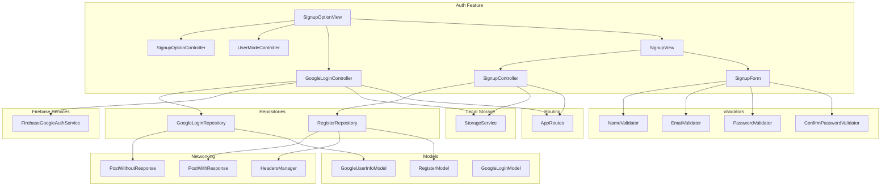
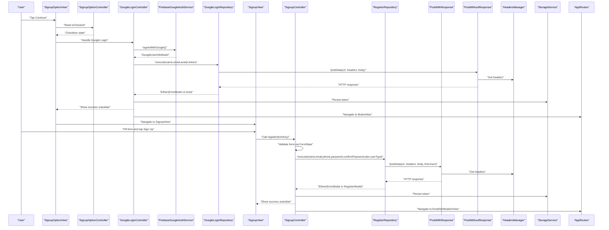
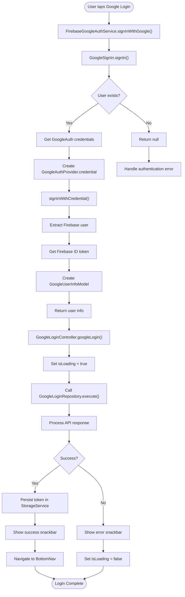
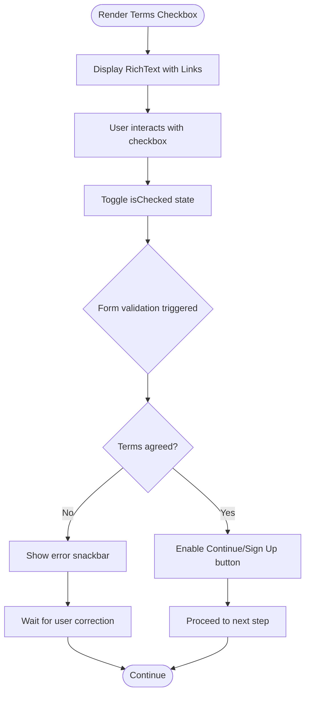
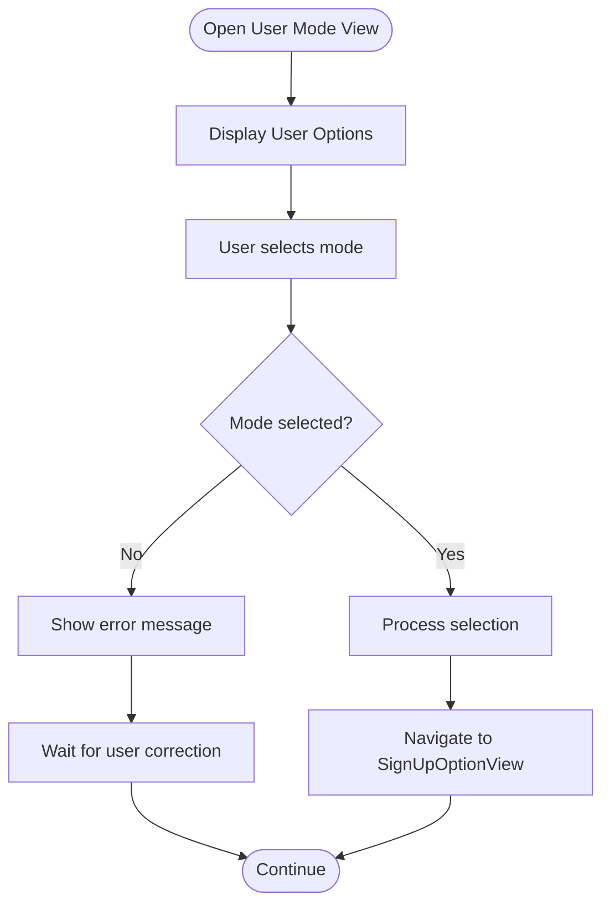
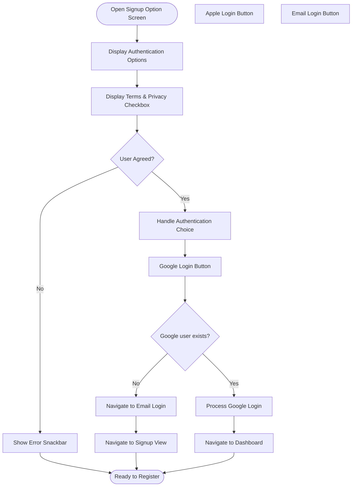
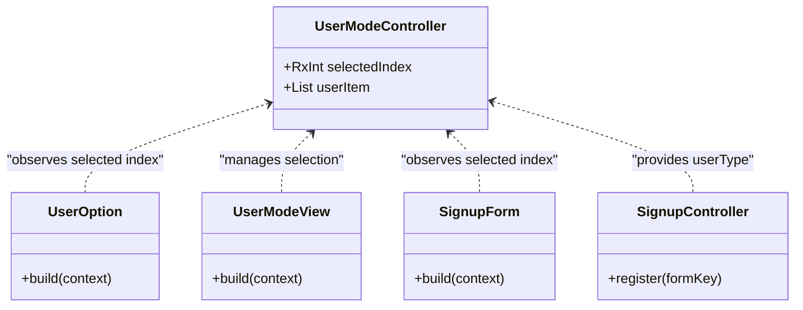
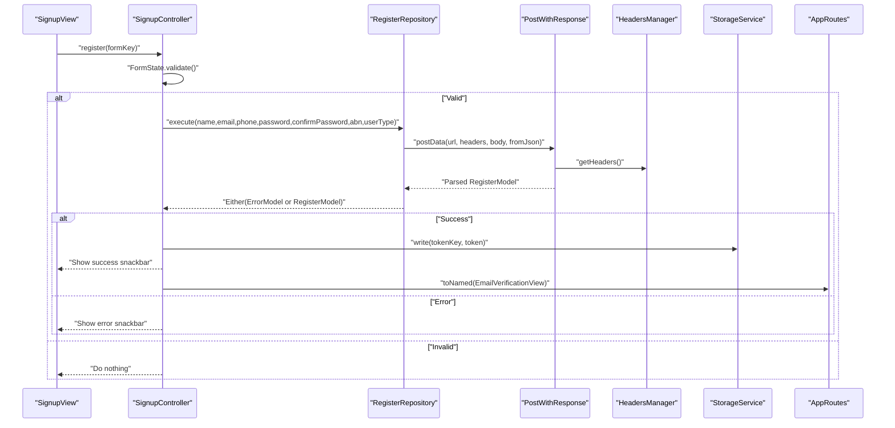
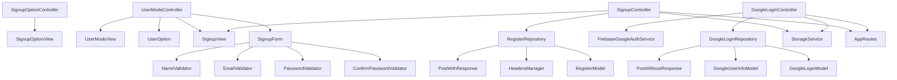

# Registration System

<cite>
**Referenced Files in This Document**
- [signup_option_controller.dart](file://lib/features/auth/controller/signup_option_controller.dart)
- [signup_controller.dart](file://lib/features/auth/controller/signup_controller.dart)
- [register_repo.dart](file://lib/features/auth/repositories/register_repo.dart)
- [register_model.dart](file://lib/features/auth/models/register_model.dart)
- [signup_view.dart](file://lib/features/auth/views/signup_view.dart)
- [signup_form.dart](file://lib/features/auth/widgets/signup_form.dart)
- [user_mode_controller.dart](file://lib/features/auth/controller/user_mode_controller.dart)
- [signup_option_view.dart](file://lib/features/auth/views/signup_option_view.dart)
- [google_login_controller.dart](file://lib/features/auth/controller/google_login_controller.dart)
- [google_login_repo.dart](file://lib/features/auth/repositories/google_login_repo.dart)
- [firebase_google_auth.dart](file://lib/core/services/firebase_google_auth.dart)
- [google_user_info_model.dart](file://lib/core/data/global_models/google_user_info_model.dart)
- [google_login_model.dart](file://lib/features/auth/models/google_login_model.dart)
- [auth_check_box.dart](file://lib/features/auth/widgets/auth_check_box.dart)
- [login_button.dart](file://lib/features/auth/widgets/login_button.dart)
- [user_option.dart](file://lib/features/auth/widgets/user_option.dart)
- [user_mode_view.dart](file://lib/features/auth/views/user_mode_view.dart)
- [name_validator.dart](file://lib/shared/extensions/validators/name_validator.dart)
- [email_validator.dart](file://lib/shared/extensions/validators/email_validator.dart)
- [password_validator.dart](file://lib/shared/extensions/validators/password_validator.dart)
- [confirm_password_validator.dart](file://lib/shared/extensions/validators/confirm_password_validator.dart)
- [post_with_response.dart](file://lib/core/data/networks/post_with_response.dart)
- [post_without_response.dart](file://lib/core/data/networks/post_without_response.dart)
- [headers_manager.dart](file://lib/core/data/networks/headers_manager.dart)
- [storage_service.dart](file://lib/core/data/local/storage_service.dart)
- [app_routes.dart](file://lib/core/routes/app_routes.dart)
</cite>

## Update Summary
**Changes Made**
- Added comprehensive Google login functionality with Firebase integration
- Enhanced terms agreement handling with improved user experience
- Improved user mode selection flow with better navigation and validation
- Added Google login repository and controller for social authentication
- Integrated Google login button with proper error handling and loading states

## Table of Contents
1. [Introduction](#introduction)
2. [Project Structure](#project-structure)
3. [Core Components](#core-components)
4. [Architecture Overview](#architecture-overview)
5. [Detailed Component Analysis](#detailed-component-analysis)
6. [Dependency Analysis](#dependency-analysis)
7. [Performance Considerations](#performance-considerations)
8. [Security and Data Sanitization](#security-and-data-sanitization)
9. [Troubleshooting Guide](#troubleshooting-guide)
10. [Conclusion](#conclusion)

## Introduction
This document provides comprehensive technical documentation for the Registration System component. It covers the complete user registration workflow, including signup option selection (personal/business), form validation, user data collection, and account creation. It explains the implementation of the SignupOptionController and SignupController with GetX state management, validation rules, and error handling. It also details the registration repository integration, API communication patterns, and data persistence. Additional topics include user mode selection logic, form field requirements, validation feedback mechanisms, success/error state management, security considerations, data sanitization, and integration with Firebase authentication services.

**Updated** Enhanced with comprehensive Google login functionality, improved terms agreement handling, and better user mode selection flow.

## Project Structure
The Registration System resides under the auth feature module and integrates with shared validators, core networking utilities, and routing. The primary components are organized as follows:
- Controllers: manage UI state and orchestrate registration actions
- Views: render the registration UI and collect user input
- Widgets: reusable form fields and validation helpers
- Repositories: encapsulate API communication and data modeling
- Models: define response and payload structures
- Validators: enforce field-specific validation rules
- Services and Utilities: handle storage, routing, and network headers
- Google Authentication: Firebase-based social login integration

**Diagram sources**
- [signup_option_view.dart:22-137](file://lib/features/auth/views/signup_option_view.dart#L22-L137)
- [signup_view.dart:18-96](file://lib/features/auth/views/signup_view.dart#L18-L96)
- [signup_form.dart:15-103](file://lib/features/auth/widgets/signup_form.dart#L15-L103)
- [signup_option_controller.dart:3-5](file://lib/features/auth/controller/signup_option_controller.dart#L3-L5)
- [signup_controller.dart:10-66](file://lib/features/auth/controller/signup_controller.dart#L10-L66)
- [user_mode_controller.dart:4-18](file://lib/features/auth/controller/user_mode_controller.dart#L4-L18)
- [google_login_controller.dart:9-35](file://lib/features/auth/controller/google_login_controller.dart#L9-L35)
- [google_login_repo.dart:7-28](file://lib/features/auth/repositories/google_login_repo.dart#L7-L28)
- [register_repo.dart:9-38](file://lib/features/auth/repositories/register_repo.dart#L9-L38)
- [register_model.dart:1-74](file://lib/features/auth/models/register_model.dart#L1-L74)
- [google_user_info_model.dart:1-20](file://lib/core/data/global_models/google_user_info_model.dart#L1-L20)
- [google_login_model.dart:1-64](file://lib/features/auth/models/google_login_model.dart#L1-L64)
- [name_validator.dart:1-15](file://lib/shared/extensions/validators/name_validator.dart#L1-L15)
- [email_validator.dart:1-14](file://lib/shared/extensions/validators/email_validator.dart#L1-L14)
- [password_validator.dart:1-11](file://lib/shared/extensions/validators/password_validator.dart#L1-L11)
- [confirm_password_validator.dart:1-11](file://lib/shared/extensions/validators/confirm_password_validator.dart#L1-L11)
- [post_with_response.dart](file://lib/core/data/networks/post_with_response.dart)
- [post_without_response.dart](file://lib/core/data/networks/post_without_response.dart)
- [headers_manager.dart](file://lib/core/data/networks/headers_manager.dart)
- [storage_service.dart](file://lib/core/data/local/storage_service.dart)
- [app_routes.dart](file://lib/core/routes/app_routes.dart)
- [firebase_google_auth.dart:6-83](file://lib/core/services/firebase_google_auth.dart#L6-L83)

**Section sources**
- [signup_option_view.dart:22-137](file://lib/features/auth/views/signup_option_view.dart#L22-L137)
- [signup_view.dart:18-96](file://lib/features/auth/views/signup_view.dart#L18-L96)
- [signup_form.dart:15-103](file://lib/features/auth/widgets/signup_form.dart#L15-L103)
- [signup_option_controller.dart:3-5](file://lib/features/auth/controller/signup_option_controller.dart#L3-L5)
- [signup_controller.dart:10-66](file://lib/features/auth/controller/signup_controller.dart#L10-L66)
- [user_mode_controller.dart:4-18](file://lib/features/auth/controller/user_mode_controller.dart#L4-L18)
- [google_login_controller.dart:9-35](file://lib/features/auth/controller/google_login_controller.dart#L9-L35)
- [google_login_repo.dart:7-28](file://lib/features/auth/repositories/google_login_repo.dart#L7-L28)
- [register_repo.dart:9-38](file://lib/features/auth/repositories/register_repo.dart#L9-L38)
- [register_model.dart:1-74](file://lib/features/auth/models/register_model.dart#L1-L74)
- [google_user_info_model.dart:1-20](file://lib/core/data/global_models/google_user_info_model.dart#L1-L20)
- [google_login_model.dart:1-64](file://lib/features/auth/models/google_login_model.dart#L1-L64)
- [name_validator.dart:1-15](file://lib/shared/extensions/validators/name_validator.dart#L1-L15)
- [email_validator.dart:1-14](file://lib/shared/extensions/validators/email_validator.dart#L1-L14)
- [password_validator.dart:1-11](file://lib/shared/extensions/validators/password_validator.dart#L1-L11)
- [confirm_password_validator.dart:1-11](file://lib/shared/extensions/validators/confirm_password_validator.dart#L1-L11)
- [post_with_response.dart](file://lib/core/data/networks/post_with_response.dart)
- [post_without_response.dart](file://lib/core/data/networks/post_without_response.dart)
- [headers_manager.dart](file://lib/core/data/networks/headers_manager.dart)
- [storage_service.dart](file://lib/core/data/local/storage_service.dart)
- [app_routes.dart](file://lib/core/routes/app_routes.dart)
- [firebase_google_auth.dart:6-83](file://lib/core/services/firebase_google_auth.dart#L6-L83)

## Core Components
This section outlines the primary building blocks of the Registration System and their responsibilities.

- SignupOptionController: Manages the agreement checkbox state for terms and privacy policy during initial signup option selection.
- SignupController: Orchestrates the registration flow, validates form data, invokes the repository, handles loading states, and manages navigation and storage upon success.
- GoogleLoginController: Handles Google social authentication flow, manages loading states, and coordinates with the Google login repository.
- RegisterRepository: Encapsulates the API call to the backend, constructs request payloads, and parses responses into typed models.
- GoogleLoginRepository: Manages Google authentication API calls and processes Firebase user credentials.
- RegisterModel: Defines the shape of the registration response, including token and user metadata.
- GoogleUserInfoModel: Represents Google user information including name, email, avatar, and Firebase ID token.
- GoogleLoginModel: Defines the structure for Google login responses and user data.
- UserModeController: Provides user mode selection (personal/business) and associated UI labels and icons.
- SignupView and SignupForm: Render the registration UI, collect inputs, apply validators, and trigger submission.
- AuthCheckBox: Enhanced terms and privacy policy agreement widget with rich text formatting.
- LoginButton: Reusable button component for social authentication options.
- Validation Extensions: Enforce field-specific validation rules for name, email, password, confirm password, and ABN (when applicable).
- Networking Utilities: Provide HTTP POST with response parsing and standardized headers.
- Local Storage: Persists authentication tokens after successful registration.
- Routing: Navigates to the email verification screen after successful registration.

**Section sources**
- [signup_option_controller.dart:3-5](file://lib/features/auth/controller/signup_option_controller.dart#L3-L5)
- [signup_controller.dart:10-66](file://lib/features/auth/controller/signup_controller.dart#L10-L66)
- [google_login_controller.dart:9-35](file://lib/features/auth/controller/google_login_controller.dart#L9-L35)
- [register_repo.dart:9-38](file://lib/features/auth/repositories/register_repo.dart#L9-L38)
- [google_login_repo.dart:7-28](file://lib/features/auth/repositories/google_login_repo.dart#L7-L28)
- [register_model.dart:1-74](file://lib/features/auth/models/register_model.dart#L1-L74)
- [google_user_info_model.dart:1-20](file://lib/core/data/global_models/google_user_info_model.dart#L1-L20)
- [google_login_model.dart:1-64](file://lib/features/auth/models/google_login_model.dart#L1-L64)
- [user_mode_controller.dart:4-18](file://lib/features/auth/controller/user_mode_controller.dart#L4-L18)
- [signup_view.dart:18-96](file://lib/features/auth/views/signup_view.dart#L18-L96)
- [signup_form.dart:15-103](file://lib/features/auth/widgets/signup_form.dart#L15-L103)
- [auth_check_box.dart:7-61](file://lib/features/auth/widgets/auth_check_box.dart#L7-L61)
- [login_button.dart:6-62](file://lib/features/auth/widgets/login_button.dart#L6-L62)
- [name_validator.dart:1-15](file://lib/shared/extensions/validators/name_validator.dart#L1-L15)
- [email_validator.dart:1-14](file://lib/shared/extensions/validators/email_validator.dart#L1-L14)
- [password_validator.dart:1-11](file://lib/shared/extensions/validators/password_validator.dart#L1-L11)
- [confirm_password_validator.dart:1-11](file://lib/shared/extensions/validators/confirm_password_validator.dart#L1-L11)
- [post_with_response.dart](file://lib/core/data/networks/post_with_response.dart)
- [post_without_response.dart](file://lib/core/data/networks/post_without_response.dart)
- [headers_manager.dart](file://lib/core/data/networks/headers_manager.dart)
- [storage_service.dart](file://lib/core/data/local/storage_service.dart)
- [app_routes.dart](file://lib/core/routes/app_routes.dart)

## Architecture Overview
The Registration System follows a layered architecture with enhanced Google authentication capabilities:
- Presentation Layer: Views and widgets render the UI and capture user input, including social login options.
- State Management: GetX controllers manage reactive state for UI updates and business logic coordination.
- Domain Layer: Controllers coordinate validation, state updates, and repository calls, including Google authentication.
- Data Layer: Repository encapsulates network requests and response parsing, supporting both traditional and social authentication.
- Infrastructure: Networking utilities and local storage provide cross-cutting concerns with Firebase integration.

**Diagram sources**
- [signup_option_view.dart:69-75](file://lib/features/auth/views/signup_option_view.dart#L69-L75)
- [signup_option_controller.dart:3-5](file://lib/features/auth/controller/signup_option_controller.dart#L3-L5)
- [google_login_controller.dart:15-34](file://lib/features/auth/controller/google_login_controller.dart#L15-L34)
- [firebase_google_auth.dart:15-63](file://lib/core/services/firebase_google_auth.dart#L15-L63)
- [google_login_repo.dart:11-27](file://lib/features/auth/repositories/google_login_repo.dart#L11-L27)
- [signup_view.dart:78-89](file://lib/features/auth/views/signup_view.dart#L78-L89)
- [signup_controller.dart:25-54](file://lib/features/auth/controller/signup_controller.dart#L25-L54)
- [register_repo.dart:14-37](file://lib/features/auth/repositories/register_repo.dart#L14-L37)
- [post_with_response.dart](file://lib/core/data/networks/post_with_response.dart)
- [post_without_response.dart](file://lib/core/data/networks/post_without_response.dart)
- [headers_manager.dart](file://lib/core/data/networks/headers_manager.dart)
- [storage_service.dart](file://lib/core/data/local/storage_service.dart)
- [app_routes.dart](file://lib/core/routes/app_routes.dart)

## Detailed Component Analysis

### Enhanced Google Login Functionality
The system now includes comprehensive Google authentication capabilities integrated with Firebase services.

Key features:
- FirebaseGoogleAuthService: Handles Google sign-in flow, credential processing, and user information extraction
- GoogleLoginController: Manages Google authentication state, loading indicators, and navigation
- GoogleLoginRepository: Processes Google authentication API calls with proper error handling
- GoogleUserInfoModel: Structured representation of Google user data including Firebase ID tokens
- Social login buttons: Integrated Google, Apple, and email authentication options

**Diagram sources**
- [firebase_google_auth.dart:15-63](file://lib/core/services/firebase_google_auth.dart#L15-L63)
- [google_login_controller.dart:15-34](file://lib/features/auth/controller/google_login_controller.dart#L15-L34)
- [google_login_repo.dart:11-27](file://lib/features/auth/repositories/google_login_repo.dart#L11-L27)
- [google_user_info_model.dart:1-20](file://lib/core/data/global_models/google_user_info_model.dart#L1-L20)

**Section sources**
- [firebase_google_auth.dart:6-83](file://lib/core/services/firebase_google_auth.dart#L6-L83)
- [google_login_controller.dart:9-35](file://lib/features/auth/controller/google_login_controller.dart#L9-L35)
- [google_login_repo.dart:7-28](file://lib/features/auth/repositories/google_login_repo.dart#L7-L28)
- [google_user_info_model.dart:1-20](file://lib/core/data/global_models/google_user_info_model.dart#L1-L20)
- [google_login_model.dart:1-64](file://lib/features/auth/models/google_login_model.dart#L1-L64)

### Enhanced Terms Agreement Handling
The terms and privacy policy agreement has been improved with better user experience and visual feedback.

Key improvements:
- AuthCheckBox widget: Rich text formatting with blue links for Terms and Privacy Policy
- Consistent validation across both signup option and main signup screens
- Enhanced error messaging with clear guidance
- Improved visual hierarchy and accessibility

**Diagram sources**
- [auth_check_box.dart:16-61](file://lib/features/auth/widgets/auth_check_box.dart#L16-L61)
- [signup_option_view.dart:105-132](file://lib/features/auth/views/signup_option_view.dart#L105-L132)
- [signup_view.dart:59-89](file://lib/features/auth/views/signup_view.dart#L59-L89)

**Section sources**
- [auth_check_box.dart:7-61](file://lib/features/auth/widgets/auth_check_box.dart#L7-L61)
- [signup_option_view.dart:97-132](file://lib/features/auth/views/signup_option_view.dart#L97-L132)
- [signup_view.dart:59-89](file://lib/features/auth/views/signup_view.dart#L59-L89)

### Improved User Mode Selection Flow
The user mode selection has been enhanced with better navigation and user experience.

Key improvements:
- UserModeView: Dedicated view for user mode selection with clear options
- UserOption widget: Interactive radio button selection with visual feedback
- Enhanced navigation: Direct routing to appropriate signup option based on selection
- Better visual hierarchy: Clear distinction between personal and business accounts

**Diagram sources**
- [user_mode_view.dart:14-76](file://lib/features/auth/views/user_mode_view.dart#L14-L76)
- [user_option.dart:9-82](file://lib/features/auth/widgets/user_option.dart#L9-L82)
- [user_mode_controller.dart:4-18](file://lib/features/auth/controller/user_mode_controller.dart#L4-L18)

**Section sources**
- [user_mode_view.dart:14-76](file://lib/features/auth/views/user_mode_view.dart#L14-L76)
- [user_option.dart:9-82](file://lib/features/auth/widgets/user_option.dart#L9-L82)
- [user_mode_controller.dart:4-18](file://lib/features/auth/controller/user_mode_controller.dart#L4-L18)

### Signup Option Selection (Client/Provider)
The signup option screen allows users to choose between personal and business accounts and agree to terms and privacy policy. The selection influences subsequent screens and form fields.

Key behaviors:
- Checkbox state managed by SignupOptionController
- Navigation to the main signup form only when terms are agreed
- Conditional rendering of business-specific fields on the main signup screen
- Social login integration with Google, Apple, and email options

**Diagram sources**
- [signup_option_view.dart:65-132](file://lib/features/auth/views/signup_option_view.dart#L65-L132)
- [signup_option_controller.dart:3-5](file://lib/features/auth/controller/signup_option_controller.dart#L3-L5)
- [firebase_google_auth.dart:15-63](file://lib/core/services/firebase_google_auth.dart#L15-L63)

**Section sources**
- [signup_option_view.dart:22-137](file://lib/features/auth/views/signup_option_view.dart#L22-L137)
- [signup_option_controller.dart:3-5](file://lib/features/auth/controller/signup_option_controller.dart#L3-L5)

### User Mode Selection Logic
UserModeController defines two modes:
- Personal Account: Suitable for individuals
- Business Account: Suitable for organizations

The selected index determines:
- UI labels and placeholders in the signup form
- The userType value passed to the backend ("customer" or "business")
- Visibility of ABN field for business accounts

**Diagram sources**
- [user_mode_controller.dart:4-18](file://lib/features/auth/controller/user_mode_controller.dart#L4-L18)
- [user_option.dart:9-82](file://lib/features/auth/widgets/user_option.dart#L9-L82)
- [user_mode_view.dart:14-76](file://lib/features/auth/views/user_mode_view.dart#L14-L76)
- [signup_form.dart:21-98](file://lib/features/auth/widgets/signup_form.dart#L21-L98)
- [signup_controller.dart:35-37](file://lib/features/auth/controller/signup_controller.dart#L35-L37)

**Section sources**
- [user_mode_controller.dart:4-18](file://lib/features/auth/controller/user_mode_controller.dart#L4-L18)
- [user_option.dart:9-82](file://lib/features/auth/widgets/user_option.dart#L9-L82)
- [user_mode_view.dart:14-76](file://lib/features/auth/views/user_mode_view.dart#L14-L76)
- [signup_form.dart:21-98](file://lib/features/auth/widgets/signup_form.dart#L21-L98)
- [signup_controller.dart:35-37](file://lib/features/auth/controller/signup_controller.dart#L35-L37)

### Form Validation and Field Requirements
The signup form enforces strict validation rules for each field. Validation occurs on user interaction and is applied conditionally based on user mode.

Required fields:
- Full Name: Minimum length and alphabetic characters only
- Email: RFC-compliant format
- Password: Minimum length requirement
- Confirm Password: Must match the password field
- Phone Number: Numeric and formatted appropriately
- ABN Number: Required only for business accounts

**Diagram sources**
- [signup_form.dart:27-98](file://lib/features/auth/widgets/signup_form.dart#L27-L98)
- [name_validator.dart:1-15](file://lib/shared/extensions/validators/name_validator.dart#L1-L15)
- [email_validator.dart:1-14](file://lib/shared/extensions/validators/email_validator.dart#L1-L14)
- [password_validator.dart:1-11](file://lib/shared/extensions/validators/password_validator.dart#L1-L11)
- [confirm_password_validator.dart:1-11](file://lib/shared/extensions/validators/confirm_password_validator.dart#L1-L11)

**Section sources**
- [signup_form.dart:15-103](file://lib/features/auth/widgets/signup_form.dart#L15-L103)
- [name_validator.dart:1-15](file://lib/shared/extensions/validators/name_validator.dart#L1-L15)
- [email_validator.dart:1-14](file://lib/shared/extensions/validators/email_validator.dart#L1-L14)
- [password_validator.dart:1-11](file://lib/shared/extensions/validators/password_validator.dart#L1-L11)
- [confirm_password_validator.dart:1-11](file://lib/shared/extensions/validators/confirm_password_validator.dart#L1-L11)

### Registration Workflow and API Communication
The registration workflow coordinates UI state, validation, repository calls, and persistence.

**Diagram sources**
- [signup_view.dart:78-88](file://lib/features/auth/views/signup_view.dart#L78-L88)
- [signup_controller.dart:25-54](file://lib/features/auth/controller/signup_controller.dart#L25-L54)
- [register_repo.dart:14-37](file://lib/features/auth/repositories/register_repo.dart#L14-L37)
- [post_with_response.dart](file://lib/core/data/networks/post_with_response.dart)
- [headers_manager.dart](file://lib/core/data/networks/headers_manager.dart)
- [storage_service.dart](file://lib/core/data/local/storage_service.dart)
- [app_routes.dart](file://lib/core/routes/app_routes.dart)

**Section sources**
- [signup_view.dart:18-96](file://lib/features/auth/views/signup_view.dart#L18-L96)
- [signup_controller.dart:10-66](file://lib/features/auth/controller/signup_controller.dart#L10-L66)
- [register_repo.dart:9-38](file://lib/features/auth/repositories/register_repo.dart#L9-L38)
- [register_model.dart:1-74](file://lib/features/auth/models/register_model.dart#L1-L74)

### Data Persistence and Token Management
On successful registration, the system persists the authentication token locally and navigates to the email verification screen. This ensures the user can proceed with the verification flow without re-authentication.

Key steps:
- Persist token using StorageService
- Show success snackbar
- Navigate to email verification route

**Section sources**
- [signup_controller.dart:44-51](file://lib/features/auth/controller/signup_controller.dart#L44-L51)
- [storage_service.dart](file://lib/core/data/local/storage_service.dart)
- [app_routes.dart](file://lib/core/routes/app_routes.dart)

### Firebase Authentication Integration
The project includes comprehensive Firebase Google authentication services with enhanced functionality:

- FirebaseGoogleAuthService: Centralized Google authentication service with proper error handling
- Google authentication flow: End-to-end Google sign-in with credential processing
- Token management: Proper Firebase ID token extraction and handling
- Integration points: Seamless integration with existing registration system

**Section sources**
- [firebase_google_auth.dart:6-83](file://lib/core/services/firebase_google_auth.dart#L6-L83)
- [google_login_controller.dart:9-35](file://lib/features/auth/controller/google_login_controller.dart#L9-L35)
- [google_login_repo.dart:7-28](file://lib/features/auth/repositories/google_login_repo.dart#L7-L28)

## Dependency Analysis
The Registration System exhibits clear separation of concerns with low coupling and high cohesion among components, enhanced with Google authentication capabilities.

**Diagram sources**
- [signup_option_controller.dart:3-5](file://lib/features/auth/controller/signup_option_controller.dart#L3-L5)
- [signup_option_view.dart:22-137](file://lib/features/auth/views/signup_option_view.dart#L22-L137)
- [user_mode_controller.dart:4-18](file://lib/features/auth/controller/user_mode_controller.dart#L4-L18)
- [user_mode_view.dart:14-76](file://lib/features/auth/views/user_mode_view.dart#L14-L76)
- [user_option.dart:9-82](file://lib/features/auth/widgets/user_option.dart#L9-L82)
- [signup_view.dart:18-96](file://lib/features/auth/views/signup_view.dart#L18-L96)
- [signup_form.dart:15-103](file://lib/features/auth/widgets/signup_form.dart#L15-L103)
- [signup_controller.dart:10-66](file://lib/features/auth/controller/signup_controller.dart#L10-L66)
- [register_repo.dart:9-38](file://lib/features/auth/repositories/register_repo.dart#L9-L38)
- [register_model.dart:1-74](file://lib/features/auth/models/register_model.dart#L1-L74)
- [google_login_controller.dart:9-35](file://lib/features/auth/controller/google_login_controller.dart#L9-L35)
- [firebase_google_auth.dart:6-83](file://lib/core/services/firebase_google_auth.dart#L6-L83)
- [google_login_repo.dart:7-28](file://lib/features/auth/repositories/google_login_repo.dart#L7-L28)
- [google_user_info_model.dart:1-20](file://lib/core/data/global_models/google_user_info_model.dart#L1-L20)
- [google_login_model.dart:1-64](file://lib/features/auth/models/google_login_model.dart#L1-L64)
- [name_validator.dart:1-15](file://lib/shared/extensions/validators/name_validator.dart#L1-L15)
- [email_validator.dart:1-14](file://lib/shared/extensions/validators/email_validator.dart#L1-L14)
- [password_validator.dart:1-11](file://lib/shared/extensions/validators/password_validator.dart#L1-L11)
- [confirm_password_validator.dart:1-11](file://lib/shared/extensions/validators/confirm_password_validator.dart#L1-L11)
- [post_with_response.dart](file://lib/core/data/networks/post_with_response.dart)
- [post_without_response.dart](file://lib/core/data/networks/post_without_response.dart)
- [headers_manager.dart](file://lib/core/data/networks/headers_manager.dart)
- [storage_service.dart](file://lib/core/data/local/storage_service.dart)
- [app_routes.dart](file://lib/core/routes/app_routes.dart)

**Section sources**
- [signup_controller.dart:10-66](file://lib/features/auth/controller/signup_controller.dart#L10-L66)
- [register_repo.dart:9-38](file://lib/features/auth/repositories/register_repo.dart#L9-L38)
- [signup_view.dart:18-96](file://lib/features/auth/views/signup_view.dart#L18-L96)
- [signup_form.dart:15-103](file://lib/features/auth/widgets/signup_form.dart#L15-L103)
- [google_login_controller.dart:9-35](file://lib/features/auth/controller/google_login_controller.dart#L9-L35)
- [firebase_google_auth.dart:6-83](file://lib/core/services/firebase_google_auth.dart#L6-L83)
- [google_login_repo.dart:7-28](file://lib/features/auth/repositories/google_login_repo.dart#L7-L28)

## Performance Considerations
- Reactive UI updates: GetX controllers minimize rebuilds by observing only necessary state variables.
- Network efficiency: Repository consolidates request construction and response parsing to reduce duplication.
- Validation feedback: Immediate validation on user interaction reduces unnecessary submissions.
- Loading states: UI displays a loading indicator during registration and Google authentication to prevent duplicate submissions.
- Social authentication caching: Google authentication results are cached to improve performance on subsequent attempts.
- Error handling: Comprehensive error handling prevents UI crashes and provides graceful degradation.

## Security and Data Sanitization
- Input sanitization: Validators enforce minimum lengths and acceptable formats for each field.
- Secure transmission: Headers manager provides standardized headers for secure API communication.
- Token handling: Authentication tokens are persisted securely via StorageService and used for session management.
- Privacy compliance: Terms and privacy policy agreement is enforced before proceeding to registration.
- Google authentication security: Firebase ID tokens are extracted and used instead of raw OAuth tokens for enhanced security.
- Error handling: Proper error handling prevents sensitive information leakage through error messages.
- Social login security: Google authentication flow includes proper credential validation and error handling.

**Section sources**
- [name_validator.dart:1-15](file://lib/shared/extensions/validators/name_validator.dart#L1-L15)
- [email_validator.dart:1-14](file://lib/shared/extensions/validators/email_validator.dart#L1-L14)
- [password_validator.dart:1-11](file://lib/shared/extensions/validators/password_validator.dart#L1-L11)
- [confirm_password_validator.dart:1-11](file://lib/shared/extensions/validators/confirm_password_validator.dart#L1-L11)
- [headers_manager.dart](file://lib/core/data/networks/headers_manager.dart)
- [storage_service.dart](file://lib/core/data/local/storage_service.dart)
- [firebase_google_auth.dart:38-49](file://lib/core/services/firebase_google_auth.dart#L38-L49)

## Troubleshooting Guide
Common issues and resolutions:
- Form validation failures: Ensure all required fields meet validation criteria before submission.
- Terms agreement error: The continue button requires the terms checkbox to be checked.
- Google authentication failures: Verify Google Play services are available and user consent is granted.
- Network errors: Verify API endpoint availability and headers configuration.
- Token persistence failures: Confirm StorageService is initialized and accessible.
- Navigation issues: Ensure AppRoutes constants are correctly defined and registered.
- Social login button disabled: Check Google authentication service configuration and Firebase setup.
- Terms checkbox styling: Verify AuthCheckBox widget is properly imported and configured.

**Section sources**
- [signup_option_view.dart:122-132](file://lib/features/auth/views/signup_option_view.dart#L122-L132)
- [signup_view.dart:78-89](file://lib/features/auth/views/signup_view.dart#L78-L89)
- [signup_controller.dart:40-52](file://lib/features/auth/controller/signup_controller.dart#L40-L52)
- [register_repo.dart:23-36](file://lib/features/auth/repositories/register_repo.dart#L23-L36)
- [google_login_controller.dart:24-34](file://lib/features/auth/controller/google_login_controller.dart#L24-L34)
- [firebase_google_auth.dart:56-62](file://lib/core/services/firebase_google_auth.dart#L56-L62)
- [storage_service.dart](file://lib/core/data/local/storage_service.dart)
- [app_routes.dart](file://lib/core/routes/app_routes.dart)

## Conclusion
The Registration System provides a robust, validated, and secure user onboarding experience with enhanced Google authentication capabilities. It leverages GetX for reactive state management, encapsulates network concerns in a dedicated repository, and integrates seamlessly with local storage and routing. The modular design supports future enhancements, including comprehensive Firebase authentication services, improved user mode selection flows, and enhanced terms agreement handling. The system maintains clear separation of concerns and strong validation practices while providing a seamless user experience across traditional email/password registration and modern social authentication methods.