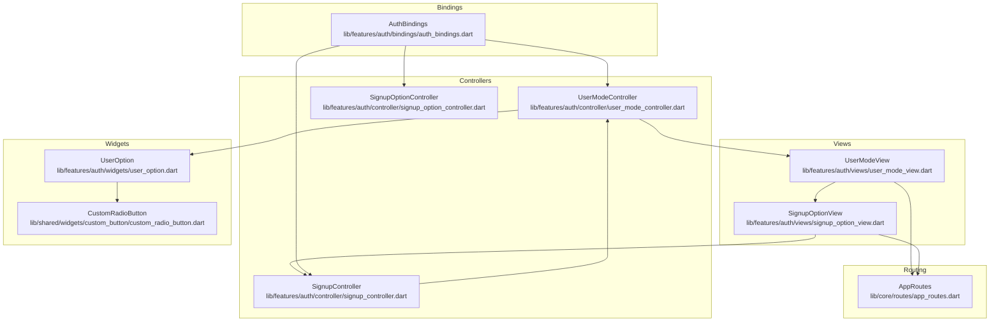
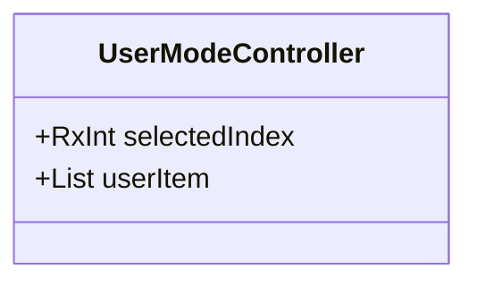
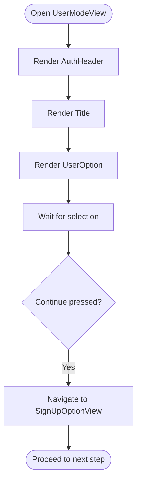
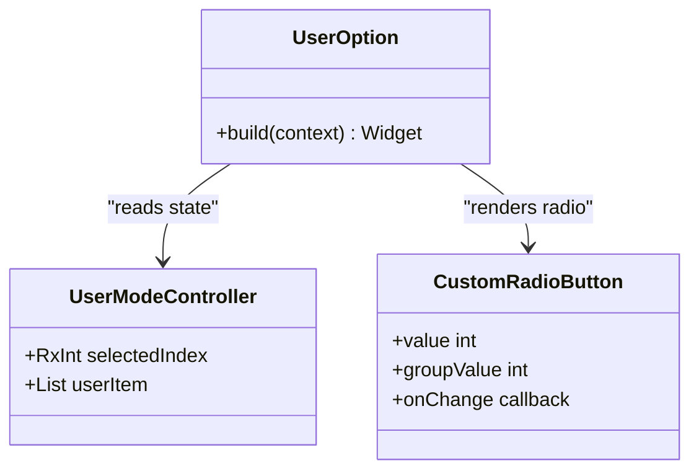
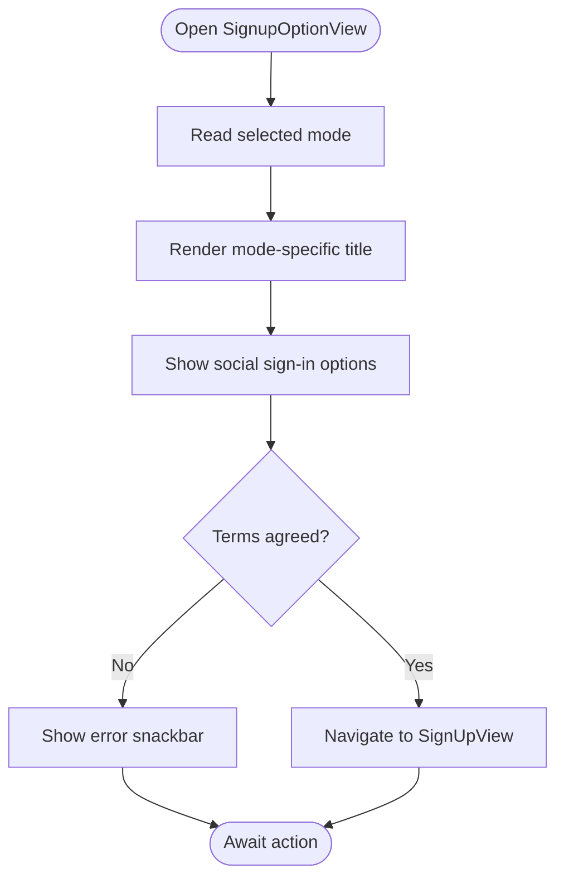
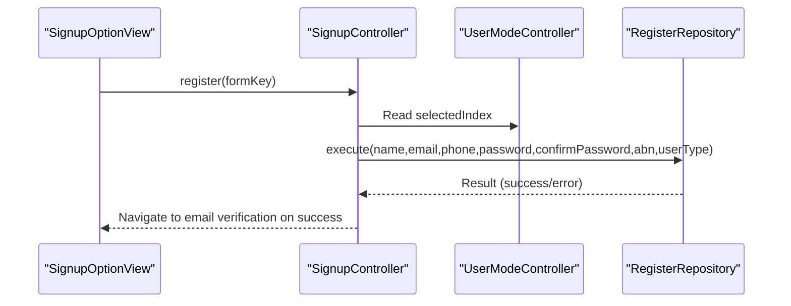
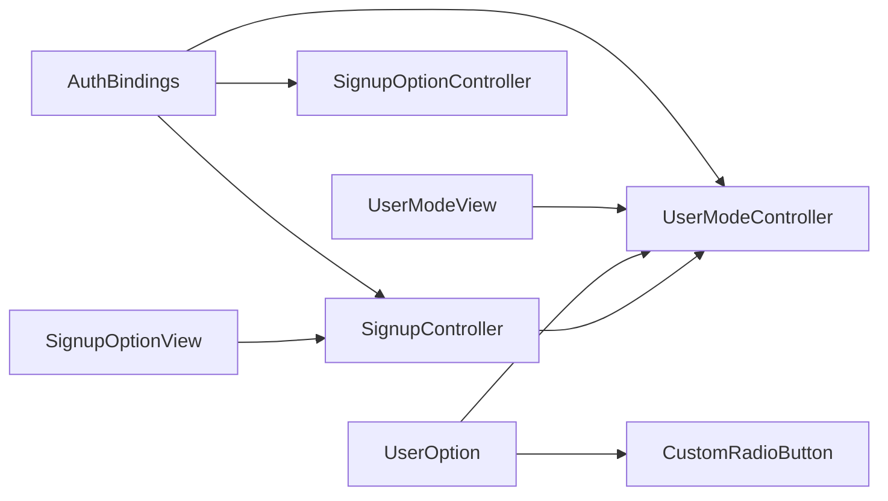

# User Mode Selection

<cite>
**Referenced Files in This Document**
- [user_mode_controller.dart](file://lib/features/auth/controller/user_mode_controller.dart)
- [user_mode_view.dart](file://lib/features/auth/views/user_mode_view.dart)
- [user_option.dart](file://lib/features/auth/widgets/user_option.dart)
- [signup_controller.dart](file://lib/features/auth/controller/signup_controller.dart)
- [signup_option_view.dart](file://lib/features/auth/views/signup_option_view.dart)
- [signup_option_controller.dart](file://lib/features/auth/controller/signup_option_controller.dart)
- [auth_bindings.dart](file://lib/features/auth/bindings/auth_bindings.dart)
- [app_routes.dart](file://lib/core/routes/app_routes.dart)
- [custom_radio_button.dart](file://lib/shared/widgets/custom_button/custom_radio_button.dart)
- [icons_path.dart](file://lib/core/constant/icons_path.dart)
</cite>

## Table of Contents
1. [Introduction](#introduction)
2. [Project Structure](#project-structure)
3. [Core Components](#core-components)
4. [Architecture Overview](#architecture-overview)
5. [Detailed Component Analysis](#detailed-component-analysis)
6. [Dependency Analysis](#dependency-analysis)
7. [Performance Considerations](#performance-considerations)
8. [Troubleshooting Guide](#troubleshooting-guide)
9. [Conclusion](#conclusion)

## Introduction
This document explains the User Mode Selection component that allows new users to choose between "Personal Account" and "Business Account" during the registration flow. It covers the GetX-based state management, the selection UI, the controller responsibilities, and the navigation flow leading to subsequent registration steps. The goal is to provide a clear understanding of how user type selection integrates with the broader authentication workflow and how mode-specific routing is handled.

## Project Structure
The User Mode Selection feature spans controllers, views, widgets, and routes:
- Controllers manage state and coordinate actions.
- Views render the user-facing screens.
- Widgets encapsulate reusable UI elements like radio buttons and option cards.
- Routes define navigation targets for the registration flow.



**Diagram sources**
- [user_mode_controller.dart:1-19](file://lib/features/auth/controller/user_mode_controller.dart#L1-L19)
- [user_mode_view.dart:1-77](file://lib/features/auth/views/user_mode_view.dart#L1-L77)
- [user_option.dart:1-83](file://lib/features/auth/widgets/user_option.dart#L1-L83)
- [custom_radio_button.dart:1-28](file://lib/shared/widgets/custom_button/custom_radio_button.dart#L1-L28)
- [signup_controller.dart:1-67](file://lib/features/auth/controller/signup_controller.dart#L1-L67)
- [signup_option_view.dart:1-124](file://lib/features/auth/views/signup_option_view.dart#L1-L124)
- [signup_option_controller.dart:1-5](file://lib/features/auth/controller/signup_option_controller.dart#L1-L5)
- [auth_bindings.dart:1-29](file://lib/features/auth/bindings/auth_bindings.dart#L1-L29)
- [app_routes.dart:1-34](file://lib/core/routes/app_routes.dart#L1-L34)

**Section sources**
- [user_mode_controller.dart:1-19](file://lib/features/auth/controller/user_mode_controller.dart#L1-L19)
- [user_mode_view.dart:1-77](file://lib/features/auth/views/user_mode_view.dart#L1-L77)
- [user_option.dart:1-83](file://lib/features/auth/widgets/user_option.dart#L1-L83)
- [signup_controller.dart:1-67](file://lib/features/auth/controller/signup_controller.dart#L1-L67)
- [signup_option_view.dart:1-124](file://lib/features/auth/views/signup_option_view.dart#L1-L124)
- [signup_option_controller.dart:1-5](file://lib/features/auth/controller/signup_option_controller.dart#L1-L5)
- [auth_bindings.dart:1-29](file://lib/features/auth/bindings/auth_bindings.dart#L1-L29)
- [app_routes.dart:1-34](file://lib/core/routes/app_routes.dart#L1-L34)

## Core Components
- UserModeController: Holds the selected index and the list of user mode options with associated metadata (icons, titles, subtitles). It exposes reactive state for UI updates.
- UserModeView: Renders the selection screen, displays the two user options, and navigates to the next step upon Continue.
- UserOption: A reusable widget that renders selectable cards for each user mode, wired to UserModeController via GetX.
- CustomRadioButton: A lightweight widget wrapping Flutter's Radio with theme-aware styling.
- SignupController: Uses the selected user mode to set the user type during registration.
- SignupOptionView: Presents sign-up options based on the selected user mode and handles navigation to the email-based registration flow.
- AuthBindings: Registers controllers with the GetX dependency injection container.
- AppRoutes: Centralized constants for navigation targets.

Responsibilities summary:
- UserModeController: Manages selected index and user mode items.
- UserModeView: Orchestrates layout and navigation to the next step.
- UserOption: Handles selection visuals and updates controller state reactively.
- SignupController: Reads the selected mode and passes the appropriate user type to the registration repository.
- AuthBindings: Ensures controllers are available for injection.

**Section sources**
- [user_mode_controller.dart:1-19](file://lib/features/auth/controller/user_mode_controller.dart#L1-L19)
- [user_mode_view.dart:1-77](file://lib/features/auth/views/user_mode_view.dart#L1-L77)
- [user_option.dart:1-83](file://lib/features/auth/widgets/user_option.dart#L1-L83)
- [custom_radio_button.dart:1-28](file://lib/shared/widgets/custom_button/custom_radio_button.dart#L1-L28)
- [signup_controller.dart:1-67](file://lib/features/auth/controller/signup_controller.dart#L1-L67)
- [signup_option_view.dart:1-124](file://lib/features/auth/views/signup_option_view.dart#L1-L124)
- [auth_bindings.dart:1-29](file://lib/features/auth/bindings/auth_bindings.dart#L1-L29)
- [app_routes.dart:1-34](file://lib/core/routes/app_routes.dart#L1-L34)

## Architecture Overview
The User Mode Selection feature follows a unidirectional data flow:
- UI triggers selection via UserOption.
- UserModeController updates reactive state.
- UserModeView reads the selected index and navigates to the next step.
- SignupOptionView conditionally renders content based on the selected mode.
- SignupController reads the selected mode to determine user type during registration.

```mermaid
sequenceDiagram
participant User as "User"
participant View as "UserModeView"
participant Option as "UserOption"
participant Controller as "UserModeController"
participant NextView as "SignupOptionView"
participant RegController as "SignupController"
User->>Option : Tap a user mode card
Option->>Controller : Update selectedIndex
Controller-->>Option : Reactive update
Controller-->>View : Reactive update
View->>NextView : Navigate to sign-up options
User->>NextView : Tap Continue
NextView->>RegController : Initiate registration
RegController->>Controller : Read selectedIndex
RegController-->>RegController : Map to user type
RegController-->>NextView : Registration flow continues
```

**Diagram sources**
- [user_mode_view.dart:1-77](file://lib/features/auth/views/user_mode_view.dart#L1-L77)
- [user_option.dart:1-83](file://lib/features/auth/widgets/user_option.dart#L1-L83)
- [user_mode_controller.dart:1-19](file://lib/features/auth/controller/user_mode_controller.dart#L1-L19)
- [signup_option_view.dart:1-124](file://lib/features/auth/views/signup_option_view.dart#L1-L124)
- [signup_controller.dart:1-67](file://lib/features/auth/controller/signup_controller.dart#L1-L67)

## Detailed Component Analysis

### UserModeController
- Purpose: Central state holder for user mode selection.
- State:
  - selectedIndex: RxInt indicating the currently selected option.
  - userItem: List containing icon, title, and subtitle for each mode.
- Behavior:
  - Provides reactive updates to bound widgets.
  - Supplies data for rendering the selection options.



**Diagram sources**
- [user_mode_controller.dart:1-19](file://lib/features/auth/controller/user_mode_controller.dart#L1-L19)

**Section sources**
- [user_mode_controller.dart:1-19](file://lib/features/auth/controller/user_mode_controller.dart#L1-L19)

### UserModeView
- Purpose: Renders the user mode selection screen.
- UI elements:
  - Header with branding and back affordance.
  - Title text describing the selection.
  - UserOption widget for mode selection.
  - Continue button that navigates to the next step.
  - Informational banner indicating future profile switching capability.
- Navigation:
  - Navigates to the sign-up options route regardless of selection (personal or business).



**Diagram sources**
- [user_mode_view.dart:1-77](file://lib/features/auth/views/user_mode_view.dart#L1-L77)

**Section sources**
- [user_mode_view.dart:1-77](file://lib/features/auth/views/user_mode_view.dart#L1-L77)

### UserOption
- Purpose: Renders selectable cards for each user mode.
- Interaction:
  - Tapping a card updates the selected index in UserModeController.
  - Uses Obx to reactively reflect the current selection.
- Visuals:
  - Displays icon, title, and subtitle for each mode.
  - Integrates CustomRadioButton to show selection state.



**Diagram sources**
- [user_option.dart:1-83](file://lib/features/auth/widgets/user_option.dart#L1-L83)
- [user_mode_controller.dart:1-19](file://lib/features/auth/controller/user_mode_controller.dart#L1-L19)
- [custom_radio_button.dart:1-28](file://lib/shared/widgets/custom_button/custom_radio_button.dart#L1-L28)

**Section sources**
- [user_option.dart:1-83](file://lib/features/auth/widgets/user_option.dart#L1-L83)
- [custom_radio_button.dart:1-28](file://lib/shared/widgets/custom_button/custom_radio_button.dart#L1-L28)

### SignupOptionView
- Purpose: Presents sign-up options after mode selection.
- Behavior:
  - Conditionally renders personalized titles based on the selected mode.
  - Provides social sign-in options and an email-based registration path.
  - Enforces terms agreement before proceeding to email registration.
- Navigation:
  - Routes to email registration when terms are accepted.



**Diagram sources**
- [signup_option_view.dart:1-124](file://lib/features/auth/views/signup_option_view.dart#L1-L124)
- [signup_option_controller.dart:1-5](file://lib/features/auth/controller/signup_option_controller.dart#L1-L5)

**Section sources**
- [signup_option_view.dart:1-124](file://lib/features/auth/views/signup_option_view.dart#L1-L124)
- [signup_option_controller.dart:1-5](file://lib/features/auth/controller/signup_option_controller.dart#L1-L5)

### SignupController Integration
- Purpose: Coordinates registration submission and determines user type based on selection.
- Logic:
  - Reads the selected index from UserModeController.
  - Maps selection to user type values for the registration request.
  - Handles success and error outcomes, including navigation to verification flow.



**Diagram sources**
- [signup_controller.dart:1-67](file://lib/features/auth/controller/signup_controller.dart#L1-L67)
- [user_mode_controller.dart:1-19](file://lib/features/auth/controller/user_mode_controller.dart#L1-L19)

**Section sources**
- [signup_controller.dart:1-67](file://lib/features/auth/controller/signup_controller.dart#L1-L67)

### Routing and Navigation
- AppRoutes centralizes route names used across the feature.
- UserModeView navigates to the sign-up options route.
- SignupOptionView navigates to the email registration route upon acceptance of terms.

**Section sources**
- [app_routes.dart:1-34](file://lib/core/routes/app_routes.dart#L1-L34)
- [user_mode_view.dart:1-77](file://lib/features/auth/views/user_mode_view.dart#L1-L77)
- [signup_option_view.dart:1-124](file://lib/features/auth/views/signup_option_view.dart#L1-L124)

## Dependency Analysis
- UserModeController is injected via AuthBindings and consumed by UserModeView and UserOption.
- UserModeView depends on AppRoutes for navigation.
- UserOption depends on UserModeController and CustomRadioButton.
- SignupController depends on UserModeController to determine user type.
- AuthBindings registers all required controllers for the authentication feature.



**Diagram sources**
- [auth_bindings.dart:1-29](file://lib/features/auth/bindings/auth_bindings.dart#L1-L29)
- [user_mode_view.dart:1-77](file://lib/features/auth/views/user_mode_view.dart#L1-L77)
- [user_option.dart:1-83](file://lib/features/auth/widgets/user_option.dart#L1-L83)
- [custom_radio_button.dart:1-28](file://lib/shared/widgets/custom_button/custom_radio_button.dart#L1-L28)
- [signup_option_view.dart:1-124](file://lib/features/auth/views/signup_option_view.dart#L1-L124)
- [signup_controller.dart:1-67](file://lib/features/auth/controller/signup_controller.dart#L1-L67)

**Section sources**
- [auth_bindings.dart:1-29](file://lib/features/auth/bindings/auth_bindings.dart#L1-L29)

## Performance Considerations
- Reactive Updates: Using GetX reactive state minimizes rebuild scope and improves responsiveness for selection changes.
- Minimal Work in Build: Rendering lists and selection logic are delegated to dedicated widgets and controllers to keep build methods lean.
- Navigation Efficiency: Direct route navigation avoids unnecessary widget tree traversals.

## Troubleshooting Guide
- Selection Not Updating:
  - Verify UserOption updates the controller's selected index on tap.
  - Confirm Obx wrappers are present around the radio button to trigger rebuilds.
- Incorrect User Type Passed:
  - Ensure the registration call reads the selected index and maps it to the expected user type values.
- Navigation Issues:
  - Confirm route names match AppRoutes constants.
  - Ensure AuthBindings registers controllers before navigation attempts.

**Section sources**
- [user_option.dart:1-83](file://lib/features/auth/widgets/user_option.dart#L1-L83)
- [signup_controller.dart:1-67](file://lib/features/auth/controller/signup_controller.dart#L1-L67)
- [app_routes.dart:1-34](file://lib/core/routes/app_routes.dart#L1-L34)
- [auth_bindings.dart:1-29](file://lib/features/auth/bindings/auth_bindings.dart#L1-L29)

## Conclusion
The User Mode Selection component provides a clean, reactive foundation for guiding users into either personal or business registration flows. Through GetX state management, modular widgets, and centralized routing, the feature ensures a smooth user experience while maintaining clear separation of concerns. The selection logic is straightforward, the UI is intuitive, and the integration with registration workflows is seamless.