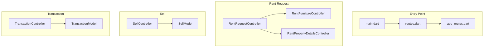
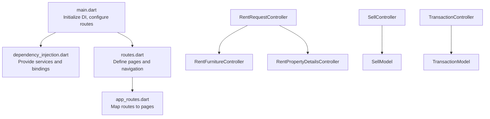
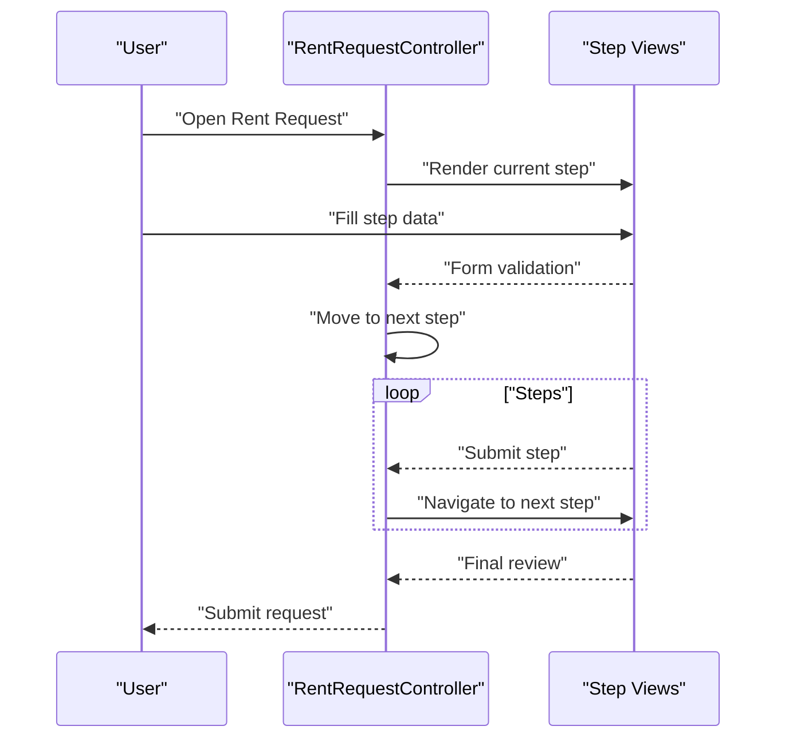
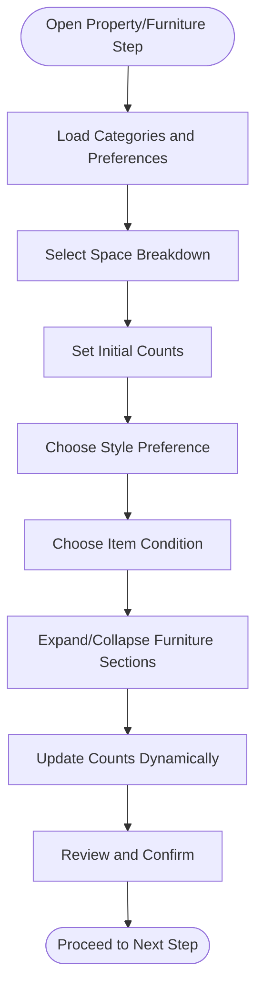
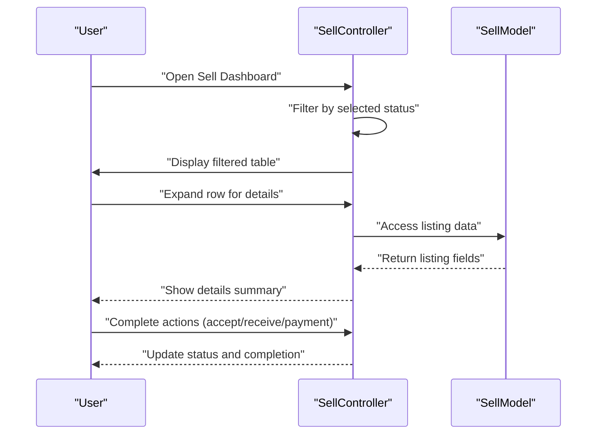
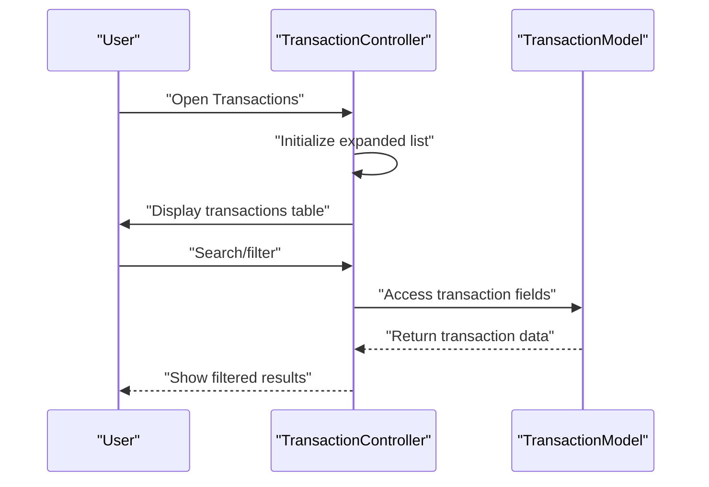
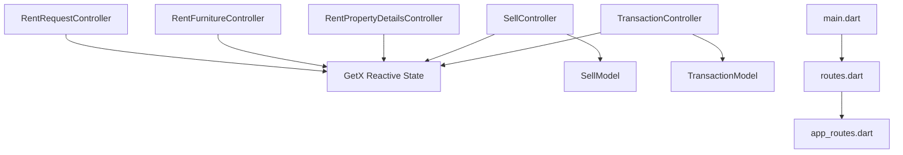

# Business Services

<cite>
**Referenced Files in This Document**
- [main.dart](file://lib/main.dart)
- [app_routes.dart](file://lib/core/routes/app_routes.dart)
- [routes.dart](file://lib/core/routes/routes.dart)
- [dependency_injection.dart](file://lib/core/di/dependency_injection.dart)
- [rent_request_controller.dart](file://lib/features/rent_request/controller/rent_request_controller.dart)
- [rent_furniture_controller.dart](file://lib/features/rent_request/controller/rent_furniture_controller.dart)
- [rent_property_details_controller.dart](file://lib/features/rent_request/controller/rent_property_details_controller.dart)
- [sell_controller.dart](file://lib/features/sell/controller/sell_controller.dart)
- [sell_model.dart](file://lib/features/sell/models/sell_model.dart)
- [transaction_controller.dart](file://lib/features/transaction/controller/transaction_controller.dart)
- [transaction_model.dart](file://lib/features/transaction/models/transaction_model.dart)
</cite>

## Table of Contents
1. [Introduction](#introduction)
2. [Project Structure](#project-structure)
3. [Core Components](#core-components)
4. [Architecture Overview](#architecture-overview)
5. [Detailed Component Analysis](#detailed-component-analysis)
6. [Dependency Analysis](#dependency-analysis)
7. [Performance Considerations](#performance-considerations)
8. [Troubleshooting Guide](#troubleshooting-guide)
9. [Conclusion](#conclusion)
10. [Appendices](#appendices)

## Introduction
This document describes the Business Services feature set focused on two primary business workflows: renting and selling furniture, and a unified transaction management system for tracking business activities and financial records. It explains how rent request management, approval workflows, and rental agreements are modeled; how the sell furniture workflow progresses from listing creation to sale completion; and how transactions are tracked. It also documents the controllers responsible for managing rental periods, payments, and property handover, as well as the sell flow controllers for product listing, buyer-seller interactions, and transaction completion. Finally, it outlines the business logic for rent requests, property management, and revenue tracking, and details the integration between rent, sell, and transaction systems for comprehensive business management, including user workflows for both clients and providers.

## Project Structure
The Business Services feature is organized around three main areas:
- Rent Request Management: Multi-step form flow with property, furniture, appliances, brand, period, delivery, and review steps.
- Sell Furniture Workflow: Listing management with filtering, status tracking, and completion stages.
- Transaction Management: Financial record tracking with search, pagination, and status reporting.

**Diagram sources**
- [main.dart:12-47](file://lib/main.dart#L12-L47)
- [routes.dart:1-200](file://lib/core/routes/routes.dart)
- [app_routes.dart:1-200](file://lib/core/routes/app_routes.dart)
- [rent_request_controller.dart:14-47](file://lib/features/rent_request/controller/rent_request_controller.dart#L14-L47)
- [rent_furniture_controller.dart:5-44](file://lib/features/rent_request/controller/rent_furniture_controller.dart#L5-L44)
- [rent_property_details_controller.dart:4-32](file://lib/features/rent_request/controller/rent_property_details_controller.dart#L4-L32)
- [sell_controller.dart:5-167](file://lib/features/sell/controller/sell_controller.dart#L5-L167)
- [sell_model.dart:1-19](file://lib/features/sell/models/sell_model.dart#L1-L19)
- [transaction_controller.dart:5-66](file://lib/features/transaction/controller/transaction_controller.dart#L5-L66)
- [transaction_model.dart:1-18](file://lib/features/transaction/models/transaction_model.dart#L1-L18)

**Section sources**
- [main.dart:12-47](file://lib/main.dart#L12-L47)
- [routes.dart:1-200](file://lib/core/routes/routes.dart)
- [app_routes.dart:1-200](file://lib/core/routes/app_routes.dart)

## Core Components
- RentRequestController orchestrates the multi-step rent request form flow, maintaining form keys, page navigation, and widget stack for property type, property details, floor plan, furniture selection, appliances, brand preferences, rental period, delivery, and review.
- RentFurnitureController manages furniture categories, counts, preferences, and expandable sections for detailed furniture entries.
- RentPropertyDetailsController handles property address, size, breakdown selections, and associated counts.
- SellController manages sell listings with filtering by status, pagination, expansion state, and a predefined dataset of sample items.
- TransactionController tracks financial transactions with search, pagination, and a predefined dataset of sample transactions.
- Data models (SellModel, TransactionModel) define immutable structures for listing and transaction records.

**Section sources**
- [rent_request_controller.dart:14-47](file://lib/features/rent_request/controller/rent_request_controller.dart#L14-L47)
- [rent_furniture_controller.dart:5-44](file://lib/features/rent_request/controller/rent_furniture_controller.dart#L5-L44)
- [rent_property_details_controller.dart:4-32](file://lib/features/rent_request/controller/rent_property_details_controller.dart#L4-L32)
- [sell_controller.dart:5-167](file://lib/features/sell/controller/sell_controller.dart#L5-L167)
- [sell_model.dart:1-19](file://lib/features/sell/models/sell_model.dart#L1-L19)
- [transaction_controller.dart:5-66](file://lib/features/transaction/controller/transaction_controller.dart#L5-L66)
- [transaction_model.dart:1-18](file://lib/features/transaction/models/transaction_model.dart#L1-L18)

## Architecture Overview
The Business Services feature follows a layered architecture:
- Presentation Layer: Controllers manage UI state and navigation for rent, sell, and transaction views.
- Data Layer: Models encapsulate immutable business data for listings and transactions.
- Routing and DI: Application initialization configures routing and dependency injection, enabling feature bindings and navigation.

**Diagram sources**
- [main.dart:12-47](file://lib/main.dart#L12-L47)
- [dependency_injection.dart:1-200](file://lib/core/di/dependency_injection.dart)
- [routes.dart:1-200](file://lib/core/routes/routes.dart)
- [app_routes.dart:1-200](file://lib/core/routes/app_routes.dart)
- [rent_request_controller.dart:14-47](file://lib/features/rent_request/controller/rent_request_controller.dart#L14-L47)
- [rent_furniture_controller.dart:5-44](file://lib/features/rent_request/controller/rent_furniture_controller.dart#L5-L44)
- [rent_property_details_controller.dart:4-32](file://lib/features/rent_request/controller/rent_property_details_controller.dart#L4-L32)
- [sell_controller.dart:5-167](file://lib/features/sell/controller/sell_controller.dart#L5-L167)
- [sell_model.dart:1-19](file://lib/features/sell/models/sell_model.dart#L1-L19)
- [transaction_controller.dart:5-66](file://lib/features/transaction/controller/transaction_controller.dart#L5-L66)
- [transaction_model.dart:1-18](file://lib/features/transaction/models/transaction_model.dart#L1-L18)

## Detailed Component Analysis

### Rent Request Management
RentRequestController coordinates a multi-step form flow:
- Form state management via a form key.
- Page navigation through a list of widgets representing steps: contact/business info, property type, property details, floor plan, furniture, appliances, brand, rental period, delivery, and review.
- Lifecycle management for controllers and scroll handling.

**Diagram sources**
- [rent_request_controller.dart:14-47](file://lib/features/rent_request/controller/rent_request_controller.dart#L14-L47)

**Section sources**
- [rent_request_controller.dart:14-47](file://lib/features/rent_request/controller/rent_request_controller.dart#L14-L47)

### Property Management and Furniture Selection
RentFurnitureController and RentPropertyDetailsController handle property and furniture aspects:
- Expandable sections for furniture categories (office, kitchen, showroom).
- Counts and selections for spaces (bedrooms, bathrooms, car spaces, living rooms, kitchens) and preferences (style, condition).
- Property details include address, size, and breakdown selections.

**Diagram sources**
- [rent_furniture_controller.dart:5-44](file://lib/features/rent_request/controller/rent_furniture_controller.dart#L5-L44)
- [rent_property_details_controller.dart:4-32](file://lib/features/rent_request/controller/rent_property_details_controller.dart#L4-L32)

**Section sources**
- [rent_furniture_controller.dart:5-44](file://lib/features/rent_request/controller/rent_furniture_controller.dart#L5-L44)
- [rent_property_details_controller.dart:4-32](file://lib/features/rent_request/controller/rent_property_details_controller.dart#L4-L32)

### Sell Furniture Workflow
SellController manages the listing lifecycle:
- Filtering by status (All, Offer Ready, In Review, Accepted, Received).
- Pagination and expansion state for detailed rows.
- Immutable data model (SellModel) defines listing attributes.

**Diagram sources**
- [sell_controller.dart:5-167](file://lib/features/sell/controller/sell_controller.dart#L5-L167)
- [sell_model.dart:1-19](file://lib/features/sell/models/sell_model.dart#L1-L19)

**Section sources**
- [sell_controller.dart:5-167](file://lib/features/sell/controller/sell_controller.dart#L5-L167)
- [sell_model.dart:1-19](file://lib/features/sell/models/sell_model.dart#L1-L19)

### Transaction Management
TransactionController provides financial activity tracking:
- Search and pagination controls.
- Immutable data model (TransactionModel) defines transaction attributes.

**Diagram sources**
- [transaction_controller.dart:5-66](file://lib/features/transaction/controller/transaction_controller.dart#L5-L66)
- [transaction_model.dart:1-18](file://lib/features/transaction/models/transaction_model.dart#L1-L18)

**Section sources**
- [transaction_controller.dart:5-66](file://lib/features/transaction/controller/transaction_controller.dart#L5-L66)
- [transaction_model.dart:1-18](file://lib/features/transaction/models/transaction_model.dart#L1-L18)

### Business Logic and Revenue Tracking
- Rent Requests: Multi-step form captures business and property details, furniture preferences, and rental period. The flow supports review and submission.
- Property Management: Controllers maintain counts and selections for spaces and furniture categories, enabling accurate property assessments.
- Sell Workflow: Status-driven progression (Offer Ready, In Review, Accepted, Received) with shipment and payment indicators.
- Transaction Tracking: Centralized financial records with type, date, status, amount, and method for auditability and revenue reconciliation.

**Section sources**
- [rent_request_controller.dart:14-47](file://lib/features/rent_request/controller/rent_request_controller.dart#L14-L47)
- [rent_furniture_controller.dart:5-44](file://lib/features/rent_request/controller/rent_furniture_controller.dart#L5-L44)
- [rent_property_details_controller.dart:4-32](file://lib/features/rent_request/controller/rent_property_details_controller.dart#L4-L32)
- [sell_controller.dart:5-167](file://lib/features/sell/controller/sell_controller.dart#L5-L167)
- [transaction_controller.dart:5-66](file://lib/features/transaction/controller/transaction_controller.dart#L5-L66)

## Dependency Analysis
Controllers depend on:
- GetX reactive state management for observables and lifecycle hooks.
- Immutable models for data integrity.
- Navigation and routing configuration for feature pages.

**Diagram sources**
- [rent_request_controller.dart:14-47](file://lib/features/rent_request/controller/rent_request_controller.dart#L14-L47)
- [rent_furniture_controller.dart:5-44](file://lib/features/rent_request/controller/rent_furniture_controller.dart#L5-L44)
- [rent_property_details_controller.dart:4-32](file://lib/features/rent_request/controller/rent_property_details_controller.dart#L4-L32)
- [sell_controller.dart:5-167](file://lib/features/sell/controller/sell_controller.dart#L5-L167)
- [sell_model.dart:1-19](file://lib/features/sell/models/sell_model.dart#L1-L19)
- [transaction_controller.dart:5-66](file://lib/features/transaction/controller/transaction_controller.dart#L5-L66)
- [transaction_model.dart:1-18](file://lib/features/transaction/models/transaction_model.dart#L1-L18)
- [main.dart:12-47](file://lib/main.dart#L12-L47)
- [routes.dart:1-200](file://lib/core/routes/routes.dart)
- [app_routes.dart:1-200](file://lib/core/routes/app_routes.dart)

**Section sources**
- [main.dart:12-47](file://lib/main.dart#L12-L47)
- [routes.dart:1-200](file://lib/core/routes/routes.dart)
- [app_routes.dart:1-200](file://lib/core/routes/app_routes.dart)

## Performance Considerations
- Reactive state updates: Use minimal reactive updates and avoid unnecessary rebuilds by scoping observables to specific UI regions.
- Pagination: Keep page sizes reasonable and lazy-load data where applicable.
- Lists: Initialize expansion arrays once during controller initialization to prevent repeated allocations.
- Models: Prefer immutable models to simplify state management and reduce accidental mutations.

## Troubleshooting Guide
- Form validation failures: Ensure form keys are properly passed to each step and validated before advancing.
- Navigation issues: Verify route registration and bindings are configured in the routing layer.
- State resets: Confirm controllers are disposed correctly and observables are cleared when views are closed.
- Data inconsistencies: Validate that models remain immutable and updates occur through controller methods.

**Section sources**
- [rent_request_controller.dart:14-47](file://lib/features/rent_request/controller/rent_request_controller.dart#L14-L47)
- [sell_controller.dart:5-167](file://lib/features/sell/controller/sell_controller.dart#L5-L167)
- [transaction_controller.dart:5-66](file://lib/features/transaction/controller/transaction_controller.dart#L5-L66)

## Conclusion
The Business Services feature integrates rent request management, sell workflow tracking, and transaction monitoring into a cohesive system. RentRequestController, RentFurnitureController, and RentPropertyDetailsController coordinate multi-step forms and property data. SellController and TransactionController provide robust listing and financial tracking capabilities with filtering, pagination, and status management. Together, these components support comprehensive business management for both clients and providers, enabling efficient workflows and reliable revenue tracking.

## Appendices
- User Workflows:
  - Clients: Submit rent requests, track sell offers, and monitor transactions.
  - Providers: Manage sell listings, update statuses, and reconcile transactions.
- Integration Notes:
  - Controllers rely on GetX for reactive state and immutable models for data integrity.
  - Routing and DI enable modular feature bindings and scalable navigation.