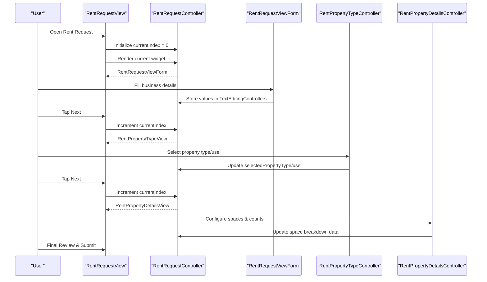
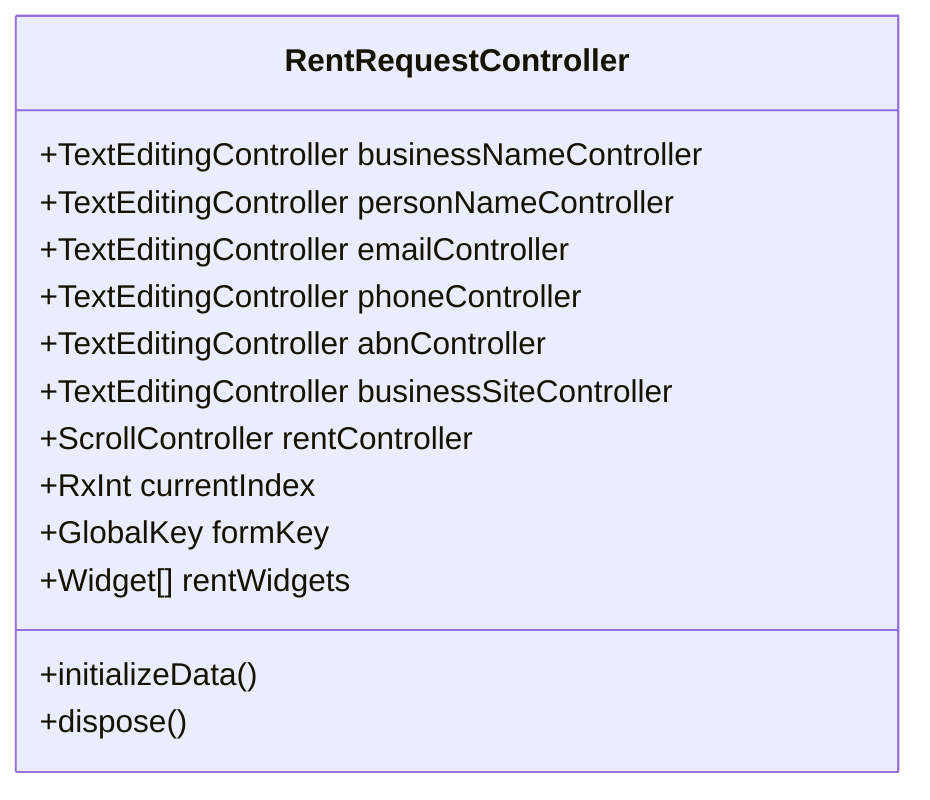
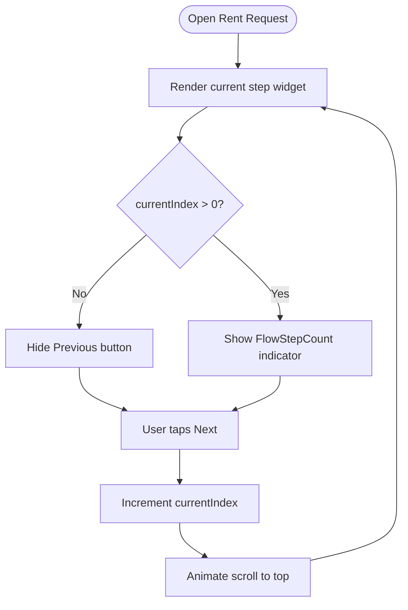
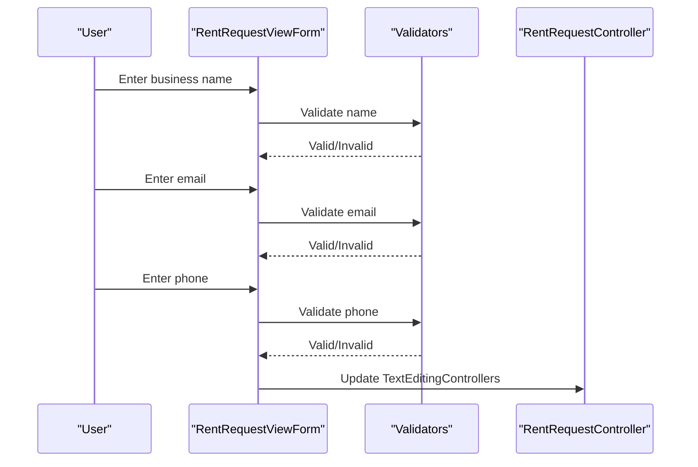
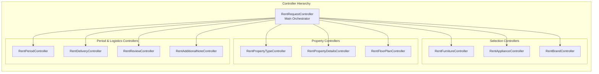
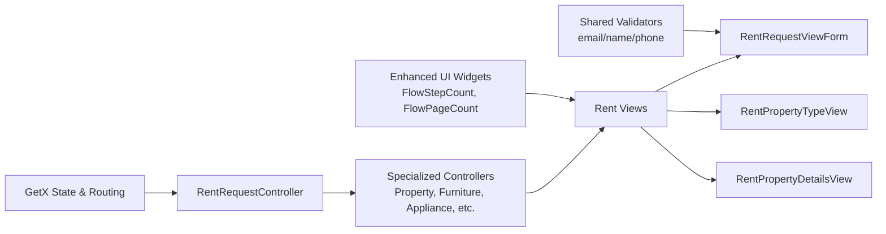

# Rent Furniture System

<cite>
**Referenced Files in This Document**
- [main.dart](file://lib/main.dart)
- [app_routes.dart](file://lib/core/routes/app_routes.dart)
- [rent_bindings.dart](file://lib/features/rent_request/bindings/rent_bindings.dart)
- [rent_request_controller.dart](file://lib/features/rent_request/controllers/rent_request_controller.dart)
- [rent_request_view.dart](file://lib/features/rent_request/views/rent_request_view.dart)
- [rent_request_view_form.dart](file://lib/features/rent_request/widgets/rent_request_view_widgets/rent_request_view_form.dart)
- [rent_property_type_view.dart](file://lib/features/rent_request/views/rent_property_type_view.dart)
- [rent_property_details_view.dart](file://lib/features/rent_request/views/rent_property_details_view.dart)
- [email_validator.dart](file://lib/shared/extensions/validators/email_validator.dart)
- [name_validator.dart](file://lib/shared/extensions/validators/name_validator.dart)
- [phone_validator.dart](file://lib/shared/extensions/validators/phone_validator.dart)
- [rent_property_type_controller.dart](file://lib/features/rent_request/controllers/rent_property_type_controller.dart)
- [rent_property_details_controller.dart](file://lib/features/rent_request/controllers/rent_property_details_controller.dart)
</cite>

## Update Summary
**Changes Made**
- Updated controller directory structure reference from 'controller/' to 'controllers/' to reflect the reorganized plural form
- Updated all import paths throughout Rent Request feature components to reflect new lib/features/rent_request/controllers/ directory
- Enhanced view components with improved visual feedback and step navigation indicators
- Added comprehensive coverage of the expanded controller architecture with specialized controllers for each form step

## Table of Contents
1. [Introduction](#introduction)
2. [Project Structure](#project-structure)
3. [Core Components](#core-components)
4. [Architecture Overview](#architecture-overview)
5. [Detailed Component Analysis](#detailed-component-analysis)
6. [Enhanced Navigation and Visual Feedback](#enhanced-navigation-and-visual-feedback)
7. [Controller Architecture](#controller-architecture)
8. [Dependency Analysis](#dependency-analysis)
9. [Performance Considerations](#performance-considerations)
10. [Troubleshooting Guide](#troubleshooting-guide)
11. [Conclusion](#conclusion)

## Introduction
This document describes the Rent Furniture System, focusing on the end-to-end rent request workflow from property listing creation to tenant approval. It explains the multi-step form process, controller architecture, view components, navigation flow, widget libraries, and business logic for pricing and agreements. The system is built with Flutter and uses GetX for state management and routing. The architecture now features a comprehensive controller system with specialized controllers for each form step, providing enhanced modularity and maintainability.

## Project Structure
The Rent Furniture System resides under the features/rent_request module with a reorganized controller structure under the controllers/ directory. The system now includes specialized controllers for each form step, providing better separation of concerns and improved maintainability. The main application initializes theme, routing, and bindings, and delegates to feature-specific bindings for lazy loading controllers.

```mermaid
graph TB
subgraph "App Initialization"
MAIN["main.dart<br/>Initialize DI, theme, routes"]
ROUTES["app_routes.dart<br/>Define named routes"]
END
subgraph "Rent Request Feature Controllers"
REQUEST_CONTROLLER["RentRequestController<br/>Main orchestrator & navigation"]
PROPERTY_TYPE_CONTROLLER["RentPropertyTypeController<br/>Property type & use selection"]
PROPERTY_DETAILS_CONTROLLER["RentPropertyDetailsController<br/>Space breakdown & counts"]
FLOOR_PLAN_CONTROLLER["RentFloorPlanController<br/>Layout configuration"]
FURNITURE_CONTROLLER["RentFurnitureController<br/>Furniture preferences"]
APPLIANCE_CONTROLLER["RentApplianceController<br/>Appliance requirements"]
BRAND_CONTROLLER["RentBrandController<br/>Brand specifications"]
PERIOD_CONTROLLER["RentPeriodController<br/>Rental period selection"]
DELIVERY_CONTROLLER["RentDeliveryController<br/>Delivery arrangements"]
REVIEW_CONTROLLER["RentReviewController<br/>Final review & submission"]
ADDITIONAL_NOTE_CONTROLLER["RentAdditionalNoteController<br/>Additional notes"]
END
subgraph "Rent Request Feature Views"
BINDINGS["rent_bindings.dart<br/>Lazy-load all controllers"]
VIEW["RentRequestView<br/>UI container & navigation"]
FORM["RentRequestViewForm<br/>Business info form"]
PROPERTY_TYPE["RentPropertyTypeView<br/>Property type & use"]
PROPERTY_DETAILS["RentPropertyDetailsView<br/>Space breakdown & fields"]
END
MAIN --> ROUTES
ROUTER --> BINDINGS
BINDINGS --> REQUEST_CONTROLLER
REQUEST_CONTROLLER --> VIEW
VIEW --> FORM
VIEW --> PROPERTY_TYPE
VIEW --> PROPERTY_DETAILS
REQUEST_CONTROLLER --> PROPERTY_TYPE_CONTROLLER
REQUEST_CONTROLLER --> PROPERTY_DETAILS_CONTROLLER
```

**Diagram sources**
- [main.dart:12-46](file://lib/main.dart#L12-L46)
- [app_routes.dart:1-34](file://lib/core/routes/app_routes.dart#L1-L34)
- [rent_bindings.dart:14-29](file://lib/features/rent_request/bindings/rent_bindings.dart#L14-L29)
- [rent_request_controller.dart:14-46](file://lib/features/rent_request/controllers/rent_request_controller.dart#L14-L46)
- [rent_property_type_controller.dart:1-16](file://lib/features/rent_request/controllers/rent_property_type_controller.dart#L1-L16)
- [rent_property_details_controller.dart:1-32](file://lib/features/rent_request/controllers/rent_property_details_controller.dart#L1-L32)

**Section sources**
- [main.dart:12-46](file://lib/main.dart#L12-L46)
- [app_routes.dart:1-34](file://lib/core/routes/app_routes.dart#L1-L34)
- [rent_bindings.dart:14-29](file://lib/features/rent_request/bindings/rent_bindings.dart#L14-L29)

## Core Components
- **RentRequestController**: Main orchestrator that manages current step index, form keys, and the ordered list of form widgets. Coordinates navigation between specialized controllers and holds text editing controllers for business and contact details.
- **RentRequestView**: Enhanced UI container that renders the current step widget, handles previous/next navigation, displays step counters, and provides visual feedback through improved navigation indicators.
- **RentRequestViewForm**: Collects business identification details with validation using shared validators for name, email, and phone fields.
- **RentPropertyTypeController**: Specialized controller managing property type and use selections with dropdown options.
- **RentPropertyDetailsController**: Manages property address fields, space breakdown configuration, and dynamic container counts.
- **Enhanced Navigation Components**: Improved step navigation indicators and visual feedback systems.

**Section sources**
- [rent_request_controller.dart:14-46](file://lib/features/rent_request/controllers/rent_request_controller.dart#L14-L46)
- [rent_request_view.dart:15-78](file://lib/features/rent_request/views/rent_request_view.dart#L15-L78)
- [rent_request_view_form.dart:13-112](file://lib/features/rent_request/widgets/rent_request_view_widgets/rent_request_view_form.dart#L13-L112)
- [rent_property_type_controller.dart:1-16](file://lib/features/rent_request/controllers/rent_property_type_controller.dart#L1-L16)
- [rent_property_details_controller.dart:1-32](file://lib/features/rent_request/controllers/rent_property_details_controller.dart#L1-L32)

## Architecture Overview
The system follows a layered architecture with enhanced controller specialization:
- **Presentation Layer**: Views render UI and delegate navigation to the main controller, with specialized controllers handling domain-specific logic.
- **State Management**: GetX controllers manage reactive state and navigation indices, with the main controller coordinating between specialized controllers.
- **Validation Layer**: Shared validators enforce field rules for business details.
- **Routing**: Named routes define navigation targets; bindings lazy-inject all specialized controllers.



**Diagram sources**
- [rent_request_view.dart:19-78](file://lib/features/rent_request/views/rent_request_view.dart#L19-L78)
- [rent_request_controller.dart:24-35](file://lib/features/rent_request/controllers/rent_request_controller.dart#L24-L35)
- [rent_property_type_controller.dart:3-16](file://lib/features/rent_request/controllers/rent_property_type_controller.dart#L3-L16)
- [rent_property_details_controller.dart:4-32](file://lib/features/rent_request/controllers/rent_property_details_controller.dart#L4-L32)

## Detailed Component Analysis

### RentRequestController
**Updated** Enhanced with improved import paths reflecting the new controllers/ directory structure and expanded role as the main orchestrator.

Responsibilities:
- Manages current step index, form keys, and the ordered list of form widgets.
- Holds text editing controllers for business and contact details.
- Coordinates navigation between specialized controllers.
- Initializes user profile data from ProfileController.

Navigation and state:
- currentIndex drives which step is rendered from the comprehensive rentWidgets list.
- Disposes all text editing controllers on teardown.



**Diagram sources**
- [rent_request_controller.dart:14-46](file://lib/features/rent_request/controllers/rent_request_controller.dart#L14-L46)

**Section sources**
- [rent_request_controller.dart:14-46](file://lib/features/rent_request/controllers/rent_request_controller.dart#L14-L46)

### RentRequestView
**Updated** Enhanced with improved visual feedback and step navigation indicators.

Responsibilities:
- Provides a scrollable container for the form steps with enhanced visual design.
- Displays the current step via Obx reactivity with improved styling.
- Implements Previous/Next controls with step counter and visual indicators.
- Integrates with FlowStepCount widget for better user experience.

Navigation logic:
- Previous button decrements index and scrolls to top with animation.
- Next button advances to the next step with visual feedback.
- Step counter shows current and total pages using FlowStepCount widget.



**Diagram sources**
- [rent_request_view.dart:38-72](file://lib/features/rent_request/views/rent_request_view.dart#L38-L72)

**Section sources**
- [rent_request_view.dart:15-78](file://lib/features/rent_request/views/rent_request_view.dart#L15-L78)

### RentRequestViewForm
Responsibilities:
- Collects business identification details: business name, contact person, email, phone, ABN, and website/profile link.
- Applies validators for name, email, and phone fields using shared validator extensions.
- Uses a shared text form field widget with consistent styling and responsive design.

Validation:
- Uses shared validators for name, email, and phone fields.
- Auto-validation on user interaction with proper error handling.
- Responsive design using Flutter_ScreenUtil for consistent sizing across devices.



**Diagram sources**
- [rent_request_view_form.dart:31-61](file://lib/features/rent_request/widgets/rent_request_view_widgets/rent_request_view_form.dart#L31-L61)
- [email_validator.dart](file://lib/shared/extensions/validators/email_validator.dart)
- [name_validator.dart](file://lib/shared/extensions/validators/name_validator.dart)
- [phone_validator.dart](file://lib/shared/extensions/validators/phone_validator.dart)

**Section sources**
- [rent_request_view_form.dart:13-112](file://lib/features/rent_request/widgets/rent_request_view_widgets/rent_request_view_form.dart#L13-L112)

### RentPropertyTypeView
**Updated** Enhanced with improved visual feedback and integration with specialized controller.

Responsibilities:
- Captures property type and property use via dropdown menus with enhanced styling.
- Uses FlowPageCount widget for visual step indication.
- Integrates with RentPropertyTypeController for reactive state management.

Integration:
- Reads selected values via controller observables.
- Updates selectedPropertyType and selectedPropertyUse on selection.
- Provides visual feedback through custom dropdown components.

**Section sources**
- [rent_property_type_view.dart:13-68](file://lib/features/rent_request/views/rent_property_type_view.dart#L13-L68)

### RentPropertyDetailsView
**Updated** Enhanced with improved visual feedback and dynamic space breakdown management.

Responsibilities:
- Renders property details fields and a dynamic space breakdown section with enhanced UI.
- Manages per-space counts and an "other" field controlled by a checkbox.
- Provides an add-space action with improved visual feedback.
- Integrates with RentPropertyDetailsController for state management.

Behavior:
- Uses PropertyDetailsContainer widgets to render each space with increment/decrement controls.
- Toggles enable/disable state of the "other" field based on checkbox with visual feedback.
- Enhanced responsive design with proper spacing and typography.

**Section sources**
- [rent_property_details_view.dart:15-81](file://lib/features/rent_request/views/rent_property_details_view.dart#L15-L81)

### Navigation and Routing
**Updated** Enhanced with improved visual feedback and step indicators.

- The Rent Request route is defined in AppRoutes with proper naming convention.
- The RentBindings lazy-instantiates all specialized controllers for optimal performance.
- The main app initializes DI and sets the initial route based on token presence.
- Enhanced step navigation indicators provide better user experience.

**Section sources**
- [app_routes.dart:7](file://lib/core/routes/app_routes.dart#L7)
- [rent_bindings.dart:14-29](file://lib/features/rent_request/bindings/rent_bindings.dart#L14-L29)
- [main.dart:12-46](file://lib/main.dart#L12-L46)

## Enhanced Navigation and Visual Feedback
**New Section** The Rent Furniture System now features enhanced navigation and visual feedback mechanisms designed to improve user experience and provide clear progress indication throughout the multi-step form process.

### Step Navigation Indicators
- **FlowStepCount Widget**: Provides real-time step counter showing current page and total pages
- **FlowPageCount Widget**: Displays step-specific headers with visual page indicators
- **Enhanced Previous/Next Buttons**: Improved styling with better visual feedback and accessibility

### Visual Design Improvements
- **Responsive Layout**: Uses Flutter_ScreenUtil for consistent sizing across different screen sizes
- **Custom Containers**: SharedContainer widgets provide consistent styling and spacing
- **Improved Typography**: CustomPrimaryText widgets ensure consistent font styling and hierarchy
- **Visual Dividers**: CustomDivider widgets separate sections with proper spacing

### User Experience Enhancements
- **Smooth Animations**: Animated scrolling between steps with proper timing
- **Progress Indication**: Clear visual indication of form completion status
- **Error Handling**: Enhanced error display with proper visual feedback
- **Accessibility**: Improved contrast ratios and touch target sizes

## Controller Architecture
**Updated** Comprehensive controller architecture with specialized controllers for each form step, providing better separation of concerns and improved maintainability.

### Main Controller Responsibilities
- **RentRequestController**: Orchestrates the entire workflow and coordinates between specialized controllers
- **State Management**: Manages currentIndex and coordinates navigation between form steps
- **Data Coordination**: Aggregates data from specialized controllers for final submission

### Specialized Controller Categories
- **Property Controllers**: Manage property-related data (type, details, floor plans)
- **Furniture Controllers**: Handle furniture preferences and selections
- **Appliance Controllers**: Manage appliance requirements and configurations
- **Period Controllers**: Control rental period selection and pricing calculations
- **Delivery Controllers**: Handle delivery arrangements and logistics
- **Review Controllers**: Manage final review and submission processes

### Controller Implementation Patterns
- **GetxController Base Class**: All controllers extend GetxController for reactive state management
- **Rx Observables**: Reactive variables for automatic UI updates
- **Proper Lifecycle Management**: Implement onInit() and dispose() methods for resource cleanup
- **Data Encapsulation**: Each controller manages its specific domain data and logic



**Diagram sources**
- [rent_request_controller.dart:26-37](file://lib/features/rent_request/controllers/rent_request_controller.dart#L26-L37)
- [rent_property_type_controller.dart:1-16](file://lib/features/rent_request/controllers/rent_property_type_controller.dart#L1-L16)
- [rent_property_details_controller.dart:1-32](file://lib/features/rent_request/controllers/rent_property_details_controller.dart#L1-L32)

**Section sources**
- [rent_request_controller.dart:26-37](file://lib/features/rent_request/controllers/rent_request_controller.dart#L26-L37)
- [rent_property_type_controller.dart:1-16](file://lib/features/rent_request/controllers/rent_property_type_controller.dart#L1-L16)
- [rent_property_details_controller.dart:1-32](file://lib/features/rent_request/controllers/rent_property_details_controller.dart#L1-L32)

## Dependency Analysis
**Updated** Enhanced dependency analysis reflecting the new controller structure and improved component relationships.

The Rent Request feature now depends on:
- **Shared validators** for form input correctness with enhanced validation logic
- **Shared UI widgets** for consistent styling and behavior with improved visual feedback
- **GetX framework** for reactive state and navigation with optimized performance
- **Specialized controllers** for each form step with better separation of concerns
- **Enhanced widget libraries** for property management, furniture selection, and period calculation



**Diagram sources**
- [rent_request_view_form.dart:6-11](file://lib/features/rent_request/widgets/rent_request_view_widgets/rent_request_view_form.dart#L6-L11)
- [rent_request_view.dart:67-72](file://lib/features/rent_request/views/rent_request_view.dart#L67-L72)
- [rent_property_type_view.dart:10](file://lib/features/rent_request/views/rent_property_type_view.dart#L10)
- [rent_property_details_view.dart:9](file://lib/features/rent_request/views/rent_property_details_view.dart#L9)

**Section sources**
- [rent_request_view_form.dart:6-11](file://lib/features/rent_request/widgets/rent_request_view_widgets/rent_request_view_form.dart#L6-L11)
- [rent_request_view.dart:67-72](file://lib/features/rent_request/views/rent_request_view.dart#L67-L72)
- [rent_property_type_view.dart:10](file://lib/features/rent_request/views/rent_property_type_view.dart#L10)
- [rent_property_details_view.dart:9](file://lib/features/rent_request/views/rent_property_details_view.dart#L9)

## Performance Considerations
**Updated** Enhanced performance considerations reflecting the new controller architecture and improved component design.

- **Lazy Loading**: Use Get.lazyPut to avoid initializing specialized controllers until needed
- **Optimized Rebuilds**: Keep form keys scoped to each step to minimize rebuilds across the enhanced component tree
- **Reactive State Management**: Avoid unnecessary widget rebuilds by using Obx only around reactive reads in specialized controllers
- **Memory Management**: Proper disposal of all text editing controllers in specialized controllers
- **Component Optimization**: Consider virtualizing long lists if space breakdown grows large in RentPropertyDetailsView
- **Controller Lifecycle**: Ensure proper initialization and disposal in all specialized controllers
- **Import Path Optimization**: Updated import paths reduce compilation overhead and improve build performance

## Troubleshooting Guide
**Updated** Enhanced troubleshooting guide addressing the new controller structure and improved component interactions.

Common issues and resolutions:
- **Navigation not advancing**: Verify currentIndex increments after tapping Next and that the current step widget exists in the rentWidgets list. Check that all specialized controllers are properly initialized in RentBindings.
- **Form validation failures**: Ensure validators are attached to the form and that AutovalidateMode is configured appropriately. Verify that specialized controllers are properly integrated with the main controller.
- **State not updating**: Confirm that specialized controllers update Rx values and that views observe them via Obx. Check that import paths are correctly updated to the new controllers/ directory structure.
- **Route not found**: Confirm the route name exists in AppRoutes and that the binding is registered in RentBindings.
- **Controller initialization errors**: Verify that all specialized controllers are properly lazy-loaded in RentBindings and that import paths are correctly updated.
- **Visual feedback issues**: Ensure that FlowStepCount and other enhanced UI components are properly imported and configured.

**Section sources**
- [rent_request_controller.dart:24-35](file://lib/features/rent_request/controllers/rent_request_controller.dart#L24-L35)
- [rent_request_view.dart:38-72](file://lib/features/rent_request/views/rent_request_view.dart#L38-L72)
- [app_routes.dart:7](file://lib/core/routes/app_routes.dart#L7)
- [rent_bindings.dart:14-29](file://lib/features/rent_request/bindings/rent_bindings.dart#L14-L29)

## Conclusion
The Rent Furniture System implements a modular, reactive, and extensible workflow for collecting tenant and property information. The enhanced controller architecture with specialized controllers for each form step, improved visual feedback, and optimized navigation provides a superior user experience. The reorganized controllers/ directory structure improves maintainability and scalability, while the comprehensive widget library ensures consistent design and functionality. Future enhancements can include backend integration for saving progress, tenant screening, and contract generation, building upon the robust multi-step foundation established by the enhanced controller architecture.