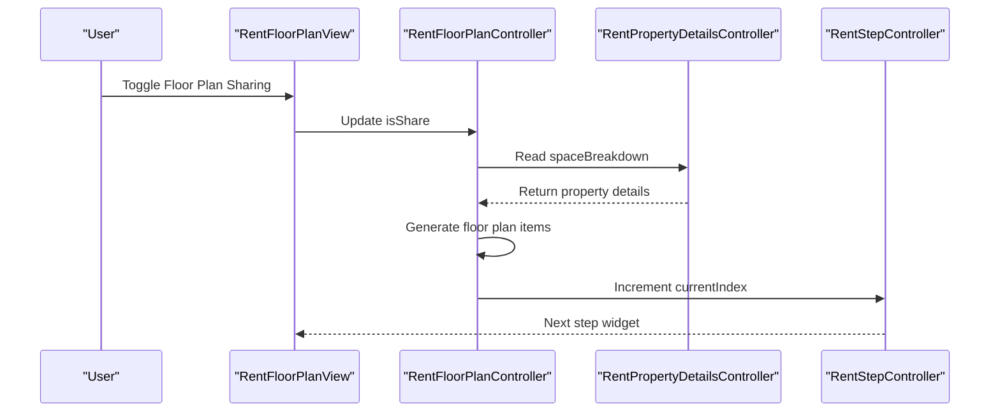
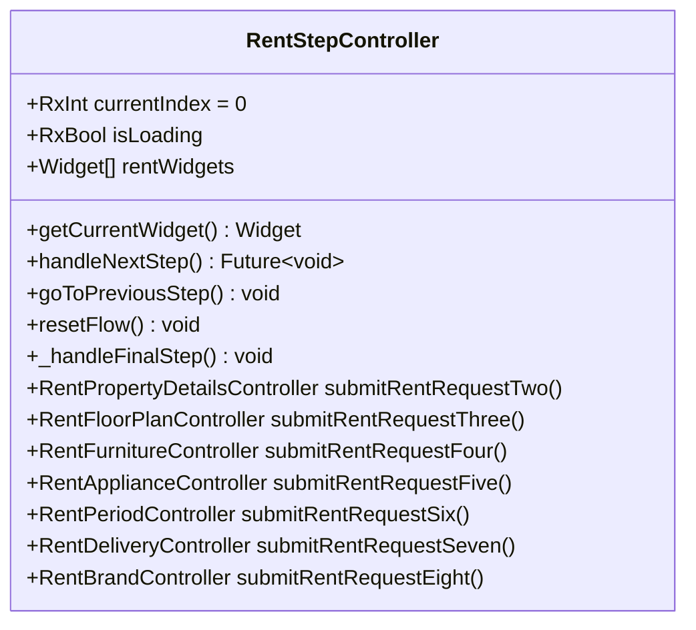
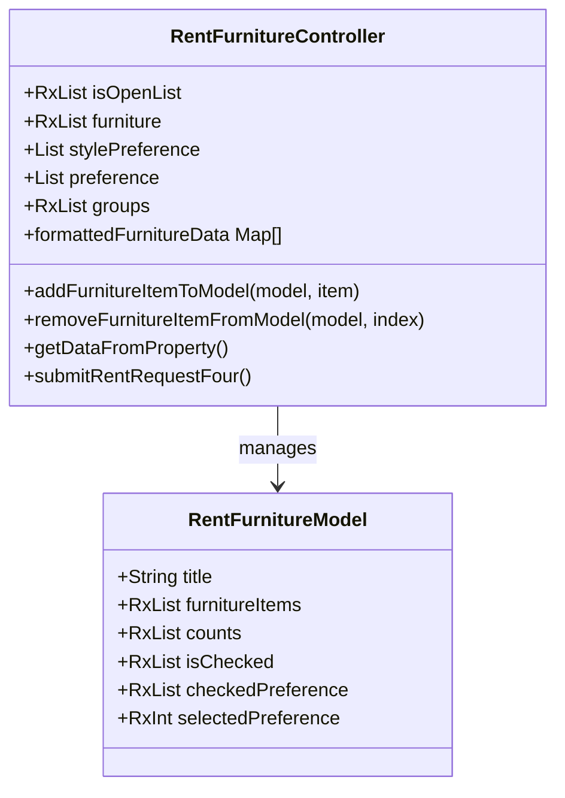
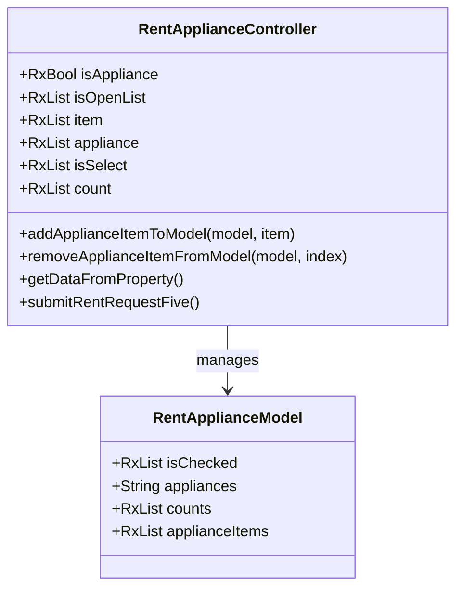
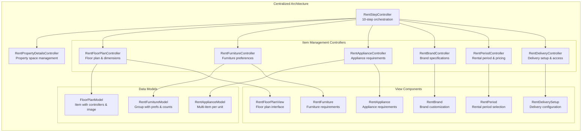
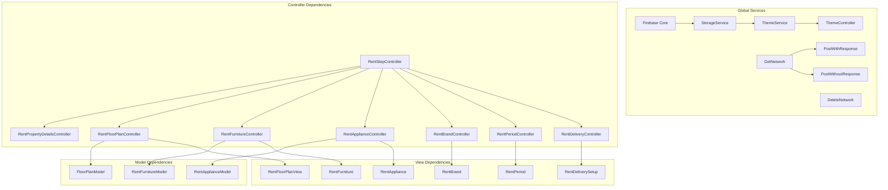

# Rent Furniture System

<cite>
**Referenced Files in This Document**
- [main.dart](file://lib/main.dart)
- [app_routes.dart](file://lib/core/routes/app_routes.dart)
- [dependency_injection.dart](file://lib/core/di/dependency_injection.dart)
- [rent_bindings.dart](file://lib/features/rent_request/bindings/rent_bindings.dart)
- [rent_step_controller.dart](file://lib/features/rent_request/controllers/rent_step_controller.dart)
- [rent_request_controller.dart](file://lib/features/rent_request/controllers/rent_request_controller.dart)
- [rent_property_type_controller.dart](file://lib/features/rent_request/controllers/rent_property_type_controller.dart)
- [rent_floor_plan_controller.dart](file://lib/features/rent_request/controllers/rent_floor_plan_controller.dart)
- [rent_furniture_controller.dart](file://lib/features/rent_request/controllers/rent_furniture_controller.dart)
- [rent_appliance_controller.dart](file://lib/features/rent_request/controllers/rent_appliance_controller.dart)
- [rent_delivery_controller.dart](file://lib/features/rent_request/controllers/rent_delivery_controller.dart)
- [rent_period_controller.dart](file://lib/features/rent_request/controllers/rent_period_controller.dart)
- [rent_brand_controller.dart](file://lib/features/rent_request/controllers/rent_brand_controller.dart)
- [floor_plan_model.dart](file://lib/features/rent_request/models/floor_plan_model.dart)
- [rent_furniture_model.dart](file://lib/features/rent_request/models/rent_furniture_model.dart)
- [rent_appliance_model.dart](file://lib/features/rent_request/models/rent_appliance_model.dart)
- [step_zero_model.dart](file://lib/features/rent_request/models/step_zero_model.dart)
- [step_zero_repo.dart](file://lib/features/rent_request/repositories/step_zero_repo.dart)
- [step_one_repo.dart](file://lib/features/rent_request/repositories/step_one_repo.dart)
- [rent_request_view.dart](file://lib/features/rent_request/views/rent_request_view.dart)
- [rent_floor_plan_view.dart](file://lib/features/rent_request/widgets/rent_floor_plan_widgets/rent_floor_plan_view.dart)
- [rent_furniture.dart](file://lib/features/rent_request/widgets/rent_furniture_widgets/rent_furniture.dart)
- [rent_appliance.dart](file://lib/features/rent_request/widgets/rent_appliance_widgets/rent_appliance.dart)
- [rent_delivery_setup.dart](file://lib/features/rent_request/widgets/rent_delivery_widgets/rent_delivery_setup.dart)
- [rent_brand.dart](file://lib/features/rent_request/widgets/rent_brand_widgets/rent_brand.dart)
- [rent_period.dart](file://lib/features/rent_request/widgets/rent_period_widgets/rent_period.dart)
- [rent_request_view_form.dart](file://lib/features/rent_request/widgets/rent_request_view_widgets/rent_request_view_form.dart)
- [rent_request_next.dart](file://lib/features/rent_request/widgets/rent_request_view_widgets/rent_request_next.dart)
- [rent_property_type_view.dart](file://lib/features/rent_request/views/rent_property_type_view.dart)
</cite>

## Update Summary
**Changes Made**
- Added comprehensive appliance management system with RentApplianceController and RentApplianceModel
- Implemented advanced furniture selection with dynamic grouping and preference management
- Enhanced floor plan configuration with image upload and dimension tracking
- Expanded delivery setup functionality with access details and time slots
- Integrated brand specification controller for commercial properties
- Added rental period selection with discount calculation and payment options
- Updated RentStepController to manage 10-step workflow with enhanced validation
- Improved property details integration enabling dynamic item generation across controllers

## Table of Contents
1. [Introduction](#introduction)
2. [Project Structure](#project-structure)
3. [Core Components](#core-components)
4. [Architecture Overview](#architecture-overview)
5. [Detailed Component Analysis](#detailed-component-analysis)
6. [Enhanced Navigation and Visual Feedback](#enhanced-navigation-and-visual-feedback)
7. [Controller Architecture](#controller-architecture)
8. [Dependency Injection Patterns](#dependency-injection-patterns)
9. [Step Zero System Implementation](#step-zero-system-implementation)
10. [Step One System Implementation](#step-one-system-implementation)
11. [Property Type Selection Workflow](#property-type-selection-workflow)
12. [Advanced Item Management Systems](#advanced-item-management-systems)
13. [Delivery and Setup Configuration](#delivery-and-setup-configuration)
14. [Brand Specification and Customization](#brand-specification-and-customization)
15. [Rental Period and Pricing Management](#rental-period-and-pricing-management)
16. [Performance Considerations](#performance-considerations)
17. [Troubleshooting Guide](#troubleshooting-guide)
18. [Conclusion](#conclusion)

## Introduction
This document describes the comprehensive Rent Furniture System, focusing on the end-to-end rent request workflow from property listing creation to tenant approval. The system has undergone significant architectural enhancements with the addition of advanced item management controllers, comprehensive models, and expanded delivery setup functionality. The system now implements a sophisticated 10-step workflow with specialized controllers for floor plan configuration, furniture preferences, appliance requirements, brand specifications, rental periods, and delivery arrangements, while maintaining centralized validation logic and step-by-step navigation.

The enhanced system features dynamic item management across multiple controllers, comprehensive data models for each item category, and integrated property details that drive dynamic content generation. Recent improvements include the introduction of RentApplianceController for appliance management, RentFurnitureController for sophisticated furniture selection, RentFloorPlanController for detailed space configuration, and comprehensive delivery setup functionality.

## Project Structure
The Rent Furniture System features a comprehensive architecture with RentStepController as the central orchestrator managing the complete 10-step workflow. The system maintains specialized controllers for domain-specific logic while centralizing navigation and validation through the RentStepController. Advanced item management systems have been integrated with dynamic property-driven content generation.

```mermaid
graph TB
subgraph "Application Initialization"
MAIN["main.dart<br/>Initialize DI, theme, routes"]
DI["dependency_injection.dart<br/>Global service registration"]
ROUTES["app_routes.dart<br/>Define named routes"]
END
subgraph "Core Orchestration"
STEP_CONTROLLER["RentStepController<br/>10-step flow orchestration<br/>Centralized validation"]
REQUEST_CONTROLLER["RentRequestController<br/>Business form & validation"]
PROPERTY_TYPE_CONTROLLER["RentPropertyTypeController<br/>Property type selection"]
PROPERTY_DETAILS_CONTROLLER["RentPropertyDetailsController<br/>Space breakdown & counts"]
END
subgraph "Advanced Item Management"
FLOOR_PLAN_CONTROLLER["RentFloorPlanController<br/>Dynamic floor plan config<br/>Image & dimension tracking"]
FURNITURE_CONTROLLER["RentFurnitureController<br/>Sophisticated furniture prefs<br/>Style & condition prefs"]
APPLIANCE_CONTROLLER["RentApplianceController<br/>Dynamic appliance items<br/>Multi-unit support"]
BRAND_CONTROLLER["RentBrandController<br/>Commercial branding specs"]
PERIOD_CONTROLLER["RentPeriodController<br/>Rental period & pricing<br/>Discount calc & payments"]
DELIVERY_CONTROLLER["RentDeliveryController<br/>Delivery setup & access<br/>Time slots & restrictions"]
END
subgraph "Data Models"
FLOOR_PLAN_MODEL["FloorPlanModel<br/>Item with controllers & image"]
FURNITURE_MODEL["RentFurnitureModel<br/>Group with prefs & counts"]
APPLIANCE_MODEL["RentApplianceModel<br/>Multi-item per unit"]
STEP_ZERO_MODEL["StepZeroModel<br/>Business info & UUID"]
END
subgraph "View Components"
BINDINGS["rent_bindings.dart<br/>Lazy-load controllers & repositories"]
VIEW["RentRequestView<br/>UI container & navigation"]
FLOOR_PLAN_VIEW["RentFloorPlanView<br/>Floor plan & sharing toggle"]
FURNITURE_VIEW["RentFurniture<br/>Furniture requirements"]
APPLIANCE_VIEW["RentAppliance<br/>Appliance requirements"]
BRAND_VIEW["RentBrand<br/>Brand placement & customization"]
PERIOD_VIEW["RentPeriod<br/>Rental period & discounts"]
DELIVERY_VIEW["RentDeliverySetup<br/>Delivery configuration"]
NEXT_BUTTON["RentRequestNext<br/>Enhanced navigation"]
END
MAIN --> DI
DI --> BINDINGS
BINDINGS --> STEP_CONTROLLER
STEP_CONTROLLER --> FLOOR_PLAN_CONTROLLER
STEP_CONTROLLER --> FURNITURE_CONTROLLER
STEP_CONTROLLER --> APPLIANCE_CONTROLLER
STEP_CONTROLLER --> BRAND_CONTROLLER
STEP_CONTROLLER --> PERIOD_CONTROLLER
STEP_CONTROLLER --> DELIVERY_CONTROLLER
FLOOR_PLAN_CONTROLLER --> FLOOR_PLAN_MODEL
FURNITURE_CONTROLLER --> FURNITURE_MODEL
APPLIANCE_CONTROLLER --> APPLIANCE_MODEL
```

**Diagram sources**
- [main.dart:12-46](file://lib/main.dart#L12-L46)
- [dependency_injection.dart:13-32](file://lib/core/di/dependency_injection.dart#L13-L32)
- [app_routes.dart:1-34](file://lib/core/routes/app_routes.dart#L1-L34)
- [rent_bindings.dart:16-37](file://lib/features/rent_request/bindings/rent_bindings.dart#L16-L37)
- [rent_step_controller.dart:15-98](file://lib/features/rent_request/controllers/rent_step_controller.dart#L15-L98)
- [rent_floor_plan_controller.dart:8-101](file://lib/features/rent_request/controllers/rent_floor_plan_controller.dart#L8-L101)
- [rent_furniture_controller.dart:9-153](file://lib/features/rent_request/controllers/rent_furniture_controller.dart#L9-L153)
- [rent_appliance_controller.dart:9-117](file://lib/features/rent_request/controllers/rent_appliance_controller.dart#L9-L117)
- [rent_brand_controller.dart:3-14](file://lib/features/rent_request/controllers/rent_brand_controller.dart#L3-L14)
- [rent_period_controller.dart:6-89](file://lib/features/rent_request/controllers/rent_period_controller.dart#L6-L89)
- [rent_delivery_controller.dart:6-70](file://lib/features/rent_request/controllers/rent_delivery_controller.dart#L6-L70)
- [floor_plan_model.dart:4-19](file://lib/features/rent_request/models/floor_plan_model.dart#L4-L19)
- [rent_furniture_model.dart:3-22](file://lib/features/rent_request/models/rent_furniture_model.dart#L3-L22)
- [rent_appliance_model.dart:3-15](file://lib/features/rent_request/models/rent_appliance_model.dart#L3-L15)
- [step_zero_model.dart:1-88](file://lib/features/rent_request/models/step_zero_model.dart#L1-L88)

**Section sources**
- [main.dart:12-46](file://lib/main.dart#L12-L46)
- [dependency_injection.dart:13-32](file://lib/core/di/dependency_injection.dart#L13-L32)
- [app_routes.dart:1-34](file://lib/core/routes/app_routes.dart#L1-L34)
- [rent_bindings.dart:16-37](file://lib/features/rent_request/bindings/rent_bindings.dart#L16-L37)

## Core Components
- **RentStepController**: Central orchestrator managing 10-step workflow with comprehensive validation logic, loading states, and step navigation. Handles step-specific validation and transitions between form widgets, now supporting advanced item management controllers.
- **RentRequestController**: Specialized controller managing business form data, validation, and initial submission to Step Zero Repository. Coordinates with RentStepController for step advancement.
- **RentPropertyDetailsController**: Enhanced controller managing property space breakdown, room counts, and dynamic item generation for downstream controllers.
- **RentFloorPlanController**: Advanced controller managing floor plan configuration with image upload, dimension tracking, and sharing preferences. Generates dynamic floor plan items based on property details.
- **RentFurnitureController**: Sophisticated controller managing furniture preferences with style choices, condition preferences, and dynamic grouping by property spaces.
- **RentApplianceController**: Comprehensive controller managing appliance requirements with multi-unit support and dynamic item management.
- **RentBrandController**: Controller managing brand specification requirements for commercial properties with customization options.
- **RentPeriodController**: Controller managing rental period selection with discount calculation and payment plan options.
- **RentDeliveryController**: Controller managing delivery setup with access details, time slots, and restriction handling.
- **Enhanced Data Models**: Specialized models for each item category with reactive properties and proper lifecycle management.
- **Dynamic Property Integration**: All item controllers integrate with property details to generate contextually relevant forms.

**Section sources**
- [rent_step_controller.dart:15-98](file://lib/features/rent_request/controllers/rent_step_controller.dart#L15-L98)
- [rent_request_controller.dart:9-69](file://lib/features/rent_request/controllers/rent_request_controller.dart#L9-L69)
- [rent_floor_plan_controller.dart:8-101](file://lib/features/rent_request/controllers/rent_floor_plan_controller.dart#L8-L101)
- [rent_furniture_controller.dart:9-153](file://lib/features/rent_request/controllers/rent_furniture_controller.dart#L9-L153)
- [rent_appliance_controller.dart:9-117](file://lib/features/rent_request/controllers/rent_appliance_controller.dart#L9-L117)
- [rent_brand_controller.dart:3-14](file://lib/features/rent_request/controllers/rent_brand_controller.dart#L3-L14)
- [rent_period_controller.dart:6-89](file://lib/features/rent_request/controllers/rent_period_controller.dart#L6-L89)
- [rent_delivery_controller.dart:6-70](file://lib/features/rent_request/controllers/rent_delivery_controller.dart#L6-L70)
- [floor_plan_model.dart:4-19](file://lib/features/rent_request/models/floor_plan_model.dart#L4-L19)
- [rent_furniture_model.dart:3-22](file://lib/features/rent_request/models/rent_furniture_model.dart#L3-L22)
- [rent_appliance_model.dart:3-15](file://lib/features/rent_request/models/rent_appliance_model.dart#L3-L15)

## Architecture Overview
The system now follows a comprehensive, reactive architecture with RentStepController as the primary orchestrator, enhanced by advanced item management systems with dynamic property integration:
- **Centralized Flow Control**: RentStepController manages all 10 steps with dedicated validation logic for each step
- **Dynamic Item Generation**: Property details drive dynamic content generation across all item management controllers
- **Specialized Domain Logic**: Individual controllers handle domain-specific data and validation with comprehensive models
- **Enhanced State Management**: Reactive variables for current step, loading states, and navigation control
- **Advanced Property Integration**: Property details controller coordinates with all item management controllers
- **Comprehensive Data Models**: Specialized models for each item category with proper lifecycle management



**Diagram sources**
- [rent_floor_plan_view.dart:57-78](file://lib/features/rent_request/widgets/rent_floor_plan_widgets/rent_floor_plan_view.dart#L57-L78)
- [rent_floor_plan_controller.dart:30-52](file://lib/features/rent_request/controllers/rent_floor_plan_controller.dart#L30-L52)
- [rent_step_controller.dart:50-52](file://lib/features/rent_request/controllers/rent_step_controller.dart#L50-L52)

## Detailed Component Analysis

### RentStepController
Complete architectural transformation from monolithic approach to centralized step management with comprehensive validation logic and enhanced integration with all item management controllers.

Responsibilities:
- Manages 10-step workflow with centralized validation and navigation logic
- Controls current step index with reactive state management
- Handles step-specific validation through switch statement
- Provides loading states and error handling for step transitions
- Coordinates with specialized controllers for domain-specific data
- Integrates with property details controller for dynamic content generation

Navigation and state management:
- currentIndex drives step rendering from rentWidgets list
- isLoading reactive variable controls loading states during transitions
- totalSteps computed property provides step count for UI indicators
- Enhanced debugging with step transition logging
- Integration with all specialized controllers for seamless workflow



**Diagram sources**
- [rent_step_controller.dart:15-98](file://lib/features/rent_request/controllers/rent_step_controller.dart#L15-L98)

**Section sources**
- [rent_step_controller.dart:15-98](file://lib/features/rent_request/controllers/rent_step_controller.dart#L15-L98)

### RentPropertyDetailsController
Enhanced controller managing property space breakdown, room counts, and dynamic item generation for downstream controllers. Serves as the foundation for all dynamic content generation across item management systems.

Responsibilities:
- Manages property space breakdown with labels and selection states
- Tracks room counts for each space type
- Generates dynamic content for all item management controllers
- Provides reactive data streams for controller synchronization
- Coordinates with RentStepController for step advancement

Dynamic content generation:
- Space breakdown with selection states and counts
- Reactive listeners for automatic controller updates
- Contextual item generation based on property characteristics
- Integration with all specialized controllers for unified workflow

**Section sources**
- [rent_step_controller.dart:85-98](file://lib/features/rent_request/controllers/rent_step_controller.dart#L85-L98)

### RentFloorPlanController
Advanced controller managing floor plan configuration with comprehensive image upload, dimension tracking, and sharing preferences. Generates dynamic floor plan items based on property details.

Responsibilities:
- Manages floor plan items with title, image path, and dimension controllers
- Handles floor plan sharing toggle with reactive state management
- Generates dynamic floor plan items based on property space breakdown
- Tracks image uploads and clears with proper lifecycle management
- Provides formatted floor plan details for review and submission

Dynamic item generation:
- Automatic item creation based on property space breakdown
- Per-space dimension tracking with length and width controllers
- Image upload management with proper disposal
- Reactive updates when property details change

```mermaid
sequenceDiagram
participant PropertyController as "RentPropertyDetailsController"
participant FloorPlanController as "RentFloorPlanController"
participant Items as "FloorPlanItem List"
PropertyController->>FloorPlanController : spaceBreakdown, isChecked, counts
FloorPlanController->>Items : Create items based on selected spaces
Loop For each selected space
FloorPlanController->>Items : Add FloorPlanItem with title
FloorPlanController->>Items : Initialize dimension controllers
End Loop
Items-->>FloorPlanController : Dynamic floor plan items
```

**Diagram sources**
- [rent_floor_plan_controller.dart:30-52](file://lib/features/rent_request/controllers/rent_floor_plan_controller.dart#L30-L52)
- [floor_plan_model.dart:10-19](file://lib/features/rent_request/models/floor_plan_model.dart#L10-L19)

**Section sources**
- [rent_floor_plan_controller.dart:8-101](file://lib/features/rent_request/controllers/rent_floor_plan_controller.dart#L8-L101)
- [floor_plan_model.dart:4-19](file://lib/features/rent_request/models/floor_plan_model.dart#L4-L19)

### RentFurnitureController
Sophisticated controller managing furniture preferences with comprehensive style choices, condition preferences, and dynamic grouping by property spaces. Generates contextual furniture requirements based on property details.

Responsibilities:
- Manages furniture items with style preferences and condition options
- Handles dynamic grouping by property spaces with per-group counts
- Provides formatted furniture data for review and submission
- Manages style preference selections with reactive state
- Generates contextual furniture requirements based on property characteristics

Dynamic grouping and preferences:
- Automatic group creation based on property space breakdown
- Per-group furniture item management with counts and selections
- Style preference management with multiple selection support
- Condition preference tracking with contextual options
- Formatted data generation for comprehensive review



**Diagram sources**
- [rent_furniture_controller.dart:9-153](file://lib/features/rent_request/controllers/rent_furniture_controller.dart#L9-L153)
- [rent_furniture_model.dart:3-22](file://lib/features/rent_request/models/rent_furniture_model.dart#L3-L22)

**Section sources**
- [rent_furniture_controller.dart:9-153](file://lib/features/rent_request/controllers/rent_furniture_controller.dart#L9-L153)
- [rent_furniture_model.dart:3-22](file://lib/features/rent_request/models/rent_furniture_model.dart#L3-L22)

### RentApplianceController
Comprehensive controller managing appliance requirements with multi-unit support and dynamic item management. Generates contextual appliance lists based on property details and unit counts.

Responsibilities:
- Manages appliance items with multi-unit support and dynamic lists
- Handles dynamic appliance item addition and removal
- Generates contextual appliance lists based on property characteristics
- Manages appliance selection states and counts per unit
- Provides formatted appliance data for review and submission

Dynamic item management:
- Automatic appliance list generation based on property space breakdown
- Multi-unit support with per-unit appliance selection
- Dynamic appliance item addition with validation
- Per-unit count tracking with reactive state management
- Contextual appliance recommendations based on property type



**Diagram sources**
- [rent_appliance_controller.dart:9-117](file://lib/features/rent_request/controllers/rent_appliance_controller.dart#L9-L117)
- [rent_appliance_model.dart:3-15](file://lib/features/rent_request/models/rent_appliance_model.dart#L3-L15)

**Section sources**
- [rent_appliance_controller.dart:9-117](file://lib/features/rent_request/controllers/rent_appliance_controller.dart#L9-L117)
- [rent_appliance_model.dart:3-15](file://lib/features/rent_request/models/rent_appliance_model.dart#L3-L15)

### RentBrandController
Controller managing brand specification requirements for commercial properties with comprehensive customization options and image management.

Responsibilities:
- Manages brand specification toggle with reactive state
- Handles brand customization options with multi-selection support
- Manages brand image upload with proper lifecycle
- Provides brand preference tracking for commercial properties
- Coordinates with property type controller for contextual branding

Brand customization:
- Brand specification toggle for commercial properties
- Customization options including logo placement and color matching
- Image upload management with proper disposal
- Preference tracking for brand requirements
- Contextual branding based on property type

**Section sources**
- [rent_brand_controller.dart:3-14](file://lib/features/rent_request/controllers/rent_brand_controller.dart#L3-L14)

### RentPeriodController
Controller managing rental period selection with comprehensive discount calculation and payment plan options. Provides structured rental period management with flexible options.

Responsibilities:
- Manages rental period selection with predefined options
- Handles discount calculation based on selected period
- Manages payment plan options with installment structures
- Provides rental period validation and selection tracking
- Coordinates with RentStepController for step advancement

Rental period management:
- Predefined rental periods with discount tiers
- Discount calculation based on selected period
- Payment plan options with upfront and installment structures
- Custom period selection with validation
- Flexible rental terms with promotional offers

**Section sources**
- [rent_period_controller.dart:6-89](file://lib/features/rent_request/controllers/rent_period_controller.dart#L6-L89)

### RentDeliveryController
Controller managing comprehensive delivery setup with access details, time slots, and restriction handling. Provides detailed delivery configuration for rental fulfillment.

Responsibilities:
- Manages delivery address and recipient information
- Handles delivery date and time slot selection
- Manages access restrictions with loading dock and lift availability
- Provides delivery setup toggle with reactive state management
- Coordinates with RentStepController for step advancement

Delivery configuration:
- Comprehensive delivery address management
- Time slot selection with multiple period options
- Access restriction handling with validation
- Delivery setup toggle with contextual options
- Restriction management for delivery logistics

**Section sources**
- [rent_delivery_controller.dart:6-70](file://lib/features/rent_request/controllers/rent_delivery_controller.dart#L6-L70)

### Enhanced Navigation Components
RentRequestNext widget provides intelligent navigation with loading states and conditional rendering, now supporting the expanded 10-step workflow.

Features:
- Dynamic button rendering based on current step position
- Loading state management during step transitions
- Conditional submit button for final step
- Enhanced user feedback through visual indicators
- Integration with all specialized controllers for seamless navigation

Navigation logic:
- Last step shows submit button with dialog confirmation
- Loading state prevents double submissions
- Step-specific validation before navigation
- Smooth transitions between form widgets
- Integration with RentStepController for coordinated advancement

**Section sources**
- [rent_request_next.dart:11-61](file://lib/features/rent_request/widgets/rent_request_view_widgets/rent_request_next.dart#L11-L61)

### RentRequestView
Simplified view architecture delegating step management to RentStepController with enhanced support for advanced item management systems.

Responsibilities:
- Provides scrollable container for step-based navigation
- Delegates current step rendering to RentStepController
- Manages previous/next button visibility and styling
- Integrates with flow widgets for step indicators
- Supports advanced item management view components

View delegation:
- RentStepController manages step rendering and navigation
- Obx widgets for reactive step state updates
- Clean separation between presentation and logic
- Enhanced visual feedback through flow widgets
- Integration with all specialized view components

**Section sources**
- [rent_request_view.dart:16-79](file://lib/features/rent_request/views/rent_request_view.dart#L16-L79)

### Enhanced View Components
Advanced view components supporting the comprehensive item management system with dynamic content generation and user interaction.

Features:
- Dynamic content generation based on controller state
- Reactive UI updates through Obx widgets
- Comprehensive form layouts with proper spacing
- Integration with specialized controllers for data binding
- Enhanced user experience through contextual interfaces

Dynamic view generation:
- Automatic view updates based on controller state
- Reactive UI components with proper lifecycle management
- Contextual form layouts for different item categories
- Integration with property details for dynamic content
- Enhanced user interaction patterns for complex forms

**Section sources**
- [rent_floor_plan_view.dart:15-83](file://lib/features/rent_request/widgets/rent_floor_plan_widgets/rent_floor_plan_view.dart#L15-L83)
- [rent_furniture.dart:10-32](file://lib/features/rent_request/widgets/rent_furniture_widgets/rent_furniture.dart#L10-L32)
- [rent_appliance.dart:9-31](file://lib/features/rent_request/widgets/rent_appliance_widgets/rent_appliance.dart#L9-L31)
- [rent_brand.dart:17-96](file://lib/features/rent_request/widgets/rent_brand_widgets/rent_brand.dart#L17-L96)
- [rent_delivery_setup.dart:10-60](file://lib/features/rent_request/widgets/rent_delivery_widgets/rent_delivery_setup.dart#L10-L60)
- [rent_period.dart:7-23](file://lib/features/rent_request/widgets/rent_period_widgets/rent_period.dart#L7-L23)

## Enhanced Navigation and Visual Feedback
The Rent Furniture System now features sophisticated navigation and visual feedback mechanisms through the centralized RentStepController architecture with comprehensive item management integration.

### Intelligent Step Navigation
- **Dynamic Step Rendering**: RentStepController manages 10 distinct step widgets with proper lifecycle management
- **Conditional Navigation**: RentRequestNext widget adapts button appearance based on step position
- **Loading State Management**: Reactive loading indicators prevent concurrent step transitions
- **Enhanced Progress Tracking**: FlowStepCount and FlowPageCount provide real-time step information
- **Advanced Item Integration**: All specialized controllers integrate seamlessly with step navigation
- **Dynamic Content Updates**: Property details drive automatic content updates across all steps

### Visual Design Improvements
- **Consistent Styling**: SharedContainer widgets ensure uniform appearance across all steps
- **Responsive Layout**: Flutter_ScreenUtil provides consistent sizing across devices
- **Custom Components**: Specialized widgets for property management, furniture selection, and period calculation
- **Accessibility Features**: Proper contrast ratios and touch target optimization
- **Reactive UI Updates**: Obx widgets provide real-time updates for dynamic content

### User Experience Enhancements
- **Step Validation**: Each step validates input before allowing navigation forward
- **Error Handling**: Comprehensive error display with actionable feedback
- **Progress Indication**: Clear visual representation of form completion status
- **Smooth Transitions**: Animated step changes with proper timing and easing
- **Dynamic Property Options**: Automatic content updates based on property details
- **Contextual Branding**: Brand requirements adapt based on property type selection

## Controller Architecture
Complete architectural transformation to centralized step management with RentStepController as the primary orchestrator, enhanced by comprehensive item management systems with dynamic property integration.

### Centralized Step Management
- **RentStepController**: Primary orchestrator managing all 10 steps with dedicated validation logic
- **Specialized Controllers**: Secondary role handling domain-specific data and validation with comprehensive integration
- **Streamlined Dependencies**: Reduced complexity through centralized coordination
- **Enhanced Maintainability**: Single point of control for step transitions and validation
- **Dynamic Property Integration**: All controllers coordinate through RentPropertyDetailsController
- **Comprehensive Data Flow**: Bidirectional data flow between property details and item controllers

### Advanced Item Management Integration
- **Dynamic Content Generation**: Property details drive automatic content creation across all item controllers
- **Reactive Synchronization**: Controllers automatically update when property details change
- **Contextual Forms**: Forms adapt based on property characteristics and requirements
- **Unified Workflow**: All item management systems integrate with the central step controller
- **Enhanced User Experience**: Contextual interfaces improve user interaction and completion rates

### Step-Based Architecture
- **Step 0**: Business form validation and initial submission via StepZeroRepository
- **Step 1**: Property type and use selection with dynamic options via StepOneRepository
- **Step 2**: Property details with space breakdown and room counts
- **Step 3**: Floor plan configuration with image upload and dimension tracking
- **Step 4**: Furniture requirements with style and condition preferences
- **Step 5**: Appliance requirements with multi-unit support
- **Step 6**: Rental period selection with discount calculation
- **Step 7**: Delivery setup with access details and time slots
- **Step 8**: Brand specification for commercial properties
- **Step 9**: Final review and submission
- **Validation Logic**: Step-specific validation through switch statement
- **Loading States**: Reactive loading management for smooth transitions

### Controller Implementation Patterns
- **GetxController Base**: All controllers extend GetxController for reactive state management
- **Rx Observables**: Reactive variables for automatic UI updates
- **Central Coordination**: RentStepController coordinates between specialized controllers
- **Proper Lifecycle**: Enhanced lifecycle management with initialization and disposal
- **Dependency Injection**: Proper service registration and resolution through GetX
- **Dynamic Integration**: Controllers dynamically integrate with property details for contextual content



**Diagram sources**
- [rent_step_controller.dart:15-34](file://lib/features/rent_request/controllers/rent_step_controller.dart#L15-L34)
- [rent_floor_plan_controller.dart:8-101](file://lib/features/rent_request/controllers/rent_floor_plan_controller.dart#L8-L101)
- [rent_furniture_controller.dart:9-153](file://lib/features/rent_request/controllers/rent_furniture_controller.dart#L9-L153)
- [rent_appliance_controller.dart:9-117](file://lib/features/rent_request/controllers/rent_appliance_controller.dart#L9-L117)
- [rent_brand_controller.dart:3-14](file://lib/features/rent_request/controllers/rent_brand_controller.dart#L3-L14)
- [rent_period_controller.dart:6-89](file://lib/features/rent_request/controllers/rent_period_controller.dart#L6-L89)
- [rent_delivery_controller.dart:6-70](file://lib/features/rent_request/controllers/rent_delivery_controller.dart#L6-L70)
- [floor_plan_model.dart:4-19](file://lib/features/rent_request/models/floor_plan_model.dart#L4-L19)
- [rent_furniture_model.dart:3-22](file://lib/features/rent_request/models/rent_furniture_model.dart#L3-L22)
- [rent_appliance_model.dart:3-15](file://lib/features/rent_request/models/rent_appliance_model.dart#L3-L15)

**Section sources**
- [rent_step_controller.dart:15-34](file://lib/features/rent_request/controllers/rent_step_controller.dart#L15-L34)
- [rent_floor_plan_controller.dart:8-101](file://lib/features/rent_request/controllers/rent_floor_plan_controller.dart#L8-L101)
- [rent_furniture_controller.dart:9-153](file://lib/features/rent_request/controllers/rent_furniture_controller.dart#L9-L153)
- [rent_appliance_controller.dart:9-117](file://lib/features/rent_request/controllers/rent_appliance_controller.dart#L9-L117)
- [rent_brand_controller.dart:3-14](file://lib/features/rent_request/controllers/rent_brand_controller.dart#L3-L14)
- [rent_period_controller.dart:6-89](file://lib/features/rent_request/controllers/rent_period_controller.dart#L6-L89)
- [rent_delivery_controller.dart:6-70](file://lib/features/rent_request/controllers/rent_delivery_controller.dart#L6-L70)
- [floor_plan_model.dart:4-19](file://lib/features/rent_request/models/floor_plan_model.dart#L4-L19)
- [rent_furniture_model.dart:3-22](file://lib/features/rent_request/models/rent_furniture_model.dart#L3-L22)
- [rent_appliance_model.dart:3-15](file://lib/features/rent_request/models/rent_appliance_model.dart#L3-L15)

## Dependency Injection Patterns
Enhanced dependency injection patterns reflecting the centralized architecture with comprehensive item management system integration.

### Global Service Registration
- **DependencyInjection**: Centralized service registration for Firebase, storage, theme, and network services
- **Get.lazyPut**: Lazy loading for controllers and repositories with proper dependency resolution
- **Singleton Pattern**: Permanent service registration for global accessibility

### Comprehensive Controller Dependencies
- **RentStepController**: Coordinates all specialized controllers with RentPropertyDetailsController
- **RentPropertyDetailsController**: Foundation for all dynamic content generation
- **Item Management Controllers**: Enhanced dependencies with comprehensive model integration
- **Data Models**: Proper integration with controller lifecycle management
- **View Components**: Integration with specialized controller instances

### Advanced Integration Patterns
- **Property Details Integration**: All item controllers depend on RentPropertyDetailsController
- **Model Lifecycle Management**: Proper disposal and initialization for reactive models
- **Controller Coordination**: Centralized coordination through RentStepController
- **Dynamic Content Generation**: Property details drive automatic controller updates
- **Enhanced Service Resolution**: Proper GetX service registration and resolution



**Diagram sources**
- [dependency_injection.dart:13-32](file://lib/core/di/dependency_injection.dart#L13-L32)
- [rent_bindings.dart:16-37](file://lib/features/rent_request/bindings/rent_bindings.dart#L16-L37)
- [rent_step_controller.dart:15-34](file://lib/features/rent_request/controllers/rent_step_controller.dart#L15-L34)
- [rent_floor_plan_controller.dart:8-101](file://lib/features/rent_request/controllers/rent_floor_plan_controller.dart#L8-L101)
- [rent_furniture_controller.dart:9-153](file://lib/features/rent_request/controllers/rent_furniture_controller.dart#L9-L153)
- [rent_appliance_controller.dart:9-117](file://lib/features/rent_request/controllers/rent_appliance_controller.dart#L9-L117)
- [rent_brand_controller.dart:3-14](file://lib/features/rent_request/controllers/rent_brand_controller.dart#L3-L14)
- [rent_period_controller.dart:6-89](file://lib/features/rent_request/controllers/rent_period_controller.dart#L6-L89)
- [rent_delivery_controller.dart:6-70](file://lib/features/rent_request/controllers/rent_delivery_controller.dart#L6-L70)

**Section sources**
- [dependency_injection.dart:13-32](file://lib/core/di/dependency_injection.dart#L13-L32)
- [rent_bindings.dart:16-37](file://lib/features/rent_request/bindings/rent_bindings.dart#L16-L37)
- [rent_step_controller.dart:15-34](file://lib/features/rent_request/controllers/rent_step_controller.dart#L15-L34)
- [rent_floor_plan_controller.dart:8-101](file://lib/features/rent_request/controllers/rent_floor_plan_controller.dart#L8-L101)
- [rent_furniture_controller.dart:9-153](file://lib/features/rent_request/controllers/rent_furniture_controller.dart#L9-L153)
- [rent_appliance_controller.dart:9-117](file://lib/features/rent_request/controllers/rent_appliance_controller.dart#L9-L117)
- [rent_brand_controller.dart:3-14](file://lib/features/rent_request/controllers/rent_brand_controller.dart#L3-L14)
- [rent_period_controller.dart:6-89](file://lib/features/rent_request/controllers/rent_period_controller.dart#L6-L89)
- [rent_delivery_controller.dart:6-70](file://lib/features/rent_request/controllers/rent_delivery_controller.dart#L6-L70)

## Step Zero System Implementation
Comprehensive implementation of the zero-step rental request system with business identification and UUID management, integrated with the enhanced dependency injection patterns.

### Zero-Step Workflow
- **Business Identification**: Initial form collection with business name, contact person, email, phone, ABN, and website
- **Validation Layer**: Shared validators ensure data integrity before submission
- **API Integration**: StepZeroRepository handles HTTP communication and response processing
- **Session Management**: UUID stored in StorageService for continuous session tracking

### Data Flow Architecture
- **Form Input**: RentRequestViewForm captures business information
- **Validation**: FormState validation ensures required fields are present
- **Repository Call**: StepZeroRepository executes HTTP POST request
- **Response Handling**: Either type handles success/error scenarios
- **State Update**: UUID stored and step counter incremented

### Error Handling Strategy
- **Type Safety**: FP Dart Either pattern for predictable error handling
- **Error Models**: Standardized error response structure
- **User Feedback**: ErrorSnackbar provides immediate user notification
- **Fallback Logic**: Graceful degradation on API failures

### Storage Integration
- **UUID Persistence**: Unique identifier stored for session continuity
- **Local Storage**: GetStorage service handles persistent data
- **Session Continuity**: UUID retrieval enables multi-step session management
- **Data Integrity**: Proper cleanup and validation of stored data

**Section sources**
- [rent_request_controller.dart:36-56](file://lib/features/rent_request/controllers/rent_request_controller.dart#L36-L56)
- [step_zero_model.dart:1-88](file://lib/features/rent_request/models/step_zero_model.dart#L1-L88)
- [step_zero_repo.dart:13-35](file://lib/features/rent_request/repositories/step_zero_repo.dart#L13-L35)

## Step One System Implementation
Comprehensive implementation of the step-one rental request system for property type and use selection with dynamic options and validation.

### Step-One Workflow
- **Property Type Selection**: Dropdown selection between Residential and Commercial property types
- **Dynamic Property Use Options**: Automatic dropdown population based on property type selection
- **Validation Layer**: Ensures both property type and use are selected before submission
- **API Integration**: StepOneRepository handles HTTP communication for property data
- **Session Continuity**: Integrates with existing UUID from StepZeroRepository

### Dynamic Property Options
- **Residential Property Types**: Short-term Rental, Long-term Residential Leasing, Serviced Apartment, Staff Accommodation
- **Commercial Property Types**: Office, Retail Store, Cafe / Restaurant, Hotel / Serviced Apartments, Medical / Clinic, Showroom, Co-working Space
- **Automatic Updates**: Property use dropdown updates when property type changes
- **Default Selection**: Property use defaults to first option when property type changes

### Data Flow Architecture
- **User Selection**: RentPropertyTypeView captures property type and use selections
- **Validation**: PropertyTypeController ensures both selections are made
- **Repository Call**: StepOneRepository executes HTTP POST request with property data
- **Response Handling**: Either type handles success/error scenarios
- **State Update**: Step counter increments for next step navigation

### Error Handling Strategy
- **Type Safety**: FP Dart Either pattern for predictable error handling
- **Error Models**: Standardized error response structure
- **User Feedback**: ErrorSnackbar provides immediate user notification
- **Fallback Logic**: Graceful degradation on API failures

### Reactive UI Updates
- **Obx Widgets**: Automatic UI updates when property type changes
- **ever Function**: Watches property type changes and updates property use options
- **Default Values**: Automatic property use selection based on property type
- **Real-time Feedback**: Immediate visual updates for user selections

**Section sources**
- [rent_property_type_controller.dart:29-50](file://lib/features/rent_request/controllers/rent_property_type_controller.dart#L29-L50)
- [step_one_repo.dart:15-32](file://lib/features/rent_request/repositories/step_one_repo.dart#L15-L32)

## Property Type Selection Workflow
Detailed analysis of the property type selection workflow with dynamic options, validation, and reactive UI updates.

### Property Type Selection Process
- **Initial State**: Property type defaults to Residential with property use set to first residential option
- **Type Change Detection**: ever function monitors property type changes
- **Option Update**: Property use dropdown automatically updates with appropriate options
- **Selection Persistence**: Property use defaults to first available option when type changes

### Dynamic Option Generation
- **Residential Options**: Generated from residentialUseOptions list
- **Commercial Options**: Generated from commercialUseOptions list
- **Conditional Rendering**: Obx widget renders appropriate dropdown based on property type
- **Empty State Handling**: Selected property use cleared when no options are available

### Validation and Submission
- **Form Validation**: Both property type and use must be selected
- **Error Handling**: ErrorSnackbar displays validation errors
- **Repository Integration**: StepOneRepository handles data submission
- **Navigation Control**: Successful submission increments step counter

### UI Enhancement Features
- **Responsive Design**: Flutter_ScreenUtil ensures consistent sizing
- **Visual Feedback**: Custom dropdown menus with proper styling
- **Accessibility**: Clear labels and proper contrast ratios
- **User Experience**: Smooth transitions and immediate feedback

**Section sources**
- [rent_property_type_controller.dart:36-50](file://lib/features/rent_request/controllers/rent_property_type_controller.dart#L36-L50)
- [rent_property_type_view.dart:46-71](file://lib/features/rent_request/views/rent_property_type_view.dart#L46-L71)

## Advanced Item Management Systems
Comprehensive analysis of the advanced item management systems that form the backbone of the enhanced rental request workflow.

### Dynamic Item Generation Architecture
- **Property-Driven Content**: All item management controllers generate content based on property details
- **Reactive Synchronization**: Controllers automatically update when property details change
- **Contextual Forms**: Forms adapt based on property characteristics and requirements
- **Unified Data Flow**: Property details serve as the single source of truth for all item controllers

### Floor Plan Management System
- **Image Upload Integration**: Comprehensive image management with proper lifecycle
- **Dimension Tracking**: Per-space dimension tracking with length and width controllers
- **Sharing Preferences**: Floor plan sharing toggle with reactive state management
- **Formatted Output**: Structured data generation for review and submission

### Furniture Requirements System
- **Style Preferences**: Multiple style options with contextual selection
- **Condition Preferences**: Furniture condition options with proper validation
- **Grouped Management**: Per-space furniture grouping with count tracking
- **Formatted Review**: Comprehensive data formatting for final review

### Appliance Requirements System
- **Multi-Unit Support**: Contextual appliance lists for multiple units
- **Dynamic Item Management**: Add/remove functionality with validation
- **Selection Tracking**: Per-appliance selection states with reactive updates
- **Count Management**: Per-unit appliance counting with proper lifecycle

### Brand Specification System
- **Commercial Context**: Brand requirements tailored for commercial properties
- **Customization Options**: Logo placement, color matching, and custom finishes
- **Image Management**: Brand image upload with proper disposal
- **Preference Tracking**: Brand specification preferences with reactive updates

**Section sources**
- [rent_floor_plan_controller.dart:30-52](file://lib/features/rent_request/controllers/rent_floor_plan_controller.dart#L30-L52)
- [rent_furniture_controller.dart:71-97](file://lib/features/rent_request/controllers/rent_furniture_controller.dart#L71-L97)
- [rent_appliance_controller.dart:84-109](file://lib/features/rent_request/controllers/rent_appliance_controller.dart#L84-L109)
- [rent_brand_controller.dart:3-14](file://lib/features/rent_request/controllers/rent_brand_controller.dart#L3-L14)

## Delivery and Setup Configuration
Comprehensive delivery setup functionality with access details, time slots, and restriction handling for optimal rental fulfillment.

### Delivery Configuration Architecture
- **Address Management**: Comprehensive delivery address with validation
- **Recipient Information**: Full name and contact details tracking
- **Date Selection**: Flexible delivery date options with validation
- **Time Slot Management**: Multiple time slot options with selection tracking
- **Access Restrictions**: Loading dock, lift, and working hour restrictions

### Setup Configuration System
- **Setup Toggle**: Delivery setup requirement with reactive state
- **Access Details**: Loading dock availability with validation
- **Lift Access**: Lift availability tracking with proper validation
- **Restriction Management**: Working hour restrictions with contextual options
- **Error Communication**: Setup fee notifications with proper styling

### Time Slot Management
- **Multiple Periods**: Three standard time periods plus custom option
- **Selection Tracking**: Selected time period with reactive updates
- **Validation Integration**: Time slot validation with delivery date
- **User Guidance**: Clear time slot selection with proper feedback

### Access Restriction Handling
- **Loading Dock**: Availability tracking with Yes/No options
- **Lift Access**: Accessibility tracking with validation requirements
- **Working Hours**: Restriction handling with contextual messaging
- **Integration**: All restrictions integrate with delivery logistics

**Section sources**
- [rent_delivery_controller.dart:19-45](file://lib/features/rent_request/controllers/rent_delivery_controller.dart#L19-L45)
- [rent_delivery_setup.dart:17-57](file://lib/features/rent_request/widgets/rent_delivery_widgets/rent_delivery_setup.dart#L17-L57)

## Brand Specification and Customization
Comprehensive brand specification system for commercial properties with customization options and image management.

### Brand Requirement System
- **Commercial Context**: Brand requirements specifically designed for commercial properties
- **Specification Toggle**: Brand specification requirement with reactive state management
- **Customization Options**: Logo placement, brand color matching, and custom finishes
- **Preference Tracking**: Brand specification preferences with contextual selection
- **Property Type Integration**: Brand requirements adapt based on property type selection

### Image Management Integration
- **Brand Image Upload**: Dedicated image upload for brand specifications
- **Lifecycle Management**: Proper disposal and cleanup of brand images
- **Preview Functionality**: Image preview with proper sizing and positioning
- **Validation Integration**: Image validation with brand specification requirements

### Contextual Branding
- **Property Type Adaptation**: Brand requirements change based on property type
- **Residential vs Commercial**: Different branding approaches for different property types
- **Requirement Filtering**: Brand specifications filtered by property characteristics
- **User Guidance**: Clear branding requirements with proper contextual messaging

**Section sources**
- [rent_brand_controller.dart:3-14](file://lib/features/rent_request/controllers/rent_brand_controller.dart#L3-L14)
- [rent_brand.dart:39-90](file://lib/features/rent_request/widgets/rent_brand_widgets/rent_brand.dart#L39-L90)

## Rental Period and Pricing Management
Comprehensive rental period selection system with discount calculation and flexible payment options for optimal pricing management.

### Rental Period Selection
- **Predefined Options**: Six predefined rental periods with promotional offers
- **Discount Calculation**: Automatic discount calculation based on selected period
- **Custom Period**: Flexible custom period selection with validation
- **Selection Tracking**: Selected period with reactive updates and validation
- **Promotional Offers**: Tiered discount structure with clear communication

### Payment Plan Management
- **Payment Options**: Pay in full versus pay in installments
- **Installment Structure**: Three-tier installment plan with specific timing
- **Upfront Payment**: Initial payment tracking with proper validation
- **Subsequent Payments**: Automated payment tracking for installments
- **Final Payment**: Completion payment with proper validation

### Pricing and Discount System
- **Tiered Discounts**: Progressive discount structure based on rental duration
- **Automatic Calculation**: Real-time discount calculation with reactive updates
- **Price Display**: Clear price display with discount communication
- **Promotional Messaging**: Clear promotional messaging for extended rentals
- **Value Communication**: Clear value communication for long-term rentals

### Flexible Rental Terms
- **Urgent Option**: Expedited rental with premium pricing
- **Standard Option**: Regular rental terms with standard pricing
- **Flexible Option**: Adjustable terms with premium flexibility
- **Requirement Tracking**: Selected option with reactive updates
- **Communication**: Clear communication of terms and conditions

**Section sources**
- [rent_period_controller.dart:17-38](file://lib/features/rent_request/controllers/rent_period_controller.dart#L17-L38)
- [rent_period_controller.dart:55-68](file://lib/features/rent_request/controllers/rent_period_controller.dart#L55-L68)
- [rent_period.dart:7-23](file://lib/features/rent_request/widgets/rent_period_widgets/rent_period.dart#L7-L23)

## Performance Considerations
Enhanced performance considerations reflecting the centralized architecture benefits and comprehensive item management system integration.

- **Centralized State Management**: RentStepController reduces memory overhead through single point of control
- **Optimized Step Transitions**: Reactive loading states prevent unnecessary widget rebuilds
- **Lazy Loading Benefits**: RentBindings efficiently manages controller instantiation
- **Reduced Coupling**: Specialized controllers operate independently with minimal interdependencies
- **Dynamic Content Generation**: Property details drive automatic content generation reducing manual updates
- **Reactive Model Management**: Proper disposal and lifecycle management for all reactive models
- **Enhanced Navigation**: Direct widget rendering eliminates complex navigation logic
- **Improved Memory Usage**: Centralized step management reduces controller duplication
- **Streamlined Dependencies**: RentStepController coordinates dependencies more efficiently
- **Reactive UI Updates**: Obx widgets optimize rendering through selective updates
- **Dynamic Property Integration**: Property details drive automatic controller updates reducing manual synchronization
- **Comprehensive Model Lifecycle**: Proper disposal and initialization for all data models

## Troubleshooting Guide
Enhanced troubleshooting guide addressing the new centralized architecture, comprehensive item management systems, and dynamic property integration.

Common issues and resolutions:
- **Step navigation not working**: Verify RentStepController currentIndex updates and RentRequestNext widget logic
- **Form validation failing**: Check RentRequestController formKey validation and Step Zero Repository response handling
- **Loading states not updating**: Ensure RentStepController isLoading reactive variable is properly toggled
- **Step widgets not rendering**: Confirm RentStepController rentWidgets list contains all 10 step widgets
- **Controller initialization errors**: Verify RentBindings lazy loading and RentStepController dependency injection
- **Navigation state inconsistencies**: Check RentStepController step validation logic and special cases
- **Zero-step submission failures**: Verify StepZeroRepository API endpoint and authentication headers
- **UUID persistence issues**: Check StorageService integration and UUID retrieval from storage
- **Step-one submission failures**: Verify StepOneRepository API endpoint and property data validation
- **Property type selection issues**: Check RentPropertyTypeController reactive variable updates and dropdown options
- **Dynamic option problems**: Verify ever function triggers and proper property use option updates
- **Dependency injection problems**: Ensure PostWithResponse and PostWithoutResponse services are properly registered
- **Error handling not working**: Verify Either type usage and ErrorSnackbar integration
- **Reactive UI not updating**: Check Obx widget usage and proper reactive variable declarations
- **Dynamic content generation issues**: Verify RentPropertyDetailsController integration and controller updates
- **Item management controller problems**: Check controller property integration and dynamic content generation
- **Model lifecycle issues**: Verify proper disposal and initialization for all reactive models
- **Floor plan image upload problems**: Check image upload integration and lifecycle management
- **Furniture preference validation**: Verify style and condition preference validation logic
- **Appliance item management**: Check dynamic item addition/removal with proper validation
- **Delivery setup integration**: Verify access restriction handling and time slot validation
- **Brand specification issues**: Check property type integration and image management
- **Rental period calculation**: Verify discount calculation and payment plan validation

**Section sources**
- [rent_step_controller.dart:40-73](file://lib/features/rent_request/controllers/rent_step_controller.dart#L40-L73)
- [rent_request_controller.dart:36-56](file://lib/features/rent_request/controllers/rent_request_controller.dart#L36-L56)
- [rent_property_type_controller.dart:52-70](file://lib/features/rent_request/controllers/rent_property_type_controller.dart#L52-L70)
- [rent_floor_plan_controller.dart:30-52](file://lib/features/rent_request/controllers/rent_floor_plan_controller.dart#L30-L52)
- [rent_furniture_controller.dart:71-97](file://lib/features/rent_request/controllers/rent_furniture_controller.dart#L71-L97)
- [rent_appliance_controller.dart:84-109](file://lib/features/rent_request/controllers/rent_appliance_controller.dart#L84-L109)
- [rent_delivery_controller.dart:19-45](file://lib/features/rent_request/controllers/rent_delivery_controller.dart#L19-L45)
- [rent_brand_controller.dart:3-14](file://lib/features/rent_request/controllers/rent_brand_controller.dart#L3-L14)
- [rent_period_controller.dart:17-38](file://lib/features/rent_request/controllers/rent_period_controller.dart#L17-L38)

## Conclusion
The Rent Furniture System has successfully transitioned to a comprehensive, reactive, and scalable architecture through the implementation of RentStepController as the primary orchestrator, enhanced by advanced item management systems with dynamic property integration. The system now features sophisticated 10-step workflow with specialized controllers for floor plan configuration, furniture preferences, appliance requirements, brand specifications, rental periods, and delivery arrangements.

The enhanced architecture includes RentFloorPlanController for detailed floor plan management, RentFurnitureController for sophisticated furniture selection with style and condition preferences, RentApplianceController for comprehensive appliance requirements with multi-unit support, RentBrandController for commercial property branding, RentPeriodController for rental period and pricing management, and RentDeliveryController for comprehensive delivery setup. All controllers integrate with RentPropertyDetailsController for dynamic content generation based on property characteristics.

The system maintains centralized validation logic through RentStepController while providing specialized domain-specific functionality. The comprehensive data models ensure proper lifecycle management and reactive updates. The enhanced dependency injection patterns ensure proper service coordination across all components.

This architectural transformation enhances maintainability, improves user experience through intelligent navigation and contextual interfaces, and establishes a robust foundation for future enhancements including backend integration, tenant screening, and contract generation workflows. The dynamic property integration ensures that all item management systems adapt seamlessly to different property types and requirements, providing a truly comprehensive rental request solution.