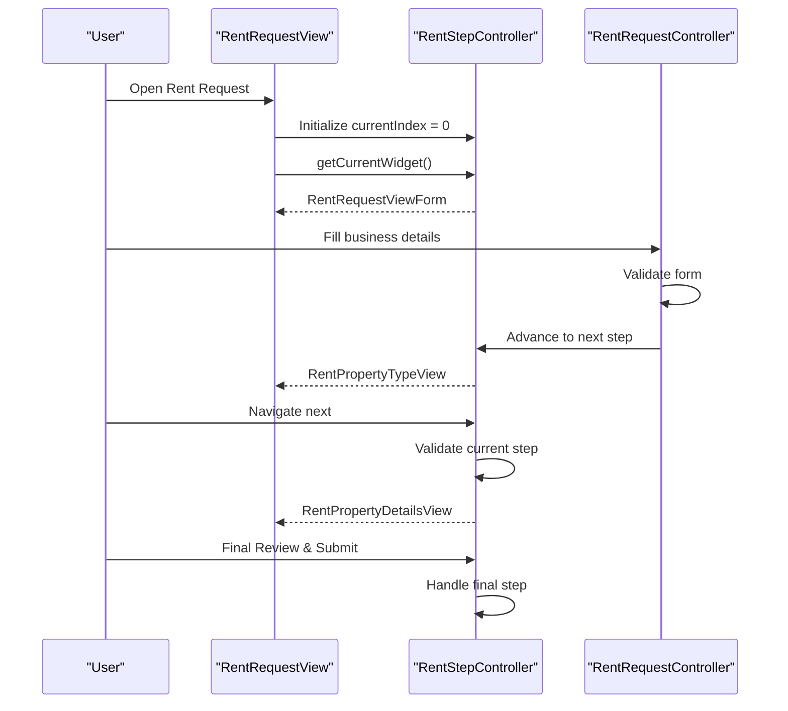
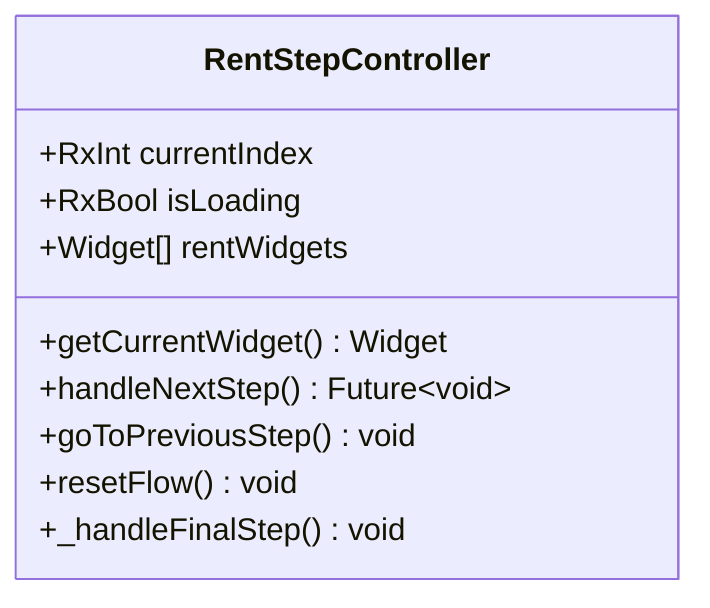
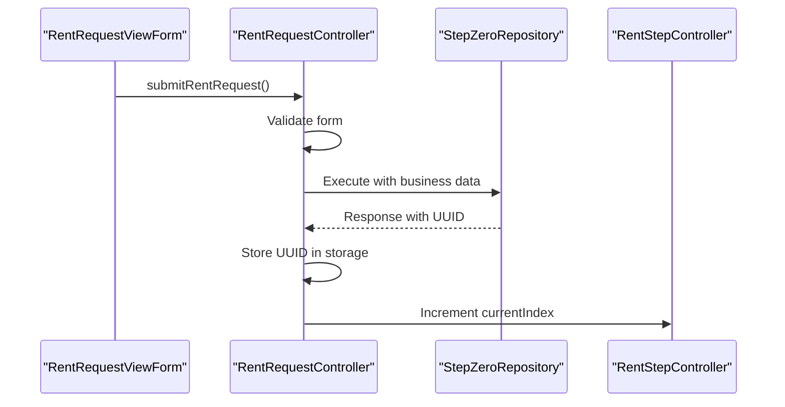
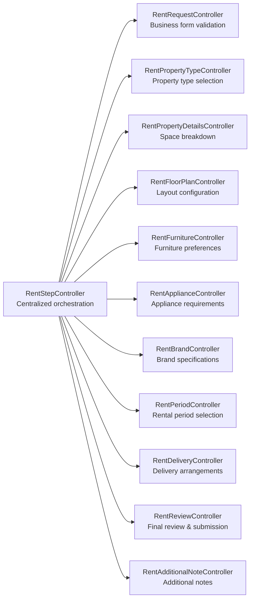

# Rent Furniture System

<cite>
**Referenced Files in This Document**
- [main.dart](file://lib/main.dart)
- [app_routes.dart](file://lib/core/routes/app_routes.dart)
- [rent_bindings.dart](file://lib/features/rent_request/bindings/rent_bindings.dart)
- [rent_step_controller.dart](file://lib/features/rent_request/controllers/rent_step_controller.dart)
- [rent_request_controller.dart](file://lib/features/rent_request/controllers/rent_request_controller.dart)
- [rent_request_view.dart](file://lib/features/rent_request/views/rent_request_view.dart)
- [rent_request_view_form.dart](file://lib/features/rent_request/widgets/rent_request_view_widgets/rent_request_view_form.dart)
- [rent_property_type_view.dart](file://lib/features/rent_request/views/rent_property_type_view.dart)
- [rent_property_details_view.dart](file://lib/features/rent_request/views/rent_property_details_view.dart)
- [email_validator.dart](file://lib/shared/extensions/validators/email_validator.dart)
- [name_validator.dart](file://lib/shared/extensions/validators/name_validator.dart)
- [phone_validator.dart](file://lib/shared/extensions/validators/phone_validator.dart)
- [rent_property_type_controller.dart](file://lib/features/rent_request/controllers/rent_property_type_controller.dart)
- [rent_property_details_controller.dart](file://lib/features/rent_request/controllers/rent_property_details_controller.dart)
- [rent_request_next.dart](file://lib/features/rent_request/widgets/rent_request_view_widgets/rent_request_next.dart)
</cite>

## Update Summary
**Changes Made**
- Updated controller architecture from monolithic RentRequestController to unified RentStepController with 10-step flow system
- Replaced specialized controllers approach with centralized step management and validation logic
- Enhanced navigation flow with improved step validation and loading states
- Updated all import paths to reflect new RentStepController implementation
- Streamlined controller dependencies with RentStepController as the primary orchestrator

## Table of Contents
1. [Introduction](#introduction)
2. [Project Structure](#project-structure)
3. [Core Components](#core-components)
4. [Architecture Overview](#architecture-overview)
5. [Detailed Component Analysis](#detailed-component-analysis)
6. [Enhanced Navigation and Visual Feedback](#enhanced-navigation-and-visual-feedback)
7. [Controller Architecture](#controller-architecture)
8. [Dependency Analysis](#dependency-analysis)
9. [Performance Considerations](#performance-considerations)
10. [Troubleshooting Guide](#troubleshooting-guide)
11. [Conclusion](#conclusion)

## Introduction
This document describes the Rent Furniture System, focusing on the end-to-end rent request workflow from property listing creation to tenant approval. The system has undergone a major architectural transformation from a monolithic controller approach to a unified RentStepController with comprehensive 10-step flow management. The system implements a modular, reactive, and extensible workflow for collecting tenant and property information with enhanced validation logic and step-by-step navigation.

## Project Structure
The Rent Furniture System features a streamlined architecture with RentStepController as the central orchestrator managing the complete 10-step workflow. The system maintains specialized controllers for domain-specific logic while centralizing navigation and validation through the RentStepController.

```mermaid
graph TB
subgraph "App Initialization"
MAIN["main.dart<br/>Initialize DI, theme, routes"]
ROUTES["app_routes.dart<br/>Define named routes"]
END
subgraph "Centralized Step Management"
STEP_CONTROLLER["RentStepController<br/>10-step flow orchestration"]
END
subgraph "Specialized Domain Controllers"
REQUEST_CONTROLLER["RentRequestController<br/>Business form & validation"]
PROPERTY_TYPE_CONTROLLER["RentPropertyTypeController<br/>Property type & use selection"]
PROPERTY_DETAILS_CONTROLLER["RentPropertyDetailsController<br/>Space breakdown & counts"]
FLOOR_PLAN_CONTROLLER["RentFloorPlanController<br/>Layout configuration"]
FURNITURE_CONTROLLER["RentFurnitureController<br/>Furniture preferences"]
APPLIANCE_CONTROLLER["RentApplianceController<br/>Appliance requirements"]
BRAND_CONTROLLER["RentBrandController<br/>Brand specifications"]
PERIOD_CONTROLLER["RentPeriodController<br/>Rental period selection"]
DELIVERY_CONTROLLER["RentDeliveryController<br/>Delivery arrangements"]
REVIEW_CONTROLLER["RentReviewController<br/>Final review & submission"]
ADDITIONAL_NOTE_CONTROLLER["RentAdditionalNoteController<br/>Additional notes"]
END
subgraph "View Components"
BINDINGS["rent_bindings.dart<br/>Lazy-load controllers"]
VIEW["RentRequestView<br/>UI container & navigation"]
FORM["RentRequestViewForm<br/>Business info form"]
PROPERTY_TYPE["RentPropertyTypeView<br/>Property type & use"]
PROPERTY_DETAILS["RentPropertyDetailsView<br/>Space breakdown & fields"]
NEXT_BUTTON["RentRequestNext<br/>Enhanced navigation"]
END
MAIN --> ROUTES
ROUTES --> BINDINGS
BINDINGS --> STEP_CONTROLLER
STEP_CONTROLLER --> REQUEST_CONTROLLER
STEP_CONTROLLER --> PROPERTY_TYPE_CONTROLLER
STEP_CONTROLLER --> PROPERTY_DETAILS_CONTROLLER
VIEW --> STEP_CONTROLLER
VIEW --> NEXT_BUTTON
VIEW --> FORM
VIEW --> PROPERTY_TYPE
VIEW --> PROPERTY_DETAILS
```

**Diagram sources**
- [main.dart:12-46](file://lib/main.dart#L12-L46)
- [app_routes.dart:1-34](file://lib/core/routes/app_routes.dart#L1-L34)
- [rent_bindings.dart:16-37](file://lib/features/rent_request/bindings/rent_bindings.dart#L16-L37)
- [rent_step_controller.dart:15-34](file://lib/features/rent_request/controllers/rent_step_controller.dart#L15-L34)
- [rent_request_controller.dart:9-21](file://lib/features/rent_request/controllers/rent_request_controller.dart#L9-L21)

**Section sources**
- [main.dart:12-46](file://lib/main.dart#L12-L46)
- [app_routes.dart:1-34](file://lib/core/routes/app_routes.dart#L1-L34)
- [rent_bindings.dart:16-37](file://lib/features/rent_request/bindings/rent_bindings.dart#L16-L37)

## Core Components
- **RentStepController**: Central orchestrator managing 10-step workflow with comprehensive validation logic, loading states, and step navigation. Handles step-specific validation and transitions between form widgets.
- **RentRequestController**: Specialized controller managing business form data, validation, and initial submission to Step Zero Repository. Coordinates with RentStepController for step advancement.
- **Enhanced Navigation Components**: RentRequestNext widget provides intelligent navigation with loading states and conditional rendering based on step position.
- **Streamlined View Architecture**: RentRequestView delegates step rendering to RentStepController, providing a clean separation of concerns.

**Section sources**
- [rent_step_controller.dart:15-96](file://lib/features/rent_request/controllers/rent_step_controller.dart#L15-L96)
- [rent_request_controller.dart:9-69](file://lib/features/rent_request/controllers/rent_request_controller.dart#L9-L69)
- [rent_request_next.dart:11-61](file://lib/features/rent_request/widgets/rent_request_view_widgets/rent_request_next.dart#L11-L61)

## Architecture Overview
The system now follows a centralized step management architecture with RentStepController as the primary orchestrator:
- **Centralized Flow Control**: RentStepController manages all 10 steps with dedicated validation logic for each step
- **Specialized Domain Logic**: Individual controllers handle domain-specific data and validation
- **Enhanced State Management**: Reactive variables for current step, loading states, and navigation control
- **Streamlined Dependencies**: RentRequestController focuses solely on form validation and initial submission



**Diagram sources**
- [rent_request_view.dart:20-41](file://lib/features/rent_request/views/rent_request_view.dart#L20-L41)
- [rent_step_controller.dart:36-73](file://lib/features/rent_request/controllers/rent_step_controller.dart#L36-L73)
- [rent_request_controller.dart:36-56](file://lib/features/rent_request/controllers/rent_request_controller.dart#L36-L56)

## Detailed Component Analysis

### RentStepController
**Updated** Complete architectural transformation from monolithic approach to centralized step management with comprehensive validation logic.

Responsibilities:
- Manages 10-step workflow with centralized validation and navigation logic
- Controls current step index with reactive state management
- Handles step-specific validation through switch statement
- Provides loading states and error handling for step transitions
- Coordinates with specialized controllers for domain-specific data

Navigation and state management:
- currentIndex drives step rendering from rentWidgets list
- isLoading reactive variable controls loading states during transitions
- totalSteps computed property provides step count for UI indicators
- Enhanced debugging with step transition logging



**Diagram sources**
- [rent_step_controller.dart:15-96](file://lib/features/rent_request/controllers/rent_step_controller.dart#L15-L96)

**Section sources**
- [rent_step_controller.dart:15-96](file://lib/features/rent_request/controllers/rent_step_controller.dart#L15-L96)

### RentRequestController
**Updated** Streamlined role focused on business form validation and initial submission coordination.

Responsibilities:
- Manages business identification form data with text editing controllers
- Validates form inputs using shared validators before submission
- Submits data to Step Zero Repository and handles response
- Coordinates step advancement after successful validation
- Initializes user profile data from ProfileController

Submission flow:
- Form validation using GlobalKey<FormState>
- Repository pattern for data submission
- Storage service integration for UUID persistence
- Seamless integration with RentStepController for navigation



**Diagram sources**
- [rent_request_controller.dart:36-56](file://lib/features/rent_request/controllers/rent_request_controller.dart#L36-L56)

**Section sources**
- [rent_request_controller.dart:9-69](file://lib/features/rent_request/controllers/rent_request_controller.dart#L9-L69)

### Enhanced Navigation Components
**Updated** RentRequestNext widget provides intelligent navigation with loading states and conditional rendering.

Features:
- Dynamic button rendering based on current step position
- Loading state management during step transitions
- Conditional submit button for final step
- Enhanced user feedback through visual indicators

Navigation logic:
- Last step shows submit button with dialog confirmation
- Loading state prevents double submissions
- Step-specific validation before navigation
- Smooth transitions between form widgets

**Section sources**
- [rent_request_next.dart:11-61](file://lib/features/rent_request/widgets/rent_request_view_widgets/rent_request_next.dart#L11-L61)

### RentRequestView
**Updated** Simplified view architecture delegating step management to RentStepController.

Responsibilities:
- Provides scrollable container for step-based navigation
- Delegates current step rendering to RentStepController
- Manages previous/next button visibility and styling
- Integrates with flow widgets for step indicators

View delegation:
- RentStepController manages step rendering and navigation
- Obx widgets for reactive step state updates
- Clean separation between presentation and logic
- Enhanced visual feedback through flow widgets

**Section sources**
- [rent_request_view.dart:16-79](file://lib/features/rent_request/views/rent_request_view.dart#L16-L79)

### RentRequestViewForm
**Updated** Enhanced form validation with improved error handling and user feedback.

Features:
- Comprehensive business identification form with validation
- Shared validators for name, email, and phone fields
- Responsive design with Flutter_ScreenUtil integration
- Custom form field widgets with consistent styling

Validation improvements:
- Auto-validation on user interaction
- Proper error message handling
- Form state management with GlobalKey
- Enhanced user experience through immediate feedback

**Section sources**
- [rent_request_view_form.dart:13-112](file://lib/features/rent_request/widgets/rent_request_view_widgets/rent_request_view_form.dart#L13-L112)

### Specialized Controllers
**Updated** Maintained for domain-specific logic while being coordinated by RentStepController.

Controllers maintain their specialized roles:
- **RentPropertyTypeController**: Manages property type and use selections
- **RentPropertyDetailsController**: Handles space breakdown and property details
- Other specialized controllers continue to manage their respective domains

Coordination mechanism:
- RentStepController references specialized controllers for data access
- Specialized controllers focus on domain-specific validation
- Centralized step management ensures proper workflow progression

**Section sources**
- [rent_property_type_controller.dart:3-16](file://lib/features/rent_request/controllers/rent_property_type_controller.dart#L3-L16)
- [rent_property_details_controller.dart:4-32](file://lib/features/rent_request/controllers/rent_property_details_controller.dart#L4-L32)

## Enhanced Navigation and Visual Feedback
**New Section** The Rent Furniture System now features sophisticated navigation and visual feedback mechanisms through the centralized RentStepController architecture.

### Intelligent Step Navigation
- **Dynamic Step Rendering**: RentStepController manages 10 distinct step widgets with proper lifecycle management
- **Conditional Navigation**: RentRequestNext widget adapts button appearance based on step position
- **Loading State Management**: Reactive loading indicators prevent concurrent step transitions
- **Enhanced Progress Tracking**: FlowStepCount and FlowPageCount provide real-time step information

### Visual Design Improvements
- **Consistent Styling**: SharedContainer widgets ensure uniform appearance across steps
- **Responsive Layout**: Flutter_ScreenUtil provides consistent sizing across devices
- **Custom Components**: Specialized widgets for property management, furniture selection, and period calculation
- **Accessibility Features**: Proper contrast ratios and touch target optimization

### User Experience Enhancements
- **Step Validation**: Each step validates input before allowing navigation forward
- **Error Handling**: Comprehensive error display with actionable feedback
- **Progress Indication**: Clear visual representation of form completion status
- **Smooth Transitions**: Animated step changes with proper timing and easing

## Controller Architecture
**Updated** Complete architectural transformation to centralized step management with RentStepController as the primary orchestrator.

### Centralized Step Management
- **RentStepController**: Primary orchestrator managing all 10 steps with dedicated validation logic
- **Specialized Controllers**: Secondary role handling domain-specific data and validation
- **Streamlined Dependencies**: Reduced complexity through centralized coordination
- **Enhanced Maintainability**: Single point of control for step transitions and validation

### Step-Based Architecture
- **Step 0**: Business form validation and initial submission
- **Step 1-9**: Progressive form completion with domain-specific controllers
- **Validation Logic**: Step-specific validation through switch statement
- **Loading States**: Reactive loading management for smooth transitions

### Controller Implementation Patterns
- **GetxController Base**: All controllers extend GetxController for reactive state management
- **Rx Observables**: Reactive variables for automatic UI updates
- **Central Coordination**: RentStepController coordinates between specialized controllers
- **Proper Lifecycle**: Enhanced lifecycle management with initialization and disposal

```mermaid
graph LR
subgraph "Centralized Architecture"
RentStepController["RentStepController<br/>10-step orchestration"]
subgraph "Domain Controllers"
RentRequestController["RentRequestController<br/>Business form validation"]
RentPropertyTypeController["RentPropertyTypeController<br/>Property type selection"]
RentPropertyDetailsController["RentPropertyDetailsController<br/>Space breakdown"]
RentFloorPlanController["RentFloorPlanController<br/>Layout configuration"]
RentFurnitureController["RentFurnitureController<br/>Furniture preferences"]
RentApplianceController["RentApplianceController<br/>Appliance requirements"]
RentBrandController["RentBrandController<br/>Brand specifications"]
RentPeriodController["RentPeriodController<br/>Rental period selection"]
RentDeliveryController["RentDeliveryController<br/>Delivery arrangements"]
RentReviewController["RentReviewController<br/>Final review & submission"]
RentAdditionalNoteController["RentAdditionalNoteController<br/>Additional notes"]
end
end
RentStepController --> RentRequestController
RentStepController --> RentPropertyTypeController
RentStepController --> RentPropertyDetailsController
RentStepController --> RentFloorPlanController
RentStepController --> RentFurnitureController
RentStepController --> RentApplianceController
RentStepController --> RentBrandController
RentStepController --> RentPeriodController
RentStepController --> RentDeliveryController
RentStepController --> RentReviewController
RentStepController --> RentAdditionalNoteController
```



**Diagram sources**
- [rent_step_controller.dart:15-34](file://lib/features/rent_request/controllers/rent_step_controller.dart#L15-L34)
- [rent_request_controller.dart:9-21](file://lib/features/rent_request/controllers/rent_request_controller.dart#L9-L21)

**Section sources**
- [rent_step_controller.dart:15-34](file://lib/features/rent_request/controllers/rent_step_controller.dart#L15-L34)
- [rent_request_controller.dart:9-21](file://lib/features/rent_request/controllers/rent_request_controller.dart#L9-L21)

## Dependency Analysis
**Updated** Enhanced dependency analysis reflecting the centralized RentStepController architecture.

The Rent Request feature now depends on:
- **Centralized Step Management**: RentStepController coordinates all specialized controllers
- **Enhanced Validation**: Step-specific validation logic integrated into RentStepController
- **Streamlined Dependencies**: Reduced coupling between controllers
- **Specialized Domain Logic**: Controllers maintain focus on their respective domains
- **Improved Performance**: Lazy loading through RentBindings with RentStepController as primary dependency



**Diagram sources**
- [rent_step_controller.dart:23-34](file://lib/features/rent_request/controllers/rent_step_controller.dart#L23-L34)
- [rent_bindings.dart:16-37](file://lib/features/rent_request/bindings/rent_bindings.dart#L16-L37)

**Section sources**
- [rent_step_controller.dart:23-34](file://lib/features/rent_request/controllers/rent_step_controller.dart#L23-L34)
- [rent_bindings.dart:16-37](file://lib/features/rent_request/bindings/rent_bindings.dart#L16-L37)

## Performance Considerations
**Updated** Enhanced performance considerations reflecting the centralized architecture benefits.

- **Centralized State Management**: RentStepController reduces memory overhead through single point of control
- **Optimized Step Transitions**: Reactive loading states prevent unnecessary widget rebuilds
- **Lazy Loading Benefits**: RentBindings efficiently manages controller instantiation
- **Reduced Coupling**: Specialized controllers operate independently with minimal interdependencies
- **Enhanced Navigation**: Direct widget rendering eliminates complex navigation logic
- **Improved Memory Usage**: Centralized step management reduces controller duplication
- **Streamlined Dependencies**: RentStepController coordinates dependencies more efficiently

## Troubleshooting Guide
**Updated** Enhanced troubleshooting guide addressing the new centralized architecture.

Common issues and resolutions:
- **Step navigation not working**: Verify RentStepController currentIndex updates and RentRequestNext widget logic
- **Form validation failing**: Check RentRequestController formKey validation and Step Zero Repository response handling
- **Loading states not updating**: Ensure RentStepController isLoading reactive variable is properly toggled
- **Step widgets not rendering**: Confirm RentStepController rentWidgets list contains all 10 step widgets
- **Controller initialization errors**: Verify RentBindings lazy loading and RentStepController dependency injection
- **Navigation state inconsistencies**: Check RentStepController step validation logic and special cases
- **Performance issues**: Monitor RentStepController widget rebuilds and optimize step-specific controllers

**Section sources**
- [rent_step_controller.dart:40-73](file://lib/features/rent_request/controllers/rent_step_controller.dart#L40-L73)
- [rent_request_controller.dart:36-56](file://lib/features/rent_request/controllers/rent_request_controller.dart#L36-L56)
- [rent_request_next.dart:16-58](file://lib/features/rent_request/widgets/rent_request_view_widgets/rent_request_next.dart#L16-L58)

## Conclusion
The Rent Furniture System has successfully transitioned to a centralized, reactive, and scalable architecture through the implementation of RentStepController as the primary orchestrator. The 10-step flow system provides comprehensive step-by-step navigation with integrated validation logic, while specialized controllers maintain domain-specific functionality. This architectural transformation enhances maintainability, improves user experience through intelligent navigation, and establishes a robust foundation for future enhancements including backend integration, tenant screening, and contract generation workflows.