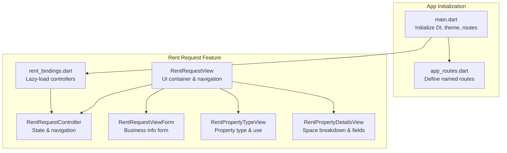
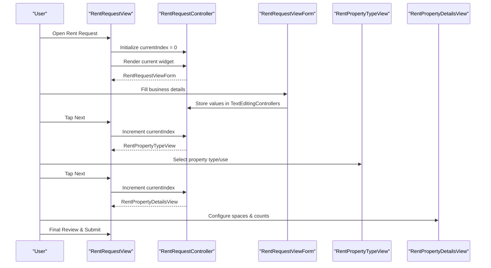
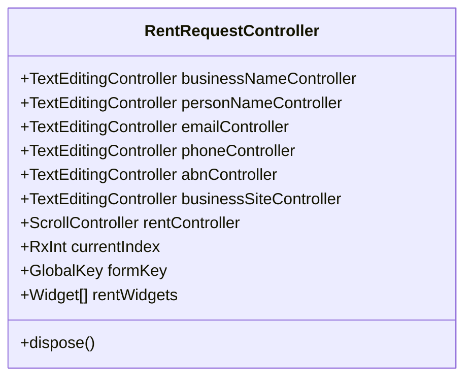
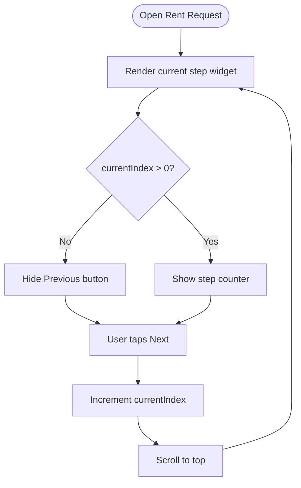
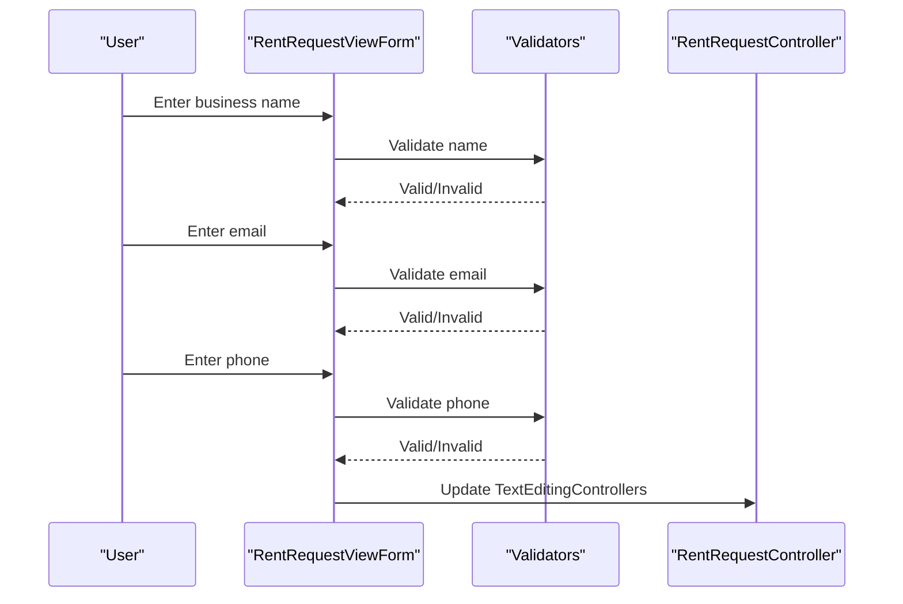
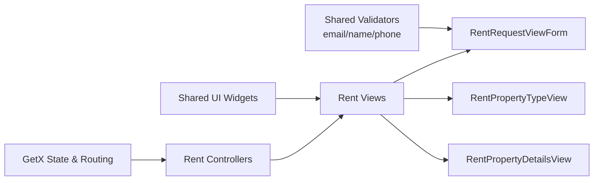

# Rent Furniture System

<cite>
**Referenced Files in This Document**
- [main.dart](file://lib/main.dart)
- [app_routes.dart](file://lib/core/routes/app_routes.dart)
- [rent_bindings.dart](file://lib/features/rent_request/bindings/rent_bindings.dart)
- [rent_request_controller.dart](file://lib/features/rent_request/controller/rent_request_controller.dart)
- [rent_request_view.dart](file://lib/features/rent_request/views/rent_request_view.dart)
- [rent_request_view_form.dart](file://lib/features/rent_request/widgets/rent_request_view_widgets/rent_request_view_form.dart)
- [rent_property_type_view.dart](file://lib/features/rent_request/views/rent_property_type_view.dart)
- [rent_property_details_view.dart](file://lib/features/rent_request/views/rent_property_details_view.dart)
- [email_validator.dart](file://lib/shared/extensions/validators/email_validator.dart)
- [name_validator.dart](file://lib/shared/extensions/validators/name_validator.dart)
- [phone_validator.dart](file://lib/shared/extensions/validators/phone_validator.dart)
</cite>

## Table of Contents
1. [Introduction](#introduction)
2. [Project Structure](#project-structure)
3. [Core Components](#core-components)
4. [Architecture Overview](#architecture-overview)
5. [Detailed Component Analysis](#detailed-component-analysis)
6. [Dependency Analysis](#dependency-analysis)
7. [Performance Considerations](#performance-considerations)
8. [Troubleshooting Guide](#troubleshooting-guide)
9. [Conclusion](#conclusion)

## Introduction
This document describes the Rent Furniture System, focusing on the end-to-end rent request workflow from property listing creation to tenant approval. It explains the multi-step form process, controller architecture, view components, navigation flow, widget libraries, and business logic for pricing and agreements. The system is built with Flutter and uses GetX for state management and routing.

## Project Structure
The Rent Furniture System resides under the features/rent_request module and integrates with the broader application via dependency injection and routing. The main application initializes theme, routing, and bindings, and delegates to feature-specific bindings for lazy loading controllers.

**Diagram sources**
- [main.dart:12-46](file://lib/main.dart#L12-L46)
- [app_routes.dart:1-34](file://lib/core/routes/app_routes.dart#L1-L34)
- [rent_bindings.dart:14-29](file://lib/features/rent_request/bindings/rent_bindings.dart#L14-L29)
- [rent_request_controller.dart:14-46](file://lib/features/rent_request/controller/rent_request_controller.dart#L14-L46)
- [rent_request_view.dart:15-78](file://lib/features/rent_request/views/rent_request_view.dart#L15-L78)
- [rent_request_view_form.dart:13-112](file://lib/features/rent_request/widgets/rent_request_view_widgets/rent_request_view_form.dart#L13-L112)
- [rent_property_type_view.dart:13-68](file://lib/features/rent_request/views/rent_property_type_view.dart#L13-L68)
- [rent_property_details_view.dart:15-81](file://lib/features/rent_request/views/rent_property_details_view.dart#L15-L81)

**Section sources**
- [main.dart:12-46](file://lib/main.dart#L12-L46)
- [app_routes.dart:1-34](file://lib/core/routes/app_routes.dart#L1-L34)
- [rent_bindings.dart:14-29](file://lib/features/rent_request/bindings/rent_bindings.dart#L14-L29)

## Core Components
- RentRequestController: Manages current step index, form keys, and the ordered list of form widgets. It holds text editing controllers for business and contact details and coordinates navigation.
- RentRequestView: Renders the current step widget, handles previous/next navigation, and displays step counters.
- RentRequestViewForm: Collects business identification details with validation.
- RentPropertyTypeView: Captures property type and use via dropdown menus.
- RentPropertyDetailsView: Handles property address fields and space breakdown with dynamic containers and counters.

**Section sources**
- [rent_request_controller.dart:14-46](file://lib/features/rent_request/controller/rent_request_controller.dart#L14-L46)
- [rent_request_view.dart:15-78](file://lib/features/rent_request/views/rent_request_view.dart#L15-L78)
- [rent_request_view_form.dart:13-112](file://lib/features/rent_request/widgets/rent_request_view_widgets/rent_request_view_form.dart#L13-L112)
- [rent_property_type_view.dart:13-68](file://lib/features/rent_request/views/rent_property_type_view.dart#L13-L68)
- [rent_property_details_view.dart:15-81](file://lib/features/rent_request/views/rent_property_details_view.dart#L15-L81)

## Architecture Overview
The system follows a layered architecture:
- Presentation Layer: Views render UI and delegate navigation to the controller.
- State Management: GetX controllers manage reactive state and navigation indices.
- Validation Layer: Shared validators enforce field rules for business details.
- Routing: Named routes define navigation targets; bindings lazy-inject controllers.

**Diagram sources**
- [rent_request_view.dart:19-78](file://lib/features/rent_request/views/rent_request_view.dart#L19-L78)
- [rent_request_controller.dart:24-35](file://lib/features/rent_request/controller/rent_request_controller.dart#L24-L35)
- [rent_request_view_form.dart:19-77](file://lib/features/rent_request/widgets/rent_request_view_widgets/rent_request_view_form.dart#L19-L77)
- [rent_property_type_view.dart:18-67](file://lib/features/rent_request/views/rent_property_type_view.dart#L18-L67)
- [rent_property_details_view.dart:21-81](file://lib/features/rent_request/views/rent_property_details_view.dart#L21-L81)

## Detailed Component Analysis

### RentRequestController
Responsibilities:
- Holds form keys and text editing controllers for business/contact details.
- Maintains currentIndex for step navigation.
- Defines the ordered list of form widgets representing the workflow.

Navigation and state:
- currentIndex drives which step is rendered.
- Disposes controllers on teardown.

**Diagram sources**
- [rent_request_controller.dart:14-46](file://lib/features/rent_request/controller/rent_request_controller.dart#L14-L46)

**Section sources**
- [rent_request_controller.dart:14-46](file://lib/features/rent_request/controller/rent_request_controller.dart#L14-L46)

### RentRequestView
Responsibilities:
- Provides a scrollable container for the form steps.
- Displays the current step via Obx reactivity.
- Implements Previous/Next controls and step counter.

Navigation logic:
- Previous button decrements index and scrolls to top.
- Next button advances to the next step.
- Step counter shows current and total pages.

**Diagram sources**
- [rent_request_view.dart:38-72](file://lib/features/rent_request/views/rent_request_view.dart#L38-L72)

**Section sources**
- [rent_request_view.dart:15-78](file://lib/features/rent_request/views/rent_request_view.dart#L15-L78)

### RentRequestViewForm
Responsibilities:
- Collects business identification details: business name, contact person, email, phone, ABN, and website/profile link.
- Applies validators for name, email, and phone fields.
- Uses a shared text form field widget with consistent styling.

Validation:
- Uses shared validators for name, email, and phone fields.
- Auto-validation on user interaction.

**Diagram sources**
- [rent_request_view_form.dart:31-61](file://lib/features/rent_request/widgets/rent_request_view_widgets/rent_request_view_form.dart#L31-L61)
- [email_validator.dart](file://lib/shared/extensions/validators/email_validator.dart)
- [name_validator.dart](file://lib/shared/extensions/validators/name_validator.dart)
- [phone_validator.dart](file://lib/shared/extensions/validators/phone_validator.dart)

**Section sources**
- [rent_request_view_form.dart:13-112](file://lib/features/rent_request/widgets/rent_request_view_widgets/rent_request_view_form.dart#L13-L112)

### RentPropertyTypeView
Responsibilities:
- Captures property type and property use via dropdown menus.
- Uses a page count indicator and divider for visual grouping.

Integration:
- Reads selected values via controller observables.
- Updates selectedPropertyType and selectedPropertyUse on selection.

**Section sources**
- [rent_property_type_view.dart:13-68](file://lib/features/rent_request/views/rent_property_type_view.dart#L13-L68)

### RentPropertyDetailsView
Responsibilities:
- Renders property details fields and a dynamic space breakdown section.
- Manages per-space counts and an "other" field controlled by a checkbox.
- Provides an add-space action.

Behavior:
- Uses PropertyDetailsContainer widgets to render each space with increment/decrement controls.
- Toggles enable/disable state of the "other" field based on checkbox.

**Section sources**
- [rent_property_details_view.dart:15-81](file://lib/features/rent_request/views/rent_property_details_view.dart#L15-L81)

### Navigation and Routing
- The Rent Request route is defined in AppRoutes.
- The RentBindings lazy-instantiates all feature controllers.
- The main app initializes DI and sets the initial route based on token presence.

**Section sources**
- [app_routes.dart:7](file://lib/core/routes/app_routes.dart#L7)
- [rent_bindings.dart:14-29](file://lib/features/rent_request/bindings/rent_bindings.dart#L14-L29)
- [main.dart:12-46](file://lib/main.dart#L12-L46)

## Dependency Analysis
The Rent Request feature depends on:
- Shared validators for form input correctness.
- Shared UI widgets for consistent styling and behavior.
- GetX for reactive state and navigation.
- Feature-specific controllers for each step.

**Diagram sources**
- [rent_request_view_form.dart:6-11](file://lib/features/rent_request/widgets/rent_request_view_widgets/rent_request_view_form.dart#L6-L11)
- [rent_property_type_view.dart:10](file://lib/features/rent_request/views/rent_property_type_view.dart#L10)
- [rent_property_details_view.dart:9](file://lib/features/rent_request/views/rent_property_details_view.dart#L9)

**Section sources**
- [rent_request_view_form.dart:6-11](file://lib/features/rent_request/widgets/rent_request_view_widgets/rent_request_view_form.dart#L6-L11)
- [rent_property_type_view.dart:10](file://lib/features/rent_request/views/rent_property_type_view.dart#L10)
- [rent_property_details_view.dart:9](file://lib/features/rent_request/views/rent_property_details_view.dart#L9)

## Performance Considerations
- Use lazy loading via Get.lazyPut to avoid initializing controllers until needed.
- Keep form keys scoped to each step to minimize rebuilds.
- Avoid unnecessary widget rebuilds by using Obx only around reactive reads.
- Consider virtualizing long lists if space breakdown grows large.

## Troubleshooting Guide
Common issues and resolutions:
- Navigation not advancing: Verify currentIndex increments after tapping Next and that the current step widget exists in the rentWidgets list.
- Form validation failures: Ensure validators are attached to the form and that AutovalidateMode is configured appropriately.
- State not updating: Confirm that controllers update Rx values and that views observe them via Obx.
- Route not found: Confirm the route name exists in AppRoutes and that the binding is registered.

**Section sources**
- [rent_request_controller.dart:24-35](file://lib/features/rent_request/controller/rent_request_controller.dart#L24-L35)
- [rent_request_view.dart:38-72](file://lib/features/rent_request/views/rent_request_view.dart#L38-L72)
- [app_routes.dart:7](file://lib/core/routes/app_routes.dart#L7)

## Conclusion
The Rent Furniture System implements a modular, reactive, and extensible workflow for collecting tenant and property information. The controller-centric design with step-based navigation, shared validators, and reusable UI widgets enables maintainable growth. Future enhancements can include backend integration for saving progress, tenant screening, and contract generation, aligning with the existing multi-step foundation.