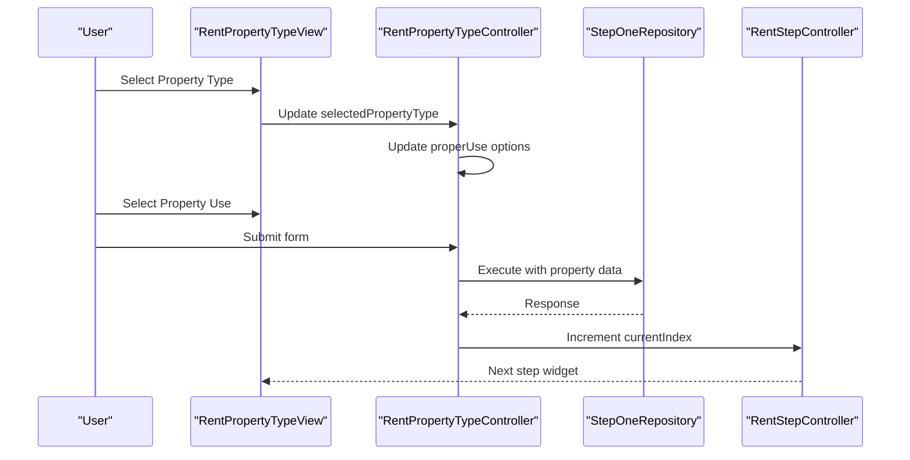
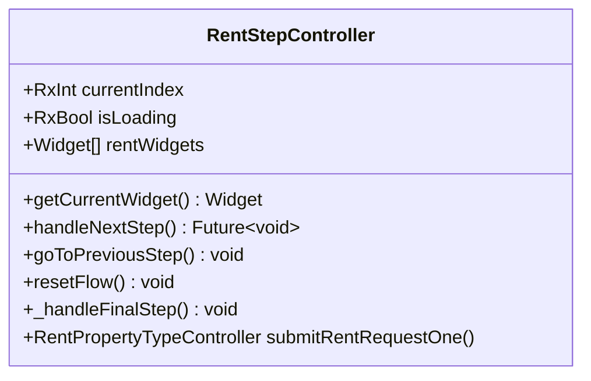
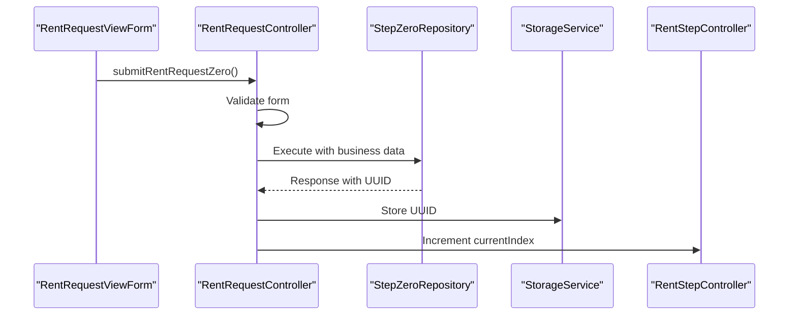
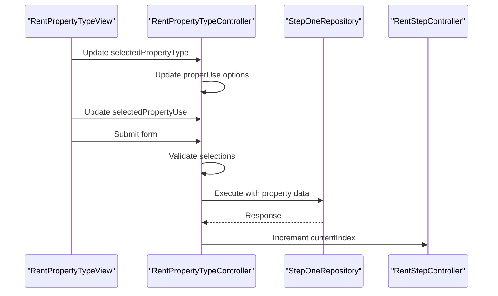
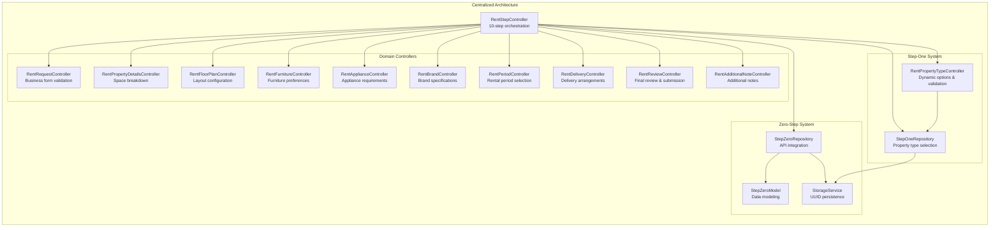
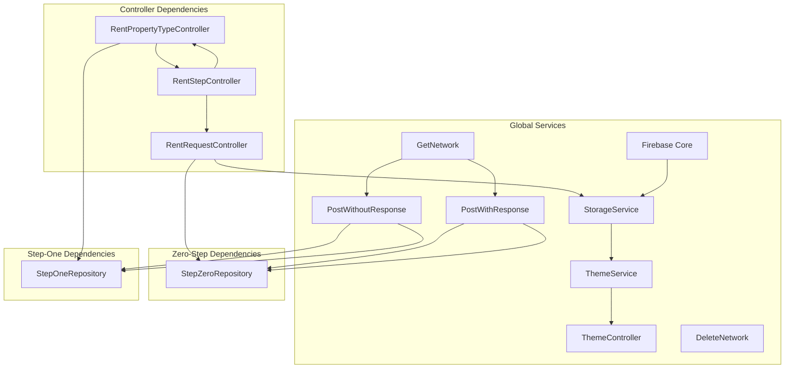

# Rent Furniture System

<cite>
**Referenced Files in This Document**
- [main.dart](file://lib/main.dart)
- [app_routes.dart](file://lib/core/routes/app_routes.dart)
- [dependency_injection.dart](file://lib/core/di/dependency_injection.dart)
- [rent_bindings.dart](file://lib/features/rent_request/bindings/rent_bindings.dart)
- [rent_step_controller.dart](file://lib/features/rent_request/controllers/rent_step_controller.dart)
- [rent_request_controller.dart](file://lib/features/rent_request/controllers/rent_request_controller.dart)
- [rent_property_type_controller.dart](file://lib/features/rent_request/controllers/rent_property_type_controller.dart)
- [step_zero_model.dart](file://lib/features/rent_request/models/step_zero_model.dart)
- [step_zero_repo.dart](file://lib/features/rent_request/repositories/step_zero_repo.dart)
- [step_one_repo.dart](file://lib/features/rent_request/repositories/step_one_repo.dart)
- [rent_request_view.dart](file://lib/features/rent_request/views/rent_request_view.dart)
- [rent_request_view_form.dart](file://lib/features/rent_request/widgets/rent_request_view_widgets/rent_request_view_form.dart)
- [rent_request_next.dart](file://lib/features/rent_request/widgets/rent_request_view_widgets/rent_request_next.dart)
- [rent_property_type_view.dart](file://lib/features/rent_request/views/rent_property_type_view.dart)
</cite>

## Update Summary
**Changes Made**
- Added new StepOneRepository for property type and use selection workflow
- Enhanced RentPropertyTypeController with comprehensive property type validation and dynamic property use options
- Improved dependency injection patterns with separate repositories for different HTTP operations
- Added reactive UI updates through Obx widgets for dynamic property use dropdown
- Integrated StepOneRepository into RentStepController for step 1 validation and navigation
- Enhanced property type selection workflow with commercial and residential use options

## Table of Contents
1. [Introduction](#introduction)
2. [Project Structure](#project-structure)
3. [Core Components](#core-components)
4. [Architecture Overview](#architecture-overview)
5. [Detailed Component Analysis](#detailed-component-analysis)
6. [Enhanced Navigation and Visual Feedback](#enhanced-navigation-and-visual-feedback)
7. [Controller Architecture](#controller-architecture)
8. [Dependency Injection Patterns](#dependency-injection-patterns)
9. [Step Zero System Implementation](#step-zero-system-implementation)
10. [Step One System Implementation](#step-one-system-implementation)
11. [Property Type Selection Workflow](#property-type-selection-workflow)
12. [Performance Considerations](#performance-considerations)
13. [Troubleshooting Guide](#troubleshooting-guide)
14. [Conclusion](#conclusion)

## Introduction
This document describes the Rent Furniture System, focusing on the end-to-end rent request workflow from property listing creation to tenant approval. The system has undergone a major architectural transformation with the addition of a comprehensive zero-step rental request system featuring StepZeroModel, StepZeroRepository, and enhanced dependency injection patterns. The system now implements a modular, reactive, and extensible workflow for collecting tenant and property information with centralized validation logic and step-by-step navigation. Recent enhancements include the introduction of StepOneRepository for property type selection and improved property type validation with dynamic use options.

## Project Structure
The Rent Furniture System features a streamlined architecture with RentStepController as the central orchestrator managing the complete 10-step workflow. The system maintains specialized controllers for domain-specific logic while centralizing navigation and validation through the RentStepController. A new zero-step system has been integrated for initial business identification and UUID generation, along with a new step-one system for property type selection.

```mermaid
graph TB
subgraph "Application Initialization"
MAIN["main.dart<br/>Initialize DI, theme, routes"]
DI["dependency_injection.dart<br/>Global service registration"]
ROUTES["app_routes.dart<br/>Define named routes"]
END
subgraph "Zero-Step System"
STEP_ZERO_MODEL["StepZeroModel<br/>Business info & UUID structure"]
STEP_ZERO_REPO["StepZeroRepository<br/>API integration & data handling"]
END
subgraph "Step-One System"
STEP_ONE_REPO["StepOneRepository<br/>Property type & use selection"]
PROPERTY_TYPE_CONTROLLER["RentPropertyTypeController<br/>Dynamic property options"]
END
subgraph "Centralized Step Management"
STEP_CONTROLLER["RentStepController<br/>10-step flow orchestration"]
END
subgraph "Specialized Domain Controllers"
REQUEST_CONTROLLER["RentRequestController<br/>Business form & validation"]
PROPERTY_DETAILS_CONTROLLER["RentPropertyDetailsController<br/>Space breakdown & counts"]
FLOOR_PLAN_CONTROLLER["RentFloorPlanController<br/>Layout configuration"]
FURNITURE_CONTROLLER["RentFurnitureController<br/>Furniture preferences"]
APPLIANCE_CONTROLLER["RentApplianceController<br/>Appliance requirements"]
BRAND_CONTROLLER["RentBrandController<br/>Brand specifications"]
PERIOD_CONTROLLER["RentPeriodController<br/>Rental period selection"]
DELIVERY_CONTROLLER["RentDeliveryController<br/>Delivery arrangements"]
REVIEW_CONTROLLER["RentReviewController<br/>Final review & submission"]
ADDITIONAL_NOTE_CONTROLLER["RentAdditionalNoteController<br/>Additional notes"]
END
subgraph "View Components"
BINDINGS["rent_bindings.dart<br/>Lazy-load controllers & repositories"]
VIEW["RentRequestView<br/>UI container & navigation"]
FORM["RentRequestViewForm<br/>Business info form"]
PROPERTY_TYPE_VIEW["RentPropertyTypeView<br/>Property type selection"]
NEXT_BUTTON["RentRequestNext<br/>Enhanced navigation"]
END
MAIN --> DI
DI --> BINDINGS
BINDINGS --> STEP_ZERO_REPO
BINDINGS --> STEP_ONE_REPO
BINDINGS --> STEP_CONTROLLER
STEP_CONTROLLER --> REQUEST_CONTROLLER
STEP_CONTROLLER --> PROPERTY_TYPE_CONTROLLER
STEP_CONTROLLER --> PROPERTY_DETAILS_CONTROLLER
VIEW --> STEP_CONTROLLER
VIEW --> NEXT_BUTTON
VIEW --> FORM
VIEW --> PROPERTY_TYPE_VIEW
```

**Diagram sources**
- [main.dart:12-46](file://lib/main.dart#L12-L46)
- [dependency_injection.dart:13-32](file://lib/core/di/dependency_injection.dart#L13-L32)
- [app_routes.dart:1-34](file://lib/core/routes/app_routes.dart#L1-L34)
- [rent_bindings.dart:16-37](file://lib/features/rent_request/bindings/rent_bindings.dart#L16-L37)
- [step_zero_model.dart:1-88](file://lib/features/rent_request/models/step_zero_model.dart#L1-L88)
- [step_zero_repo.dart:9-36](file://lib/features/rent_request/repositories/step_zero_repo.dart#L9-L36)
- [step_one_repo.dart:11-33](file://lib/features/rent_request/repositories/step_one_repo.dart#L11-L33)
- [rent_property_type_controller.dart:6-71](file://lib/features/rent_request/controllers/rent_property_type_controller.dart#L6-L71)

**Section sources**
- [main.dart:12-46](file://lib/main.dart#L12-L46)
- [dependency_injection.dart:13-32](file://lib/core/di/dependency_injection.dart#L13-L32)
- [app_routes.dart:1-34](file://lib/core/routes/app_routes.dart#L1-L34)
- [rent_bindings.dart:16-37](file://lib/features/rent_request/bindings/rent_bindings.dart#L16-L37)

## Core Components
- **RentStepController**: Central orchestrator managing 10-step workflow with comprehensive validation logic, loading states, and step navigation. Handles step-specific validation and transitions between form widgets, including integration with StepOneRepository for property type selection.
- **RentRequestController**: Specialized controller managing business form data, validation, and initial submission to Step Zero Repository. Coordinates with RentStepController for step advancement.
- **RentPropertyTypeController**: New controller managing property type and use selection with dynamic options based on property type. Handles validation and submission to StepOneRepository.
- **StepZeroModel**: Data model representing the zero-step rental request with business information, UUID, and status tracking.
- **StepZeroRepository**: Repository layer handling API communication for zero-step rental requests with error handling and response mapping.
- **StepOneRepository**: New repository layer handling property type and use selection data submission with comprehensive validation and error handling.
- **Enhanced Navigation Components**: RentRequestNext widget provides intelligent navigation with loading states and conditional rendering based on step position.
- **Streamlined View Architecture**: RentRequestView delegates step rendering to RentStepController, providing a clean separation of concerns.

**Section sources**
- [rent_step_controller.dart:15-96](file://lib/features/rent_request/controllers/rent_step_controller.dart#L15-L96)
- [rent_request_controller.dart:9-69](file://lib/features/rent_request/controllers/rent_request_controller.dart#L9-L69)
- [rent_property_type_controller.dart:6-71](file://lib/features/rent_request/controllers/rent_property_type_controller.dart#L6-L71)
- [step_zero_model.dart:1-88](file://lib/features/rent_request/models/step_zero_model.dart#L1-L88)
- [step_zero_repo.dart:9-36](file://lib/features/rent_request/repositories/step_zero_repo.dart#L9-L36)
- [step_one_repo.dart:11-33](file://lib/features/rent_request/repositories/step_one_repo.dart#L11-L33)
- [rent_request_next.dart:11-61](file://lib/features/rent_request/widgets/rent_request_view_widgets/rent_request_next.dart#L11-L61)

## Architecture Overview
The system now follows a centralized step management architecture with RentStepController as the primary orchestrator, enhanced by the zero-step and step-one rental request systems:
- **Centralized Flow Control**: RentStepController manages all 10 steps with dedicated validation logic for each step
- **Zero-Step Integration**: StepZeroRepository handles initial business identification and UUID generation
- **Step-One Integration**: StepOneRepository manages property type and use selection with dynamic options
- **Specialized Domain Logic**: Individual controllers handle domain-specific data and validation
- **Enhanced State Management**: Reactive variables for current step, loading states, and navigation control
- **Streamlined Dependencies**: RentRequestController and RentPropertyTypeController focus on form validation and submission coordination



**Diagram sources**
- [rent_property_type_view.dart:46-71](file://lib/features/rent_request/views/rent_property_type_view.dart#L46-L71)
- [rent_property_type_controller.dart:52-70](file://lib/features/rent_request/controllers/rent_property_type_controller.dart#L52-L70)
- [step_one_repo.dart:15-32](file://lib/features/rent_request/repositories/step_one_repo.dart#L15-L32)
- [rent_step_controller.dart:50-52](file://lib/features/rent_request/controllers/rent_step_controller.dart#L50-L52)

## Detailed Component Analysis

### RentStepController
**Updated** Complete architectural transformation from monolithic approach to centralized step management with comprehensive validation logic and enhanced integration with StepOneRepository.

Responsibilities:
- Manages 10-step workflow with centralized validation and navigation logic
- Controls current step index with reactive state management
- Handles step-specific validation through switch statement
- Provides loading states and error handling for step transitions
- Coordinates with specialized controllers for domain-specific data
- Integrates StepOneRepository for property type selection validation

Navigation and state management:
- currentIndex drives step rendering from rentWidgets list
- isLoading reactive variable controls loading states during transitions
- totalSteps computed property provides step count for UI indicators
- Enhanced debugging with step transition logging
- Step 1 validation through RentPropertyTypeController integration



**Diagram sources**
- [rent_step_controller.dart:15-96](file://lib/features/rent_request/controllers/rent_step_controller.dart#L15-L96)

**Section sources**
- [rent_step_controller.dart:15-96](file://lib/features/rent_request/controllers/rent_step_controller.dart#L15-L96)

### RentRequestController
**Updated** Streamlined role focused on business form validation and initial submission coordination with StepZeroRepository integration.

Responsibilities:
- Manages business identification form data with text editing controllers
- Validates form inputs using shared validators before submission
- Submits data to Step Zero Repository and handles response
- Coordinates step advancement after successful validation
- Initializes user profile data from ProfileController
- Stores UUID in storage service for session persistence

Submission flow:
- Form validation using GlobalKey<FormState>
- Repository pattern for data submission through StepZeroRepository
- Storage service integration for UUID persistence
- Seamless integration with RentStepController for navigation



**Diagram sources**
- [rent_request_controller.dart:36-56](file://lib/features/rent_request/controllers/rent_request_controller.dart#L36-L56)
- [step_zero_repo.dart:13-35](file://lib/features/rent_request/repositories/step_zero_repo.dart#L13-L35)

**Section sources**
- [rent_request_controller.dart:9-69](file://lib/features/rent_request/controllers/rent_request_controller.dart#L9-L69)

### RentPropertyTypeController
**New Section** Comprehensive controller for property type and use selection with dynamic options and validation.

Responsibilities:
- Manages property type selection with reactive state management
- Provides dynamic property use options based on property type
- Handles validation for both property type and use selection
- Submits data to StepOneRepository and handles response
- Coordinates step advancement after successful validation
- Integrates with RentStepController for navigation

Dynamic property options:
- **Residential Options**: Short-term Rental, Long-term Residential Leasing, Serviced Apartment, Staff Accommodation
- **Commercial Options**: Office, Retail Store, Cafe / Restaurant, Hotel / Serviced Apartments, Medical / Clinic, Showroom, Co-working Space
- **Reactive Selection**: Automatic property use option updates when property type changes
- **Default Values**: Initializes with Residential as default property type

Validation and submission:
- Form validation ensures both property type and use are selected
- Repository pattern for data submission through StepOneRepository
- Error handling through ErrorSnackbar integration
- Seamless integration with RentStepController for navigation



**Diagram sources**
- [rent_property_type_controller.dart:52-70](file://lib/features/rent_request/controllers/rent_property_type_controller.dart#L52-L70)
- [step_one_repo.dart:15-32](file://lib/features/rent_request/repositories/step_one_repo.dart#L15-L32)

**Section sources**
- [rent_property_type_controller.dart:6-71](file://lib/features/rent_request/controllers/rent_property_type_controller.dart#L6-L71)

### StepZeroModel
**Updated** Comprehensive data model for zero-step rental request system with business information and UUID management.

Structure:
- **StepZeroModel**: Main model containing UUID, user ID, business info, current step, rental status, timestamps, and ID
- **BusinessInfo**: Nested model for business identification details including name, contact person, email, phone, ABN, and website

Features:
- JSON serialization/deserialization support
- Nested object handling for business information
- Optional fields for flexible data handling
- Comprehensive data mapping for API responses

**Section sources**
- [step_zero_model.dart:1-88](file://lib/features/rent_request/models/step_zero_model.dart#L1-L88)

### StepZeroRepository
**Updated** Repository layer handling API communication for zero-step rental requests with comprehensive error handling.

Responsibilities:
- Handles HTTP POST requests for rental request creation
- Manages API headers and authentication
- Processes JSON responses and maps to StepZeroModel
- Provides error handling through Either type
- Implements repository pattern for data persistence

Integration:
- Uses PostWithResponse for HTTP communication
- Leverages HeadersManager for request configuration
- Implements FP Dart Either for error handling
- Returns typed responses for type safety

**Section sources**
- [step_zero_repo.dart:9-36](file://lib/features/rent_request/repositories/step_zero_repo.dart#L9-L36)

### StepOneRepository
**New Section** Repository layer handling property type and use selection data submission with comprehensive validation and error handling.

Responsibilities:
- Handles HTTP POST requests for property type and use selection
- Manages API headers and authentication for step 1 data
- Processes JSON responses and maps to boolean success/failure
- Provides error handling through Either type
- Implements repository pattern for data persistence
- Integrates with StorageService for UUID retrieval

Integration:
- Uses PostWithoutResponse for HTTP communication (no response body expected)
- Leverages HeadersManager for request configuration
- Implements FP Dart Either for error handling
- Retrieves UUID from StorageService for session continuity
- Returns typed responses for type safety

**Section sources**
- [step_one_repo.dart:11-33](file://lib/features/rent_request/repositories/step_one_repo.dart#L11-L33)

### Enhanced Navigation Components
**Updated** RentRequestNext widget provides intelligent navigation with loading states and conditional rendering.

Features:
- Dynamic button rendering based on current step position
- Loading state management during step transitions
- Conditional submit button for final step
- Enhanced user feedback through visual indicators

Navigation logic:
- Last step shows submit button with dialog confirmation
- Loading state prevents double submissions
- Step-specific validation before navigation
- Smooth transitions between form widgets

**Section sources**
- [rent_request_next.dart:11-61](file://lib/features/rent_request/widgets/rent_request_view_widgets/rent_request_next.dart#L11-L61)

### RentRequestView
**Updated** Simplified view architecture delegating step management to RentStepController.

Responsibilities:
- Provides scrollable container for step-based navigation
- Delegates current step rendering to RentStepController
- Manages previous/next button visibility and styling
- Integrates with flow widgets for step indicators

View delegation:
- RentStepController manages step rendering and navigation
- Obx widgets for reactive step state updates
- Clean separation between presentation and logic
- Enhanced visual feedback through flow widgets

**Section sources**
- [rent_request_view.dart:16-79](file://lib/features/rent_request/views/rent_request_view.dart#L16-L79)

### RentRequestViewForm
**Updated** Enhanced form validation with improved error handling and user feedback.

Features:
- Comprehensive business identification form with validation
- Shared validators for name, email, and phone fields
- Responsive design with Flutter_ScreenUtil integration
- Custom form field widgets with consistent styling

Validation improvements:
- Auto-validation on user interaction
- Proper error message handling
- Form state management with GlobalKey
- Enhanced user experience through immediate feedback

**Section sources**
- [rent_request_view_form.dart:13-112](file://lib/features/rent_request/widgets/rent_request_view_widgets/rent_request_view_form.dart#L13-L112)

### RentPropertyTypeView
**New Section** Enhanced property type selection view with dynamic dropdown options and reactive UI updates.

Features:
- Property type selection dropdown with predefined options
- Dynamic property use dropdown based on property type selection
- Reactive UI updates through Obx widgets
- Comprehensive form layout with proper spacing and styling
- Integration with RentPropertyTypeController for data binding

Dynamic options:
- Property type dropdown with Residential and Commercial options
- Property use dropdown updates automatically based on property type
- Default selection for property use based on property type
- Proper validation and error handling integration

**Section sources**
- [rent_property_type_view.dart:13-77](file://lib/features/rent_request/views/rent_property_type_view.dart#L13-L77)

## Enhanced Navigation and Visual Feedback
**Updated** The Rent Furniture System now features sophisticated navigation and visual feedback mechanisms through the centralized RentStepController architecture with enhanced property type selection workflow.

### Intelligent Step Navigation
- **Dynamic Step Rendering**: RentStepController manages 10 distinct step widgets with proper lifecycle management
- **Conditional Navigation**: RentRequestNext widget adapts button appearance based on step position
- **Loading State Management**: Reactive loading indicators prevent concurrent step transitions
- **Enhanced Progress Tracking**: FlowStepCount and FlowPageCount provide real-time step information
- **Property Type Validation**: Step-specific validation ensures proper property type and use selection

### Visual Design Improvements
- **Consistent Styling**: SharedContainer widgets ensure uniform appearance across steps
- **Responsive Layout**: Flutter_ScreenUtil provides consistent sizing across devices
- **Custom Components**: Specialized widgets for property management, furniture selection, and period calculation
- **Accessibility Features**: Proper contrast ratios and touch target optimization
- **Reactive UI Updates**: Obx widgets provide real-time updates for dynamic property use options

### User Experience Enhancements
- **Step Validation**: Each step validates input before allowing navigation forward
- **Error Handling**: Comprehensive error display with actionable feedback
- **Progress Indication**: Clear visual representation of form completion status
- **Smooth Transitions**: Animated step changes with proper timing and easing
- **Dynamic Property Options**: Automatic property use dropdown updates based on selection

## Controller Architecture
**Updated** Complete architectural transformation to centralized step management with RentStepController as the primary orchestrator, enhanced by zero-step and step-one system integrations.

### Centralized Step Management
- **RentStepController**: Primary orchestrator managing all 10 steps with dedicated validation logic
- **Specialized Controllers**: Secondary role handling domain-specific data and validation
- **Streamlined Dependencies**: Reduced complexity through centralized coordination
- **Enhanced Maintainability**: Single point of control for step transitions and validation
- **Step-One Integration**: RentPropertyTypeController coordinates with StepOneRepository for property type validation

### Zero-Step and Step-One Integration
- **StepZeroRepository**: Handles initial business identification and UUID generation
- **StepOneRepository**: Manages property type and use selection with dynamic options
- **StepZeroModel**: Manages business information and session data
- **Storage Integration**: UUID persistence for session continuity across steps
- **API Communication**: Centralized HTTP handling for rental requests

### Step-Based Architecture
- **Step 0**: Business form validation and initial submission via StepZeroRepository
- **Step 1**: Property type and use selection with dynamic options via StepOneRepository
- **Step 2-9**: Progressive form completion with domain-specific controllers
- **Validation Logic**: Step-specific validation through switch statement
- **Loading States**: Reactive loading management for smooth transitions

### Controller Implementation Patterns
- **GetxController Base**: All controllers extend GetxController for reactive state management
- **Rx Observables**: Reactive variables for automatic UI updates
- **Central Coordination**: RentStepController coordinates between specialized controllers
- **Proper Lifecycle**: Enhanced lifecycle management with initialization and disposal
- **Dependency Injection**: Proper service registration and resolution through GetX



**Diagram sources**
- [rent_step_controller.dart:15-34](file://lib/features/rent_request/controllers/rent_step_controller.dart#L15-L34)
- [rent_request_controller.dart:9-21](file://lib/features/rent_request/controllers/rent_request_controller.dart#L9-L21)
- [rent_property_type_controller.dart:6-8](file://lib/features/rent_request/controllers/rent_property_type_controller.dart#L6-L8)
- [step_zero_model.dart:1-88](file://lib/features/rent_request/models/step_zero_model.dart#L1-L88)
- [step_zero_repo.dart:9-36](file://lib/features/rent_request/repositories/step_zero_repo.dart#L9-L36)
- [step_one_repo.dart:11-13](file://lib/features/rent_request/repositories/step_one_repo.dart#L11-L13)

**Section sources**
- [rent_step_controller.dart:15-34](file://lib/features/rent_request/controllers/rent_step_controller.dart#L15-L34)
- [rent_request_controller.dart:9-21](file://lib/features/rent_request/controllers/rent_request_controller.dart#L9-L21)
- [rent_property_type_controller.dart:6-8](file://lib/features/rent_request/controllers/rent_property_type_controller.dart#L6-L8)
- [step_zero_model.dart:1-88](file://lib/features/rent_request/models/step_zero_model.dart#L1-L88)
- [step_zero_repo.dart:9-36](file://lib/features/rent_request/repositories/step_zero_repo.dart#L9-L36)
- [step_one_repo.dart:11-13](file://lib/features/rent_request/repositories/step_one_repo.dart#L11-L13)

## Dependency Injection Patterns
**Updated** Enhanced dependency injection patterns reflecting the centralized architecture with zero-step and step-one system integrations.

### Global Service Registration
- **DependencyInjection**: Centralized service registration for Firebase, storage, theme, and network services
- **Get.lazyPut**: Lazy loading for controllers and repositories with proper dependency resolution
- **Singleton Pattern**: Permanent service registration for global accessibility

### Zero-Step and Step-One System Dependencies
- **StepZeroRepository**: Requires PostWithResponse for HTTP communication
- **StepOneRepository**: Requires PostWithoutResponse for HTTP communication (no response body expected)
- **RentRequestController**: Depends on StepZeroRepository for business submission
- **RentPropertyTypeController**: Depends on StepOneRepository for property type submission
- **StorageService**: Integrated for UUID persistence and session management

### Controller Dependencies
- **RentRequestController**: Depends on StepZeroRepository and StorageService
- **RentPropertyTypeController**: Depends on StepOneRepository and RentStepController
- **RentStepController**: Coordinates all specialized controllers
- **Specialized Controllers**: Independent with minimal interdependencies



**Diagram sources**
- [dependency_injection.dart:13-32](file://lib/core/di/dependency_injection.dart#L13-L32)
- [rent_bindings.dart:16-37](file://lib/features/rent_request/bindings/rent_bindings.dart#L16-L37)
- [step_zero_repo.dart:10-11](file://lib/features/rent_request/repositories/step_zero_repo.dart#L10-L11)
- [step_one_repo.dart:10-11](file://lib/features/rent_request/repositories/step_one_repo.dart#L10-L11)

**Section sources**
- [dependency_injection.dart:13-32](file://lib/core/di/dependency_injection.dart#L13-L32)
- [rent_bindings.dart:16-37](file://lib/features/rent_request/bindings/rent_bindings.dart#L16-L37)
- [step_zero_repo.dart:10-11](file://lib/features/rent_request/repositories/step_zero_repo.dart#L10-L11)
- [step_one_repo.dart:10-11](file://lib/features/rent_request/repositories/step_one_repo.dart#L10-L11)

## Step Zero System Implementation
**Updated** Comprehensive implementation of the zero-step rental request system with business identification and UUID management, integrated with the enhanced dependency injection patterns.

### Zero-Step Workflow
- **Business Identification**: Initial form collection with business name, contact person, email, phone, ABN, and website
- **Validation Layer**: Shared validators ensure data integrity before submission
- **API Integration**: StepZeroRepository handles HTTP communication and response processing
- **Session Management**: UUID stored in StorageService for continuous session tracking

### Data Flow Architecture
- **Form Input**: RentRequestViewForm captures business information
- **Validation**: FormState validation ensures required fields are present
- **Repository Call**: StepZeroRepository executes HTTP POST request
- **Response Handling**: Either type handles success/error scenarios
- **State Update**: UUID stored and step counter incremented

### Error Handling Strategy
- **Type Safety**: FP Dart Either pattern for predictable error handling
- **Error Models**: Standardized error response structure
- **User Feedback**: ErrorSnackbar provides immediate user notification
- **Fallback Logic**: Graceful degradation on API failures

### Storage Integration
- **UUID Persistence**: Unique identifier stored for session continuity
- **Local Storage**: GetStorage service handles persistent data
- **Session Continuity**: UUID retrieval enables multi-step session management
- **Data Integrity**: Proper cleanup and validation of stored data

**Section sources**
- [rent_request_controller.dart:36-56](file://lib/features/rent_request/controllers/rent_request_controller.dart#L36-L56)
- [step_zero_model.dart:1-88](file://lib/features/rent_request/models/step_zero_model.dart#L1-L88)
- [step_zero_repo.dart:13-35](file://lib/features/rent_request/repositories/step_zero_repo.dart#L13-L35)

## Step One System Implementation
**New Section** Comprehensive implementation of the step-one rental request system for property type and use selection with dynamic options and validation.

### Step-One Workflow
- **Property Type Selection**: Dropdown selection between Residential and Commercial property types
- **Dynamic Property Use Options**: Automatic dropdown population based on property type selection
- **Validation Layer**: Ensures both property type and use are selected before submission
- **API Integration**: StepOneRepository handles HTTP communication for property data
- **Session Continuity**: Integrates with existing UUID from StepZeroRepository

### Dynamic Property Options
- **Residential Property Types**: Short-term Rental, Long-term Residential Leasing, Serviced Apartment, Staff Accommodation
- **Commercial Property Types**: Office, Retail Store, Cafe / Restaurant, Hotel / Serviced Apartments, Medical / Clinic, Showroom, Co-working Space
- **Automatic Updates**: Property use dropdown updates when property type changes
- **Default Selection**: Property use defaults to first option when property type changes

### Data Flow Architecture
- **User Selection**: RentPropertyTypeView captures property type and use selections
- **Validation**: PropertyTypeController ensures both selections are made
- **Repository Call**: StepOneRepository executes HTTP POST request with property data
- **Response Handling**: Either type handles success/error scenarios
- **State Update**: Step counter increments for next step navigation

### Error Handling Strategy
- **Type Safety**: FP Dart Either pattern for predictable error handling
- **Error Models**: Standardized error response structure
- **User Feedback**: ErrorSnackbar provides immediate user notification
- **Fallback Logic**: Graceful degradation on API failures

### Reactive UI Updates
- **Obx Widgets**: Automatic UI updates when property type changes
- **ever Function**: Watches property type changes and updates property use options
- **Default Values**: Automatic property use selection based on property type
- **Real-time Feedback**: Immediate visual updates for user selections

**Section sources**
- [rent_property_type_controller.dart:29-50](file://lib/features/rent_request/controllers/rent_property_type_controller.dart#L29-L50)
- [step_one_repo.dart:15-32](file://lib/features/rent_request/repositories/step_one_repo.dart#L15-L32)

## Property Type Selection Workflow
**New Section** Detailed analysis of the property type selection workflow with dynamic options, validation, and reactive UI updates.

### Property Type Selection Process
- **Initial State**: Property type defaults to Residential with property use set to first residential option
- **Type Change Detection**: ever function monitors property type changes
- **Option Update**: Property use dropdown automatically updates with appropriate options
- **Selection Persistence**: Property use defaults to first available option when type changes

### Dynamic Option Generation
- **Residential Options**: Generated from residentialUseOptions list
- **Commercial Options**: Generated from commercialUseOptions list
- **Conditional Rendering**: Obx widget renders appropriate dropdown based on property type
- **Empty State Handling**: Selected property use cleared when no options are available

### Validation and Submission
- **Form Validation**: Both property type and use must be selected
- **Error Handling**: ErrorSnackbar displays validation errors
- **Repository Integration**: StepOneRepository handles data submission
- **Navigation Control**: Successful submission increments step counter

### UI Enhancement Features
- **Responsive Design**: Flutter_ScreenUtil ensures consistent sizing
- **Visual Feedback**: Custom dropdown menus with proper styling
- **Accessibility**: Clear labels and proper contrast ratios
- **User Experience**: Smooth transitions and immediate feedback

**Section sources**
- [rent_property_type_controller.dart:36-50](file://lib/features/rent_request/controllers/rent_property_type_controller.dart#L36-L50)
- [rent_property_type_view.dart:46-71](file://lib/features/rent_request/views/rent_property_type_view.dart#L46-L71)

## Performance Considerations
**Updated** Enhanced performance considerations reflecting the centralized architecture benefits and dual-step system integration.

- **Centralized State Management**: RentStepController reduces memory overhead through single point of control
- **Optimized Step Transitions**: Reactive loading states prevent unnecessary widget rebuilds
- **Lazy Loading Benefits**: RentBindings efficiently manages controller instantiation
- **Reduced Coupling**: Specialized controllers operate independently with minimal interdependencies
- **Zero-Step Optimization**: StepZeroRepository minimizes API calls through efficient data handling
- **Step-One Optimization**: StepOneRepository uses PostWithoutResponse for lightweight operations
- **Storage Efficiency**: UUID caching reduces server round trips for session continuation
- **Enhanced Navigation**: Direct widget rendering eliminates complex navigation logic
- **Improved Memory Usage**: Centralized step management reduces controller duplication
- **Streamlined Dependencies**: RentStepController coordinates dependencies more efficiently
- **Reactive UI Updates**: Obx widgets optimize rendering through selective updates

## Troubleshooting Guide
**Updated** Enhanced troubleshooting guide addressing the new centralized architecture, zero-step and step-one systems.

Common issues and resolutions:
- **Step navigation not working**: Verify RentStepController currentIndex updates and RentRequestNext widget logic
- **Form validation failing**: Check RentRequestController formKey validation and Step Zero Repository response handling
- **Loading states not updating**: Ensure RentStepController isLoading reactive variable is properly toggled
- **Step widgets not rendering**: Confirm RentStepController rentWidgets list contains all 10 step widgets
- **Controller initialization errors**: Verify RentBindings lazy loading and RentStepController dependency injection
- **Navigation state inconsistencies**: Check RentStepController step validation logic and special cases
- **Zero-step submission failures**: Verify StepZeroRepository API endpoint and authentication headers
- **UUID persistence issues**: Check StorageService integration and UUID retrieval from storage
- **Step-one submission failures**: Verify StepOneRepository API endpoint and property data validation
- **Property type selection issues**: Check RentPropertyTypeController reactive variable updates and dropdown options
- **Dynamic option problems**: Verify ever function triggers and proper property use option updates
- **Dependency injection problems**: Ensure PostWithResponse and PostWithoutResponse services are properly registered
- **Error handling not working**: Verify Either type usage and ErrorSnackbar integration
- **Reactive UI not updating**: Check Obx widget usage and proper reactive variable declarations

**Section sources**
- [rent_step_controller.dart:40-73](file://lib/features/rent_request/controllers/rent_step_controller.dart#L40-L73)
- [rent_request_controller.dart:36-56](file://lib/features/rent_request/controllers/rent_request_controller.dart#L36-L56)
- [rent_property_type_controller.dart:52-70](file://lib/features/rent_request/controllers/rent_property_type_controller.dart#L52-L70)
- [rent_request_next.dart:16-58](file://lib/features/rent_request/widgets/rent_request_view_widgets/rent_request_next.dart#L16-L58)
- [step_zero_repo.dart:13-35](file://lib/features/rent_request/repositories/step_zero_repo.dart#L13-L35)
- [step_one_repo.dart:15-32](file://lib/features/rent_request/repositories/step_one_repo.dart#L15-L32)

## Conclusion
The Rent Furniture System has successfully transitioned to a centralized, reactive, and scalable architecture through the implementation of RentStepController as the primary orchestrator, enhanced by comprehensive zero-step and step-one rental request systems. The integration of StepZeroModel, StepZeroRepository, and the new StepOneRepository provides robust business identification, property type selection, and session management capabilities, while the enhanced dependency injection patterns ensure proper service coordination. The 10-step flow system provides comprehensive step-by-step navigation with integrated validation logic, while specialized controllers maintain domain-specific functionality. The new property type selection workflow with dynamic options and reactive UI updates significantly enhances user experience. This architectural transformation enhances maintainability, improves user experience through intelligent navigation, and establishes a robust foundation for future enhancements including backend integration, tenant screening, and contract generation workflows.