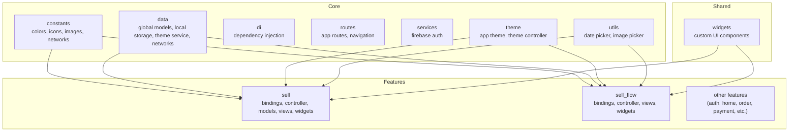
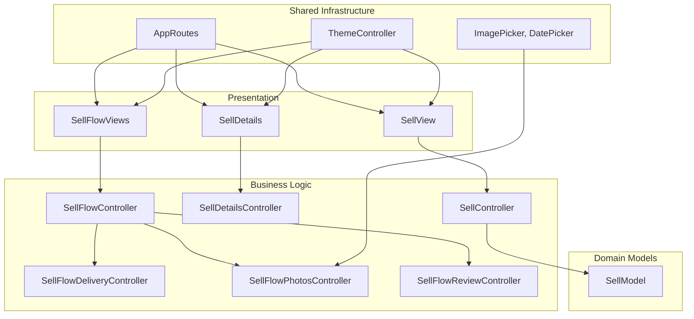
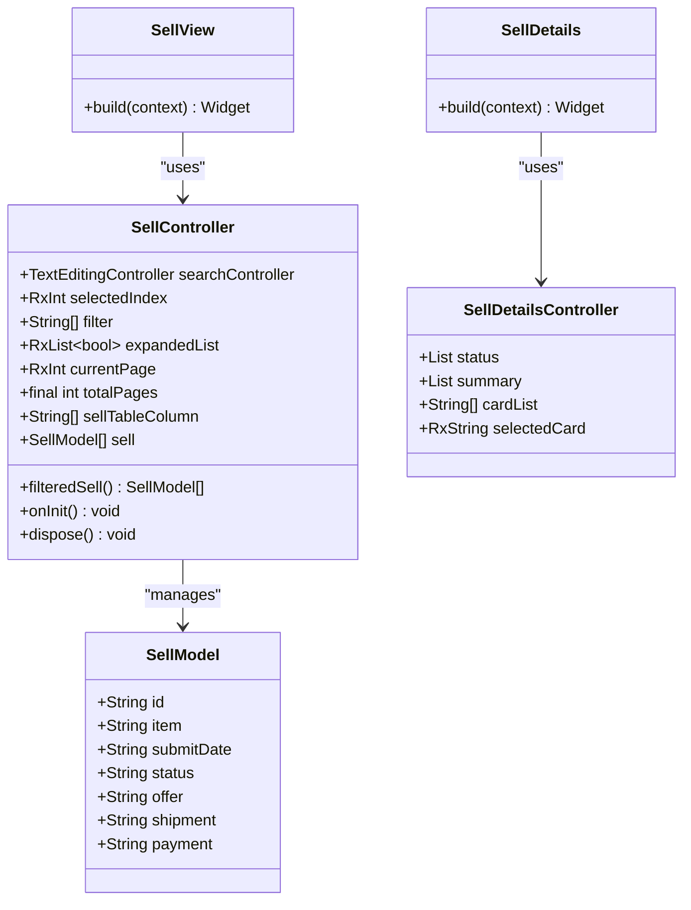
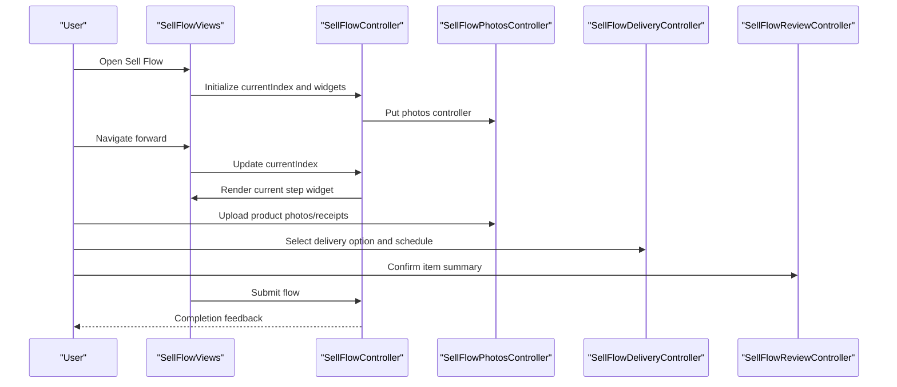
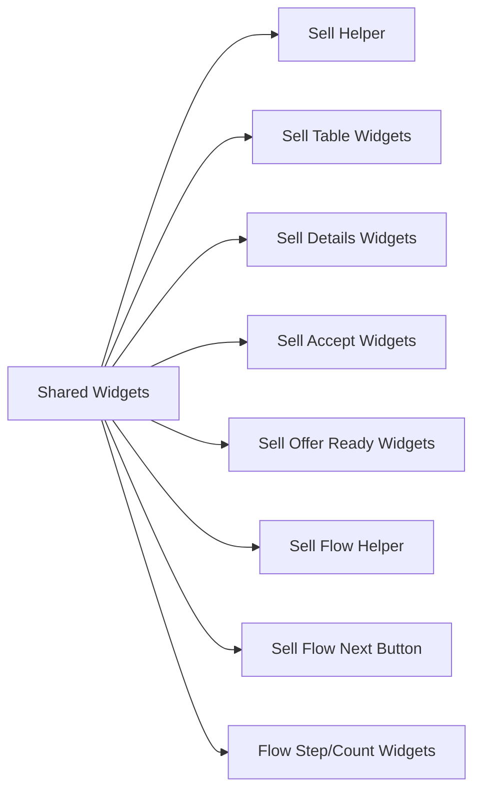
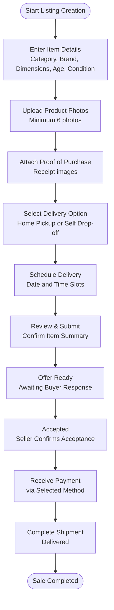

# Sell Furniture System

<cite>
**Referenced Files in This Document**
- [pubspec.yaml](file://pubspec.yaml)
- [README.md](file://README.md)
- [lib/main.dart](file://lib/main.dart)
- [lib/core/constant/colors.dart](file://lib/core/constant/colors.dart)
- [lib/core/constant/icons_path.dart](file://lib/core/constant/icons_path.dart)
- [lib/core/data/global_models/error_model.dart](file://lib/core/data/global_models/error_model.dart)
- [lib/core/data/local/storage_service.dart](file://lib/core/data/local/storage_service.dart)
- [lib/core/data/local/theme_service.dart](file://lib/core/data/local/theme_service.dart)
- [lib/core/data/networks/get_network.dart](file://lib/core/data/networks/get_network.dart)
- [lib/core/data/networks/post_with_response.dart](file://lib/core/data/networks/post_with_response.dart)
- [lib/core/data/networks/post_without_response.dart](file://lib/core/data/networks/post_without_response.dart)
- [lib/core/di/dependency_injection.dart](file://lib/core/di/dependency_injection.dart)
- [lib/core/routes/app_routes.dart](file://lib/core/routes/app_routes.dart)
- [lib/core/routes/routes.dart](file://lib/core/routes/routes.dart)
- [lib/core/services/firebase_google_auth.dart](file://lib/core/services/firebase_google_auth.dart)
- [lib/core/theme/app_theme.dart](file://lib/core/theme/app_theme.dart)
- [lib/core/theme/theme_controller.dart](file://lib/core/theme/theme_controller.dart)
- [lib/core/utils/date_picker.dart](file://lib/core/utils/date_picker.dart)
- [lib/core/utils/image_picker.dart](file://lib/core/utils/image_picker.dart)
- [lib/features/sell/bindings/sell_bindings.dart](file://lib/features/sell/bindings/sell_bindings.dart)
- [lib/features/sell/controller/sell_controller.dart](file://lib/features/sell/controller/sell_controller.dart)
- [lib/features/sell/controller/sell_details_controller.dart](file://lib/features/sell/controller/sell_details_controller.dart)
- [lib/features/sell/models/sell_model.dart](file://lib/features/sell/models/sell_model.dart)
- [lib/features/sell/views/sell_view.dart](file://lib/features/sell/views/sell_view.dart)
- [lib/features/sell/views/sell_details.dart](file://lib/features/sell/views/sell_details.dart)
- [lib/features/sell/widgets/sell_helper.dart](file://lib/features/sell/widgets/sell_helper.dart)
- [lib/features/sell/widgets/sell_view_widgets/sell_view_table.dart](file://lib/features/sell/widgets/sell_view_widgets/sell_view_table.dart)
- [lib/features/sell/widgets/sell_view_widgets/sell_view_table_filter.dart](file://lib/features/sell/widgets/sell_view_widgets/sell_view_table_filter.dart)
- [lib/features/sell/widgets/sell_view_widgets/sell_table_expanded.dart](file://lib/features/sell/widgets/sell_view_widgets/sell_table_expanded.dart)
- [lib/features/sell/widgets/sell_details_widgets/sell_details_status.dart](file://lib/features/sell/widgets/sell_details_widgets/sell_details_status.dart)
- [lib/features/sell/widgets/sell_details_widgets/sell_details_summery.dart](file://lib/features/sell/widgets/sell_details_widgets/sell_details_summery.dart)
- [lib/features/sell/widgets/sell_accept_widgets/sell_accept.dart](file://lib/features/sell/widgets/sell_accept_widgets/sell_accept.dart)
- [lib/features/sell/widgets/sell_accept_widgets/sell_pending_payment.dart](file://lib/features/sell/widgets/sell_accept_widgets/sell_pending_payment.dart)
- [lib/features/sell/widgets/sell_accept_widgets/sell_recive_payment.dart](file://lib/features/sell/widgets/sell_accept_widgets/sell_recive_payment.dart)
- [lib/features/sell/widgets/sell_offer_ready_widgets/sell_offer_ready.dart](file://lib/features/sell/widgets/sell_offer_ready_widgets/sell_offer_ready.dart)
- [lib/features/sell_flow/bindings/sell_flow_bindings.dart](file://lib/features/sell_flow/bindings/sell_flow_bindings.dart)
- [lib/features/sell_flow/controller/sell_flow_controller.dart](file://lib/features/sell_flow/controller/sell_flow_controller.dart)
- [lib/features/sell_flow/controller/sell_flow_delivery_controller.dart](file://lib/features/sell_flow/controller/sell_flow_delivery_controller.dart)
- [lib/features/sell_flow/controller/sell_flow_photos_controller.dart](file://lib/features/sell_flow/controller/sell_flow_photos_controller.dart)
- [lib/features/sell_flow/controller/sell_flow_review_controller.dart](file://lib/features/sell_flow/controller/sell_flow_review_controller.dart)
- [lib/features/sell_flow/views/sell_flow_views.dart](file://lib/features/sell_flow/views/sell_flow_views.dart)
- [lib/features/sell_flow/views/sell_flow_delivery_detail.dart](file://lib/features/sell_flow/views/sell_flow_delivery_detail.dart)
- [lib/features/sell_flow/views/sell_flow_photos.dart](file://lib/features/sell_flow/views/sell_flow_photos.dart)
- [lib/features/sell_flow/views/sell_flow_review.dart](file://lib/features/sell_flow/views/sell_flow_review.dart)
- [lib/features/sell_flow/widgets/sell_flow_helper.dart](file://lib/features/sell_flow/widgets/sell_flow_helper.dart)
- [lib/features/sell_flow/widgets/sell_flow_view_widgets/sell_flow_view_details.dart](file://lib/features/sell_flow/widgets/sell_flow_view_widgets/sell_flow_view_details.dart)
- [lib/features/sell_flow/widgets/sell_flow_view_widgets/sell_flow_view_details_fields.dart](file://lib/features/sell_flow/widgets/sell_flow_view_widgets/sell_flow_view_details_fields.dart)
- [lib/features/sell_flow/widgets/sell_flow_view_widgets/sell_flow_view_dropdown.dart](file://lib/features/sell_flow/widgets/sell_flow_view_widgets/sell_flow_view_dropdown.dart)
- [lib/features/sell_flow/widgets/sell_flow_view_widgets/sell_flow_next.dart](file://lib/features/sell_flow/widgets/sell_flow_view_widgets/sell_flow_next.dart)
- [lib/features/sell_flow/widgets/sell_flow_delivery_detail_widgets/sell_flow_delivery_option.dart](file://lib/features/sell_flow/widgets/sell_flow_delivery_detail_widgets/sell_flow_delivery_option.dart)
- [lib/features/sell_flow/widgets/sell_flow_delivery_detail_widgets/sell_flow_delivery_home_pick.dart](file://lib/features/sell_flow/widgets/sell_flow_delivery_detail_widgets/sell_flow_delivery_home_pick.dart)
- [lib/features/sell_flow/widgets/sell_flow_delivery_detail_widgets/sell_flow_delivery_self_drop.dart](file://lib/features/sell_flow/widgets/sell_flow_delivery_detail_widgets/sell_flow_delivery_self_drop.dart)
- [lib/features/sell_flow/widgets/sell_flow_delivery_detail_widgets/home_pick_address.dart](file://lib/features/sell_flow/widgets/sell_flow_delivery_detail_widgets/home_pick_address.dart)
- [lib/features/sell_flow/widgets/sell_flow_delivery_detail_widgets/home_pick_delivery_date.dart](file://lib/features/sell_flow/widgets/sell_flow_delivery_detail_widgets/home_pick_delivery_date.dart)
- [lib/features/sell_flow/widgets/sell_flow_delivery_detail_widgets/home_pick_delivery_time.dart](file://lib/features/sell_flow/widgets/sell_flow_delivery_detail_widgets/home_pick_delivery_time.dart)
- [lib/features/sell_flow/widgets/sell_flow_delivery_detail_widgets/self_drop_location.dart](file://lib/features/sell_flow/widgets/sell_flow_delivery_detail_widgets/self_drop_location.dart)
- [lib/features/sell_flow/widgets/sell_flow_delivery_detail_widgets/self_drop_schedule.dart](file://lib/features/sell_flow/widgets/sell_flow_delivery_detail_widgets/self_drop_schedule.dart)
- [lib/features/sell_flow/widgets/sell_flow_delivery_detail_widgets/self_drop_schedule_date.dart](file://lib/features/sell_flow/widgets/sell_flow_delivery_detail_widgets/self_drop_schedule_date.dart)
- [lib/features/sell_flow/widgets/sell_photos_widgets/sell_flow_photo_upload.dart](file://lib/features/sell_flow/widgets/sell_photos_widgets/sell_flow_photo_upload.dart)
- [lib/features/sell_flow/widgets/sell_photos_widgets/sell_flow_photo_add_more.dart](file://lib/features/sell_flow/widgets/sell_photos_widgets/sell_flow_photo_add_more.dart)
- [lib/features/sell_flow/widgets/sell_photos_widgets/proof_of_purchase.dart](file://lib/features/sell_flow/widgets/sell_photos_widgets/proof_of_purchase.dart)
- [lib/features/sell_flow/widgets/sell_photos_widgets/proof_of_purchase_field.dart](file://lib/features/sell_flow/widgets/sell_photos_widgets/proof_of_purchase_field.dart)
- [lib/features/sell_flow/widgets/sell_photos_widgets/proof_of_purchase_header.dart](file://lib/features/sell_flow/widgets/sell_photos_widgets/proof_of_purchase_header.dart)
- [lib/features/sell_flow/widgets/sell_photos_widgets/purchase_receipt_image.dart](file://lib/features/sell_flow/widgets/sell_photos_widgets/purchase_receipt_image.dart)
- [lib/features/sell_flow/widgets/sell_photos_widgets/purchase_receipt_more_image.dart](file://lib/features/sell_flow/widgets/sell_photos_widgets/purchase_receipt_more_image.dart)
- [lib/shared/widgets/custom_button/custom_primary_button.dart](file://lib/shared/widgets/custom_button/custom_primary_button.dart)
- [lib/shared/widgets/custom_dialog/custom_payment_dialog.dart](file://lib/shared/widgets/custom_dialog/custom_payment_dialog.dart)
- [lib/shared/widgets/custom_dialog/custom_payment_dialog_method.dart](file://lib/shared/widgets/custom_dialog/custom_payment_dialog_method.dart)
- [lib/shared/widgets/custom_dialog/custom_payment_success_dialog.dart](file://lib/shared/widgets/custom_dialog/custom_payment_success_dialog.dart)
- [lib/shared/widgets/custom_table/custom_table_status.dart](file://lib/shared/widgets/custom_table/custom_table_status.dart)
- [lib/shared/widgets/custom_table/custom_table.dart](file://lib/shared/widgets/custom_table/custom_table.dart)
- [lib/shared/widgets/custom_pagination/custom_pagination.dart](file://lib/shared/widgets/custom_pagination/custom_pagination.dart)
- [lib/shared/widgets/custom_appbar.dart](file://lib/shared/widgets/custom_appbar.dart)
- [lib/shared/widgets/custom_container.dart](file://lib/shared/widgets/custom_container.dart)
- [lib/shared/widgets/custom_divider.dart](file://lib/shared/widgets/custom_divider.dart)
- [lib/shared/widgets/custom_text/custom_primary_text.dart](file://lib/shared/widgets/custom_text/custom_primary_text.dart)
- [lib/shared/widgets/flow_widgets/flow_header.dart](file://lib/shared/widgets/flow_widgets/flow_header.dart)
- [lib/shared/widgets/flow_widgets/flow_page_count.dart](file://lib/shared/widgets/flow_widgets/flow_page_count.dart)
- [lib/shared/widgets/flow_widgets/flow_step_count.dart](file://lib/shared/widgets/flow_widgets/flow_step_count.dart)
- [lib/shared/widgets/shared_container.dart](file://lib/shared/widgets/shared_container.dart)
</cite>

## Table of Contents
1. [Introduction](#introduction)
2. [Project Structure](#project-structure)
3. [Core Components](#core-components)
4. [Architecture Overview](#architecture-overview)
5. [Detailed Component Analysis](#detailed-component-analysis)
6. [Dependency Analysis](#dependency-analysis)
7. [Performance Considerations](#performance-considerations)
8. [Troubleshooting Guide](#troubleshooting-guide)
9. [Conclusion](#conclusion)
10. [Appendices](#appendices)

## Introduction
This document describes the Sell Furniture System within the ZB-DEZINE Flutter application. It covers the complete sell workflow from product listing creation through sale completion, including product management, buyer-seller interactions, negotiation processes, and transaction finalization. The system integrates two primary features:
- Sell: Product listing management, status tracking, and seller dashboard components.
- Sell Flow: A guided, multi-step process for creating listings, uploading photos, selecting delivery options, and submitting for review.

The documentation also outlines view components, widget libraries, business logic for pricing strategies, commission calculations, buyer verification, and payment processing, along with user roles and permissions across the sales funnel.

## Project Structure
The project follows a modular structure with feature-based organization. Key areas relevant to the Sell Furniture System:
- Core: Shared constants, services, utilities, themes, and network helpers.
- Features: Feature-specific modules including sell and sell_flow with controllers, models, views, and widgets.
- Shared: Reusable UI widgets and common components.

**Diagram sources**
- [lib/features/sell/bindings/sell_bindings.dart](file://lib/features/sell/bindings/sell_bindings.dart)
- [lib/features/sell/controller/sell_controller.dart](file://lib/features/sell/controller/sell_controller.dart)
- [lib/features/sell/views/sell_view.dart](file://lib/features/sell/views/sell_view.dart)
- [lib/features/sell_flow/bindings/sell_flow_bindings.dart](file://lib/features/sell_flow/bindings/sell_flow_bindings.dart)
- [lib/features/sell_flow/controller/sell_flow_controller.dart](file://lib/features/sell_flow/controller/sell_flow_controller.dart)
- [lib/features/sell_flow/views/sell_flow_views.dart](file://lib/features/sell_flow/views/sell_flow_views.dart)

**Section sources**
- [pubspec.yaml:1-118](file://pubspec.yaml#L1-L118)
- [README.md:1-17](file://README.md#L1-L17)

## Core Components
This section introduces the foundational components that underpin the Sell Furniture System.

- Constants and Paths
  - Color palette and icon/image paths provide consistent theming and asset references across sell and sell_flow screens.
- Data Layer
  - Global models define error handling structures.
  - Local storage and theme services manage persistence and UI preferences.
  - Network utilities encapsulate GET/POST operations for API communication.
- Dependency Injection
  - Centralized DI wiring enables loose coupling and testability.
- Routing
  - App routes and route definitions coordinate navigation between sell and sell_flow views.
- Services
  - Firebase Google Authentication supports user sign-in/sign-up flows integrated with the sell workflow.
- Themes and Utilities
  - Theme controller and app theme ensure consistent UI appearance.
  - Date picker and image picker utilities standardize user input and media selection.

These components collectively support the sell and sell_flow features by providing shared infrastructure for state management, UI rendering, and backend integration.

**Section sources**
- [lib/core/constant/colors.dart](file://lib/core/constant/colors.dart)
- [lib/core/constant/icons_path.dart](file://lib/core/constant/icons_path.dart)
- [lib/core/data/global_models/error_model.dart](file://lib/core/data/global_models/error_model.dart)
- [lib/core/data/local/storage_service.dart](file://lib/core/data/local/storage_service.dart)
- [lib/core/data/local/theme_service.dart](file://lib/core/data/local/theme_service.dart)
- [lib/core/data/networks/get_network.dart](file://lib/core/data/networks/get_network.dart)
- [lib/core/data/networks/post_with_response.dart](file://lib/core/data/networks/post_with_response.dart)
- [lib/core/data/networks/post_without_response.dart](file://lib/core/data/networks/post_without_response.dart)
- [lib/core/di/dependency_injection.dart](file://lib/core/di/dependency_injection.dart)
- [lib/core/routes/app_routes.dart](file://lib/core/routes/app_routes.dart)
- [lib/core/routes/routes.dart](file://lib/core/routes/routes.dart)
- [lib/core/services/firebase_google_auth.dart](file://lib/core/services/firebase_google_auth.dart)
- [lib/core/theme/app_theme.dart](file://lib/core/theme/app_theme.dart)
- [lib/core/theme/theme_controller.dart](file://lib/core/theme/theme_controller.dart)
- [lib/core/utils/date_picker.dart](file://lib/core/utils/date_picker.dart)
- [lib/core/utils/image_picker.dart](file://lib/core/utils/image_picker.dart)

## Architecture Overview
The Sell Furniture System employs a layered architecture:
- Presentation Layer: Views and widgets render UI and collect user input.
- Business Logic Layer: Controllers orchestrate state, manage workflows, and enforce business rules.
- Data Access Layer: Models represent domain entities; network utilities handle API communication.
- Shared Infrastructure: Core modules provide cross-cutting concerns like routing, theming, and utilities.

**Diagram sources**
- [lib/features/sell/views/sell_view.dart](file://lib/features/sell/views/sell_view.dart)
- [lib/features/sell/views/sell_details.dart](file://lib/features/sell/views/sell_details.dart)
- [lib/features/sell_flow/views/sell_flow_views.dart](file://lib/features/sell_flow/views/sell_flow_views.dart)
- [lib/features/sell/controller/sell_controller.dart](file://lib/features/sell/controller/sell_controller.dart)
- [lib/features/sell/controller/sell_details_controller.dart](file://lib/features/sell/controller/sell_details_controller.dart)
- [lib/features/sell_flow/controller/sell_flow_controller.dart](file://lib/features/sell_flow/controller/sell_flow_controller.dart)
- [lib/features/sell_flow/controller/sell_flow_delivery_controller.dart](file://lib/features/sell_flow/controller/sell_flow_delivery_controller.dart)
- [lib/features/sell_flow/controller/sell_flow_photos_controller.dart](file://lib/features/sell_flow/controller/sell_flow_photos_controller.dart)
- [lib/features/sell_flow/controller/sell_flow_review_controller.dart](file://lib/features/sell_flow/controller/sell_flow_review_controller.dart)
- [lib/features/sell/models/sell_model.dart](file://lib/features/sell/models/sell_model.dart)
- [lib/core/routes/app_routes.dart](file://lib/core/routes/app_routes.dart)
- [lib/core/theme/theme_controller.dart](file://lib/core/theme/theme_controller.dart)
- [lib/core/utils/image_picker.dart](file://lib/core/utils/image_picker.dart)

## Detailed Component Analysis

### Sell Feature
The Sell feature manages product listings, status tracking, and seller dashboard interactions.

- Controllers
  - SellController: Manages filtering, pagination, expansion state, and mock data for sell listings.
  - SellDetailsController: Provides status steps, summary metadata, and selected card state for payment selection.

- Models
  - SellModel: Represents a single sell listing with identifiers, dates, status, offer price, shipment, and payment indicators.

- Views
  - SellView: Renders the seller dashboard with header, listing table, and pagination controls.
  - SellDetails: Displays detailed listing information, status timeline, and actionable components based on current status.

- Widgets
  - sell_helper.dart: Provides reusable header components and shared UI elements.
  - sell_view_widgets: Contains table rendering, filters, and expanded rows for listing details.
  - sell_details_widgets: Status timeline and summary cards for detailed view.
  - sell_accept_widgets: Acceptance and payment-related UI for accepted listings.
  - sell_offer_ready_widgets: Offer-ready actions and payment dialogs.

**Diagram sources**
- [lib/features/sell/controller/sell_controller.dart](file://lib/features/sell/controller/sell_controller.dart)
- [lib/features/sell/controller/sell_details_controller.dart](file://lib/features/sell/controller/sell_details_controller.dart)
- [lib/features/sell/models/sell_model.dart](file://lib/features/sell/models/sell_model.dart)
- [lib/features/sell/views/sell_view.dart](file://lib/features/sell/views/sell_view.dart)
- [lib/features/sell/views/sell_details.dart](file://lib/features/sell/views/sell_details.dart)

**Section sources**
- [lib/features/sell/controller/sell_controller.dart:1-167](file://lib/features/sell/controller/sell_controller.dart#L1-L167)
- [lib/features/sell/controller/sell_details_controller.dart:1-20](file://lib/features/sell/controller/sell_details_controller.dart#L1-L20)
- [lib/features/sell/models/sell_model.dart:1-19](file://lib/features/sell/models/sell_model.dart#L1-L19)
- [lib/features/sell/views/sell_view.dart:1-45](file://lib/features/sell/views/sell_view.dart#L1-L45)
- [lib/features/sell/views/sell_details.dart:1-115](file://lib/features/sell/views/sell_details.dart#L1-L115)

### Sell Flow Feature
The Sell Flow feature provides a guided, multi-step process for creating and submitting furniture listings.

- Controllers
  - SellFlowController: Orchestrates the multi-step flow, manages item form models, and coordinates child controllers.
  - SellFlowDeliveryController: Handles delivery option selection, scheduling, and address inputs.
  - SellFlowPhotosController: Manages photo uploads, receipts, and validation for completeness.
  - SellFlowReviewController: Aggregates item summaries and confirmation state.

- Views
  - SellFlowViews: Hosts the flow UI with progress indicators, navigation controls, and dynamic step rendering.

- Widgets
  - sell_flow_view_widgets: Step-specific UI for item details, photos, delivery, and review.
  - sell_flow_delivery_detail_widgets: Delivery option selection and scheduling components.
  - sell_photos_widgets: Photo upload UI and receipt management.

**Diagram sources**
- [lib/features/sell_flow/views/sell_flow_views.dart](file://lib/features/sell_flow/views/sell_flow_views.dart)
- [lib/features/sell_flow/controller/sell_flow_controller.dart](file://lib/features/sell_flow/controller/sell_flow_controller.dart)
- [lib/features/sell_flow/controller/sell_flow_photos_controller.dart](file://lib/features/sell_flow/controller/sell_flow_photos_controller.dart)
- [lib/features/sell_flow/controller/sell_flow_delivery_controller.dart](file://lib/features/sell_flow/controller/sell_flow_delivery_controller.dart)
- [lib/features/sell_flow/controller/sell_flow_review_controller.dart](file://lib/features/sell_flow/controller/sell_flow_review_controller.dart)

**Section sources**
- [lib/features/sell_flow/controller/sell_flow_controller.dart:1-39](file://lib/features/sell_flow/controller/sell_flow_controller.dart#L1-L39)
- [lib/features/sell_flow/controller/sell_flow_delivery_controller.dart:1-48](file://lib/features/sell_flow/controller/sell_flow_delivery_controller.dart#L1-L48)
- [lib/features/sell_flow/controller/sell_flow_photos_controller.dart:1-97](file://lib/features/sell_flow/controller/sell_flow_photos_controller.dart#L1-L97)
- [lib/features/sell_flow/controller/sell_flow_review_controller.dart:1-15](file://lib/features/sell_flow/controller/sell_flow_review_controller.dart#L1-L15)
- [lib/features/sell_flow/views/sell_flow_views.dart:1-113](file://lib/features/sell_flow/views/sell_flow_views.dart#L1-L113)

### View Components and UI Libraries
The system leverages shared widgets and custom UI components to maintain consistency and reduce duplication.

- Shared Widgets
  - Custom containers, dividers, text components, pagination, and app bars provide reusable UI elements.
  - Custom dialog components support payment dialogs and success notifications.
  - Custom table components render status and listing data.

- Sell-Specific Widgets
  - Sell helper provides consistent headers and navigation elements.
  - Sell view widgets encapsulate table rendering, filtering, and expanded rows.
  - Sell details widgets present status timelines and summary cards.

- Sell Flow Widgets
  - Flow header, page count, and step count indicate progress.
  - Next/back navigation buttons integrate with the flow controller.
  - Step-specific widgets handle item details, photos, delivery, and review.

**Diagram sources**
- [lib/features/sell/widgets/sell_helper.dart](file://lib/features/sell/widgets/sell_helper.dart)
- [lib/features/sell/widgets/sell_view_widgets/sell_view_table.dart](file://lib/features/sell/widgets/sell_view_widgets/sell_view_table.dart)
- [lib/features/sell/widgets/sell_view_widgets/sell_view_table_filter.dart](file://lib/features/sell/widgets/sell_view_widgets/sell_view_table_filter.dart)
- [lib/features/sell/widgets/sell_view_widgets/sell_table_expanded.dart](file://lib/features/sell/widgets/sell_view_widgets/sell_table_expanded.dart)
- [lib/features/sell/widgets/sell_details_widgets/sell_details_status.dart](file://lib/features/sell/widgets/sell_details_widgets/sell_details_status.dart)
- [lib/features/sell/widgets/sell_details_widgets/sell_details_summery.dart](file://lib/features/sell/widgets/sell_details_widgets/sell_details_summery.dart)
- [lib/features/sell/widgets/sell_accept_widgets/sell_accept.dart](file://lib/features/sell/widgets/sell_accept_widgets/sell_accept.dart)
- [lib/features/sell/widgets/sell_accept_widgets/sell_pending_payment.dart](file://lib/features/sell/widgets/sell_accept_widgets/sell_pending_payment.dart)
- [lib/features/sell/widgets/sell_accept_widgets/sell_recive_payment.dart](file://lib/features/sell/widgets/sell_accept_widgets/sell_recive_payment.dart)
- [lib/features/sell/widgets/sell_offer_ready_widgets/sell_offer_ready.dart](file://lib/features/sell/widgets/sell_offer_ready_widgets/sell_offer_ready.dart)
- [lib/features/sell_flow/widgets/sell_flow_helper.dart](file://lib/features/sell_flow/widgets/sell_flow_helper.dart)
- [lib/features/sell_flow/widgets/sell_flow_view_widgets/sell_flow_next.dart](file://lib/features/sell_flow/widgets/sell_flow_view_widgets/sell_flow_next.dart)
- [lib/shared/widgets/custom_pagination/custom_pagination.dart](file://lib/shared/widgets/custom_pagination/custom_pagination.dart)
- [lib/shared/widgets/custom_table/custom_table_status.dart](file://lib/shared/widgets/custom_table/custom_table_status.dart)
- [lib/shared/widgets/custom_dialog/custom_payment_dialog.dart](file://lib/shared/widgets/custom_dialog/custom_payment_dialog.dart)

**Section sources**
- [lib/shared/widgets/custom_container.dart](file://lib/shared/widgets/custom_container.dart)
- [lib/shared/widgets/custom_divider.dart](file://lib/shared/widgets/custom_divider.dart)
- [lib/shared/widgets/custom_text/custom_primary_text.dart](file://lib/shared/widgets/custom_text/custom_primary_text.dart)
- [lib/shared/widgets/custom_pagination/custom_pagination.dart](file://lib/shared/widgets/custom_pagination/custom_pagination.dart)
- [lib/shared/widgets/custom_table/custom_table_status.dart](file://lib/shared/widgets/custom_table/custom_table_status.dart)
- [lib/shared/widgets/custom_dialog/custom_payment_dialog.dart](file://lib/shared/widgets/custom_dialog/custom_payment_dialog.dart)

### Business Logic and Workflows
This section documents the business logic and workflows implemented in the system.

- Pricing Strategies
  - Offer amounts are represented in the sell model and surfaced in the sell details view for offer-ready listings.
  - Payment dialogs enable sellers to select payment methods and confirm receipt.

- Commission Calculations
  - Commission logic is not implemented in the current codebase. The system currently displays offer amounts and payment statuses but does not compute platform commissions.

- Buyer Verification
  - No explicit buyer verification mechanisms are present in the codebase. The sell flow focuses on listing creation and submission.

- Payment Processing
  - Payment dialogs facilitate card selection and confirmation. The codebase does not include payment gateway integration or transaction completion logic.

- Inventory Management
  - The sell controller maintains mock inventory-like states (offer ready, accepted, received, delivered). There is no backend integration for real-time inventory updates.

- Negotiation Processes
  - The current implementation does not include negotiation features. Sellers can accept offers or receive payments, but bid negotiation is not implemented.

- Transaction Finalization
  - Transaction completion is indicated by status updates (e.g., received, delivered). No explicit transaction finalization logic exists beyond status transitions.

**Diagram sources**
- [lib/features/sell_flow/controller/sell_flow_controller.dart](file://lib/features/sell_flow/controller/sell_flow_controller.dart)
- [lib/features/sell_flow/controller/sell_flow_photos_controller.dart](file://lib/features/sell_flow/controller/sell_flow_photos_controller.dart)
- [lib/features/sell_flow/controller/sell_flow_delivery_controller.dart](file://lib/features/sell_flow/controller/sell_flow_delivery_controller.dart)
- [lib/features/sell_flow/controller/sell_flow_review_controller.dart](file://lib/features/sell_flow/controller/sell_flow_review_controller.dart)
- [lib/features/sell/views/sell_details.dart](file://lib/features/sell/views/sell_details.dart)

**Section sources**
- [lib/features/sell/models/sell_model.dart:1-19](file://lib/features/sell/models/sell_model.dart#L1-L19)
- [lib/features/sell/views/sell_details.dart:75-104](file://lib/features/sell/views/sell_details.dart#L75-L104)
- [lib/features/sell_flow/controller/sell_flow_photos_controller.dart:23-33](file://lib/features/sell_flow/controller/sell_flow_photos_controller.dart#L23-L33)
- [lib/features/sell_flow/controller/sell_flow_delivery_controller.dart:7-32](file://lib/features/sell_flow/controller/sell_flow_delivery_controller.dart#L7-L32)
- [lib/features/sell_flow/controller/sell_flow_review_controller.dart:6-14](file://lib/features/sell_flow/controller/sell_flow_review_controller.dart#L6-L14)

### User Roles and Permissions
- Seller Role
  - Sellers can create listings, upload photos, enter item details, select delivery options, and manage listing statuses.
  - They can accept offers and receive payments via the integrated payment dialog.

- Buyer Role
  - Buyers are not explicitly modeled in the current codebase. The sell flow focuses on seller-side operations.

- Permissions
  - Authentication is handled via Firebase Google Authentication. The sell feature integrates with authentication services for user sign-in/sign-up flows.

**Section sources**
- [lib/core/services/firebase_google_auth.dart](file://lib/core/services/firebase_google_auth.dart)
- [lib/features/sell/views/sell_details.dart:80-101](file://lib/features/sell/views/sell_details.dart#L80-L101)

## Dependency Analysis
The system relies on several external dependencies for UI, state management, networking, and device capabilities.

```mermaid
graph TB
APP["ZB-DEZINE App"]
GETX["GetX (State Management)"]
SCREENUTIL["flutter_screenutil"]
GOOGLE_FONTS["google_fonts"]
GLASSMORPHISM["glassmorphism"]
SPINKIT["flutter_spinkit"]
BADGES["badges"]
TYPEAHEAD["flutter_typeahead"]
HTTP["http"]
FPDART["fpdart"]
STORAGE["get_storage"]
ANIMATE_DO["animate_do"]
OTP_FIELD["flutter_otp_text_field"]
PHONE_FIELD["intl_phone_field"]
BOTTOM_BAR["convex_bottom_bar"]
RATING_BAR["flutter_rating_bar"]
TIMELINE_TILE["timeline_tile"]
DOTTED_LINE["dotted_line"]
TABLE_CALENDAR["table_calendar"]
INTL["intl"]
FL_CHART["fl_chart"]
IMAGE_PICKER["image_picker"]
CACHED_IMAGE["cached_network_image"]
CAROUSEL["carousel_slider"]
FIREBASE_CORE["firebase_core"]
FIREBASE_AUTH["firebase_auth"]
GOOGLE_SIGNIN["google_sign_in"]
APP --> GETX
APP --> SCREENUTIL
APP --> GOOGLE_FONTS
APP --> GLASSMORPHISM
APP --> SPINKIT
APP --> BADGES
APP --> TYPEAHEAD
APP --> HTTP
APP --> FPDART
APP --> STORAGE
APP --> ANIMATE_DO
APP --> OTP_FIELD
APP --> PHONE_FIELD
APP --> BOTTOM_BAR
APP --> RATING_BAR
APP --> TIMELINE_TILE
APP --> DOTTED_LINE
APP --> TABLE_CALENDAR
APP --> INTL
APP --> FL_CHART
APP --> IMAGE_PICKER
APP --> CACHED_IMAGE
APP --> CAROUSEL
APP --> FIREBASE_CORE
APP --> FIREBASE_AUTH
APP --> GOOGLE_SIGNIN
```

**Diagram sources**
- [pubspec.yaml:30-66](file://pubspec.yaml#L30-L66)

**Section sources**
- [pubspec.yaml:30-66](file://pubspec.yaml#L30-L66)

## Performance Considerations
- State Management
  - GetX controllers are reactive and efficient for small to medium-sized lists. For large datasets, consider pagination and virtualization.
- Image Handling
  - Image picker and cached network image utilities improve UX but should be used judiciously to avoid memory overhead.
- UI Rendering
  - Custom containers and shared widgets promote reuse but should minimize unnecessary rebuilds by leveraging reactive variables effectively.
- Navigation
  - Route management via app routes ensures predictable navigation and reduces coupling between views.

## Troubleshooting Guide
- Common Issues
  - Missing or invalid authentication state can prevent access to sell features. Verify Firebase authentication initialization and user session.
  - Image upload failures may occur due to device permissions or storage limitations. Ensure proper permission handling and fallbacks.
  - Pagination and filtering may not update correctly if reactive variables are not refreshed after data changes.

- Debugging Tips
  - Use GetX’s built-in logging and observables to inspect state changes during sell and sell flow operations.
  - Validate network requests using the provided network utilities and check for error models.

**Section sources**
- [lib/core/data/global_models/error_model.dart](file://lib/core/data/global_models/error_model.dart)
- [lib/core/data/networks/get_network.dart](file://lib/core/data/networks/get_network.dart)
- [lib/core/data/networks/post_with_response.dart](file://lib/core/data/networks/post_with_response.dart)
- [lib/core/data/networks/post_without_response.dart](file://lib/core/data/networks/post_without_response.dart)

## Conclusion
The Sell Furniture System provides a structured foundation for managing furniture listings and guiding sellers through a multi-step creation process. While the current implementation focuses on UI components, controllers, and basic state management, it lays the groundwork for integrating advanced features such as buyer verification, negotiation, commission calculations, and end-to-end payment processing. The modular architecture and shared widget library facilitate future enhancements and maintain consistency across the application.

## Appendices
- Asset and Icon References
  - Color palette and icon paths are centralized for consistent theming across sell and sell flow components.
- Theme and Typography
  - Theme controller and app theme ensure uniform appearance and responsive scaling using flutter_screenutil.

**Section sources**
- [lib/core/constant/colors.dart](file://lib/core/constant/colors.dart)
- [lib/core/constant/icons_path.dart](file://lib/core/constant/icons_path.dart)
- [lib/core/theme/app_theme.dart](file://lib/core/theme/app_theme.dart)
- [lib/core/theme/theme_controller.dart](file://lib/core/theme/theme_controller.dart)