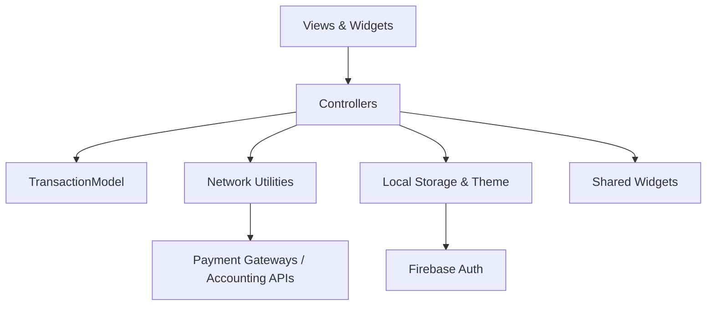
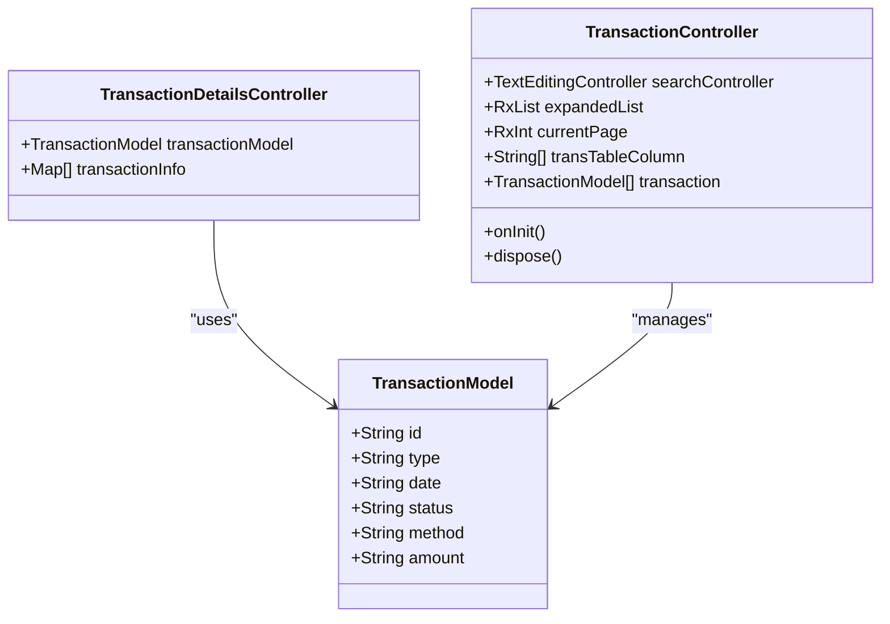
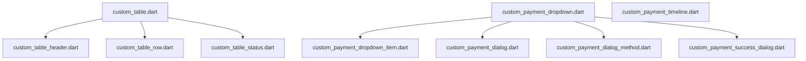
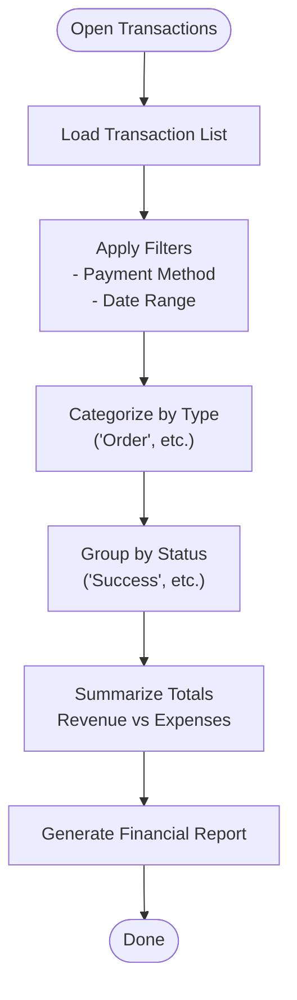
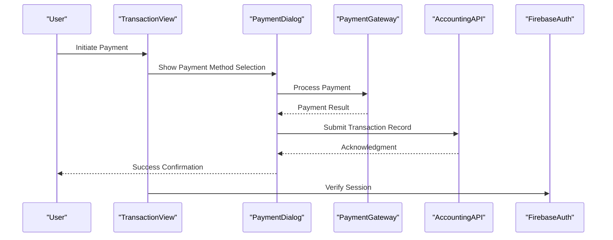
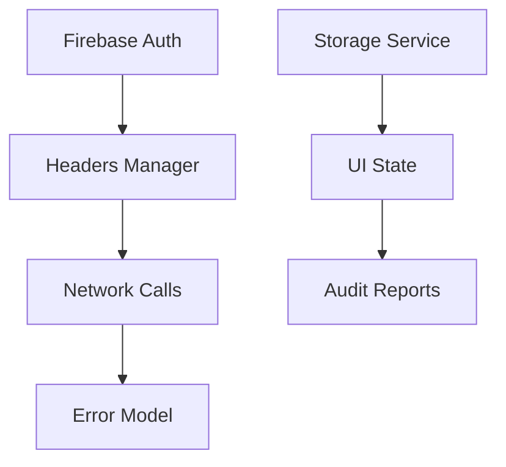
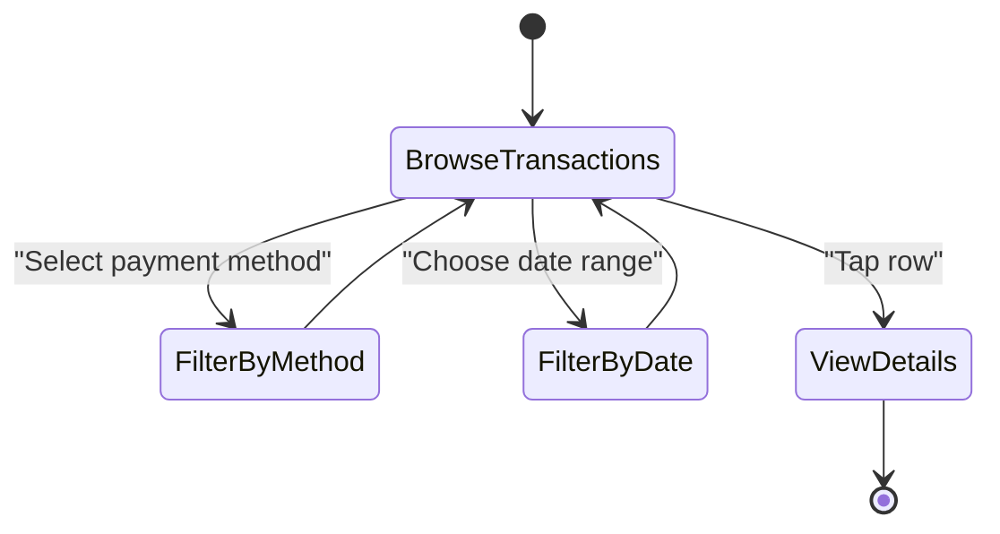
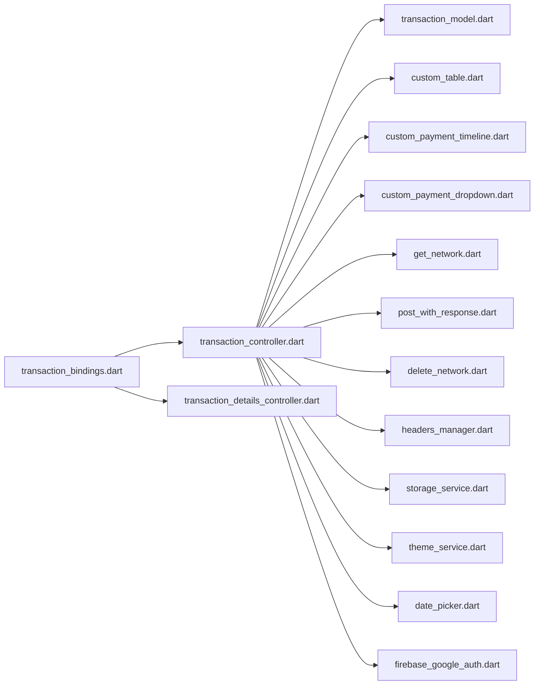

# Transaction Management

<cite>
**Referenced Files in This Document**
- [pubspec.yaml](file://pubspec.yaml)
- [README.md](file://README.md)
- [lib/main.dart](file://lib/main.dart)
- [lib/core/routes/app_routes.dart](file://lib/core/routes/app_routes.dart)
- [lib/core/routes/routes.dart](file://lib/core/routes/routes.dart)
- [lib/core/di/dependency_injection.dart](file://lib/core/di/dependency_injection.dart)
- [lib/features/transaction/bindings/transaction_bindings.dart](file://lib/features/transaction/bindings/transaction_bindings.dart)
- [lib/features/transaction/controller/transaction_controller.dart](file://lib/features/transaction/controller/transaction_controller.dart)
- [lib/features/transaction/controller/transaction_details_controller.dart](file://lib/features/transaction/controller/transaction_details_controller.dart)
- [lib/features/transaction/controller/transaction_calender_controller.dart](file://lib/features/transaction/controller/transaction_calender_controller.dart)
- [lib/features/transaction/models/transaction_model.dart](file://lib/features/transaction/models/transaction_model.dart)
- [lib/features/transaction/views/transaction_view.dart](file://lib/features/transaction/views/transaction_view.dart)
- [lib/features/transaction/views/transaction_details_view.dart](file://lib/features/transaction/views/transaction_details_view.dart)
- [lib/features/transaction/widgets/transaction_view_widgets/transaction_view_table.dart](file://lib/features/transaction/widgets/transaction_view_widgets/transaction_view_table.dart)
- [lib/features/transaction/widgets/transaction_view_widgets/transaction_view_table_filter.dart](file://lib/features/transaction/widgets/transaction_view_widgets/transaction_view_table_filter.dart)
- [lib/features/transaction/widgets/transaction_view_widgets/transaction_calender.dart](file://lib/features/transaction/widgets/transaction_view_widgets/transaction_calender.dart)
- [lib/features/transaction/widgets/transaction_view_widgets/transaction_table_expanded.dart](file://lib/features/transaction/widgets/transaction_view_widgets/transaction_table_expanded.dart)
- [lib/features/transaction/widgets/transaction_view_widgets/calendar_dialog/calender_filter.dart](file://lib/features/transaction/widgets/transaction_view_widgets/calendar_dialog/calender_filter.dart)
- [lib/features/transaction/widgets/transaction_view_widgets/calendar_dialog/custom_table_calender.dart](file://lib/features/transaction/widgets/transaction_view_widgets/calendar_dialog/custom_table_calender.dart)
- [lib/features/transaction/widgets/transaction_view_widgets/calendar_dialog/selected_day.dart](file://lib/features/transaction/widgets/transaction_view_widgets/calendar_dialog/selected_day.dart)
- [lib/features/transaction/widgets/transaction_details_widgets/transaction_details_info.dart](file://lib/features/transaction/widgets/transaction_details_widgets/transaction_details_info.dart)
- [lib/features/transaction/widgets/transaction_details_widgets/transaction_details_info_button.dart](file://lib/features/transaction/widgets/transaction_details_widgets/transaction_details_info_button.dart)
- [lib/shared/widgets/custom_table/custom_table.dart](file://lib/shared/widgets/custom_table/custom_table.dart)
- [lib/shared/widgets/custom_table/custom_table_header.dart](file://lib/shared/widgets/custom_table/custom_table_header.dart)
- [lib/shared/widgets/custom_table/custom_table_row.dart](file://lib/shared/widgets/custom_table/custom_table_row.dart)
- [lib/shared/widgets/custom_table/custom_table_status.dart](file://lib/shared/widgets/custom_table/custom_table_status.dart)
- [lib/shared/widgets/custom_timeline/custom_payment_timeline.dart](file://lib/shared/widgets/custom_timeline/custom_payment_timeline.dart)
- [lib/shared/widgets/custom_dropdown/custom_payment_dropdown/custom_payment_dropdown.dart](file://lib/shared/widgets/custom_dropdown/custom_payment_dropdown/custom_payment_dropdown.dart)
- [lib/shared/widgets/custom_dropdown/custom_payment_dropdown/custom_payment_dropdown_item.dart](file://lib/shared/widgets/custom_dropdown/custom_payment_dropdown/custom_payment_dropdown_item.dart)
- [lib/shared/widgets/custom_dialog/custom_payment_dialog.dart](file://lib/shared/widgets/custom_dialog/custom_payment_dialog.dart)
- [lib/shared/widgets/custom_dialog/custom_payment_dialog_method.dart](file://lib/shared/widgets/custom_dialog/custom_payment_dialog_method.dart)
- [lib/shared/widgets/custom_dialog/custom_payment_success_dialog.dart](file://lib/shared/widgets/custom_dialog/custom_payment_success_dialog.dart)
- [lib/core/data/networks/get_network.dart](file://lib/core/data/networks/get_network.dart)
- [lib/core/data/networks/post_with_response.dart](file://lib/core/data/networks/post_with_response.dart)
- [lib/core/data/networks/post_without_response.dart](file://lib/core/data/networks/post_without_response.dart)
- [lib/core/data/networks/delete_network.dart](file://lib/core/data/networks/delete_network.dart)
- [lib/core/data/networks/headers_manager.dart](file://lib/core/data/networks/headers_manager.dart)
- [lib/core/data/global_models/error_model.dart](file://lib/core/data/global_models/error_model.dart)
- [lib/core/data/local/storage_service.dart](file://lib/core/data/local/storage_service.dart)
- [lib/core/data/local/theme_service.dart](file://lib/core/data/local/theme_service.dart)
- [lib/core/utils/date_picker.dart](file://lib/core/utils/date_picker.dart)
- [lib/core/services/firebase_google_auth.dart](file://lib/core/services/firebase_google_auth.dart)
</cite>

## Table of Contents
1. [Introduction](#introduction)
2. [Project Structure](#project-structure)
3. [Core Components](#core-components)
4. [Architecture Overview](#architecture-overview)
5. [Detailed Component Analysis](#detailed-component-analysis)
6. [Dependency Analysis](#dependency-analysis)
7. [Performance Considerations](#performance-considerations)
8. [Troubleshooting Guide](#troubleshooting-guide)
9. [Conclusion](#conclusion)
10. [Appendices](#appendices)

## Introduction
This document describes the Transaction Management system for tracking business transactions across multiple services such as rent payments, furniture sales, and service fees. It covers the controller architecture, transaction model, view components for history display and reporting, reusable widget libraries for status indicators and payment interfaces, business logic for categorization and analytics, and integration touchpoints with payment gateways and accounting systems. It also addresses security, audit trails, and compliance considerations for end-to-end user workflows.

## Project Structure
The Transaction Management feature is organized under the features/transaction module with clear separation of concerns:
- Bindings: Dependency injection setup for controllers
- Controller: State and business logic for transaction lists, filters, calendar, and details
- Models: Data structure for transaction records
- Views: Screens for listing and detail views
- Widgets: Reusable UI components for tables, calendars, dialogs, and dropdowns

```mermaid
graph TB
subgraph "Transaction Feature"
TBind["transaction_bindings.dart"]
TCtrl["transaction_controller.dart"]
TDCtrl["transaction_details_controller.dart"]
TCaldCtrl["transaction_calender_controller.dart"]
TModel["transaction_model.dart"]
TView["transaction_view.dart"]
TDetView["transaction_details_view.dart"]
subgraph "Widgets"
TVT["transaction_view_table.dart"]
TVTF["transaction_view_table_filter.dart"]
TVC["transaction_calender.dart"]
TVE["transaction_table_expanded.dart"]
CalDlg["calender_filter.dart<br/>custom_table_calender.dart<br/>selected_day.dart"]
TDI["transaction_details_info.dart"]
TDIB["transaction_details_info_button.dart"]
end
end
subgraph "Shared Widgets"
CT["custom_table.dart"]
CTH["custom_table_header.dart"]
CTR["custom_table_row.dart"]
CTS["custom_table_status.dart"]
CPT["custom_payment_timeline.dart"]
CPDD["custom_payment_dropdown.dart<br/>custom_payment_dropdown_item.dart"]
CPD["custom_payment_dialog.dart"]
CPDM["custom_payment_dialog_method.dart"]
CPSD["custom_payment_success_dialog.dart"]
end
subgraph "Core"
Routes["app_routes.dart<br/>routes.dart"]
DI["dependency_injection.dart"]
NetGet["get_network.dart"]
NetPost["post_with_response.dart"]
NetDel["delete_network.dart"]
Headers["headers_manager.dart"]
Storage["storage_service.dart"]
Theme["theme_service.dart"]
DatePick["date_picker.dart"]
Auth["firebase_google_auth.dart"]
end
TBind --> TCtrl
TBind --> TDCtrl
TBind --> TCaldCtrl
TCtrl --> TModel
TDCtrl --> TModel
TView --> TVT
TView --> TVTF
TView --> TVC
TView --> TVE
TDetView --> TDI
TDetView --> TDIB
TVT --> CT
TVTF --> CPDD
TVC --> CalDlg
TVE --> CPT
CPDD --> CPD
CPDD --> CPDM
CPDD --> CPSD
TCtrl --> NetGet
TCtrl --> NetPost
TCtrl --> NetDel
TCtrl --> Headers
TCtrl --> Storage
TCtrl --> Theme
TCtrl --> DatePick
TCtrl --> Auth
```



**Diagram sources**
- [lib/features/transaction/bindings/transaction_bindings.dart:1-12](file://lib/features/transaction/bindings/transaction_bindings.dart#L1-L12)
- [lib/features/transaction/controller/transaction_controller.dart:1-66](file://lib/features/transaction/controller/transaction_controller.dart#L1-L66)
- [lib/features/transaction/controller/transaction_details_controller.dart:1-17](file://lib/features/transaction/controller/transaction_details_controller.dart#L1-L17)
- [lib/features/transaction/controller/transaction_calender_controller.dart:1-181](file://lib/features/transaction/controller/transaction_calender_controller.dart#L1-L181)
- [lib/features/transaction/models/transaction_model.dart:1-18](file://lib/features/transaction/models/transaction_model.dart#L1-L18)
- [lib/features/transaction/views/transaction_view.dart](file://lib/features/transaction/views/transaction_view.dart)
- [lib/features/transaction/views/transaction_details_view.dart](file://lib/features/transaction/views/transaction_details_view.dart)
- [lib/features/transaction/widgets/transaction_view_widgets/transaction_view_table.dart](file://lib/features/transaction/widgets/transaction_view_widgets/transaction_view_table.dart)
- [lib/features/transaction/widgets/transaction_view_widgets/transaction_view_table_filter.dart](file://lib/features/transaction/widgets/transaction_view_widgets/transaction_view_table_filter.dart)
- [lib/features/transaction/widgets/transaction_view_widgets/transaction_calender.dart](file://lib/features/transaction/widgets/transaction_view_widgets/transaction_calender.dart)
- [lib/features/transaction/widgets/transaction_view_widgets/transaction_table_expanded.dart](file://lib/features/transaction/widgets/transaction_view_widgets/transaction_table_expanded.dart)
- [lib/features/transaction/widgets/transaction_view_widgets/calendar_dialog/calender_filter.dart](file://lib/features/transaction/widgets/transaction_view_widgets/calendar_dialog/calender_filter.dart)
- [lib/features/transaction/widgets/transaction_view_widgets/calendar_dialog/custom_table_calender.dart](file://lib/features/transaction/widgets/transaction_view_widgets/calendar_dialog/custom_table_calender.dart)
- [lib/features/transaction/widgets/transaction_view_widgets/calendar_dialog/selected_day.dart](file://lib/features/transaction/widgets/transaction_view_widgets/calendar_dialog/selected_day.dart)
- [lib/features/transaction/widgets/transaction_details_widgets/transaction_details_info.dart](file://lib/features/transaction/widgets/transaction_details_widgets/transaction_details_info.dart)
- [lib/features/transaction/widgets/transaction_details_widgets/transaction_details_info_button.dart](file://lib/features/transaction/widgets/transaction_details_widgets/transaction_details_info_button.dart)
- [lib/shared/widgets/custom_table/custom_table.dart](file://lib/shared/widgets/custom_table/custom_table.dart)
- [lib/shared/widgets/custom_table/custom_table_header.dart](file://lib/shared/widgets/custom_table/custom_table_header.dart)
- [lib/shared/widgets/custom_table/custom_table_row.dart](file://lib/shared/widgets/custom_table/custom_table_row.dart)
- [lib/shared/widgets/custom_table/custom_table_status.dart](file://lib/shared/widgets/custom_table/custom_table_status.dart)
- [lib/shared/widgets/custom_timeline/custom_payment_timeline.dart](file://lib/shared/widgets/custom_timeline/custom_payment_timeline.dart)
- [lib/shared/widgets/custom_dropdown/custom_payment_dropdown/custom_payment_dropdown.dart](file://lib/shared/widgets/custom_dropdown/custom_payment_dropdown/custom_payment_dropdown.dart)
- [lib/shared/widgets/custom_dropdown/custom_payment_dropdown/custom_payment_dropdown_item.dart](file://lib/shared/widgets/custom_dropdown/custom_payment_dropdown/custom_payment_dropdown_item.dart)
- [lib/shared/widgets/custom_dialog/custom_payment_dialog.dart](file://lib/shared/widgets/custom_dialog/custom_payment_dialog.dart)
- [lib/shared/widgets/custom_dialog/custom_payment_dialog_method.dart](file://lib/shared/widgets/custom_dialog/custom_payment_dialog_method.dart)
- [lib/shared/widgets/custom_dialog/custom_payment_success_dialog.dart](file://lib/shared/widgets/custom_dialog/custom_payment_success_dialog.dart)
- [lib/core/routes/app_routes.dart](file://lib/core/routes/app_routes.dart)
- [lib/core/routes/routes.dart](file://lib/core/routes/routes.dart)
- [lib/core/di/dependency_injection.dart](file://lib/core/di/dependency_injection.dart)
- [lib/core/data/networks/get_network.dart](file://lib/core/data/networks/get_network.dart)
- [lib/core/data/networks/post_with_response.dart](file://lib/core/data/networks/post_with_response.dart)
- [lib/core/data/networks/post_without_response.dart](file://lib/core/data/networks/post_without_response.dart)
- [lib/core/data/networks/delete_network.dart](file://lib/core/data/networks/delete_network.dart)
- [lib/core/data/networks/headers_manager.dart](file://lib/core/data/networks/headers_manager.dart)
- [lib/core/data/local/storage_service.dart](file://lib/core/data/local/storage_service.dart)
- [lib/core/data/local/theme_service.dart](file://lib/core/data/local/theme_service.dart)
- [lib/core/utils/date_picker.dart](file://lib/core/utils/date_picker.dart)
- [lib/core/services/firebase_google_auth.dart](file://lib/core/services/firebase_google_auth.dart)

**Section sources**
- [lib/features/transaction/bindings/transaction_bindings.dart:1-12](file://lib/features/transaction/bindings/transaction_bindings.dart#L1-L12)
- [lib/features/transaction/controller/transaction_controller.dart:1-66](file://lib/features/transaction/controller/transaction_controller.dart#L1-L66)
- [lib/features/transaction/models/transaction_model.dart:1-18](file://lib/features/transaction/models/transaction_model.dart#L1-L18)
- [lib/features/transaction/views/transaction_view.dart](file://lib/features/transaction/views/transaction_view.dart)
- [lib/features/transaction/views/transaction_details_view.dart](file://lib/features/transaction/views/transaction_details_view.dart)

## Core Components
- TransactionController: Manages transaction list state, pagination, expansion state, and search input. Provides a fixed list of sample transactions for demonstration.
- TransactionDetailsController: Receives a TransactionModel argument and exposes structured transaction info for display.
- TransactionModel: Immutable data class representing a single transaction with identifiers, type, date, status, amount, and payment method.
- Transaction Calendar Controller: Defines a commented-out calendar controller intended for date-range selection and filtering.
- Transaction Views: Provide screens for listing transactions and viewing transaction details.
- Shared Widgets: Reusable components for tables, status badges, payment timelines, dropdowns, and dialogs.

**Section sources**
- [lib/features/transaction/controller/transaction_controller.dart:1-66](file://lib/features/transaction/controller/transaction_controller.dart#L1-L66)
- [lib/features/transaction/controller/transaction_details_controller.dart:1-17](file://lib/features/transaction/controller/transaction_details_controller.dart#L1-L17)
- [lib/features/transaction/models/transaction_model.dart:1-18](file://lib/features/transaction/models/transaction_model.dart#L1-L18)
- [lib/features/transaction/controller/transaction_calender_controller.dart:1-181](file://lib/features/transaction/controller/transaction_calender_controller.dart#L1-L181)
- [lib/features/transaction/views/transaction_view.dart](file://lib/features/transaction/views/transaction_view.dart)
- [lib/features/transaction/views/transaction_details_view.dart](file://lib/features/transaction/views/transaction_details_view.dart)

## Architecture Overview
The Transaction Management system follows a layered architecture:
- Presentation Layer: Views and widgets render transaction data and collect user interactions.
- Business Logic Layer: Controllers orchestrate state, handle filters, and prepare data for display.
- Data Access Layer: Network utilities encapsulate HTTP operations; local storage and theme services support persistence and UI state.
- Shared Layer: Reusable UI components promote consistency across the app.



**Diagram sources**
- [lib/features/transaction/controller/transaction_controller.dart:1-66](file://lib/features/transaction/controller/transaction_controller.dart#L1-L66)
- [lib/features/transaction/models/transaction_model.dart:1-18](file://lib/features/transaction/models/transaction_model.dart#L1-L18)
- [lib/core/data/networks/get_network.dart](file://lib/core/data/networks/get_network.dart)
- [lib/core/data/networks/post_with_response.dart](file://lib/core/data/networks/post_with_response.dart)
- [lib/core/data/networks/post_without_response.dart](file://lib/core/data/networks/post_without_response.dart)
- [lib/core/data/networks/delete_network.dart](file://lib/core/data/networks/delete_network.dart)
- [lib/core/data/local/storage_service.dart](file://lib/core/data/local/storage_service.dart)
- [lib/core/data/local/theme_service.dart](file://lib/core/data/local/theme_service.dart)
- [lib/core/services/firebase_google_auth.dart](file://lib/core/services/firebase_google_auth.dart)
- [lib/shared/widgets/custom_table/custom_table.dart](file://lib/shared/widgets/custom_table/custom_table.dart)
- [lib/shared/widgets/custom_timeline/custom_payment_timeline.dart](file://lib/shared/widgets/custom_timeline/custom_payment_timeline.dart)

## Detailed Component Analysis

### Transaction Controller Architecture
The TransactionController manages:
- Search input binding
- Expanded rows state for transaction details
- Pagination state
- Column headers for the transaction table
- Sample transaction list with predefined entries



**Diagram sources**
- [lib/features/transaction/controller/transaction_controller.dart:1-66](file://lib/features/transaction/controller/transaction_controller.dart#L1-L66)
- [lib/features/transaction/controller/transaction_details_controller.dart:1-17](file://lib/features/transaction/controller/transaction_details_controller.dart#L1-L17)
- [lib/features/transaction/models/transaction_model.dart:1-18](file://lib/features/transaction/models/transaction_model.dart#L1-L18)

**Section sources**
- [lib/features/transaction/controller/transaction_controller.dart:1-66](file://lib/features/transaction/controller/transaction_controller.dart#L1-L66)
- [lib/features/transaction/controller/transaction_details_controller.dart:1-17](file://lib/features/transaction/controller/transaction_details_controller.dart#L1-L17)
- [lib/features/transaction/models/transaction_model.dart:1-18](file://lib/features/transaction/models/transaction_model.dart#L1-L18)

### Transaction View Components
The transaction list screen integrates:
- A transaction table widget for displaying rows
- A filter widget for payment method selection
- A calendar widget for date range selection
- An expandable row component for detailed info
- A details screen for individual transactions

```mermaid
sequenceDiagram
participant User as "User"
participant View as "TransactionView"
participant Table as "TransactionViewTable"
participant Filter as "TransactionViewTableFilter"
participant Calendar as "TransactionCalendar"
participant Details as "TransactionDetailsView"
User->>View : Open Transactions
View->>Table : Render transaction rows
User->>Filter : Select payment method filter
Filter-->>Table : Apply filter
User->>Calendar : Choose date range
Calendar-->>Table : Update filtered dataset
User->>Table : Tap row to expand
Table-->>User : Show expanded details
User->>Table : Tap row to view details
Table->>Details : Navigate with TransactionModel
Details-->>User : Display transaction details
```

**Diagram sources**
- [lib/features/transaction/views/transaction_view.dart](file://lib/features/transaction/views/transaction_view.dart)
- [lib/features/transaction/widgets/transaction_view_widgets/transaction_view_table.dart](file://lib/features/transaction/widgets/transaction_view_widgets/transaction_view_table.dart)
- [lib/features/transaction/widgets/transaction_view_widgets/transaction_view_table_filter.dart](file://lib/features/transaction/widgets/transaction_view_widgets/transaction_view_table_filter.dart)
- [lib/features/transaction/widgets/transaction_view_widgets/transaction_calender.dart](file://lib/features/transaction/widgets/transaction_view_widgets/transaction_calender.dart)
- [lib/features/transaction/widgets/transaction_view_widgets/transaction_table_expanded.dart](file://lib/features/transaction/widgets/transaction_view_widgets/transaction_table_expanded.dart)
- [lib/features/transaction/views/transaction_details_view.dart](file://lib/features/transaction/views/transaction_details_view.dart)

**Section sources**
- [lib/features/transaction/views/transaction_view.dart](file://lib/features/transaction/views/transaction_view.dart)
- [lib/features/transaction/widgets/transaction_view_widgets/transaction_view_table.dart](file://lib/features/transaction/widgets/transaction_view_widgets/transaction_view_table.dart)
- [lib/features/transaction/widgets/transaction_view_widgets/transaction_view_table_filter.dart](file://lib/features/transaction/widgets/transaction_view_widgets/transaction_view_table_filter.dart)
- [lib/features/transaction/widgets/transaction_view_widgets/transaction_calender.dart](file://lib/features/transaction/widgets/transaction_view_widgets/transaction_calender.dart)
- [lib/features/transaction/widgets/transaction_view_widgets/transaction_table_expanded.dart](file://lib/features/transaction/widgets/transaction_view_widgets/transaction_table_expanded.dart)
- [lib/features/transaction/views/transaction_details_view.dart](file://lib/features/transaction/views/transaction_details_view.dart)

### Widget Libraries for Transactions
Reusable components include:
- Custom Table: Header, row, and status badge components for consistent rendering
- Payment Timeline: Visual timeline for payment stages
- Payment Dropdown: Dropdowns for selecting payment methods
- Payment Dialogs: Dialogs for initiating and confirming payments



**Diagram sources**
- [lib/shared/widgets/custom_table/custom_table.dart](file://lib/shared/widgets/custom_table/custom_table.dart)
- [lib/shared/widgets/custom_table/custom_table_header.dart](file://lib/shared/widgets/custom_table/custom_table_header.dart)
- [lib/shared/widgets/custom_table/custom_table_row.dart](file://lib/shared/widgets/custom_table/custom_table_row.dart)
- [lib/shared/widgets/custom_table/custom_table_status.dart](file://lib/shared/widgets/custom_table/custom_table_status.dart)
- [lib/shared/widgets/custom_timeline/custom_payment_timeline.dart](file://lib/shared/widgets/custom_timeline/custom_payment_timeline.dart)
- [lib/shared/widgets/custom_dropdown/custom_payment_dropdown/custom_payment_dropdown.dart](file://lib/shared/widgets/custom_dropdown/custom_payment_dropdown/custom_payment_dropdown.dart)
- [lib/shared/widgets/custom_dropdown/custom_payment_dropdown/custom_payment_dropdown_item.dart](file://lib/shared/widgets/custom_dropdown/custom_payment_dropdown/custom_payment_dropdown_item.dart)
- [lib/shared/widgets/custom_dialog/custom_payment_dialog.dart](file://lib/shared/widgets/custom_dialog/custom_payment_dialog.dart)
- [lib/shared/widgets/custom_dialog/custom_payment_dialog_method.dart](file://lib/shared/widgets/custom_dialog/custom_payment_dialog_method.dart)
- [lib/shared/widgets/custom_dialog/custom_payment_success_dialog.dart](file://lib/shared/widgets/custom_dialog/custom_payment_success_dialog.dart)

**Section sources**
- [lib/shared/widgets/custom_table/custom_table.dart](file://lib/shared/widgets/custom_table/custom_table.dart)
- [lib/shared/widgets/custom_table/custom_table_header.dart](file://lib/shared/widgets/custom_table/custom_table_header.dart)
- [lib/shared/widgets/custom_table/custom_table_row.dart](file://lib/shared/widgets/custom_table/custom_table_row.dart)
- [lib/shared/widgets/custom_table/custom_table_status.dart](file://lib/shared/widgets/custom_table/custom_table_status.dart)
- [lib/shared/widgets/custom_timeline/custom_payment_timeline.dart](file://lib/shared/widgets/custom_timeline/custom_payment_timeline.dart)
- [lib/shared/widgets/custom_dropdown/custom_payment_dropdown/custom_payment_dropdown.dart](file://lib/shared/widgets/custom_dropdown/custom_payment_dropdown/custom_payment_dropdown.dart)
- [lib/shared/widgets/custom_dropdown/custom_payment_dropdown/custom_payment_dropdown_item.dart](file://lib/shared/widgets/custom_dropdown/custom_payment_dropdown/custom_payment_dropdown_item.dart)
- [lib/shared/widgets/custom_dialog/custom_payment_dialog.dart](file://lib/shared/widgets/custom_dialog/custom_payment_dialog.dart)
- [lib/shared/widgets/custom_dialog/custom_payment_dialog_method.dart](file://lib/shared/widgets/custom_dialog/custom_payment_dialog_method.dart)
- [lib/shared/widgets/custom_dialog/custom_payment_success_dialog.dart](file://lib/shared/widgets/custom_dialog/custom_payment_success_dialog.dart)

### Business Logic: Categorization, Revenue/Expense Tracking, Analytics
- Categorization: The transaction type field supports categorizing entries such as "Order" for sales-related transactions.
- Revenue/Expense: Amount formatting indicates negative values for outgoing transactions; positive values could represent income depending on business rules.
- Filtering: Payment method dropdown enables filtering transactions by payment channel.
- Reporting: Calendar integration allows date-range filtering for financial reporting.



**Diagram sources**
- [lib/features/transaction/controller/transaction_controller.dart:1-66](file://lib/features/transaction/controller/transaction_controller.dart#L1-L66)
- [lib/features/transaction/widgets/transaction_view_widgets/transaction_view_table_filter.dart](file://lib/features/transaction/widgets/transaction_view_widgets/transaction_view_table_filter.dart)
- [lib/features/transaction/widgets/transaction_view_widgets/transaction_calender.dart](file://lib/features/transaction/widgets/transaction_view_widgets/transaction_calender.dart)

**Section sources**
- [lib/features/transaction/controller/transaction_controller.dart:1-66](file://lib/features/transaction/controller/transaction_controller.dart#L1-L66)
- [lib/features/transaction/widgets/transaction_view_widgets/transaction_view_table_filter.dart](file://lib/features/transaction/widgets/transaction_view_widgets/transaction_view_table_filter.dart)
- [lib/features/transaction/widgets/transaction_view_widgets/transaction_calender.dart](file://lib/features/transaction/widgets/transaction_view_widgets/transaction_calender.dart)

### Integration Touchpoints
- Payment Gateways: Payment dialog and dropdown components indicate integration points for processing payments via various methods.
- Accounting Systems: Network utilities provide hooks for posting transactions to backend systems.
- Authentication: Firebase Google Auth supports secure user sessions for transaction access.



**Diagram sources**
- [lib/shared/widgets/custom_dialog/custom_payment_dialog.dart](file://lib/shared/widgets/custom_dialog/custom_payment_dialog.dart)
- [lib/shared/widgets/custom_dialog/custom_payment_dialog_method.dart](file://lib/shared/widgets/custom_dialog/custom_payment_dialog_method.dart)
- [lib/shared/widgets/custom_dialog/custom_payment_success_dialog.dart](file://lib/shared/widgets/custom_dialog/custom_payment_success_dialog.dart)
- [lib/core/data/networks/post_with_response.dart](file://lib/core/data/networks/post_with_response.dart)
- [lib/core/services/firebase_google_auth.dart](file://lib/core/services/firebase_google_auth.dart)

**Section sources**
- [lib/shared/widgets/custom_dialog/custom_payment_dialog.dart](file://lib/shared/widgets/custom_dialog/custom_payment_dialog.dart)
- [lib/shared/widgets/custom_dialog/custom_payment_dialog_method.dart](file://lib/shared/widgets/custom_dialog/custom_payment_dialog_method.dart)
- [lib/shared/widgets/custom_dialog/custom_payment_success_dialog.dart](file://lib/shared/widgets/custom_dialog/custom_payment_success_dialog.dart)
- [lib/core/data/networks/post_with_response.dart](file://lib/core/data/networks/post_with_response.dart)
- [lib/core/services/firebase_google_auth.dart](file://lib/core/services/firebase_google_auth.dart)

### Security, Audit Trails, and Compliance
- Authentication: Firebase Google Auth secures user sessions and protects transaction access.
- Local Storage: Storage service persists user preferences and session data securely.
- Network Headers: Headers manager centralizes authentication and content-type headers for API requests.
- Error Handling: Global error model standardizes error responses for audit and troubleshooting.



**Diagram sources**
- [lib/core/services/firebase_google_auth.dart](file://lib/core/services/firebase_google_auth.dart)
- [lib/core/data/local/storage_service.dart](file://lib/core/data/local/storage_service.dart)
- [lib/core/data/networks/headers_manager.dart](file://lib/core/data/networks/headers_manager.dart)
- [lib/core/data/global_models/error_model.dart](file://lib/core/data/global_models/error_model.dart)

**Section sources**
- [lib/core/services/firebase_google_auth.dart](file://lib/core/services/firebase_google_auth.dart)
- [lib/core/data/local/storage_service.dart](file://lib/core/data/local/storage_service.dart)
- [lib/core/data/networks/headers_manager.dart](file://lib/core/data/networks/headers_manager.dart)
- [lib/core/data/global_models/error_model.dart](file://lib/core/data/global_models/error_model.dart)

### User Workflows
- Viewing Transaction History: Users open the transaction view, optionally filter by payment method and date range, and expand rows for details.
- Generating Reports: Users select date ranges via the calendar widget and export summarized data.
- Managing Financial Records: Users initiate payments through payment dialogs, confirm transactions, and review status indicators.



**Diagram sources**
- [lib/features/transaction/views/transaction_view.dart](file://lib/features/transaction/views/transaction_view.dart)
- [lib/features/transaction/widgets/transaction_view_widgets/transaction_view_table_filter.dart](file://lib/features/transaction/widgets/transaction_view_widgets/transaction_view_table_filter.dart)
- [lib/features/transaction/widgets/transaction_view_widgets/transaction_calender.dart](file://lib/features/transaction/widgets/transaction_view_widgets/transaction_calender.dart)
- [lib/features/transaction/views/transaction_details_view.dart](file://lib/features/transaction/views/transaction_details_view.dart)

**Section sources**
- [lib/features/transaction/views/transaction_view.dart](file://lib/features/transaction/views/transaction_view.dart)
- [lib/features/transaction/widgets/transaction_view_widgets/transaction_view_table_filter.dart](file://lib/features/transaction/widgets/transaction_view_widgets/transaction_view_table_filter.dart)
- [lib/features/transaction/widgets/transaction_view_widgets/transaction_calender.dart](file://lib/features/transaction/widgets/transaction_view_widgets/transaction_calender.dart)
- [lib/features/transaction/views/transaction_details_view.dart](file://lib/features/transaction/views/transaction_details_view.dart)

## Dependency Analysis
The Transaction feature depends on shared widgets and core utilities for consistent UI and reliable network operations.



**Diagram sources**
- [lib/features/transaction/bindings/transaction_bindings.dart:1-12](file://lib/features/transaction/bindings/transaction_bindings.dart#L1-L12)
- [lib/features/transaction/controller/transaction_controller.dart:1-66](file://lib/features/transaction/controller/transaction_controller.dart#L1-L66)
- [lib/features/transaction/models/transaction_model.dart:1-18](file://lib/features/transaction/models/transaction_model.dart#L1-L18)
- [lib/shared/widgets/custom_table/custom_table.dart](file://lib/shared/widgets/custom_table/custom_table.dart)
- [lib/shared/widgets/custom_timeline/custom_payment_timeline.dart](file://lib/shared/widgets/custom_timeline/custom_payment_timeline.dart)
- [lib/shared/widgets/custom_dropdown/custom_payment_dropdown/custom_payment_dropdown.dart](file://lib/shared/widgets/custom_dropdown/custom_payment_dropdown/custom_payment_dropdown.dart)
- [lib/core/data/networks/get_network.dart](file://lib/core/data/networks/get_network.dart)
- [lib/core/data/networks/post_with_response.dart](file://lib/core/data/networks/post_with_response.dart)
- [lib/core/data/networks/post_without_response.dart](file://lib/core/data/networks/post_without_response.dart)
- [lib/core/data/networks/delete_network.dart](file://lib/core/data/networks/delete_network.dart)
- [lib/core/data/networks/headers_manager.dart](file://lib/core/data/networks/headers_manager.dart)
- [lib/core/data/local/storage_service.dart](file://lib/core/data/local/storage_service.dart)
- [lib/core/data/local/theme_service.dart](file://lib/core/data/local/theme_service.dart)
- [lib/core/utils/date_picker.dart](file://lib/core/utils/date_picker.dart)
- [lib/core/services/firebase_google_auth.dart](file://lib/core/services/firebase_google_auth.dart)

**Section sources**
- [lib/features/transaction/bindings/transaction_bindings.dart:1-12](file://lib/features/transaction/bindings/transaction_bindings.dart#L1-L12)
- [lib/features/transaction/controller/transaction_controller.dart:1-66](file://lib/features/transaction/controller/transaction_controller.dart#L1-L66)
- [lib/features/transaction/models/transaction_model.dart:1-18](file://lib/features/transaction/models/transaction_model.dart#L1-L18)
- [lib/shared/widgets/custom_table/custom_table.dart](file://lib/shared/widgets/custom_table/custom_table.dart)
- [lib/shared/widgets/custom_timeline/custom_payment_timeline.dart](file://lib/shared/widgets/custom_timeline/custom_payment_timeline.dart)
- [lib/shared/widgets/custom_dropdown/custom_payment_dropdown/custom_payment_dropdown.dart](file://lib/shared/widgets/custom_dropdown/custom_payment_dropdown/custom_payment_dropdown.dart)
- [lib/core/data/networks/get_network.dart](file://lib/core/data/networks/get_network.dart)
- [lib/core/data/networks/post_with_response.dart](file://lib/core/data/networks/post_with_response.dart)
- [lib/core/data/networks/post_without_response.dart](file://lib/core/data/networks/post_without_response.dart)
- [lib/core/data/networks/delete_network.dart](file://lib/core/data/networks/delete_network.dart)
- [lib/core/data/networks/headers_manager.dart](file://lib/core/data/networks/headers_manager.dart)
- [lib/core/data/local/storage_service.dart](file://lib/core/data/local/storage_service.dart)
- [lib/core/data/local/theme_service.dart](file://lib/core/data/local/theme_service.dart)
- [lib/core/utils/date_picker.dart](file://lib/core/utils/date_picker.dart)
- [lib/core/services/firebase_google_auth.dart](file://lib/core/services/firebase_google_auth.dart)

## Performance Considerations
- Virtualization: Use virtualized lists for large transaction datasets to reduce memory and improve scrolling performance.
- Debounced Search: Debounce search input to avoid frequent re-renders during typing.
- Lazy Loading: Paginate transaction lists and load data incrementally.
- Image Optimization: Cache and resize images in transaction details where applicable.
- Network Efficiency: Batch API calls and reuse connections; implement exponential backoff for retries.

## Troubleshooting Guide
- Empty Transaction List: Verify network connectivity and authentication state; check headers manager for missing tokens.
- Filter Not Working: Confirm dropdown items and event handlers are wired correctly; ensure state updates trigger rebuilds.
- Calendar Range Issues: Validate date parsing and timezone handling; ensure selected range boundaries are inclusive.
- Payment Dialog Failures: Inspect dialog callbacks and gateway responses; log error messages via the global error model.

**Section sources**
- [lib/core/data/networks/headers_manager.dart](file://lib/core/data/networks/headers_manager.dart)
- [lib/core/data/global_models/error_model.dart](file://lib/core/data/global_models/error_model.dart)
- [lib/shared/widgets/custom_dropdown/custom_payment_dropdown/custom_payment_dropdown.dart](file://lib/shared/widgets/custom_dropdown/custom_payment_dropdown/custom_payment_dropdown.dart)
- [lib/shared/widgets/custom_dialog/custom_payment_dialog.dart](file://lib/shared/widgets/custom_dialog/custom_payment_dialog.dart)

## Conclusion
The Transaction Management system provides a modular foundation for tracking, filtering, and reporting business transactions. Its controller-driven architecture, reusable widget libraries, and integration points enable scalable enhancements for rent payments, furniture sales, and service fees. Future improvements should focus on real-time data synchronization, advanced analytics, and robust compliance tooling.

## Appendices
- Dependencies Overview: The project leverages Flutter SDK, GetX for state management, and Firebase for authentication. Shared widgets and charts enhance UI consistency and interactivity.

**Section sources**
- [pubspec.yaml:30-66](file://pubspec.yaml#L30-L66)
- [README.md:1-17](file://README.md#L1-L17)