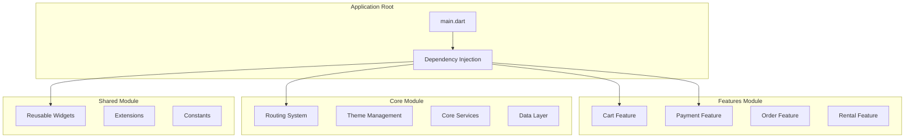
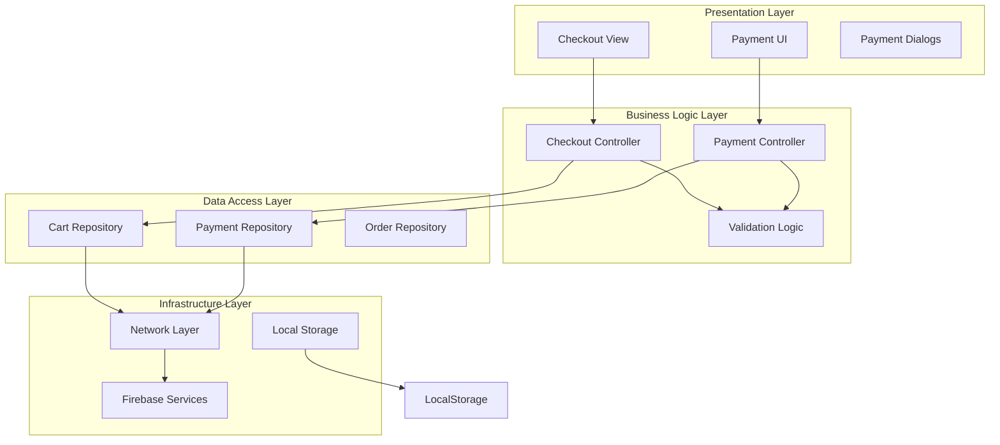
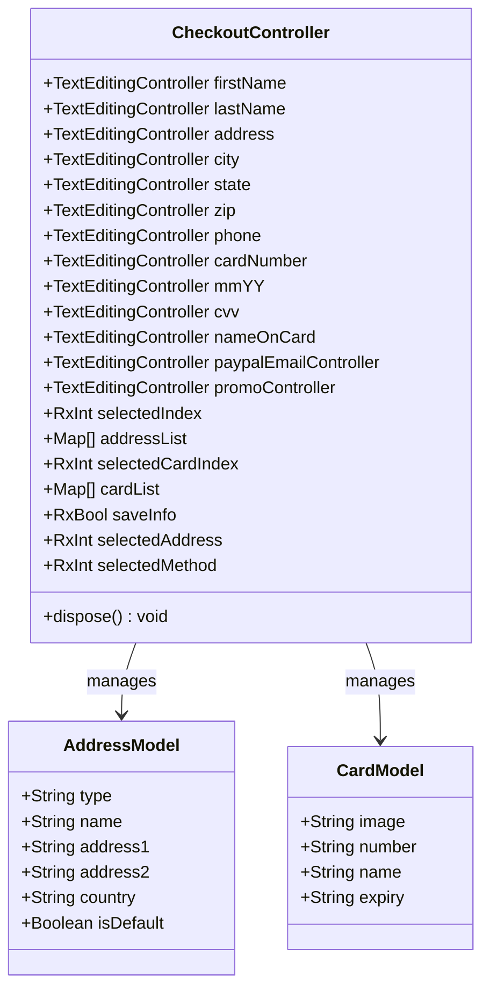
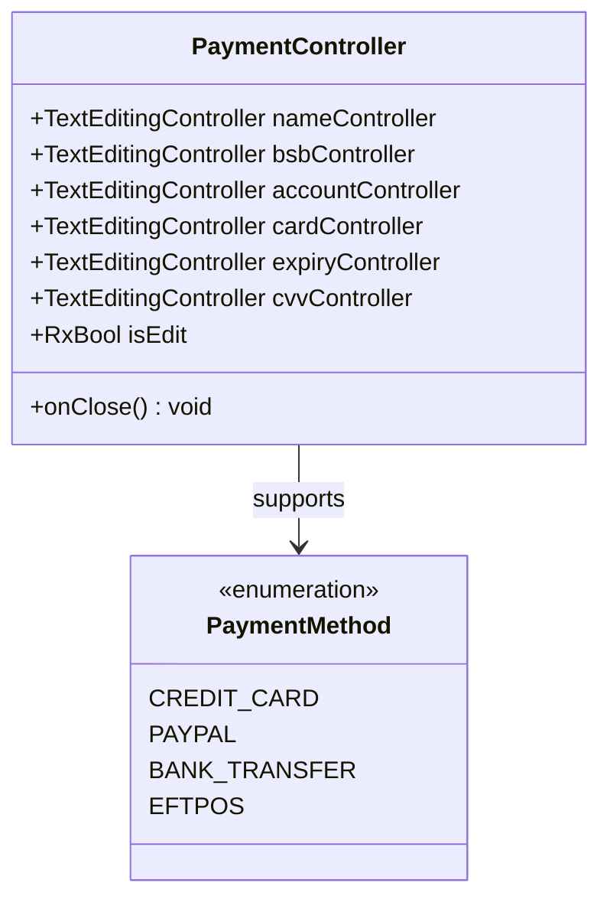
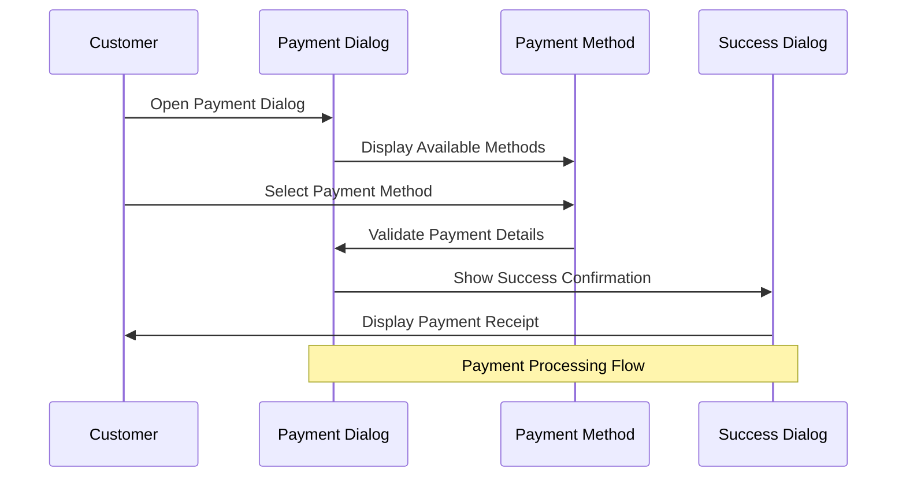
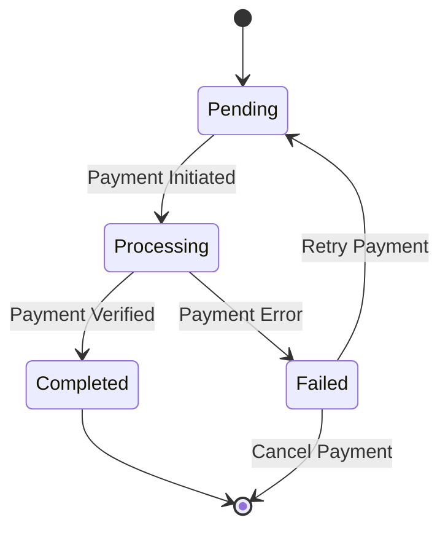
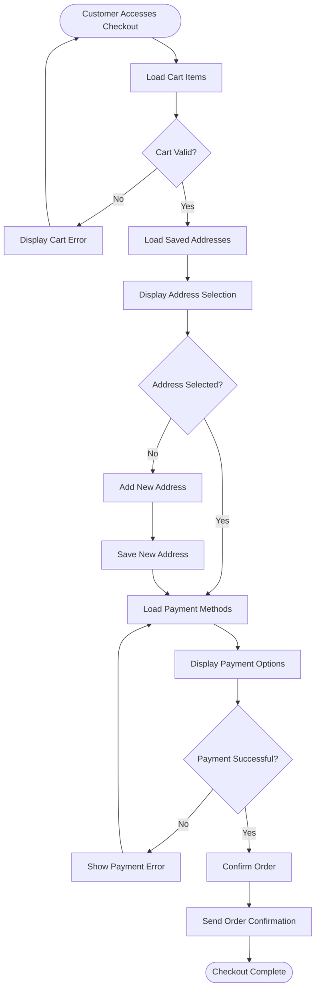
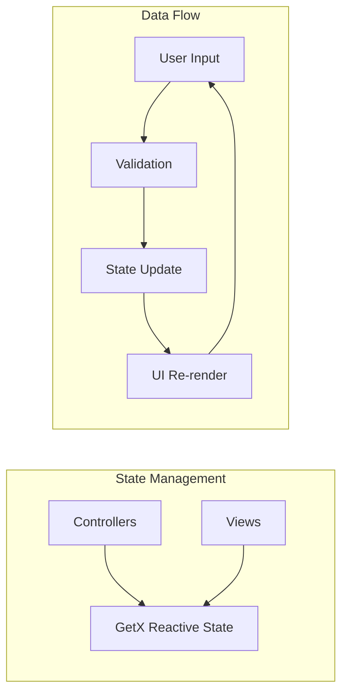

# Checkout System

<cite>
**Referenced Files in This Document**
- [main.dart](file://lib/main.dart)
- [checkout_controller.dart](file://lib/features/cart/controller/checkout_controller.dart)
- [checkout_view.dart](file://lib/features/cart/views/checkout_view.dart)
- [custom_payment_dialog.dart](file://lib/shared/widgets/custom_dialog/custom_payment_dialog.dart)
- [custom_payment_dialog_method.dart](file://lib/shared/widgets/custom_dialog/custom_payment_dialog_method.dart)
- [custom_payment_success_dialog.dart](file://lib/shared/widgets/custom_dialog/custom_payment_success_dialog.dart)
- [custom_payment_timeline.dart](file://lib/shared/widgets/custom_timeline/custom_payment_timeline.dart)
- [payment_controller.dart](file://lib/features/payment/controller/payment_controller.dart)
- [cart_bindings.dart](file://lib/features/cart/bindings/cart_bindings.dart)
- [checkout_bindings.dart](file://lib/features/cart/bindings/checkout_bindings.dart)
- [payment_bindings.dart](file://lib/features/payment/bindings/payment_bindings.dart)
- [app_routes.dart](file://lib/core/routes/app_routes.dart)
- [routes.dart](file://lib/core/routes/routes.dart)
- [dependency_injection.dart](file://lib/core/di/dependency_injection.dart)
</cite>

## Table of Contents
1. [Introduction](#introduction)
2. [Project Structure](#project-structure)
3. [Core Components](#core-components)
4. [Architecture Overview](#architecture-overview)
5. [Detailed Component Analysis](#detailed-component-analysis)
6. [Payment System Analysis](#payment-system-analysis)
7. [Checkout Workflow](#checkout-workflow)
8. [UI Components Analysis](#ui-components-analysis)
9. [State Management](#state-management)
10. [Integration Points](#integration-points)
11. [Performance Considerations](#performance-considerations)
12. [Troubleshooting Guide](#troubleshooting-guide)
13. [Conclusion](#conclusion)

## Introduction

The ZB DEZIGN checkout system is a comprehensive e-commerce payment processing solution built with Flutter. This system handles customer checkout processes, payment methods, order management, and delivery configurations. The checkout system integrates multiple components including cart management, payment processing, address validation, and order fulfillment tracking.

The system follows modern Flutter architecture patterns using GetX for state management, dependency injection for service coordination, and modular feature-based organization. It supports multiple payment methods including credit cards, PayPal, and bank transfers, with comprehensive validation and error handling mechanisms.

## Project Structure

The checkout system is organized within a feature-based architecture that separates concerns into distinct modules:

**Diagram sources**
- [main.dart:12-19](file://lib/main.dart#L12-L19)
- [dependency_injection.dart](file://lib/core/di/dependency_injection.dart)

**Section sources**
- [main.dart:1-47](file://lib/main.dart#L1-L47)
- [cart_bindings.dart](file://lib/features/cart/bindings/cart_bindings.dart)
- [payment_bindings.dart](file://lib/features/payment/bindings/payment_bindings.dart)

## Core Components

The checkout system consists of several interconnected components that work together to provide a seamless shopping experience:

### Checkout Controller
The central orchestrator for checkout operations, managing form data, validation, and state transitions.

### Payment Controller  
Handles payment method management, card information storage, and payment processing workflows.

### Address Management System
Manages customer addresses, delivery preferences, and shipping configurations.

### Order Processing Engine
Coordinates order creation, payment verification, and fulfillment tracking.

### UI Component Library
Provides reusable widgets for forms, dialogs, payment methods, and status indicators.

**Section sources**
- [checkout_controller.dart:5-82](file://lib/features/cart/controller/checkout_controller.dart#L5-L82)
- [payment_controller.dart:4-23](file://lib/features/payment/controller/payment_controller.dart#L4-L23)

## Architecture Overview

The checkout system follows a layered architecture pattern with clear separation of concerns:

**Diagram sources**
- [checkout_view.dart:17-67](file://lib/features/cart/views/checkout_view.dart#L17-L67)
- [checkout_controller.dart:5-82](file://lib/features/cart/controller/checkout_controller.dart#L5-L82)

## Detailed Component Analysis

### Checkout Controller Implementation

The CheckoutController serves as the primary state manager for the checkout process, handling form data collection and validation:

**Diagram sources**
- [checkout_controller.dart:5-82](file://lib/features/cart/controller/checkout_controller.dart#L5-L82)

**Section sources**
- [checkout_controller.dart:21-59](file://lib/features/cart/controller/checkout_controller.dart#L21-L59)

### Payment Controller Architecture

The PaymentController manages payment method configurations and card information:

**Diagram sources**
- [payment_controller.dart:4-23](file://lib/features/payment/controller/payment_controller.dart#L4-L23)

**Section sources**
- [payment_controller.dart:5-22](file://lib/features/payment/controller/payment_controller.dart#L5-L22)

## Payment System Analysis

The payment system provides comprehensive payment processing capabilities with multiple payment method support:

### Payment Dialog System

**Diagram sources**
- [custom_payment_dialog.dart:9-94](file://lib/shared/widgets/custom_dialog/custom_payment_dialog.dart#L9-L94)
- [custom_payment_dialog_method.dart:12-71](file://lib/shared/widgets/custom_dialog/custom_payment_dialog_method.dart#L12-L71)

### Payment Timeline Component

The payment timeline provides visual progress tracking for payment processes:

**Diagram sources**
- [custom_payment_timeline.dart:5-43](file://lib/shared/widgets/custom_timeline/custom_payment_timeline.dart#L5-L43)

**Section sources**
- [custom_payment_dialog.dart:28-92](file://lib/shared/widgets/custom_dialog/custom_payment_dialog.dart#L28-L92)
- [custom_payment_dialog_method.dart:21-69](file://lib/shared/widgets/custom_dialog/custom_payment_dialog_method.dart#L21-L69)

## Checkout Workflow

The checkout process follows a structured workflow that ensures data validation and smooth user experience:

**Diagram sources**
- [checkout_view.dart:47-60](file://lib/features/cart/views/checkout_view.dart#L47-L60)

**Section sources**
- [checkout_view.dart:21-66](file://lib/features/cart/views/checkout_view.dart#L21-L66)

## UI Components Analysis

The checkout system utilizes a comprehensive set of reusable UI components:

### Form Components
- Address form with validation
- Payment method selection
- Promo code input
- Shipping preference options

### Dialog Components
- Payment confirmation dialog
- Success confirmation dialog
- Error handling dialogs

### Status Components
- Payment timeline visualization
- Order status indicators
- Progress tracking components

**Section sources**
- [custom_payment_dialog.dart:9-94](file://lib/shared/widgets/custom_dialog/custom_payment_dialog.dart#L9-L94)
- [custom_payment_success_dialog.dart:8-62](file://lib/shared/widgets/custom_dialog/custom_payment_success_dialog.dart#L8-L62)

## State Management

The checkout system uses GetX for reactive state management:

**Diagram sources**
- [checkout_controller.dart:19-20](file://lib/features/cart/controller/checkout_controller.dart#L19-L20)

The state management approach provides:
- Automatic UI updates when state changes
- Efficient memory management with proper disposal
- Reactive programming patterns for complex state interactions

**Section sources**
- [checkout_controller.dart:63-80](file://lib/features/cart/controller/checkout_controller.dart#L63-L80)

## Integration Points

The checkout system integrates with multiple external services:

### Routing Integration
- Navigation between checkout screens
- Route protection and authentication
- Deep linking support

### Dependency Injection
- Service registration and lifecycle management
- Mock service support for testing
- Environment-specific configuration

### External APIs
- Payment gateway integration
- Address validation services
- Shipping rate calculation

**Section sources**
- [app_routes.dart](file://lib/core/routes/app_routes.dart)
- [routes.dart](file://lib/core/routes/routes.dart)
- [dependency_injection.dart](file://lib/core/di/dependency_injection.dart)

## Performance Considerations

The checkout system implements several performance optimization strategies:

### Memory Management
- Proper disposal of TextEditingController instances
- Efficient state management with GetX
- Lazy loading of heavy components

### Network Optimization
- Request batching for multiple API calls
- Caching of frequently accessed data
- Optimistic UI updates

### UI Performance
- Conditional rendering of expensive widgets
- Efficient list building with ListView.builder
- Proper use of keys for widget identity

## Troubleshooting Guide

Common issues and their solutions:

### Payment Processing Issues
- Verify payment method compatibility
- Check network connectivity
- Validate card details format

### Address Validation Problems
- Ensure required fields are completed
- Verify ZIP code format
- Check address against postal database

### State Management Issues
- Dispose of controllers properly
- Check for memory leaks
- Verify reactive variable usage

**Section sources**
- [checkout_controller.dart:63-80](file://lib/features/cart/controller/checkout_controller.dart#L63-L80)
- [payment_controller.dart:13-21](file://lib/features/payment/controller/payment_controller.dart#L13-L21)

## Conclusion

The ZB DEZIGN checkout system provides a robust, scalable solution for e-commerce payment processing. Its modular architecture, comprehensive state management, and extensive UI component library make it suitable for complex commercial applications.

Key strengths include:
- Clean separation of concerns through feature-based organization
- Comprehensive payment method support
- Reusable UI components for consistent user experience
- Robust error handling and validation
- Scalable architecture for future enhancements

The system is well-positioned for extension with additional payment methods, internationalization support, and advanced analytics capabilities.