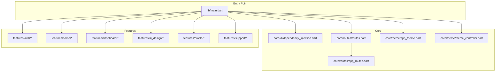
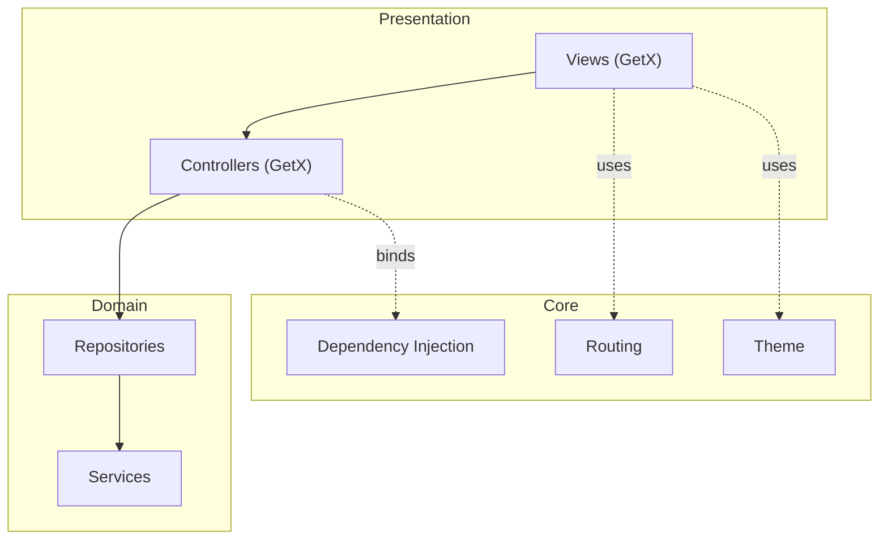
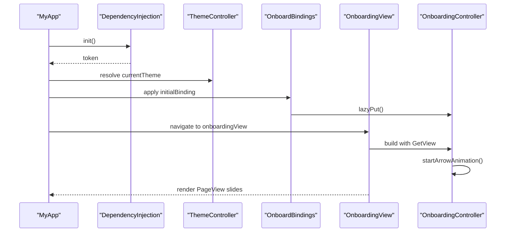
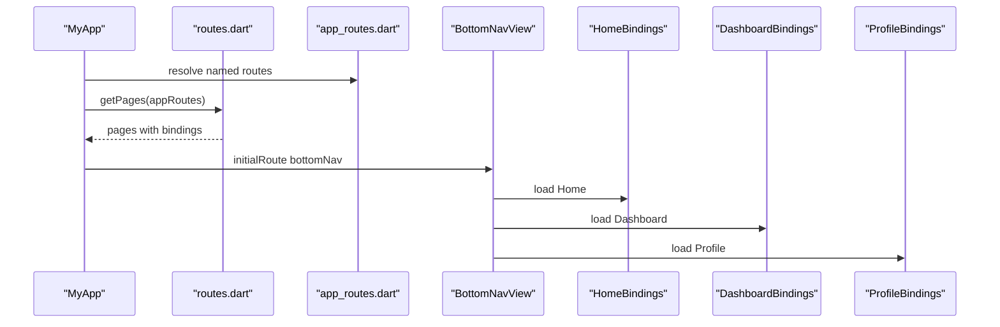
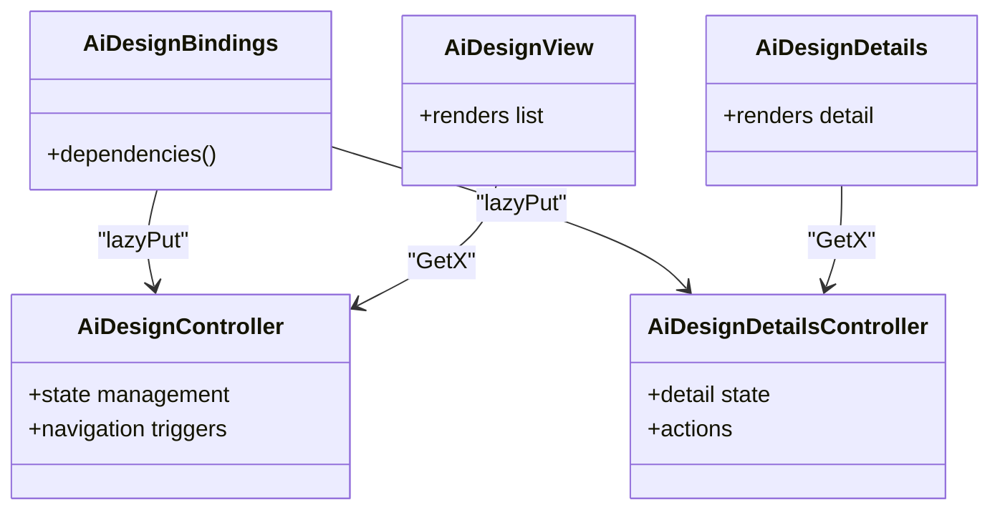
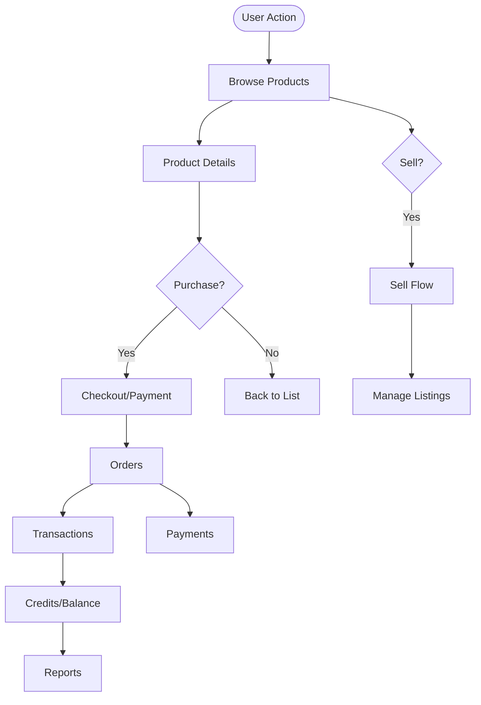
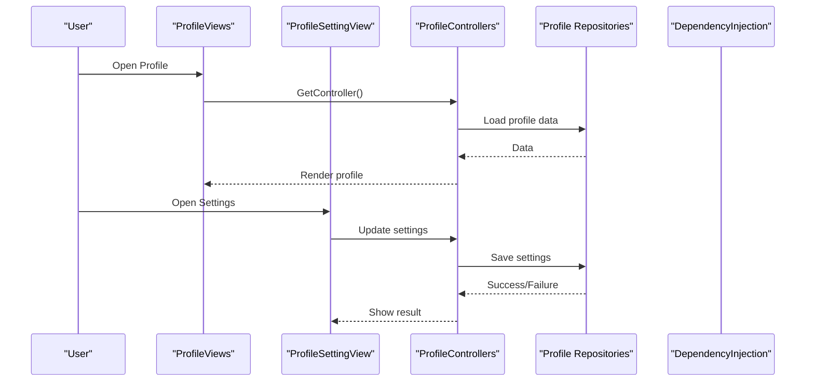
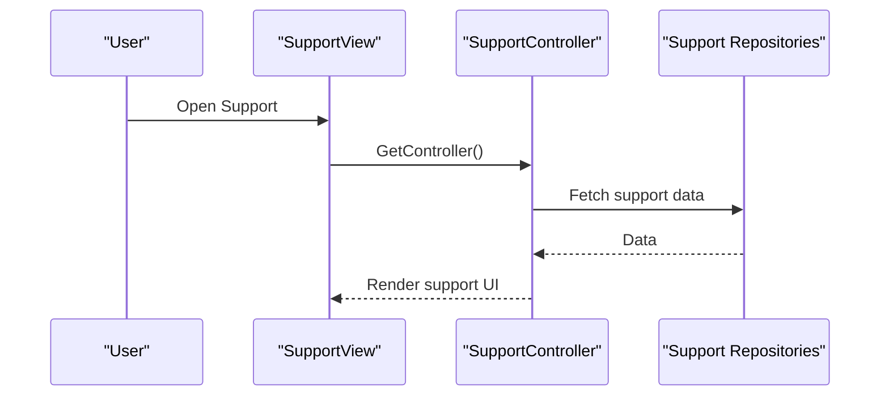
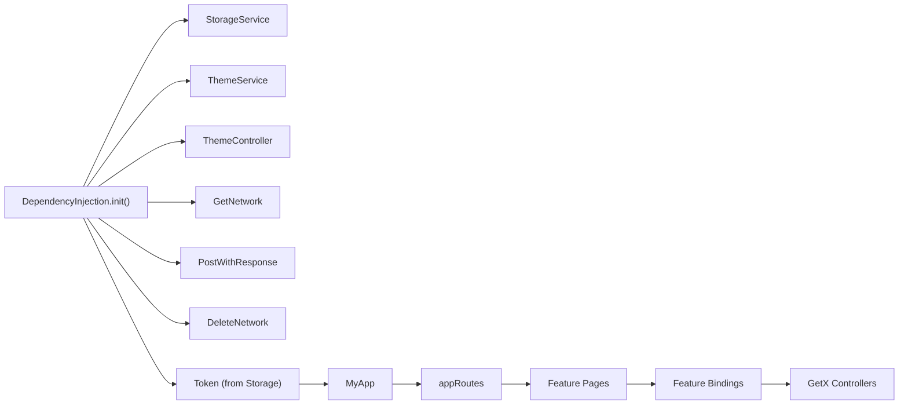

# Core Features

<cite>
**Referenced Files in This Document**
- [main.dart](file://lib/main.dart)
- [pubspec.yaml](file://pubspec.yaml)
- [dependency_injection.dart](file://lib/core/di/dependency_injection.dart)
- [app_routes.dart](file://lib/core/routes/app_routes.dart)
- [routes.dart](file://lib/core/routes/routes.dart)
- [app_theme.dart](file://lib/core/theme/app_theme.dart)
- [theme_controller.dart](file://lib/core/theme/theme_controller.dart)
- [onboard_bindings.dart](file://lib/features/auth/bindings/onboard_bindings.dart)
- [onboarding_controller.dart](file://lib/features/auth/controller/onboarding_controller.dart)
- [onboarding_view.dart](file://lib/features/auth/views/onboarding_view.dart)
</cite>

## Table of Contents
1. [Introduction](#introduction)
2. [Project Structure](#project-structure)
3. [Core Components](#core-components)
4. [Architecture Overview](#architecture-overview)
5. [Detailed Component Analysis](#detailed-component-analysis)
6. [Dependency Analysis](#dependency-analysis)
7. [Performance Considerations](#performance-considerations)
8. [Troubleshooting Guide](#troubleshooting-guide)
9. [Conclusion](#conclusion)
10. [Appendices](#appendices)

## Introduction
This document describes the core features of the ZB-DEZINE application with a focus on Authentication System, Dashboard and Navigation, AI Design Services, E-commerce Platform, User Profile Management, and Support Systems. It explains user workflows, business logic, UI components, and integration patterns, and documents the feature-based modular architecture, controller responsibilities, and data flow between components. It also covers the binding system for initialization, state management patterns, service integration, feature-specific configurations, customization options, and extension points.

## Project Structure
The application follows a feature-based modular architecture under lib/, with a dedicated core module for DI, routing, theming, and shared utilities. The main entry initializes dependency injection, sets up theme mode, and selects the initial route and binding based on authentication state.

**Diagram sources**
- [main.dart:12-46](file://lib/main.dart#L12-L46)
- [dependency_injection.dart:11-26](file://lib/core/di/dependency_injection.dart#L11-L26)
- [routes.dart:55-211](file://lib/core/routes/routes.dart#L55-L211)
- [app_routes.dart:1-34](file://lib/core/routes/app_routes.dart#L1-L34)
- [app_theme.dart:4-22](file://lib/core/theme/app_theme.dart#L4-L22)
- [theme_controller.dart:5-22](file://lib/core/theme/theme_controller.dart#L5-L22)

**Section sources**
- [main.dart:12-46](file://lib/main.dart#L12-L46)
- [dependency_injection.dart:11-26](file://lib/core/di/dependency_injection.dart#L11-L26)
- [routes.dart:55-211](file://lib/core/routes/routes.dart#L55-L211)
- [app_routes.dart:1-34](file://lib/core/routes/app_routes.dart#L1-L34)
- [app_theme.dart:4-22](file://lib/core/theme/app_theme.dart#L4-L22)
- [theme_controller.dart:5-22](file://lib/core/theme/theme_controller.dart#L5-L22)

## Core Components
- Dependency Injection: Initializes storage, theme services, and network clients, and exposes a token for initial route selection.
- Routing: Centralized route definitions and page bindings for all features.
- Theming: Light/dark themes with reactive theme switching via ThemeController.
- Feature Bindings: Each feature module registers its controllers lazily for scoped lifecycle management.

Key responsibilities:
- main.dart: Bootstraps app, initializes DI, selects initial binding/route based on token presence.
- dependency_injection.dart: Registers singletons/services and returns token for routing.
- routes.dart: Declares pages and their bindings; supports multi-binding for bottom navigation.
- app_routes.dart: Defines named routes for navigation.
- app_theme.dart and theme_controller.dart: Provide theme data and reactive theme mode.

**Section sources**
- [main.dart:12-46](file://lib/main.dart#L12-L46)
- [dependency_injection.dart:11-26](file://lib/core/di/dependency_injection.dart#L11-L26)
- [routes.dart:55-211](file://lib/core/routes/routes.dart#L55-L211)
- [app_routes.dart:1-34](file://lib/core/routes/app_routes.dart#L1-L34)
- [app_theme.dart:4-22](file://lib/core/theme/app_theme.dart#L4-L22)
- [theme_controller.dart:5-22](file://lib/core/theme/theme_controller.dart#L5-L22)

## Architecture Overview
The app uses a layered architecture:
- Presentation Layer: Views and GetView controllers.
- Domain Layer: Controllers manage UI state and orchestrate business logic.
- Data Layer: Repositories and network services handle external APIs and persistence.
- Core Layer: DI, routing, theming, and shared utilities.

[No sources needed since this diagram shows conceptual architecture, not a direct code mapping]

## Detailed Component Analysis

### Authentication System
The authentication system is feature-driven and uses a multi-view flow with dedicated controllers and bindings. The onboarding flow demonstrates animated transitions and theme-aware content.

User workflows:
- Onboarding: Swipe-driven walkthrough with animated arrows and gradient backgrounds.
- Authentication: Login/Signup options, OTP verification, password reset, and email verification.
- User Mode Selection: Choose user type or business mode during registration.

Business logic:
- OnboardingController manages page transitions, drag gestures, and reactive color/opacity syncing with theme.
- ThemeController drives light/dark mode for onboarding visuals.
- AuthBindings and OnboardBindings lazy-instantiate controllers per route.

UI components:
- OnboardingView renders a PageView with header/footer widgets.
- Header/Footer widgets adapt to current slide and last slide state.
- Theme-aware images and gradients adjust based on dark mode.

Integration patterns:
- GetX controllers observe reactive state (Rx) and trigger navigation via named routes.
- Network services are injected via DI and used by auth repositories/controllers.
- Storage service persists token and theme preferences.

**Diagram sources**
- [main.dart:12-46](file://lib/main.dart#L12-L46)
- [dependency_injection.dart:11-26](file://lib/core/di/dependency_injection.dart#L11-L26)
- [theme_controller.dart:5-22](file://lib/core/theme/theme_controller.dart#L5-L22)
- [onboard_bindings.dart:4-9](file://lib/features/auth/bindings/onboard_bindings.dart#L4-L9)
- [onboarding_view.dart:8-54](file://lib/features/auth/views/onboarding_view.dart#L8-L54)
- [onboarding_controller.dart:7-123](file://lib/features/auth/controller/onboarding_controller.dart#L7-L123)

**Section sources**
- [onboard_bindings.dart:4-9](file://lib/features/auth/bindings/onboard_bindings.dart#L4-L9)
- [onboarding_controller.dart:7-123](file://lib/features/auth/controller/onboarding_controller.dart#L7-L123)
- [onboarding_view.dart:8-54](file://lib/features/auth/views/onboarding_view.dart#L8-L54)
- [theme_controller.dart:5-22](file://lib/core/theme/theme_controller.dart#L5-L22)

### Dashboard and Navigation
Navigation is centralized via named routes and bindings. The bottom navigation integrates multiple feature bindings for seamless switching between Home, Dashboard, and Profile.

User journeys:
- After authentication, users land on bottom navigation with tabs for Home, Dashboard, and Profile.
- Each tab loads its respective controllers and views with proper state isolation.

Business logic:
- Routes are defined in app_routes.dart and mapped to pages in routes.dart.
- Multi-binding for bottomNav ensures Home, Dashboard, and Profile controllers are ready.

UI components:
- BottomNavView orchestrates tabbed navigation.
- Each tab’s view is rendered with its dedicated controller and widgets.

Integration patterns:
- GetMaterialApp uses appRoutes to register pages and bindings.
- Controllers coordinate with repositories and services for data fetching/updating.

**Diagram sources**
- [main.dart:36-40](file://lib/main.dart#L36-L40)
- [routes.dart:122-125](file://lib/core/routes/routes.dart#L122-L125)
- [app_routes.dart:15-15](file://lib/core/routes/app_routes.dart#L15-L15)

**Section sources**
- [routes.dart:122-125](file://lib/core/routes/routes.dart#L122-L125)
- [app_routes.dart:1-34](file://lib/core/routes/app_routes.dart#L1-L34)

### AI Design Services
AI Design is a dedicated feature module with its own binding, controller(s), models, views, and widgets. The module integrates with the feature-based architecture and uses DI for network and storage services.

User workflows:
- Browse AI-generated designs.
- View design details and interact with design-specific widgets.

Business logic:
- AiDesignController and AiDesignDetailsController manage design lists and detail states.
- Models represent design data structures.
- Widgets encapsulate reusable UI for design listings and details.

UI components:
- AiDesignView and AiDesignDetails views render design galleries and detail screens.
- Widgets provide consistent UI elements for design cards, actions, and metadata.

Integration patterns:
- Binding registers controllers for lifecycle-scoped initialization.
- Network services (from DI) fetch design data.
- Storage service persists user preferences or selections.

**Diagram sources**
- [routes.dart:167-175](file://lib/core/routes/routes.dart#L167-L175)
- [app_routes.dart:24-25](file://lib/core/routes/app_routes.dart#L24-L25)

**Section sources**
- [routes.dart:167-175](file://lib/core/routes/routes.dart#L167-L175)
- [app_routes.dart:24-25](file://lib/core/routes/app_routes.dart#L24-L25)

### E-commerce Platform
The e-commerce platform spans multiple feature modules including Sell, Sell Flow, Product Details, Orders, Transactions, and Payments. These modules integrate with the routing and binding system and rely on repositories and services for data operations.

User workflows:
- Browse products and view details.
- Initiate purchase or sell flows.
- Track orders and transactions.
- Manage payments and credits.

Business logic:
- Controllers coordinate between views and repositories.
- Models represent product, order, transaction, and payment data.
- Repositories abstract network and storage operations.

UI components:
- ProductDetailsView, SellView, SellFlowViews, OrderView, TransactionView, PaymentView provide domain-specific interfaces.
- Shared widgets offer consistent form fields, buttons, pagination, and dialogs.

Integration patterns:
- Each feature module registers its binding and controllers.
- Network services and storage are resolved via DI.
- ThemeController ensures consistent light/dark appearance.

[No sources needed since this diagram shows conceptual workflow, not actual code structure]

**Section sources**
- [routes.dart:157-210](file://lib/core/routes/routes.dart#L157-L210)
- [app_routes.dart:22-33](file://lib/core/routes/app_routes.dart#L22-L33)

### User Profile Management
Profile management includes profile views, settings, and related controllers. The feature integrates with the binding system and uses repositories/services for data synchronization.

User workflows:
- View personal profile.
- Edit profile settings.
- Access account-related features (e.g., notifications, support).

Business logic:
- Profile controllers manage profile data and settings updates.
- Repositories handle profile persistence and retrieval.
- Settings binding ensures controllers are initialized per route.

UI components:
- ProfileViews and ProfileSettingView provide profile-centric interfaces.
- Shared widgets support forms, buttons, and lists.

Integration patterns:
- ProfileBindings register controllers for lifecycle management.
- ThemeController and storage service support theme and preferences.

[No sources needed since this diagram shows conceptual workflow, not actual code structure]

**Section sources**
- [routes.dart:147-155](file://lib/core/routes/routes.dart#L147-L155)
- [app_routes.dart:20-21](file://lib/core/routes/app_routes.dart#L20-L21)

### Support Systems
Support is implemented as a dedicated feature module with a view and binding. It follows the same modular pattern as other features.

User workflows:
- Access support center.
- Submit requests or view help content.

Business logic:
- Support controller manages support interactions.
- Binding initializes controller for the route.

UI components:
- SupportView provides support interface.
- Shared widgets enable consistent layouts and actions.

Integration patterns:
- SupportBindings register controllers.
- DI resolves services for support operations.

[No sources needed since this diagram shows conceptual workflow, not actual code structure]

**Section sources**
- [routes.dart:192-195](file://lib/core/routes/routes.dart#L192-L195)
- [app_routes.dart:29-29](file://lib/core/routes/app_routes.dart#L29-L29)

## Dependency Analysis
The application leverages GetX for DI, routing, and state management. The dependency injection layer registers persistent services and returns a token to drive initial routing decisions. The routing layer centralizes page-to-binding mappings, enabling modular feature loading.

**Diagram sources**
- [dependency_injection.dart:11-26](file://lib/core/di/dependency_injection.dart#L11-L26)
- [main.dart:12-19](file://lib/main.dart#L12-L19)
- [routes.dart:55-211](file://lib/core/routes/routes.dart#L55-L211)

**Section sources**
- [dependency_injection.dart:11-26](file://lib/core/di/dependency_injection.dart#L11-L26)
- [main.dart:12-19](file://lib/main.dart#L12-L19)
- [routes.dart:55-211](file://lib/core/routes/routes.dart#L55-L211)

## Performance Considerations
- Use lazy loading via Get.lazyPut in bindings to minimize memory footprint.
- Prefer Rx observables for targeted UI updates and avoid unnecessary rebuilds.
- Cache frequently accessed data (e.g., theme preference, token) in StorageService.
- Keep controllers lightweight; delegate heavy operations to repositories/services.
- Use PageView and scroll-based animations judiciously to maintain smooth UX.

[No sources needed since this section provides general guidance]

## Troubleshooting Guide
Common issues and resolutions:
- Initial route incorrect: Verify token retrieval in DependencyInjection and initialBinding selection in MyApp.
- Theme not switching: Ensure ThemeController is registered and currentTheme is applied in GetMaterialApp.
- Feature not initializing: Confirm binding exists for the route and lazyPut registers the controller.
- Navigation failures: Check app_routes.dart constants match routes.dart registrations.

**Section sources**
- [main.dart:21-46](file://lib/main.dart#L21-L46)
- [dependency_injection.dart:11-26](file://lib/core/di/dependency_injection.dart#L11-L26)
- [theme_controller.dart:5-22](file://lib/core/theme/theme_controller.dart#L5-L22)
- [routes.dart:55-211](file://lib/core/routes/routes.dart#L55-L211)
- [app_routes.dart:1-34](file://lib/core/routes/app_routes.dart#L1-L34)

## Conclusion
ZB-DEZINE employs a clean, feature-based architecture with GetX for DI, routing, and state management. The Authentication System, Dashboard and Navigation, AI Design Services, E-commerce Platform, User Profile Management, and Support Systems are modular, testable, and extensible. The binding system ensures proper controller lifecycle, while DI and routing provide predictable initialization and navigation. Following the patterns documented here enables consistent feature development and maintenance.

[No sources needed since this section summarizes without analyzing specific files]

## Appendices
- Feature-specific configurations:
  - Add new routes in app_routes.dart and register pages in routes.dart with appropriate bindings.
  - Create a binding file under the feature’s bindings directory and register controllers via lazyPut.
  - Integrate network and storage services via DI and expose them through repositories.
- Customization options:
  - Extend theme via app_theme.dart and toggle with ThemeController.
  - Localize strings and images per theme by checking ThemeController in controllers/views.
- Extension points:
  - Add new controllers under features/<module>/controller and wire them in bindings.
  - Introduce new repositories under features/<module>/repositories for data access logic.
  - Create reusable widgets under shared/widgets and leverage them across features.

[No sources needed since this section provides general guidance]