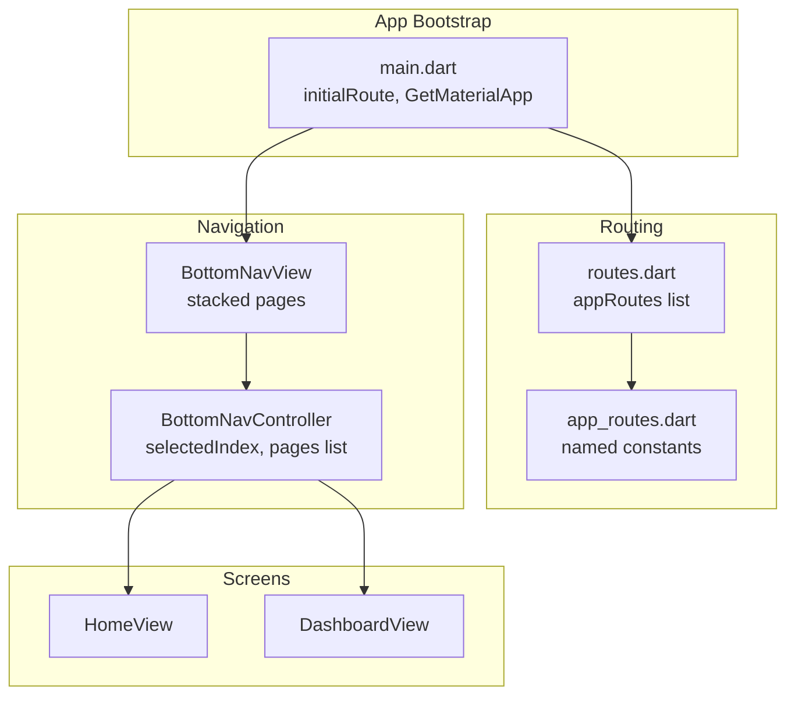
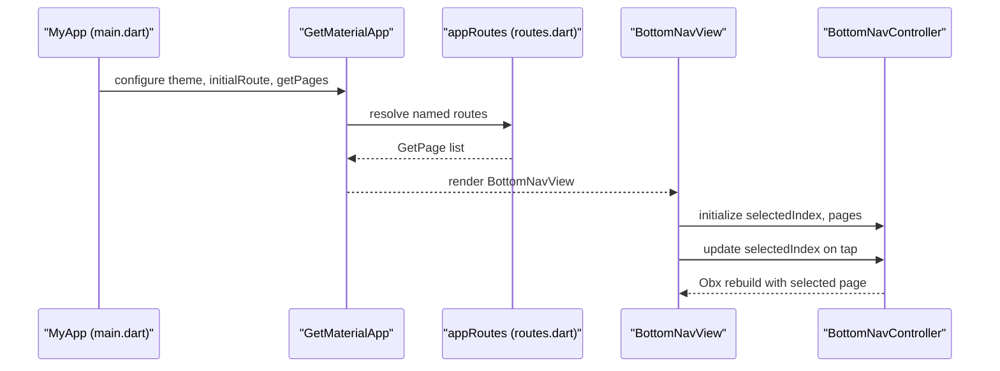
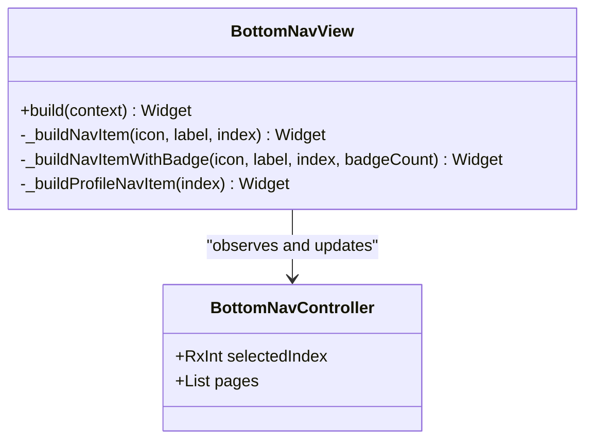
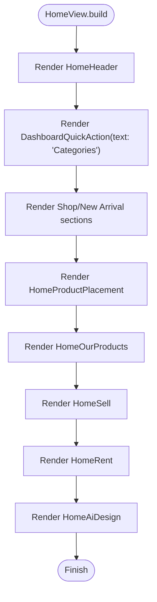
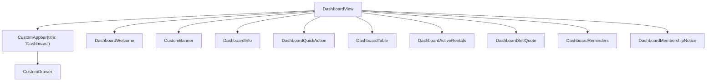
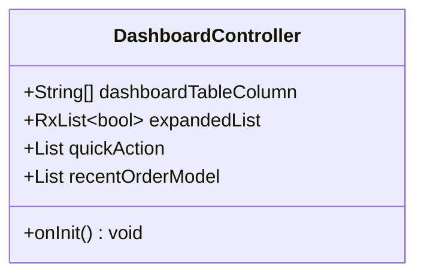
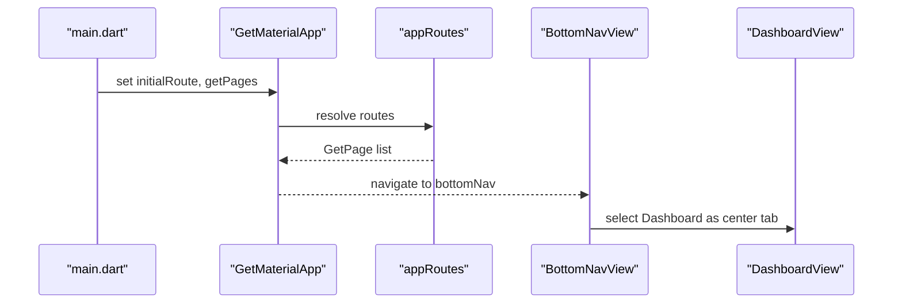
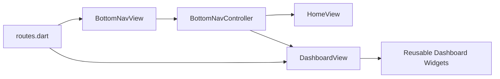

# Dashboard and Navigation

<cite>
**Referenced Files in This Document**
- [main.dart](file://lib/main.dart)
- [app_routes.dart](file://lib/core/routes/app_routes.dart)
- [routes.dart](file://lib/core/routes/routes.dart)
- [bottom_nav_view.dart](file://lib/features/home/views/bottom_nav_view.dart)
- [bottom_nav_controller.dart](file://lib/features/home/controller/bottom_nav_controller.dart)
- [home_view.dart](file://lib/features/home/views/home_view.dart)
- [dashboard_view.dart](file://lib/features/dashboard/views/dashboard_view.dart)
- [dashboard_controller.dart](file://lib/features/dashboard/controller/dashboard_controller.dart)
- [dashboard_bindings.dart](file://lib/features/dashboard/bindings/dashboard_bindings.dart)
</cite>

## Table of Contents
1. [Introduction](#introduction)
2. [Project Structure](#project-structure)
3. [Core Components](#core-components)
4. [Architecture Overview](#architecture-overview)
5. [Detailed Component Analysis](#detailed-component-analysis)
6. [Dependency Analysis](#dependency-analysis)
7. [Performance Considerations](#performance-considerations)
8. [Troubleshooting Guide](#troubleshooting-guide)
9. [Conclusion](#conclusion)

## Introduction
This document explains the Dashboard and Navigation system of the application. It covers the main dashboard interface, the bottom navigation system, quick action widgets, and the home screen’s recent activity and analytics presentation. It also documents the navigation architecture using GetX routing, page transitions, and state management for navigation states. The dashboard controller responsibilities are outlined, including data fetching, state management, and UI coordination. The widget hierarchy, reusable components, and responsive design implementation are described, along with integrations to other feature modules and the dashboard’s role as the central hub for user navigation. Finally, performance optimization strategies for dashboard rendering and lazy loading are addressed.

## Project Structure
The navigation and dashboard system spans several modules:
- Application bootstrap initializes theme, routing, and initial route selection based on authentication state.
- Routing is centralized via GetX with named routes and bindings.
- Bottom navigation composes five tabs: Home, Category, Dashboard (center-floating), Cart (with badge), and Profile.
- The Dashboard view aggregates multiple reusable widgets for quick actions, reminders, membership notices, and recent orders.

**Diagram sources**
- [main.dart:12-46](file://lib/main.dart#L12-L46)
- [routes.dart:55-211](file://lib/core/routes/routes.dart#L55-L211)
- [app_routes.dart:1-34](file://lib/core/routes/app_routes.dart#L1-L34)
- [bottom_nav_view.dart:11-255](file://lib/features/home/views/bottom_nav_view.dart#L11-L255)
- [bottom_nav_controller.dart:7-16](file://lib/features/home/controller/bottom_nav_controller.dart#L7-L16)
- [home_view.dart:15-75](file://lib/features/home/views/home_view.dart#L15-L75)
- [dashboard_view.dart:17-61](file://lib/features/dashboard/views/dashboard_view.dart#L17-L61)

**Section sources**
- [main.dart:12-46](file://lib/main.dart#L12-L46)
- [routes.dart:55-211](file://lib/core/routes/routes.dart#L55-L211)
- [app_routes.dart:1-34](file://lib/core/routes/app_routes.dart#L1-L34)

## Core Components
- Bottom navigation shell: A stacked layout that renders the selected tab page while hosting a floating center button that navigates to the Dashboard.
- Bottom navigation controller: Manages the selected index and maintains a list of tab pages.
- Home view: A scrollable list featuring curated content and a quick action widget for categories.
- Dashboard view: A vertically structured screen composed of multiple reusable widgets for welcome, banners, quick actions, reminders, membership notices, recent orders, and active rentals.
- Dashboard controller: Holds quick action items, recent order entries, and expanded states for rows.

Key responsibilities:
- Navigation orchestration: Selecting and switching between tabs, including the floating center button.
- State management: Reactive index updates and expanded row states.
- UI composition: Aggregating reusable widgets into a cohesive dashboard layout.

**Section sources**
- [bottom_nav_view.dart:11-255](file://lib/features/home/views/bottom_nav_view.dart#L11-L255)
- [bottom_nav_controller.dart:7-16](file://lib/features/home/controller/bottom_nav_controller.dart#L7-L16)
- [home_view.dart:15-75](file://lib/features/home/views/home_view.dart#L15-L75)
- [dashboard_view.dart:17-61](file://lib/features/dashboard/views/dashboard_view.dart#L17-L61)
- [dashboard_controller.dart:6-63](file://lib/features/dashboard/controller/dashboard_controller.dart#L6-L63)

## Architecture Overview
The navigation architecture leverages GetX for routing and reactive state management:
- Initial route selection depends on authentication token presence.
- Bottom navigation is a dedicated view that stacks pages and exposes a floating center button mapped to the Dashboard.
- Routing configuration defines named routes and their bindings, enabling lazy initialization of controllers and services.

**Diagram sources**
- [main.dart:21-46](file://lib/main.dart#L21-L46)
- [routes.dart:55-211](file://lib/core/routes/routes.dart#L55-L211)
- [bottom_nav_view.dart:11-255](file://lib/features/home/views/bottom_nav_view.dart#L11-L255)
- [bottom_nav_controller.dart:7-16](file://lib/features/home/controller/bottom_nav_controller.dart#L7-L16)

## Detailed Component Analysis

### Bottom Navigation Shell and Controller
The bottom navigation shell renders a stack of pages and a floating center button that selects the Dashboard tab. It uses an Obx widget to reactively rebuild when the selected index changes. The controller holds the selected index and a list of pages, including two instances of the Dashboard view.

**Diagram sources**
- [bottom_nav_view.dart:11-255](file://lib/features/home/views/bottom_nav_view.dart#L11-L255)
- [bottom_nav_controller.dart:7-16](file://lib/features/home/controller/bottom_nav_controller.dart#L7-L16)

**Section sources**
- [bottom_nav_view.dart:11-255](file://lib/features/home/views/bottom_nav_view.dart#L11-L255)
- [bottom_nav_controller.dart:7-16](file://lib/features/home/controller/bottom_nav_controller.dart#L7-L16)

### Home Screen Implementation
The Home view is a scrollable container that organizes content into sections:
- Header and helper content
- Quick action widget for categories
- Room-based shop, new arrivals, product placement, and curated sections
- Responsive spacing using screenutil sizes

**Diagram sources**
- [home_view.dart:15-75](file://lib/features/home/views/home_view.dart#L15-L75)

**Section sources**
- [home_view.dart:15-75](file://lib/features/home/views/home_view.dart#L15-L75)

### Dashboard View Composition
The Dashboard view composes multiple reusable widgets:
- Welcome banner
- Promotional banner
- Information cards
- Quick action tiles
- Recent orders table
- Active rentals
- Sell quote
- Reminders
- Membership notice

It uses a scrollable column with consistent vertical spacing and integrates a custom drawer trigger via the app bar.

**Diagram sources**
- [dashboard_view.dart:17-61](file://lib/features/dashboard/views/dashboard_view.dart#L17-L61)

**Section sources**
- [dashboard_view.dart:17-61](file://lib/features/dashboard/views/dashboard_view.dart#L17-L61)

### Dashboard Controller Responsibilities
The dashboard controller manages:
- Quick action items with icons, titles, subtitles, and target routes
- Recent order entries with identifiers, ETAs, totals, statuses, and actions
- Expanded states for rows in the recent orders table
- Initialization of expanded states based on the number of recent orders

**Diagram sources**
- [dashboard_controller.dart:6-63](file://lib/features/dashboard/controller/dashboard_controller.dart#L6-L63)

**Section sources**
- [dashboard_controller.dart:6-63](file://lib/features/dashboard/controller/dashboard_controller.dart#L6-L63)

### Navigation Architecture with GetX
- Initial route selection is determined by the presence of an authentication token.
- Routing configuration defines named routes and their bindings for lazy loading controllers.
- The bottom navigation route binds multiple modules to ensure controllers are available across tabs.

**Diagram sources**
- [main.dart:21-46](file://lib/main.dart#L21-L46)
- [routes.dart:116-125](file://lib/core/routes/routes.dart#L116-L125)
- [bottom_nav_view.dart:77-80](file://lib/features/home/views/bottom_nav_view.dart#L77-L80)

**Section sources**
- [main.dart:21-46](file://lib/main.dart#L21-L46)
- [routes.dart:55-211](file://lib/core/routes/routes.dart#L55-L211)
- [app_routes.dart:14-15](file://lib/core/routes/app_routes.dart#L14-L15)

### Quick Action Widgets
Quick action widgets appear in both Home and Dashboard contexts:
- Home: A category-focused quick action tile integrated into the scrollable list.
- Dashboard: A grid-like quick action tile for common tasks such as shopping products, selling furniture, renting products, and designing rooms.

These widgets are designed to be reusable and responsive, adapting to screen sizes using screenutil.

**Section sources**
- [home_view.dart:34](file://lib/features/home/views/home_view.dart#L34)
- [dashboard_controller.dart:9-34](file://lib/features/dashboard/controller/dashboard_controller.dart#L9-L34)

### Home Screen Recent Activity and Analytics Display
The Home view organizes content to present recent activity and curated analytics-like sections:
- “Shop by Room” and “New Arrival” sections guide discovery.
- Product placement and “Our Products” showcase inventory.
- “Sell” and “Rent” sections highlight monetization and rental opportunities.
- “AI Design” provides creative inspiration.

Spacing and typography leverage screenutil for responsiveness.

**Section sources**
- [home_view.dart:42-69](file://lib/features/home/views/home_view.dart#L42-L69)

### Widget Hierarchy and Reusable Components
The dashboard aggregates reusable components:
- Custom app bar with drawer trigger
- Custom banner and containers
- Shared containers for consistent layouts
- Dashboard-specific widgets for quick actions, reminders, membership notices, active rentals, sell quotes, and recent orders

These components promote consistency and reduce duplication across screens.

**Section sources**
- [dashboard_view.dart:27-55](file://lib/features/dashboard/views/dashboard_view.dart#L27-L55)

### Responsive Design Implementation
Responsive sizing is achieved using screenutil:
- Width, height, and font-size values are expressed in screen-relative units.
- Layouts adapt to various device sizes without manual breakpoints.

**Section sources**
- [bottom_nav_view.dart:28-30](file://lib/features/home/views/bottom_nav_view.dart#L28-L30)
- [home_view.dart:19-26](file://lib/features/home/views/home_view.dart#L19-L26)

### Integration with Other Feature Modules
The dashboard acts as the central hub:
- Bottom navigation routes integrate Home, Category, Dashboard, Cart, and Profile modules.
- The floating center button in bottom navigation directly targets the Dashboard.
- Controllers are lazily loaded via bindings to optimize startup and memory usage.

**Section sources**
- [bottom_nav_view.dart:77-80](file://lib/features/home/views/bottom_nav_view.dart#L77-L80)
- [routes.dart:122-125](file://lib/core/routes/routes.dart#L122-L125)
- [dashboard_bindings.dart:7-14](file://lib/features/dashboard/bindings/dashboard_bindings.dart#L7-L14)

## Dependency Analysis
The navigation system exhibits low coupling and high cohesion:
- BottomNavView depends on BottomNavController for reactive state.
- BottomNavController depends on view classes for page composition.
- DashboardView depends on reusable widgets for content assembly.
- Routing configuration decouples navigation from view construction via bindings.

**Diagram sources**
- [bottom_nav_view.dart:11-255](file://lib/features/home/views/bottom_nav_view.dart#L11-L255)
- [bottom_nav_controller.dart:7-16](file://lib/features/home/controller/bottom_nav_controller.dart#L7-L16)
- [dashboard_view.dart:17-61](file://lib/features/dashboard/views/dashboard_view.dart#L17-L61)
- [routes.dart:55-211](file://lib/core/routes/routes.dart#L55-L211)

**Section sources**
- [bottom_nav_view.dart:11-255](file://lib/features/home/views/bottom_nav_view.dart#L11-L255)
- [bottom_nav_controller.dart:7-16](file://lib/features/home/controller/bottom_nav_controller.dart#L7-L16)
- [dashboard_view.dart:17-61](file://lib/features/dashboard/views/dashboard_view.dart#L17-L61)
- [routes.dart:55-211](file://lib/core/routes/routes.dart#L55-L211)

## Performance Considerations
- Lazy loading: Controllers are lazily initialized via bindings to defer instantiation until needed.
- Reactive rebuilds: Obx widgets only rebuild affected subtrees when observable state changes.
- Minimal widget tree: Bottom navigation stacks pages to avoid unnecessary nesting.
- Scrollable content: Using singleChildScrollView and list-based layouts reduces layout thrash.
- Screenutil sizing: Ensures consistent rendering across devices without expensive recalculations.

[No sources needed since this section provides general guidance]

## Troubleshooting Guide
Common issues and resolutions:
- Navigation does not switch tabs: Verify the selected index is updated on item taps and that Obx rebuilds the scaffold.
- Floating center button does not navigate to Dashboard: Confirm the tap handler updates the selected index and triggers the controller’s state change.
- Dashboard widgets not visible: Ensure the dashboard route is registered and the view is included in the pages list.
- Drawer not opening: Check the app bar’s drawer callback and confirm the custom drawer widget is rendered.

**Section sources**
- [bottom_nav_view.dart:138-166](file://lib/features/home/views/bottom_nav_view.dart#L138-L166)
- [bottom_nav_view.dart:77-80](file://lib/features/home/views/bottom_nav_view.dart#L77-L80)
- [routes.dart:116-125](file://lib/core/routes/routes.dart#L116-L125)

## Conclusion
The Dashboard and Navigation system leverages GetX for robust routing and reactive state management. The bottom navigation provides a consistent five-tab experience with a floating center button leading to the Dashboard. The Dashboard view composes reusable widgets to present quick actions, reminders, membership notices, recent orders, and analytics-like content. Controllers manage state efficiently, and bindings enable lazy loading. The responsive design ensures consistent rendering across devices. Together, these components form a cohesive navigation hub that integrates seamlessly with other feature modules.