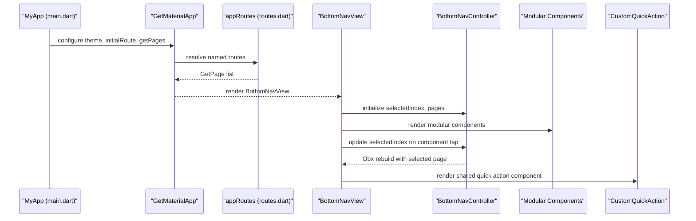
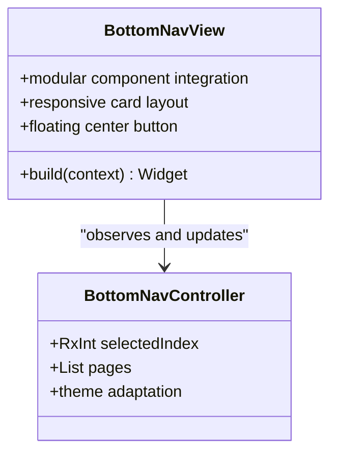
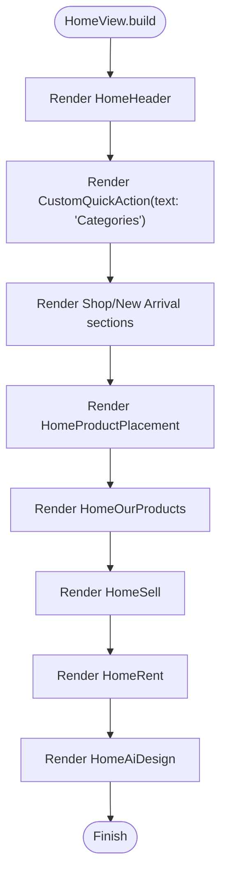
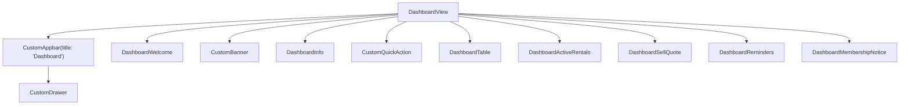
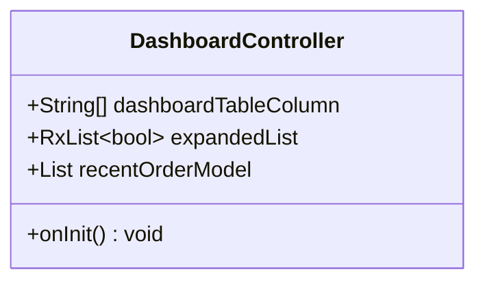
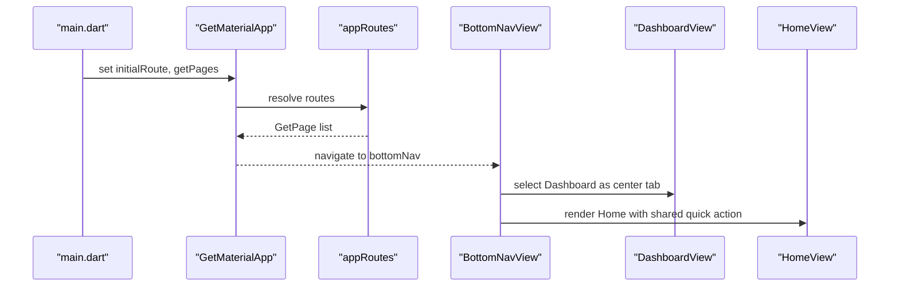
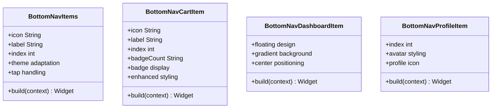
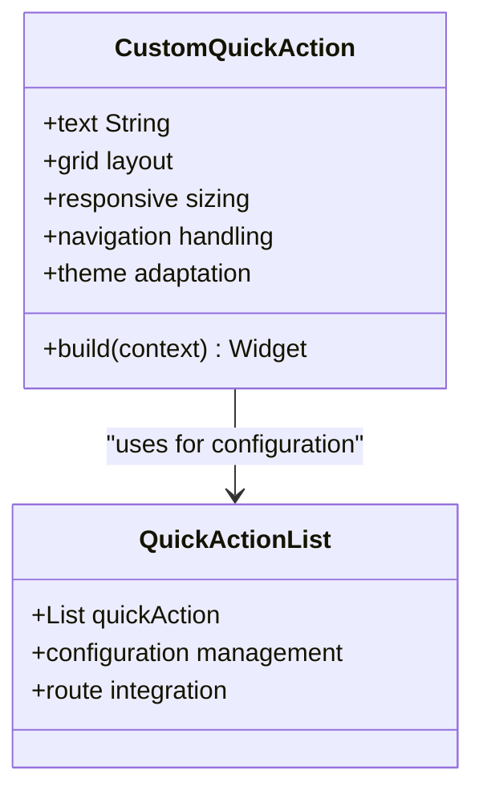
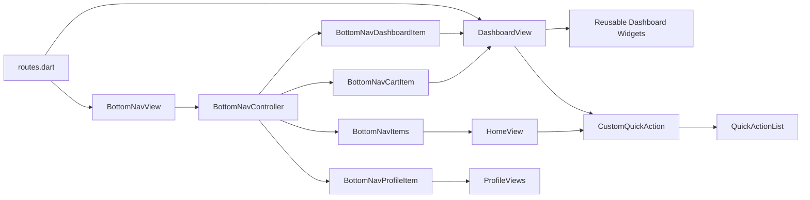

# Dashboard and Navigation

<cite>
**Referenced Files in This Document**
- [main.dart](file://lib/main.dart)
- [app_routes.dart](file://lib/core/routes/app_routes.dart)
- [routes.dart](file://lib/core/routes/routes.dart)
- [bottom_nav_view.dart](file://lib/features/home/views/bottom_nav_view.dart)
- [bottom_nav_controller.dart](file://lib/features/home/controller/bottom_nav_controller.dart)
- [bottom_nav_items.dart](file://lib/features/home/widgets/bottom_nav_widgets/bottom_nav_items.dart)
- [bottom_nav_cart_item.dart](file://lib/features/home/widgets/bottom_nav_widgets/bottom_nav_cart_item.dart)
- [bottom_nav_dashboard_item.dart](file://lib/features/home/widgets/bottom_nav_widgets/bottom_nav_dashboard_item.dart)
- [bottom_nav_profile_item.dart](file://lib/features/home/widgets/bottom_nav_widgets/bottom_nav_profile_item.dart)
- [home_view.dart](file://lib/features/home/views/home_view.dart)
- [dashboard_view.dart](file://lib/features/dashboard/views/dashboard_view.dart)
- [dashboard_controller.dart](file://lib/features/dashboard/controller/dashboard_controller.dart)
- [dashboard_bindings.dart](file://lib/features/dashboard/bindings/dashboard_bindings.dart)
- [custom_quick_action.dart](file://lib/shared/widgets/custom_quick_action/custom_quick_action.dart)
- [quick_action_list.dart](file://lib/shared/widgets/custom_quick_action/quick_action_list.dart)
</cite>

## Update Summary
**Changes Made**
- Complete replacement of embedded dashboard quick action system with new shared custom quick action component
- Migration of Home screen quick action widget to use shared component for consistency
- New shared QuickActionList class providing centralized configuration for all quick action items
- Enhanced navigation architecture with improved modularity and reusability
- Consolidated quick action functionality across Home, Dashboard, and Category screens

## Table of Contents
1. [Introduction](#introduction)
2. [Project Structure](#project-structure)
3. [Core Components](#core-components)
4. [Architecture Overview](#architecture-overview)
5. [Detailed Component Analysis](#detailed-component-analysis)
6. [Modular Bottom Navigation System](#modular-bottom-navigation-system)
7. [Shared Quick Action System](#shared-quick-action-system)
8. [Dependency Analysis](#dependency-analysis)
9. [Performance Considerations](#performance-considerations)
10. [Troubleshooting Guide](#troubleshooting-guide)
11. [Conclusion](#conclusion)

## Introduction
This document explains the Dashboard and Navigation system of the application. It covers the main dashboard interface, the redesigned modular bottom navigation system, the new shared custom quick action component, and the home screen's recent activity and analytics presentation. The navigation architecture now leverages GetX routing with a completely redesigned bottom navigation system that uses modular widget components for improved maintainability, theme adaptation, and responsive design. The dashboard controller responsibilities are outlined, including data fetching, state management, and UI coordination. The widget hierarchy, reusable components, and responsive design implementation are described, along with integrations to other feature modules and the dashboard's role as the central hub for user navigation. Finally, performance optimization strategies for dashboard rendering and lazy loading are addressed.

## Project Structure
The navigation and dashboard system spans several modules with a redesigned bottom navigation architecture and new shared quick action component:
- Application bootstrap initializes theme, routing, and initial route selection based on authentication state
- Routing is centralized via GetX with named routes and bindings
- Modular bottom navigation system with dedicated widget components for each navigation item
- Bottom navigation now consists of five specialized components: Home, Category, Dashboard (center-floating), Cart (with badge), and Profile
- The Dashboard view now uses a shared custom quick action component instead of embedded implementation
- The Home view has migrated to use the shared quick action component for consistency
- Quick action functionality is now centralized in a shared component with QuickActionList configuration

```mermaid
graph TB
subgraph "App Bootstrap"
MAIN["main.dart<br/>initialRoute, GetMaterialApp"]
end
subgraph "Routing"
ROUTES["routes.dart<br/>appRoutes list"]
AR["app_routes.dart<br/>named constants"]
end
subgraph "Modular Navigation"
BNV["BottomNavView<br/>streamlined layout"]
BNC["BottomNavController<br/>selectedIndex, pages list"]
BNI["BottomNavItems<br/>generic tab component"]
BNCART["BottomNavCartItem<br/>cart with badge"]
BNDASH["BottomNavDashboardItem<br/>floating center button"]
BNPROF["BottomNavProfileItem<br/>profile component"]
end
subgraph "Quick Action System"
QAL["QuickActionList<br/>centralized config"]
CQA["CustomQuickAction<br/>shared component"]
end
subgraph "Screens"
HOME["HomeView"]
DASH["DashboardView"]
END
MAIN --> ROUTES
ROUTES --> AR
MAIN --> BNV
BNV --> BNC
BNC --> BNI
BNC --> BNCART
BNC --> BNDASH
BNC --> BNPROF
BNC --> HOME
BNC --> DASH
HOME --> CQA
DASH --> CQA
CQA --> QAL
```

**Diagram sources**
- [main.dart:12-47](file://lib/main.dart#L12-L47)
- [routes.dart:55-212](file://lib/core/routes/routes.dart#L55-L212)
- [app_routes.dart:1-34](file://lib/core/routes/app_routes.dart#L1-L34)
- [bottom_nav_view.dart:12-81](file://lib/features/home/views/bottom_nav_view.dart#L12-L81)
- [bottom_nav_controller.dart:7-16](file://lib/features/home/controller/bottom_nav_controller.dart#L7-L16)
- [bottom_nav_items.dart:8-48](file://lib/features/home/widgets/bottom_nav_widgets/bottom_nav_items.dart#L8-L48)
- [bottom_nav_cart_item.dart:9-75](file://lib/features/home/widgets/bottom_nav_widgets/bottom_nav_cart_item.dart#L9-L75)
- [bottom_nav_dashboard_item.dart:9-58](file://lib/features/home/widgets/bottom_nav_widgets/bottom_nav_dashboard_item.dart#L9-L58)
- [bottom_nav_profile_item.dart:9-50](file://lib/features/home/widgets/bottom_nav_widgets/bottom_nav_profile_item.dart#L9-L50)
- [home_view.dart:16-89](file://lib/features/home/views/home_view.dart#L16-L89)
- [dashboard_view.dart:17-61](file://lib/features/dashboard/views/dashboard_view.dart#L17-L61)
- [custom_quick_action.dart:1-102](file://lib/shared/widgets/custom_quick_action/custom_quick_action.dart#L1-102)
- [quick_action_list.dart:1-31](file://lib/shared/widgets/custom_quick_action/quick_action_list.dart#L1-31)

**Section sources**
- [main.dart:12-47](file://lib/main.dart#L12-L47)
- [routes.dart:55-212](file://lib/core/routes/routes.dart#L55-L212)
- [app_routes.dart:1-34](file://lib/core/routes/app_routes.dart#L1-L34)

## Core Components
- **Modular Bottom Navigation Shell**: A streamlined stacked layout that renders the selected tab page while hosting a floating center button that navigates to the Dashboard
- **Bottom Navigation Controller**: Manages the selected index and maintains a list of tab pages with dedicated widget components
- **Modular Navigation Components**: Five specialized widget components for different navigation types with improved theme adaptation
- **Home View**: A scrollable list featuring curated content and a quick action widget for categories using the shared component
- **Dashboard View**: A vertically structured screen composed of multiple reusable widgets for welcome, banners, quick actions, reminders, membership notices, recent orders, and active rentals
- **Dashboard Controller**: Holds recent order entries and expanded states for rows
- **Shared Quick Action Component**: A centralized, reusable component providing consistent quick action functionality across all screens
- **QuickActionList Configuration**: Centralized configuration class defining all quick action items with icons, titles, subtitles, and target routes

Key responsibilities:
- **Navigation orchestration**: Selecting and switching between tabs, including the floating center button with dedicated widget management
- **State management**: Reactive index updates and expanded row states with modular component coordination
- **UI composition**: Aggregating reusable widgets into a cohesive dashboard layout with improved theme adaptation
- **Component specialization**: Each navigation item type has its own dedicated widget with specific styling and functionality
- **Quick action standardization**: Consistent quick action experience across Home, Dashboard, and Category screens through shared component

**Updated** Complete architectural redesign from monolithic bottom navigation to modular widget components, plus migration to shared quick action system

**Section sources**
- [bottom_nav_view.dart:12-81](file://lib/features/home/views/bottom_nav_view.dart#L12-L81)
- [bottom_nav_controller.dart:7-16](file://lib/features/home/controller/bottom_nav_controller.dart#L7-L16)
- [bottom_nav_items.dart:8-48](file://lib/features/home/widgets/bottom_nav_widgets/bottom_nav_items.dart#L8-L48)
- [bottom_nav_cart_item.dart:9-75](file://lib/features/home/widgets/bottom_nav_widgets/bottom_nav_cart_item.dart#L9-L75)
- [bottom_nav_dashboard_item.dart:9-58](file://lib/features/home/widgets/bottom_nav_widgets/bottom_nav_dashboard_item.dart#L9-L58)
- [bottom_nav_profile_item.dart:9-50](file://lib/features/home/widgets/bottom_nav_widgets/bottom_nav_profile_item.dart#L9-L50)
- [home_view.dart:16-89](file://lib/features/home/views/home_view.dart#L16-L89)
- [dashboard_view.dart:17-61](file://lib/features/dashboard/views/dashboard_view.dart#L17-L61)
- [dashboard_controller.dart:6-64](file://lib/features/dashboard/controller/dashboard_controller.dart#L6-L64)
- [custom_quick_action.dart:1-102](file://lib/shared/widgets/custom_quick_action/custom_quick_action.dart#L1-102)
- [quick_action_list.dart:1-31](file://lib/shared/widgets/custom_quick_action/quick_action_list.dart#L1-31)

## Architecture Overview
The navigation architecture leverages GetX for routing and reactive state management with a redesigned modular bottom navigation system and shared quick action component:
- Initial route selection depends on authentication token presence
- Bottom navigation is now a dedicated streamlined view using modular widget components
- Each navigation item type has its own specialized widget with dedicated functionality
- Routing configuration defines named routes and their bindings, enabling lazy initialization of controllers and services
- Theme adaptation is handled dynamically with light/dark mode support in each component
- Quick action functionality is now centralized through a shared component with QuickActionList configuration
- Home and Dashboard views use the same shared quick action component for consistency



**Diagram sources**
- [main.dart:21-47](file://lib/main.dart#L21-L47)
- [routes.dart:55-212](file://lib/core/routes/routes.dart#L55-L212)
- [bottom_nav_view.dart:12-81](file://lib/features/home/views/bottom_nav_view.dart#L12-L81)
- [bottom_nav_controller.dart:7-16](file://lib/features/home/controller/bottom_nav_controller.dart#L7-L16)
- [bottom_nav_items.dart:8-48](file://lib/features/home/widgets/bottom_nav_widgets/bottom_nav_items.dart#L8-L48)
- [custom_quick_action.dart:1-102](file://lib/shared/widgets/custom_quick_action/custom_quick_action.dart#L1-102)

## Detailed Component Analysis

### Streamlined Bottom Navigation Shell
The bottom navigation shell now uses a streamlined approach with modular widget components. It renders a stack of pages and a floating center button that selects the Dashboard tab. The layout uses a modern card-based design with shadow effects and responsive sizing. The controller manages the selected index and maintains a list of pages, including two instances of the Dashboard view.



**Diagram sources**
- [bottom_nav_view.dart:12-81](file://lib/features/home/views/bottom_nav_view.dart#L12-L81)
- [bottom_nav_controller.dart:7-16](file://lib/features/home/controller/bottom_nav_controller.dart#L7-L16)

**Section sources**
- [bottom_nav_view.dart:12-81](file://lib/features/home/views/bottom_nav_view.dart#L12-L81)
- [bottom_nav_controller.dart:7-16](file://lib/features/home/controller/bottom_nav_controller.dart#L7-L16)

### Home Screen Implementation
The Home view is a scrollable container that organizes content into sections:
- Header and helper content
- Quick action widget for categories using the shared CustomQuickAction component
- Room-based shop, new arrivals, product placement, and curated sections
- Responsive spacing using screenutil sizes

**Updated** Migrated from embedded quick action system to shared CustomQuickAction component



**Diagram sources**
- [home_view.dart:16-89](file://lib/features/home/views/home_view.dart#L16-L89)
- [custom_quick_action.dart:1-102](file://lib/shared/widgets/custom_quick_action/custom_quick_action.dart#L1-102)

**Section sources**
- [home_view.dart:16-89](file://lib/features/home/views/home_view.dart#L16-L89)
- [custom_quick_action.dart:1-102](file://lib/shared/widgets/custom_quick_action/custom_quick_action.dart#L1-102)

### Dashboard View Composition
The Dashboard view composes multiple reusable widgets:
- Welcome banner
- Promotional banner
- Information cards
- Quick action tiles using the shared CustomQuickAction component
- Recent orders table
- Active rentals
- Sell quote
- Reminders
- Membership notice

It uses a scrollable column with consistent vertical spacing and integrates a custom drawer trigger via the app bar.

**Updated** Now uses shared CustomQuickAction component instead of embedded implementation



**Diagram sources**
- [dashboard_view.dart:17-61](file://lib/features/dashboard/views/dashboard_view.dart#L17-L61)
- [custom_quick_action.dart:1-102](file://lib/shared/widgets/custom_quick_action/custom_quick_action.dart#L1-102)

**Section sources**
- [dashboard_view.dart:17-61](file://lib/features/dashboard/views/dashboard_view.dart#L17-L61)
- [custom_quick_action.dart:1-102](file://lib/shared/widgets/custom_quick_action/custom_quick_action.dart#L1-102)

### Dashboard Controller Responsibilities
The dashboard controller manages:
- Recent order entries with identifiers, ETAs, totals, statuses, and actions
- Expanded states for rows in the recent orders table
- Initialization of expanded states based on the number of recent orders

**Updated** Removed quick action items management (moved to shared component)



**Diagram sources**
- [dashboard_controller.dart:6-64](file://lib/features/dashboard/controller/dashboard_controller.dart#L6-L64)

**Section sources**
- [dashboard_controller.dart:6-64](file://lib/features/dashboard/controller/dashboard_controller.dart#L6-L64)

### Navigation Architecture with GetX
- Initial route selection is determined by the presence of an authentication token
- Routing configuration defines named routes and their bindings for lazy loading controllers
- The bottom navigation route binds multiple modules to ensure controllers are available across tabs
- Modular components provide better separation of concerns and improved maintainability
- Shared quick action component reduces code duplication and ensures consistency

**Updated** Added shared quick action component integration



**Diagram sources**
- [main.dart:21-47](file://lib/main.dart#L21-L47)
- [routes.dart:116-125](file://lib/core/routes/routes.dart#L116-L125)
- [bottom_nav_view.dart:77-80](file://lib/features/home/views/bottom_nav_view.dart#L77-L80)
- [home_view.dart:41](file://lib/features/home/views/home_view.dart#L41)
- [dashboard_view.dart:44](file://lib/features/dashboard/views/dashboard_view.dart#L44)

**Section sources**
- [main.dart:21-47](file://lib/main.dart#L21-L47)
- [routes.dart:55-212](file://lib/core/routes/routes.dart#L55-L212)
- [app_routes.dart:14-15](file://lib/core/routes/app_routes.dart#L14-L15)

### Quick Action Widgets
Quick action widgets are now provided through a centralized shared component:
- **Shared CustomQuickAction**: A reusable component that renders a grid of quick action tiles
- **QuickActionList**: Centralized configuration defining all quick action items with icons, titles, subtitles, and target routes
- **Consistent Experience**: Both Home and Dashboard now use the same shared component for uniform behavior
- **Category Screen Integration**: Also used in Category view for consistent navigation experience

The shared component provides:
- Grid-based layout with responsive sizing
- Theme-aware styling with light/dark mode support
- Touch handling with Get.toNamed navigation
- Background patterns and visual enhancements
- Consistent typography and spacing

**Updated** Complete migration from embedded implementations to shared component

**Section sources**
- [home_view.dart:41](file://lib/features/home/views/home_view.dart#L41)
- [dashboard_view.dart:44](file://lib/features/dashboard/views/dashboard_view.dart#L44)
- [custom_quick_action.dart:1-102](file://lib/shared/widgets/custom_quick_action/custom_quick_action.dart#L1-102)
- [quick_action_list.dart:1-31](file://lib/shared/widgets/custom_quick_action/quick_action_list.dart#L1-31)

### Home Screen Recent Activity and Analytics Display
The Home view organizes content to present recent activity and curated analytics-like sections:
- "Shop by Room" and "New Arrival" sections guide discovery
- Quick action widget using shared CustomQuickAction component
- Product placement and "Our Products" showcase inventory
- "Sell" and "Rent" sections highlight monetization and rental opportunities
- "AI Design" provides creative inspiration

Spacing and typography leverage screenutil for responsiveness.

**Updated** Quick action widget now uses shared component

**Section sources**
- [home_view.dart:42-74](file://lib/features/home/views/home_view.dart#L42-L74)
- [custom_quick_action.dart:1-102](file://lib/shared/widgets/custom_quick_action/custom_quick_action.dart#L1-102)

### Widget Hierarchy and Reusable Components
The dashboard aggregates reusable components:
- Custom app bar with drawer trigger
- Custom banner and containers
- Shared containers for consistent layouts
- Shared CustomQuickAction component for quick actions
- Dashboard-specific widgets for reminders, membership notices, active rentals, sell quotes, and recent orders

**Updated** Quick action widgets now use shared component instead of embedded implementations

These components promote consistency and reduce duplication across screens.

**Section sources**
- [dashboard_view.dart:27-55](file://lib/features/dashboard/views/dashboard_view.dart#L27-L55)
- [custom_quick_action.dart:1-102](file://lib/shared/widgets/custom_quick_action/custom_quick_action.dart#L1-102)

### Responsive Design Implementation
Responsive sizing is achieved using screenutil:
- Width, height, and font-size values are expressed in screen-relative units
- Layouts adapt to various device sizes without manual breakpoints
- Modular components handle responsive sizing independently
- Shared quick action component maintains consistent responsive behavior across all screens

**Updated** Shared component ensures consistent responsive behavior

**Section sources**
- [bottom_nav_view.dart:28-30](file://lib/features/home/views/bottom_nav_view.dart#L28-L30)
- [bottom_nav_items.dart:19-21](file://lib/features/home/widgets/bottom_nav_widgets/bottom_nav_items.dart#L19-L21)
- [home_view.dart:19-26](file://lib/features/home/views/home_view.dart#L19-L26)
- [custom_quick_action.dart:25-32](file://lib/shared/widgets/custom_quick_action/custom_quick_action.dart#L25-32)

### Integration with Other Feature Modules
The dashboard acts as the central hub:
- Bottom navigation routes integrate Home, Category, Dashboard, Cart, and Profile modules
- The floating center button in bottom navigation directly targets the Dashboard
- Controllers are lazily loaded via bindings to optimize startup and memory usage
- Modular components improve integration with other feature modules
- Shared quick action component enhances integration across all screens

**Updated** Shared component improves integration and consistency

**Section sources**
- [bottom_nav_view.dart:77-80](file://lib/features/home/views/bottom_nav_view.dart#L77-L80)
- [routes.dart:122-125](file://lib/core/routes/routes.dart#L122-L125)
- [dashboard_bindings.dart:7-16](file://lib/features/dashboard/bindings/dashboard_bindings.dart#L7-L16)
- [custom_quick_action.dart:1-102](file://lib/shared/widgets/custom_quick_action/custom_quick_action.dart#L1-102)

## Modular Bottom Navigation System

### Component Architecture
The bottom navigation system has been completely redesigned with modular widget components, each handling specific navigation item types:

#### BottomNavItems - Generic Tab Component
Handles standard navigation items (Home, Category) with:
- Dynamic icon and label rendering
- Theme-aware color adaptation
- Responsive sizing and layout
- Tap handling for navigation state updates

#### BottomNavCartItem - Cart with Badge
Specialized component for cart navigation with:
- Badge counter display
- Enhanced visual feedback
- Dedicated styling for cart items
- Theme adaptation for light/dark modes

#### BottomNavDashboardItem - Floating Center Button
Central dashboard navigation component with:
- Circular gradient design
- Floating positioning above other navigation items
- Direct access to dashboard functionality
- Drawer integration for navigation state

#### BottomNavProfileItem - Profile Component
Handles profile navigation with:
- Circular avatar styling
- Profile-specific iconography
- Consistent styling with other navigation items
- Theme-aware color handling



**Diagram sources**
- [bottom_nav_items.dart:8-48](file://lib/features/home/widgets/bottom_nav_widgets/bottom_nav_items.dart#L8-L48)
- [bottom_nav_cart_item.dart:9-75](file://lib/features/home/widgets/bottom_nav_widgets/bottom_nav_cart_item.dart#L9-L75)
- [bottom_nav_dashboard_item.dart:9-58](file://lib/features/home/widgets/bottom_nav_widgets/bottom_nav_dashboard_item.dart#L9-L58)
- [bottom_nav_profile_item.dart:9-50](file://lib/features/home/widgets/bottom_nav_widgets/bottom_nav_profile_item.dart#L9-L50)

### Theme Adaptation and Styling
Each modular component implements comprehensive theme adaptation:
- Dynamic color switching between light and dark modes
- Consistent theming with AppColors palette
- Responsive sizing using screenutil
- Shadow effects and modern design elements
- Gradient backgrounds for enhanced visual appeal

### State Management Integration
Modular components integrate seamlessly with the BottomNavController:
- Individual component state management
- Centralized navigation state updates
- Reactive rebuilds with Obx widgets
- Consistent navigation behavior across components

**Section sources**
- [bottom_nav_view.dart:12-81](file://lib/features/home/views/bottom_nav_view.dart#L12-L81)
- [bottom_nav_items.dart:8-48](file://lib/features/home/widgets/bottom_nav_widgets/bottom_nav_items.dart#L8-L48)
- [bottom_nav_cart_item.dart:9-75](file://lib/features/home/widgets/bottom_nav_widgets/bottom_nav_cart_item.dart#L9-L75)
- [bottom_nav_dashboard_item.dart:9-58](file://lib/features/home/widgets/bottom_nav_widgets/bottom_nav_dashboard_item.dart#L9-L58)
- [bottom_nav_profile_item.dart:9-50](file://lib/features/home/widgets/bottom_nav_widgets/bottom_nav_profile_item.dart#L9-L50)

## Shared Quick Action System

### Component Architecture
The new shared quick action system replaces the previous embedded implementations with a centralized, reusable component:

#### CustomQuickAction Component
A comprehensive quick action widget providing:
- Grid-based layout with 2-column arrangement
- Responsive sizing using screenutil
- Theme-aware styling supporting light/dark modes
- Touch handling with Get.toNamed navigation
- Background patterns and visual enhancements
- Consistent typography and spacing

#### QuickActionList Configuration
Centralized configuration class defining:
- Four quick action items: Shop Products, Sell Furniture, Rent Products, Design My Room
- Icon assets for each action type
- Descriptive titles and subtitles
- Target routes for navigation
- Consistent structure across all screens

#### Integration Across Screens
The shared component is integrated into:
- Home View: Categories quick actions
- Dashboard View: Main quick action tiles
- Category View: Alternative quick action presentation
- Consistent behavior and appearance across all implementations



**Diagram sources**
- [custom_quick_action.dart:1-102](file://lib/shared/widgets/custom_quick_action/custom_quick_action.dart#L1-102)
- [quick_action_list.dart:1-31](file://lib/shared/widgets/custom_quick_action/quick_action_list.dart#L1-31)

### Benefits of Shared Architecture
The shared quick action system provides:
- **Code Reusability**: Single implementation used across multiple screens
- **Consistency**: Uniform appearance and behavior throughout the application
- **Maintainability**: Centralized configuration makes updates easier
- **Performance**: Reduced code duplication and optimized asset loading
- **Scalability**: Easy addition of new quick action items through configuration

### Migration from Embedded Systems
Previous implementations were replaced with the shared component:
- **Home Screen**: Embedded quick action system replaced with CustomQuickAction
- **Dashboard Screen**: Previously embedded quick action system replaced with CustomQuickAction
- **Category Screen**: Alternative quick action presentation using shared component
- **Consistent Experience**: All screens now provide identical quick action functionality

**Section sources**
- [custom_quick_action.dart:1-102](file://lib/shared/widgets/custom_quick_action/custom_quick_action.dart#L1-102)
- [quick_action_list.dart:1-31](file://lib/shared/widgets/custom_quick_action/quick_action_list.dart#L1-31)
- [home_view.dart:41](file://lib/features/home/views/home_view.dart#L41)
- [dashboard_view.dart:44](file://lib/features/dashboard/views/dashboard_view.dart#L44)

## Dependency Analysis
The navigation system exhibits improved low coupling and high cohesion with the modular architecture and shared quick action component:
- BottomNavView depends on modular components for navigation rendering
- Modular components depend on BottomNavController for state management
- BottomNavController coordinates all navigation components
- DashboardView depends on reusable widgets for content assembly
- HomeView uses shared CustomQuickAction component for consistent quick action experience
- Quick action functionality is centralized through QuickActionList configuration
- Routing configuration decouples navigation from view construction via bindings

**Updated** Added shared quick action component dependencies



**Diagram sources**
- [bottom_nav_view.dart:12-81](file://lib/features/home/views/bottom_nav_view.dart#L12-L81)
- [bottom_nav_controller.dart:7-16](file://lib/features/home/controller/bottom_nav_controller.dart#L7-L16)
- [bottom_nav_items.dart:8-48](file://lib/features/home/widgets/bottom_nav_widgets/bottom_nav_items.dart#L8-L48)
- [bottom_nav_cart_item.dart:9-75](file://lib/features/home/widgets/bottom_nav_widgets/bottom_nav_cart_item.dart#L9-L75)
- [bottom_nav_dashboard_item.dart:9-58](file://lib/features/home/widgets/bottom_nav_widgets/bottom_nav_dashboard_item.dart#L9-L58)
- [bottom_nav_profile_item.dart:9-50](file://lib/features/home/widgets/bottom_nav_widgets/bottom_nav_profile_item.dart#L9-L50)
- [dashboard_view.dart:17-61](file://lib/features/dashboard/views/dashboard_view.dart#L17-L61)
- [home_view.dart:41](file://lib/features/home/views/home_view.dart#L41)
- [custom_quick_action.dart:1-102](file://lib/shared/widgets/custom_quick_action/custom_quick_action.dart#L1-102)
- [quick_action_list.dart:1-31](file://lib/shared/widgets/custom_quick_action/quick_action_list.dart#L1-31)
- [routes.dart:55-212](file://lib/core/routes/routes.dart#L55-L212)

**Section sources**
- [bottom_nav_view.dart:12-81](file://lib/features/home/views/bottom_nav_view.dart#L12-L81)
- [bottom_nav_controller.dart:7-16](file://lib/features/home/controller/bottom_nav_controller.dart#L7-L16)
- [bottom_nav_items.dart:8-48](file://lib/features/home/widgets/bottom_nav_widgets/bottom_nav_items.dart#L8-L48)
- [bottom_nav_cart_item.dart:9-75](file://lib/features/home/widgets/bottom_nav_widgets/bottom_nav_cart_item.dart#L9-L75)
- [bottom_nav_dashboard_item.dart:9-58](file://lib/features/home/widgets/bottom_nav_widgets/bottom_nav_dashboard_item.dart#L9-L58)
- [bottom_nav_profile_item.dart:9-50](file://lib/features/home/widgets/bottom_nav_widgets/bottom_nav_profile_item.dart#L9-L50)
- [dashboard_view.dart:17-61](file://lib/features/dashboard/views/dashboard_view.dart#L17-L61)
- [home_view.dart:41](file://lib/features/home/views/home_view.dart#L41)
- [custom_quick_action.dart:1-102](file://lib/shared/widgets/custom_quick_action/custom_quick_action.dart#L1-102)
- [quick_action_list.dart:1-31](file://lib/shared/widgets/custom_quick_action/quick_action_list.dart#L1-31)
- [routes.dart:55-212](file://lib/core/routes/routes.dart#L55-L212)

## Performance Considerations
- **Enhanced Lazy Loading**: Modular components improve lazy loading efficiency with component-specific initialization
- **Reactive Rebuilds**: Obx widgets only rebuild affected subtrees when observable state changes in individual components
- **Optimized Widget Tree**: Streamlined bottom navigation reduces layout complexity compared to the previous monolithic approach
- **Component Isolation**: Modular architecture allows independent optimization of each navigation component
- **Theme Adaptation Efficiency**: Dynamic theme switching is handled at component level for better performance
- **Scrollable Content**: Using singleChildScrollView and list-based layouts reduces layout thrash
- **Screenutil Sizing**: Ensures consistent rendering across devices without expensive recalculations
- **Shared Component Benefits**: Reduced code duplication and optimized asset loading through centralized quick action component
- **Configuration Efficiency**: Centralized QuickActionList configuration reduces memory overhead and improves maintainability

**Updated** Added performance benefits of shared quick action component

## Troubleshooting Guide
Common issues and resolutions with the modular architecture and shared quick action component:
- **Navigation does not switch tabs**: Verify the selected index is updated on item taps and that Obx rebuilds the scaffold
- **Floating center button does not navigate to Dashboard**: Confirm the tap handler updates the selected index and triggers the controller's state change
- **Dashboard widgets not visible**: Ensure the dashboard route is registered and the view is included in the pages list
- **Drawer not opening**: Check the app bar's drawer callback and confirm the custom drawer widget is rendered
- **Modular component not responding**: Verify component-specific state management and ensure proper integration with BottomNavController
- **Theme adaptation issues**: Check individual component theme handling and ensure proper color adaptation logic
- **Badge display problems**: Verify badge count prop passing and badge styling configuration
- **Quick action navigation not working**: Verify QuickActionList configuration and route definitions in app_routes.dart
- **Shared component not rendering**: Check import statements and ensure QuickActionList is properly instantiated
- **Inconsistent quick action appearance**: Verify theme adaptation and ensure all screens use the same shared component

**Updated** Added troubleshooting for shared quick action component

**Section sources**
- [bottom_nav_view.dart:138-166](file://lib/features/home/views/bottom_nav_view.dart#L138-L166)
- [bottom_nav_view.dart:77-80](file://lib/features/home/views/bottom_nav_view.dart#L77-L80)
- [routes.dart:116-125](file://lib/core/routes/routes.dart#L116-L125)
- [bottom_nav_items.dart:17-18](file://lib/features/home/widgets/bottom_nav_widgets/bottom_nav_items.dart#L17-L18)
- [bottom_nav_cart_item.dart:25-26](file://lib/features/home/widgets/bottom_nav_widgets/bottom_nav_cart_item.dart#L25-L26)
- [bottom_nav_dashboard_item.dart:15-19](file://lib/features/home/widgets/bottom_nav_widgets/bottom_nav_dashboard_item.dart#L15-L19)
- [bottom_nav_profile_item.dart:16-17](file://lib/features/home/widgets/bottom_nav_widgets/bottom_nav_profile_item.dart#L16-L17)
- [custom_quick_action.dart:38-41](file://lib/shared/widgets/custom_quick_action/custom_quick_action.dart#L38-L41)
- [quick_action_list.dart:10](file://lib/shared/widgets/custom_quick_action/quick_action_list.dart#L10)

## Conclusion
The Dashboard and Navigation system has undergone a complete architectural redesign, transforming from a monolithic bottom navigation approach to a modular widget component system. The new modular architecture provides improved maintainability, enhanced theme adaptation, and better separation of concerns. Each navigation item type now has its own specialized widget component with dedicated functionality, while maintaining seamless integration with the overall navigation system. The bottom navigation provides a consistent five-tab experience with a floating center button leading to the Dashboard, all while leveraging GetX for robust routing and reactive state management. 

**Major Enhancement**: The introduction of the shared quick action component represents a significant improvement in code organization and maintainability. The centralized QuickActionList configuration and reusable CustomQuickAction component eliminate code duplication, ensure consistent user experience across all screens, and simplify future enhancements. Both Home and Dashboard views now benefit from this shared implementation, providing uniform quick action functionality throughout the application.

The Dashboard view continues to compose reusable widgets to present quick actions, reminders, membership notices, recent orders, and analytics-like content. Controllers manage state efficiently, and bindings enable lazy loading. The responsive design ensures consistent rendering across devices, and the modular component architecture improves integration with other feature modules. Together, these components form a cohesive navigation hub that is more maintainable, performant, and adaptable than the previous implementation.