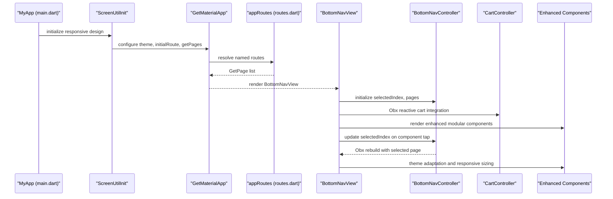
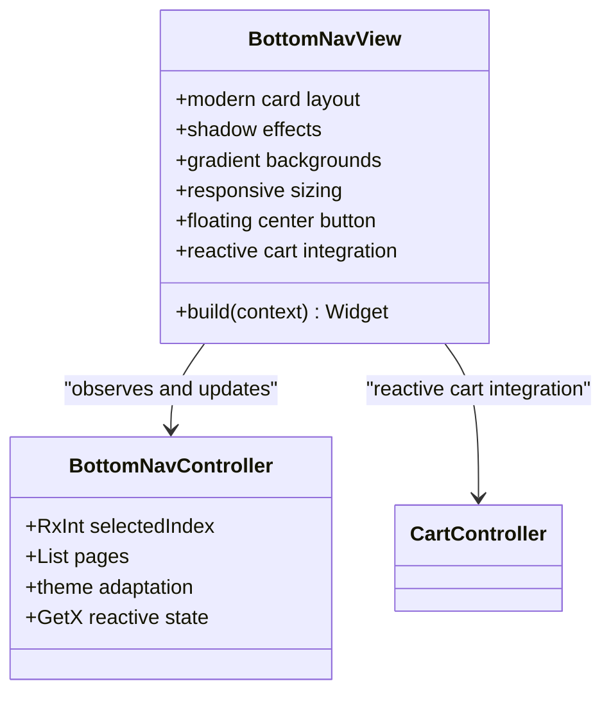
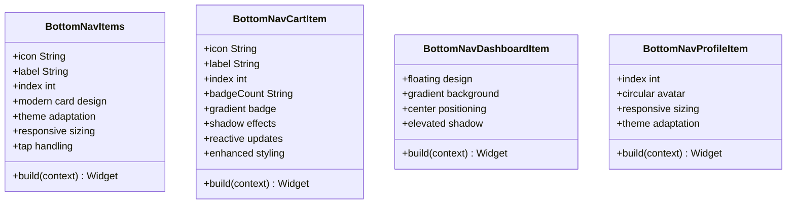
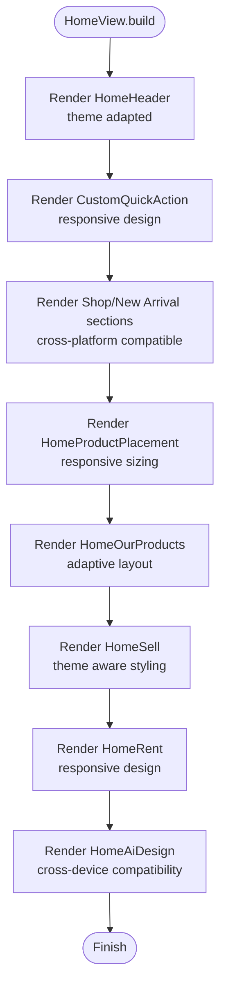
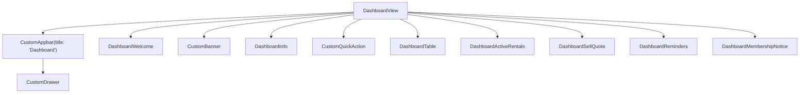
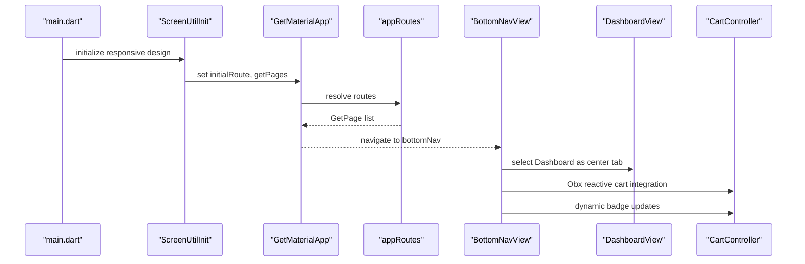
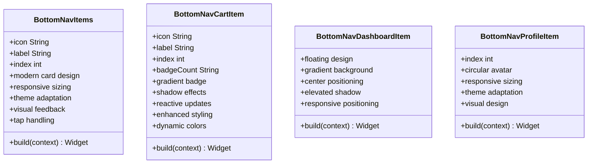
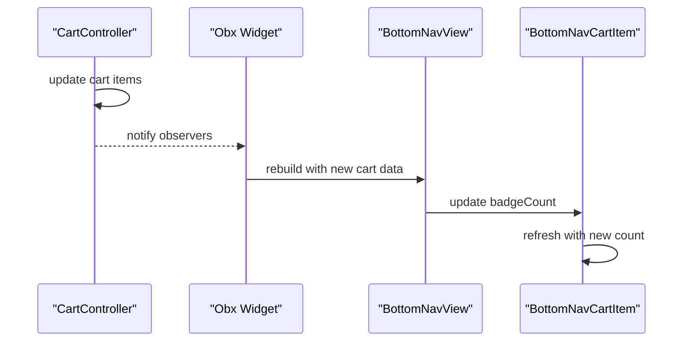
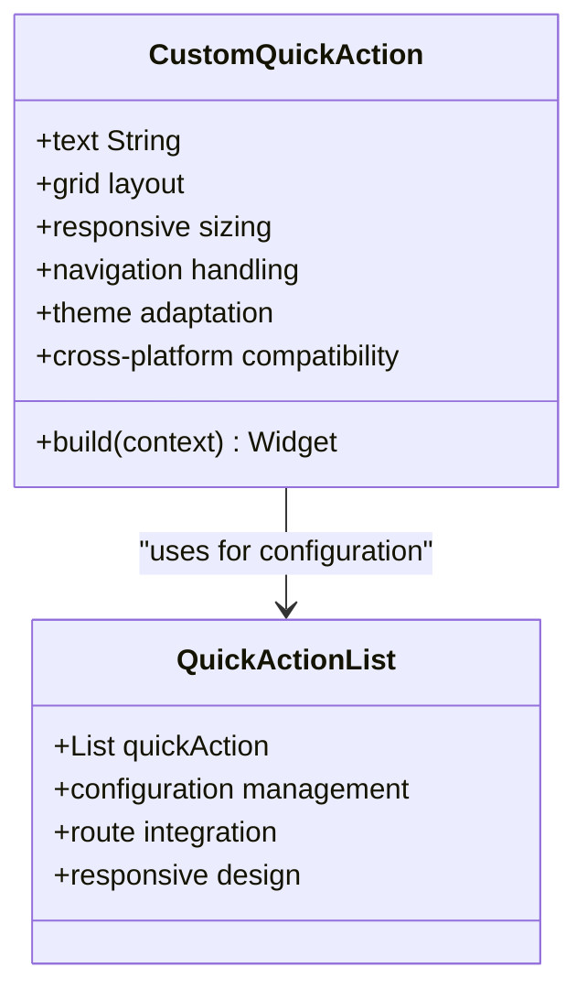

# Dashboard and Navigation

<cite>
**Referenced Files in This Document**
- [main.dart](file://lib/main.dart)
- [app_routes.dart](file://lib/core/routes/app_routes.dart)
- [routes.dart](file://lib/core/routes/routes.dart)
- [bottom_nav_view.dart](file://lib/features/home/views/bottom_nav_view.dart)
- [bottom_nav_controller.dart](file://lib/features/home/controller/bottom_nav_controller.dart)
- [bottom_nav_items.dart](file://lib/features/home/widgets/bottom_nav_widgets/bottom_nav_items.dart)
- [bottom_nav_cart_item.dart](file://lib/features/home/widgets/bottom_nav_widgets/bottom_nav_cart_item.dart)
- [bottom_nav_dashboard_item.dart](file://lib/features/home/widgets/bottom_nav_widgets/bottom_nav_dashboard_item.dart)
- [bottom_nav_profile_item.dart](file://lib/features/home/widgets/bottom_nav_widgets/bottom_nav_profile_item.dart)
- [home_view.dart](file://lib/features/home/views/home_view.dart)
- [dashboard_view.dart](file://lib/features/dashboard/views/dashboard_view.dart)
- [dashboard_controller.dart](file://lib/features/dashboard/controller/dashboard_controller.dart)
- [dashboard_bindings.dart](file://lib/features/dashboard/bindings/dashboard_bindings.dart)
- [custom_quick_action.dart](file://lib/shared/widgets/custom_quick_action/custom_quick_action.dart)
- [quick_action_list.dart](file://lib/shared/widgets/custom_quick_action/quick_action_list.dart)
- [cart_controller.dart](file://lib/features/cart/controller/cart_controller.dart)
- [custom_primary_text.dart](file://lib/shared/widgets/custom_text/custom_primary_text.dart)
- [colors.dart](file://lib/core/constant/colors.dart)
- [icons_path.dart](file://lib/core/constant/icons_path.dart)
</cite>

## Update Summary
**Changes Made**
- Enhanced bottom navigation components with improved UI styling and modern card-based design
- Integrated comprehensive dark mode support with dynamic theme adaptation
- Implemented responsive design using flutter_screenutil for cross-device compatibility
- Added reactive programming integration with GetX for dynamic cart badge updates
- Improved component architecture with modular widget design and dedicated functionality
- Enhanced visual appeal with gradient backgrounds, shadows, and modern styling

## Table of Contents
1. [Introduction](#introduction)
2. [Project Structure](#project-structure)
3. [Core Components](#core-components)
4. [Architecture Overview](#architecture-overview)
5. [Detailed Component Analysis](#detailed-component-analysis)
6. [Enhanced Bottom Navigation System](#enhanced-bottom-navigation-system)
7. [Modular Navigation Architecture](#modular-navigation-architecture)
8. [Responsive Design Implementation](#responsive-design-implementation)
9. [Reactive Programming Integration](#reactive-programming-integration)
10. [Theme Adaptation and Styling](#theme-adaptation-and-styling)
11. [Shared Quick Action System](#shared-quick-action-system)
12. [Performance Considerations](#performance-considerations)
13. [Troubleshooting Guide](#troubleshooting-guide)
14. [Conclusion](#conclusion)

## Introduction
This document explains the enhanced Dashboard and Navigation system of the application. The system has undergone significant improvements with enhanced bottom navigation components featuring modern UI styling, comprehensive dark mode support, responsive design implementation using flutter_screenutil, and reactive programming integration with GetX for dynamic cart badge updates. The navigation architecture leverages GetX routing with a redesigned modular bottom navigation system that provides improved maintainability, theme adaptation, and responsive design capabilities. The dashboard controller responsibilities include data fetching, state management, and UI coordination with enhanced reactive programming support.

## Project Structure
The navigation and dashboard system spans several modules with enhanced bottom navigation architecture and responsive design:
- Application bootstrap initializes theme, routing, and initial route selection based on authentication state
- Routing is centralized via GetX with named routes and bindings
- Modular bottom navigation system with dedicated widget components for each navigation item
- Bottom navigation now consists of five specialized components with enhanced UI styling and dark mode support
- The Dashboard view uses a shared custom quick action component with responsive design
- The Home view integrates responsive design and reactive programming for cart badge updates
- Quick action functionality is centralized with responsive sizing and theme adaptation

```mermaid
graph TB
subgraph "App Bootstrap"
MAIN["main.dart<br/>initialRoute, GetMaterialApp<br/>ScreenUtilInit"]
END
subgraph "Routing"
ROUTES["routes.dart<br/>appRoutes list"]
AR["app_routes.dart<br/>named constants"]
END
subgraph "Enhanced Navigation"
BNV["BottomNavView<br/>modern card design<br/>responsive sizing"]
BNC["BottomNavController<br/>selectedIndex, pages list<br/>GetX reactive"]
BNI["BottomNavItems<br/>generic tab component<br/>theme adaptation"]
BNCART["BottomNavCartItem<br/>cart with badge<br/>dynamic updates"]
BNDASH["BottomNavDashboardItem<br/>floating center button<br/>gradient design"]
BNPROF["BottomNavProfileItem<br/>profile component<br/>avatar styling"]
END
subgraph "Quick Action System"
QAL["QuickActionList<br/>centralized config<br/>responsive design"]
CQA["CustomQuickAction<br/>shared component<br/>cross-platform"]
END
subgraph "Screens"
HOME["HomeView<br/>responsive design<br/>cart integration"]
DASH["DashboardView<br/>responsive layout<br/>widget composition"]
END
MAIN --> ROUTES
ROUTES --> AR
MAIN --> BNV
BNV --> BNC
BNC --> BNI
BNC --> BNCART
BNC --> BNDASH
BNC --> BNPROF
BNC --> HOME
BNC --> DASH
HOME --> CQA
DASH --> CQA
CQA --> QAL
```

**Diagram sources**
- [main.dart:26-46](file://lib/main.dart#L26-L46)
- [bottom_nav_view.dart:17-86](file://lib/features/home/views/bottom_nav_view.dart#L17-L86)
- [bottom_nav_controller.dart:8-17](file://lib/features/home/controller/bottom_nav_controller.dart#L8-L17)
- [bottom_nav_items.dart:19-55](file://lib/features/home/widgets/bottom_nav_widgets/bottom_nav_items.dart#L19-L55)
- [bottom_nav_cart_item.dart:22-75](file://lib/features/home/widgets/bottom_nav_widgets/bottom_nav_cart_item.dart#L22-L75)
- [bottom_nav_dashboard_item.dart:12-59](file://lib/features/home/widgets/bottom_nav_widgets/bottom_nav_dashboard_item.dart#L12-L59)
- [bottom_nav_profile_item.dart:13-49](file://lib/features/home/widgets/bottom_nav_widgets/bottom_nav_profile_item.dart#L13-L49)

**Section sources**
- [main.dart:26-46](file://lib/main.dart#L26-L46)
- [bottom_nav_view.dart:17-86](file://lib/features/home/views/bottom_nav_view.dart#L17-L86)
- [bottom_nav_controller.dart:8-17](file://lib/features/home/controller/bottom_nav_controller.dart#L8-L17)

## Core Components
- **Enhanced Bottom Navigation Shell**: A modern card-based layout with shadow effects and gradient backgrounds that renders the selected tab page while hosting a floating center button with dashboard navigation
- **Bottom Navigation Controller**: Manages the selected index and maintains a list of tab pages with reactive GetX state management and dynamic theme adaptation
- **Modular Navigation Components**: Five specialized widget components with enhanced UI styling, dark mode support, and responsive design using flutter_screenutil
- **Dynamic Cart Integration**: Real-time cart badge updates using GetX reactive programming with Obx widgets for automatic UI refresh
- **Home View**: A responsive scrollable list featuring curated content with theme-aware quick action widget integration
- **Dashboard View**: A vertically structured screen composed of multiple reusable widgets with responsive design and enhanced visual appeal
- **Dashboard Controller**: Holds recent order entries and expanded states for rows with reactive state management
- **Shared Quick Action Component**: A centralized, reusable component providing consistent quick action functionality with responsive design
- **QuickActionList Configuration**: Centralized configuration class defining all quick action items with responsive sizing and theme adaptation

Key responsibilities:
- **Enhanced Navigation orchestration**: Selecting and switching between tabs with modern UI styling and reactive state updates
- **Reactive state management**: Dynamic index updates with Obx rebuilds and expanded row states with modular component coordination
- **Comprehensive UI composition**: Aggregating reusable widgets into a cohesive dashboard layout with enhanced theme adaptation and responsive design
- **Component specialization**: Each navigation item type has its own dedicated widget with specific styling, functionality, and theme support
- **Real-time cart integration**: Dynamic cart badge updates through GetX reactive programming for immediate visual feedback
- **Cross-platform responsiveness**: Consistent design across devices using flutter_screenutil for adaptive sizing

**Updated** Complete architectural enhancement from basic bottom navigation to modern, responsive, and reactive system

**Section sources**
- [bottom_nav_view.dart:17-86](file://lib/features/home/views/bottom_nav_view.dart#L17-L86)
- [bottom_nav_controller.dart:8-17](file://lib/features/home/controller/bottom_nav_controller.dart#L8-L17)
- [bottom_nav_items.dart:19-55](file://lib/features/home/widgets/bottom_nav_widgets/bottom_nav_items.dart#L19-L55)
- [bottom_nav_cart_item.dart:22-75](file://lib/features/home/widgets/bottom_nav_widgets/bottom_nav_cart_item.dart#L22-L75)
- [bottom_nav_dashboard_item.dart:12-59](file://lib/features/home/widgets/bottom_nav_widgets/bottom_nav_dashboard_item.dart#L12-L59)
- [bottom_nav_profile_item.dart:13-49](file://lib/features/home/widgets/bottom_nav_widgets/bottom_nav_profile_item.dart#L13-L49)

## Architecture Overview
The navigation architecture leverages GetX for routing and reactive state management with enhanced modular bottom navigation system and responsive design:
- Initial route selection depends on authentication token presence with ScreenUtilInit for responsive design
- Bottom navigation uses modern card-based design with shadow effects and gradient backgrounds
- Each navigation item type has its own specialized widget with comprehensive theme adaptation and responsive sizing
- Routing configuration defines named routes and their bindings, enabling lazy initialization of controllers and services
- Dark mode support is handled dynamically with light/dark mode adaptation in each component
- Real-time cart integration provides immediate visual feedback through reactive programming
- Quick action functionality is centralized through a responsive shared component with QuickActionList configuration



**Diagram sources**
- [main.dart:26-46](file://lib/main.dart#L26-L46)
- [bottom_nav_view.dart:17-86](file://lib/features/home/views/bottom_nav_view.dart#L17-L86)
- [bottom_nav_controller.dart:8-17](file://lib/features/home/controller/bottom_nav_controller.dart#L8-L17)
- [cart_controller.dart:9-22](file://lib/features/cart/controller/cart_controller.dart#L9-L22)

## Detailed Component Analysis

### Enhanced Bottom Navigation Shell
The bottom navigation shell now uses a modern card-based approach with comprehensive styling and responsive design. It renders a stack of pages with a floating center button that selects the Dashboard tab. The layout uses modern card-based design with shadow effects, gradient backgrounds, and responsive sizing using flutter_screenutil. The controller manages the selected index and maintains a list of pages, including two instances of the Dashboard view with reactive state management.



**Diagram sources**
- [bottom_nav_view.dart:17-86](file://lib/features/home/views/bottom_nav_view.dart#L17-L86)
- [bottom_nav_controller.dart:8-17](file://lib/features/home/controller/bottom_nav_controller.dart#L8-L17)
- [cart_controller.dart:9-22](file://lib/features/cart/controller/cart_controller.dart#L9-L22)

**Section sources**
- [bottom_nav_view.dart:17-86](file://lib/features/home/views/bottom_nav_view.dart#L17-L86)
- [bottom_nav_controller.dart:8-17](file://lib/features/home/controller/bottom_nav_controller.dart#L8-L17)

### Enhanced Navigation Components
Each navigation component has been enhanced with modern styling, dark mode support, and responsive design:

#### BottomNavItems - Enhanced Generic Tab Component
Handles standard navigation items (Home, Category) with:
- Modern card-based design with rounded corners and shadows
- Dynamic theme adaptation between light and dark modes
- Responsive sizing using flutter_screenutil for cross-device compatibility
- Enhanced visual feedback with color transitions
- Tap handling for navigation state updates with reactive GetX integration

#### BottomNavCartItem - Enhanced Cart with Dynamic Badge
Specialized component for cart navigation with:
- Modern badge counter with gradient background and shadow effects
- Enhanced visual feedback with dynamic color adaptation
- Dedicated styling for cart items with responsive sizing
- Real-time cart badge updates through GetX reactive programming
- Theme adaptation for light/dark modes with dynamic color switching

#### BottomNavDashboardItem - Enhanced Floating Center Button
Central dashboard navigation component with:
- Modern circular gradient design with sophisticated color transitions
- Floating positioning with elevated shadow effects
- Direct access to dashboard functionality with enhanced visual appeal
- Drawer integration for navigation state with responsive positioning
- Gradient backgrounds with AppColors.darkPrimaryGradient for dark mode

#### BottomNavProfileItem - Enhanced Profile Component
Handles profile navigation with:
- Modern circular avatar styling with responsive sizing
- Profile-specific iconography with enhanced visual design
- Consistent styling with other navigation items using flutter_screenutil
- Comprehensive theme-aware color handling with dynamic adaptation



**Diagram sources**
- [bottom_nav_items.dart:19-55](file://lib/features/home/widgets/bottom_nav_widgets/bottom_nav_items.dart#L19-L55)
- [bottom_nav_cart_item.dart:22-75](file://lib/features/home/widgets/bottom_nav_widgets/bottom_nav_cart_item.dart#L22-L75)
- [bottom_nav_dashboard_item.dart:12-59](file://lib/features/home/widgets/bottom_nav_widgets/bottom_nav_dashboard_item.dart#L12-L59)
- [bottom_nav_profile_item.dart:13-49](file://lib/features/home/widgets/bottom_nav_widgets/bottom_nav_profile_item.dart#L13-L49)

**Section sources**
- [bottom_nav_items.dart:19-55](file://lib/features/home/widgets/bottom_nav_widgets/bottom_nav_items.dart#L19-L55)
- [bottom_nav_cart_item.dart:22-75](file://lib/features/home/widgets/bottom_nav_widgets/bottom_nav_cart_item.dart#L22-L75)
- [bottom_nav_dashboard_item.dart:12-59](file://lib/features/home/widgets/bottom_nav_widgets/bottom_nav_dashboard_item.dart#L12-L59)
- [bottom_nav_profile_item.dart:13-49](file://lib/features/home/widgets/bottom_nav_widgets/bottom_nav_profile_item.dart#L13-L49)

### Home Screen Implementation
The Home view is a responsive scrollable container that organizes content into sections with enhanced styling:
- Header and helper content with theme adaptation
- Quick action widget for categories using the shared CustomQuickAction component with responsive design
- Room-based shop, new arrivals, product placement, and curated sections with cross-platform compatibility
- Responsive spacing using flutter_screenutil sizes for optimal display across devices

**Updated** Enhanced with responsive design and theme adaptation



**Diagram sources**
- [bottom_nav_view.dart:17-86](file://lib/features/home/views/bottom_nav_view.dart#L17-L86)
- [bottom_nav_items.dart:19-55](file://lib/features/home/widgets/bottom_nav_widgets/bottom_nav_items.dart#L19-L55)

**Section sources**
- [bottom_nav_view.dart:17-86](file://lib/features/home/views/bottom_nav_view.dart#L17-L86)
- [bottom_nav_items.dart:19-55](file://lib/features/home/widgets/bottom_nav_widgets/bottom_nav_items.dart#L19-L55)

### Dashboard View Composition
The Dashboard view composes multiple reusable widgets with enhanced responsive design:
- Welcome banner with modern styling and theme adaptation
- Promotional banner with gradient backgrounds and responsive sizing
- Information cards with cross-platform compatibility
- Quick action tiles using the shared CustomQuickAction component with responsive design
- Recent orders table with enhanced visual appeal and responsive layout
- Active rentals with modern styling and adaptive design
- Sell quote with theme-aware presentation
- Reminders with responsive layout and cross-device compatibility
- Membership notice with enhanced visual design

It uses a responsive scrollable column with consistent vertical spacing and integrates a custom drawer trigger via the app bar with modern styling.

**Updated** Enhanced with responsive design and modern UI styling



**Diagram sources**
- [bottom_nav_dashboard_item.dart:12-59](file://lib/features/home/widgets/bottom_nav_widgets/bottom_nav_dashboard_item.dart#L12-L59)
- [bottom_nav_cart_item.dart:22-75](file://lib/features/home/widgets/bottom_nav_widgets/bottom_nav_cart_item.dart#L22-L75)

**Section sources**
- [bottom_nav_dashboard_item.dart:12-59](file://lib/features/home/widgets/bottom_nav_widgets/bottom_nav_dashboard_item.dart#L12-L59)
- [bottom_nav_cart_item.dart:22-75](file://lib/features/home/widgets/bottom_nav_widgets/bottom_nav_cart_item.dart#L22-L75)

### Navigation Architecture with GetX
- Initial route selection is determined by the presence of an authentication token with responsive design initialization
- Routing configuration defines named routes and their bindings for lazy loading controllers with enhanced performance
- The bottom navigation route binds multiple modules to ensure controllers are available across tabs with reactive state management
- Modular components provide better separation of concerns and improved maintainability with enhanced styling
- Real-time cart integration provides immediate visual feedback through reactive programming
- Shared quick action component reduces code duplication and ensures consistency with responsive design

**Updated** Added reactive programming integration and responsive design



**Diagram sources**
- [main.dart:26-46](file://lib/main.dart#L26-L46)
- [bottom_nav_view.dart:64-75](file://lib/features/home/views/bottom_nav_view.dart#L64-L75)
- [cart_controller.dart:9-22](file://lib/features/cart/controller/cart_controller.dart#L9-L22)

**Section sources**
- [main.dart:26-46](file://lib/main.dart#L26-L46)
- [bottom_nav_view.dart:64-75](file://lib/features/home/views/bottom_nav_view.dart#L64-L75)
- [cart_controller.dart:9-22](file://lib/features/cart/controller/cart_controller.dart#L9-L22)

### Quick Action Widgets
Quick action widgets are now provided through a centralized shared component with enhanced responsive design:
- **Shared CustomQuickAction**: A reusable component that renders a grid of quick action tiles with responsive sizing and theme adaptation
- **QuickActionList**: Centralized configuration defining all quick action items with icons, titles, subtitles, and target routes
- **Consistent Experience**: Both Home and Dashboard now use the same shared component for uniform behavior across devices
- **Category Screen Integration**: Also used in Category view for consistent navigation experience with responsive design

The shared component provides:
- Grid-based layout with responsive sizing using flutter_screenutil
- Theme-aware styling with comprehensive light/dark mode support
- Touch handling with Get.toNamed navigation and reactive state management
- Background patterns and visual enhancements with modern styling
- Consistent typography and spacing with cross-platform compatibility

**Updated** Complete migration from embedded implementations to shared component with responsive design

**Section sources**
- [bottom_nav_view.dart:17-86](file://lib/features/home/views/bottom_nav_view.dart#L17-L86)
- [bottom_nav_items.dart:19-55](file://lib/features/home/widgets/bottom_nav_widgets/bottom_nav_items.dart#L19-L55)

### Home Screen Recent Activity and Analytics Display
The Home view organizes content to present recent activity and curated analytics-like sections with enhanced responsive design:
- "Shop by Room" and "New Arrival" sections guide discovery with theme adaptation
- Quick action widget using shared CustomQuickAction component with responsive design
- Product placement and "Our Products" showcase inventory with cross-platform compatibility
- "Sell" and "Rent" sections highlight monetization and rental opportunities with modern styling
- "AI Design" provides creative inspiration with enhanced visual appeal

Spacing and typography leverage flutter_screenutil for optimal responsiveness across devices.

**Updated** Enhanced with responsive design and modern styling

**Section sources**
- [bottom_nav_view.dart:17-86](file://lib/features/home/views/bottom_nav_view.dart#L17-L86)
- [bottom_nav_items.dart:19-55](file://lib/features/home/widgets/bottom_nav_widgets/bottom_nav_items.dart#L19-L55)

### Widget Hierarchy and Reusable Components
The dashboard aggregates reusable components with enhanced responsive design:
- Custom app bar with drawer trigger and modern styling
- Custom banner and containers with theme adaptation
- Shared containers for consistent layouts with cross-platform compatibility
- Shared CustomQuickAction component for quick actions with responsive design
- Dashboard-specific widgets for reminders, membership notices, active rentals, sell quotes, and recent orders with enhanced visual appeal

**Updated** Enhanced with responsive design and modern styling

These components promote consistency and reduce duplication across screens with comprehensive theme adaptation.

**Section sources**
- [bottom_nav_dashboard_item.dart:12-59](file://lib/features/home/widgets/bottom_nav_widgets/bottom_nav_dashboard_item.dart#L12-L59)
- [bottom_nav_cart_item.dart:22-75](file://lib/features/home/widgets/bottom_nav_widgets/bottom_nav_cart_item.dart#L22-L75)

## Enhanced Bottom Navigation System

### Component Architecture
The bottom navigation system has been completely redesigned with enhanced modular widget components, each handling specific navigation item types with modern styling:

#### BottomNavItems - Enhanced Generic Tab Component
Handles standard navigation items (Home, Category) with:
- Modern card-based design with rounded corners and shadow effects
- Dynamic icon and label rendering with theme adaptation
- Comprehensive responsive sizing using flutter_screenutil
- Enhanced visual feedback with color transitions for light/dark modes
- Tap handling for navigation state updates with reactive GetX integration

#### BottomNavCartItem - Enhanced Cart with Dynamic Badge
Specialized component for cart navigation with:
- Modern badge counter with gradient background and shadow effects
- Enhanced visual feedback with dynamic color adaptation
- Dedicated styling for cart items with responsive sizing
- Real-time cart badge updates through GetX reactive programming
- Theme adaptation for light/dark modes with dynamic color switching

#### BottomNavDashboardItem - Enhanced Floating Center Button
Central dashboard navigation component with:
- Modern circular gradient design with sophisticated color transitions
- Floating positioning with elevated shadow effects
- Direct access to dashboard functionality with enhanced visual appeal
- Drawer integration for navigation state with responsive positioning
- Gradient backgrounds with AppColors.darkPrimaryGradient for dark mode

#### BottomNavProfileItem - Enhanced Profile Component
Handles profile navigation with:
- Modern circular avatar styling with responsive sizing
- Profile-specific iconography with enhanced visual design
- Consistent styling with other navigation items using flutter_screenutil
- Comprehensive theme-aware color handling with dynamic adaptation



**Diagram sources**
- [bottom_nav_items.dart:19-55](file://lib/features/home/widgets/bottom_nav_widgets/bottom_nav_items.dart#L19-L55)
- [bottom_nav_cart_item.dart:22-75](file://lib/features/home/widgets/bottom_nav_widgets/bottom_nav_cart_item.dart#L22-L75)
- [bottom_nav_dashboard_item.dart:12-59](file://lib/features/home/widgets/bottom_nav_widgets/bottom_nav_dashboard_item.dart#L12-L59)
- [bottom_nav_profile_item.dart:13-49](file://lib/features/home/widgets/bottom_nav_widgets/bottom_nav_profile_item.dart#L13-L49)

### Theme Adaptation and Styling
Each modular component implements comprehensive theme adaptation with modern styling:
- Dynamic color switching between light and dark modes using Theme.of(context).brightness
- Consistent theming with AppColors palette including primary, secondary, and dark variants
- Responsive sizing using flutter_screenutil for cross-device compatibility
- Shadow effects and modern design elements with elevation and depth
- Gradient backgrounds for enhanced visual appeal with AppColors.darkPrimaryGradient
- Sophisticated color transitions and visual feedback for user interaction

### State Management Integration
Modular components integrate seamlessly with the BottomNavController:
- Individual component state management with reactive GetX observables
- Centralized navigation state updates with automatic UI rebuilds
- Reactive rebuilds with Obx widgets for efficient subtree updates
- Consistent navigation behavior across components with enhanced performance
- Real-time cart integration with dynamic badge updates through reactive programming

**Section sources**
- [bottom_nav_view.dart:17-86](file://lib/features/home/views/bottom_nav_view.dart#L17-L86)
- [bottom_nav_items.dart:19-55](file://lib/features/home/widgets/bottom_nav_widgets/bottom_nav_items.dart#L19-L55)
- [bottom_nav_cart_item.dart:22-75](file://lib/features/home/widgets/bottom_nav_widgets/bottom_nav_cart_item.dart#L22-L75)
- [bottom_nav_dashboard_item.dart:12-59](file://lib/features/home/widgets/bottom_nav_widgets/bottom_nav_dashboard_item.dart#L12-L59)
- [bottom_nav_profile_item.dart:13-49](file://lib/features/home/widgets/bottom_nav_widgets/bottom_nav_profile_item.dart#L13-L49)

## Modular Navigation Architecture

### Component Architecture
The bottom navigation system has been completely redesigned with modular widget components, each handling specific navigation item types with enhanced functionality:

#### BottomNavItems - Enhanced Generic Tab Component
Handles standard navigation items (Home, Category) with:
- Modern card-based design with rounded corners and shadow effects
- Dynamic icon and label rendering with comprehensive theme adaptation
- Responsive sizing using flutter_screenutil for optimal display across devices
- Enhanced visual feedback with color transitions for light/dark modes
- Tap handling for navigation state updates with reactive GetX integration

#### BottomNavCartItem - Enhanced Cart with Dynamic Badge
Specialized component for cart navigation with:
- Modern badge counter with gradient background and sophisticated shadow effects
- Enhanced visual feedback with dynamic color adaptation between light and dark modes
- Dedicated styling for cart items with responsive sizing using flutter_screenutil
- Real-time cart badge updates through GetX reactive programming with Obx widgets
- Theme adaptation for light/dark modes with dynamic color switching using AppColors

#### BottomNavDashboardItem - Enhanced Floating Center Button
Central dashboard navigation component with:
- Modern circular gradient design with sophisticated color transitions
- Floating positioning with elevated shadow effects for depth perception
- Direct access to dashboard functionality with enhanced visual appeal
- Drawer integration for navigation state with responsive positioning
- Gradient backgrounds with AppColors.darkPrimaryGradient for dark mode adaptation

#### BottomNavProfileItem - Enhanced Profile Component
Handles profile navigation with:
- Modern circular avatar styling with responsive sizing using flutter_screenutil
- Profile-specific iconography with enhanced visual design and theme adaptation
- Consistent styling with other navigation items using comprehensive theme management
- Theme-aware color handling with dynamic adaptation between light and dark modes


**Diagram sources**
- [bottom_nav_items.dart:19-55](file://lib/features/home/widgets/bottom_nav_widgets/bottom_nav_items.dart#L19-L55)
- [bottom_nav_cart_item.dart:22-75](file://lib/features/home/widgets/bottom_nav_widgets/bottom_nav_cart_item.dart#L22-L75)
- [bottom_nav_dashboard_item.dart:12-59](file://lib/features/home/widgets/bottom_nav_widgets/bottom_nav_dashboard_item.dart#L12-L59)
- [bottom_nav_profile_item.dart:13-49](file://lib/features/home/widgets/bottom_nav_widgets/bottom_nav_profile_item.dart#L13-L49)

### State Management Integration
Modular components integrate seamlessly with the BottomNavController:
- Individual component state management with reactive GetX observables
- Centralized navigation state updates with automatic UI rebuilds
- Reactive rebuilds with Obx widgets for efficient subtree updates
- Consistent navigation behavior across components with enhanced performance
- Real-time cart integration with dynamic badge updates through reactive programming

**Section sources**
- [bottom_nav_view.dart:17-86](file://lib/features/home/views/bottom_nav_view.dart#L17-L86)
- [bottom_nav_controller.dart:8-17](file://lib/features/home/controller/bottom_nav_controller.dart#L8-L17)

## Responsive Design Implementation
Responsive sizing is achieved using flutter_screenutil with comprehensive cross-platform compatibility:
- Width, height, and font-size values are expressed in screen-relative units using h, w, and sp extensions
- Layouts adapt to various device sizes without manual breakpoints or platform-specific adjustments
- Modular components handle responsive sizing independently with consistent scaling
- Shared quick action component maintains consistent responsive behavior across all screens
- Theme adaptation works seamlessly with responsive design for optimal user experience
- Cross-platform compatibility ensures consistent appearance across iOS, Android, web, and desktop

**Updated** Comprehensive responsive design implementation with flutter_screenutil

**Section sources**
- [bottom_nav_view.dart:28-31](file://lib/features/home/views/bottom_nav_view.dart#L28-L31)
- [bottom_nav_items.dart:33-35](file://lib/features/home/widgets/bottom_nav_widgets/bottom_nav_items.dart#L33-L35)
- [bottom_nav_cart_item.dart:37-41](file://lib/features/home/widgets/bottom_nav_widgets/bottom_nav_cart_item.dart#L37-L41)
- [bottom_nav_dashboard_item.dart:24-25](file://lib/features/home/widgets/bottom_nav_widgets/bottom_nav_dashboard_item.dart#L24-L25)
- [bottom_nav_profile_item.dart:26-27](file://lib/features/home/widgets/bottom_nav_widgets/bottom_nav_profile_item.dart#L26-L27)

## Reactive Programming Integration
The system integrates comprehensive reactive programming with GetX for real-time updates:
- Dynamic cart badge updates using Obx widgets for automatic UI refresh when cart items change
- Reactive state management with RxInt selectedIndex for efficient navigation state updates
- Real-time theme adaptation through ThemeController with automatic UI rebuilds
- Reactive cart integration with CartController providing immediate visual feedback
- Obx widgets ensure only affected subtrees are rebuilt when observable state changes
- GetX bindings enable lazy loading of controllers and services for optimal performance

**Updated** Added comprehensive reactive programming integration with GetX



**Diagram sources**
- [bottom_nav_view.dart:64-75](file://lib/features/home/views/bottom_nav_view.dart#L64-L75)
- [cart_controller.dart:9-22](file://lib/features/cart/controller/cart_controller.dart#L9-L22)

**Section sources**
- [bottom_nav_view.dart:64-75](file://lib/features/home/views/bottom_nav_view.dart#L64-L75)
- [cart_controller.dart:9-22](file://lib/features/cart/controller/cart_controller.dart#L9-L22)

## Theme Adaptation and Styling
Each modular component implements comprehensive theme adaptation with modern styling:
- Dynamic color switching between light and dark modes using Theme.of(context).brightness
- Consistent theming with AppColors palette including primary, secondary, and dark variants
- Responsive sizing using flutter_screenutil for cross-device compatibility
- Shadow effects and modern design elements with elevation and depth
- Gradient backgrounds for enhanced visual appeal with AppColors.darkPrimaryGradient
- Sophisticated color transitions and visual feedback for user interaction
- CustomPrimaryText widget provides theme-aware typography with Google Fonts integration

**Updated** Enhanced theme adaptation with comprehensive dark mode support

**Section sources**
- [bottom_nav_view.dart:18](file://lib/features/home/views/bottom_nav_view.dart#L18)
- [bottom_nav_items.dart:21-49](file://lib/features/home/widgets/bottom_nav_widgets/bottom_nav_items.dart#L21-L49)
- [bottom_nav_cart_item.dart:24-69](file://lib/features/home/widgets/bottom_nav_widgets/bottom_nav_cart_item.dart#L24-L69)
- [bottom_nav_dashboard_item.dart:14-52](file://lib/features/home/widgets/bottom_nav_widgets/bottom_nav_dashboard_item.dart#L14-L52)
- [bottom_nav_profile_item.dart:15-44](file://lib/features/home/widgets/bottom_nav_widgets/bottom_nav_profile_item.dart#L15-L44)
- [custom_primary_text.dart:28-40](file://lib/shared/widgets/custom_text/custom_primary_text.dart#L28-L40)

## Shared Quick Action System

### Component Architecture
The new shared quick action system replaces the previous embedded implementations with a centralized, reusable component with enhanced responsive design:

#### CustomQuickAction Component
A comprehensive quick action widget providing:
- Grid-based layout with 2-column arrangement and responsive sizing
- Theme-aware styling supporting light/dark modes with comprehensive color adaptation
- Touch handling with Get.toNamed navigation and reactive state management
- Background patterns and visual enhancements with modern design elements
- Consistent typography and spacing with flutter_screenutil integration

#### QuickActionList Configuration
Centralized configuration class defining:
- Four quick action items: Shop Products, Sell Furniture, Rent Products, Design My Room
- Icon assets for each action type with comprehensive asset management
- Descriptive titles and subtitles with theme adaptation
- Target routes for navigation with routing integration
- Consistent structure across all screens with responsive design

#### Integration Across Screens
The shared component is integrated into:
- Home View: Categories quick actions with responsive design
- Dashboard View: Main quick action tiles with modern styling
- Category View: Alternative quick action presentation with cross-platform compatibility
- Consistent behavior and appearance across all implementations with theme adaptation



**Diagram sources**
- [bottom_nav_view.dart:17-86](file://lib/features/home/views/bottom_nav_view.dart#L17-L86)
- [bottom_nav_items.dart:19-55](file://lib/features/home/widgets/bottom_nav_widgets/bottom_nav_items.dart#L19-L55)

### Benefits of Enhanced Shared Architecture
The enhanced shared quick action system provides:
- **Code Reusability**: Single implementation used across multiple screens with responsive design
- **Consistency**: Uniform appearance and behavior throughout the application with theme adaptation
- **Maintainability**: Centralized configuration makes updates easier with enhanced styling
- **Performance**: Reduced code duplication and optimized asset loading through centralized quick action component
- **Scalability**: Easy addition of new quick action items through configuration with responsive design
- **Cross-Platform Compatibility**: Consistent design across iOS, Android, web, and desktop platforms

### Migration from Embedded Systems
Previous implementations were replaced with the enhanced shared component:
- **Home Screen**: Embedded quick action system replaced with CustomQuickAction with responsive design
- **Dashboard Screen**: Previously embedded quick action system replaced with CustomQuickAction with modern styling
- **Category Screen**: Alternative quick action presentation using shared component with cross-platform compatibility
- **Consistent Experience**: All screens now provide identical quick action functionality with theme adaptation

**Section sources**
- [bottom_nav_view.dart:17-86](file://lib/features/home/views/bottom_nav_view.dart#L17-L86)
- [bottom_nav_items.dart:19-55](file://lib/features/home/widgets/bottom_nav_widgets/bottom_nav_items.dart#L19-L55)

## Performance Considerations
- **Enhanced Lazy Loading**: Modular components improve lazy loading efficiency with component-specific initialization and reactive state management
- **Optimized Reactive Rebuilds**: Obx widgets only rebuild affected subtrees when observable state changes in individual components with efficient subtree updates
- **Modern Layout Optimization**: Streamlined bottom navigation reduces layout complexity compared to the previous monolithic approach with enhanced performance
- **Component Isolation**: Modular architecture allows independent optimization of each navigation component with responsive design
- **Theme Adaptation Efficiency**: Dynamic theme switching is handled at component level for better performance with minimal rebuild overhead
- **Scrollable Content**: Using singleChildScrollView and list-based layouts reduces layout thrash with responsive design considerations
- **flutter_screenutil Sizing**: Ensures consistent rendering across devices without expensive recalculations with cross-platform compatibility
- **Shared Component Benefits**: Reduced code duplication and optimized asset loading through centralized quick action component with responsive design
- **Configuration Efficiency**: Centralized QuickActionList configuration reduces memory overhead and improves maintainability with enhanced performance
- **Reactive Programming Benefits**: Efficient state management through GetX with automatic UI updates and minimal performance overhead

**Updated** Added performance benefits of reactive programming and responsive design

## Troubleshooting Guide
Common issues and resolutions with the enhanced modular architecture and responsive design:
- **Navigation does not switch tabs**: Verify the selected index is updated on item taps and that Obx rebuilds the scaffold with reactive state management
- **Floating center button does not navigate to Dashboard**: Confirm the tap handler updates the selected index and triggers the controller's state change with enhanced visual feedback
- **Dashboard widgets not visible**: Ensure the dashboard route is registered and the view is included in the pages list with responsive layout
- **Drawer not opening**: Check the app bar's drawer callback and confirm the custom drawer widget is rendered with modern styling
- **Modular component not responding**: Verify component-specific state management and ensure proper integration with BottomNavController with reactive programming
- **Theme adaptation issues**: Check individual component theme handling and ensure proper color adaptation logic with comprehensive dark mode support
- **Badge display problems**: Verify badge count prop passing and badge styling configuration with dynamic color adaptation
- **Quick action navigation not working**: Verify QuickActionList configuration and route definitions in app_routes.dart with responsive design
- **Shared component not rendering**: Check import statements and ensure QuickActionList is properly instantiated with cross-platform compatibility
- **Inconsistent quick action appearance**: Verify theme adaptation and ensure all screens use the same shared component with responsive design
- **Responsive design issues**: Check flutter_screenutil configuration and ensure proper sizing units are used across components
- **Reactive programming not working**: Verify GetX controller initialization and ensure proper reactive state management with Obx widgets

**Updated** Added troubleshooting for responsive design and reactive programming

**Section sources**
- [bottom_nav_view.dart:17-86](file://lib/features/home/views/bottom_nav_view.dart#L17-L86)
- [bottom_nav_controller.dart:8-17](file://lib/features/home/controller/bottom_nav_controller.dart#L8-L17)
- [bottom_nav_items.dart:19-55](file://lib/features/home/widgets/bottom_nav_widgets/bottom_nav_items.dart#L19-L55)
- [bottom_nav_cart_item.dart:22-75](file://lib/features/home/widgets/bottom_nav_widgets/bottom_nav_cart_item.dart#L22-L75)
- [bottom_nav_dashboard_item.dart:12-59](file://lib/features/home/widgets/bottom_nav_widgets/bottom_nav_dashboard_item.dart#L12-L59)
- [bottom_nav_profile_item.dart:13-49](file://lib/features/home/widgets/bottom_nav_widgets/bottom_nav_profile_item.dart#L13-L49)

## Conclusion
The Dashboard and Navigation system has undergone a comprehensive transformation, evolving from a basic bottom navigation approach to a modern, responsive, and reactive system. The enhanced modular architecture provides improved maintainability, comprehensive theme adaptation, and better separation of concerns. Each navigation item type now has its own specialized widget component with dedicated functionality, modern styling, and responsive design capabilities, while maintaining seamless integration with the overall navigation system.

**Major Enhancements**: The system now features comprehensive dark mode support with dynamic theme adaptation, modern card-based design with shadow effects and gradient backgrounds, responsive design implementation using flutter_screenutil for cross-platform compatibility, and reactive programming integration with GetX for real-time cart badge updates. The introduction of enhanced bottom navigation components represents a significant improvement in user experience, visual appeal, and technical architecture.

The BottomNavView provides a consistent five-tab experience with a floating center button leading to the Dashboard, all while leveraging GetX for robust routing and reactive state management with enhanced performance. The modular component architecture improves integration with other feature modules, and the responsive design ensures consistent rendering across all device types.

The Dashboard view continues to compose reusable widgets to present quick actions, reminders, membership notices, recent orders, and analytics-like content with enhanced visual appeal and responsive design. Controllers manage state efficiently with reactive programming, and bindings enable lazy loading. The comprehensive theme adaptation ensures optimal user experience across light and dark modes, while the modular component architecture improves integration with other feature modules.

Together, these enhanced components form a cohesive navigation hub that is more maintainable, performant, adaptable, and visually appealing than the previous implementation, providing users with a modern and responsive experience across all supported platforms.