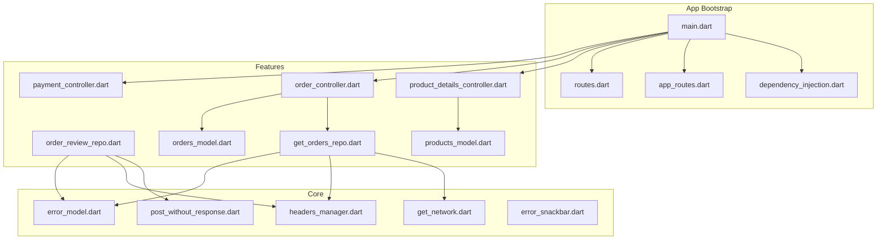
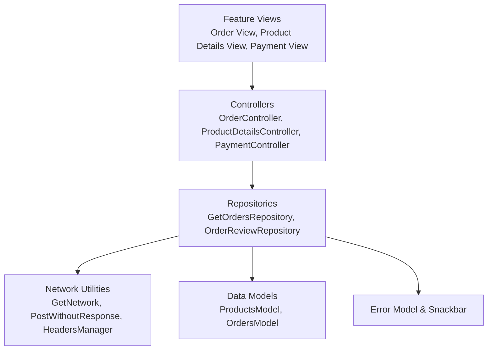
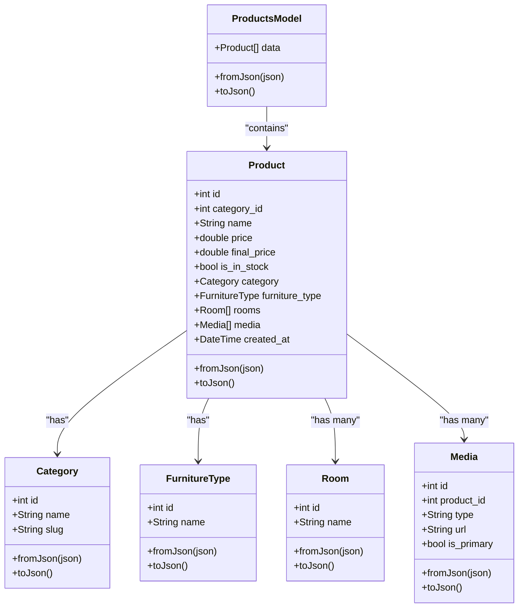
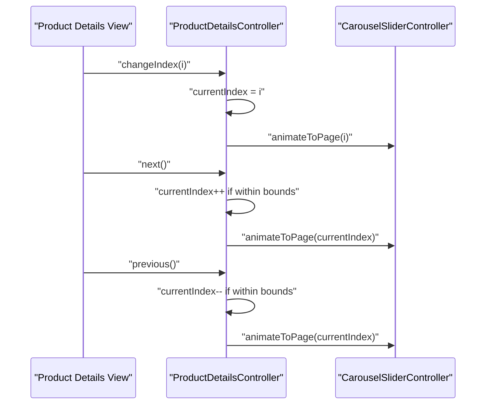
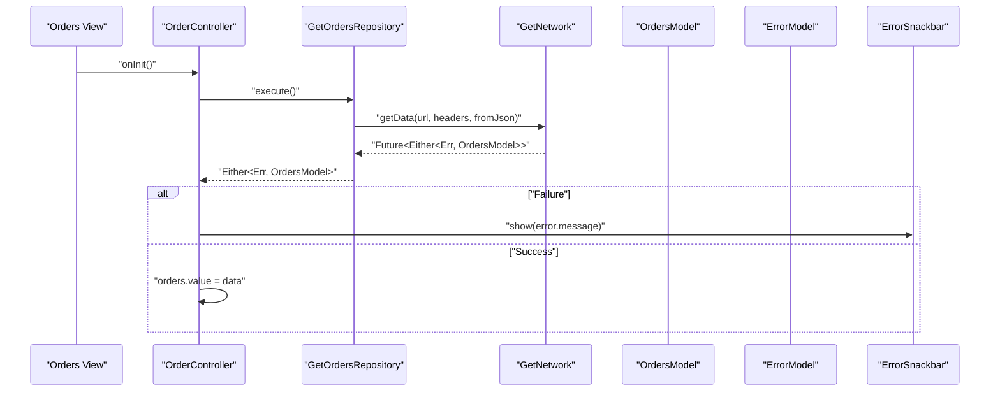
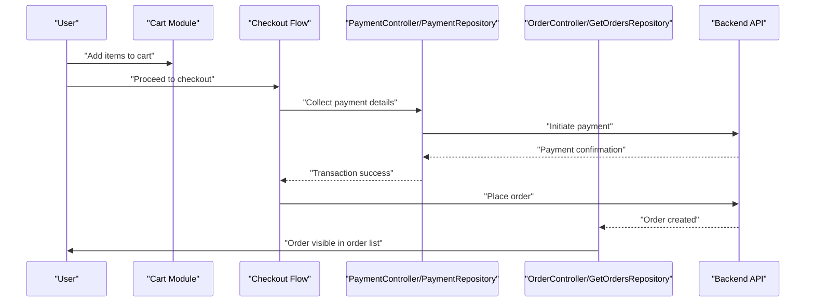
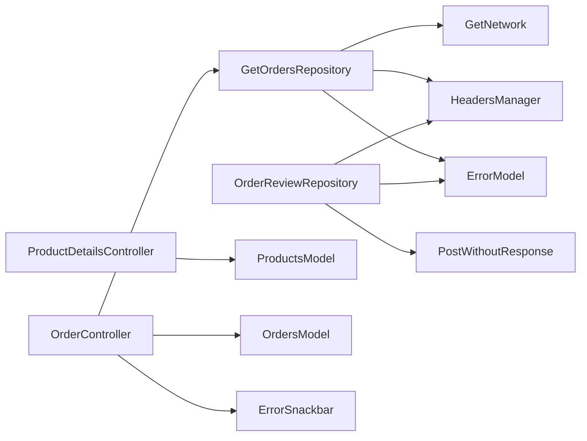

# E-commerce Platform

<cite>
**Referenced Files in This Document**
- [main.dart](file://lib/main.dart)
- [app_routes.dart](file://lib/core/routes/app_routes.dart)
- [routes.dart](file://lib/core/routes/routes.dart)
- [dependency_injection.dart](file://lib/core/di/dependency_injection.dart)
- [products_model.dart](file://lib/features/home/models/products_model.dart)
- [orders_model.dart](file://lib/features/order/models/orders_model.dart)
- [get_orders_repo.dart](file://lib/features/order/repositories/get_orders_repo.dart)
- [order_review_repo.dart](file://lib/features/order/repositories/order_review_repo.dart)
- [order_bindings.dart](file://lib/features/order/bindings/order_bindings.dart)
- [order_controller.dart](file://lib/features/order/controllers/order_controller.dart)
- [product_details_controller.dart](file://lib/features/product_details.dart/controller/product_details_controller.dart)
- [payment_controller.dart](file://lib/features/payment/controller/payment_controller.dart)
- [error_model.dart](file://lib/core/data/global_models/error_model.dart)
- [get_network.dart](file://lib/core/data/networks/get_network.dart)
- [post_without_response.dart](file://lib/core/data/networks/post_without_response.dart)
- [headers_manager.dart](file://lib/core/data/networks/headers_manager.dart)
- [error_snackbar.dart](file://lib/shared/widgets/snackbars/error_snackbar.dart)
</cite>

## Table of Contents
1. [Introduction](#introduction)
2. [Project Structure](#project-structure)
3. [Core Components](#core-components)
4. [Architecture Overview](#architecture-overview)
5. [Detailed Component Analysis](#detailed-component-analysis)
6. [Dependency Analysis](#dependency-analysis)
7. [Performance Considerations](#performance-considerations)
8. [Troubleshooting Guide](#troubleshooting-guide)
9. [Conclusion](#conclusion)

## Introduction
This document describes the e-commerce platform feature set implemented in the Flutter application. It focuses on the product catalog system, product details view, order management, payment processing, category management, filtering mechanisms, and the integrated lifecycle from browsing to order fulfillment. The platform leverages a modular feature-based architecture using GetX for state management and dependency injection, with network repositories abstracted via core networking utilities.

## Project Structure
The application initializes through a central entry point that sets up dependency injection, theme, routing, and navigation bindings. Features are organized under the features directory, with dedicated modules for product catalog, product details, orders, payments, categories, and more. Core infrastructure resides under core, including DI, routes, theme, and network utilities.

**Diagram sources**
- [main.dart:12-46](file://lib/main.dart#L12-L46)
- [dependency_injection.dart](file://lib/core/di/dependency_injection.dart)
- [app_routes.dart](file://lib/core/routes/app_routes.dart)
- [routes.dart](file://lib/core/routes/routes.dart)
- [product_details_controller.dart:1-36](file://lib/features/product_details.dart/controller/product_details_controller.dart#L1-L36)
- [order_controller.dart:1-41](file://lib/features/order/controllers/order_controller.dart#L1-L41)
- [order_review_repo.dart:1-29](file://lib/features/order/repositories/order_review_repo.dart#L1-L29)
- [get_orders_repo.dart:1-20](file://lib/features/order/repositories/get_orders_repo.dart#L1-L20)
- [products_model.dart:1-267](file://lib/features/home/models/products_model.dart#L1-L267)
- [orders_model.dart:1-308](file://lib/features/order/models/orders_model.dart#L1-L308)
- [get_network.dart](file://lib/core/data/networks/get_network.dart)
- [post_without_response.dart](file://lib/core/data/networks/post_without_response.dart)
- [headers_manager.dart](file://lib/core/data/networks/headers_manager.dart)
- [error_model.dart](file://lib/core/data/global_models/error_model.dart)
- [error_snackbar.dart](file://lib/shared/widgets/snackbars/error_snackbar.dart)

**Section sources**
- [main.dart:12-46](file://lib/main.dart#L12-L46)
- [app_routes.dart](file://lib/core/routes/app_routes.dart)
- [routes.dart](file://lib/core/routes/routes.dart)
- [dependency_injection.dart](file://lib/core/di/dependency_injection.dart)

## Core Components
- Product Catalog Model: Defines product entities, categories, furniture types, rooms, media, and default options used across the catalog.
- Orders Model: Encapsulates order data, items, addresses, status history, and payment metadata including Airwallex integration fields.
- Order Repository: Fetches paginated order lists from the backend using typed JSON deserialization.
- Order Review Repository: Posts product reviews with ratings and messages to the backend.
- Order Controller: Manages loading states, search, and displays orders with error handling via snackbars.
- Product Details Controller: Manages carousel navigation and AI toggle state for product media presentation.
- Payment Controller: Holds form field controllers for payment inputs and manages lifecycle cleanup.

**Section sources**
- [products_model.dart:23-129](file://lib/features/home/models/products_model.dart#L23-L129)
- [orders_model.dart:1-139](file://lib/features/order/models/orders_model.dart#L1-L139)
- [get_orders_repo.dart:1-20](file://lib/features/order/repositories/get_orders_repo.dart#L1-L20)
- [order_review_repo.dart:1-29](file://lib/features/order/repositories/order_review_repo.dart#L1-L29)
- [order_controller.dart:1-41](file://lib/features/order/controllers/order_controller.dart#L1-L41)
- [product_details_controller.dart:1-36](file://lib/features/product_details.dart/controller/product_details_controller.dart#L1-L36)
- [payment_controller.dart:1-23](file://lib/features/payment/controller/payment_controller.dart#L1-L23)

## Architecture Overview
The e-commerce feature architecture follows a layered pattern:
- UI Layer: Feature views bind to controllers for state and actions.
- Controller Layer: Orchestrates data fetching, state updates, and user interactions.
- Repository Layer: Handles network requests and JSON serialization/deserialization.
- Core Layer: Provides shared networking utilities, headers, and error models.

**Diagram sources**
- [order_controller.dart:1-41](file://lib/features/order/controllers/order_controller.dart#L1-L41)
- [get_orders_repo.dart:1-20](file://lib/features/order/repositories/get_orders_repo.dart#L1-L20)
- [order_review_repo.dart:1-29](file://lib/features/order/repositories/order_review_repo.dart#L1-L29)
- [get_network.dart](file://lib/core/data/networks/get_network.dart)
- [post_without_response.dart](file://lib/core/data/networks/post_without_response.dart)
- [headers_manager.dart](file://lib/core/data/networks/headers_manager.dart)
- [products_model.dart:1-267](file://lib/features/home/models/products_model.dart#L1-L267)
- [orders_model.dart:1-308](file://lib/features/order/models/orders_model.dart#L1-L308)
- [error_model.dart](file://lib/core/data/global_models/error_model.dart)
- [error_snackbar.dart](file://lib/shared/widgets/snackbars/error_snackbar.dart)

## Detailed Component Analysis

### Product Catalog System
- Purpose: Load and present product listings with metadata, pricing, stock status, and media.
- Data Model: Product entity includes category, furniture type, rooms, media, and default options.
- Usage Pattern: Controllers initialize repository calls during initialization to fetch product data.

**Diagram sources**
- [products_model.dart:9-129](file://lib/features/home/models/products_model.dart#L9-L129)

**Section sources**
- [products_model.dart:23-129](file://lib/features/home/models/products_model.dart#L23-L129)

### Product Details View
- Purpose: Present product media via carousel, handle navigation, and expose AI toggle state.
- Implementation: Uses a carousel controller to manage page transitions and reactive index tracking.

**Diagram sources**
- [product_details_controller.dart:1-36](file://lib/features/product_details.dart/controller/product_details_controller.dart#L1-L36)

**Section sources**
- [product_details_controller.dart:1-36](file://lib/features/product_details.dart/controller/product_details_controller.dart#L1-L36)

### Shopping Cart Functionality
- Current Status: No dedicated cart controller or repository was identified in the analyzed files.
- Recommendation: Introduce a CartController with cart items model, add/remove/update item quantities, and persist state. Integrate with product models and inventory checks.

[No sources needed since this section provides general guidance]

### Order Management
- Retrieval: OrderController fetches orders via GetOrdersRepository, handles loading states, and displays errors via snackbar.
- Data Model: OrdersModel supports pagination links, metadata, order items, addresses, status histories, and payment fields.

**Diagram sources**
- [order_controller.dart:16-27](file://lib/features/order/controllers/order_controller.dart#L16-L27)
- [get_orders_repo.dart:11-18](file://lib/features/order/repositories/get_orders_repo.dart#L11-L18)
- [get_network.dart](file://lib/core/data/networks/get_network.dart)
- [orders_model.dart:1-31](file://lib/features/order/models/orders_model.dart#L1-L31)
- [error_model.dart](file://lib/core/data/global_models/error_model.dart)
- [error_snackbar.dart](file://lib/shared/widgets/snackbars/error_snackbar.dart)

**Section sources**
- [order_controller.dart:1-41](file://lib/features/order/controllers/order_controller.dart#L1-L41)
- [get_orders_repo.dart:1-20](file://lib/features/order/repositories/get_orders_repo.dart#L1-L20)
- [orders_model.dart:1-139](file://lib/features/order/models/orders_model.dart#L1-L139)

### Payment Processing
- Current Status: PaymentController holds form field controllers and lifecycle cleanup. No payment gateway integration or transaction handling was identified in the analyzed files.
- Recommendation: Add a PaymentRepository to orchestrate payment initiation, collect payment method data, and finalize transactions. Integrate with Airwallex fields exposed in OrdersModel (client secret and intent ID).

[No sources needed since this diagram shows conceptual workflow, not actual code structure]

**Section sources**
- [payment_controller.dart:1-23](file://lib/features/payment/controller/payment_controller.dart#L1-L23)

### Category Management and Filtering
- Current Status: CategoryController exists but is minimal. No category repository or filtering logic was identified in the analyzed files.
- Recommendation: Implement CategoryRepository for fetching categories and applying filters (e.g., by parent category, slug, or status). Extend Product model queries to filter by category fields.

[No sources needed since this section provides general guidance]

### Order Lifecycle: From Cart to Fulfillment
- Cart Creation: Not implemented in the analyzed files; propose a cart module with item selection and persistence.
- Checkout: Not implemented; propose checkout flow integrating with payment controller and repository.
- Order Placement: Orders are fetched via GetOrdersRepository; extend to POST orders when cart is checked out.
- Fulfillment: OrdersModel includes status histories and addresses; UI can surface fulfillment progress.

[No sources needed since this diagram shows conceptual workflow, not actual code structure]

### Integration Between Systems
- Product Catalog ↔ Orders: OrdersModel includes items with product identifiers and metadata; UI can link order items to product details.
- Cart ↔ Orders: Cart state should serialize to order payload; ensure product availability and pricing snapshot.
- Payments ↔ Orders: Use Airwallex fields (client secret, intent ID) from OrdersModel to finalize payment and update order status.

[No sources needed since this section provides general guidance]

## Dependency Analysis
- Controllers depend on Repositories for data access.
- Repositories depend on Network utilities and HeadersManager for HTTP communication.
- Models encapsulate JSON serialization/deserialization and are consumed by Repositories and Controllers.
- Error handling is centralized via ErrorModel and ErrorSnackbar.

**Diagram sources**
- [order_controller.dart:1-41](file://lib/features/order/controllers/order_controller.dart#L1-L41)
- [get_orders_repo.dart:1-20](file://lib/features/order/repositories/get_orders_repo.dart#L1-L20)
- [order_review_repo.dart:1-29](file://lib/features/order/repositories/order_review_repo.dart#L1-L29)
- [get_network.dart](file://lib/core/data/networks/get_network.dart)
- [post_without_response.dart](file://lib/core/data/networks/post_without_response.dart)
- [headers_manager.dart](file://lib/core/data/networks/headers_manager.dart)
- [error_model.dart](file://lib/core/data/global_models/error_model.dart)
- [error_snackbar.dart](file://lib/shared/widgets/snackbars/error_snackbar.dart)
- [product_details_controller.dart:1-36](file://lib/features/product_details.dart/controller/product_details_controller.dart#L1-L36)
- [products_model.dart:1-267](file://lib/features/home/models/products_model.dart#L1-L267)
- [orders_model.dart:1-308](file://lib/features/order/models/orders_model.dart#L1-L308)

**Section sources**
- [order_bindings.dart:1-11](file://lib/features/order/bindings/order_bindings.dart#L1-L11)

## Performance Considerations
- Lazy Loading: Use lazy loading for heavy UI components (e.g., product carousels) to reduce initial load.
- Pagination: Utilize OrdersModel pagination links to implement infinite scroll or pagination controls.
- Caching: Cache frequently accessed product and order data to minimize network calls.
- Reactive Updates: Keep controllers reactive to avoid unnecessary rebuilds; use granular observables.

[No sources needed since this section provides general guidance]

## Troubleshooting Guide
- Network Failures: Errors are returned as Either<ErrorModel, T>; ensure controllers handle failures gracefully and display user-friendly messages via ErrorSnackbar.
- Authentication: HeadersManager supplies standardized headers; verify tokens are attached for protected endpoints.
- UI Feedback: Use OrderController’s loading state and error snackbar to inform users during data fetches.

**Section sources**
- [order_controller.dart:16-27](file://lib/features/order/controllers/order_controller.dart#L16-L27)
- [error_model.dart](file://lib/core/data/global_models/error_model.dart)
- [error_snackbar.dart](file://lib/shared/widgets/snackbars/error_snackbar.dart)
- [headers_manager.dart](file://lib/core/data/networks/headers_manager.dart)

## Conclusion
The e-commerce platform establishes a solid foundation with product catalogs, order retrieval, and UI controllers. Missing pieces include a cart module, checkout flow, payment gateway integration, category filtering, and inventory management. Extending the existing architecture with repositories and controllers for these features will complete the end-to-end shopping experience while maintaining modularity and testability.