# E-commerce Platform

<cite>
**Referenced Files in This Document**
- [main.dart](file://lib/main.dart)
- [app_routes.dart](file://lib/core/routes/app_routes.dart)
- [routes.dart](file://lib/core/routes/routes.dart)
- [dependency_injection.dart](file://lib/core/di/dependency_injection.dart)
- [products_model.dart](file://lib/features/home/models/products_model.dart)
- [orders_model.dart](file://lib/features/order/models/orders_model.dart)
- [get_orders_repo.dart](file://lib/features/order/repositories/get_orders_repo.dart)
- [order_review_repo.dart](file://lib/features/order/repositories/order_review_repo.dart)
- [order_bindings.dart](file://lib/features/order/bindings/order_bindings.dart)
- [order_controller.dart](file://lib/features/order/controllers/order_controller.dart)
- [product_details_controller.dart](file://lib/features/product_details.dart/controller/product_details_controller.dart)
- [product_attributes_model.dart](file://lib/features/product_details.dart/models/product_attributes_model.dart)
- [products_attributes_controller.dart](file://lib/features/product_details.dart/controller/products_attributes_controller.dart)
- [product_attributes_repo.dart](file://lib/features/product_details.dart/repositories/product_attributes_repo.dart)
- [product_details_model.dart](file://lib/features/product_details.dart/models/product_details_model.dart)
- [payment_controller.dart](file://lib/features/payment/controller/payment_controller.dart)
- [home_our_products.dart](file://lib/features/home/widgets/home_widgets/home_our_products.dart)
- [home_product_design.dart](file://lib/features/home/widgets/home_widgets/home_product_design.dart)
- [global_search_suggestion_box.dart](file://lib/features/home/widgets/home_widgets/global_search_suggestion_box.dart)
- [product_details_view_image.dart](file://lib/features/product_details.dart/widgets/product_details_view_widgets/product_details_view_image.dart)
- [product_details_view.dart](file://lib/features/product_details.dart/views/product_details_view.dart)
- [product_details_rating.dart](file://lib/features/product_details.dart/widgets/product_details_view_widgets/product_details_rating.dart)
- [product_details_rating_info.dart](file://lib/features/product_details.dart/widgets/product_details_view_widgets/product_details_rating_info.dart)
- [product_details_rating_percent.dart](file://lib/features/product_details.dart/widgets/product_details_view_widgets/product_details_rating_percent.dart)
- [product_details_review.dart](file://lib/features/product_details.dart/widgets/product_details_view_widgets/product_details_review.dart)
- [order_review_controller.dart](file://lib/features/order/controllers/order_review_controller.dart)
- [error_model.dart](file://lib/core/data/global_models/error_model.dart)
- [get_network.dart](file://lib/core/data/networks/get_network.dart)
- [post_without_response.dart](file://lib/core/data/networks/post_without_response.dart)
- [headers_manager.dart](file://lib/core/data/networks/headers_manager.dart)
- [error_snackbar.dart](file://lib/shared/widgets/snackbars/error_snackbar.dart)
- [custom_text_form_field.dart](file://lib/shared/widgets/custom_form_field/custom_text_form_field.dart)
- [custom_phone_field.dart](file://lib/shared/widgets/custom_form_field/custom_phone_field.dart)
- [custom_rating_builder.dart](file://lib/shared/widgets/custom_rating/custom_rating_builder.dart)
- [custom_rating_bar.dart](file://lib/shared/widgets/custom_rating/custom_rating_bar.dart)
- [custom_rating_dialog.dart](file://lib/shared/widgets/custom_dialog/custom_rating_dialog.dart)
- [phone_validator.dart](file://lib/shared/extensions/validators/phone_validator.dart)
- [abn_validator.dart](file://lib/shared/extensions/validators/abn_validator.dart)
- [shared_container.dart](file://lib/shared/widgets/shared_container.dart)
</cite>

## Update Summary
**Changes Made**
- Added comprehensive product attributes system with dynamic attribute options and default selections
- Enhanced product review and rating functionality with detailed rating distribution visualization
- Implemented separate controllers for product details and product attributes management
- Added new rating components including rating info display and percentage bars
- Enhanced product details view with integrated rating and review sections
- Improved product customization system with expandable attribute sections
- Added comprehensive UI safety checks documentation for product image loading with null and empty list validation
- Documented media URL validation patterns across product catalog, search suggestions, and product details views
- Enhanced error handling documentation for image loading failures and fallback mechanisms
- Updated product catalog system documentation to include robust image loading safeguards
- Added documentation for cached network image implementation and placeholder handling

## Table of Contents
1. [Introduction](#introduction)
2. [Project Structure](#project-structure)
3. [Core Components](#core-components)
4. [Architecture Overview](#architecture-overview)
5. [Detailed Component Analysis](#detailed-component-analysis)
6. [Enhanced Product Attributes System](#enhanced-product-attributes-system)
7. [Improved Rating and Review System](#improved-rating-and-review-system)
8. [Enhanced UI Components](#enhanced-ui-components)
9. [Form Field Components](#form-field-components)
10. [Rating System Components](#rating-system-components)
11. [Validation Extensions](#validation-extensions)
12. [UI Safety Checks for Product Image Loading](#ui-safety-checks-for-product-image-loading)
13. [Dependency Analysis](#dependency-analysis)
14. [Performance Considerations](#performance-considerations)
15. [Troubleshooting Guide](#troubleshooting-guide)
16. [Conclusion](#conclusion)

## Introduction
This document describes the e-commerce platform feature set implemented in the Flutter application. It focuses on the product catalog system, product details view, order management, payment processing, category management, filtering mechanisms, and the integrated lifecycle from browsing to order fulfillment. The platform leverages a modular feature-based architecture using GetX for state management and dependency injection, with network repositories abstracted via core networking utilities. Recent enhancements include a comprehensive product attributes system with dynamic attribute options, improved product review and rating functionality with detailed visualization, enhanced form field components, custom phone field validation, rating bar widgets, comprehensive UI safety checks for product image loading, and various UI improvements across product catalog, shopping cart, and order management systems.

## Project Structure
The application initializes through a central entry point that sets up dependency injection, theme, routing, and navigation bindings. Features are organized under the features directory, with dedicated modules for product catalog, product details, orders, payments, categories, and more. Core infrastructure resides under core, including DI, routes, theme, and network utilities. Enhanced UI components are organized under shared/widgets with specialized components for forms, ratings, dialogs, and containers.

```mermaid
graph TB
subgraph "App Bootstrap"
M["main.dart"]
DI["dependency_injection.dart"]
AR["app_routes.dart"]
RT["routes.dart"]
end
subgraph "Features"
PC["product_details_controller.dart"]
PAC["products_attributes_controller.dart"]
PAM["product_attributes_model.dart"]
PDR["product_details_rating.dart"]
PDMI["product_details_model.dart"]
OC["order_controller.dart"]
OR["order_review_repo.dart"]
GR["get_orders_repo.dart"]
PM["payment_controller.dart"]
CM["products_model.dart"]
OM["orders_model.dart"]
HPD["home_product_design.dart"]
GSSB["global_search_suggestion_box.dart"]
HOUP["home_our_products.dart"]
PDVI["product_details_view_image.dart"]
PDV["product_details_view.dart"]
end
subgraph "Core"
GN["get_network.dart"]
PWR["post_without_response.dart"]
HM["headers_manager.dart"]
EM["error_model.dart"]
ES["error_snackbar.dart"]
end
subgraph "Enhanced UI Components"
CTFF["custom_text_form_field.dart"]
CPHF["custom_phone_field.dart"]
CRB["custom_rating_builder.dart"]
CRBAR["custom_rating_bar.dart"]
CRD["custom_rating_dialog.dart"]
SC["shared_container.dart"]
end
M --> DI
M --> AR
M --> RT
M --> PC
M --> PAC
M --> PAM
M --> PDR
M --> PDMI
M --> OC
M --> PM
OC --> GR
OC --> OM
GR --> GN
GR --> HM
GR --> EM
OR --> PWR
OR --> HM
OR --> EM
PC --> CM
PC --> CRD
PC --> PDR
PC --> PDMI
OC --> CRD
PC --> HPD
PC --> GSSB
PC --> HOUP
PC --> PDVI
PAC --> PAM
PAC --> GN
```

**Diagram sources**
- [main.dart:12-46](file://lib/main.dart#L12-L46)
- [dependency_injection.dart](file://lib/core/di/dependency_injection.dart)
- [app_routes.dart](file://lib/core/routes/app_routes.dart)
- [routes.dart](file://lib/core/routes/routes.dart)
- [product_details_controller.dart:1-162](file://lib/features/product_details.dart/controller/product_details_controller.dart#L1-L162)
- [products_attributes_controller.dart:1-40](file://lib/features/product_details.dart/controller/products_attributes_controller.dart#L1-L40)
- [product_attributes_model.dart:1-100](file://lib/features/product_details.dart/models/product_attributes_model.dart#L1-L100)
- [product_details_rating.dart:1-94](file://lib/features/product_details.dart/widgets/product_details_view_widgets/product_details_rating.dart#L1-L94)
- [product_details_model.dart:1-340](file://lib/features/product_details.dart/models/product_details_model.dart#L1-L340)
- [order_controller.dart:1-41](file://lib/features/order/controllers/order_controller.dart#L1-L41)
- [order_review_repo.dart:1-29](file://lib/features/order/repositories/order_review_repo.dart#L1-L29)
- [get_orders_repo.dart:1-20](file://lib/features/order/repositories/get_orders_repo.dart#L1-L20)
- [products_model.dart:1-267](file://lib/features/home/models/products_model.dart#L1-L267)
- [orders_model.dart:1-308](file://lib/features/order/models/orders_model.dart#L1-L308)
- [home_product_design.dart:1-99](file://lib/features/home/widgets/home_widgets/home_product_design.dart#L1-L99)
- [global_search_suggestion_box.dart:150-226](file://lib/features/home/widgets/home_widgets/global_search_suggestion_box.dart#L150-L226)
- [home_our_products.dart:54-82](file://lib/features/home/widgets/home_widgets/home_our_products.dart#L54-L82)
- [product_details_view_image.dart:1-97](file://lib/features/product_details.dart/widgets/product_details_view_widgets/product_details_view_image.dart#L1-L97)
- [product_details_view.dart:1-91](file://lib/features/product_details.dart/views/product_details_view.dart#L1-L91)
- [get_network.dart](file://lib/core/data/networks/get_network.dart)
- [post_without_response.dart](file://lib/core/data/networks/post_without_response.dart)
- [headers_manager.dart](file://lib/core/data/networks/headers_manager.dart)
- [error_model.dart](file://lib/core/data/global_models/error_model.dart)
- [error_snackbar.dart](file://lib/shared/widgets/snackbars/error_snackbar.dart)
- [custom_text_form_field.dart:1-191](file://lib/shared/widgets/custom_form_field/custom_text_form_field.dart#L1-L191)
- [custom_phone_field.dart:1-116](file://lib/shared/widgets/custom_form_field/custom_phone_field.dart#L1-L116)
- [custom_rating_builder.dart:1-35](file://lib/shared/widgets/custom_rating/custom_rating_builder.dart#L1-L35)
- [custom_rating_bar.dart:1-30](file://lib/shared/widgets/custom_rating/custom_rating_bar.dart#L1-L30)
- [custom_rating_dialog.dart:1-128](file://lib/shared/widgets/custom_dialog/custom_rating_dialog.dart#L1-L128)
- [shared_container.dart:1-57](file://lib/shared/widgets/shared_container.dart#L1-L57)

**Section sources**
- [main.dart:12-46](file://lib/main.dart#L12-L46)
- [app_routes.dart](file://lib/core/routes/app_routes.dart)
- [routes.dart](file://lib/core/routes/routes.dart)
- [dependency_injection.dart](file://lib/core/di/dependency_injection.dart)

## Core Components
- Product Catalog Model: Defines product entities, categories, furniture types, rooms, media, and default options used across the catalog.
- Product Attributes Model: Comprehensive attribute system with product attributes, options, pricing, stock levels, and default selections for dynamic product customization.
- Product Details Model: Enhanced product details with comprehensive metadata, reviews, ratings, media, and attribute configurations.
- Orders Model: Encapsulates order data, items, addresses, status history, and payment metadata including Airwallex integration fields.
- Order Repository: Fetches paginated order lists from the backend using typed JSON deserialization.
- Order Review Repository: Posts product reviews with ratings and messages to the backend.
- Order Controller: Manages loading states, search, and displays orders with error handling via snackbars.
- Product Details Controller: Manages carousel navigation, AI toggle state, customization options, and review management for product media presentation.
- Product Attributes Controller: Manages dynamic attribute loading, expandable sections, and attribute option selection for product customization.
- Payment Controller: Holds form field controllers for payment inputs and manages lifecycle cleanup.

**Section sources**
- [products_model.dart:23-129](file://lib/features/home/models/products_model.dart#L23-L129)
- [product_attributes_model.dart:1-100](file://lib/features/product_details.dart/models/product_attributes_model.dart#L1-L100)
- [product_details_model.dart:20-146](file://lib/features/product_details.dart/models/product_details_model.dart#L20-L146)
- [orders_model.dart:1-139](file://lib/features/order/models/orders_model.dart#L1-L139)
- [get_orders_repo.dart:1-20](file://lib/features/order/repositories/get_orders_repo.dart#L1-L20)
- [order_review_repo.dart:1-29](file://lib/features/order/repositories/order_review_repo.dart#L1-L29)
- [order_controller.dart:1-41](file://lib/features/order/controllers/order_controller.dart#L1-L41)
- [product_details_controller.dart:14-162](file://lib/features/product_details.dart/controller/product_details_controller.dart#L14-L162)
- [products_attributes_controller.dart:6-40](file://lib/features/product_details.dart/controller/products_attributes_controller.dart#L6-L40)
- [payment_controller.dart:1-23](file://lib/features/payment/controller/payment_controller.dart#L1-L23)

## Architecture Overview
The e-commerce feature architecture follows a layered pattern:
- UI Layer: Feature views bind to controllers for state and actions.
- Controller Layer: Orchestrates data fetching, state updates, and user interactions.
- Repository Layer: Handles network requests and JSON serialization/deserialization.
- Core Layer: Provides shared networking utilities, headers, and error models.
- Enhanced UI Layer: Provides reusable components for forms, ratings, dialogs, and containers.

```mermaid
graph TB
UI["Feature Views<br/>Order View, Product Details View, Payment View"]
CTRL["Controllers<br/>OrderController, ProductDetailsController, ProductAttributesController, PaymentController"]
REPO["Repositories<br/>GetOrdersRepository, OrderReviewRepository, ProductAttributesRepository"]
NET["Network Utilities<br/>GetNetwork, PostWithoutResponse, HeadersManager"]
MODELS["Data Models<br/>ProductsModel, ProductAttributesModel, ProductDetailsModel, OrdersModel"]
ERR["Error Model & Snackbar"]
UI --> CTRL
CTRL --> REPO
REPO --> NET
REPO --> MODELS
REPO --> ERR
subgraph "Enhanced UI Components"
FORM["Form Components<br/>CustomTextFormField, CustomPhoneField"]
RATING["Rating Components<br/>CustomRatingBar, CustomRatingBuilder"]
DIALOG["Dialog Components<br/>CustomRatingDialog"]
CONTAINER["Container Components<br/>SharedContainer"]
IMG["Image Loading Safety<br/>Media Validation, Fallback Handling"]
ATTR["Product Attributes<br/>Dynamic Options, Pricing, Stock"]
REV["Rating & Reviews<br/>Distribution, Visualization"]
END
UI --> FORM
UI --> RATING
UI --> DIALOG
UI --> CONTAINER
UI --> IMG
UI --> ATTR
UI --> REV
```

**Diagram sources**
- [order_controller.dart:1-41](file://lib/features/order/controllers/order_controller.dart#L1-L41)
- [get_orders_repo.dart:1-20](file://lib/features/order/repositories/get_orders_repo.dart#L1-L20)
- [order_review_repo.dart:1-29](file://lib/features/order/repositories/order_review_repo.dart#L1-L29)
- [products_attributes_controller.dart:1-40](file://lib/features/product_details.dart/controller/products_attributes_controller.dart#L1-L40)
- [product_attributes_repo.dart:1-21](file://lib/features/product_details.dart/repositories/product_attributes_repo.dart#L1-L21)
- [get_network.dart](file://lib/core/data/networks/get_network.dart)
- [post_without_response.dart](file://lib/core/data/networks/post_without_response.dart)
- [headers_manager.dart](file://lib/core/data/networks/headers_manager.dart)
- [products_model.dart:1-267](file://lib/features/home/models/products_model.dart#L1-L267)
- [product_attributes_model.dart:1-100](file://lib/features/product_details.dart/models/product_attributes_model.dart#L1-L100)
- [product_details_model.dart:1-340](file://lib/features/product_details.dart/models/product_details_model.dart#L1-L340)
- [orders_model.dart:1-308](file://lib/features/order/models/orders_model.dart#L1-L308)
- [error_model.dart](file://lib/core/data/global_models/error_model.dart)
- [error_snackbar.dart](file://lib/shared/widgets/snackbars/error_snackbar.dart)
- [custom_text_form_field.dart:1-191](file://lib/shared/widgets/custom_form_field/custom_text_form_field.dart#L1-L191)
- [custom_phone_field.dart:1-116](file://lib/shared/widgets/custom_form_field/custom_phone_field.dart#L1-L116)
- [custom_rating_builder.dart:1-35](file://lib/shared/widgets/custom_rating/custom_rating_builder.dart#L1-L35)
- [custom_rating_bar.dart:1-30](file://lib/shared/widgets/custom_rating/custom_rating_bar.dart#L1-L30)
- [custom_rating_dialog.dart:1-128](file://lib/shared/widgets/custom_dialog/custom_rating_dialog.dart#L1-L128)
- [shared_container.dart:1-57](file://lib/shared/widgets/shared_container.dart#L1-L57)

## Detailed Component Analysis

### Product Catalog System
- Purpose: Load and present product listings with metadata, pricing, stock status, and media.
- Data Model: Product entity includes category, furniture type, rooms, media, and default options.
- Usage Pattern: Controllers initialize repository calls during initialization to fetch product data.
- **UI Safety Checks**: Implemented comprehensive null and empty list validation before accessing product media URLs to prevent crashes when products have no associated images.

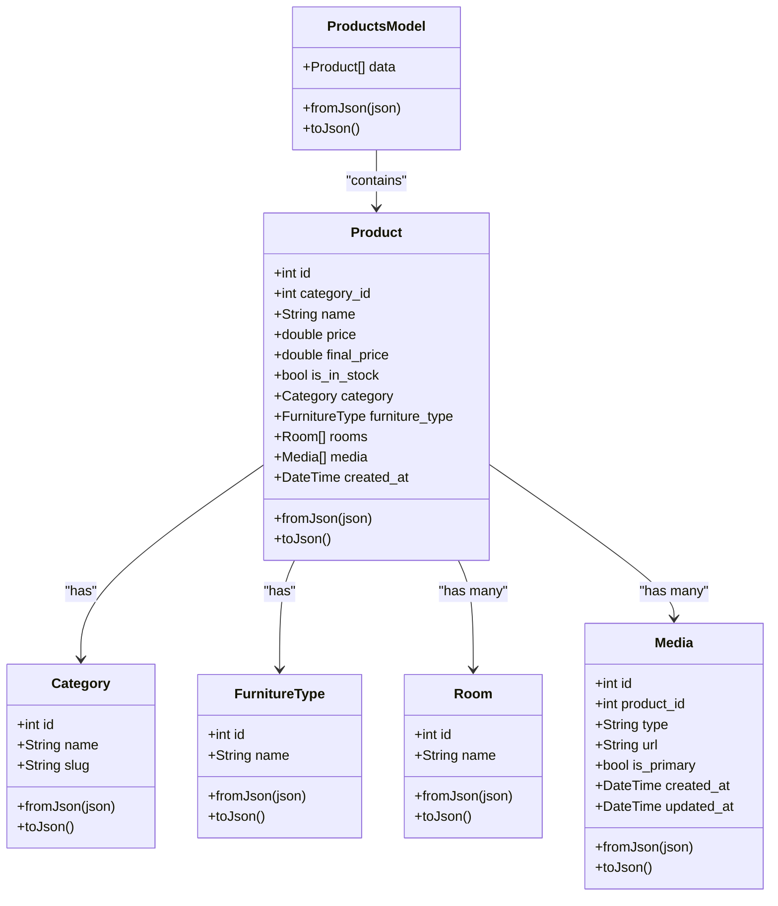

**Diagram sources**
- [products_model.dart:9-129](file://lib/features/home/models/products_model.dart#L9-L129)

**Section sources**
- [products_model.dart:23-129](file://lib/features/home/models/products_model.dart#L23-L129)

### Enhanced Product Attributes System
- Purpose: Manage dynamic product attributes with options, pricing, stock levels, and default selections for comprehensive product customization.
- Data Model: ProductAttributesModel contains product attributes with nested options including pricing, stock, images, and default flags.
- Implementation: Separate controller and repository handle attribute loading with expandable sections and default option management.
- **Architecture Enhancement**: New dedicated system for managing product customization options beyond basic media and details.

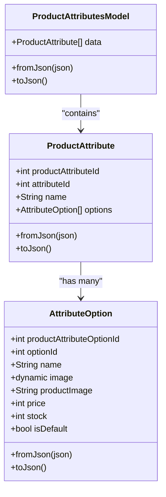

**Diagram sources**
- [product_attributes_model.dart:9-100](file://lib/features/product_details.dart/models/product_attributes_model.dart#L9-L100)

**Section sources**
- [product_attributes_model.dart:1-100](file://lib/features/product_details.dart/models/product_attributes_model.dart#L1-L100)
- [products_attributes_controller.dart:1-40](file://lib/features/product_details.dart/controller/products_attributes_controller.dart#L1-L40)
- [product_attributes_repo.dart:1-21](file://lib/features/product_details.dart/repositories/product_attributes_repo.dart#L1-L21)

### Improved Rating and Review System
- Purpose: Provide comprehensive product rating and review functionality with detailed distribution visualization and interactive rating submission.
- Data Model: ProductDetailsModel includes reviews with reviewer information, ratings, timestamps, and verification status.
- Implementation: Dedicated rating components with dynamic star distribution calculation and interactive review submission.
- **Enhancement**: Complete overhaul of rating system with detailed visualization and improved user interaction patterns.

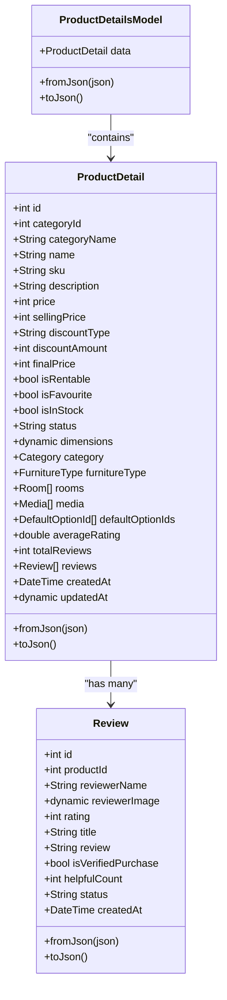

**Diagram sources**
- [product_details_model.dart:9-146](file://lib/features/product_details.dart/models/product_details_model.dart#L9-L146)

**Section sources**
- [product_details_model.dart:20-340](file://lib/features/product_details.dart/models/product_details_model.dart#L20-L340)
- [product_details_rating.dart:1-94](file://lib/features/product_details.dart/widgets/product_details_view_widgets/product_details_rating.dart#L1-L94)
- [product_details_rating_info.dart:1-104](file://lib/features/product_details.dart/widgets/product_details_view_widgets/product_details_rating_info.dart#L1-L104)
- [product_details_rating_percent.dart:1-55](file://lib/features/product_details.dart/widgets/product_details_view_widgets/product_details_rating_percent.dart#L1-L55)
- [product_details_review.dart:1-135](file://lib/features/product_details.dart/widgets/product_details_view_widgets/product_details_review.dart#L1-L135)

### Product Details View
- Purpose: Present product media via carousel, handle navigation, expose AI toggle state, and integrate rating/review components.
- Implementation: Uses a carousel controller to manage page transitions and reactive index tracking.
- **Enhancement**: Integrated comprehensive rating and review system with dynamic visualization and interactive submission.
- **UI Safety Checks**: Implements robust image loading with fallback mechanisms and placeholder handling.

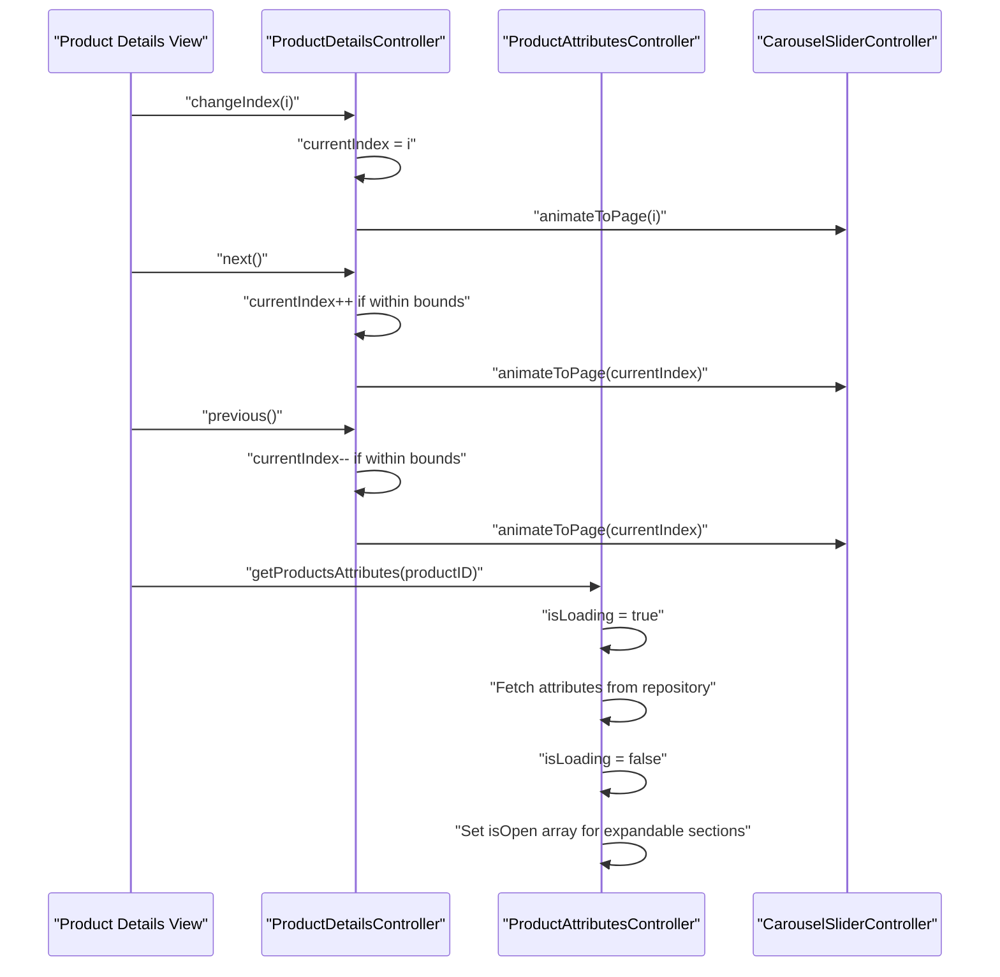

**Diagram sources**
- [product_details_controller.dart:92-107](file://lib/features/product_details.dart/controller/product_details_controller.dart#L92-L107)
- [products_attributes_controller.dart:14-29](file://lib/features/product_details.dart/controller/products_attributes_controller.dart#L14-L29)

**Section sources**
- [product_details_controller.dart:14-162](file://lib/features/product_details.dart/controller/product_details_controller.dart#L14-L162)
- [product_details_view.dart:19-91](file://lib/features/product_details.dart/views/product_details_view.dart#L19-L91)

### Shopping Cart Functionality
- Current Status: No dedicated cart controller or repository was identified in the analyzed files.
- Recommendation: Introduce a CartController with cart items model, add/remove/update item quantities, and persist state. Integrate with product models and inventory checks.

### Order Management
- Retrieval: OrderController fetches orders via GetOrdersRepository, handles loading states, and displays errors via snackbar.
- Data Model: OrdersModel supports pagination links, metadata, order items, addresses, status histories, and payment fields.

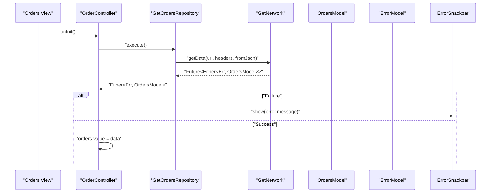

**Diagram sources**
- [order_controller.dart:16-27](file://lib/features/order/controllers/order_controller.dart#L16-L27)
- [get_orders_repo.dart:11-18](file://lib/features/order/repositories/get_orders_repo.dart#L11-L18)
- [get_network.dart](file://lib/core/data/networks/get_network.dart)
- [orders_model.dart:1-31](file://lib/features/order/models/orders_model.dart#L1-L31)
- [error_model.dart](file://lib/core/data/global_models/error_model.dart)
- [error_snackbar.dart](file://lib/shared/widgets/snackbars/error_snackbar.dart)

**Section sources**
- [order_controller.dart:1-41](file://lib/features/order/controllers/order_controller.dart#L1-L41)
- [get_orders_repo.dart:1-20](file://lib/features/order/repositories/get_orders_repo.dart#L1-L20)
- [orders_model.dart:1-139](file://lib/features/order/models/orders_model.dart#L1-L139)

### Payment Processing
- Current Status: PaymentController holds form field controllers and lifecycle cleanup. No payment gateway integration or transaction handling was identified in the analyzed files.
- Recommendation: Add a PaymentRepository to orchestrate payment initiation, collect payment method data, and finalize transactions. Integrate with Airwallex fields exposed in OrdersModel (client secret and intent ID).

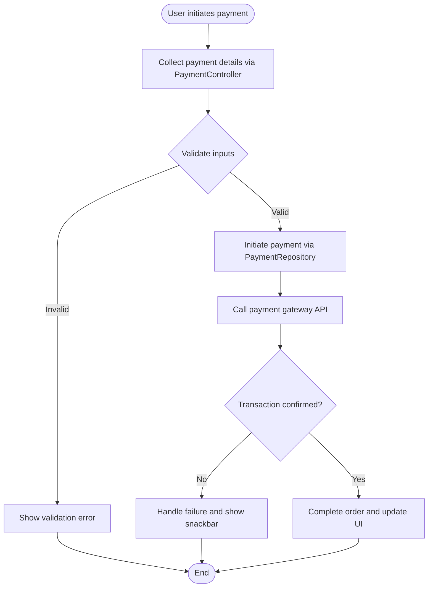

**Section sources**
- [payment_controller.dart:1-23](file://lib/features/payment/controller/payment_controller.dart#L1-L23)

### Category Management and Filtering
- Current Status: CategoryController exists but is minimal. No category repository or filtering logic was identified in the analyzed files.
- Recommendation: Implement CategoryRepository for fetching categories and applying filters (e.g., by parent category, slug, or status). Extend Product model queries to filter by category fields.

### Order Lifecycle: From Cart to Fulfillment
- Cart Creation: Not implemented in the analyzed files; propose a cart module with item selection and persistence.
- Checkout: Not implemented; propose checkout flow integrating with payment controller and repository.
- Order Placement: Orders are fetched via GetOrdersRepository; extend to POST orders when cart is checked out.
- Fulfillment: OrdersModel includes status histories and addresses; UI can surface fulfillment progress.

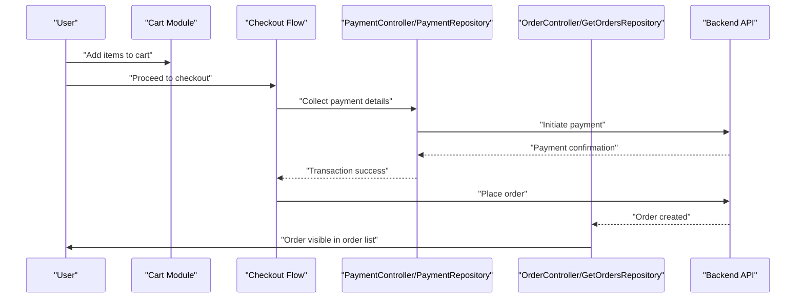

### Integration Between Systems
- Product Catalog ↔ Orders: OrdersModel includes items with product identifiers and metadata; UI can link order items to product details.
- Cart ↔ Orders: Cart state should serialize to order payload; ensure product availability and pricing snapshot.
- Payments ↔ Orders: Use Airwallex fields (client secret, intent ID) from OrdersModel to finalize payment and update order status.
- Product Attributes ↔ Orders: Product attributes should be captured during purchase for accurate order fulfillment.
- Rating System ↔ Orders: Order review system complements product rating system for comprehensive feedback collection.

## Enhanced Product Attributes System

### Overview
The enhanced product attributes system provides comprehensive dynamic customization options for products, enabling customers to select from various attributes such as materials, colors, sizes, and finishes. This system represents a significant architectural addition to the product details feature, allowing for complex product configurations beyond simple media and basic details.

### Data Model Architecture
The product attributes system consists of three main components:

1. **ProductAttributesModel**: Top-level container for attribute data
2. **ProductAttribute**: Individual attribute groups (e.g., "Wood Finish", "Color")
3. **AttributeOption**: Specific options within attributes with pricing and stock information

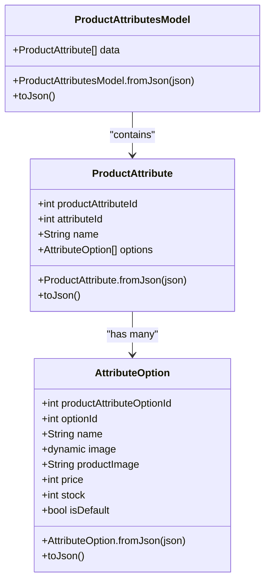

**Diagram sources**
- [product_attributes_model.dart:9-100](file://lib/features/product_details.dart/models/product_attributes_model.dart#L9-L100)

### Controller Implementation
The ProductAttributesController manages the loading and display of product attributes with expandable sections and default option handling:

**Key Features:**
- Asynchronous attribute loading with loading state management
- Expandable/collapsible attribute sections
- Default option selection for each attribute group
- Error handling with user-friendly snackbars

**Section sources**
- [products_attributes_controller.dart:1-40](file://lib/features/product_details.dart/controller/products_attributes_controller.dart#L1-L40)
- [product_attributes_repo.dart:1-21](file://lib/features/product_details.dart/repositories/product_attributes_repo.dart#L1-L21)

### UI Integration
The product attributes system integrates seamlessly with the product details view through dedicated UI components that handle:
- Dynamic attribute section expansion/collapse
- Option selection with visual feedback
- Price and stock level display
- Default option highlighting

## Improved Rating and Review System

### Overview
The enhanced rating and review system provides comprehensive product feedback mechanisms with detailed visualization and interactive submission capabilities. This system represents a significant improvement over basic rating implementations, offering detailed star distribution analysis and user-friendly review management.

### Rating Distribution Visualization
The system calculates and displays detailed rating distributions with dynamic star count analysis:

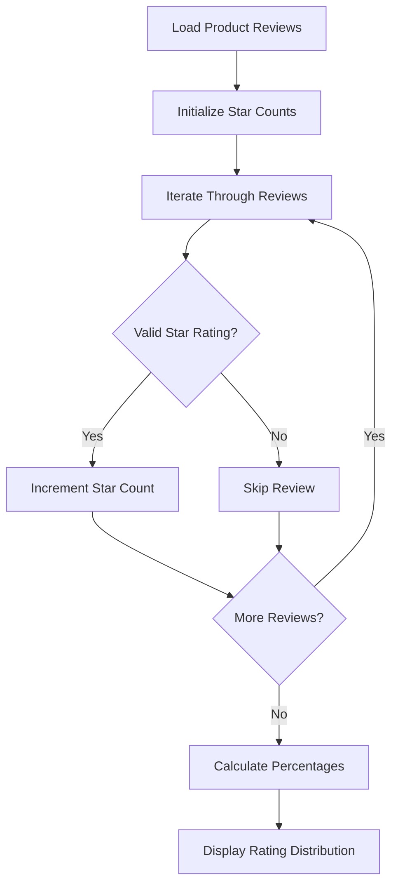

**Diagram sources**
- [product_details_rating.dart:21-38](file://lib/features/product_details.dart/widgets/product_details_view_widgets/product_details_rating.dart#L21-L38)

### Rating Components Architecture
The rating system consists of several specialized components:

1. **ProductDetailsRating**: Main container component handling overall rating display
2. **ProductDetailsRatingInfo**: Displays average rating and review statistics
3. **ProductDetailsRatingPercent**: Shows individual star rating distribution with progress bars
4. **ProductDetailsReview**: Manages review display and submission interface

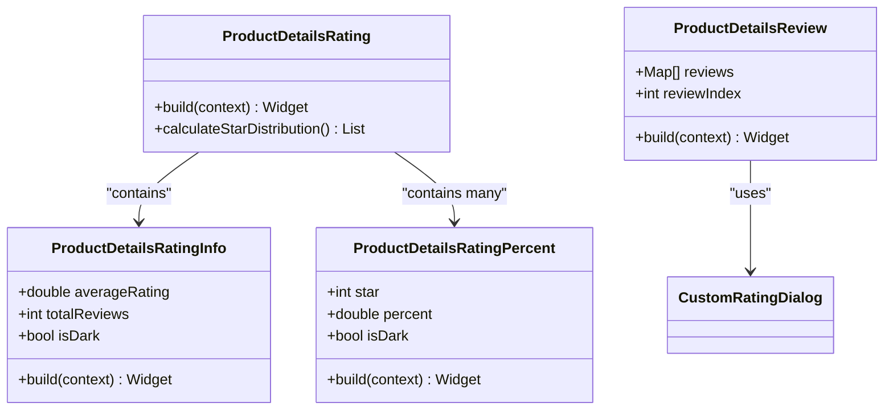

**Diagram sources**
- [product_details_rating.dart:10-94](file://lib/features/product_details.dart/widgets/product_details_view_widgets/product_details_rating.dart#L10-L94)
- [product_details_rating_info.dart:7-104](file://lib/features/product_details.dart/widgets/product_details_view_widgets/product_details_rating_info.dart#L7-L104)
- [product_details_rating_percent.dart:7-55](file://lib/features/product_details.dart/widgets/product_details_view_widgets/product_details_rating_percent.dart#L7-L55)
- [product_details_review.dart:13-135](file://lib/features/product_details.dart/widgets/product_details_view_widgets/product_details_review.dart#L13-L135)

### Review Submission Integration
The rating system integrates with the existing order review system through the CustomRatingDialog component, providing:
- Interactive star rating selection
- Text review submission
- Loading states and error handling
- Success feedback upon submission

**Section sources**
- [product_details_rating.dart:1-94](file://lib/features/product_details.dart/widgets/product_details_view_widgets/product_details_rating.dart#L1-L94)
- [product_details_rating_info.dart:1-104](file://lib/features/product_details.dart/widgets/product_details_view_widgets/product_details_rating_info.dart#L1-L104)
- [product_details_rating_percent.dart:1-55](file://lib/features/product_details.dart/widgets/product_details_view_widgets/product_details_rating_percent.dart#L1-L55)
- [product_details_review.dart:1-135](file://lib/features/product_details.dart/widgets/product_details_view_widgets/product_details_review.dart#L1-L135)
- [order_review_controller.dart:1-42](file://lib/features/order/controllers/order_review_controller.dart#L1-L42)

## Enhanced UI Components

### Shared Container Component
The SharedContainer provides a flexible container component with comprehensive styling options including rounded corners, shadows, gradients, and responsive design.

**Key Features:**
- Dark/light mode support with automatic theme detection
- Responsive sizing with Flutter_ScreenUtil integration
- Gradient background support
- Shadow effects and custom borders
- Flexible padding and margin configuration

**Section sources**
- [shared_container.dart:1-57](file://lib/shared/widgets/shared_container.dart#L1-L57)

### Enhanced Form Field Components

#### CustomTextFormField
Provides a highly customizable text input field with extensive styling options and validation support.

**Key Features:**
- Comprehensive styling options (colors, fonts, borders)
- Dark/light mode automatic theming
- Custom label and hint text widgets
- Responsive design with screen utility integration
- Full validation support with custom validators

**Section sources**
- [custom_text_form_field.dart:1-191](file://lib/shared/widgets/custom_form_field/custom_text_form_field.dart#L1-L191)

#### CustomPhoneField
Specialized phone number input field with international phone number validation and formatting.

**Key Features:**
- International phone number support via intl_phone_field package
- Custom validation with phoneValidator extension
- Country code selection and formatting
- Responsive design and dark mode support
- Custom styling with Material Design integration

**Section sources**
- [custom_phone_field.dart:1-116](file://lib/shared/widgets/custom_form_field/custom_phone_field.dart#L1-L116)

## Rating System Components

### CustomRatingBar
Static rating display component using custom icons for consistent visual representation.

**Key Features:**
- Static rating display with custom icon assets
- Configurable icon size and spacing
- Support for different colors and themes
- Responsive design integration
- Used extensively in product details and order management

**Section sources**
- [custom_rating_bar.dart:1-30](file://lib/shared/widgets/custom_rating/custom_rating_bar.dart#L1-L30)

### CustomRatingBuilder
Interactive rating component allowing users to provide ratings with half-star support.

**Key Features:**
- Interactive star rating with half-star precision
- Custom icon asset integration
- Configurable item count and sizing
- Real-time rating updates
- Used in rating dialogs and review systems

**Section sources**
- [custom_rating_builder.dart:1-35](file://lib/shared/widgets/custom_rating/custom_rating_builder.dart#L1-L35)

### CustomRatingDialog
Comprehensive rating and review dialog component integrated with the rating system.

**Key Features:**
- Integrated rating and review submission
- Interactive rating builder for user input
- Rich text area for detailed reviews
- Loading states and error handling
- Dark/light mode support
- Seamless integration with order management system

**Section sources**
- [custom_rating_dialog.dart:1-128](file://lib/shared/widgets/custom_dialog/custom_rating_dialog.dart#L1-L128)

## Validation Extensions

### Phone Validator
Custom phone number validation supporting international formats with Bangladesh country code.

**Validation Rules:**
- Required field validation
- Bangladesh mobile number format: 8801[3-9]XXXXXXX
- Example format: 8801712345678
- Integration with CustomPhoneField component

**Section sources**
- [phone_validator.dart:1-15](file://lib/shared/extensions/validators/phone_validator.dart#L1-L15)

### ABN Validator
Business registration number validation for Australian businesses.

**Validation Rules:**
- Required field validation
- Custom regex pattern for ABN format validation
- Business-specific validation logic
- Integration with authentication forms

**Section sources**
- [abn_validator.dart:1-12](file://lib/shared/extensions/validators/abn_validator.dart#L1-L12)

## UI Safety Checks for Product Image Loading

### Overview
The e-commerce platform implements comprehensive UI safety checks to prevent crashes when products have no associated images. These safety measures ensure robust image loading across all product display components.

### Null and Empty List Validation Patterns

#### Product Catalog Validation
The product catalog implements strict validation before accessing product media URLs:

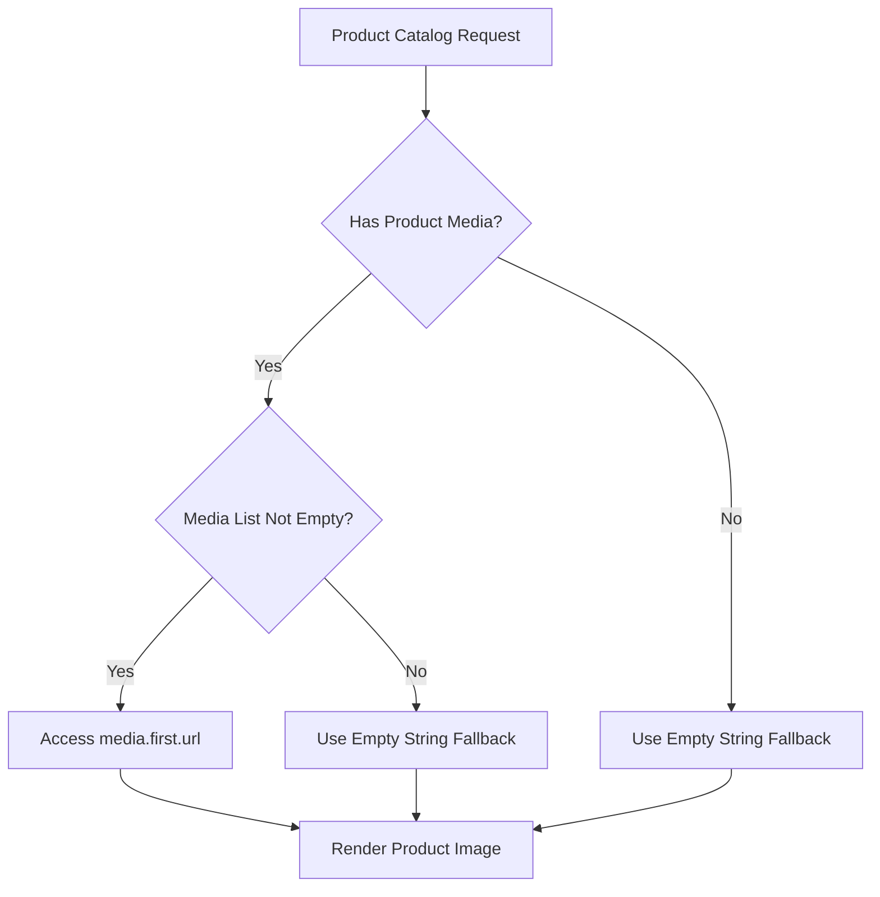

**Diagram sources**
- [home_our_products.dart:54-82](file://lib/features/home/widgets/home_widgets/home_our_products.dart#L54-L82)

#### Search Suggestions Validation
Global search suggestions implement primary image selection with fallback mechanisms:

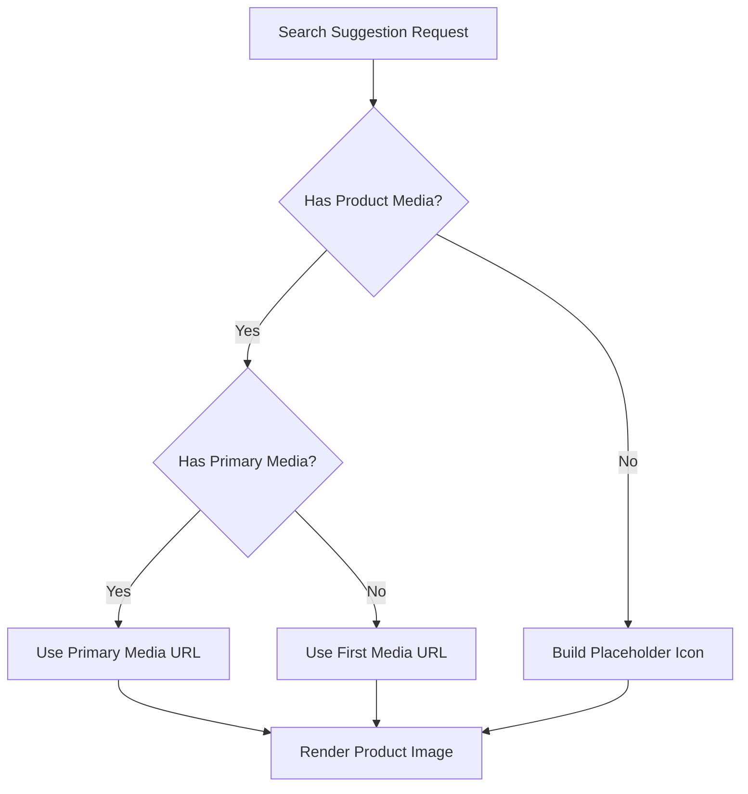

**Diagram sources**
- [global_search_suggestion_box.dart:151-182](file://lib/features/home/widgets/home_widgets/global_search_suggestion_box.dart#L151-L182)

### Image Loading Components

#### HomeProductDesign Component
Implements cached network image loading with comprehensive error handling:

**Key Features:**
- CachedNetworkImage for efficient image loading
- Placeholder loading indicator during image fetch
- Automatic fallback to loading state for failed requests
- Safe image URL handling with null checks

**Section sources**
- [home_product_design.dart:58-66](file://lib/features/home/widgets/home_widgets/home_product_design.dart#L58-L66)

#### Global Search Suggestion Box
Implements robust image loading with error handling and fallback icons:

**Key Features:**
- Primary image selection priority
- Fallback to first available image
- Error builder for network failures
- Placeholder icon for empty states
- Comprehensive null safety checks

**Section sources**
- [global_search_suggestion_box.dart:151-182](file://lib/features/home/widgets/home_widgets/global_search_suggestion_box.dart#L151-L182)

#### Product Details Image Gallery
Implements safe image navigation with fallback mechanisms:

**Key Features:**
- Local image assets for product details
- Navigation controls with boundary checking
- Placeholder handling for empty image lists
- Smooth transitions between images

**Section sources**
- [product_details_view_image.dart:33-51](file://lib/features/product_details.dart/widgets/product_details_view_widgets/product_details_view_image.dart#L33-L51)

### Error Handling Mechanisms

#### Fallback Strategies
- **Empty Media Lists**: Return empty string to prevent null pointer exceptions
- **Missing Primary Images**: Fall back to first available image
- **Network Failures**: Use placeholder icons instead of crashing
- **Null URLs**: Provide default empty string for safe rendering

#### Placeholder Components
- **Chair outline icons for empty product images**
- **Loading indicators during image fetch operations**
- **Graceful degradation when image loading fails**

**Section sources**
- [global_search_suggestion_box.dart:184-192](file://lib/features/home/widgets/home_widgets/global_search_suggestion_box.dart#L184-L192)
- [home_product_design.dart:63-64](file://lib/features/home/widgets/home_widgets/home_product_design.dart#L63-L64)

## Dependency Analysis
- Controllers depend on Repositories for data access.
- Repositories depend on Network utilities and HeadersManager for HTTP communication.
- Models encapsulate JSON serialization/deserialization and are consumed by Repositories and Controllers.
- Error handling is centralized via ErrorModel and ErrorSnackbar.
- Enhanced UI components provide reusable building blocks for consistent user experience.
- **Product Attributes System**: New dedicated controllers and repositories for attribute management.
- **Rating System**: Integrated rating components with dynamic visualization and review submission.
- **UI Safety Checks**: Comprehensive validation patterns ensure robust image loading across all components.

```mermaid
graph LR
PC["ProductDetailsController"] --> PDR["ProductDetailsRating"]
PC --> PDMI["ProductDetailsModel"]
PC --> CM["ProductsModel"]
PAC["ProductAttributesController"] --> PAM["ProductAttributesModel"]
PAC --> PAR["ProductAttributesRepository"]
OC["OrderController"] --> GR["GetOrdersRepository"]
GR --> GN["GetNetwork"]
GR --> HM["HeadersManager"]
GR --> EM["ErrorModel"]
OR["OrderReviewRepository"] --> PWR["PostWithoutResponse"]
OR --> HM
OR --> EM
PC --> ES["ErrorSnackbar"]
PC --> CRD["CustomRatingDialog"]
OC --> CRD
PC --> HPD["HomeProductDesign"]
PC --> GSSB["GlobalSearchSuggestionBox"]
PC --> HOUP["HomeOurProducts"]
PC --> PDVI["ProductDetailsViewImage"]
PAC --> GN
subgraph "Enhanced UI Dependencies"
CTFF["CustomTextFormField"] --> CTFF
CPHF["CustomPhoneField"] --> CPHF
CRB["CustomRatingBuilder"] --> CRB
CRBAR["CustomRatingBar"] --> CRBAR
SC["SharedContainer"] --> SC
IMG["Image Safety Checks"] --> IMG
ATTR["Product Attributes"] --> ATTR
REV["Rating & Reviews"] --> REV
END
```

**Diagram sources**
- [product_details_controller.dart:1-162](file://lib/features/product_details.dart/controller/product_details_controller.dart#L1-L162)
- [products_attributes_controller.dart:1-40](file://lib/features/product_details.dart/controller/products_attributes_controller.dart#L1-L40)
- [product_attributes_model.dart:1-100](file://lib/features/product_details.dart/models/product_attributes_model.dart#L1-L100)
- [product_details_rating.dart:1-94](file://lib/features/product_details.dart/widgets/product_details_view_widgets/product_details_rating.dart#L1-L94)
- [order_controller.dart:1-41](file://lib/features/order/controllers/order_controller.dart#L1-L41)
- [get_orders_repo.dart:1-20](file://lib/features/order/repositories/get_orders_repo.dart#L1-L20)
- [order_review_repo.dart:1-29](file://lib/features/order/repositories/order_review_repo.dart#L1-L29)
- [get_network.dart](file://lib/core/data/networks/get_network.dart)
- [post_without_response.dart](file://lib/core/data/networks/post_without_response.dart)
- [headers_manager.dart](file://lib/core/data/networks/headers_manager.dart)
- [error_model.dart](file://lib/core/data/global_models/error_model.dart)
- [error_snackbar.dart](file://lib/shared/widgets/snackbars/error_snackbar.dart)
- [products_model.dart:1-267](file://lib/features/home/models/products_model.dart#L1-L267)
- [product_details_model.dart:1-340](file://lib/features/product_details.dart/models/product_details_model.dart#L1-L340)
- [home_product_design.dart:1-99](file://lib/features/home/widgets/home_widgets/home_product_design.dart#L1-L99)
- [global_search_suggestion_box.dart:150-226](file://lib/features/home/widgets/home_widgets/global_search_suggestion_box.dart#L150-L226)
- [home_our_products.dart:54-82](file://lib/features/home/widgets/home_widgets/home_our_products.dart#L54-L82)
- [product_details_view_image.dart:1-97](file://lib/features/product_details.dart/widgets/product_details_view_widgets/product_details_view_image.dart#L1-L97)
- [custom_text_form_field.dart:1-191](file://lib/shared/widgets/custom_form_field/custom_text_form_field.dart#L1-L191)
- [custom_phone_field.dart:1-116](file://lib/shared/widgets/custom_form_field/custom_phone_field.dart#L1-L116)
- [custom_rating_builder.dart:1-35](file://lib/shared/widgets/custom_rating/custom_rating_builder.dart#L1-L35)
- [custom_rating_bar.dart:1-30](file://lib/shared/widgets/custom_rating/custom_rating_bar.dart#L1-L30)
- [custom_rating_dialog.dart:1-128](file://lib/shared/widgets/custom_dialog/custom_rating_dialog.dart#L1-L128)
- [shared_container.dart:1-57](file://lib/shared/widgets/shared_container.dart#L1-L57)

**Section sources**
- [order_bindings.dart:1-11](file://lib/features/order/bindings/order_bindings.dart#L1-L11)

## Performance Considerations
- Lazy Loading: Use lazy loading for heavy UI components (e.g., product carousels) to reduce initial load.
- Pagination: Utilize OrdersModel pagination links to implement infinite scroll or pagination controls.
- Caching: Cache frequently accessed product and order data to minimize network calls.
- Reactive Updates: Keep controllers reactive to avoid unnecessary rebuilds; use granular observables.
- UI Component Optimization: Enhanced form fields and rating components use efficient rendering patterns with proper widget caching.
- **Image Loading Optimization**: CachedNetworkImage implementation reduces memory usage and improves performance for repeated image loads.
- **Attribute Loading**: Product attributes are loaded asynchronously to prevent blocking the main UI thread.
- **Rating Calculation**: Star distribution calculations are performed efficiently with minimal computational overhead.

## Troubleshooting Guide
- Network Failures: Errors are returned as Either<ErrorModel, T>; ensure controllers handle failures gracefully and display user-friendly messages via ErrorSnackbar.
- Authentication: HeadersManager supplies standardized headers; verify tokens are attached for protected endpoints.
- UI Feedback: Use OrderController's loading state and error snackbar to inform users during data fetches.
- Form Validation: Custom validators provide clear error messages for invalid inputs in form fields.
- Rating System: Ensure proper initialization of rating components and handle edge cases in rating updates.
- **Image Loading Issues**: Verify media validation patterns are correctly implemented; check for null URL handling and fallback mechanisms.
- **Empty Product States**: Ensure fallback placeholders are displayed when product media is unavailable.
- **Attribute Loading**: Verify ProductAttributesController properly handles loading states and error conditions.
- **Rating Distribution**: Ensure star count calculations handle edge cases like empty review lists or invalid rating values.

**Section sources**
- [order_controller.dart:16-27](file://lib/features/order/controllers/order_controller.dart#L16-L27)
- [error_model.dart](file://lib/core/data/global_models/error_model.dart)
- [error_snackbar.dart](file://lib/shared/widgets/snackbars/error_snackbar.dart)
- [headers_manager.dart](file://lib/core/data/networks/headers_manager.dart)
- [phone_validator.dart:1-15](file://lib/shared/extensions/validators/phone_validator.dart#L1-L15)
- [products_attributes_controller.dart:20-28](file://lib/features/product_details.dart/controller/products_attributes_controller.dart#L20-L28)
- [product_details_rating.dart:21-38](file://lib/features/product_details.dart/widgets/product_details_view_widgets/product_details_rating.dart#L21-L38)

## Conclusion
The e-commerce platform establishes a solid foundation with product catalogs, order retrieval, and UI controllers. Recent enhancements significantly improve the user experience through comprehensive form field components, custom phone field validation, rating bar widgets, robust UI safety checks for product image loading, and **major architectural additions** including:

### Major Enhancements
- **Comprehensive Product Attributes System**: Dynamic attribute management with pricing, stock, and default options for complex product customization
- **Enhanced Rating and Review System**: Detailed star distribution visualization, interactive rating submission, and comprehensive review management
- **Improved Product Details Architecture**: Integrated rating/review components with dynamic attribute sections
- **Expanded UI Component Library**: Specialized rating components with progress indicators and detailed visualization

### Architectural Improvements
- **Separate Controllers**: Dedicated ProductAttributesController for attribute management alongside ProductDetailsController
- **Modular Rating System**: Standalone rating components with reusable visualization patterns
- **Enhanced Data Models**: Comprehensive ProductDetailsModel with rich metadata and review information
- **Improved User Experience**: Interactive rating submission, detailed feedback visualization, and seamless attribute selection

### Missing Components
The platform still requires cart functionality, checkout flow, payment gateway integration, category filtering, and inventory management. Extending the existing architecture with repositories and controllers for these features will complete the end-to-end shopping experience while maintaining modularity, testability, and robust error handling across all image loading scenarios and enhanced rating systems.

The recent enhancements represent a significant step forward in creating a comprehensive e-commerce platform that provides rich product information, detailed customer feedback mechanisms, and robust image handling capabilities essential for modern e-commerce applications.