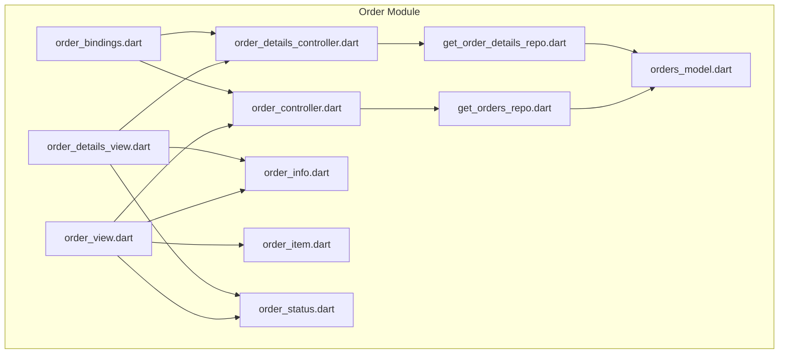
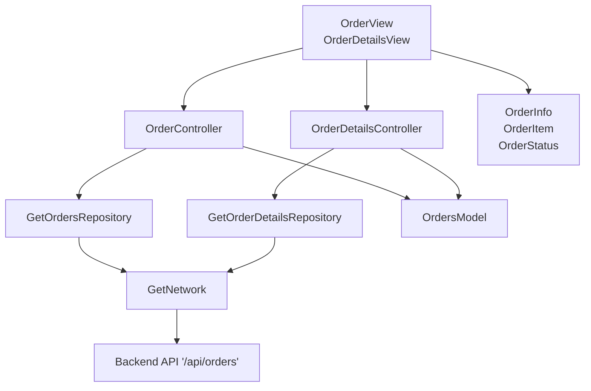
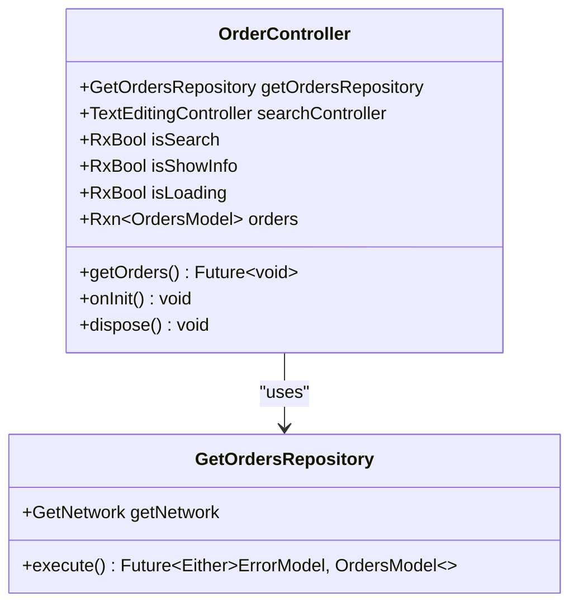
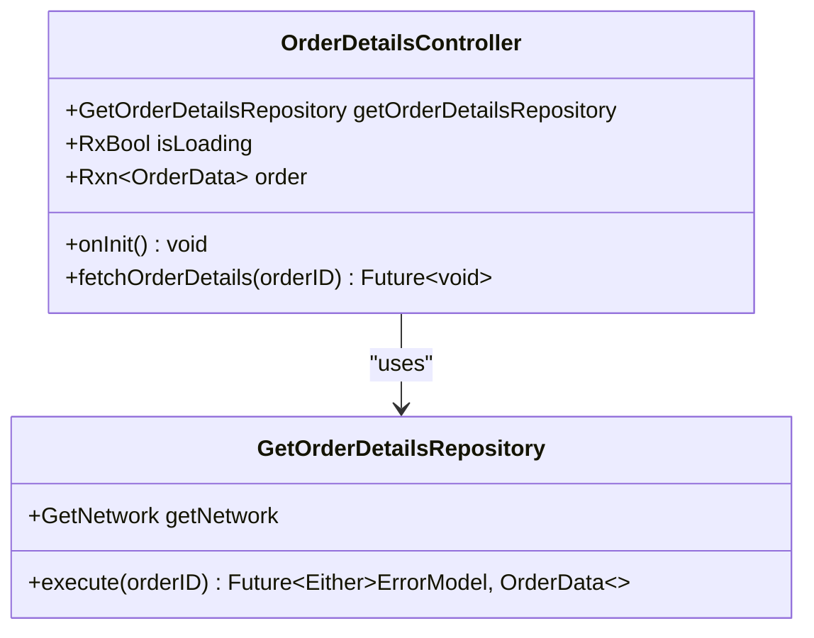
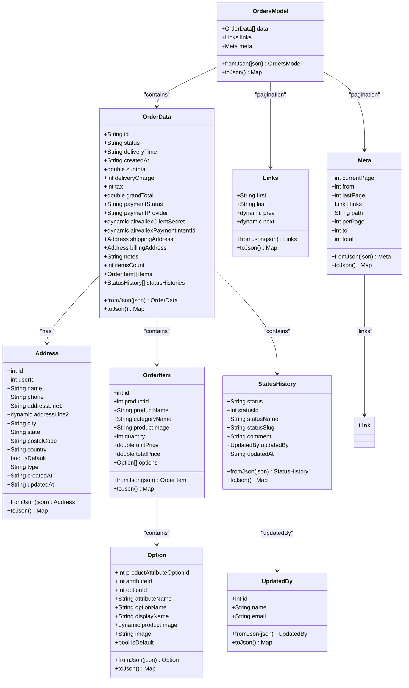
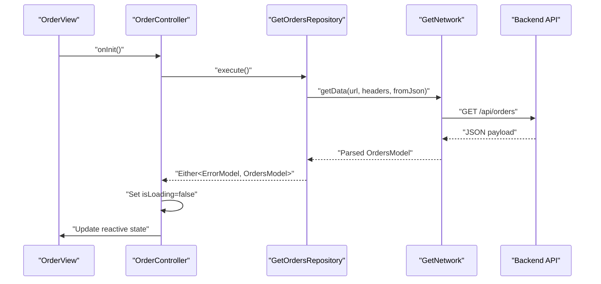
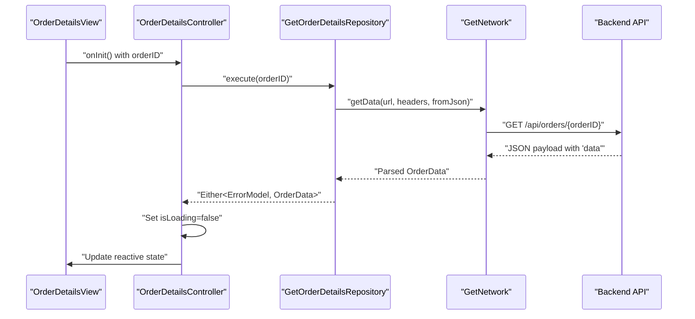
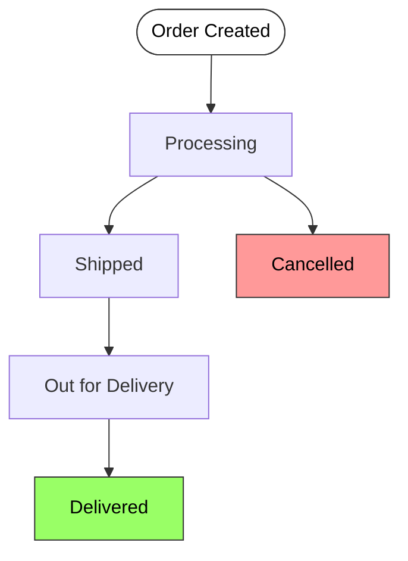
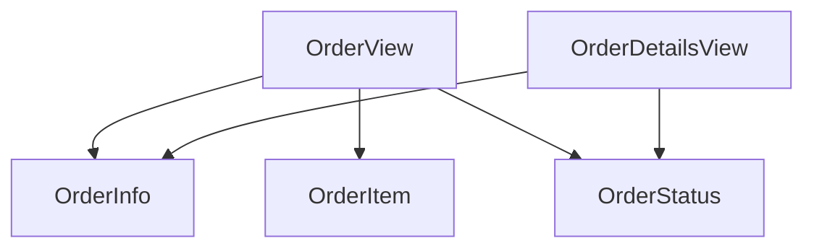
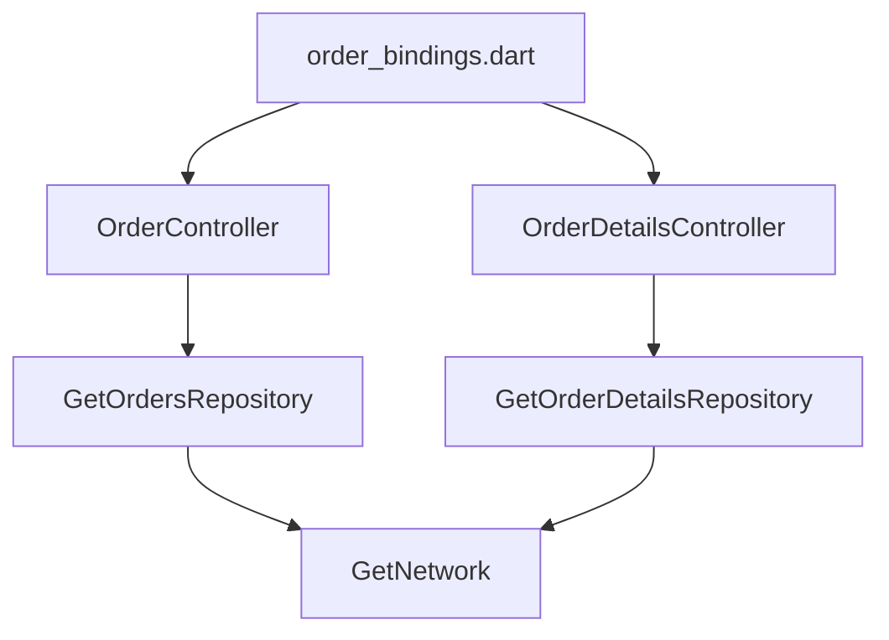

# Order Management System

<cite>
**Referenced Files in This Document**
- [order_controller.dart](file://lib/features/order/controllers/order_controller.dart)
- [order_details_controller.dart](file://lib/features/order/controllers/order_details_controller.dart)
- [orders_model.dart](file://lib/features/order/models/orders_model.dart)
- [get_orders_repo.dart](file://lib/features/order/repositories/get_orders_repo.dart)
- [get_order_details_repo.dart](file://lib/features/order/repositories/get_order_details_repo.dart)
- [order_bindings.dart](file://lib/features/order/bindings/order_bindings.dart)
- [order_view.dart](file://lib/features/order/views/order_view.dart)
- [order_details_view.dart](file://lib/features/order/views/order_details_view.dart)
- [order_info.dart](file://lib/features/order/widgets/order_widgets/order_info.dart)
- [order_item.dart](file://lib/features/order/widgets/order_widgets/order_item.dart)
- [order_status.dart](file://lib/features/order/widgets/order_widgets/order_status.dart)
</cite>

## Table of Contents
1. [Introduction](#introduction)
2. [Project Structure](#project-structure)
3. [Core Components](#core-components)
4. [Architecture Overview](#architecture-overview)
5. [Detailed Component Analysis](#detailed-component-analysis)
6. [Dependency Analysis](#dependency-analysis)
7. [Performance Considerations](#performance-considerations)
8. [Troubleshooting Guide](#troubleshooting-guide)
9. [Conclusion](#conclusion)
10. [Appendices](#appendices)

## Introduction
This document provides comprehensive documentation for the Order Management System within the ZB-DEZINE Flutter application. It covers the order controller implementation, order lifecycle management, and state transitions. It also explains the order models (order headers, line items, and status tracking), repository patterns for data persistence and retrieval, and the order view components including order history display and order detail screens. Additionally, it outlines integrations with cart, payment, and order processing systems, and provides examples of order creation, modification, cancellation workflows, and status updates. Finally, it addresses order analytics, reporting capabilities, and customer order management features.

## Project Structure
The Order Management System is organized under the features/order module with clear separation of concerns:
- Controllers: Manage UI state and orchestrate data fetching and updates.
- Models: Define data structures for orders, line items, addresses, and status histories.
- Repositories: Encapsulate network calls and data retrieval logic.
- Views: Present order lists and details to users.
- Widgets: Reusable UI components for rendering order information, items, and status timelines.
- Bindings: Configure dependency injection for controllers and repositories.

**Diagram sources**
- [order_view.dart](file://lib/features/order/views/order_view.dart)
- [order_details_view.dart](file://lib/features/order/views/order_details_view.dart)
- [order_controller.dart](file://lib/features/order/controllers/order_controller.dart)
- [order_details_controller.dart](file://lib/features/order/controllers/order_details_controller.dart)
- [get_orders_repo.dart](file://lib/features/order/repositories/get_orders_repo.dart)
- [get_order_details_repo.dart](file://lib/features/order/repositories/get_order_details_repo.dart)
- [orders_model.dart](file://lib/features/order/models/orders_model.dart)
- [order_info.dart](file://lib/features/order/widgets/order_widgets/order_info.dart)
- [order_item.dart](file://lib/features/order/widgets/order_widgets/order_item.dart)
- [order_status.dart](file://lib/features/order/widgets/order_widgets/order_status.dart)
- [order_bindings.dart](file://lib/features/order/bindings/order_bindings.dart)

**Section sources**
- [order_bindings.dart](file://lib/features/order/bindings/order_bindings.dart)
- [order_controller.dart](file://lib/features/order/controllers/order_controller.dart)
- [order_details_controller.dart](file://lib/features/order/controllers/order_details_controller.dart)
- [orders_model.dart](file://lib/features/order/models/orders_model.dart)
- [get_orders_repo.dart](file://lib/features/order/repositories/get_orders_repo.dart)
- [get_order_details_repo.dart](file://lib/features/order/repositories/get_order_details_repo.dart)
- [order_view.dart](file://lib/features/order/views/order_view.dart)
- [order_details_view.dart](file://lib/features/order/views/order_details_view.dart)
- [order_info.dart](file://lib/features/order/widgets/order_widgets/order_info.dart)
- [order_item.dart](file://lib/features/order/widgets/order_widgets/order_item.dart)
- [order_status.dart](file://lib/features/order/widgets/order_widgets/order_status.dart)

## Core Components
This section documents the primary components of the Order Management System, focusing on controllers, models, repositories, and view widgets.

- OrderController
  - Responsibilities: Fetches order history from the backend via a repository, manages loading states, and exposes reactive UI bindings.
  - Key behaviors: Initializes by fetching orders on controller initialization, handles errors via a snackbar, and updates reactive state for UI rendering.
  - Reactive state: isLoading, orders, search-related fields, and show info toggle.

- OrderDetailsController
  - Responsibilities: Retrieves a specific order by ID from the backend, manages loading states, and exposes reactive UI bindings for order details.
  - Key behaviors: Uses Get.arguments to receive order ID, delegates to repository for data retrieval, and handles errors via a snackbar.

- OrdersModel
  - Responsibilities: Defines the data structures for orders, order items, addresses, status histories, pagination metadata, and related entities.
  - Key structures:
    - OrdersModel: Top-level container with data array, pagination links, and metadata.
    - OrderData: Header-level order information including totals, payment status, addresses, and items.
    - Address: Shipping and billing address details.
    - OrderItem: Product line items with options.
    - Option: Product attribute options.
    - StatusHistory: Historical status updates with timestamps and actors.
    - Links/Meta/Link: Pagination support structures.

- GetOrdersRepository
  - Responsibilities: Executes GET requests to retrieve order history, applies headers, and parses JSON into OrdersModel.
  - Key behaviors: Returns Either<ErrorModel, OrdersModel> for safe error handling.

- GetOrderDetailsRepository
  - Responsibilities: Executes GET requests to retrieve a single order by ID, applies headers, and parses nested JSON into OrderData.
  - Key behaviors: Returns Either<ErrorModel, OrderData> for safe error handling.

- View Components
  - OrderView: Renders a scrollable list of orders with expandable details, action buttons, and status timeline.
  - OrderDetailsView: Displays detailed information for a selected order, including items and status history.

- Widget Components
  - OrderInfo: Displays order placement date, order ID, current status, and total amount.
  - OrderItem: Lists ordered products with thumbnails and names.
  - OrderStatus: Renders a timeline of status updates with formatted timestamps.

**Section sources**
- [order_controller.dart](file://lib/features/order/controllers/order_controller.dart)
- [order_details_controller.dart](file://lib/features/order/controllers/order_details_controller.dart)
- [orders_model.dart](file://lib/features/order/models/orders_model.dart)
- [get_orders_repo.dart](file://lib/features/order/repositories/get_orders_repo.dart)
- [get_order_details_repo.dart](file://lib/features/order/repositories/get_order_details_repo.dart)
- [order_view.dart](file://lib/features/order/views/order_view.dart)
- [order_details_view.dart](file://lib/features/order/views/order_details_view.dart)
- [order_info.dart](file://lib/features/order/widgets/order_widgets/order_info.dart)
- [order_item.dart](file://lib/features/order/widgets/order_widgets/order_item.dart)
- [order_status.dart](file://lib/features/order/widgets/order_widgets/order_status.dart)

## Architecture Overview
The Order Management System follows a layered architecture:
- Presentation Layer: Views and widgets render order data and collect user interactions.
- Controller Layer: GetX controllers manage state and coordinate with repositories.
- Repository Layer: Network repositories encapsulate API calls and data parsing.
- Model Layer: Strongly typed models define the domain data structures.

**Diagram sources**
- [order_view.dart](file://lib/features/order/views/order_view.dart)
- [order_details_view.dart](file://lib/features/order/views/order_details_view.dart)
- [order_controller.dart](file://lib/features/order/controllers/order_controller.dart)
- [order_details_controller.dart](file://lib/features/order/controllers/order_details_controller.dart)
- [get_orders_repo.dart](file://lib/features/order/repositories/get_orders_repo.dart)
- [get_order_details_repo.dart](file://lib/features/order/repositories/get_order_details_repo.dart)
- [orders_model.dart](file://lib/features/order/models/orders_model.dart)
- [order_info.dart](file://lib/features/order/widgets/order_widgets/order_info.dart)
- [order_item.dart](file://lib/features/order/widgets/order_widgets/order_item.dart)
- [order_status.dart](file://lib/features/order/widgets/order_widgets/order_status.dart)

## Detailed Component Analysis

### OrderController Analysis
The OrderController orchestrates order history retrieval and UI state management.

**Diagram sources**
- [order_controller.dart](file://lib/features/order/controllers/order_controller.dart)
- [get_orders_repo.dart](file://lib/features/order/repositories/get_orders_repo.dart)

Key behaviors:
- Initialization triggers order retrieval.
- Loading state is toggled after the network response.
- Errors are surfaced via a snackbar.
- Reactive state powers the OrderView list rendering.

**Section sources**
- [order_controller.dart](file://lib/features/order/controllers/order_controller.dart)

### OrderDetailsController Analysis
The OrderDetailsController retrieves a specific order by ID and manages detail view state.

**Diagram sources**
- [order_details_controller.dart](file://lib/features/order/controllers/order_details_controller.dart)
- [get_order_details_repo.dart](file://lib/features/order/repositories/get_order_details_repo.dart)

Key behaviors:
- Receives order ID from navigation arguments.
- Delegates to repository for fetching order details.
- Handles loading state and error presentation.

**Section sources**
- [order_details_controller.dart](file://lib/features/order/controllers/order_details_controller.dart)

### OrdersModel Analysis
The OrdersModel defines the complete order domain model with nested structures for items, addresses, and status history.

**Diagram sources**
- [orders_model.dart](file://lib/features/order/models/orders_model.dart)

Key characteristics:
- Strong typing for numeric fields with safe casting to doubles.
- Nested serialization/deserialization for complex structures.
- Pagination support via Links and Meta.

**Section sources**
- [orders_model.dart](file://lib/features/order/models/orders_model.dart)

### Repository Patterns and Data Persistence
Repositories encapsulate network logic and error handling.

**Diagram sources**
- [order_view.dart](file://lib/features/order/views/order_view.dart)
- [order_controller.dart](file://lib/features/order/controllers/order_controller.dart)
- [get_orders_repo.dart](file://lib/features/order/repositories/get_orders_repo.dart)

Additional sequence for order details:

**Diagram sources**
- [order_details_view.dart](file://lib/features/order/views/order_details_view.dart)
- [order_details_controller.dart](file://lib/features/order/controllers/order_details_controller.dart)
- [get_order_details_repo.dart](file://lib/features/order/repositories/get_order_details_repo.dart)

**Section sources**
- [get_orders_repo.dart](file://lib/features/order/repositories/get_orders_repo.dart)
- [get_order_details_repo.dart](file://lib/features/order/repositories/get_order_details_repo.dart)

### Order Lifecycle Management and State Transitions
Order lifecycle and state transitions are represented by the StatusHistory collection within OrderData.

[No sources needed since this diagram shows conceptual workflow, not actual code structure]

### Order View Components
Order views and widgets render order history and details.

**Diagram sources**
- [order_view.dart](file://lib/features/order/views/order_view.dart)
- [order_details_view.dart](file://lib/features/order/views/order_details_view.dart)
- [order_info.dart](file://lib/features/order/widgets/order_widgets/order_info.dart)
- [order_item.dart](file://lib/features/order/widgets/order_widgets/order_item.dart)
- [order_status.dart](file://lib/features/order/widgets/order_widgets/order_status.dart)

**Section sources**
- [order_view.dart](file://lib/features/order/views/order_view.dart)
- [order_details_view.dart](file://lib/features/order/views/order_details_view.dart)
- [order_info.dart](file://lib/features/order/widgets/order_widgets/order_info.dart)
- [order_item.dart](file://lib/features/order/widgets/order_widgets/order_item.dart)
- [order_status.dart](file://lib/features/order/widgets/order_widgets/order_status.dart)

### Integration Between Cart, Payment, and Order Processing Systems
- Cart-to-Order Integration: The order creation workflow typically originates from the cart. After checkout, the cart is submitted to the backend, which creates an order record and returns an OrderData object containing payment identifiers (e.g., Airwallex client secret and payment intent ID).
- Payment Integration: Payment providers are integrated via payment identifiers embedded in OrderData. The payment flow uses these identifiers to finalize transactions.
- Order Processing: Once payment is confirmed, the order status transitions through predefined states (Processing, Shipped, Out for Delivery, Delivered), tracked in StatusHistory.

[No sources needed since this section provides conceptual integration guidance]

### Examples of Workflows
- Order Creation
  - Trigger: User proceeds to checkout from the cart.
  - Backend: Creates an OrderData with initial status and payment identifiers.
  - Frontend: Displays order summary and initiates payment using identifiers.
  - Outcome: Order appears in OrderView with initial status.

- Order Modification
  - Trigger: Customer requests changes (e.g., delivery address).
  - Backend: Updates OrderData and appends a StatusHistory entry.
  - Frontend: Refreshes OrderDetailsView to reflect changes.

- Order Cancellation
  - Trigger: Customer cancels order within allowed window.
  - Backend: Updates status to Cancelled and records StatusHistory.
  - Frontend: Reflects cancellation in OrderView and OrderDetailsView.

[No sources needed since this section provides conceptual workflow examples]

### Order Analytics and Reporting
- Analytics: Use OrderData fields (totals, dates, items count) to compute KPIs such as total revenue, average order value, and conversion rates.
- Reporting: Aggregate OrdersModel.data to generate reports on top-selling products, regional sales, and customer purchase patterns.

[No sources needed since this section provides general guidance]

### Customer Order Management Features
- Order History: Browse past orders via OrderView.
- Order Details: Inspect items, addresses, and status timeline via OrderDetailsView.
- Expandable Details: Toggle detailed sections in OrderView for items and status updates.
- Status Tracking: Visual timeline of status updates in OrderStatus.

**Section sources**
- [order_view.dart](file://lib/features/order/views/order_view.dart)
- [order_details_view.dart](file://lib/features/order/views/order_details_view.dart)
- [order_status.dart](file://lib/features/order/widgets/order_widgets/order_status.dart)

## Dependency Analysis
The dependency injection setup binds controllers to their repositories using GetX lazy loading.

**Diagram sources**
- [order_bindings.dart](file://lib/features/order/bindings/order_bindings.dart)
- [order_controller.dart](file://lib/features/order/controllers/order_controller.dart)
- [order_details_controller.dart](file://lib/features/order/controllers/order_details_controller.dart)
- [get_orders_repo.dart](file://lib/features/order/repositories/get_orders_repo.dart)
- [get_order_details_repo.dart](file://lib/features/order/repositories/get_order_details_repo.dart)

**Section sources**
- [order_bindings.dart](file://lib/features/order/bindings/order_bindings.dart)

## Performance Considerations
- Reactive Rendering: Use Obx and reactive fields to minimize unnecessary rebuilds.
- Lazy Loading: Get.lazyPut ensures repositories are instantiated only when needed.
- Efficient Lists: Use ListView.builder for large order lists to reduce memory footprint.
- Image Loading: CachedNetworkImage improves performance for product thumbnails.
- Pagination: Utilize Links and Meta structures to implement paginated order retrieval.

[No sources needed since this section provides general guidance]

## Troubleshooting Guide
Common issues and resolutions:
- Network Failures
  - Symptom: Orders fail to load.
  - Resolution: Check repository error handling and display user-friendly messages via snackbars.
- Empty Data
  - Symptom: No orders displayed.
  - Resolution: Verify API endpoint correctness and authentication headers.
- UI State Stuck
  - Symptom: Loading indicator remains visible.
  - Resolution: Ensure isLoading is set to false after network response in controllers.
- Argument Passing
  - Symptom: Order details not loading.
  - Resolution: Confirm order ID is passed via Get.arguments and accessed in OrderDetailsController.onInit.

**Section sources**
- [order_controller.dart](file://lib/features/order/controllers/order_controller.dart)
- [order_details_controller.dart](file://lib/features/order/controllers/order_details_controller.dart)

## Conclusion
The Order Management System provides a robust, modular solution for managing orders, integrating seamlessly with cart and payment systems. Its layered architecture, strong models, and reactive controllers enable efficient order lifecycle management, detailed order views, and scalable data retrieval. By leveraging pagination, reactive UI patterns, and structured error handling, the system supports both customer-facing order management and backend analytics/reporting needs.

## Appendices
- API Endpoints
  - GET /api/orders: Retrieve order history.
  - GET /api/orders/{orderID}: Retrieve a specific order by ID.
- Data Fields of Interest
  - OrderData: status, grandTotal, createdAt, itemsCount, statusHistories.
  - OrderItem: productName, productImage, quantity, unitPrice, totalPrice.
  - StatusHistory: statusName, updatedAt, comment.

[No sources needed since this section provides general guidance]