# Order Management System

<cite>
**Referenced Files in This Document**
- [order_bindings.dart](file://lib/features/order/bindings/order_bindings.dart)
- [order_details_bindings.dart](file://lib/features/order/bindings/order_details_bindings.dart)
- [order_controller.dart](file://lib/features/order/controllers/order_controller.dart)
- [order_details_controller.dart](file://lib/features/order/controllers/order_details_controller.dart)
- [order_review_controller.dart](file://lib/features/order/controllers/order_review_controller.dart)
- [orders_model.dart](file://lib/features/order/models/orders_model.dart)
- [get_orders_repo.dart](file://lib/features/order/repositories/get_orders_repo.dart)
- [get_order_details_repo.dart](file://lib/features/order/repositories/get_order_details_repo.dart)
- [order_review_repo.dart](file://lib/features/order/repositories/order_review_repo.dart)
- [order_view.dart](file://lib/features/order/views/order_view.dart)
- [order_details_view.dart](file://lib/features/order/views/order_details_view.dart)
- [order_header.dart](file://lib/features/order/widgets/order_widgets/order_header.dart)
- [order_button.dart](file://lib/features/order/widgets/order_widgets/order_button.dart)
- [order_details_info.dart](file://lib/features/order/widgets/order_details_widgets/order_details_info.dart)
- [order_details_status.dart](file://lib/features/order/widgets/order_details_widgets/order_details_status.dart)
- [order_info.dart](file://lib/features/order/widgets/order_widgets/order_info.dart)
- [order_item.dart](file://lib/features/order/widgets/order_widgets/order_item.dart)
- [order_status.dart](file://lib/features/order/widgets/order_widgets/order_status.dart)
</cite>

## Update Summary
**Changes Made**
- Added new OrderReviewController and OrderReviewRepository for product review functionality
- Enhanced OrderHeader widget with improved search functionality and animated transitions
- Added OrderButton widget for unified action buttons across order views
- Introduced OrderDetailsInfo and OrderDetailsStatus widgets for enhanced order detail display
- Updated dependency injection with new OrderDetailsBindings configuration
- Enhanced OrderView with animated expandable order details
- Added review submission capability with rating dialog integration

## Table of Contents
1. [Introduction](#introduction)
2. [Project Structure](#project-structure)
3. [Core Components](#core-components)
4. [Architecture Overview](#architecture-overview)
5. [Detailed Component Analysis](#detailed-component-analysis)
6. [Enhanced UI Components](#enhanced-ui-components)
7. [Dependency Analysis](#dependency-analysis)
8. [Performance Considerations](#performance-considerations)
9. [Troubleshooting Guide](#troubleshooting-guide)
10. [Conclusion](#conclusion)
11. [Appendices](#appendices)

## Introduction
This document provides comprehensive documentation for the Order Management System within the ZB-DEZINE Flutter application. The system has been enhanced with new bindings, improved repository integration, and enhanced UI components for better order tracking and management. It covers the order controller implementation, order lifecycle management, and state transitions, along with the new review submission functionality. The documentation explains the order models (order headers, line items, and status tracking), repository patterns for data persistence and retrieval, and the expanded order view components including order history display, order detail screens, and product review capabilities.

## Project Structure
The Order Management System is organized under the features/order module with clear separation of concerns and enhanced UI components:
- Controllers: Manage UI state, orchestrate data fetching, updates, and review submissions
- Models: Define data structures for orders, line items, addresses, status histories, and pagination metadata
- Repositories: Encapsulate network calls, data retrieval logic, and review submission functionality
- Views: Present order lists, details, and review interfaces to users
- Widgets: Reusable UI components for rendering order information, items, status timelines, and actions
- Bindings: Configure dependency injection for controllers, repositories, and enhanced routing

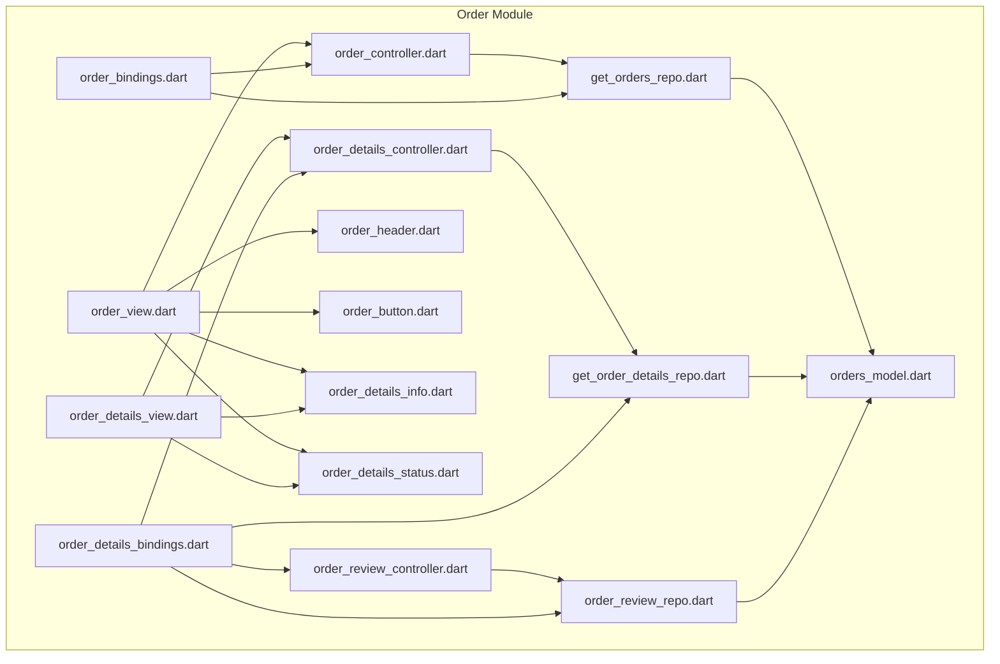

**Diagram sources**
- [order_view.dart](file://lib/features/order/views/order_view.dart)
- [order_details_view.dart](file://lib/features/order/views/order_details_view.dart)
- [order_controller.dart](file://lib/features/order/controllers/order_controller.dart)
- [order_details_controller.dart](file://lib/features/order/controllers/order_details_controller.dart)
- [order_review_controller.dart](file://lib/features/order/controllers/order_review_controller.dart)
- [get_orders_repo.dart](file://lib/features/order/repositories/get_orders_repo.dart)
- [get_order_details_repo.dart](file://lib/features/order/repositories/get_order_details_repo.dart)
- [order_review_repo.dart](file://lib/features/order/repositories/order_review_repo.dart)
- [orders_model.dart](file://lib/features/order/models/orders_model.dart)
- [order_header.dart](file://lib/features/order/widgets/order_widgets/order_header.dart)
- [order_button.dart](file://lib/features/order/widgets/order_widgets/order_button.dart)
- [order_details_info.dart](file://lib/features/order/widgets/order_details_widgets/order_details_info.dart)
- [order_details_status.dart](file://lib/features/order/widgets/order_details_widgets/order_details_status.dart)
- [order_bindings.dart](file://lib/features/order/bindings/order_bindings.dart)
- [order_details_bindings.dart](file://lib/features/order/bindings/order_details_bindings.dart)

**Section sources**
- [order_bindings.dart](file://lib/features/order/bindings/order_bindings.dart)
- [order_details_bindings.dart](file://lib/features/order/bindings/order_details_bindings.dart)
- [order_controller.dart](file://lib/features/order/controllers/order_controller.dart)
- [order_details_controller.dart](file://lib/features/order/controllers/order_details_controller.dart)
- [order_review_controller.dart](file://lib/features/order/controllers/order_review_controller.dart)
- [orders_model.dart](file://lib/features/order/models/orders_model.dart)
- [get_orders_repo.dart](file://lib/features/order/repositories/get_orders_repo.dart)
- [get_order_details_repo.dart](file://lib/features/order/repositories/get_order_details_repo.dart)
- [order_review_repo.dart](file://lib/features/order/repositories/order_review_repo.dart)
- [order_view.dart](file://lib/features/order/views/order_view.dart)
- [order_details_view.dart](file://lib/features/order/views/order_details_view.dart)
- [order_header.dart](file://lib/features/order/widgets/order_widgets/order_header.dart)
- [order_button.dart](file://lib/features/order/widgets/order_widgets/order_button.dart)
- [order_details_info.dart](file://lib/features/order/widgets/order_details_widgets/order_details_info.dart)
- [order_details_status.dart](file://lib/features/order/widgets/order_details_widgets/order_details_status.dart)

## Core Components
This section documents the enhanced primary components of the Order Management System, focusing on controllers, models, repositories, and view widgets.

- OrderController
  - Responsibilities: Fetches order history from the backend via a repository, manages loading states, search functionality, and exposes reactive UI bindings
  - Key behaviors: Initializes by fetching orders on controller initialization, handles errors via a snackbar, manages search state, and updates reactive state for UI rendering
  - Reactive state: isLoading, orders, searchController, isSearch, isShowInfo

- OrderDetailsController
  - Responsibilities: Retrieves a specific order by ID from the backend, manages loading states, and exposes reactive UI bindings for order details
  - Key behaviors: Uses Get.arguments to receive order ID, delegates to repository for data retrieval, and handles errors via a snackbar

- OrderReviewController
  - Responsibilities: Manages product review submission process, validates input, handles loading states, and coordinates with OrderReviewRepository
  - Key behaviors: Validates rating and review content, manages loading state during submission, handles success/error responses, and provides feedback via snackbars
  - Reactive state: rating, ratingController, isLoading, order

- OrdersModel
  - Responsibilities: Defines the data structures for orders, order items, addresses, status histories, pagination metadata, and related entities
  - Key structures:
    - OrdersModel: Top-level container with data array, pagination links, and metadata
    - OrderData: Header-level order information including totals, payment status, addresses, and items
    - Address: Shipping and billing address details
    - OrderItem: Product line items with options
    - Option: Product attribute options
    - StatusHistory: Historical status updates with timestamps and actors
    - Links/Meta/Link: Pagination support structures

- Enhanced Repository Pattern
  - GetOrdersRepository: Executes GET requests to retrieve order history with safe error handling
  - GetOrderDetailsRepository: Executes GET requests to retrieve a single order by ID with nested JSON parsing
  - OrderReviewRepository: Handles POST requests for product review submissions with validation and error handling

**Section sources**
- [order_controller.dart](file://lib/features/order/controllers/order_controller.dart)
- [order_details_controller.dart](file://lib/features/order/controllers/order_details_controller.dart)
- [order_review_controller.dart](file://lib/features/order/controllers/order_review_controller.dart)
- [orders_model.dart](file://lib/features/order/models/orders_model.dart)
- [get_orders_repo.dart](file://lib/features/order/repositories/get_orders_repo.dart)
- [get_order_details_repo.dart](file://lib/features/order/repositories/get_order_details_repo.dart)
- [order_review_repo.dart](file://lib/features/order/repositories/order_review_repo.dart)

## Architecture Overview
The Order Management System follows an enhanced layered architecture with improved modularity and enhanced UI components:
- Presentation Layer: Views and widgets render order data, collect user interactions, and provide review submission interfaces
- Controller Layer: GetX controllers manage state, coordinate with repositories, and handle review submissions
- Repository Layer: Network repositories encapsulate API calls, data parsing, and review submission logic
- Model Layer: Strongly typed models define the domain data structures with enhanced serialization support

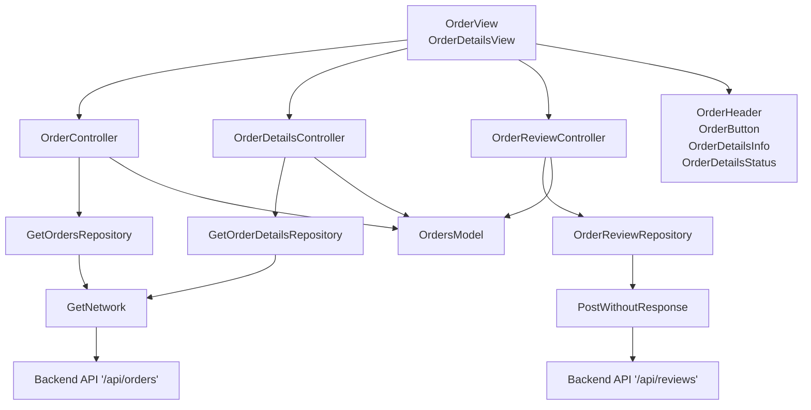

**Diagram sources**
- [order_view.dart](file://lib/features/order/views/order_view.dart)
- [order_details_view.dart](file://lib/features/order/views/order_details_view.dart)
- [order_controller.dart](file://lib/features/order/controllers/order_controller.dart)
- [order_details_controller.dart](file://lib/features/order/controllers/order_details_controller.dart)
- [order_review_controller.dart](file://lib/features/order/controllers/order_review_controller.dart)
- [get_orders_repo.dart](file://lib/features/order/repositories/get_orders_repo.dart)
- [get_order_details_repo.dart](file://lib/features/order/repositories/get_order_details_repo.dart)
- [order_review_repo.dart](file://lib/features/order/repositories/order_review_repo.dart)
- [orders_model.dart](file://lib/features/order/models/orders_model.dart)
- [order_header.dart](file://lib/features/order/widgets/order_widgets/order_header.dart)
- [order_button.dart](file://lib/features/order/widgets/order_widgets/order_button.dart)
- [order_details_info.dart](file://lib/features/order/widgets/order_details_widgets/order_details_info.dart)
- [order_details_status.dart](file://lib/features/order/widgets/order_details_widgets/order_details_status.dart)

## Detailed Component Analysis

### Enhanced OrderController Analysis
The OrderController orchestrates order history retrieval and UI state management with improved search functionality.

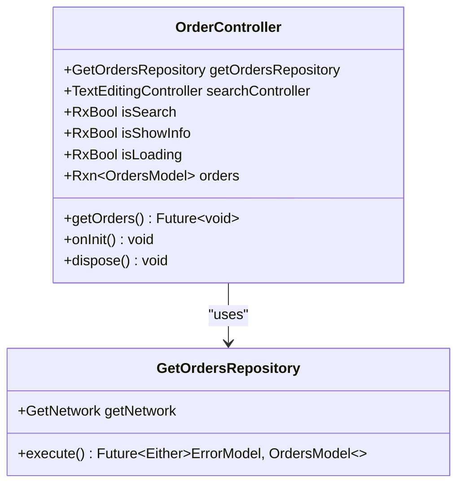

**Diagram sources**
- [order_controller.dart](file://lib/features/order/controllers/order_controller.dart)
- [get_orders_repo.dart](file://lib/features/order/repositories/get_orders_repo.dart)

Key behaviors:
- Initialization triggers order retrieval with automatic loading state management
- Enhanced search functionality with animated transitions and form field support
- Loading state is toggled after network response with proper error handling
- Reactive state powers the OrderView list rendering with expandable details

**Section sources**
- [order_controller.dart](file://lib/features/order/controllers/order_controller.dart)

### OrderDetailsController Analysis
The OrderDetailsController retrieves a specific order by ID and manages detail view state with enhanced UI components.

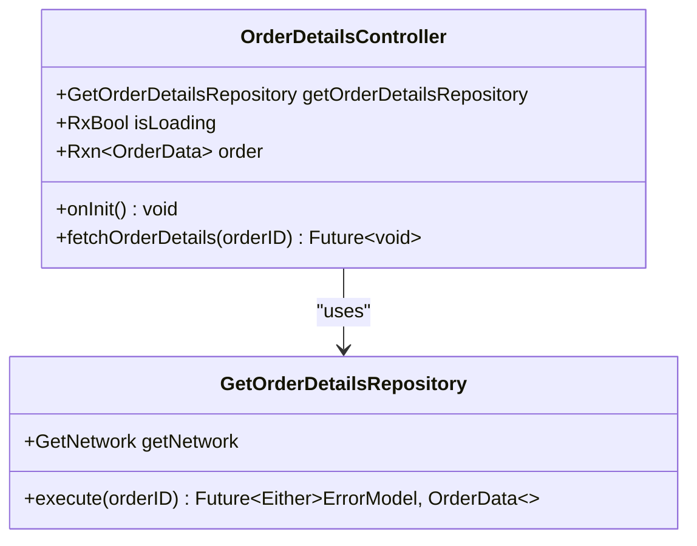

**Diagram sources**
- [order_details_controller.dart](file://lib/features/order/controllers/order_details_controller.dart)
- [get_order_details_repo.dart](file://lib/features/order/repositories/get_order_details_repo.dart)

Key behaviors:
- Receives order ID from navigation arguments with string conversion
- Delegates to repository for fetching order details with enhanced error handling
- Manages loading state and provides reactive state for OrderDetailsView

**Section sources**
- [order_details_controller.dart](file://lib/features/order/controllers/order_details_controller.dart)

### OrderReviewController Analysis
The OrderReviewController manages product review submission process with validation and user feedback.

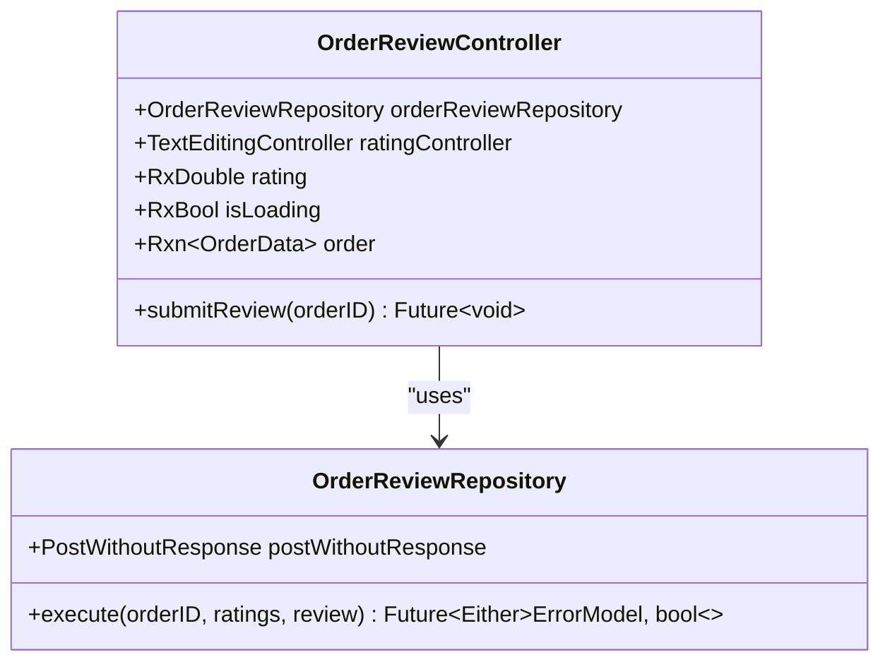

**Diagram sources**
- [order_review_controller.dart](file://lib/features/order/controllers/order_review_controller.dart)
- [order_review_repo.dart](file://lib/features/order/repositories/order_review_repo.dart)

Key behaviors:
- Validates rating (must be greater than 0) and review content (non-empty)
- Manages loading state during submission process
- Handles success/error responses with appropriate user feedback
- Integrates with CustomRatingDialog for review input collection

**Section sources**
- [order_review_controller.dart](file://lib/features/order/controllers/order_review_controller.dart)

### OrdersModel Analysis
The OrdersModel defines the complete order domain model with enhanced serialization support and improved data handling.

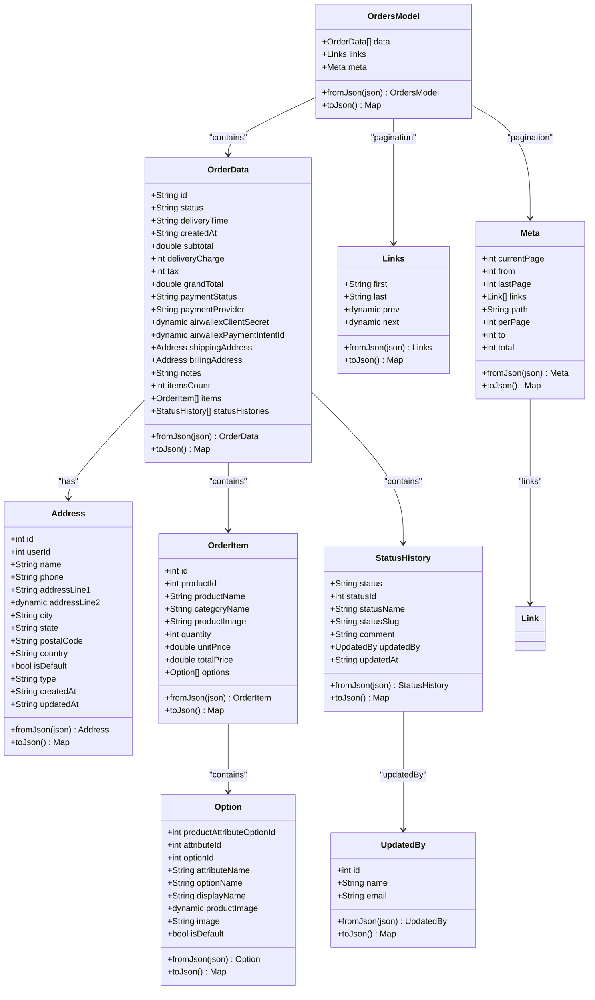

**Diagram sources**
- [orders_model.dart](file://lib/features/order/models/orders_model.dart)

Key characteristics:
- Enhanced strong typing for numeric fields with safe casting to doubles
- Improved nested serialization/deserialization for complex structures
- Comprehensive pagination support via Links and Meta
- Robust error handling for optional fields and dynamic types

**Section sources**
- [orders_model.dart](file://lib/features/order/models/orders_model.dart)

### Repository Patterns and Data Persistence
Enhanced repositories encapsulate network logic, error handling, and review submission functionality.

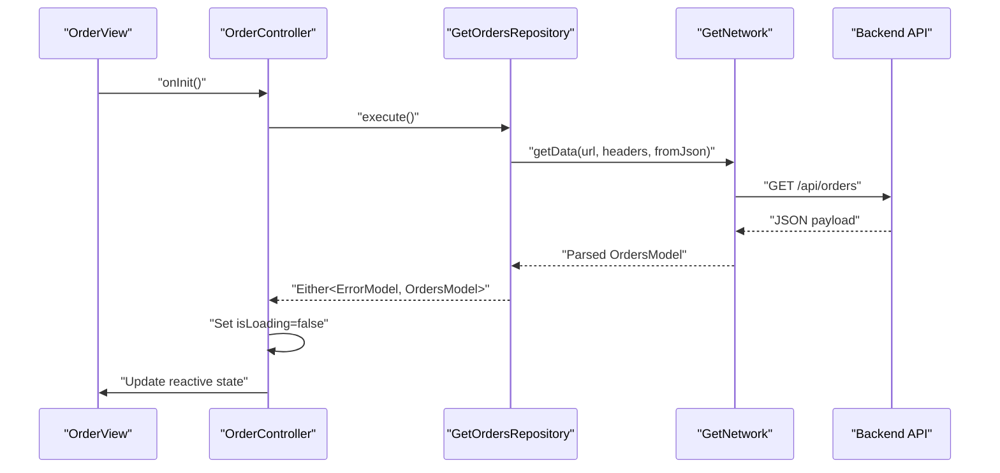

**Diagram sources**
- [order_view.dart](file://lib/features/order/views/order_view.dart)
- [order_controller.dart](file://lib/features/order/controllers/order_controller.dart)
- [get_orders_repo.dart](file://lib/features/order/repositories/get_orders_repo.dart)

Enhanced sequence for order details and review submission:

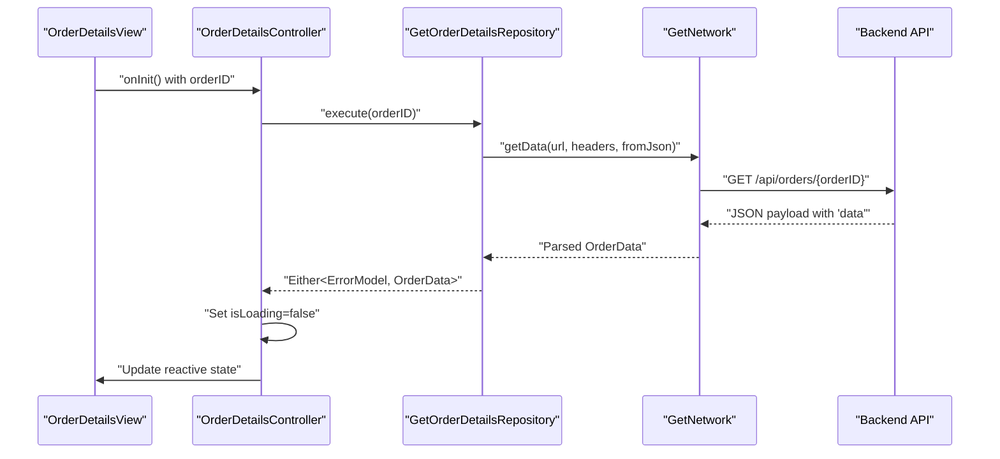

**Diagram sources**
- [order_details_view.dart](file://lib/features/order/views/order_details_view.dart)
- [order_details_controller.dart](file://lib/features/order/controllers/order_details_controller.dart)
- [get_order_details_repo.dart](file://lib/features/order/repositories/get_order_details_repo.dart)

**Section sources**
- [get_orders_repo.dart](file://lib/features/order/repositories/get_orders_repo.dart)
- [get_order_details_repo.dart](file://lib/features/order/repositories/get_order_details_repo.dart)
- [order_review_repo.dart](file://lib/features/order/repositories/order_review_repo.dart)

## Enhanced UI Components
The Order Management System now includes enhanced UI components for better order tracking and management experience.

### OrderHeader Widget
The OrderHeader widget provides an animated header with search functionality and action buttons.

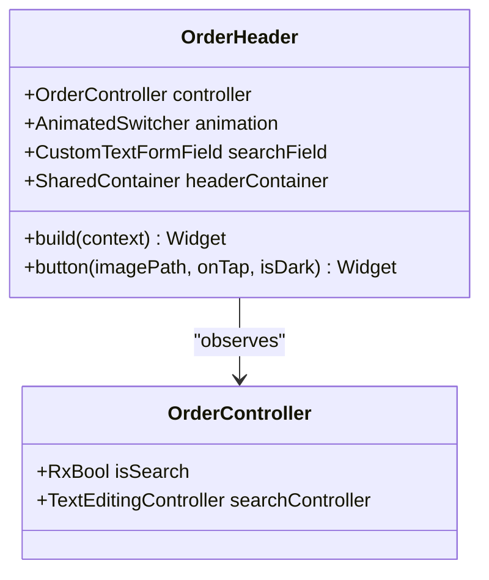

**Diagram sources**
- [order_header.dart](file://lib/features/order/widgets/order_widgets/order_header.dart)
- [order_controller.dart](file://lib/features/order/controllers/order_controller.dart)

Key features:
- Animated transition between search field and header view
- Smooth slide and fade animations for UI state changes
- Integrated search functionality with form field support
- Dark/light theme adaptation with conditional styling

### OrderButton Widget
The OrderButton widget provides unified action buttons for order management.

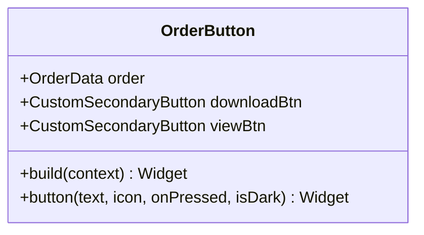

**Diagram sources**
- [order_button.dart](file://lib/features/order/widgets/order_widgets/order_button.dart)

Key features:
- Download invoices functionality
- View details navigation with route management
- Conditional button visibility based on current route
- Responsive design with screen utility integration

### OrderDetailsInfo Widget
The OrderDetailsInfo widget displays comprehensive order information with enhanced layout.

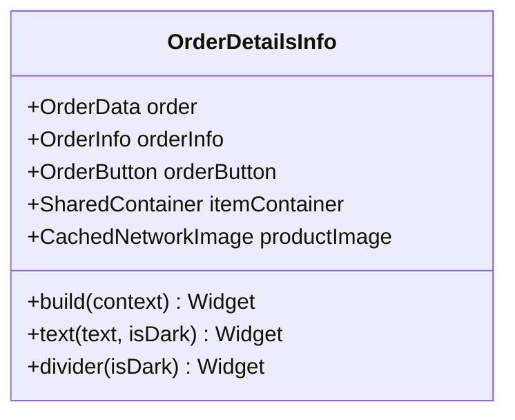

**Diagram sources**
- [order_details_info.dart](file://lib/features/order/widgets/order_details_widgets/order_details_info.dart)

Key features:
- Product image caching with CachedNetworkImage
- Horizontal scrolling for product attributes
- Responsive typography with screen utility scaling
- Enhanced divider styling with theme adaptation

### OrderDetailsStatus Widget
The OrderDetailsStatus widget provides enhanced order status tracking with review submission.

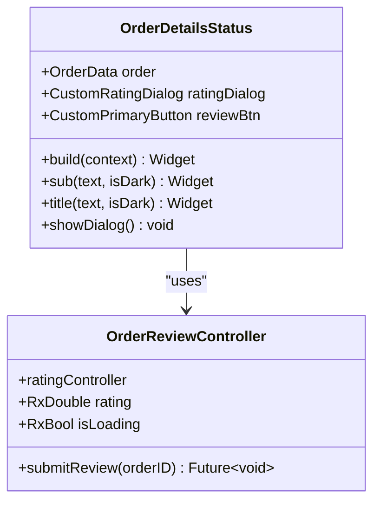

**Diagram sources**
- [order_details_status.dart](file://lib/features/order/widgets/order_details_widgets/order_details_status.dart)
- [order_review_controller.dart](file://lib/features/order/controllers/order_review_controller.dart)

Key features:
- Current status and tracking number display
- Estimated delivery calculation integration
- Review submission button with rating dialog
- Enhanced typography with custom text components

**Section sources**
- [order_header.dart](file://lib/features/order/widgets/order_widgets/order_header.dart)
- [order_button.dart](file://lib/features/order/widgets/order_widgets/order_button.dart)
- [order_details_info.dart](file://lib/features/order/widgets/order_details_widgets/order_details_info.dart)
- [order_details_status.dart](file://lib/features/order/widgets/order_details_widgets/order_details_status.dart)

## Dependency Analysis
Enhanced dependency injection setup binds controllers to their repositories with improved modularity and new review functionality.

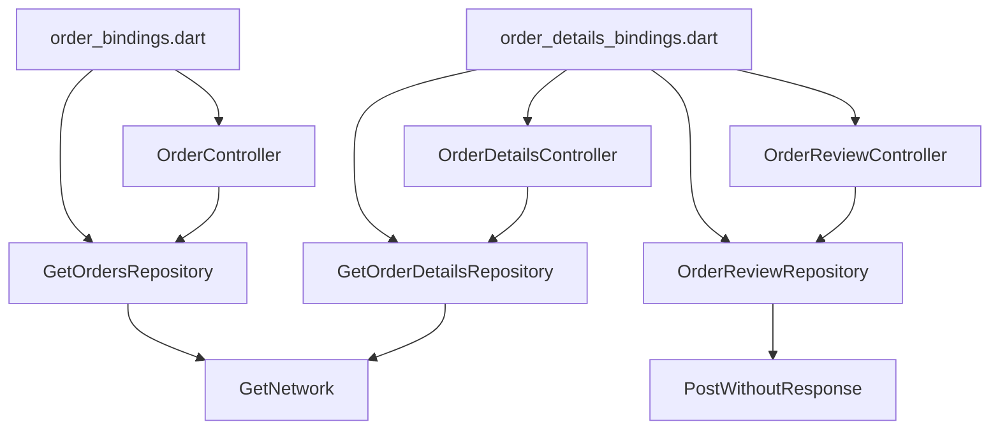

**Diagram sources**
- [order_bindings.dart](file://lib/features/order/bindings/order_bindings.dart)
- [order_details_bindings.dart](file://lib/features/order/bindings/order_details_bindings.dart)
- [order_controller.dart](file://lib/features/order/controllers/order_controller.dart)
- [order_details_controller.dart](file://lib/features/order/controllers/order_details_controller.dart)
- [order_review_controller.dart](file://lib/features/order/controllers/order_review_controller.dart)
- [get_orders_repo.dart](file://lib/features/order/repositories/get_orders_repo.dart)
- [get_order_details_repo.dart](file://lib/features/order/repositories/get_order_details_repo.dart)
- [order_review_repo.dart](file://lib/features/order/repositories/order_review_repo.dart)

**Section sources**
- [order_bindings.dart](file://lib/features/order/bindings/order_bindings.dart)
- [order_details_bindings.dart](file://lib/features/order/bindings/order_details_bindings.dart)

## Performance Considerations
Enhanced performance considerations for the improved Order Management System:
- Reactive Rendering: Use Obx and reactive fields to minimize unnecessary rebuilds with enhanced state management
- Lazy Loading: Get.lazyPut ensures repositories are instantiated only when needed, including new OrderReviewRepository
- Efficient Lists: Use ListView.builder for large order lists with optimized item rendering
- Image Loading: CachedNetworkImage improves performance for product thumbnails with automatic caching
- Animation Performance: AnimatedSwitcher and AnimatedSize provide smooth transitions without blocking UI thread
- Pagination: Utilize Links and Meta structures to implement paginated order retrieval with enhanced user experience
- Form Validation: Early validation in OrderReviewController prevents unnecessary network requests
- Route Optimization: Conditional button visibility reduces unnecessary widget tree complexity

## Troubleshooting Guide
Enhanced troubleshooting guide for common issues in the improved Order Management System:

### Network Failures
- Symptom: Orders fail to load or details don't appear
- Resolution: Check repository error handling and display user-friendly messages via snackbars, verify network connectivity

### Empty Data Issues
- Symptom: No orders displayed or empty order details
- Resolution: Verify API endpoint correctness, authentication headers, and ensure proper data parsing in repositories

### UI State Issues
- Symptom: Loading indicator remains visible or search field not responding
- Resolution: Ensure isLoading is set to false after network response in controllers, check reactive state updates

### Review Submission Problems
- Symptom: Review submission fails or rating dialog not working
- Resolution: Verify OrderReviewController validation logic, check OrderReviewRepository configuration, ensure proper dialog integration

### Animation Issues
- Symptom: Search field animation not working or smooth transitions
- Resolution: Check AnimatedSwitcher configuration, verify controller.isSearch reactive state updates

### Navigation Issues
- Symptom: Order details navigation not working or route parameters not passing
- Resolution: Confirm order ID is passed via Get.arguments and accessed in OrderDetailsController.onInit

**Section sources**
- [order_controller.dart](file://lib/features/order/controllers/order_controller.dart)
- [order_details_controller.dart](file://lib/features/order/controllers/order_details_controller.dart)
- [order_review_controller.dart](file://lib/features/order/controllers/order_review_controller.dart)

## Conclusion
The enhanced Order Management System provides a robust, modular solution for managing orders with improved UI components, enhanced review functionality, and better user experience. The system now includes comprehensive order lifecycle management, detailed order views with expandable sections, product review capabilities, and responsive design elements. The layered architecture with enhanced dependency injection, strong models, and reactive controllers enables efficient order processing, detailed order tracking, and scalable data retrieval. By leveraging enhanced pagination, reactive UI patterns, structured error handling, and improved animation performance, the system supports both customer-facing order management and backend analytics/reporting needs with significantly improved user interaction capabilities.

## Appendices
- API Endpoints
  - GET /api/orders: Retrieve order history with enhanced pagination
  - GET /api/orders/{orderID}: Retrieve a specific order by ID with detailed information
  - POST /api/reviews: Submit product reviews with rating and comments
- Data Fields of Interest
  - OrderData: status, grandTotal, createdAt, itemsCount, statusHistories, deliveryTime
  - OrderItem: productName, productImage, quantity, unitPrice, totalPrice, options
  - StatusHistory: statusName, updatedAt, comment, updatedBy
  - Review Fields: order_id, rating, title, review for submission
- Enhanced UI Components
  - OrderHeader: Animated search functionality with form field integration
  - OrderButton: Unified action buttons with conditional visibility
  - OrderDetailsInfo: Enhanced product display with horizontal scrolling
  - OrderDetailsStatus: Review submission with rating dialog integration