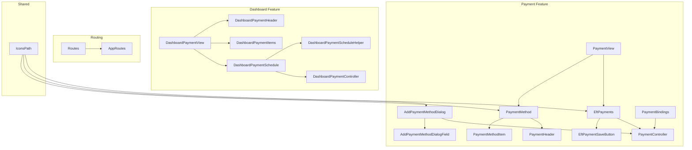
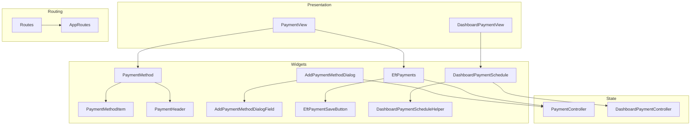
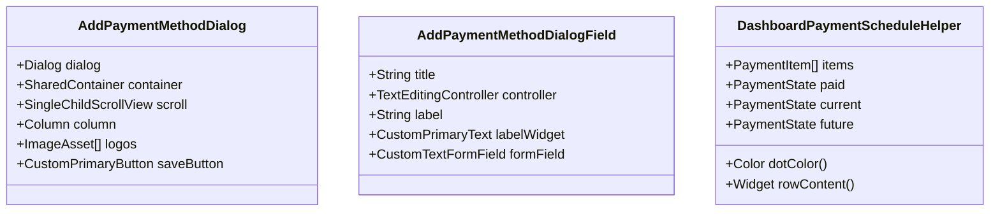
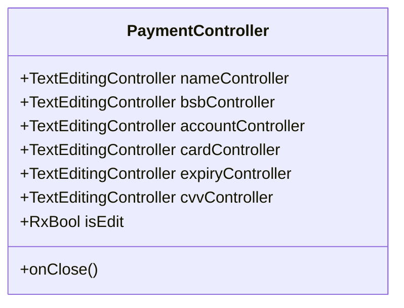
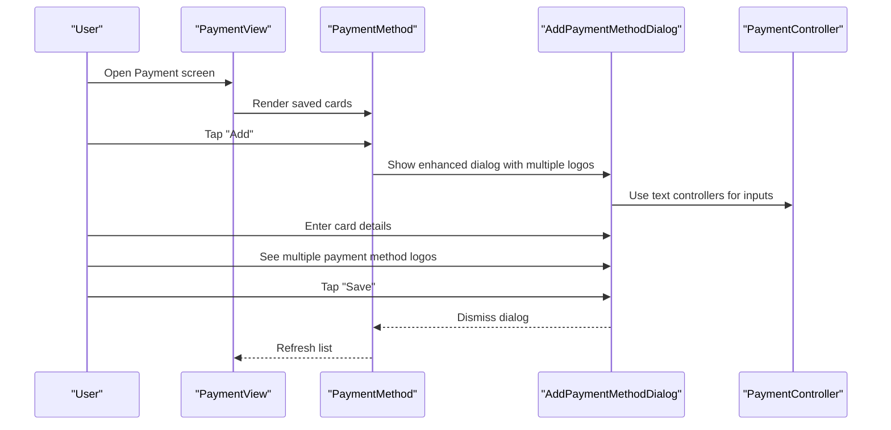
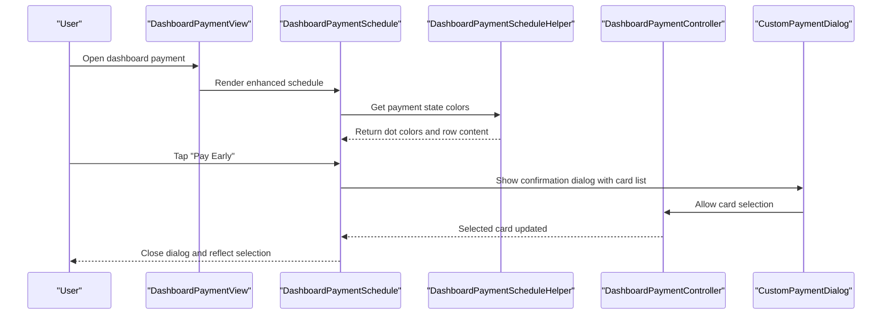
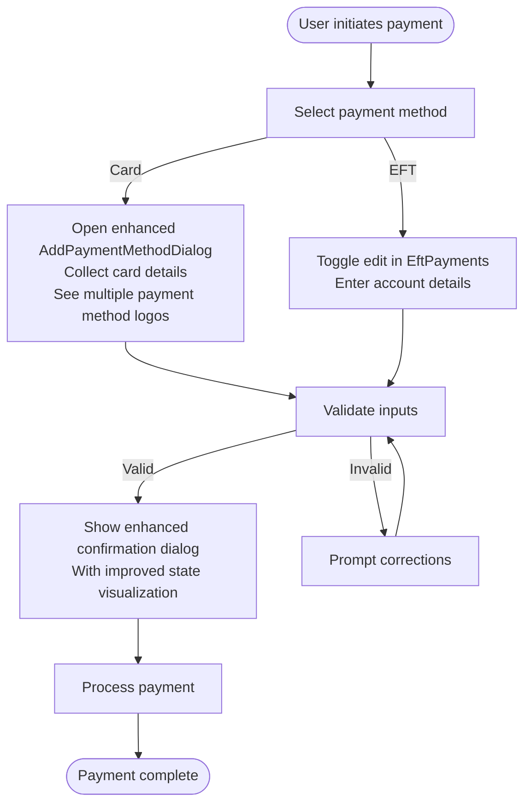
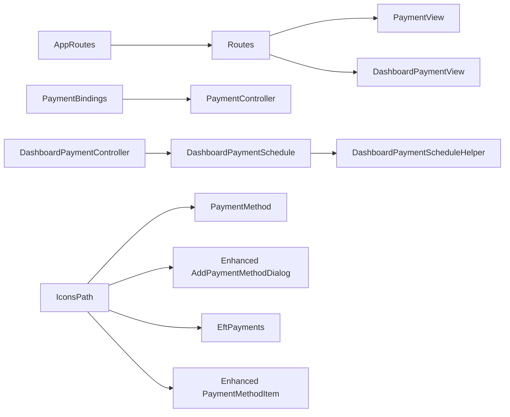

# Payment Processing System

<cite>
**Referenced Files in This Document**
- [payment_controller.dart](file://lib/features/payment/controller/payment_controller.dart)
- [payment_bindings.dart](file://lib/features/payment/bindings/payment_bindings.dart)
- [payment_view.dart](file://lib/features/payment/views/payment_view.dart)
- [eft_payments.dart](file://lib/features/payment/widgets/eft_payments.dart)
- [add_payment_method_dialog.dart](file://lib/features/payment/widgets/add_payment_method_dialog.dart)
- [add_payment_method_dialog_field.dart](file://lib/features/payment/widgets/add_payment_method_dialog_field.dart)
- [eft_payment_save_button.dart](file://lib/features/payment/widgets/eft_payment_save_button.dart)
- [payment_method.dart](file://lib/features/payment/widgets/payment_method.dart)
- [payment_method_item.dart](file://lib/features/payment/widgets/payment_method_item.dart)
- [payment_header.dart](file://lib/features/payment/widgets/payment_header.dart)
- [dashboard_payment_controller.dart](file://lib/features/dashboard/controller/dashboard_payment_controller.dart)
- [dashboard_payment_view.dart](file://lib/features/dashboard/views/dashboard_payment_view.dart)
- [dashboard_payment_header.dart](file://lib/features/dashboard/widgets/dashboard_payment_widgets/dashboard_payment_header.dart)
- [dashboard_payment_items.dart](file://lib/features/dashboard/widgets/dashboard_payment_widgets/dashboard_payment_items.dart)
- [dashboard_payment_schedule.dart](file://lib/features/dashboard/widgets/dashboard_payment_widgets/dashboard_payment_schedule.dart)
- [dashboard_payment_schedule_helper.dart](file://lib/features/dashboard/widgets/dashboard_payment_widgets/dashboard_payment_schedule_helper.dart)
- [app_routes.dart](file://lib/core/routes/app_routes.dart)
- [routes.dart](file://lib/core/routes/routes.dart)
- [icons_path.dart](file://lib/core/constant/icons_path.dart)
</cite>

## Update Summary
**Changes Made**
- Enhanced AddPaymentMethodDialog with improved spacing, visual hierarchy, and multiple payment method logos
- Added DashboardPaymentScheduleHelper for better visual indicators of payment states
- Improved card type indicators with multiple payment method logos in dialog layouts
- Enhanced payment state visualization with color-coded dots and state-based styling

## Table of Contents
1. [Introduction](#introduction)
2. [Project Structure](#project-structure)
3. [Core Components](#core-components)
4. [Architecture Overview](#architecture-overview)
5. [Detailed Component Analysis](#detailed-component-analysis)
6. [Dependency Analysis](#dependency-analysis)
7. [Performance Considerations](#performance-considerations)
8. [Security and PCI Compliance](#security-and-pci-compliance)
9. [Troubleshooting Guide](#troubleshooting-guide)
10. [Conclusion](#conclusion)
11. [Appendices](#appendices)

## Introduction
This document describes the Payment Processing System implemented in the Flutter application. It covers the payment controller, payment method handling, transaction processing surfaces, payment view components, form validation, secure payment entry interfaces, integration touchpoints with payment gateways, tokenization, PCI compliance considerations, payment widget components (card input fields, payment summaries, and confirmation dialogs), state management, error handling, retry mechanisms, examples of payment workflows, multi-payment scenarios, integration with order management systems, security best practices, fraud prevention, and payment analytics.

## Project Structure
The payment system is organized around feature-based modules under lib/features/payment and supporting dashboard widgets under lib/features/dashboard. Controllers are bound via GetX bindings and exposed through route configurations. The system now includes enhanced dialog layouts with improved visual hierarchy and multiple payment method logos for better user experience.

**Diagram sources**
- [payment_view.dart:12-63](file://lib/features/payment/views/payment_view.dart#L12-L63)
- [payment_method.dart:12-87](file://lib/features/payment/widgets/payment_method.dart#L12-L87)
- [eft_payments.dart:14-91](file://lib/features/payment/widgets/eft_payments.dart#L14-L91)
- [add_payment_method_dialog.dart:13-108](file://lib/features/payment/widgets/add_payment_method_dialog.dart#L13-L108)
- [add_payment_method_dialog_field.dart:7-36](file://lib/features/payment/widgets/add_payment_method_dialog_field.dart#L7-L36)
- [eft_payment_save_button.dart:8-54](file://lib/features/payment/widgets/eft_payment_save_button.dart#L8-L54)
- [payment_method_item.dart:9-98](file://lib/features/payment/widgets/payment_method_item.dart#L9-L98)
- [payment_header.dart:7-68](file://lib/features/payment/widgets/payment_header.dart#L7-L68)
- [payment_controller.dart:4-22](file://lib/features/payment/controller/payment_controller.dart#L4-L22)
- [payment_bindings.dart:4-9](file://lib/features/payment/bindings/payment_bindings.dart#L4-L9)
- [dashboard_payment_view.dart:14-54](file://lib/features/dashboard/views/dashboard_payment_view.dart#L14-L54)
- [dashboard_payment_header.dart:7-83](file://lib/features/dashboard/widgets/dashboard_payment_widgets/dashboard_payment_header.dart#L7-L83)
- [dashboard_payment_items.dart:9-81](file://lib/features/dashboard/widgets/dashboard_payment_widgets/dashboard_payment_items.dart#L9-L81)
- [dashboard_payment_schedule.dart:13-96](file://lib/features/dashboard/widgets/dashboard_payment_widgets/dashboard_payment_schedule.dart#L13-L96)
- [dashboard_payment_schedule_helper.dart:1-82](file://lib/features/dashboard/widgets/dashboard_payment_widgets/dashboard_payment_schedule_helper.dart#L1-82)
- [dashboard_payment_controller.dart:3-5](file://lib/features/dashboard/controller/dashboard_payment_controller.dart#L3-L5)
- [app_routes.dart:15, 29](file://lib/core/routes/app_routes.dart#L15,L29)
- [routes.dart:19, 29, 30, 126, 196, 197, 198](file://lib/core/routes/routes.dart#L19,L29,L30,L126,L196,L197,L198)
- [icons_path.dart:48, 114](file://lib/core/constant/icons_path.dart#L48,L114)

**Section sources**
- [payment_view.dart:12-63](file://lib/features/payment/views/payment_view.dart#L12-L63)
- [payment_method.dart:12-87](file://lib/features/payment/widgets/payment_method.dart#L12-L87)
- [eft_payments.dart:14-91](file://lib/features/payment/widgets/eft_payments.dart#L14-L91)
- [add_payment_method_dialog.dart:13-108](file://lib/features/payment/widgets/add_payment_method_dialog.dart#L13-L108)
- [add_payment_method_dialog_field.dart:7-36](file://lib/features/payment/widgets/add_payment_method_dialog_field.dart#L7-L36)
- [eft_payment_save_button.dart:8-54](file://lib/features/payment/widgets/eft_payment_save_button.dart#L8-L54)
- [payment_method_item.dart:9-98](file://lib/features/payment/widgets/payment_method_item.dart#L9-L98)
- [payment_header.dart:7-68](file://lib/features/payment/widgets/payment_header.dart#L7-L68)
- [payment_controller.dart:4-22](file://lib/features/payment/controller/payment_controller.dart#L4-L22)
- [payment_bindings.dart:4-9](file://lib/features/payment/bindings/payment_bindings.dart#L4-L9)
- [dashboard_payment_view.dart:14-54](file://lib/features/dashboard/views/dashboard_payment_view.dart#L14-L54)
- [dashboard_payment_header.dart:7-83](file://lib/features/dashboard/widgets/dashboard_payment_widgets/dashboard_payment_header.dart#L7-L83)
- [dashboard_payment_items.dart:9-81](file://lib/features/dashboard/widgets/dashboard_payment_widgets/dashboard_payment_items.dart#L9-L81)
- [dashboard_payment_schedule.dart:13-96](file://lib/features/dashboard/widgets/dashboard_payment_widgets/dashboard_payment_schedule.dart#L13-L96)
- [dashboard_payment_schedule_helper.dart:1-82](file://lib/features/dashboard/widgets/dashboard_payment_widgets/dashboard_payment_schedule_helper.dart#L1-82)
- [dashboard_payment_controller.dart:3-5](file://lib/features/dashboard/controller/dashboard_payment_controller.dart#L3-L5)
- [app_routes.dart:15, 29](file://lib/core/routes/app_routes.dart#L15,L29)
- [routes.dart:19, 29, 30, 126, 196, 197, 198](file://lib/core/routes/routes.dart#L19,L29,L30,L126,L196,L197,L198)
- [icons_path.dart:48, 114](file://lib/core/constant/icons_path.dart#L48,L114)

## Core Components
- PaymentController: Manages text editing controllers for card and EFT fields and edit mode state for EFT forms.
- PaymentBindings: Binds PaymentController lazily for dependency injection.
- PaymentView: Hosts the payment method and EFT sections.
- PaymentMethod: Displays saved cards and triggers AddPaymentMethodDialog with enhanced visual indicators.
- EftPayments: Renders EFT fields with edit/save toggling.
- AddPaymentMethodDialog: Secure dialog for adding new card details with improved layout and multiple payment method logos.
- AddPaymentMethodDialogField: Enhanced field component with consistent spacing and visual hierarchy.
- EftPaymentSaveButton: Button component for saving EFT changes.
- PaymentMethodItem: Renders individual saved cards with default selection affordances and improved card type indicators.
- PaymentHeader: Reusable header with action button.
- DashboardPaymentController: Manages card list and selected card for dashboard payment actions.
- DashboardPaymentSchedule: Timeline component with enhanced visual indicators and state management.
- DashboardPaymentScheduleHelper: New helper class for payment state visualization with color-coded dots and state-based styling.
- Dashboard widgets: Header, items summary, and schedule with pay-early dialog.

**Updated** Enhanced dialog layouts with improved spacing, visual hierarchy, and multiple payment method logos for better user experience.

**Section sources**
- [payment_controller.dart:4-22](file://lib/features/payment/controller/payment_controller.dart#L4-L22)
- [payment_bindings.dart:4-9](file://lib/features/payment/bindings/payment_bindings.dart#L4-L9)
- [payment_view.dart:12-63](file://lib/features/payment/views/payment_view.dart#L12-L63)
- [payment_method.dart:12-87](file://lib/features/payment/widgets/payment_method.dart#L12-L87)
- [eft_payments.dart:14-91](file://lib/features/payment/widgets/eft_payments.dart#L14-L91)
- [add_payment_method_dialog.dart:13-108](file://lib/features/payment/widgets/add_payment_method_dialog.dart#L13-L108)
- [add_payment_method_dialog_field.dart:7-36](file://lib/features/payment/widgets/add_payment_method_dialog_field.dart#L7-L36)
- [eft_payment_save_button.dart:8-54](file://lib/features/payment/widgets/eft_payment_save_button.dart#L8-L54)
- [payment_method_item.dart:9-98](file://lib/features/payment/widgets/payment_method_item.dart#L9-L98)
- [payment_header.dart:7-68](file://lib/features/payment/widgets/payment_header.dart#L7-L68)
- [dashboard_payment_controller.dart:3-5](file://lib/features/dashboard/controller/dashboard_payment_controller.dart#L3-L5)
- [dashboard_payment_view.dart:14-54](file://lib/features/dashboard/views/dashboard_payment_view.dart#L14-L54)
- [dashboard_payment_schedule.dart:13-96](file://lib/features/dashboard/widgets/dashboard_payment_widgets/dashboard_payment_schedule.dart#L13-L96)
- [dashboard_payment_schedule_helper.dart:1-82](file://lib/features/dashboard/widgets/dashboard_payment_widgets/dashboard_payment_schedule_helper.dart#L1-82)

## Architecture Overview
The system follows a layered architecture with enhanced visual components:
- Presentation Layer: Views and widgets render UI and collect user input with improved spacing and visual hierarchy.
- State Management: GetX controllers manage reactive state for forms and selections.
- Routing Layer: Routes define navigation and bind controllers.
- Shared Layer: Common UI components, constants, and assets support all features.
- Helper Layer: New helper classes provide specialized functionality for payment state visualization.

**Diagram sources**
- [payment_view.dart:12-63](file://lib/features/payment/views/payment_view.dart#L12-L63)
- [dashboard_payment_view.dart:14-54](file://lib/features/dashboard/views/dashboard_payment_view.dart#L14-L54)
- [payment_method.dart:12-87](file://lib/features/payment/widgets/payment_method.dart#L12-L87)
- [eft_payments.dart:14-91](file://lib/features/payment/widgets/eft_payments.dart#L14-L91)
- [payment_method_item.dart:9-98](file://lib/features/payment/widgets/payment_method_item.dart#L9-L98)
- [payment_header.dart:7-68](file://lib/features/payment/widgets/payment_header.dart#L7-L68)
- [add_payment_method_dialog.dart:13-108](file://lib/features/payment/widgets/add_payment_method_dialog.dart#L13-L108)
- [add_payment_method_dialog_field.dart:7-36](file://lib/features/payment/widgets/add_payment_method_dialog_field.dart#L7-L36)
- [eft_payment_save_button.dart:8-54](file://lib/features/payment/widgets/eft_payment_save_button.dart#L8-L54)
- [dashboard_payment_schedule.dart:13-96](file://lib/features/dashboard/widgets/dashboard_payment_widgets/dashboard_payment_schedule.dart#L13-L96)
- [dashboard_payment_schedule_helper.dart:1-82](file://lib/features/dashboard/widgets/dashboard_payment_widgets/dashboard_payment_schedule_helper.dart#L1-82)
- [routes.dart:19, 29, 30, 126, 196, 197, 198](file://lib/core/routes/routes.dart#L19,L29,L30,L126,L196,L197,L198)
- [app_routes.dart:15, 29](file://lib/core/routes/app_routes.dart#L15,L29)

## Detailed Component Analysis

### Enhanced Payment Dialog Components
- AddPaymentMethodDialog:
  - **Enhanced Layout**: Improved spacing with insetPadding of 16.w and comprehensive padding of 20.r for better visual hierarchy.
  - **Multiple Payment Method Logos**: Displays four Visa logos in a row (IconsPath.visa) with proper sizing (34.w x 24.h) and spacing (18.w padding).
  - **Improved Typography**: Better visual hierarchy with larger title font size (16.sp) and secondary text with appropriate muted colors.
  - **Responsive Design**: Uses ScreenUtil for responsive dimensions across different screen sizes.
- AddPaymentMethodDialogField:
  - **Consistent Spacing**: Standardized 6.h spacing between labels and form fields.
  - **Visual Hierarchy**: Proper typography scaling with 14.sp font for labels and appropriate form field sizing.
- PaymentMethodItem:
  - **Enhanced Card Type Indicators**: Improved card logos with better aspect ratios (48.w x 30.h) and proper fit: BoxFit.contain.
  - **Better Default Badge**: Enhanced default badge styling with proper padding and border radius.
  - **Improved Layout**: Better alignment and spacing between card information elements.

**Diagram sources**
- [add_payment_method_dialog.dart:13-108](file://lib/features/payment/widgets/add_payment_method_dialog.dart#L13-L108)
- [add_payment_method_dialog_field.dart:7-36](file://lib/features/payment/widgets/add_payment_method_dialog_field.dart#L7-L36)
- [dashboard_payment_schedule_helper.dart:24-82](file://lib/features/dashboard/widgets/dashboard_payment_widgets/dashboard_payment_schedule_helper.dart#L24-L82)

**Section sources**
- [add_payment_method_dialog.dart:13-108](file://lib/features/payment/widgets/add_payment_method_dialog.dart#L13-L108)
- [add_payment_method_dialog_field.dart:7-36](file://lib/features/payment/widgets/add_payment_method_dialog_field.dart#L7-L36)
- [payment_method_item.dart:9-98](file://lib/features/payment/widgets/payment_method_item.dart#L9-L98)
- [dashboard_payment_schedule_helper.dart:1-82](file://lib/features/dashboard/widgets/dashboard_payment_widgets/dashboard_payment_schedule_helper.dart#L1-82)

### Payment Controller and State Management
- Responsibilities:
  - Hold text editing controllers for card number, expiry, CVV, account name, BSB, and account number.
  - Track edit mode for EFT forms.
  - Dispose controllers on close.
- Reactive state:
  - Edit mode toggled via an observable boolean.
- Integration points:
  - Used by EftPayments and AddPaymentMethodDialog widgets.
  - Bound via PaymentBindings and injected lazily.

**Diagram sources**
- [payment_controller.dart:4-22](file://lib/features/payment/controller/payment_controller.dart#L4-L22)

**Section sources**
- [payment_controller.dart:4-22](file://lib/features/payment/controller/payment_controller.dart#L4-L22)
- [payment_bindings.dart:4-9](file://lib/features/payment/bindings/payment_bindings.dart#L4-L9)

### Enhanced Payment View Components
- PaymentView:
  - Provides top-level layout with app bar, container, and sections for payment methods and EFT.
- PaymentMethod:
  - Displays saved cards and opens AddPaymentMethodDialog on add.
  - Uses PaymentHeader and PaymentMethodItem with enhanced card type indicators.
- EftPayments:
  - Toggles edit mode; renders account name, BSB, and account number fields.
  - Shows Save Changes button when in edit mode.
- AddPaymentMethodDialog:
  - **Enhanced**: Collects card number, expiry, and CVV with improved layout and multiple payment method logos.
  - **Improved Spacing**: Better visual hierarchy with insetPadding and comprehensive padding.
  - **Multiple Logos**: Displays four Visa logos for better brand recognition.
- PaymentMethodItem:
  - **Enhanced**: Renders card type, masked number, expiry, default badge, set-default action, and delete affordance.
  - **Improved Card Type Indicators**: Better aspect ratios and fit for card logos.
- PaymentHeader:
  - Reusable header with icon, title, subtitle, and action button.

**Diagram sources**
- [payment_view.dart:12-63](file://lib/features/payment/views/payment_view.dart#L12-L63)
- [payment_method.dart:12-87](file://lib/features/payment/widgets/payment_method.dart#L12-L87)
- [add_payment_method_dialog.dart:13-108](file://lib/features/payment/widgets/add_payment_method_dialog.dart#L13-L108)
- [payment_controller.dart:4-22](file://lib/features/payment/controller/payment_controller.dart#L4-L22)

**Section sources**
- [payment_view.dart:12-63](file://lib/features/payment/views/payment_view.dart#L12-L63)
- [payment_method.dart:12-87](file://lib/features/payment/widgets/payment_method.dart#L12-L87)
- [eft_payments.dart:14-91](file://lib/features/payment/widgets/eft_payments.dart#L14-L91)
- [add_payment_method_dialog.dart:13-108](file://lib/features/payment/widgets/add_payment_method_dialog.dart#L13-L108)
- [payment_method_item.dart:9-98](file://lib/features/payment/widgets/payment_method_item.dart#L9-L98)
- [payment_header.dart:7-68](file://lib/features/payment/widgets/payment_header.dart#L7-L68)

### Enhanced Dashboard Payment Components
- DashboardPaymentView:
  - Aggregates header, items, schedule, and save controls.
- DashboardPaymentHeader:
  - Displays rental ID, status, start date, next payment amount, and due date.
- DashboardPaymentItems:
  - Lists included items with thumbnails, names, conditions, and prices.
- DashboardPaymentSchedule:
  - **Enhanced**: Timeline of past/pending payments with improved visual indicators.
  - **New Helper Integration**: Uses DashboardPaymentScheduleHelper for state management.
  - **Pay Early Action**: Opens a payment confirmation dialog pre-populated with saved cards.
- DashboardPaymentScheduleHelper:
  - **New**: Provides payment state visualization with color-coded dots.
  - **State Management**: Defines PaymentState enum (paid, current, future) with appropriate colors.
  - **Visual Indicators**: Returns dot colors based on payment state (green for paid, blue for current, gray for future).
  - **Row Content**: Generates state-appropriate row content with strikethrough for paid items.
- DashboardPaymentController:
  - Holds card list and selected card for payment selection.

**Diagram sources**
- [dashboard_payment_view.dart:14-54](file://lib/features/dashboard/views/dashboard_payment_view.dart#L14-L54)
- [dashboard_payment_schedule.dart:13-96](file://lib/features/dashboard/widgets/dashboard_payment_widgets/dashboard_payment_schedule.dart#L13-L96)
- [dashboard_payment_schedule_helper.dart:1-82](file://lib/features/dashboard/widgets/dashboard_payment_widgets/dashboard_payment_schedule_helper.dart#L1-82)
- [dashboard_payment_header.dart:7-83](file://lib/features/dashboard/widgets/dashboard_payment_widgets/dashboard_payment_header.dart#L7-L83)
- [dashboard_payment_items.dart:9-81](file://lib/features/dashboard/widgets/dashboard_payment_widgets/dashboard_payment_items.dart#L9-L81)
- [dashboard_payment_controller.dart:3-5](file://lib/features/dashboard/controller/dashboard_payment_controller.dart#L3-L5)

**Section sources**
- [dashboard_payment_view.dart:14-54](file://lib/features/dashboard/views/dashboard_payment_view.dart#L14-L54)
- [dashboard_payment_header.dart:7-83](file://lib/features/dashboard/widgets/dashboard_payment_widgets/dashboard_payment_header.dart#L7-L83)
- [dashboard_payment_items.dart:9-81](file://lib/features/dashboard/widgets/dashboard_payment_widgets/dashboard_payment_items.dart#L9-L81)
- [dashboard_payment_schedule.dart:13-96](file://lib/features/dashboard/widgets/dashboard_payment_widgets/dashboard_payment_schedule.dart#L13-L96)
- [dashboard_payment_schedule_helper.dart:1-82](file://lib/features/dashboard/widgets/dashboard_payment_widgets/dashboard_payment_schedule_helper.dart#L1-82)
- [dashboard_payment_controller.dart:3-5](file://lib/features/dashboard/controller/dashboard_payment_controller.dart#L3-L5)

### Transaction Processing Surfaces
- PaymentMethod:
  - Presents saved cards with enhanced card type indicators and improved visual hierarchy.
- EftPayments:
  - Edits EFT details and saves changes reactively.
- AddPaymentMethodDialog:
  - **Enhanced**: Captures sensitive card data in an improved modal surface with multiple payment method logos.
- DashboardPaymentSchedule:
  - **Enhanced**: Initiates payment confirmation with card selection and improved state visualization.

**Diagram sources**
- [payment_method.dart:12-87](file://lib/features/payment/widgets/payment_method.dart#L12-L87)
- [eft_payments.dart:14-91](file://lib/features/payment/widgets/eft_payments.dart#L14-L91)
- [add_payment_method_dialog.dart:13-108](file://lib/features/payment/widgets/add_payment_method_dialog.dart#L13-L108)
- [dashboard_payment_schedule.dart:13-96](file://lib/features/dashboard/widgets/dashboard_payment_widgets/dashboard_payment_schedule.dart#L13-L96)

## Dependency Analysis
- Routing:
  - AppRoutes defines named routes for PaymentView and DashboardPaymentView.
  - Routes config binds PaymentView with PaymentBindings.
- Controllers:
  - PaymentBindings registers PaymentController.
  - DashboardPaymentController is used by dashboard widgets.
- Widgets:
  - Payment widgets depend on shared UI components and icons.
  - Dialogs and buttons coordinate with controllers for state updates.
- **New Dependencies**:
  - DashboardPaymentSchedule now depends on DashboardPaymentScheduleHelper for state management.
  - Enhanced dialog components utilize multiple payment method logos from IconsPath.

**Diagram sources**
- [app_routes.dart:15, 29](file://lib/core/routes/app_routes.dart#L15,L29)
- [routes.dart:19, 29, 30, 126, 196, 197, 198](file://lib/core/routes/routes.dart#L19,L29,L30,L126,L196,L197,L198)
- [payment_bindings.dart:4-9](file://lib/features/payment/bindings/payment_bindings.dart#L4-L9)
- [payment_controller.dart:4-22](file://lib/features/payment/controller/payment_controller.dart#L4-L22)
- [dashboard_payment_controller.dart:3-5](file://lib/features/dashboard/controller/dashboard_payment_controller.dart#L3-L5)
- [dashboard_payment_schedule_helper.dart:1-82](file://lib/features/dashboard/widgets/dashboard_payment_widgets/dashboard_payment_schedule_helper.dart#L1-82)
- [icons_path.dart:48, 114](file://lib/core/constant/icons_path.dart#L48,L114)

**Section sources**
- [app_routes.dart:15, 29](file://lib/core/routes/app_routes.dart#L15,L29)
- [routes.dart:19, 29, 30, 126, 196, 197, 198](file://lib/core/routes/routes.dart#L19,L29,L30,L126,L196,L197,L198)
- [payment_bindings.dart:4-9](file://lib/features/payment/bindings/payment_bindings.dart#L4-L9)
- [payment_controller.dart:4-22](file://lib/features/payment/controller/payment_controller.dart#L4-L22)
- [dashboard_payment_controller.dart:3-5](file://lib/features/dashboard/controller/dashboard_payment_controller.dart#L3-L5)
- [dashboard_payment_schedule_helper.dart:1-82](file://lib/features/dashboard/widgets/dashboard_payment_widgets/dashboard_payment_schedule_helper.dart#L1-82)
- [icons_path.dart:48, 114](file://lib/core/constant/icons_path.dart#L48,L114)

## Performance Considerations
- Reactive UI updates:
  - Use Obx sparingly; batch updates where possible to avoid unnecessary rebuilds.
- Form rendering:
  - Keep text controllers disposed to prevent memory leaks.
- Dialogs and modals:
  - **Enhanced**: Minimize deep widget trees inside dialogs; reuse shared components with improved spacing.
  - **Optimized**: Multiple payment method logos are cached assets for better performance.
- Asset loading:
  - Preload frequently used icons to reduce render delays.
  - **New**: DashboardPaymentScheduleHelper provides efficient state-based styling without complex calculations.

## Security and PCI Compliance
- Tokenization:
  - Do not persist raw Primary Account Numbers (PAN) or CVV. Use a PCI-compliant payment provider to tokenize card data server-side.
- Data handling:
  - Avoid storing sensitive fields locally. Clear controllers after submission.
- Secure transport:
  - Enforce HTTPS for all network requests to payment processors.
- Input validation:
  - Validate lengths and formats client-side (e.g., PAN length, expiry format) but rely on server-side validation for security.
- UI safeguards:
  - Mask sensitive fields (already shown as masked in PaymentMethodItem).
  - **Enhanced**: Multiple payment method logos are decorative only and don't expose sensitive data.
  - Disable copy/paste for sensitive fields where feasible.
- Compliance:
  - Adhere to PCI SAQ guidelines. Prefer hosted fields or third-party payment providers to reduce scope.
- **New Security Considerations**:
  - DashboardPaymentScheduleHelper uses constant colors and simple state checks, reducing potential security risks.

## Troubleshooting Guide
- EFT save button not visible:
  - Ensure edit mode is toggled; check observable state updates.
- Card input fields empty:
  - Verify controllers are initialized and not disposed prematurely.
- Dialog not closing:
  - Confirm navigation pop is invoked after save.
- Payment confirmation dialog not updating selection:
  - Ensure selected card observable is updated and widgets observe changes.
- **Enhanced Dialog Issues**:
  - **Multiple logos not displaying**: Verify IconsPath.visa assets are accessible and properly cached.
  - **Poor spacing**: Check ScreenUtil configuration and ensure proper responsive dimensions.
  - **State colors not appearing**: Confirm DashboardPaymentScheduleHelper is properly instantiated and colors are correctly mapped.

**Section sources**
- [eft_payments.dart:14-91](file://lib/features/payment/widgets/eft_payments.dart#L14-L91)
- [payment_controller.dart:4-22](file://lib/features/payment/controller/payment_controller.dart#L4-L22)
- [add_payment_method_dialog.dart:13-108](file://lib/features/payment/widgets/add_payment_method_dialog.dart#L13-L108)
- [dashboard_payment_schedule.dart:13-96](file://lib/features/dashboard/widgets/dashboard_payment_widgets/dashboard_payment_schedule.dart#L13-L96)
- [dashboard_payment_schedule_helper.dart:1-82](file://lib/features/dashboard/widgets/dashboard_payment_widgets/dashboard_payment_schedule_helper.dart#L1-82)

## Conclusion
The Payment Processing System organizes payment capabilities into modular views and widgets, leveraging GetX for reactive state management. Recent enhancements include improved dialog layouts with better spacing, visual hierarchy, and multiple payment method logos for enhanced user experience. The new DashboardPaymentScheduleHelper provides sophisticated payment state visualization with color-coded indicators. While the current implementation focuses on UI surfaces and form orchestration, production-grade integrations require secure tokenization, strict PCI compliance, robust error handling, and integration with backend payment services for transaction processing.

## Appendices

### Example Workflows
- Single payment with saved card:
  - Open DashboardPaymentView → Tap Pay Early → Select card in enhanced confirmation dialog → Confirm payment.
- Adding a new card:
  - Open PaymentView → Tap Add in PaymentMethod → Enter details in enhanced AddPaymentMethodDialog → See multiple payment method logos → Save.
- Editing EFT details:
  - Open PaymentView → Toggle Edit in EftPayments → Enter account details → Save Changes.

### Enhanced Multi-Payment Scenarios
- DashboardPaymentSchedule supports multiple scheduled payments with improved state visualization.
- Each payment displays appropriate color-coded indicators (green for paid, blue for current, gray for future).
- Past payments show strikethrough text for better visual distinction.

### Order Management Integration
- DashboardPaymentItems lists included items; integrate with order APIs to synchronize inventory and pricing before payment initiation.
- Enhanced payment method indicators help users quickly identify their preferred payment methods.

### Payment Analytics
- Track conversion funnels: open payment screen, add card/EFT, submit, confirm, and completion.
- Monitor failure rates per payment method and geographic regions for fraud insights.
- **New Analytics Opportunities**: Enhanced state visualization helps track payment progression and completion rates.

### Enhanced User Experience Features
- **Improved Visual Hierarchy**: Better spacing and typography scaling throughout payment dialogs.
- **Multiple Payment Method Logos**: Enhanced brand recognition with multiple logo displays.
- **Color-Coded Payment States**: Intuitive visual indicators for payment status across the dashboard.
- **Responsive Design**: ScreenUtil integration ensures consistent appearance across device sizes.