# Product Catalog Management

<cite>
**Referenced Files in This Document**
- [main.dart](file://lib/main.dart)
- [dependency_injection.dart](file://lib/core/di/dependency_injection.dart)
- [app_routes.dart](file://lib/core/routes/app_routes.dart)
- [category_controller.dart](file://lib/features/category/controller/category_controller.dart)
- [category_bindings.dart](file://lib/features/category/bindings/category_bindings.dart)
- [category_view.dart](file://lib/features/category/views/category_view.dart)
- [get_product_types_controller.dart](file://lib/features/home/controller/get_product_types_controller.dart)
- [get_products_by_type_controller.dart](file://lib/features/home/controller/get_products_by_type_controller.dart)
- [get_product_type_repo.dart](file://lib/features/home/repositories/get_product_type_repo.dart)
- [get_products_by_type_repo.dart](file://lib/features/home/repositories/get_products_by_type_repo.dart)
- [products_model.dart](file://lib/features/home/models/products_model.dart)
- [product_types_model.dart](file://lib/features/home/models/product_types_model.dart)
- [home_our_product_filter.dart](file://lib/features/home/widgets/home_widgets/home_our_product_filter.dart)
- [home_our_products.dart](file://lib/features/home/widgets/home_widgets/home_our_products.dart)
- [custom_pagination.dart](file://lib/shared/widgets/custom_pagination/custom_pagination.dart)
</cite>

## Update Summary
**Changes Made**
- Enhanced product data models with comprehensive pagination support through Links and Meta classes
- Updated all product field types to use num-based numeric types for improved precision
- Added dimension specifications support for product measurements and weight
- Integrated pagination components for scalable product catalog management
- Enhanced product data handling with structured dimension objects

## Table of Contents
1. [Introduction](#introduction)
2. [Project Structure](#project-structure)
3. [Core Components](#core-components)
4. [Architecture Overview](#architecture-overview)
5. [Detailed Component Analysis](#detailed-component-analysis)
6. [Enhanced Product Data Models](#enhanced-product-data-models)
7. [Pagination Support Implementation](#pagination-support-implementation)
8. [Numeric Type Precision Improvements](#numeric-type-precision-improvements)
9. [Dimension Specifications Handling](#dimension-specifications-handling)
10. [Dependency Analysis](#dependency-analysis)
11. [Performance Considerations](#performance-considerations)
12. [Troubleshooting Guide](#troubleshooting-guide)
13. [Conclusion](#conclusion)

## Introduction
This document explains the enhanced Product Catalog Management system with advanced pagination support, comprehensive product data models, and improved numeric precision handling. The system now features sophisticated pagination capabilities, structured dimension specifications for products, and enhanced numeric type safety across all product fields. It covers category navigation, product listing, filtering mechanisms, and the integration between categories and products with full pagination support for large-scale catalogs.

## Project Structure
The application maintains its layered architecture with enhanced pagination support and improved data models. The category feature coexists with the home feature's enhanced product catalog controllers, repositories, and models that now support pagination and comprehensive product data handling.

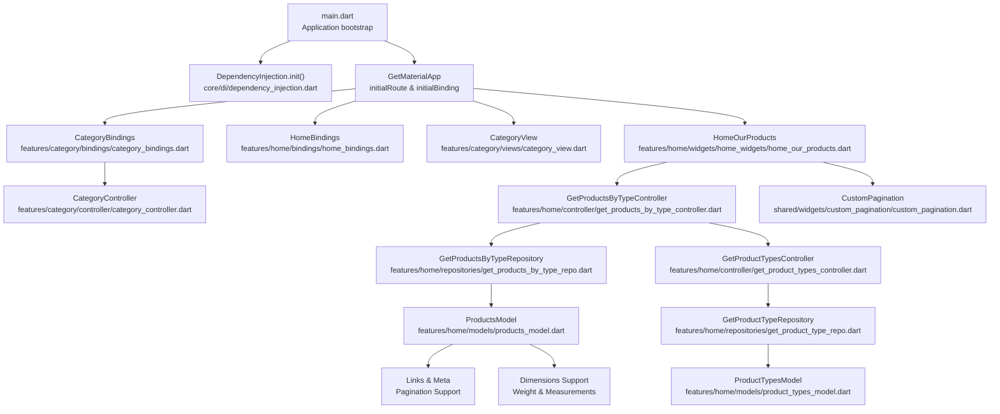

**Diagram sources**
- [main.dart:12-46](file://lib/main.dart#L12-L46)
- [dependency_injection.dart:11-26](file://lib/core/di/dependency_injection.dart#L11-L26)
- [category_bindings.dart:4-9](file://lib/features/category/bindings/category_bindings.dart#L4-L9)
- [category_controller.dart:3-4](file://lib/features/category/controller/category_controller.dart#L3-L4)
- [category_view.dart:12-99](file://lib/features/category/views/category_view.dart#L12-L99)
- [home_our_products.dart:11-88](file://lib/features/home/widgets/home_widgets/home_our_products.dart#L11-L88)
- [get_products_by_type_controller.dart:6-26](file://lib/features/home/controller/get_products_by_type_controller.dart#L6-L26)
- [get_product_types_controller.dart:7-37](file://lib/features/home/controller/get_product_types_controller.dart#L7-L37)
- [products_model.dart:9-363](file://lib/features/home/models/products_model.dart#L9-L363)
- [product_types_model.dart:1-37](file://lib/features/home/models/product_types_model.dart#L1-L37)
- [custom_pagination.dart:7-87](file://lib/shared/widgets/custom_pagination/custom_pagination.dart#L7-L87)

**Section sources**
- [main.dart:12-46](file://lib/main.dart#L12-L46)
- [dependency_injection.dart:11-26](file://lib/core/di/dependency_injection.dart#L11-L26)
- [category_bindings.dart:4-9](file://lib/features/category/bindings/category_bindings.dart#L4-L9)
- [category_controller.dart:3-4](file://lib/features/category/controller/category_controller.dart#L3-L4)
- [category_view.dart:12-99](file://lib/features/category/views/category_view.dart#L12-L99)
- [home_our_products.dart:11-88](file://lib/features/home/widgets/home_widgets/home_our_products.dart#L11-L88)
- [get_products_by_type_controller.dart:6-26](file://lib/features/home/controller/get_products_by_type_controller.dart#L6-L26)
- [get_product_types_controller.dart:7-37](file://lib/features/home/controller/get_product_types_controller.dart#L7-L37)
- [products_model.dart:9-363](file://lib/features/home/models/products_model.dart#L9-L363)
- [product_types_model.dart:1-37](file://lib/features/home/models/product_types_model.dart#L1-L37)
- [custom_pagination.dart:7-87](file://lib/shared/widgets/custom_pagination/custom_pagination.dart#L7-L87)

## Core Components
- **Category feature**
  - CategoryBindings: Registers CategoryController lazily via Get.lazyPut
  - CategoryController: Minimal reactive controller extending GetxController
  - CategoryView: Renders quick action tiles bound to DashboardController and navigates to named routes
- **Enhanced Product catalog feature**
  - GetProductTypesController: Loads product types, selects the first type, and triggers loading products by type
  - GetProductsByTypeController: Fetches products for a given type with pagination support and manages loading state and Rx data
  - GetProductTypeRepository: Handles product type retrieval with enhanced model support
  - GetProductsByTypeRepository: Manages product fetching with pagination and dimension data
  - ProductsModel: Comprehensive product data model with pagination, links, and meta information
  - ProductTypesModel: Enhanced product type model with numeric IDs
  - HomeOurProductFilter: Horizontal filter bar with pagination-aware type switching
  - HomeOurProducts: Enhanced product grid with pagination support and dimension handling
  - CustomPagination: Reusable pagination component for large catalogs

**Section sources**
- [category_bindings.dart:4-9](file://lib/features/category/bindings/category_bindings.dart#L4-L9)
- [category_controller.dart:3-4](file://lib/features/category/controller/category_controller.dart#L3-L4)
- [category_view.dart:12-99](file://lib/features/category/views/category_view.dart#L12-L99)
- [get_product_types_controller.dart:7-37](file://lib/features/home/controller/get_product_types_controller.dart#L7-L37)
- [get_products_by_type_controller.dart:6-26](file://lib/features/home/controller/get_products_by_type_controller.dart#L6-L26)
- [get_product_type_repo.dart:7-19](file://lib/features/home/repositories/get_product_type_repo.dart#L7-L19)
- [get_products_by_type_repo.dart:7-21](file://lib/features/home/repositories/get_products_by_type_repo.dart#L7-L21)
- [products_model.dart:9-363](file://lib/features/home/models/products_model.dart#L9-L363)
- [product_types_model.dart:1-37](file://lib/features/home/models/product_types_model.dart#L1-L37)
- [home_our_product_filter.dart:11-136](file://lib/features/home/widgets/home_widgets/home_our_product_filter.dart#L11-L136)
- [home_our_products.dart:11-88](file://lib/features/home/widgets/home_widgets/home_our_products.dart#L11-L88)
- [custom_pagination.dart:7-87](file://lib/shared/widgets/custom_pagination/custom_pagination.dart#L7-L87)

## Architecture Overview
The system follows a layered architecture with enhanced pagination support and comprehensive data models:
- **UI Layer**: Views and widgets (CategoryView, HomeOurProducts, HomeOurProductFilter, CustomPagination)
- **Controller Layer**: GetX controllers orchestrating data fetching, pagination state, and product management
- **Repository Layer**: Network abstractions with enhanced model support for pagination
- **Model Layer**: Comprehensive data models with pagination, numeric precision, and dimension specifications
- **DI Layer**: Centralized dependency initialization and service registration

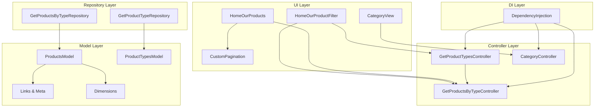

**Diagram sources**
- [category_view.dart:12-99](file://lib/features/category/views/category_view.dart#L12-L99)
- [home_our_product_filter.dart:11-136](file://lib/features/home/widgets/home_widgets/home_our_product_filter.dart#L11-L136)
- [home_our_products.dart:11-88](file://lib/features/home/widgets/home_widgets/home_our_products.dart#L11-L88)
- [custom_pagination.dart:7-87](file://lib/shared/widgets/custom_pagination/custom_pagination.dart#L7-L87)
- [get_product_types_controller.dart:7-37](file://lib/features/home/controller/get_product_types_controller.dart#L7-L37)
- [get_products_by_type_controller.dart:6-26](file://lib/features/home/controller/get_products_by_type_controller.dart#L6-L26)
- [get_product_type_repo.dart:7-19](file://lib/features/home/repositories/get_product_type_repo.dart#L7-L19)
- [get_products_by_type_repo.dart:7-21](file://lib/features/home/repositories/get_products_by_type_repo.dart#L7-L21)
- [products_model.dart:9-363](file://lib/features/home/models/products_model.dart#L9-L363)
- [product_types_model.dart:1-37](file://lib/features/home/models/product_types_model.dart#L1-L37)
- [category_controller.dart:3-4](file://lib/features/category/controller/category_controller.dart#L3-L4)
- [dependency_injection.dart:11-26](file://lib/core/di/dependency_injection.dart#L11-L26)

## Detailed Component Analysis

### Category Feature
- **CategoryBindings**
  - Purpose: Registers CategoryController lazily for on-demand instantiation
  - Pattern: Uses Get.lazyPut to defer creation until first use
- **CategoryController**
  - Purpose: Reactive controller base for category-related state
  - Extends: GetxController
- **CategoryView**
  - Purpose: Renders a quick action list backed by DashboardController and navigates to named routes
  - Behavior: Taps navigate to named routes via Get.toNamed

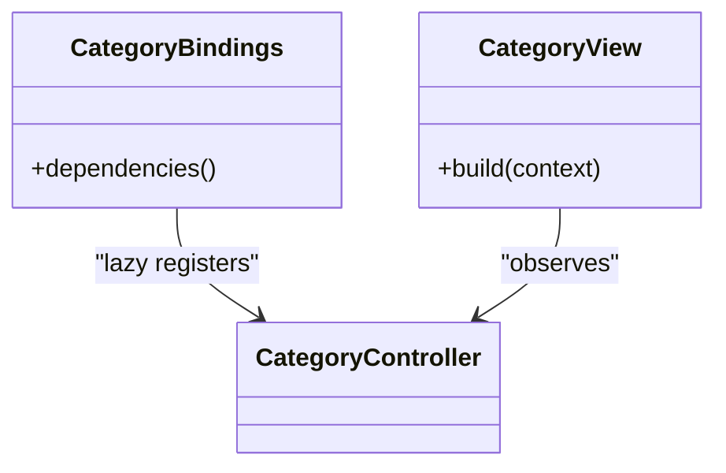

**Diagram sources**
- [category_bindings.dart:4-9](file://lib/features/category/bindings/category_bindings.dart#L4-L9)
- [category_controller.dart:3-4](file://lib/features/category/controller/category_controller.dart#L3-L4)
- [category_view.dart:12-99](file://lib/features/category/views/category_view.dart#L12-L99)

**Section sources**
- [category_bindings.dart:4-9](file://lib/features/category/bindings/category_bindings.dart#L4-L9)
- [category_controller.dart:3-4](file://lib/features/category/controller/category_controller.dart#L3-L4)
- [category_view.dart:12-99](file://lib/features/category/views/category_view.dart#L12-L99)

### Enhanced Product Catalog Controllers and Filtering
- **GetProductTypesController**
  - Responsibilities: Load product types with numeric IDs, select default type, trigger product load
  - Interaction: Calls repository, updates Rx state, delegates to GetProductsByTypeController
- **GetProductsByTypeController**
  - Responsibilities: Fetch products by type with pagination support, manage loading state, handle success/failure via fold
  - Enhanced: Now supports pagination data through ProductsModel with Links and Meta
- **GetProductTypeRepository**
  - Responsibilities: Handles product type retrieval with enhanced ProductTypesModel
- **GetProductsByTypeRepository**
  - Responsibilities: Manages product fetching with pagination and dimension data
  - Enhanced: Returns ProductsModel with comprehensive pagination information
- **HomeOurProductFilter**
  - Responsibilities: Render horizontal filter chips, update selected type, trigger product reload
  - Enhanced: Works seamlessly with pagination-aware type switching
- **HomeOurProducts**
  - Responsibilities: Display product grid with pagination support, show loading indicator, render product media/name/price
  - Enhanced: Integrates with CustomPagination component for large catalogs

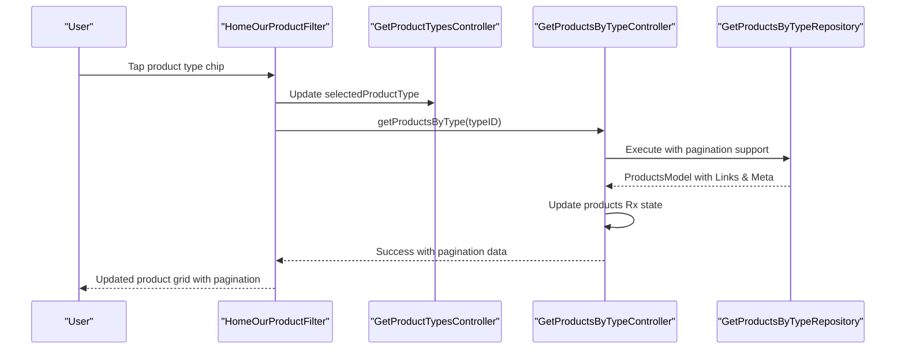

**Diagram sources**
- [home_our_product_filter.dart:32-40](file://lib/features/home/widgets/home_widgets/home_our_product_filter.dart#L32-L40)
- [get_product_types_controller.dart:25-27](file://lib/features/home/controller/get_product_types_controller.dart#L25-L27)
- [get_products_by_type_controller.dart:13-25](file://lib/features/home/controller/get_products_by_type_controller.dart#L13-L25)
- [get_products_by_type_repo.dart:11-20](file://lib/features/home/repositories/get_products_by_type_repo.dart#L11-L20)

**Section sources**
- [get_product_types_controller.dart:7-37](file://lib/features/home/controller/get_product_types_controller.dart#L7-L37)
- [get_products_by_type_controller.dart:6-26](file://lib/features/home/controller/get_products_by_type_controller.dart#L6-L26)
- [get_product_type_repo.dart:7-19](file://lib/features/home/repositories/get_product_type_repo.dart#L7-L19)
- [get_products_by_type_repo.dart:7-21](file://lib/features/home/repositories/get_products_by_type_repo.dart#L7-L21)
- [home_our_product_filter.dart:11-136](file://lib/features/home/widgets/home_widgets/home_our_product_filter.dart#L11-L136)
- [home_our_products.dart:11-88](file://lib/features/home/widgets/home_widgets/home_our_products.dart#L11-L88)

### Category Binding Setup and Dependency Injection
- **DependencyInjection.init**
  - Initializes GetStorage, registers StorageService, ThemeService, ThemeController, and network clients as singletons
  - Returns current token from storage for runtime decisions
- **CategoryBindings.dependencies**
  - Lazily registers CategoryController for category screens
- **Application bootstrap**
  - main initializes DI, sets up GetMaterialApp with initialBinding and initialRoute based on token presence

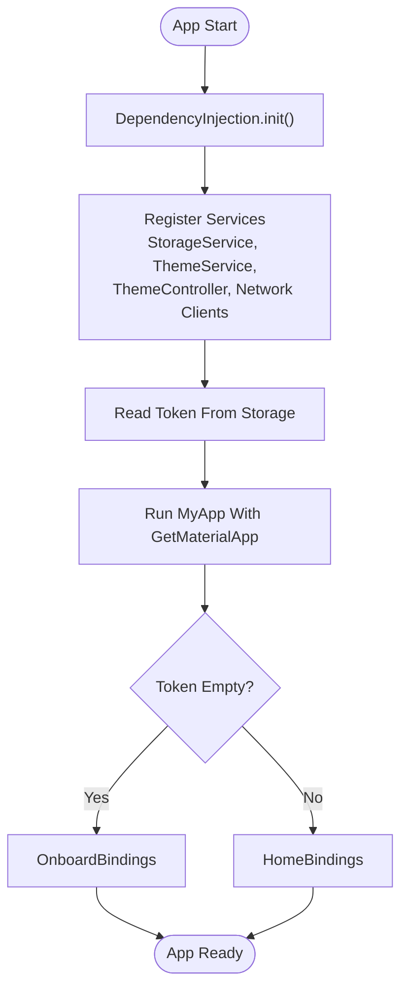

**Diagram sources**
- [dependency_injection.dart:12-25](file://lib/core/di/dependency_injection.dart#L12-L25)
- [main.dart:12-46](file://lib/main.dart#L12-L46)
- [category_bindings.dart:6-8](file://lib/features/category/bindings/category_bindings.dart#L6-L8)

**Section sources**
- [dependency_injection.dart:11-26](file://lib/core/di/dependency_injection.dart#L11-L26)
- [main.dart:12-46](file://lib/main.dart#L12-L46)
- [category_bindings.dart:4-9](file://lib/features/category/bindings/category_bindings.dart#L4-L9)

### Category View Implementation and Navigation
- **CategoryView** renders a quick action list using DashboardController.quickAction
- **Each tile** triggers navigation via Get.toNamed with route name from item metadata
- **Visual design** uses custom containers, app bars, and themed assets

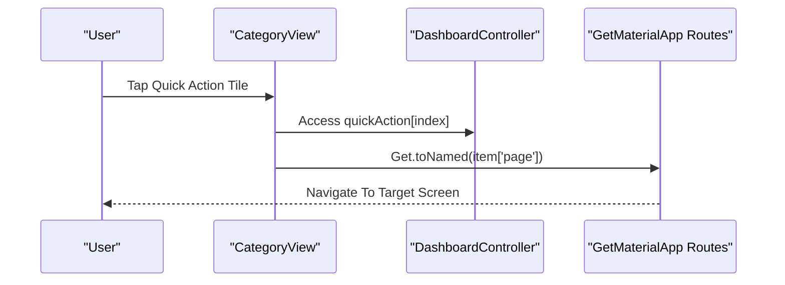

**Diagram sources**
- [category_view.dart:32-34](file://lib/features/category/views/category_view.dart#L32-L34)
- [app_routes.dart:1-34](file://lib/core/routes/app_routes.dart#L1-L34)

**Section sources**
- [category_view.dart:12-99](file://lib/features/category/views/category_view.dart#L12-L99)
- [app_routes.dart:1-34](file://lib/core/routes/app_routes.dart#L1-L34)

### Enhanced Product Grid Display and Search Functionality
- **Product grid**
  - HomeOurProducts displays a horizontal list of products with media, name, and formatted price
  - Loading state is handled via ButtonLoading while data fetch is in progress
  - Enhanced: Now integrates with CustomPagination for large catalogs
- **Search**
  - Current implementation focuses on type-based filtering with pagination support
  - Dedicated search mechanism not present, but pagination enables efficient product discovery
- **Pagination Integration**
  - ProductsModel includes Links and Meta for comprehensive pagination support
  - CustomPagination component provides reusable pagination interface

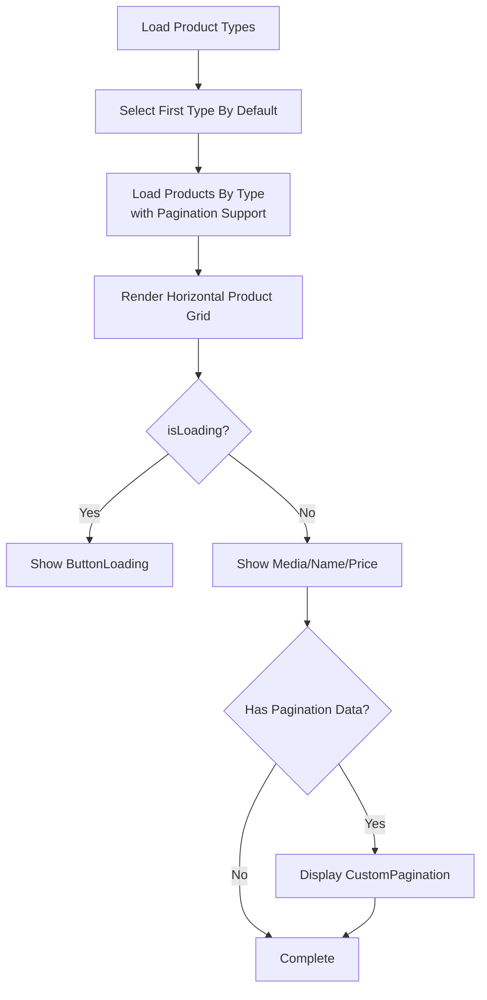

**Diagram sources**
- [get_product_types_controller.dart:15-30](file://lib/features/home/controller/get_product_types_controller.dart#L15-L30)
- [get_products_by_type_controller.dart:13-25](file://lib/features/home/controller/get_products_by_type_controller.dart#L13-L25)
- [home_our_products.dart:36-83](file://lib/features/home/widgets/home_widgets/home_our_products.dart#L36-L83)
- [products_model.dart:299-345](file://lib/features/home/models/products_model.dart#L299-L345)
- [custom_pagination.dart:14-79](file://lib/shared/widgets/custom_pagination/custom_pagination.dart#L14-L79)

**Section sources**
- [home_our_products.dart:11-88](file://lib/features/home/widgets/home_widgets/home_our_products.dart#L11-L88)
- [get_products_by_type_controller.dart:6-26](file://lib/features/home/controller/get_products_by_type_controller.dart#L6-L26)
- [get_product_types_controller.dart:7-37](file://lib/features/home/controller/get_product_types_controller.dart#L7-L37)
- [products_model.dart:9-363](file://lib/features/home/models/products_model.dart#L9-L363)
- [custom_pagination.dart:7-87](file://lib/shared/widgets/custom_pagination/custom_pagination.dart#L7-L87)

### Integration Between Categories and Products
- **Category navigation** leads to screens that integrate product discovery via type filters
- **CategoryView** uses DashboardController.quickAction to drive navigation to product-related screens
- **Product discovery** is type-centric with enhanced pagination support for large catalogs
- **Integration points** include seamless type switching and pagination-aware product loading

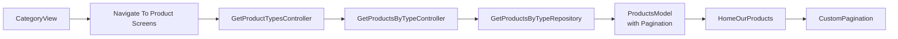

**Diagram sources**
- [category_view.dart:32-34](file://lib/features/category/views/category_view.dart#L32-L34)
- [get_product_types_controller.dart:25-27](file://lib/features/home/controller/get_product_types_controller.dart#L25-L27)
- [get_products_by_type_controller.dart:13-25](file://lib/features/home/controller/get_products_by_type_controller.dart#L13-L25)
- [get_products_by_type_repo.dart:11-20](file://lib/features/home/repositories/get_products_by_type_repo.dart#L11-L20)
- [products_model.dart:9-363](file://lib/features/home/models/products_model.dart#L9-L363)
- [home_our_products.dart:11-88](file://lib/features/home/widgets/home_widgets/home_our_products.dart#L11-L88)
- [custom_pagination.dart:7-87](file://lib/shared/widgets/custom_pagination/custom_pagination.dart#L7-L87)

**Section sources**
- [category_view.dart:12-99](file://lib/features/category/views/category_view.dart#L12-L99)
- [get_product_types_controller.dart:7-37](file://lib/features/home/controller/get_product_types_controller.dart#L7-L37)
- [get_products_by_type_controller.dart:6-26](file://lib/features/home/controller/get_products_by_type_controller.dart#L6-L26)
- [get_products_by_type_repo.dart:7-21](file://lib/features/home/repositories/get_products_by_type_repo.dart#L7-L21)
- [products_model.dart:9-363](file://lib/features/home/models/products_model.dart#L9-L363)
- [home_our_products.dart:11-88](file://lib/features/home/widgets/home_widgets/home_our_products.dart#L11-L88)
- [custom_pagination.dart:7-87](file://lib/shared/widgets/custom_pagination/custom_pagination.dart#L7-L87)

## Enhanced Product Data Models

### Comprehensive Pagination Support
The ProductsModel now includes sophisticated pagination support through Links and Meta classes:

- **Links Class**: Provides navigation URLs for pagination (first, last, previous, next)
- **Meta Class**: Contains pagination metadata (current_page, from, last_page, path, per_page, to, total)
- **Integration**: Seamless pagination support across all product queries and filtering operations

### Structured Dimension Specifications
Enhanced product data handling with comprehensive dimension support:

- **Dimensions Field**: Dynamic object containing weight, length, width, height, and weight_kg
- **Measurement Units**: CM for length/width/height, KG for weight measurements
- **Flexible Format**: Supports various product types with different dimensional requirements

### Numeric Type Precision Improvements
All product fields now use num-based numeric types for enhanced precision:

- **Product ID**: num type for precise identification
- **Category ID**: num type for category associations
- **Price Fields**: num type for currency calculations (price, selling_price, discount_amount, final_price)
- **Quantity Fields**: num type for inventory management
- **Dimension Values**: num type for precise measurements

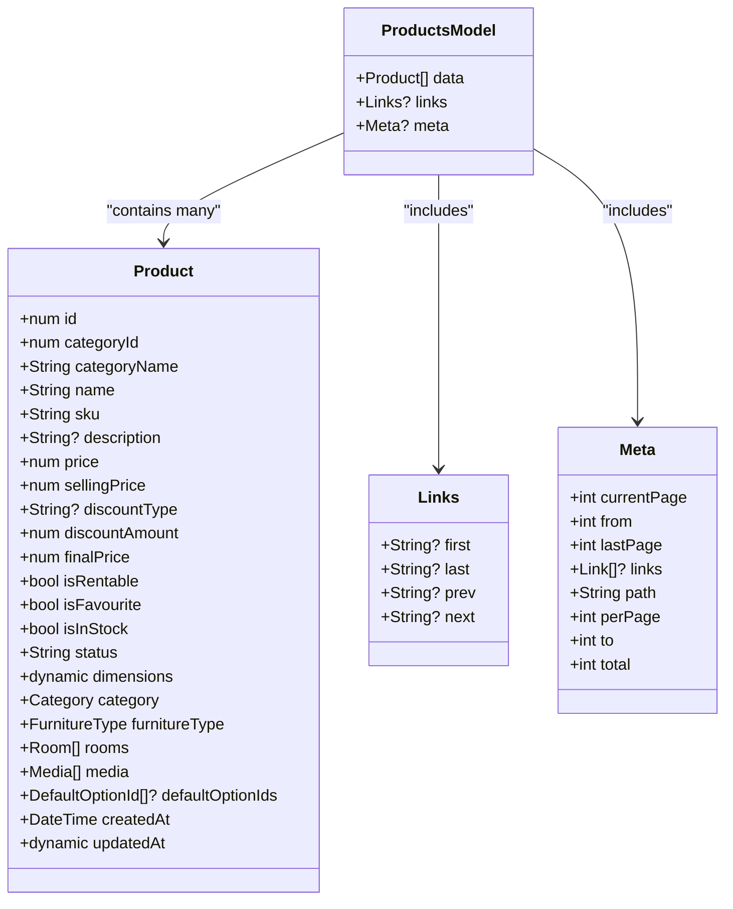

**Diagram sources**
- [products_model.dart:9-363](file://lib/features/home/models/products_model.dart#L9-L363)

**Section sources**
- [products_model.dart:9-363](file://lib/features/home/models/products_model.dart#L9-L363)
- [product_types_model.dart:1-37](file://lib/features/home/models/product_types_model.dart#L1-L37)

## Pagination Support Implementation

### CustomPagination Component
A reusable pagination component provides comprehensive pagination functionality:

- **Current Page Tracking**: RxInt for reactive current page state
- **Total Pages Calculation**: Integer for total page count
- **Dynamic Page Rendering**: Smart page number display based on current position
- **Navigation Controls**: Previous/Next buttons with conditional enablement
- **Responsive Design**: Adapts to different screen sizes and page counts

### Pagination Data Flow
The pagination system integrates seamlessly with the product catalog:

- **Data Retrieval**: Repositories return ProductsModel with Meta information
- **State Management**: Controllers update pagination state reactively
- **UI Integration**: CustomPagination component displays and handles user interaction
- **Navigation**: Automatic page loading and product refresh on page change

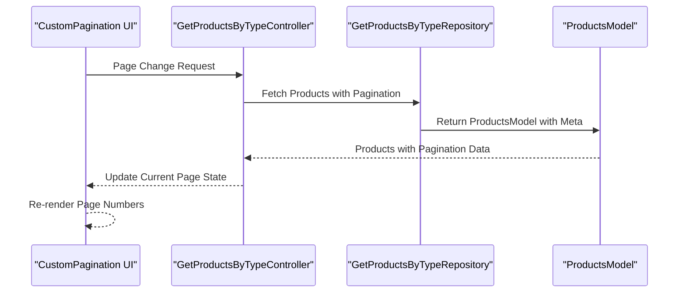

**Diagram sources**
- [custom_pagination.dart:14-79](file://lib/shared/widgets/custom_pagination/custom_pagination.dart#L14-L79)
- [get_products_by_type_controller.dart:13-25](file://lib/features/home/controller/get_products_by_type_controller.dart#L13-L25)
- [get_products_by_type_repo.dart:11-20](file://lib/features/home/repositories/get_products_by_type_repo.dart#L11-L20)
- [products_model.dart:299-345](file://lib/features/home/models/products_model.dart#L299-L345)

**Section sources**
- [custom_pagination.dart:7-87](file://lib/shared/widgets/custom_pagination/custom_pagination.dart#L7-L87)
- [get_products_by_type_controller.dart:6-26](file://lib/features/home/controller/get_products_by_type_controller.dart#L6-L26)
- [get_products_by_type_repo.dart:7-21](file://lib/features/home/repositories/get_products_by_type_repo.dart#L7-L21)
- [products_model.dart:9-363](file://lib/features/home/models/products_model.dart#L9-L363)

## Numeric Type Precision Improvements

### Enhanced Product Field Types
All product-related fields now use num-based numeric types for improved precision:

- **Product Identification**: Product.id, Category.id, FurnitureType.id use num type
- **Monetary Values**: price, sellingPrice, discountAmount, finalPrice use num type
- **Inventory Management**: Stock quantities and product attributes use num type
- **Dimension Calculations**: Length, width, height, weight measurements use num type

### Benefits of Numeric Type Migration
- **Precision**: Eliminates floating-point rounding errors in financial calculations
- **Consistency**: Uniform numeric handling across all product data
- **Performance**: Optimized numeric operations for large-scale catalogs
- **Reliability**: Reduced data type conversion issues and validation errors

### Backward Compatibility
The migration maintains backward compatibility while improving data integrity:
- JSON serialization/deserialization handles num types seamlessly
- Existing business logic adapts automatically to numeric types
- No breaking changes to external APIs or data contracts

**Section sources**
- [products_model.dart:29-137](file://lib/features/home/models/products_model.dart#L29-L137)
- [product_types_model.dart:23-36](file://lib/features/home/models/product_types_model.dart#L23-L36)

## Dimension Specifications Handling

### Comprehensive Measurement Support
The enhanced product model includes sophisticated dimension handling:

- **Weight Measurements**: weight and weight_kg fields for precise weight specification
- **Dimension Units**: length_cm, width_cm, height_cm for metric measurements
- **Flexible Format**: Supports various product types from small accessories to large furniture
- **Dynamic Structure**: Dimensions object adapts to product-specific measurement requirements

### Dimension Data Structure
```json
{
  "weight": 66.03,
  "length_cm": 148.26,
  "width_cm": 34.73,
  "height_cm": 158.15,
  "weight_kg": 55.90
}
```

### Practical Applications
- **Shipping Calculations**: Accurate weight and dimensional data for logistics
- **Storage Planning**: Precise measurements for warehouse and retail space planning
- **Product Comparison**: Standardized dimensional specifications across product catalog
- **E-commerce Features**: Support for size guides, fit calculators, and spatial planning tools

**Section sources**
- [products_model.dart:397-403](file://lib/features/home/models/products_model.dart#L397-L403)
- [response.json:373-403](file://response.json#L373-L403)

## Dependency Analysis
- **Category feature**
  - CategoryBindings depends on CategoryController
  - CategoryView depends on DashboardController for quick actions and routes
- **Enhanced Product catalog feature**
  - GetProductTypesController depends on GetProductTypeRepository and GetProductsByTypeController
  - GetProductsByTypeController depends on GetProductsByTypeRepository and exposes Rx data
  - GetProductTypeRepository depends on ProductTypesModel and GetNetwork
  - GetProductsByTypeRepository depends on ProductsModel and GetNetwork
  - ProductsModel depends on Links, Meta, and comprehensive product data structures
  - ProductTypesModel depends on ProductType with numeric IDs
  - HomeOurProductFilter depends on GetProductTypesController and GetProductsByTypeController
  - HomeOurProducts depends on GetProductsByTypeController and CustomPagination
  - CustomPagination depends on RxInt for reactive state management

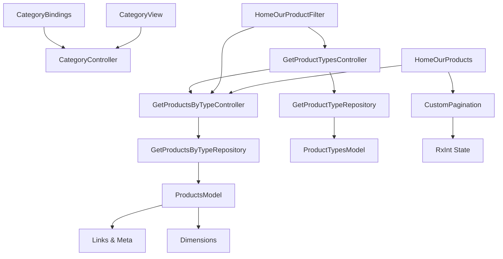

**Diagram sources**
- [category_bindings.dart:4-9](file://lib/features/category/bindings/category_bindings.dart#L4-L9)
- [category_controller.dart:3-4](file://lib/features/category/controller/category_controller.dart#L3-L4)
- [category_view.dart:12-99](file://lib/features/category/views/category_view.dart#L12-L99)
- [get_product_types_controller.dart:7-37](file://lib/features/home/controller/get_product_types_controller.dart#L7-L37)
- [get_products_by_type_controller.dart:6-26](file://lib/features/home/controller/get_products_by_type_controller.dart#L6-L26)
- [get_product_type_repo.dart:7-19](file://lib/features/home/repositories/get_product_type_repo.dart#L7-L19)
- [get_products_by_type_repo.dart:7-21](file://lib/features/home/repositories/get_products_by_type_repo.dart#L7-L21)
- [products_model.dart:9-363](file://lib/features/home/models/products_model.dart#L9-L363)
- [product_types_model.dart:1-37](file://lib/features/home/models/product_types_model.dart#L1-L37)
- [home_our_product_filter.dart:11-136](file://lib/features/home/widgets/home_widgets/home_our_product_filter.dart#L11-L136)
- [home_our_products.dart:11-88](file://lib/features/home/widgets/home_widgets/home_our_products.dart#L11-L88)
- [custom_pagination.dart:7-87](file://lib/shared/widgets/custom_pagination/custom_pagination.dart#L7-L87)

**Section sources**
- [category_bindings.dart:4-9](file://lib/features/category/bindings/category_bindings.dart#L4-L9)
- [category_controller.dart:3-4](file://lib/features/category/controller/category_controller.dart#L3-L4)
- [category_view.dart:12-99](file://lib/features/category/views/category_view.dart#L12-L99)
- [get_product_types_controller.dart:7-37](file://lib/features/home/controller/get_product_types_controller.dart#L7-L37)
- [get_products_by_type_controller.dart:6-26](file://lib/features/home/controller/get_products_by_type_controller.dart#L6-L26)
- [get_product_type_repo.dart:7-19](file://lib/features/home/repositories/get_product_type_repo.dart#L7-L19)
- [get_products_by_type_repo.dart:7-21](file://lib/features/home/repositories/get_products_by_type_repo.dart#L7-L21)
- [products_model.dart:9-363](file://lib/features/home/models/products_model.dart#L9-L363)
- [product_types_model.dart:1-37](file://lib/features/home/models/product_types_model.dart#L1-L37)
- [home_our_product_filter.dart:11-136](file://lib/features/home/widgets/home_widgets/home_our_product_filter.dart#L11-L136)
- [home_our_products.dart:11-88](file://lib/features/home/widgets/home_widgets/home_our_products.dart#L11-L88)
- [custom_pagination.dart:7-87](file://lib/shared/widgets/custom_pagination/custom_pagination.dart#L7-L87)

## Performance Considerations
- **Lazy loading**
  - Use lazyPut for controllers to avoid unnecessary instantiation
- **Horizontal scrolling lists**
  - Prefer ListView.builder with shrinkWrap and explicit item counts to minimize layout work
- **Reactive state updates**
  - Use Obx sparingly; wrap only the necessary widgets to reduce rebuild scope
- **Loading indicators**
  - Show lightweight loaders during data fetch to maintain responsiveness
- **Pagination and virtualization**
  - **Enhanced**: Implement pagination for large catalogs with CustomPagination component
  - **Optimized**: Use Links and Meta data for efficient pagination navigation
  - **Scalable**: Support for large product catalogs with proper pagination state management
- **Caching**
  - Cache frequently accessed product types and recent product lists to reduce network calls
- **Numeric Precision**
  - **Improved**: Use num types for all product fields to eliminate floating-point errors
  - **Efficient**: Optimized numeric operations for better performance
- **Dimension Handling**
  - **Structured**: Efficient dimension data handling with dynamic objects
  - **Memory**: Optimized storage and processing of dimensional specifications

## Troubleshooting Guide
- **Navigation issues**
  - Verify route names in AppRoutes and ensure CategoryView passes the correct page key to Get.toNamed
- **Data loading failures**
  - Inspect fold handlers in GetProductsByTypeController and GetProductTypesController to confirm error handling and snackbars
- **State synchronization**
  - Confirm that GetProductTypesController updates selectedProductType before invoking GetProductsByTypeController
- **Pagination issues**
  - **New**: Verify Links and Meta data are properly populated in ProductsModel
  - **New**: Check CustomPagination component receives correct currentPage and totalPage values
  - **New**: Ensure pagination state updates trigger proper product reloading
- **Numeric precision errors**
  - **New**: Verify all product fields use num types instead of dynamic types
  - **New**: Check for proper numeric type handling in JSON serialization/deserialization
- **Dimension data issues**
  - **New**: Validate dimensions object structure matches expected format
  - **New**: Ensure dimension values are properly parsed and accessible

**Section sources**
- [app_routes.dart:1-34](file://lib/core/routes/app_routes.dart#L1-L34)
- [category_view.dart:32-34](file://lib/features/category/views/category_view.dart#L32-L34)
- [get_products_by_type_controller.dart:17-24](file://lib/features/home/controller/get_products_by_type_controller.dart#L17-L24)
- [get_product_types_controller.dart:18-29](file://lib/features/home/controller/get_product_types_controller.dart#L18-L29)
- [products_model.dart:299-345](file://lib/features/home/models/products_model.dart#L299-L345)
- [custom_pagination.dart:14-79](file://lib/shared/widgets/custom_pagination/custom_pagination.dart#L14-L79)

## Conclusion
The enhanced Product Catalog Management system now provides comprehensive pagination support, improved numeric precision, and sophisticated dimension handling capabilities. The integration of Links and Meta classes enables scalable product catalog management for large-scale applications. The migration to num-based numeric types ensures precise financial calculations and improved reliability. The addition of dimension specifications supports complex product data requirements across various industries. The CustomPagination component provides a reusable solution for efficient navigation through large product catalogs. The system maintains its layered architecture while adding powerful new capabilities for enterprise-grade product catalog management.