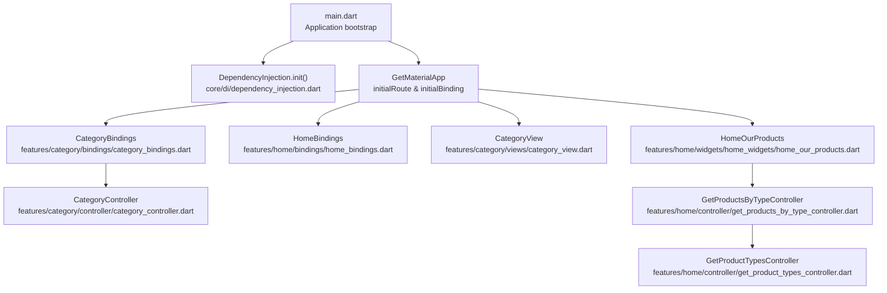
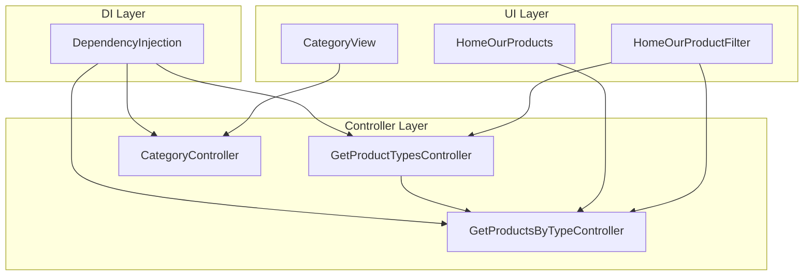
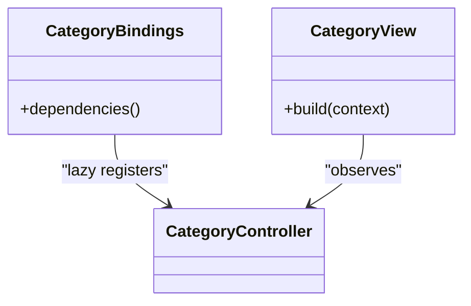
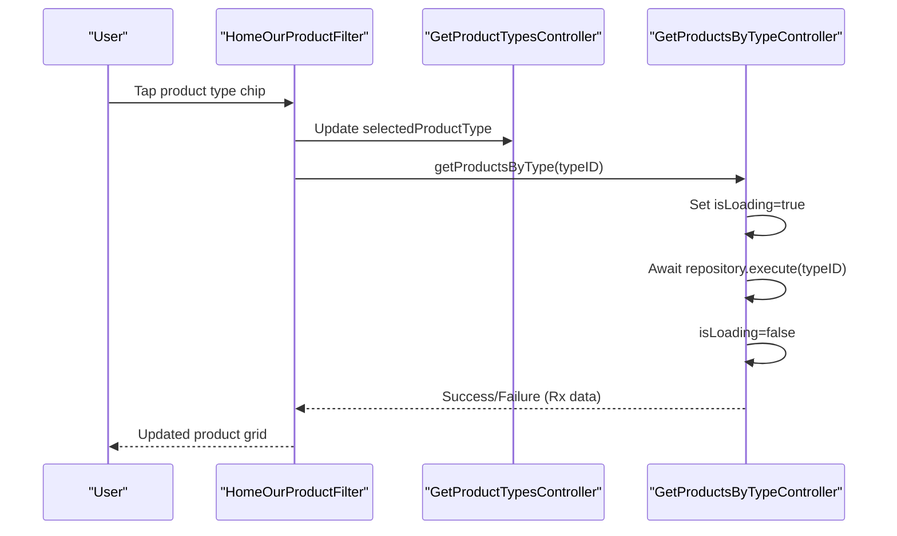
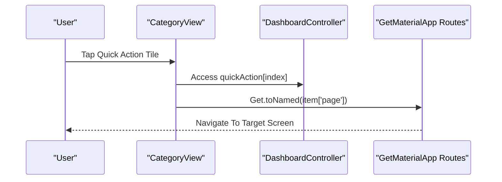
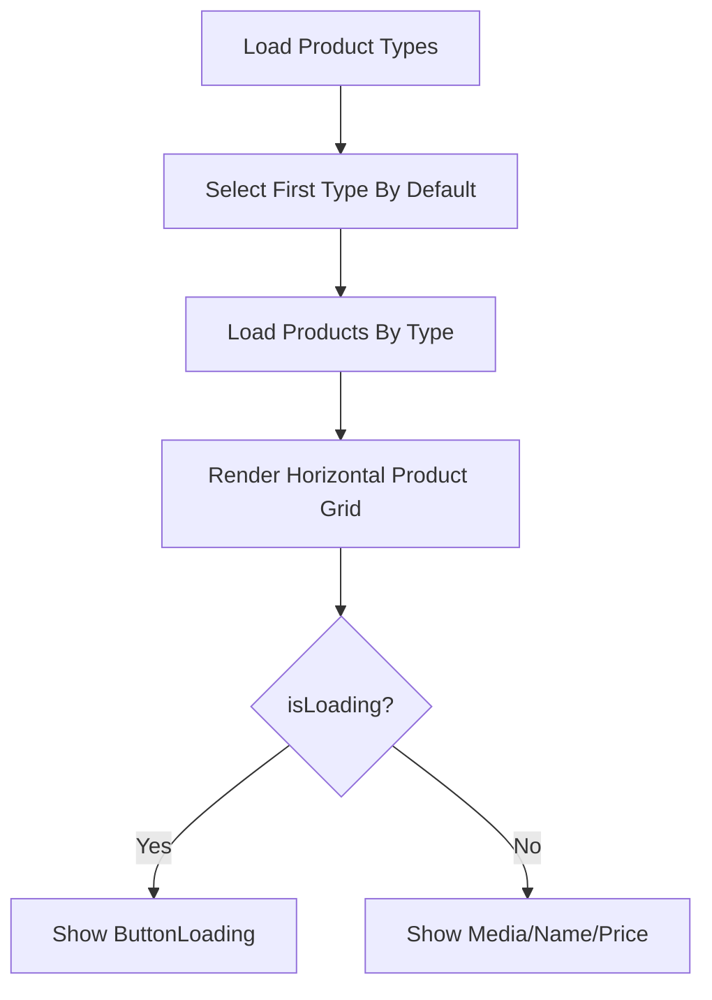
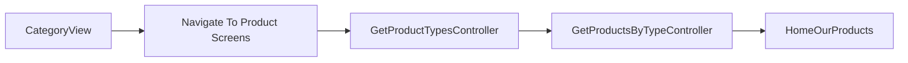
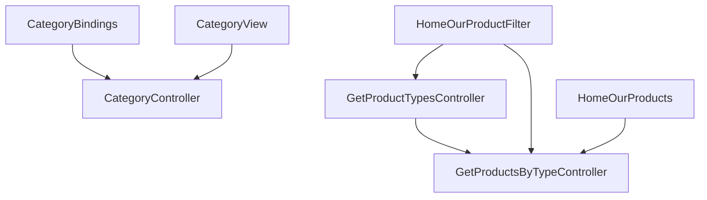

# Product Catalog Management

<cite>
**Referenced Files in This Document**
- [main.dart](file://lib/main.dart)
- [dependency_injection.dart](file://lib/core/di/dependency_injection.dart)
- [app_routes.dart](file://lib/core/routes/app_routes.dart)
- [category_controller.dart](file://lib/features/category/controller/category_controller.dart)
- [category_bindings.dart](file://lib/features/category/bindings/category_bindings.dart)
- [category_view.dart](file://lib/features/category/views/category_view.dart)
- [get_product_types_controller.dart](file://lib/features/home/controller/get_product_types_controller.dart)
- [get_products_by_type_controller.dart](file://lib/features/home/controller/get_products_by_type_controller.dart)
- [home_our_product_filter.dart](file://lib/features/home/widgets/home_widgets/home_our_product_filter.dart)
- [home_our_products.dart](file://lib/features/home/widgets/home_widgets/home_our_products.dart)
</cite>

## Table of Contents
1. [Introduction](#introduction)
2. [Project Structure](#project-structure)
3. [Core Components](#core-components)
4. [Architecture Overview](#architecture-overview)
5. [Detailed Component Analysis](#detailed-component-analysis)
6. [Dependency Analysis](#dependency-analysis)
7. [Performance Considerations](#performance-considerations)
8. [Troubleshooting Guide](#troubleshooting-guide)
9. [Conclusion](#conclusion)

## Introduction
This document explains the Product Catalog Management system with a focus on category navigation, product listing, filtering, and the integration between categories and products. It covers the category controller implementation, dependency injection setup, category view rendering, product grid display, and dynamic filtering mechanisms. It also outlines controller methods for loading categories, handling user interactions, and managing product collections, along with practical workflows and performance optimization techniques for large catalogs.

## Project Structure
The application initializes dependency injection early in the startup lifecycle and configures routing and bindings. The category feature is defined under features/category, while product catalog functionality is primarily implemented in the home feature’s controllers and widgets.

**Diagram sources**
- [main.dart:12-46](file://lib/main.dart#L12-L46)
- [dependency_injection.dart:11-26](file://lib/core/di/dependency_injection.dart#L11-L26)
- [category_bindings.dart:4-9](file://lib/features/category/bindings/category_bindings.dart#L4-L9)
- [category_controller.dart:3-4](file://lib/features/category/controller/category_controller.dart#L3-L4)
- [category_view.dart:12-99](file://lib/features/category/views/category_view.dart#L12-L99)
- [home_our_products.dart:11-88](file://lib/features/home/widgets/home_widgets/home_our_products.dart#L11-L88)
- [get_products_by_type_controller.dart:6-26](file://lib/features/home/controller/get_products_by_type_controller.dart#L6-L26)
- [get_product_types_controller.dart:7-37](file://lib/features/home/controller/get_product_types_controller.dart#L7-L37)

**Section sources**
- [main.dart:12-46](file://lib/main.dart#L12-L46)
- [dependency_injection.dart:11-26](file://lib/core/di/dependency_injection.dart#L11-L26)
- [category_bindings.dart:4-9](file://lib/features/category/bindings/category_bindings.dart#L4-L9)
- [category_controller.dart:3-4](file://lib/features/category/controller/category_controller.dart#L3-L4)
- [category_view.dart:12-99](file://lib/features/category/views/category_view.dart#L12-L99)
- [home_our_products.dart:11-88](file://lib/features/home/widgets/home_widgets/home_our_products.dart#L11-L88)
- [get_products_by_type_controller.dart:6-26](file://lib/features/home/controller/get_products_by_type_controller.dart#L6-L26)
- [get_product_types_controller.dart:7-37](file://lib/features/home/controller/get_product_types_controller.dart#L7-L37)

## Core Components
- Category feature
  - CategoryBindings: Registers CategoryController lazily via Get.lazyPut.
  - CategoryController: Minimal reactive controller extending GetxController.
  - CategoryView: Renders quick action tiles bound to DashboardController and navigates to named routes.
- Product catalog feature
  - GetProductTypesController: Loads product types, selects the first type, and triggers loading products by type.
  - GetProductsByTypeController: Fetches products for a given type and manages loading state and Rx data.
  - HomeOurProductFilter: Horizontal filter bar to switch product types and trigger product reload.
  - HomeOurProducts: Horizontal scrolling product grid displaying product media, name, and price.

**Section sources**
- [category_bindings.dart:4-9](file://lib/features/category/bindings/category_bindings.dart#L4-L9)
- [category_controller.dart:3-4](file://lib/features/category/controller/category_controller.dart#L3-L4)
- [category_view.dart:12-99](file://lib/features/category/views/category_view.dart#L12-L99)
- [get_product_types_controller.dart:7-37](file://lib/features/home/controller/get_product_types_controller.dart#L7-L37)
- [get_products_by_type_controller.dart:6-26](file://lib/features/home/controller/get_products_by_type_controller.dart#L6-L26)
- [home_our_product_filter.dart:11-134](file://lib/features/home/widgets/home_widgets/home_our_product_filter.dart#L11-L134)
- [home_our_products.dart:11-88](file://lib/features/home/widgets/home_widgets/home_our_products.dart#L11-L88)

## Architecture Overview
The system follows a layered architecture:
- UI Layer: Views and widgets (CategoryView, HomeOurProducts, HomeOurProductFilter).
- Controller Layer: GetX controllers orchestrating data fetching and state updates.
- Repository Layer: Encapsulated network calls (referenced by controllers).
- DI Layer: Centralized dependency initialization and service registration.

**Diagram sources**
- [category_view.dart:12-99](file://lib/features/category/views/category_view.dart#L12-L99)
- [home_our_product_filter.dart:11-134](file://lib/features/home/widgets/home_widgets/home_our_product_filter.dart#L11-L134)
- [home_our_products.dart:11-88](file://lib/features/home/widgets/home_widgets/home_our_products.dart#L11-L88)
- [get_product_types_controller.dart:7-37](file://lib/features/home/controller/get_product_types_controller.dart#L7-L37)
- [get_products_by_type_controller.dart:6-26](file://lib/features/home/controller/get_products_by_type_controller.dart#L6-L26)
- [category_controller.dart:3-4](file://lib/features/category/controller/category_controller.dart#L3-L4)
- [dependency_injection.dart:11-26](file://lib/core/di/dependency_injection.dart#L11-L26)

## Detailed Component Analysis

### Category Feature
- CategoryBindings
  - Purpose: Registers CategoryController lazily for on-demand instantiation.
  - Pattern: Uses Get.lazyPut to defer creation until first use.
- CategoryController
  - Purpose: Reactive controller base for category-related state.
  - Extends: GetxController.
- CategoryView
  - Purpose: Renders a quick action list backed by DashboardController.quickAction.
  - Behavior: Taps navigate to named routes via Get.toNamed.

**Diagram sources**
- [category_bindings.dart:4-9](file://lib/features/category/bindings/category_bindings.dart#L4-L9)
- [category_controller.dart:3-4](file://lib/features/category/controller/category_controller.dart#L3-L4)
- [category_view.dart:12-99](file://lib/features/category/views/category_view.dart#L12-L99)

**Section sources**
- [category_bindings.dart:4-9](file://lib/features/category/bindings/category_bindings.dart#L4-L9)
- [category_controller.dart:3-4](file://lib/features/category/controller/category_controller.dart#L3-L4)
- [category_view.dart:12-99](file://lib/features/category/views/category_view.dart#L12-L99)

### Product Catalog Controllers and Filtering
- GetProductTypesController
  - Responsibilities: Load product types, select default type, trigger product load.
  - Interaction: Calls repository, updates Rx state, delegates to GetProductsByTypeController.
- GetProductsByTypeController
  - Responsibilities: Fetch products by type, manage loading state, handle success/failure via fold.
- HomeOurProductFilter
  - Responsibilities: Render horizontal filter chips, update selected type, trigger product reload.
- HomeOurProducts
  - Responsibilities: Display product grid horizontally, show loading indicator, render product media/name/price.

**Diagram sources**
- [home_our_product_filter.dart:32-40](file://lib/features/home/widgets/home_widgets/home_our_product_filter.dart#L32-L40)
- [get_product_types_controller.dart:25-27](file://lib/features/home/controller/get_product_types_controller.dart#L25-L27)
- [get_products_by_type_controller.dart:13-25](file://lib/features/home/controller/get_products_by_type_controller.dart#L13-L25)

**Section sources**
- [get_product_types_controller.dart:7-37](file://lib/features/home/controller/get_product_types_controller.dart#L7-L37)
- [get_products_by_type_controller.dart:6-26](file://lib/features/home/controller/get_products_by_type_controller.dart#L6-L26)
- [home_our_product_filter.dart:11-134](file://lib/features/home/widgets/home_widgets/home_our_product_filter.dart#L11-L134)
- [home_our_products.dart:11-88](file://lib/features/home/widgets/home_widgets/home_our_products.dart#L11-L88)

### Category Binding Setup and Dependency Injection
- DependencyInjection.init
  - Initializes GetStorage, registers StorageService, ThemeService, ThemeController, and network clients as singletons.
  - Returns current token from storage for runtime decisions.
- CategoryBindings.dependencies
  - Lazily registers CategoryController for category screens.
- Application bootstrap
  - main initializes DI, sets up GetMaterialApp with initialBinding and initialRoute based on token presence.

**Diagram sources**
- [dependency_injection.dart:12-25](file://lib/core/di/dependency_injection.dart#L12-L25)
- [main.dart:12-46](file://lib/main.dart#L12-L46)
- [category_bindings.dart:6-8](file://lib/features/category/bindings/category_bindings.dart#L6-L8)

**Section sources**
- [dependency_injection.dart:11-26](file://lib/core/di/dependency_injection.dart#L11-L26)
- [main.dart:12-46](file://lib/main.dart#L12-L46)
- [category_bindings.dart:4-9](file://lib/features/category/bindings/category_bindings.dart#L4-L9)

### Category View Implementation and Navigation
- CategoryView renders a quick action list using DashboardController.quickAction.
- Each tile triggers navigation via Get.toNamed with route name from item metadata.
- Visual design uses custom containers, app bars, and themed assets.

**Diagram sources**
- [category_view.dart:32-34](file://lib/features/category/views/category_view.dart#L32-L34)
- [app_routes.dart:1-34](file://lib/core/routes/app_routes.dart#L1-L34)

**Section sources**
- [category_view.dart:12-99](file://lib/features/category/views/category_view.dart#L12-L99)
- [app_routes.dart:1-34](file://lib/core/routes/app_routes.dart#L1-L34)

### Product Grid Display and Search Functionality
- Product grid
  - HomeOurProducts displays a horizontal list of products with media, name, and formatted price.
  - Loading state is handled via ButtonLoading while data fetch is in progress.
- Search
  - Current implementation focuses on type-based filtering. A dedicated search mechanism is not present in the analyzed files; product discovery is driven by category/type selection.

**Diagram sources**
- [get_product_types_controller.dart:15-30](file://lib/features/home/controller/get_product_types_controller.dart#L15-L30)
- [get_products_by_type_controller.dart:13-25](file://lib/features/home/controller/get_products_by_type_controller.dart#L13-L25)
- [home_our_products.dart:36-83](file://lib/features/home/widgets/home_widgets/home_our_products.dart#L36-L83)

**Section sources**
- [home_our_products.dart:11-88](file://lib/features/home/widgets/home_widgets/home_our_products.dart#L11-L88)
- [get_products_by_type_controller.dart:6-26](file://lib/features/home/controller/get_products_by_type_controller.dart#L6-L26)
- [get_product_types_controller.dart:7-37](file://lib/features/home/controller/get_product_types_controller.dart#L7-L37)

### Integration Between Categories and Products
- Category navigation leads to screens that integrate product discovery via type filters.
- CategoryView uses DashboardController.quickAction to drive navigation to product-related screens.
- Product discovery is type-centric; category-to-product relationships are implied by the type selection flow.

**Diagram sources**
- [category_view.dart:32-34](file://lib/features/category/views/category_view.dart#L32-L34)
- [get_product_types_controller.dart:25-27](file://lib/features/home/controller/get_product_types_controller.dart#L25-L27)
- [get_products_by_type_controller.dart:13-25](file://lib/features/home/controller/get_products_by_type_controller.dart#L13-L25)
- [home_our_products.dart:11-88](file://lib/features/home/widgets/home_widgets/home_our_products.dart#L11-L88)

**Section sources**
- [category_view.dart:12-99](file://lib/features/category/views/category_view.dart#L12-L99)
- [get_product_types_controller.dart:7-37](file://lib/features/home/controller/get_product_types_controller.dart#L7-L37)
- [get_products_by_type_controller.dart:6-26](file://lib/features/home/controller/get_products_by_type_controller.dart#L6-L26)
- [home_our_products.dart:11-88](file://lib/features/home/widgets/home_widgets/home_our_products.dart#L11-L88)

## Dependency Analysis
- Category feature
  - CategoryBindings depends on CategoryController.
  - CategoryView depends on DashboardController for quick actions and routes.
- Product catalog feature
  - GetProductTypesController depends on repository abstraction and GetProductsByTypeController.
  - GetProductsByTypeController depends on repository abstraction and exposes Rx data.
  - HomeOurProductFilter depends on GetProductTypesController and GetProductsByTypeController.
  - HomeOurProducts depends on GetProductsByTypeController.

**Diagram sources**
- [category_bindings.dart:4-9](file://lib/features/category/bindings/category_bindings.dart#L4-L9)
- [category_controller.dart:3-4](file://lib/features/category/controller/category_controller.dart#L3-L4)
- [category_view.dart:12-99](file://lib/features/category/views/category_view.dart#L12-L99)
- [get_product_types_controller.dart:7-37](file://lib/features/home/controller/get_product_types_controller.dart#L7-L37)
- [get_products_by_type_controller.dart:6-26](file://lib/features/home/controller/get_products_by_type_controller.dart#L6-L26)
- [home_our_product_filter.dart:11-134](file://lib/features/home/widgets/home_widgets/home_our_product_filter.dart#L11-L134)
- [home_our_products.dart:11-88](file://lib/features/home/widgets/home_widgets/home_our_products.dart#L11-L88)

**Section sources**
- [category_bindings.dart:4-9](file://lib/features/category/bindings/category_bindings.dart#L4-L9)
- [category_controller.dart:3-4](file://lib/features/category/controller/category_controller.dart#L3-L4)
- [category_view.dart:12-99](file://lib/features/category/views/category_view.dart#L12-L99)
- [get_product_types_controller.dart:7-37](file://lib/features/home/controller/get_product_types_controller.dart#L7-L37)
- [get_products_by_type_controller.dart:6-26](file://lib/features/home/controller/get_products_by_type_controller.dart#L6-L26)
- [home_our_product_filter.dart:11-134](file://lib/features/home/widgets/home_widgets/home_our_product_filter.dart#L11-L134)
- [home_our_products.dart:11-88](file://lib/features/home/widgets/home_widgets/home_our_products.dart#L11-L88)

## Performance Considerations
- Lazy loading
  - Use lazyPut for controllers to avoid unnecessary instantiation.
- Horizontal scrolling lists
  - Prefer ListView.builder with shrinkWrap and explicit item counts to minimize layout work.
- Reactive state updates
  - Use Obx sparingly; wrap only the necessary widgets to reduce rebuild scope.
- Loading indicators
  - Show lightweight loaders during data fetch to maintain responsiveness.
- Pagination and virtualization
  - For large catalogs, implement pagination and virtualized lists to limit memory usage.
- Caching
  - Cache frequently accessed product types and recent product lists to reduce network calls.

## Troubleshooting Guide
- Navigation issues
  - Verify route names in AppRoutes and ensure CategoryView passes the correct page key to Get.toNamed.
- Data loading failures
  - Inspect fold handlers in GetProductsByTypeController and GetProductTypesController to confirm error handling and snackbars.
- State synchronization
  - Confirm that GetProductTypesController updates selectedProductType before invoking GetProductsByTypeController.

**Section sources**
- [app_routes.dart:1-34](file://lib/core/routes/app_routes.dart#L1-L34)
- [category_view.dart:32-34](file://lib/features/category/views/category_view.dart#L32-L34)
- [get_products_by_type_controller.dart:17-24](file://lib/features/home/controller/get_products_by_type_controller.dart#L17-L24)
- [get_product_types_controller.dart:18-29](file://lib/features/home/controller/get_product_types_controller.dart#L18-L29)

## Conclusion
The Product Catalog Management system integrates category navigation with a robust product listing and filtering pipeline. CategoryBindings and CategoryController provide a minimal reactive foundation, while GetProductTypesController and GetProductsByTypeController orchestrate type-based product discovery. HomeOurProductFilter and HomeOurProducts deliver an efficient, horizontally scrollable product grid with loading states. The DI layer centralizes service registration, enabling scalable dependency management. For large catalogs, adopt pagination, caching, and optimized list rendering to maintain performance.