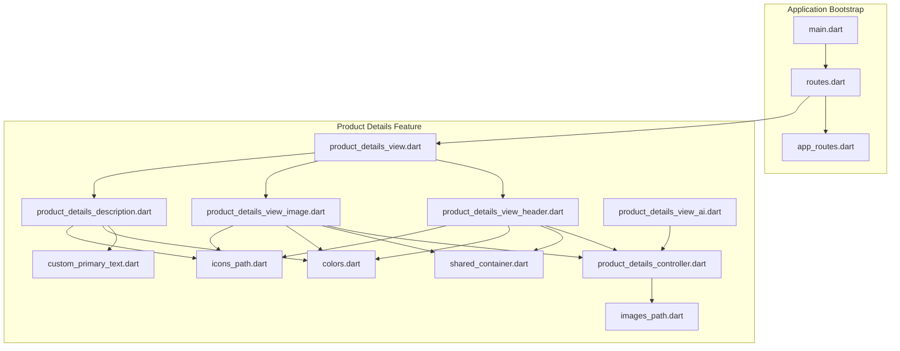
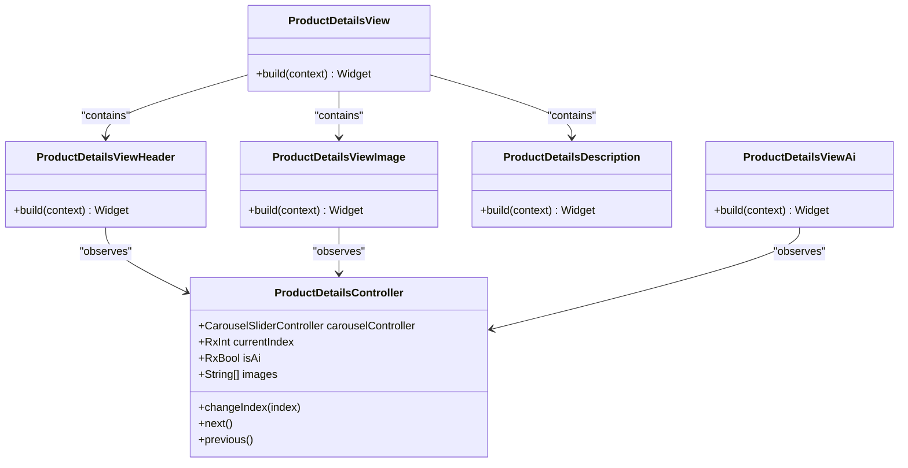
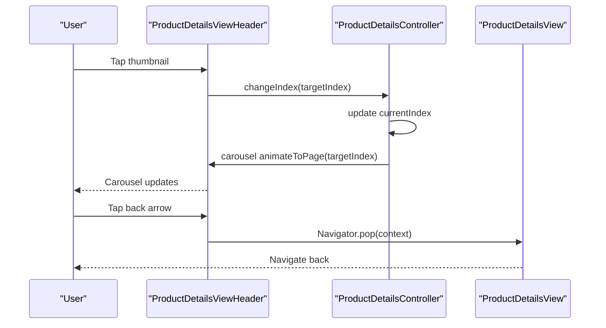
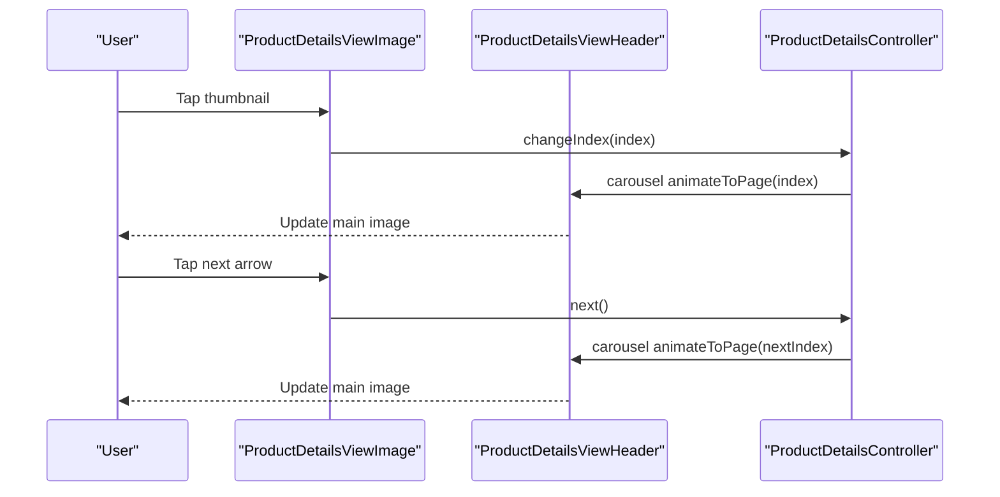
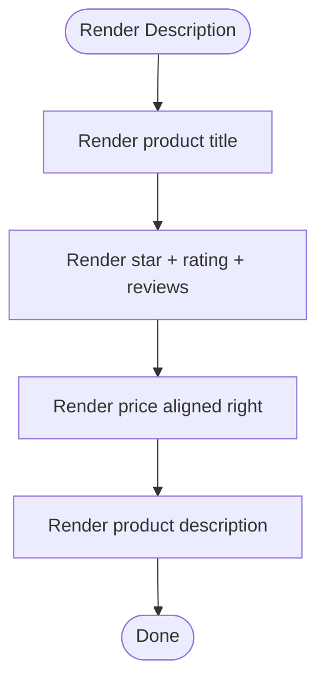
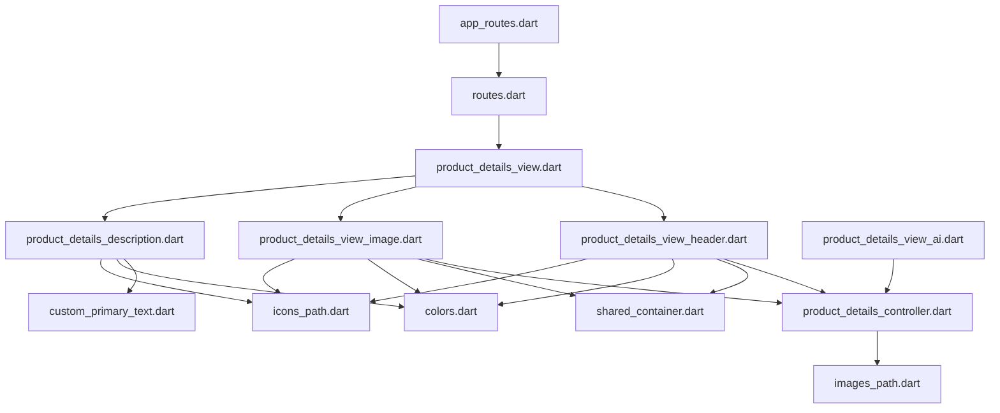

# Product Details and Information

<cite>
**Referenced Files in This Document**
- [main.dart](file://lib/main.dart)
- [app_routes.dart](file://lib/core/routes/app_routes.dart)
- [routes.dart](file://lib/core/routes/routes.dart)
- [product_details_controller.dart](file://lib/features/product_details.dart/controller/product_details_controller.dart)
- [product_details_view.dart](file://lib/features/product_details.dart/views/product_details_view.dart)
- [product_details_view_header.dart](file://lib/features/product_details.dart/widgets/product_details_view_widgets/product_details_view_header.dart)
- [product_details_view_image.dart](file://lib/features/product_details.dart/widgets/product_details_view_widgets/product_details_view_image.dart)
- [product_details_description.dart](file://lib/features/product_details.dart/widgets/product_details_view_widgets/product_details_description.dart)
- [product_details_view_ai.dart](file://lib/features/product_details.dart/widgets/product_details_view_widgets/product_details_view_ai.dart)
- [shared_container.dart](file://lib/shared/widgets/shared_container.dart)
- [custom_primary_text.dart](file://lib/shared/widgets/custom_text/custom_primary_text.dart)
- [colors.dart](file://lib/core/constant/colors.dart)
- [icons_path.dart](file://lib/core/constant/icons_path.dart)
- [images_path.dart](file://lib/core/constant/images_path.dart)
</cite>

## Table of Contents
1. [Introduction](#introduction)
2. [Project Structure](#project-structure)
3. [Core Components](#core-components)
4. [Architecture Overview](#architecture-overview)
5. [Detailed Component Analysis](#detailed-component-analysis)
6. [Dependency Analysis](#dependency-analysis)
7. [Performance Considerations](#performance-considerations)
8. [Troubleshooting Guide](#troubleshooting-guide)
9. [Conclusion](#conclusion)

## Introduction
This document provides comprehensive documentation for the Product Details feature. It covers the controller implementation, image gallery functionality, and product information display. It also explains the view layout, user interaction patterns, responsive design considerations, and widget components such as product images, descriptions, pricing, and availability indicators. The document outlines integration with product data models, inventory tracking, stock validation, add-to-cart functionality, quantity selection, user feedback mechanisms, customization options, related product recommendations, and performance optimization for media loading.

## Project Structure
The Product Details feature is organized under the features directory with a dedicated controller, view, and widget components. Routing integrates the feature into the application via named routes and bindings.



**Diagram sources**
- [main.dart:12-47](file://lib/main.dart#L12-L47)
- [routes.dart:207-211](file://lib/core/routes/routes.dart#L207-L211)
- [app_routes.dart:32](file://lib/core/routes/app_routes.dart#L32)
- [product_details_controller.dart:1-36](file://lib/features/product_details.dart/controller/product_details_controller.dart#L1-L36)
- [product_details_view.dart:1-30](file://lib/features/product_details.dart/views/product_details_view.dart#L1-L30)
- [product_details_view_header.dart:1-118](file://lib/features/product_details.dart/widgets/product_details_view_widgets/product_details_view_header.dart#L1-L118)
- [product_details_view_image.dart:1-91](file://lib/features/product_details.dart/widgets/product_details_view_widgets/product_details_view_image.dart#L1-L91)
- [product_details_description.dart:1-79](file://lib/features/product_details.dart/widgets/product_details_view_widgets/product_details_description.dart#L1-L79)
- [product_details_view_ai.dart:1-75](file://lib/features/product_details.dart/widgets/product_details_view_widgets/product_details_view_ai.dart#L1-L75)
- [shared_container.dart](file://lib/shared/widgets/shared_container.dart)
- [custom_primary_text.dart](file://lib/shared/widgets/custom_text/custom_primary_text.dart)
- [colors.dart](file://lib/core/constant/colors.dart)
- [icons_path.dart](file://lib/core/constant/icons_path.dart)
- [images_path.dart](file://lib/core/constant/images_path.dart)

**Section sources**
- [main.dart:12-47](file://lib/main.dart#L12-L47)
- [routes.dart:207-211](file://lib/core/routes/routes.dart#L207-L211)
- [app_routes.dart:32](file://lib/core/routes/app_routes.dart#L32)

## Core Components
- ProductDetailsController: Manages carousel slider state, current index, and navigation actions (next/previous/change index). It holds a list of image paths and exposes reactive properties for UI updates.
- ProductDetailsView: The main screen composed of a header (image carousel and controls), a small thumbnail gallery, and a description section.
- ProductDetailsViewHeader: Implements the full-width image carousel, pagination indicators, back and favorite buttons, and an AI toggle chip positioned at the bottom-left.
- ProductDetailsViewImage: Provides a horizontal row of thumbnails with previous/next navigation arrows and tap-to-change-index behavior.
- ProductDetailsDescription: Displays product title, rating, review count, price, and description text.
- ProductDetailsViewAi: Toggleable chip that switches between an icon and a label indicating AI placement capability.

**Section sources**
- [product_details_controller.dart:1-36](file://lib/features/product_details.dart/controller/product_details_controller.dart#L1-L36)
- [product_details_view.dart:1-30](file://lib/features/product_details.dart/views/product_details_view.dart#L1-L30)
- [product_details_view_header.dart:1-118](file://lib/features/product_details.dart/widgets/product_details_view_widgets/product_details_view_header.dart#L1-L118)
- [product_details_view_image.dart:1-91](file://lib/features/product_details.dart/widgets/product_details_view_widgets/product_details_view_image.dart#L1-L91)
- [product_details_description.dart:1-79](file://lib/features/product_details.dart/widgets/product_details_view_widgets/product_details_description.dart#L1-L79)
- [product_details_view_ai.dart:1-75](file://lib/features/product_details.dart/widgets/product_details_view_widgets/product_details_view_ai.dart#L1-L75)

## Architecture Overview
The Product Details feature follows a reactive architecture using GetX for state management and routing. The controller encapsulates UI state and actions, while widgets observe reactive values. The view composes multiple specialized widgets to render the product details layout.



**Diagram sources**
- [product_details_controller.dart:5-35](file://lib/features/product_details.dart/controller/product_details_controller.dart#L5-L35)
- [product_details_view.dart:8-29](file://lib/features/product_details.dart/views/product_details_view.dart#L8-L29)
- [product_details_view_header.dart:11-91](file://lib/features/product_details.dart/widgets/product_details_view_widgets/product_details_view_header.dart#L11-L91)
- [product_details_view_image.dart:9-90](file://lib/features/product_details.dart/widgets/product_details_view_widgets/product_details_view_image.dart#L9-L90)
- [product_details_description.dart:7-78](file://lib/features/product_details.dart/widgets/product_details_view_widgets/product_details_description.dart#L7-L78)
- [product_details_view_ai.dart:10-74](file://lib/features/product_details.dart/widgets/product_details_view_widgets/product_details_view_ai.dart#L10-L74)

## Detailed Component Analysis

### Product Details Controller
- Responsibilities:
  - Manage carousel slider controller instance.
  - Track current index and AI toggle state reactively.
  - Provide navigation helpers for moving between images.
  - Hold a list of image asset paths for rendering.
- Reactive state:
  - currentIndex: Tracks the active carousel item.
  - isAi: Controls the visibility of the AI chip label vs icon.
- Navigation:
  - changeIndex updates the current index and animates the carousel.
  - next moves forward if not at the last image.
  - previous moves backward if not at the first image.

```mermaid
flowchart TD
Start(["Controller Entry"]) --> Init["Initialize carouselController<br/>and images list"]
Init --> Observe["Observe currentIndex and isAi"]
Observe --> Action{"Action Triggered"}
Action --> |changeIndex(i)| SetIndex["Set currentIndex = i"]
SetIndex --> Animate["Animate carousel to page i"]
Action --> |next()| NextCheck{"At last image?"}
NextCheck --> |No| IncIndex["currentIndex += 1"]
IncIndex --> Animate
NextCheck --> |Yes| Idle["No-op"]
Action --> |previous()| PrevCheck{"At first image?"}
PrevCheck --> |No| DecIndex["currentIndex -= 1"]
DecIndex --> Animate
PrevCheck --> |Yes| Idle
Animate --> End(["Exit"])
Idle --> End
```

**Diagram sources**
- [product_details_controller.dart:6-34](file://lib/features/product_details.dart/controller/product_details_controller.dart#L6-L34)

**Section sources**
- [product_details_controller.dart:1-36](file://lib/features/product_details.dart/controller/product_details_controller.dart#L1-L36)

### Product Details View Layout and Interaction Patterns
- Layout composition:
  - Header: Full-width carousel with pagination dots and overlay buttons.
  - Thumbnails: Horizontal row of small images with previous/next arrows.
  - Description: Title, rating/reviews, price, and product description.
- Interaction patterns:
  - Tap thumbnails to jump to a specific image.
  - Swipe or use arrows to navigate images.
  - Back button navigates out of the product details screen.
  - Favorite button placeholder for saving items.
  - AI chip toggles between icon and label states.



**Diagram sources**
- [product_details_view_header.dart:34-38](file://lib/features/product_details.dart/widgets/product_details_view_widgets/product_details_view_header.dart#L34-L38)
- [product_details_view_header.dart:44-46](file://lib/features/product_details.dart/widgets/product_details_view_widgets/product_details_view_header.dart#L44-L46)
- [product_details_controller.dart:19-22](file://lib/features/product_details.dart/controller/product_details_controller.dart#L19-L22)

**Section sources**
- [product_details_view.dart:15-27](file://lib/features/product_details.dart/views/product_details_view.dart#L15-L27)
- [product_details_view_header.dart:17-91](file://lib/features/product_details.dart/widgets/product_details_view_widgets/product_details_view_header.dart#L17-L91)
- [product_details_view_image.dart:15-62](file://lib/features/product_details.dart/widgets/product_details_view_widgets/product_details_view_image.dart#L15-L62)

### Image Gallery Functionality
- Full-width carousel:
  - Uses a builder to render each image asset.
  - Updates the current index on page change.
  - Displays pagination dots aligned at the bottom center.
- Thumbnail gallery:
  - Horizontal list of small images.
  - Tap to change the main carousel index.
  - Previous/next arrows to navigate images.



**Diagram sources**
- [product_details_view_image.dart:33-34](file://lib/features/product_details.dart/widgets/product_details_view_widgets/product_details_view_image.dart#L33-L34)
- [product_details_controller.dart:24-27](file://lib/features/product_details.dart/controller/product_details_controller.dart#L24-L27)
- [product_details_view_header.dart:24-39](file://lib/features/product_details.dart/widgets/product_details_view_widgets/product_details_view_header.dart#L24-L39)

**Section sources**
- [product_details_view_header.dart:24-39](file://lib/features/product_details.dart/widgets/product_details_view_widgets/product_details_view_header.dart#L24-L39)
- [product_details_view_image.dart:28-51](file://lib/features/product_details.dart/widgets/product_details_view_widgets/product_details_view_image.dart#L28-L51)

### Product Information Display
- Title and rating:
  - Product title with ellipsis handling.
  - Star icon and rating value.
  - Review count next to rating.
- Pricing:
  - Price displayed prominently on the right side of the title block.
- Description:
  - Multi-line description with appropriate typography and color contrast.



**Diagram sources**
- [product_details_description.dart:28-73](file://lib/features/product_details.dart/widgets/product_details_view_widgets/product_details_description.dart#L28-L73)

**Section sources**
- [product_details_description.dart:10-78](file://lib/features/product_details.dart/widgets/product_details_view_widgets/product_details_description.dart#L10-L78)

### Responsive Design Considerations
- ScreenUtil scaling:
  - Width, height, and font sizes are scaled using ScreenUtil to adapt to various screen sizes.
- Dark/light theme awareness:
  - Colors adapt based on theme brightness for backgrounds, text, and icons.
- Flexible layouts:
  - Column and row layouts with flexible sizing and spacing.
  - Image assets scale with BoxFit.cover to fill containers.

**Section sources**
- [product_details_view.dart:13](file://lib/features/product_details.dart/views/product_details_view.dart#L13)
- [product_details_view_header.dart:16-21](file://lib/features/product_details.dart/widgets/product_details_view_widgets/product_details_view_header.dart#L16-L21)
- [product_details_view_image.dart:14-40](file://lib/features/product_details.dart/widgets/product_details_view_widgets/product_details_view_image.dart#L14-L40)
- [product_details_description.dart:12-73](file://lib/features/product_details.dart/widgets/product_details_view_widgets/product_details_description.dart#L12-L73)

### Widget Components
- SharedContainer:
  - Reusable container with rounded corners, optional gradients, and shadows.
  - Used extensively for buttons, chips, and image containers.
- CustomPrimaryText:
  - Typography wrapper for consistent text rendering across themes.
- Colors and Icons:
  - Centralized color and icon paths for unified theming and asset management.

**Section sources**
- [shared_container.dart](file://lib/shared/widgets/shared_container.dart)
- [custom_primary_text.dart](file://lib/shared/widgets/custom_text/custom_primary_text.dart)
- [colors.dart](file://lib/core/constant/colors.dart)
- [icons_path.dart](file://lib/core/constant/icons_path.dart)

### Integration with Product Data Models, Inventory Tracking, and Stock Validation
- Current state:
  - The controller maintains a static list of image paths and reactive state for UI updates.
- Recommended integration points:
  - Replace static images list with a product model containing image URLs and metadata.
  - Introduce inventory model with stock quantity and availability status.
  - Add stock validation logic in controller or repository layer before enabling add-to-cart actions.
  - Bind product details to a product repository for fetching and updating product information.

[No sources needed since this section provides general guidance]

### Add-to-Cart Functionality, Quantity Selection, and User Feedback
- Current state:
  - No explicit add-to-cart or quantity selection widgets are present in the current implementation.
- Recommended additions:
  - Add-to-cart button in the description area or a floating action button.
  - Quantity selector widget with increment/decrement controls.
  - User feedback via snackbars or dialogs upon successful add-to-cart or validation failures.
  - Integration with cart service/repository to persist selections.

[No sources needed since this section provides general guidance]

### Product Customization Options and Related Recommendations
- Customization:
  - Placeholder for customization options (e.g., color, material) can be added below the description.
- Related products:
  - A horizontal scrolling section of related items can be placed after the description.
  - Each item can link to its own product details route.

[No sources needed since this section provides general guidance]

## Dependency Analysis
The Product Details feature depends on routing, theming, and shared UI components. The controller depends on image assets and the carousel slider package.



**Diagram sources**
- [routes.dart:207-211](file://lib/core/routes/routes.dart#L207-L211)
- [app_routes.dart:32](file://lib/core/routes/app_routes.dart#L32)
- [product_details_view.dart:8-29](file://lib/features/product_details.dart/views/product_details_view.dart#L8-L29)
- [product_details_view_header.dart:11-91](file://lib/features/product_details.dart/widgets/product_details_view_widgets/product_details_view_header.dart#L11-L91)
- [product_details_view_image.dart:9-90](file://lib/features/product_details.dart/widgets/product_details_view_widgets/product_details_view_image.dart#L9-L90)
- [product_details_description.dart:7-78](file://lib/features/product_details.dart/widgets/product_details_view_widgets/product_details_description.dart#L7-L78)
- [product_details_view_ai.dart:10-74](file://lib/features/product_details.dart/widgets/product_details_view_widgets/product_details_view_ai.dart#L10-L74)
- [shared_container.dart](file://lib/shared/widgets/shared_container.dart)
- [custom_primary_text.dart](file://lib/shared/widgets/custom_text/custom_primary_text.dart)
- [colors.dart](file://lib/core/constant/colors.dart)
- [icons_path.dart](file://lib/core/constant/icons_path.dart)
- [images_path.dart](file://lib/core/constant/images_path.dart)

**Section sources**
- [routes.dart:207-211](file://lib/core/routes/routes.dart#L207-L211)
- [app_routes.dart:32](file://lib/core/routes/app_routes.dart#L32)

## Performance Considerations
- Media loading optimization:
  - Use efficient image caching and lazy loading for product images.
  - Prefer compressed assets and appropriate resolutions for different screen densities.
- Carousel performance:
  - Limit the number of visible slides and use virtualization where possible.
  - Debounce onPageChanged callbacks to avoid excessive rebuilds.
- Reactive updates:
  - Keep reactive state minimal and scoped to avoid unnecessary widget rebuilds.
- Theming and scaling:
  - Centralize color and icon assets to reduce duplication and improve maintainability.

[No sources needed since this section provides general guidance]

## Troubleshooting Guide
- Navigation issues:
  - Ensure the back button triggers Navigator.pop in the header widget.
- Image display problems:
  - Verify asset paths in the images constant and that assets are included in the pubspec.
- State synchronization:
  - Confirm that carousel onPageChanged updates the controller's currentIndex.
- UI responsiveness:
  - Check that ScreenUtil scaling is initialized in main and that widgets adapt to theme changes.

**Section sources**
- [product_details_view_header.dart:44-46](file://lib/features/product_details.dart/widgets/product_details_view_widgets/product_details_view_header.dart#L44-L46)
- [product_details_controller.dart:19-34](file://lib/features/product_details.dart/controller/product_details_controller.dart#L19-L34)
- [main.dart:26-44](file://lib/main.dart#L26-L44)

## Conclusion
The Product Details feature provides a modular, reactive foundation for displaying product information and managing image galleries. The current implementation focuses on UI composition and state management through GetX. Extending the feature to integrate with product models, inventory systems, and add-to-cart workflows will enable a complete shopping experience with robust user feedback and performance optimizations.