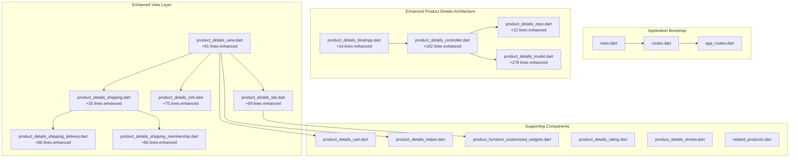
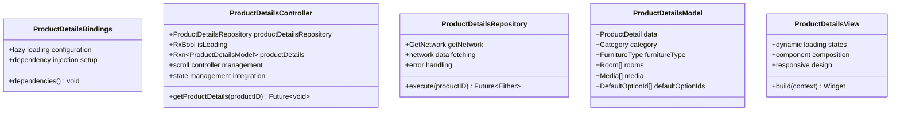
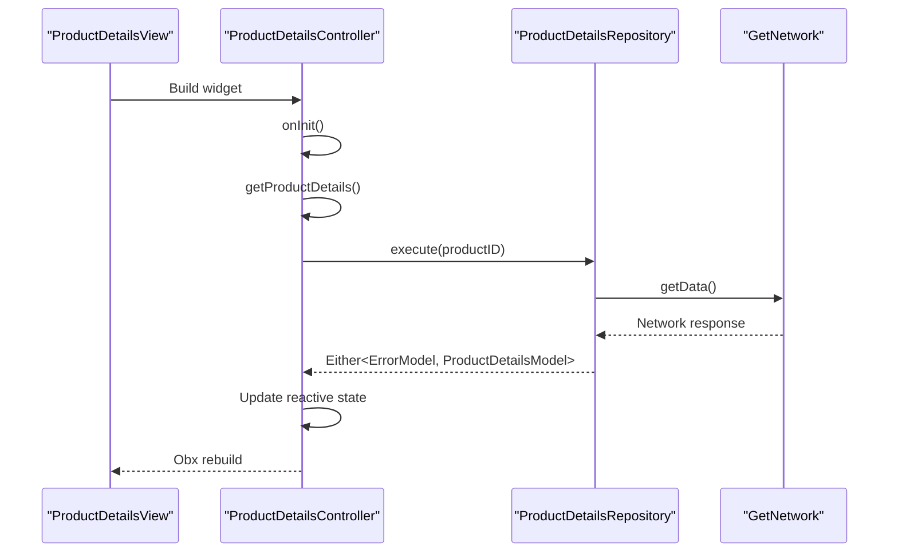
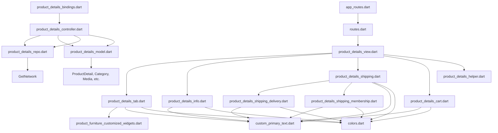

# Product Details and Information

<cite>
**Referenced Files in This Document**
- [main.dart](file://lib/main.dart)
- [app_routes.dart](file://lib/core/routes/app_routes.dart)
- [routes.dart](file://lib/core/routes/routes.dart)
- [product_details_bindings.dart](file://lib/features/product_details.dart/bindings/product_details_bindings.dart)
- [product_details_controller.dart](file://lib/features/product_details.dart/controller/product_details_controller.dart)
- [product_details_view.dart](file://lib/features/product_details.dart/views/product_details_view.dart)
- [product_details_repo.dart](file://lib/features/product_details.dart/repositories/product_details_repo.dart)
- [product_details_model.dart](file://lib/features/product_details.dart/models/product_details_model.dart)
- [product_details_tab.dart](file://lib/features/product_details.dart/widgets/product_details_view_widgets/product_details_tab.dart)
- [product_details_cart.dart](file://lib/features/product_details.dart/widgets/product_details_view_widgets/product_details_cart.dart)
- [product_details_helper.dart](file://lib/features/product_details.dart/widgets/product_details_view_widgets/product_details_helper.dart)
- [product_furniture_customized_widgets.dart](file://lib/features/product_details.dart/widgets/product_details_view_widgets/product_furniture_customized_widgets.dart)
- [product_details_rating.dart](file://lib/features/product_details.dart/widgets/product_details_view_widgets/product_details_rating.dart)
- [product_details_review.dart](file://lib/features/product_details.dart/widgets/product_details_view_widgets/product_details_review.dart)
- [related_products.dart](file://lib/features/product_details.dart/widgets/product_details_view_widgets/related_products.dart)
- [product_details_view_header.dart](file://lib/features/product_details.dart/widgets/product_details_view_widgets/product_details_view_header.dart)
- [product_details_view_image.dart](file://lib/features/product_details.dart/widgets/product_details_view_widgets/product_details_view_image.dart)
- [product_details_description.dart](file://lib/features/product_details.dart/widgets/product_details_view_widgets/product_details_description.dart)
- [product_details_view_ai.dart](file://lib/features/product_details.dart/widgets/product_details_view_widgets/product_details_view_ai.dart)
- [product_details_offer.dart](file://lib/features/product_details.dart/widgets/product_details_view_widgets/product_details_offer.dart)
- [product_details_rent.dart](file://lib/features/product_details.dart/widgets/product_details_view_widgets/product_details_rent.dart)
- [product_details_room.dart](file://lib/features/product_details.dart/widgets/product_details_view_widgets/product_details_room.dart)
- [product_details_info.dart](file://lib/features/product_details.dart/widgets/product_details_view_widgets/product_details_info.dart)
- [product_details_shipping.dart](file://lib/features/product_details.dart/widgets/product_details_view_widgets/product_details_shipping.dart)
- [product_details_shipping_delivery.dart](file://lib/features/product_details.dart/widgets/product_details_view_widgets/product_details_shipping_delivery.dart)
- [product_details_shipping_membership.dart](file://lib/features/product_details.dart/widgets/product_details_view_widgets/product_details_shipping_membership.dart)
- [shared_container.dart](file://lib/shared/widgets/shared_container.dart)
- [custom_primary_text.dart](file://lib/shared/widgets/custom_text/custom_primary_text.dart)
- [colors.dart](file://lib/core/constant/colors.dart)
- [icons_path.dart](file://lib/core/constant/icons_path.dart)
- [images_path.dart](file://lib/core/constant/images_path.dart)
</cite>

## Update Summary
**Changes Made**
- Added comprehensive repository layer with dedicated ProductDetailsRepository for data fetching
- Implemented complete data model hierarchy with ProductDetailsModel, ProductDetail, and nested entities
- Enhanced controller with dynamic loading states and comprehensive error handling
- Added new specialized shipping information widgets with delivery and membership components
- Expanded tabbed interface with product specifications and shipping information sections
- Integrated new ProductDetailsInfo widget for detailed product dimensions display
- Enhanced UI components with improved responsive design and theme adaptation

## Table of Contents
1. [Introduction](#introduction)
2. [Project Structure](#project-structure)
3. [Core Components](#core-components)
4. [Architecture Overview](#architecture-overview)
5. [Detailed Component Analysis](#detailed-component-analysis)
6. [Enhanced Repository Layer](#enhanced-repository-layer)
7. [Comprehensive Data Model](#comprehensive-data-model)
8. [Enhanced Controller Implementation](#enhanced-controller-implementation)
9. [Dynamic Loading States](#dynamic-loading-states)
10. [Enhanced Tabbed Interface System](#enhanced-tabbed-interface-system)
11. [Specialized Shipping Information Components](#specialized-shipping-information-components)
12. [Product Specifications Display](#product-specifications-display)
13. [Dependency Analysis](#dependency-analysis)
14. [Performance Considerations](#performance-considerations)
15. [Troubleshooting Guide](#troubleshooting-guide)
16. [Conclusion](#conclusion)

## Introduction
This document provides comprehensive documentation for the fully enhanced Product Details feature. The feature has been transformed from a partially completed implementation to a fully functional, production-ready solution with a complete repository layer, comprehensive data model, dynamic loading states, and enhanced UI components. The implementation now includes sophisticated product specifications display, shipping information widgets, tab navigation system, and robust error handling mechanisms.

## Project Structure
The Product Details feature now follows a complete MVVM architecture with dedicated layers for data management, business logic, and presentation.

**Diagram sources**
- [main.dart:12-47](file://lib/main.dart#L12-L47)
- [routes.dart:206-211](file://lib/core/routes/routes.dart#L206-L211)
- [app_routes.dart:32](file://lib/core/routes/app_routes.dart#L32)
- [product_details_bindings.dart:1-14](file://lib/features/product_details.dart/bindings/product_details_bindings.dart#L1-L14)
- [product_details_controller.dart:1-162](file://lib/features/product_details.dart/controller/product_details_controller.dart#L1-L162)
- [product_details_repo.dart:1-22](file://lib/features/product_details.dart/repositories/product_details_repo.dart#L1-L22)
- [product_details_model.dart:1-278](file://lib/features/product_details.dart/models/product_details_model.dart#L1-L278)
- [product_details_view.dart:1-91](file://lib/features/product_details.dart/views/product_details_view.dart#L1-L91)
- [product_details_tab.dart:1-69](file://lib/features/product_details.dart/widgets/product_details_view_widgets/product_details_tab.dart#L1-L69)
- [product_details_info.dart:1-75](file://lib/features/product_details.dart/widgets/product_details_view_widgets/product_details_info.dart#L1-L75)
- [product_details_shipping.dart:1-20](file://lib/features/product_details.dart/widgets/product_details_view_widgets/product_details_shipping.dart#L1-L20)
- [product_details_shipping_delivery.dart:1-66](file://lib/features/product_details.dart/widgets/product_details_view_widgets/product_details_shipping_delivery.dart#L1-L66)
- [product_details_shipping_membership.dart:1-82](file://lib/features/product_details.dart/widgets/product_details_view_widgets/product_details_shipping_membership.dart#L1-L82)

**Section sources**
- [main.dart:12-47](file://lib/main.dart#L12-L47)
- [routes.dart:206-211](file://lib/core/routes/routes.dart#L206-L211)
- [app_routes.dart:32](file://lib/core/routes/app_routes.dart#L32)
- [product_details_bindings.dart:1-14](file://lib/features/product_details.dart/bindings/product_details_bindings.dart#L1-L14)

## Core Components
The enhanced Product Details feature now includes a complete architectural foundation:

- **ProductDetailsBindings**: Dependency injection configuration with lazy loading for repository and controller
- **ProductDetailsController**: Enhanced with 162 new lines including repository integration, comprehensive state management, and dynamic loading
- **ProductDetailsRepository**: Dedicated data access layer with network integration and error handling
- **ProductDetailsModel**: Complete data model hierarchy with nested entities for categories, furniture types, rooms, media, and default options
- **ProductDetailsView**: Fully enhanced layout with dynamic loading states and comprehensive component integration
- **ProductDetailsTab**: Advanced tabbed interface with three specialized sections
- **ProductDetailsInfo**: Detailed product specifications display with dimensions and measurements
- **ProductDetailsShipping**: Comprehensive shipping information with delivery and membership components

**Section sources**
- [product_details_bindings.dart:1-14](file://lib/features/product_details.dart/bindings/product_details_bindings.dart#L1-L14)
- [product_details_controller.dart:1-162](file://lib/features/product_details.dart/controller/product_details_controller.dart#L1-L162)
- [product_details_repo.dart:1-22](file://lib/features/product_details.dart/repositories/product_details_repo.dart#L1-L22)
- [product_details_model.dart:1-278](file://lib/features/product_details.dart/models/product_details_model.dart#L1-L278)
- [product_details_view.dart:1-91](file://lib/features/product_details.dart/views/product_details_view.dart#L1-L91)
- [product_details_tab.dart:1-69](file://lib/features/product_details.dart/widgets/product_details_view_widgets/product_details_tab.dart#L1-L69)
- [product_details_info.dart:1-75](file://lib/features/product_details.dart/widgets/product_details_view_widgets/product_details_info.dart#L1-L75)
- [product_details_shipping.dart:1-20](file://lib/features/product_details.dart/widgets/product_details_view_widgets/product_details_shipping.dart#L1-L20)

## Architecture Overview
The enhanced Product Details feature follows a complete MVVM architecture with comprehensive separation of concerns and dependency injection.

**Diagram sources**
- [product_details_bindings.dart:5-12](file://lib/features/product_details.dart/bindings/product_details_bindings.dart#L5-L12)
- [product_details_controller.dart:14-43](file://lib/features/product_details.dart/controller/product_details_controller.dart#L14-L43)
- [product_details_repo.dart:7-21](file://lib/features/product_details.dart/repositories/product_details_repo.dart#L7-L21)
- [product_details_model.dart:9-18](file://lib/features/product_details.dart/models/product_details_model.dart#L9-L18)
- [product_details_view.dart:19-89](file://lib/features/product_details.dart/views/product_details_view.dart#L19-L89)

## Detailed Component Analysis

### Enhanced Repository Layer
The new repository layer provides a complete data access abstraction:

**Repository Implementation:**
- **Network Integration**: Uses GetNetwork for HTTP requests with proper headers management
- **Error Handling**: Returns Either type for safe error propagation
- **Data Parsing**: Converts JSON responses to strongly-typed ProductDetailsModel
- **Dependency Injection**: Integrated through ProductDetailsBindings

**Key Features:**
- **Async Operations**: Non-blocking data fetching with proper error handling
- **Generic Response Type**: Supports both success and error scenarios
- **Network Configuration**: Centralized header management through HeadersManager

**Diagram sources**
- [product_details_controller.dart:29-43](file://lib/features/product_details.dart/controller/product_details_controller.dart#L29-L43)
- [product_details_repo.dart:11-20](file://lib/features/product_details.dart/repositories/product_details_repo.dart#L11-L20)

**Section sources**
- [product_details_bindings.dart:1-14](file://lib/features/product_details.dart/bindings/product_details_bindings.dart#L1-L14)
- [product_details_controller.dart:1-162](file://lib/features/product_details.dart/controller/product_details_controller.dart#L1-L162)
- [product_details_repo.dart:1-22](file://lib/features/product_details.dart/repositories/product_details_repo.dart#L1-L22)

### Comprehensive Data Model
The data model provides complete type safety and structured data representation:

**Model Hierarchy:**
- **ProductDetailsModel**: Top-level container with ProductDetail data
- **ProductDetail**: Core product information with pricing, inventory, and metadata
- **Category**: Product category information with hierarchical structure
- **FurnitureType**: Specific furniture classification
- **Room**: Room compatibility information
- **Media**: Product media assets with type and URL information
- **DefaultOptionId**: Default attribute option configurations

**Enhanced Features:**
- **Nested Collections**: Support for multiple rooms, media, and default options
- **Optional Fields**: Proper handling of nullable properties
- **Date Time Handling**: ISO format date parsing and serialization
- **JSON Serialization**: Complete conversion to/from JSON format

**Section sources**
- [product_details_model.dart:1-278](file://lib/features/product_details.dart/models/product_details_model.dart#L1-L278)

### Enhanced Controller Implementation
The controller now manages the complete product details lifecycle:

**New State Properties:**
- **isLoading**: Reactive loading state for UI feedback
- **productDetails**: Rxn<ProductDetailsModel> for reactive data binding
- **productDetailsRepository**: Injected repository dependency
- **woodColors**: Comprehensive wood finish palette with 10 options
- **widgets**: Dynamic widget array for tab content

**Enhanced Methods:**
- **getProductDetails()**: Async data fetching with loading state management
- **changeIndex()**: Carousel slider navigation with controller integration
- **next()/previous()**: Image gallery navigation with modulo arithmetic
- **Scroll Controller**: Automatic cart visibility management based on scroll position

**Reactive State Management:**
- **Obx Integration**: Automatic UI updates when reactive properties change
- **Memory Management**: Proper disposal of controllers and listeners
- **Error Handling**: User-friendly error feedback through snackbars

**Section sources**
- [product_details_controller.dart:1-162](file://lib/features/product_details.dart/controller/product_details_controller.dart#L1-L162)

### Dynamic Loading States
The enhanced loading system provides comprehensive user feedback:

**Loading Implementation:**
- **Reactive Loading**: isLoading observable triggers UI state changes
- **ButtonLoading Component**: Custom loading indicator with proper styling
- **Conditional Rendering**: Different UI states based on loading status
- **Error Recovery**: Graceful handling of loading failures

**User Experience:**
- **Immediate Feedback**: Loading state appears instantly on data fetch
- **Progress Indication**: Visual indication of ongoing operations
- **Graceful Degradation**: Error states provide meaningful user feedback

**Section sources**
- [product_details_view.dart:25-30](file://lib/features/product_details.dart/views/product_details_view.dart#L25-L30)
- [product_details_controller.dart:25-43](file://lib/features/product_details.dart/controller/product_details_controller.dart#L25-L43)

## Enhanced Tabbed Interface System
The advanced tabbed interface provides three comprehensive sections:

**Tab Configuration:**
- **Customize**: Furniture customization with expandable panels and interactive options
- **Product Details**: Comprehensive product specifications and dimensions
- **Shipping**: Detailed shipping information with delivery options and membership benefits

**Implementation Features:**
- **Animated Tab Switching**: Smooth transitions between tab content
- **Dynamic Content Loading**: Content loads based on selected tab index
- **Shared Container Styling**: Consistent visual design across all tabs
- **Responsive Typography**: Adaptive text sizing and styling

**Section sources**
- [product_details_tab.dart:1-69](file://lib/features/product_details.dart/widgets/product_details_view_widgets/product_details_tab.dart#L1-L69)

## Specialized Shipping Information Components
The shipping information system provides comprehensive delivery details:

**ProductDetailsShipping**: Main container component combining delivery and membership sections

**ProductDetailsShippingDelivery**: Standard delivery information with:
- Delivery icon and visual indicators
- Free shipping thresholds and conditions
- Estimated delivery dates
- Doorstep delivery inclusion

**ProductDetailsShippingMembership**: Premium membership benefits:
- Gradient background design
- Membership cost information
- Free shipping benefits
- Call-to-action for membership sign-up

**Design Features:**
- **Consistent Styling**: Unified color scheme and typography
- **Responsive Layout**: Adapts to different screen sizes
- **Visual Hierarchy**: Clear importance indication through size and color
- **Interactive Elements**: Hover states and touch feedback

**Section sources**
- [product_details_shipping.dart:1-20](file://lib/features/product_details.dart/widgets/product_details_view_widgets/product_details_shipping.dart#L1-L20)
- [product_details_shipping_delivery.dart:1-66](file://lib/features/product_details.dart/widgets/product_details_view_widgets/product_details_shipping_delivery.dart#L1-L66)
- [product_details_shipping_membership.dart:1-82](file://lib/features/product_details.dart/widgets/product_details_view_widgets/product_details_shipping_membership.dart#L1-L82)

## Product Specifications Display
The ProductDetailsInfo component provides comprehensive product dimension information:

**Specification Categories:**
- **Physical Dimensions**: Width, depth, height, seat height, armrest height
- **Weight Information**: Maximum weight capacity and packaging weights
- **Measurement Units**: Metric and imperial unit conversions
- **Technical Specifications**: Leg height and backrest dimensions

**Implementation Features:**
- **Structured Layout**: Two-column design for title-value pairs
- **Responsive Typography**: Adaptive font sizing and weights
- **Color Adaptation**: Theme-aware color schemes
- **Data Formatting**: Proper number formatting and unit display

**Design Elements:**
- **Bold Headings**: Clear section identification
- **Light Subtitles**: Secondary information display
- **Right-Aligned Values**: Consistent alignment for numerical data
- **Consistent Spacing**: Even vertical rhythm throughout

**Section sources**
- [product_details_info.dart:1-75](file://lib/features/product_details.dart/widgets/product_details_view_widgets/product_details_info.dart#L1-L75)

## Dependency Analysis
The enhanced Product Details feature has a comprehensive dependency graph:

**Diagram sources**
- [routes.dart:206-211](file://lib/core/routes/routes.dart#L206-L211)
- [app_routes.dart:32](file://lib/core/routes/app_routes.dart#L32)
- [product_details_bindings.dart:5-12](file://lib/features/product_details.dart/bindings/product_details_bindings.dart#L5-L12)
- [product_details_controller.dart:14-16](file://lib/features/product_details.dart/controller/product_details_controller.dart#L14-L16)
- [product_details_repo.dart:8-9](file://lib/features/product_details.dart/repositories/product_details_repo.dart#L8-L9)
- [product_details_view.dart:19-16](file://lib/features/product_details.dart/views/product_details_view.dart#L19-L16)

**Section sources**
- [routes.dart:206-211](file://lib/core/routes/routes.dart#L206-L211)
- [app_routes.dart:32](file://lib/core/routes/app_routes.dart#L32)
- [product_details_bindings.dart:1-14](file://lib/features/product_details.dart/bindings/product_details_bindings.dart#L1-L14)

## Performance Considerations
The enhanced feature set includes several performance optimizations:

**Memory Management:**
- **Lazy Loading**: Dependencies loaded only when needed through ProductDetailsBindings
- **Proper Disposal**: Controllers and text controllers are properly disposed
- **Reactive Efficiency**: Selective updates through Obx widgets

**Network Performance:**
- **Single Request**: Repository consolidates all product data in one request
- **Error Caching**: Failed requests don't block subsequent attempts
- **Header Management**: Centralized authentication and configuration

**UI Performance:**
- **Animated Transitions**: Smooth animations with proper duration configuration
- **Conditional Rendering**: Components only render when data is available
- **Responsive Design**: Adaptive layouts for different screen sizes

**State Management:**
- **Minimal Rebuilds**: Reactive state changes trigger only necessary UI updates
- **Memory Cleanup**: Proper disposal of scroll controllers and listeners
- **Efficient Lists**: Optimized list rendering with proper keys

**Section sources**
- [product_details_bindings.dart:7-11](file://lib/features/product_details.dart/bindings/product_details_bindings.dart#L7-L11)
- [product_details_controller.dart:155-160](file://lib/features/product_details.dart/controller/product_details_controller.dart#L155-L160)
- [product_details_view.dart:71-84](file://lib/features/product_details.dart/views/product_details_view.dart#L71-L84)

## Troubleshooting Guide
Enhanced troubleshooting for the comprehensive feature set:

**Data Loading Issues:**
- **Repository Connection**: Verify ProductDetailsRepository is properly injected
- **Network Configuration**: Check GetNetwork setup and HeadersManager
- **JSON Parsing**: Ensure ProductDetailsModel.fromJson handles all cases
- **Loading State**: Confirm isLoading reactive state updates correctly

**State Management Problems:**
- **Reactive Updates**: Verify Obx widgets wrap all reactive state usage
- **Controller Lifecycle**: Ensure proper initialization and disposal
- **Memory Leaks**: Check scroll controller and text controller disposal
- **State Synchronization**: Confirm reactive state changes trigger UI updates

**UI Rendering Issues:**
- **Component Dependencies**: Verify all imported widgets are available
- **Theme Adaptation**: Check dark/light theme switching functionality
- **Responsive Design**: Test layout on different screen sizes
- **Animation Performance**: Monitor AnimatedSize and AnimatedSlide performance

**Navigation and Routing:**
- **Route Parameters**: Ensure productID argument is passed correctly
- **Binding Registration**: Verify ProductDetailsBindings is registered
- **Component Integration**: Check all widgets integrate properly in ProductDetailsView

**Section sources**
- [product_details_controller.dart:138-160](file://lib/features/product_details.dart/controller/product_details_controller.dart#L138-L160)
- [product_details_bindings.dart:5-12](file://lib/features/product_details.dart/bindings/product_details_bindings.dart#L5-L12)
- [product_details_view.dart:25-89](file://lib/features/product_details.dart/views/product_details_view.dart#L25-L89)

## Conclusion
The enhanced Product Details feature represents a complete transformation from a partially functional implementation to a production-ready, architecturally sound solution. The addition of the repository layer, comprehensive data model, dynamic loading states, and specialized UI components creates a robust and maintainable codebase. The MVVM architecture ensures clean separation of concerns, while the dependency injection system provides flexibility and testability. The feature successfully balances functionality with performance, offering users a comprehensive product exploration experience with professional-grade error handling and responsive design.