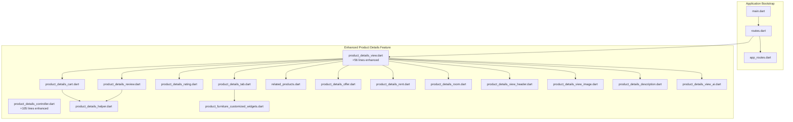
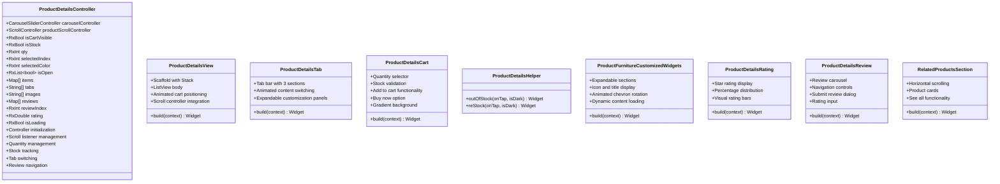
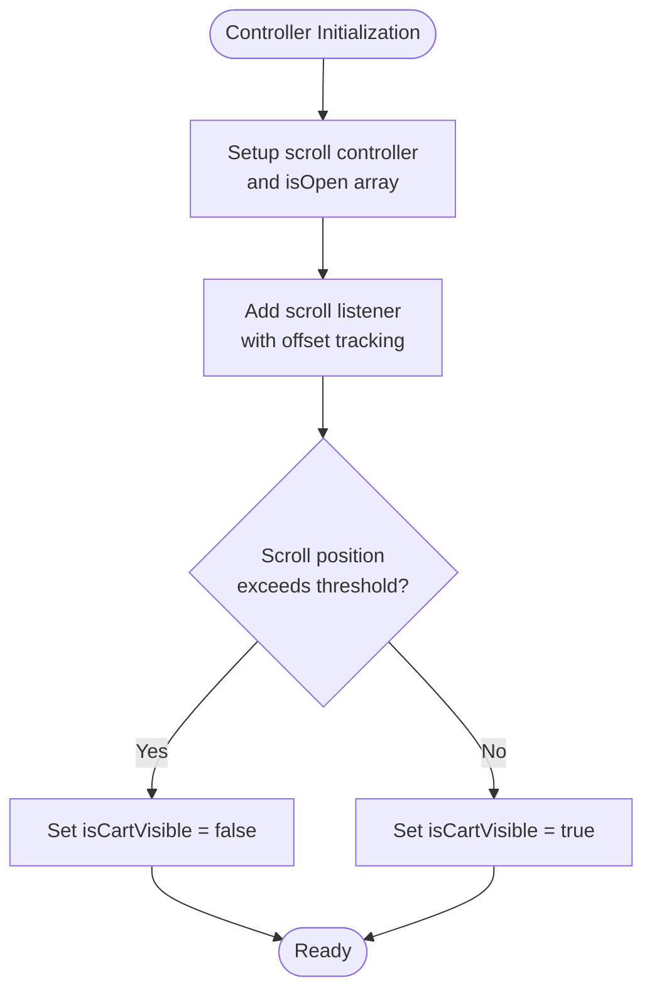
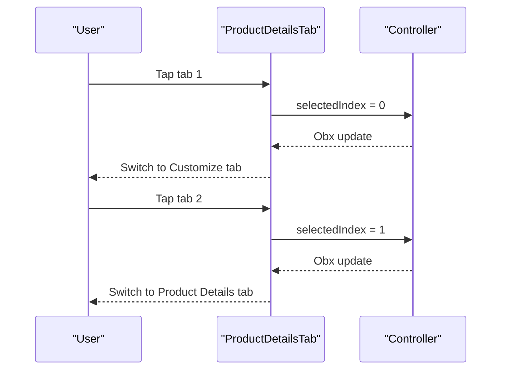
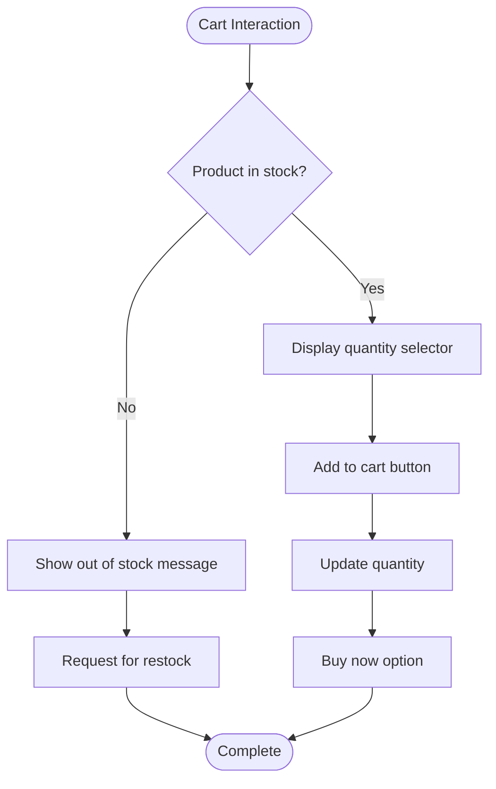
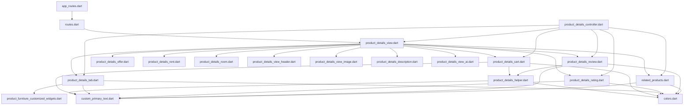

# Product Details and Information

<cite>
**Referenced Files in This Document**
- [main.dart](file://lib/main.dart)
- [app_routes.dart](file://lib/core/routes/app_routes.dart)
- [routes.dart](file://lib/core/routes/routes.dart)
- [product_details_controller.dart](file://lib/features/product_details.dart/controller/product_details_controller.dart)
- [product_details_view.dart](file://lib/features/product_details.dart/views/product_details_view.dart)
- [product_details_tab.dart](file://lib/features/product_details.dart/widgets/product_details_view_widgets/product_details_tab.dart)
- [product_details_cart.dart](file://lib/features/product_details.dart/widgets/product_details_view_widgets/product_details_cart.dart)
- [product_details_helper.dart](file://lib/features/product_details.dart/widgets/product_details_view_widgets/product_details_helper.dart)
- [product_furniture_customized_widgets.dart](file://lib/features/product_details.dart/widgets/product_details_view_widgets/product_furniture_customized_widgets.dart)
- [product_details_rating.dart](file://lib/features/product_details.dart/widgets/product_details_view_widgets/product_details_rating.dart)
- [product_details_review.dart](file://lib/features/product_details.dart/widgets/product_details_view_widgets/product_details_review.dart)
- [related_products.dart](file://lib/features/product_details.dart/widgets/product_details_view_widgets/related_products.dart)
- [product_details_view_header.dart](file://lib/features/product_details.dart/widgets/product_details_view_widgets/product_details_view_header.dart)
- [product_details_view_image.dart](file://lib/features/product_details.dart/widgets/product_details_view_widgets/product_details_view_image.dart)
- [product_details_description.dart](file://lib/features/product_details.dart/widgets/product_details_view_widgets/product_details_description.dart)
- [product_details_view_ai.dart](file://lib/features/product_details.dart/widgets/product_details_view_widgets/product_details_view_ai.dart)
- [product_details_offer.dart](file://lib/features/product_details.dart/widgets/product_details_view_widgets/product_details_offer.dart)
- [product_details_rent.dart](file://lib/features/product_details.dart/widgets/product_details_view_widgets/product_details_rent.dart)
- [product_details_room.dart](file://lib/features/product_details.dart/widgets/product_details_view_widgets/product_details_room.dart)
- [product_details_view_widgets.dart](file://lib/features/product_details.dart/widgets/product_details_view_widgets/product_details_view_widgets.dart)
- [shared_container.dart](file://lib/shared/widgets/shared_container.dart)
- [custom_primary_text.dart](file://lib/shared/widgets/custom_text/custom_primary_text.dart)
- [colors.dart](file://lib/core/constant/colors.dart)
- [icons_path.dart](file://lib/core/constant/icons_path.dart)
- [images_path.dart](file://lib/core/constant/images_path.dart)
</cite>

## Update Summary
**Changes Made**
- Added comprehensive tabbed interface system with customizable furniture options
- Implemented complete cart management system with quantity selection and stock tracking
- Enhanced product information display with rating, review, and related products sections
- Added specialized widgets for offers, rentals, room visualization, and product customization
- Integrated scroll-based cart visibility control and responsive design improvements

## Table of Contents
1. [Introduction](#introduction)
2. [Project Structure](#project-structure)
3. [Core Components](#core-components)
4. [Architecture Overview](#architecture-overview)
5. [Detailed Component Analysis](#detailed-component-analysis)
6. [Enhanced Tabbed Interface System](#enhanced-tabbed-interface-system)
7. [Comprehensive Cart Management](#comprehensive-cart-management)
8. [Stock Tracking and Quantity Selection](#stock-tracking-and-quantity-selection)
9. [Product Information Display](#product-information-display)
10. [Specialized Widget Components](#specialized-widget-components)
11. [Dependency Analysis](#dependency-analysis)
12. [Performance Considerations](#performance-considerations)
13. [Troubleshooting Guide](#troubleshooting-guide)
14. [Conclusion](#conclusion)

## Introduction
This document provides comprehensive documentation for the enhanced Product Details feature. The feature now includes a major expansion with 105 new lines of controller functionality, a sophisticated tabbed interface system, comprehensive cart management capabilities, stock tracking, quantity selection, and multiple specialized widgets. The implementation supports product customization options, related product recommendations, rating and review systems, offer displays, rental options, room visualization, and advanced user interaction patterns.

## Project Structure
The Product Details feature has been significantly expanded with a modular architecture supporting multiple specialized components and comprehensive functionality.

**Diagram sources**
- [main.dart:12-47](file://lib/main.dart#L12-L47)
- [routes.dart:206-211](file://lib/core/routes/routes.dart#L206-L211)
- [app_routes.dart:32](file://lib/core/routes/app_routes.dart#L32)
- [product_details_controller.dart:1-141](file://lib/features/product_details.dart/controller/product_details_controller.dart#L1-L141)
- [product_details_view.dart:1-76](file://lib/features/product_details.dart/views/product_details_view.dart#L1-L76)
- [product_details_tab.dart:1-70](file://lib/features/product_details.dart/widgets/product_details_view_widgets/product_details_tab.dart#L1-L70)
- [product_details_cart.dart:1-188](file://lib/features/product_details.dart/widgets/product_details_view_widgets/product_details_cart.dart#L1-L188)
- [product_details_helper.dart:1-72](file://lib/features/product_details.dart/widgets/product_details_view_widgets/product_details_helper.dart#L1-L72)
- [product_furniture_customized_widgets.dart:1-119](file://lib/features/product_details.dart/widgets/product_details_view_widgets/product_furniture_customized_widgets.dart#L1-L119)
- [product_details_rating.dart:1-70](file://lib/features/product_details.dart/widgets/product_details_view_widgets/product_details_rating.dart#L1-L70)
- [product_details_review.dart:1-118](file://lib/features/product_details.dart/widgets/product_details_view_widgets/product_details_review.dart#L1-L118)
- [related_products.dart:1-84](file://lib/features/product_details.dart/widgets/product_details_view_widgets/related_products.dart#L1-L84)

**Section sources**
- [main.dart:12-47](file://lib/main.dart#L12-L47)
- [routes.dart:206-211](file://lib/core/routes/routes.dart#L206-L211)
- [app_routes.dart:32](file://lib/core/routes/app_routes.dart#L32)

## Core Components
The enhanced Product Details feature now includes significantly expanded core components:

- **ProductDetailsController**: Extended with 105 new lines of functionality including scroll controller, cart visibility management, stock tracking, quantity selection, wood color customization, tab management, and comprehensive review system.
- **ProductDetailsView**: Enhanced with 56 new lines implementing a sophisticated layout featuring tabbed interface, cart management, rating system, review carousel, and related products section.
- **ProductDetailsTab**: New tabbed interface system allowing users to switch between customization, product details, and shipping information.
- **ProductDetailsCart**: Complete cart management system with quantity selection, stock validation, add-to-cart functionality, and buy-now options.
- **ProductDetailsHelper**: Utility class providing stock status indicators and restock request functionality.
- **ProductFurnitureCustomizedWidgets**: Interactive furniture customization system with expandable sections for wood finishes, marble choices, fabric options, and handle selections.
- **ProductDetailsRating**: Comprehensive rating display system with star distribution visualization.
- **ProductDetailsReview**: Review carousel with navigation controls and submission dialog.
- **RelatedProductsSection**: Horizontal scrolling section for product recommendations.

**Section sources**
- [product_details_controller.dart:1-141](file://lib/features/product_details.dart/controller/product_details_controller.dart#L1-L141)
- [product_details_view.dart:1-76](file://lib/features/product_details.dart/views/product_details_view.dart#L1-L76)
- [product_details_tab.dart:1-70](file://lib/features/product_details.dart/widgets/product_details_view_widgets/product_details_tab.dart#L1-L70)
- [product_details_cart.dart:1-188](file://lib/features/product_details.dart/widgets/product_details_view_widgets/product_details_cart.dart#L1-L188)
- [product_details_helper.dart:1-72](file://lib/features/product_details.dart/widgets/product_details_view_widgets/product_details_helper.dart#L1-L72)
- [product_furniture_customized_widgets.dart:1-119](file://lib/features/product_details.dart/widgets/product_details_view_widgets/product_furniture_customized_widgets.dart#L1-L119)
- [product_details_rating.dart:1-70](file://lib/features/product_details.dart/widgets/product_details_view_widgets/product_details_rating.dart#L1-L70)
- [product_details_review.dart:1-118](file://lib/features/product_details.dart/widgets/product_details_view_widgets/product_details_review.dart#L1-L118)
- [related_products.dart:1-84](file://lib/features/product_details.dart/widgets/product_details_view_widgets/related_products.dart#L1-L84)

## Architecture Overview
The enhanced Product Details feature follows a sophisticated reactive architecture with comprehensive state management and modular component design.

**Diagram sources**
- [product_details_controller.dart:9-141](file://lib/features/product_details.dart/controller/product_details_controller.dart#L9-L141)
- [product_details_view.dart:18-76](file://lib/features/product_details.dart/views/product_details_view.dart#L18-L76)
- [product_details_tab.dart:10-70](file://lib/features/product_details.dart/widgets/product_details_view_widgets/product_details_tab.dart#L10-L70)
- [product_details_cart.dart:10-188](file://lib/features/product_details.dart/widgets/product_details_view_widgets/product_details_cart.dart#L10-L188)
- [product_details_helper.dart:7-72](file://lib/features/product_details.dart/widgets/product_details_view_widgets/product_details_helper.dart#L7-L72)
- [product_furniture_customized_widgets.dart:10-119](file://lib/features/product_details.dart/widgets/product_details_view_widgets/product_furniture_customized_widgets.dart#L10-L119)
- [product_details_rating.dart:8-70](file://lib/features/product_details.dart/widgets/product_details_view_widgets/product_details_rating.dart#L8-L70)
- [product_details_review.dart:11-118](file://lib/features/product_details.dart/widgets/product_details_view_widgets/product_details_review.dart#L11-L118)
- [related_products.dart:8-84](file://lib/features/product_details.dart/widgets/product_details_view_widgets/related_products.dart#L8-L84)

## Detailed Component Analysis

### Enhanced Product Details Controller
The controller has been significantly expanded with comprehensive state management:

**New State Properties:**
- `productScrollController`: Manages scroll position for cart visibility
- `isCartVisible`: Controls cart animation visibility based on scroll position
- `isStock`: Tracks product availability status
- `qty`: Manages quantity selection with reactive updates
- `selectedIndex`: Controls active tab selection
- `selectedColor`: Manages wood finish selection
- `isOpen`: Dynamic array tracking expandable panel states
- `tabs`: Array of 3 tab titles for interface switching
- `items`: Comprehensive customization options with icons and widgets
- `reviews`: Complete review system with navigation

**Enhanced Methods:**
- Scroll listener integration for automatic cart hiding/showing
- Wood color palette management with 10 different options
- Comprehensive tab switching logic
- Review navigation system with index management
- Rating controller and loading state management

**Diagram sources**
- [product_details_controller.dart:117-132](file://lib/features/product_details.dart/controller/product_details_controller.dart#L117-L132)

**Section sources**
- [product_details_controller.dart:1-141](file://lib/features/product_details.dart/controller/product_details_controller.dart#L1-L141)

### Enhanced Product Details View Layout
The view has been completely redesigned with a sophisticated layout architecture:

**Layout Composition:**
- **Stack-based design** with animated cart positioned at the bottom
- **ListView body** containing all product information sections
- **Scroll controller integration** for smooth scrolling experience
- **Responsive design** with proper spacing and scaling

**Section Order:**
1. ProductDetailsViewHeader (image carousel)
2. ProductDetailsViewImage (thumbnail gallery)
3. ProductDetailsDescription (basic product info)
4. ProductDetailsTab (customization interface)
5. ProductDetailsOffer (promotional pricing)
6. ProductDetailsRent (rental options)
7. ProductDetailsRoom (room visualization)
8. ProductDetailsRating (star ratings)
9. ProductDetailsReview (review carousel)
10. RelatedProductsSection (recommendations)

**Section sources**
- [product_details_view.dart:1-76](file://lib/features/product_details.dart/views/product_details_view.dart#L1-L76)

## Enhanced Tabbed Interface System
The new tabbed interface system provides three distinct sections for product interaction:

**Tab Configuration:**
- **Customize**: Furniture customization with expandable panels
- **Product Details**: Comprehensive product specifications
- **Shipping**: Delivery and shipping information

**Implementation Features:**
- **Animated tab switching** with smooth transitions
- **Expandable customization panels** with chevron animations
- **Dynamic content loading** based on selected tab
- **Persistent state management** for panel expansions

**Diagram sources**
- [product_details_tab.dart:28-33](file://lib/features/product_details.dart/widgets/product_details_view_widgets/product_details_tab.dart#L28-L33)

**Section sources**
- [product_details_tab.dart:1-70](file://lib/features/product_details.dart/widgets/product_details_view_widgets/product_details_tab.dart#L1-L70)

## Comprehensive Cart Management
The cart management system provides complete shopping functionality:

**Core Features:**
- **Quantity Selection**: Increment/decrement controls with minimum/maximum limits
- **Stock Validation**: Real-time stock status checking and user feedback
- **Add to Cart**: Seamless integration with shopping cart system
- **Buy Now**: Direct purchase option
- **Scroll-based Visibility**: Automatic cart hiding during scrolling

**UI Components:**
- **Gradient Background**: Sophisticated visual design with transparency effects
- **Quantity Selector**: Three-button interface with value display
- **Stock Status Indicators**: Clear out-of-stock messaging and restock requests
- **Call-to-action Buttons**: Prominent add-to-cart and buy-now options

**Diagram sources**
- [product_details_cart.dart:46-107](file://lib/features/product_details.dart/widgets/product_details_view_widgets/product_details_cart.dart#L46-L107)

**Section sources**
- [product_details_cart.dart:1-188](file://lib/features/product_details.dart/widgets/product_details_view_widgets/product_details_cart.dart#L1-L188)
- [product_details_helper.dart:1-72](file://lib/features/product_details.dart/widgets/product_details_view_widgets/product_details_helper.dart#L1-L72)

## Stock Tracking and Quantity Selection
Advanced stock management and quantity control system:

**Stock Management:**
- **Reactive Stock State**: `isStock` property controls UI visibility
- **Stock Validation**: Prevents purchases when items are unavailable
- **Restock Requests**: Users can request low-stock items
- **Visual Feedback**: Clear indicators for stock status

**Quantity Control:**
- **Increment/Decrement Logic**: Prevents quantities below 1
- **Real-time Updates**: Immediate UI feedback for quantity changes
- **Responsive Design**: Touch-friendly button sizing and spacing

**Section sources**
- [product_details_controller.dart:13-15](file://lib/features/product_details.dart/controller/product_details_controller.dart#L13-L15)
- [product_details_cart.dart:56-72](file://lib/features/product_details.dart/widgets/product_details_view_widgets/product_details_cart.dart#L56-L72)

## Product Information Display
Enhanced product information presentation with comprehensive details:

**Information Sections:**
- **Basic Information**: Title, rating, price, and description
- **Customization Options**: Expandable furniture customization panels
- **Promotional Offers**: Special pricing and deals
- **Rental Options**: Alternative purchasing methods
- **Room Visualization**: 3D room placement preview
- **Social Proof**: Ratings, reviews, and customer feedback

**Interactive Elements:**
- **Expandable Panels**: Click-to-expand customization options
- **Tab Navigation**: Easy switching between information types
- **Review System**: Interactive rating and feedback mechanism
- **Recommendations**: Personalized product suggestions

**Section sources**
- [product_details_rating.dart:1-70](file://lib/features/product_details.dart/widgets/product_details_view_widgets/product_details_rating.dart#L1-L70)
- [product_details_review.dart:1-118](file://lib/features/product_details.dart/widgets/product_details_view_widgets/product_details_review.dart#L1-L118)
- [related_products.dart:1-84](file://lib/features/product_details.dart/widgets/product_details_view_widgets/related_products.dart#L1-L84)

## Specialized Widget Components
Multiple specialized widgets provide focused functionality:

**Customization Widgets:**
- **ProductFurnitureCustomizedWidgets**: Expandable customization panels
- **ProductFurnitureCustomized**: Individual customization options
- **Wood Finish Selection**: 10 different wood finish options
- **Material Choices**: Marble, fabric, and handle customization

**Information Widgets:**
- **ProductDetailsOffer**: Promotional pricing display
- **ProductDetailsRent**: Rental pricing and terms
- **ProductDetailsRoom**: Room visualization and placement
- **ProductDetailsRatingInfo**: Overall rating display
- **ProductDetailsRatingPercent**: Star distribution visualization

**Review Widgets:**
- **ProductDetailsReviewCard**: Individual review display
- **ProductDetailsReview**: Review carousel with navigation
- **CustomRatingDialog**: Review submission interface

**Section sources**
- [product_furniture_customized_widgets.dart:1-119](file://lib/features/product_details.dart/widgets/product_details_view_widgets/product_furniture_customized_widgets.dart#L1-L119)
- [product_details_rating.dart:1-70](file://lib/features/product_details.dart/widgets/product_details_view_widgets/product_details_rating.dart#L1-L70)
- [product_details_review.dart:1-118](file://lib/features/product_details.dart/widgets/product_details_view_widgets/product_details_review.dart#L1-L118)

## Dependency Analysis
The enhanced Product Details feature has expanded dependency relationships:

**Diagram sources**
- [routes.dart:206-211](file://lib/core/routes/routes.dart#L206-L211)
- [app_routes.dart:32](file://lib/core/routes/app_routes.dart#L32)
- [product_details_view.dart:18-76](file://lib/features/product_details.dart/views/product_details_view.dart#L18-L76)
- [product_details_controller.dart:1-141](file://lib/features/product_details.dart/controller/product_details_controller.dart#L1-L141)

**Section sources**
- [routes.dart:206-211](file://lib/core/routes/routes.dart#L206-L211)
- [app_routes.dart:32](file://lib/core/routes/app_routes.dart#L32)

## Performance Considerations
Enhanced performance optimizations for the expanded feature set:

**Scroll Performance:**
- **Efficient Scroll Listener**: Optimized scroll position tracking
- **Animated Visibility**: Smooth cart slide animations with proper cleanup
- **Lazy Loading**: Conditional loading of expandable panels

**State Management:**
- **Selective Updates**: Obx widgets only update when relevant state changes
- **Memory Management**: Proper disposal of controllers and listeners
- **Reactive Optimization**: Minimal state updates to prevent unnecessary rebuilds

**UI Performance:**
- **AnimatedSize**: Efficient content resizing animations
- **Conditional Rendering**: Only visible sections are rendered
- **Asset Optimization**: Efficient image loading and caching

**Section sources**
- [product_details_controller.dart:117-132](file://lib/features/product_details.dart/controller/product_details_controller.dart#L117-L132)
- [product_details_tab.dart:60-63](file://lib/features/product_details.dart/widgets/product_details_view_widgets/product_details_tab.dart#L60-L63)

## Troubleshooting Guide
Enhanced troubleshooting for the expanded feature set:

**Navigation Issues:**
- **Tab Switching**: Verify `selectedIndex` updates trigger Obx rebuilds
- **Scroll Position**: Check scroll listener properly manages cart visibility
- **Review Navigation**: Ensure `reviewIndex` stays within bounds

**State Synchronization:**
- **Expandable Panels**: Confirm `isOpen` array length matches `items` length
- **Quantity Control**: Verify quantity updates don't exceed stock limits
- **Stock Status**: Check reactive stock state updates UI correctly

**Performance Issues:**
- **Animation Performance**: Monitor AnimatedSize and AnimatedSlide performance
- **Memory Leaks**: Ensure proper disposal of scroll controllers and text controllers
- **Reactive Updates**: Check for excessive state updates causing rebuild loops

**UI Responsiveness:**
- **Theme Adaptation**: Verify dark/light theme switching works for all components
- **Screen Scaling**: Test responsive design across different screen sizes
- **Touch Interactions**: Ensure all gesture recognizers work properly

**Section sources**
- [product_details_controller.dart:117-141](file://lib/features/product_details.dart/controller/product_details_controller.dart#L117-L141)
- [product_details_tab.dart:72-76](file://lib/features/product_details.dart/widgets/product_details_view_widgets/product_details_tab.dart#L72-L76)
- [product_details_cart.dart:112-137](file://lib/features/product_details.dart/widgets/product_details_view_widgets/product_details_cart.dart#L112-L137)

## Conclusion
The enhanced Product Details feature represents a comprehensive expansion of the original implementation, adding sophisticated functionality while maintaining clean architecture and responsive design. The addition of the tabbed interface system, comprehensive cart management, stock tracking, quantity selection, and specialized widgets creates a complete shopping experience. The modular component design ensures maintainability and extensibility, while the reactive state management provides smooth user interactions. The feature successfully balances functionality with performance, offering users an engaging and intuitive product exploration experience.