# Shopping Cart System

<cite>
**Referenced Files in This Document**
- [cart_controller.dart](file://lib/features/cart/controller/cart_controller.dart)
- [checkout_controller.dart](file://lib/features/cart/controller/checkout_controller.dart)
- [cart_item_model.dart](file://lib/features/cart/models/cart_item_model.dart)
- [order_item_model.dart](file://lib/features/cart/models/order_item_model.dart)
- [cart_view.dart](file://lib/features/cart/views/cart_view.dart)
- [checkout_view.dart](file://lib/features/cart/views/checkout_view.dart)
- [cart_item.dart](file://lib/features/cart/widgets/cart_view_widgets/cart_item.dart)
- [cart_item_info.dart](file://lib/features/cart/widgets/cart_view_widgets/cart_item_info.dart)
- [cart_order_summery.dart](file://lib/features/cart/widgets/cart_view_widgets/cart_order_summery.dart)
- [cart_select_item.dart](file://lib/features/cart/widgets/cart_view_widgets/cart_select_item.dart)
- [checkout_order_summery.dart](file://lib/features/cart/widgets/checkout_view_widgets/checkout_order_summery.dart)
- [checkout_order_calculation.dart](file://lib/features/cart/widgets/checkout_view_widgets/checkout_order_calculation.dart)
- [cart_bindings.dart](file://lib/features/cart/bindings/cart_bindings.dart)
- [checkout_bindings.dart](file://lib/features/cart/bindings/checkout_bindings.dart)
- [bottom_nav_view.dart](file://lib/features/home/views/bottom_nav_view.dart)
- [bottom_nav_controller.dart](file://lib/features/home/controller/bottom_nav_controller.dart)
- [bottom_nav_cart_item.dart](file://lib/features/home/widgets/bottom_nav_widgets/bottom_nav_cart_item.dart)
- [home_product_design.dart](file://lib/features/home/widgets/home_widgets/home_product_design.dart)
- [home_new_arrival.dart](file://lib/features/home/widgets/home_widgets/home_new_arrival.dart)
- [home_our_products.dart](file://lib/features/home/widgets/home_widgets/home_our_products.dart)
- [product_details_cart.dart](file://lib/features/product_details.dart/widgets/product_details_view_widgets/product_details_cart.dart)
- [storage_service.dart](file://lib/core/data/local/storage_service.dart)
- [icons_path.dart](file://lib/core/constant/icons_path.dart)
</cite>

## Update Summary
**Changes Made**
- **Major Cart System Modernization**: Complete reorganization of cart architecture with modular widget structure
- **Enhanced Order Summary**: New comprehensive order summary components with pricing calculations
- **Improved Cart View Widgets**: Reorganized cart item widgets with separate info and quantity components
- **Advanced Checkout System**: Full checkout workflow with form handling, payment processing, and order management
- **Modular Architecture**: Separation of cart and checkout concerns with dedicated controllers and models
- **Promotional Discount Integration**: Checkout order calculation supports promo codes and discount handling
- **Enhanced UI Components**: Improved theming, responsive design, and cross-platform compatibility

## Table of Contents
1. [Introduction](#introduction)
2. [Project Structure](#project-structure)
3. [Core Components](#core-components)
4. [Architecture Overview](#architecture-overview)
5. [Detailed Component Analysis](#detailed-component-analysis)
6. [Dependency Analysis](#dependency-analysis)
7. [Performance Considerations](#performance-considerations)
8. [Troubleshooting Guide](#troubleshooting-guide)
9. [Conclusion](#conclusion)

## Introduction
This document describes the comprehensive Shopping Cart system within the ZB-DEZINE Flutter application. The system features a modernized cart controller with item selection capabilities, quantity management, deletion functionality, and enhanced UI components. It includes detailed cart state handling, item management operations, and seamless integration with the product catalog, checkout system, and navigation system.

**Updated** The cart system has undergone major modernization with a modular architecture, enhanced order summary components, and improved cart view widgets that separate item information from quantity controls.

## Project Structure
The shopping cart functionality is organized into a modernized modular architecture with dedicated controllers, models, views, and widgets:

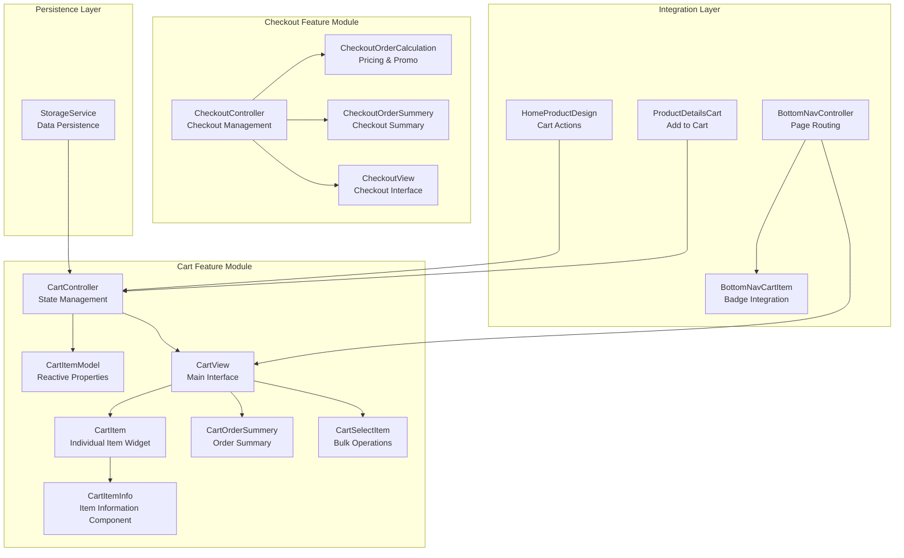

**Diagram sources**
- [cart_controller.dart:5-70](file://lib/features/cart/controller/cart_controller.dart#L5-L70)
- [cart_item_model.dart:3-22](file://lib/features/cart/models/cart_item_model.dart#L3-L22)
- [cart_view.dart:12-61](file://lib/features/cart/views/cart_view.dart#L12-L61)
- [cart_item.dart:10-100](file://lib/features/cart/widgets/cart_view_widgets/cart_item.dart#L10-L100)
- [cart_item_info.dart:10-89](file://lib/features/cart/widgets/cart_view_widgets/cart_item_info.dart#L10-L89)
- [cart_order_summery.dart:10-93](file://lib/features/cart/widgets/cart_view_widgets/cart_order_summery.dart#L10-L93)
- [cart_select_item.dart:10-53](file://lib/features/cart/widgets/cart_view_widgets/cart_select_item.dart#L10-L53)
- [checkout_controller.dart:5-82](file://lib/features/cart/controller/checkout_controller.dart#L5-L82)
- [checkout_order_summery.dart:12-94](file://lib/features/cart/widgets/checkout_view_widgets/checkout_order_summery.dart#L12-L94)
- [checkout_order_calculation.dart:10-101](file://lib/features/cart/widgets/checkout_view_widgets/checkout_order_calculation.dart#L10-L101)
- [bottom_nav_controller.dart:8-17](file://lib/features/home/controller/bottom_nav_controller.dart#L8-L17)
- [bottom_nav_cart_item.dart:9-75](file://lib/features/home/widgets/bottom_nav_widgets/bottom_nav_cart_item.dart#L9-L75)
- [home_product_design.dart:10-105](file://lib/features/home/widgets/home_widgets/home_product_design.dart#L10-L105)
- [product_details_cart.dart:10-188](file://lib/features/product_details.dart/widgets/product_details_view_widgets/product_details_cart.dart#L10-L188)
- [storage_service.dart:3-24](file://lib/core/data/local/storage_service.dart#L3-L24)

**Section sources**
- [cart_controller.dart:5-70](file://lib/features/cart/controller/cart_controller.dart#L5-L70)
- [cart_item_model.dart:3-22](file://lib/features/cart/models/cart_item_model.dart#L3-L22)
- [cart_view.dart:12-61](file://lib/features/cart/views/cart_view.dart#L12-L61)
- [cart_item.dart:10-100](file://lib/features/cart/widgets/cart_view_widgets/cart_item.dart#L10-L100)
- [cart_item_info.dart:10-89](file://lib/features/cart/widgets/cart_view_widgets/cart_item_info.dart#L10-L89)
- [cart_order_summery.dart:10-93](file://lib/features/cart/widgets/cart_view_widgets/cart_order_summery.dart#L10-L93)
- [cart_select_item.dart:10-53](file://lib/features/cart/widgets/cart_view_widgets/cart_select_item.dart#L10-L53)
- [checkout_controller.dart:5-82](file://lib/features/cart/controller/checkout_controller.dart#L5-L82)
- [checkout_order_summery.dart:12-94](file://lib/features/cart/widgets/checkout_view_widgets/checkout_order_summery.dart#L12-L94)
- [checkout_order_calculation.dart:10-101](file://lib/features/cart/widgets/checkout_view_widgets/checkout_order_calculation.dart#L10-L101)
- [bottom_nav_controller.dart:8-17](file://lib/features/home/controller/bottom_nav_controller.dart#L8-L17)
- [bottom_nav_cart_item.dart:9-75](file://lib/features/home/widgets/bottom_nav_widgets/bottom_nav_cart_item.dart#L9-L75)
- [home_product_design.dart:10-105](file://lib/features/home/widgets/home_widgets/home_product_design.dart#L10-L105)
- [product_details_cart.dart:10-188](file://lib/features/product_details.dart/widgets/product_details_view_widgets/product_details_cart.dart#L10-L188)
- [storage_service.dart:3-24](file://lib/core/data/local/storage_service.dart#L3-L24)

## Core Components
The cart system consists of several key components working together in a modernized architecture:

- **CartController**: Manages cart state with reactive properties, item selection, quantity operations, and deletion functionality
- **CheckoutController**: Handles checkout process with form validation, payment processing, and order management
- **CartItemModel**: Defines cart item structure with reactive boolean properties for selection state
- **OrderItemModel**: Defines checkout order item structure for order summary display
- **CartView**: Main cart interface displaying items in a scrollable list with custom appbar
- **CheckoutView**: Complete checkout interface with address, payment, and order summary components
- **CartItem Widget**: Individual cart item component with separated item info and quantity controls
- **CartItemInfo Widget**: Dedicated item information component with selection checkbox and details
- **CartOrderSummery Widget**: Enhanced order summary with pricing calculations and promotional discount
- **CartSelectItem Widget**: Bulk operations component with select all functionality and delete all option
- **CheckoutOrderSummery Widget**: Complete checkout order summary with editable items
- **CheckoutOrderCalculation Widget**: Promotional discount handling and pricing breakdown
- **Bottom Navigation Integration**: Cart badge with item count and navigation to cart page
- **Product Details Integration**: Add to cart functionality with quantity selection

Key responsibilities include:
- State management with reactive updates using GetX framework
- Modular widget architecture with separation of concerns
- Item selection with individual and bulk operations
- Quantity adjustment with validation and refresh mechanisms
- Item deletion with state synchronization
- Enhanced order summary with promotional discount handling
- Complete checkout workflow with form validation and payment processing
- UI integration with responsive design and theming
- Navigation integration with badge count updates

**Section sources**
- [cart_controller.dart:5-70](file://lib/features/cart/controller/cart_controller.dart#L5-L70)
- [checkout_controller.dart:5-82](file://lib/features/cart/controller/checkout_controller.dart#L5-L82)
- [cart_item_model.dart:3-22](file://lib/features/cart/models/cart_item_model.dart#L3-L22)
- [order_item_model.dart:1-16](file://lib/features/cart/models/order_item_model.dart#L1-L16)
- [cart_view.dart:12-61](file://lib/features/cart/views/cart_view.dart#L12-L61)
- [checkout_view.dart:17-67](file://lib/features/cart/views/checkout_view.dart#L17-L67)
- [cart_item.dart:10-100](file://lib/features/cart/widgets/cart_view_widgets/cart_item.dart#L10-L100)
- [cart_item_info.dart:10-89](file://lib/features/cart/widgets/cart_view_widgets/cart_item_info.dart#L10-L89)
- [cart_order_summery.dart:10-93](file://lib/features/cart/widgets/cart_view_widgets/cart_order_summery.dart#L10-L93)
- [cart_select_item.dart:10-53](file://lib/features/cart/widgets/cart_view_widgets/cart_select_item.dart#L10-L53)
- [checkout_order_summery.dart:12-94](file://lib/features/cart/widgets/checkout_view_widgets/checkout_order_summery.dart#L12-L94)
- [checkout_order_calculation.dart:10-101](file://lib/features/cart/widgets/checkout_view_widgets/checkout_order_calculation.dart#L10-L101)
- [bottom_nav_cart_item.dart:9-75](file://lib/features/home/widgets/bottom_nav_widgets/bottom_nav_cart_item.dart#L9-L75)
- [product_details_cart.dart:10-188](file://lib/features/product_details.dart/widgets/product_details_view_widgets/product_details_cart.dart#L10-L188)

## Architecture Overview
The cart system follows a modernized reactive architecture pattern using the GetX framework with clear separation between cart and checkout concerns:

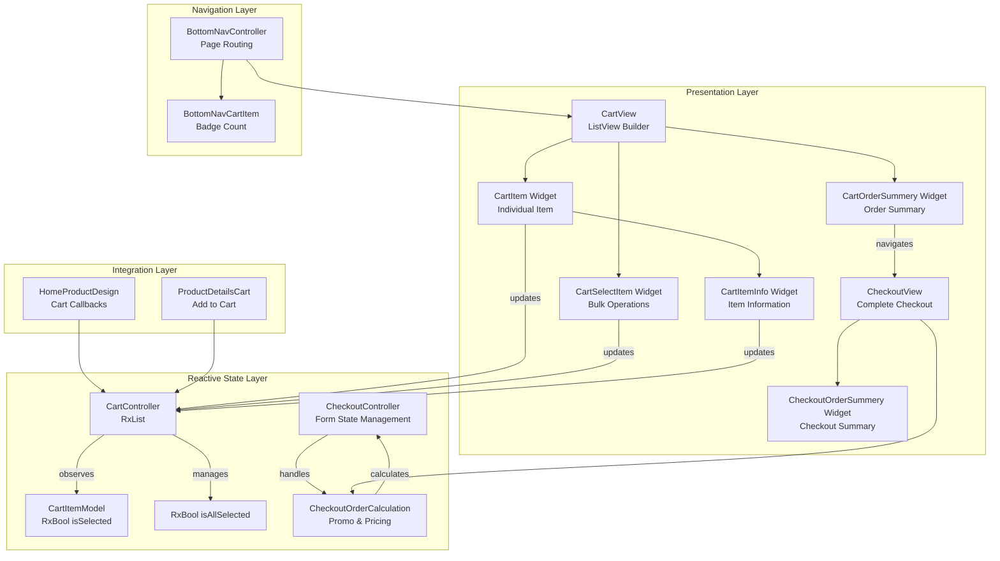

**Diagram sources**
- [cart_controller.dart:5-70](file://lib/features/cart/controller/cart_controller.dart#L5-L70)
- [cart_item_model.dart:3-22](file://lib/features/cart/models/cart_item_model.dart#L3-L22)
- [cart_view.dart:12-61](file://lib/features/cart/views/cart_view.dart#L12-L61)
- [cart_item.dart:10-100](file://lib/features/cart/widgets/cart_view_widgets/cart_item.dart#L10-L100)
- [cart_item_info.dart:10-89](file://lib/features/cart/widgets/cart_view_widgets/cart_item_info.dart#L10-L89)
- [cart_order_summery.dart:10-93](file://lib/features/cart/widgets/cart_view_widgets/cart_order_summery.dart#L10-L93)
- [cart_select_item.dart:10-53](file://lib/features/cart/widgets/cart_view_widgets/cart_select_item.dart#L10-L53)
- [checkout_controller.dart:5-82](file://lib/features/cart/controller/checkout_controller.dart#L5-L82)
- [checkout_order_summery.dart:12-94](file://lib/features/cart/widgets/checkout_view_widgets/checkout_order_summery.dart#L12-L94)
- [checkout_order_calculation.dart:10-101](file://lib/features/cart/widgets/checkout_view_widgets/checkout_order_calculation.dart#L10-L101)
- [bottom_nav_controller.dart:8-17](file://lib/features/home/controller/bottom_nav_controller.dart#L8-L17)
- [bottom_nav_cart_item.dart:9-75](file://lib/features/home/widgets/bottom_nav_widgets/bottom_nav_cart_item.dart#L9-L75)
- [home_product_design.dart:10-105](file://lib/features/home/widgets/home_widgets/home_product_design.dart#L10-L105)
- [product_details_cart.dart:10-188](file://lib/features/product_details.dart/widgets/product_details_view_widgets/product_details_cart.dart#L10-L188)

## Detailed Component Analysis

### Modernized Cart Controller Implementation
The CartController manages all cart operations with enhanced reactive state management:

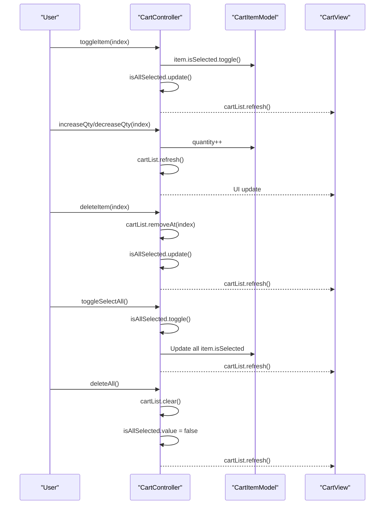

**Diagram sources**
- [cart_controller.dart:36-70](file://lib/features/cart/controller/cart_controller.dart#L36-L70)

**Section sources**
- [cart_controller.dart:5-70](file://lib/features/cart/controller/cart_controller.dart#L5-L70)

### Enhanced Cart Item Model with Reactive Properties
The CartItemModel defines the structure for cart items with comprehensive reactive selection properties:

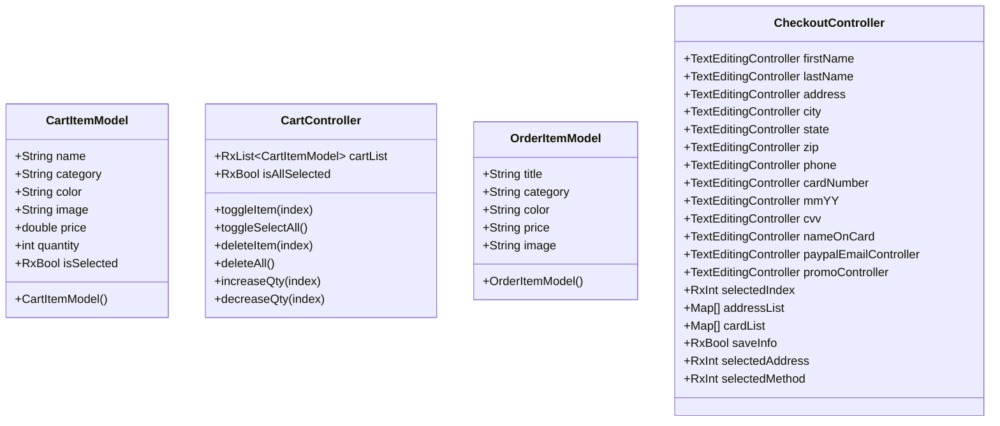

**Diagram sources**
- [cart_item_model.dart:3-22](file://lib/features/cart/models/cart_item_model.dart#L3-L22)
- [cart_controller.dart:5-70](file://lib/features/cart/controller/cart_controller.dart#L5-L70)
- [order_item_model.dart:1-16](file://lib/features/cart/models/order_item_model.dart#L1-L16)
- [checkout_controller.dart:5-82](file://lib/features/cart/controller/checkout_controller.dart#L5-L82)

**Section sources**
- [cart_item_model.dart:3-22](file://lib/features/cart/models/cart_item_model.dart#L3-L22)
- [order_item_model.dart:1-16](file://lib/features/cart/models/order_item_model.dart#L1-L16)

### Modular Cart View and Enhanced Item Rendering
The CartView provides the main interface for cart management with modernized widget architecture and dynamic item rendering:

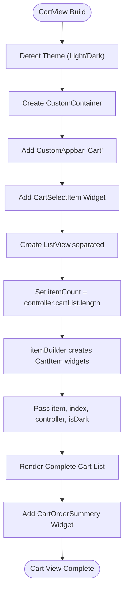

**Diagram sources**
- [cart_view.dart:16-61](file://lib/features/cart/views/cart_view.dart#L16-L61)

**Section sources**
- [cart_view.dart:12-61](file://lib/features/cart/views/cart_view.dart#L12-L61)

### Modernized Cart Item Widget Architecture
The CartItem widget now features a modular architecture with separated item information and quantity control components:

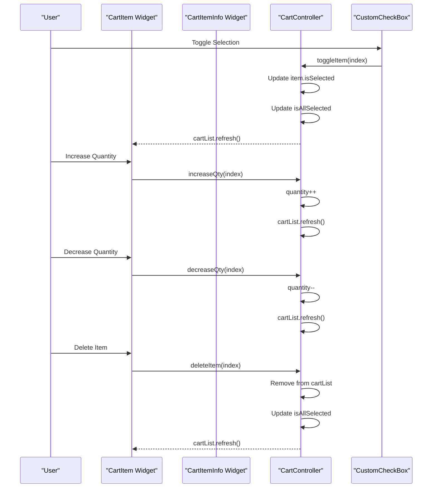

**Diagram sources**
- [cart_item.dart:24-83](file://lib/features/cart/widgets/cart_view_widgets/cart_item.dart#L24-L83)
- [cart_item_info.dart:20-87](file://lib/features/cart/widgets/cart_view_widgets/cart_item_info.dart#L20-L87)
- [cart_controller.dart:36-70](file://lib/features/cart/controller/cart_controller.dart#L36-L70)

**Section sources**
- [cart_item.dart:10-100](file://lib/features/cart/widgets/cart_view_widgets/cart_item.dart#L10-L100)
- [cart_item_info.dart:10-89](file://lib/features/cart/widgets/cart_view_widgets/cart_item_info.dart#L10-L89)

### Enhanced Cart Order Summary Component
The CartOrderSummery widget provides comprehensive order summary with pricing calculations and promotional discount handling:

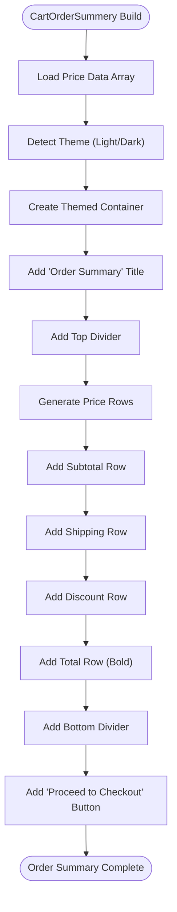

**Diagram sources**
- [cart_order_summery.dart:14-93](file://lib/features/cart/widgets/cart_view_widgets/cart_order_summery.dart#L14-L93)

**Section sources**
- [cart_order_summery.dart:10-93](file://lib/features/cart/widgets/cart_view_widgets/cart_order_summery.dart#L10-L93)

### Cart Selection and Bulk Operations
The CartSelectItem widget provides enhanced bulk cart management capabilities with improved UI:

**Diagram sources**
- [cart_select_item.dart:16-51](file://lib/features/cart/widgets/cart_view_widgets/cart_select_item.dart#L16-L51)
- [cart_controller.dart:41-58](file://lib/features/cart/controller/cart_controller.dart#L41-L58)

**Section sources**
- [cart_select_item.dart:10-53](file://lib/features/cart/widgets/cart_view_widgets/cart_select_item.dart#L10-L53)

### Complete Checkout System Architecture
The checkout system provides a comprehensive checkout workflow with form handling and order management:

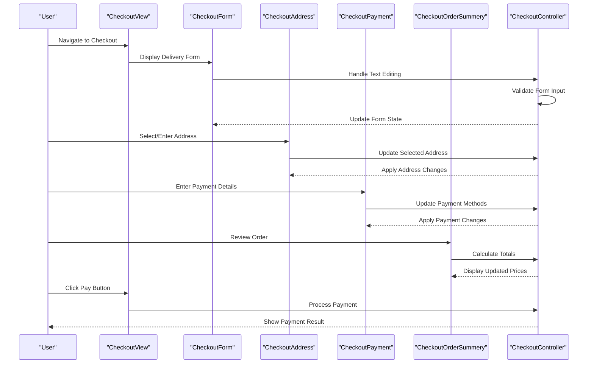

**Diagram sources**
- [checkout_view.dart:21-67](file://lib/features/cart/views/checkout_view.dart#L21-L67)
- [checkout_controller.dart:5-82](file://lib/features/cart/controller/checkout_controller.dart#L5-L82)
- [checkout_order_summery.dart:16-94](file://lib/features/cart/widgets/checkout_view_widgets/checkout_order_summery.dart#L16-L94)
- [checkout_order_calculation.dart:14-101](file://lib/features/cart/widgets/checkout_view_widgets/checkout_order_calculation.dart#L14-L101)

**Section sources**
- [checkout_view.dart:17-67](file://lib/features/cart/views/checkout_view.dart#L17-L67)
- [checkout_controller.dart:5-82](file://lib/features/cart/controller/checkout_controller.dart#L5-L82)
- [checkout_order_summery.dart:12-94](file://lib/features/cart/widgets/checkout_view_widgets/checkout_order_summery.dart#L12-L94)
- [checkout_order_calculation.dart:10-101](file://lib/features/cart/widgets/checkout_view_widgets/checkout_order_calculation.dart#L10-L101)

### Bottom Navigation Cart Integration
Enhanced bottom navigation with cart badge integration and page routing:

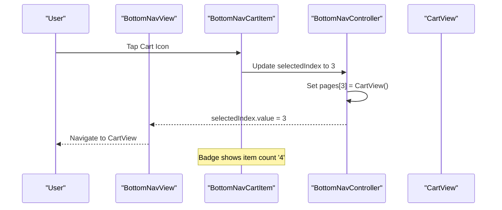

**Diagram sources**
- [bottom_nav_view.dart:12-80](file://lib/features/home/views/bottom_nav_view.dart#L12-L80)
- [bottom_nav_controller.dart:8-17](file://lib/features/home/controller/bottom_nav_controller.dart#L8-L17)
- [bottom_nav_cart_item.dart:25-73](file://lib/features/home/widgets/bottom_nav_widgets/bottom_nav_cart_item.dart#L25-L73)

**Section sources**
- [bottom_nav_view.dart:12-80](file://lib/features/home/views/bottom_nav_view.dart#L12-L80)
- [bottom_nav_controller.dart:8-17](file://lib/features/home/controller/bottom_nav_controller.dart#L8-L17)
- [bottom_nav_cart_item.dart:9-75](file://lib/features/home/widgets/bottom_nav_widgets/bottom_nav_cart_item.dart#L9-L75)

### Product Details Cart Integration
Product details page with integrated cart functionality:

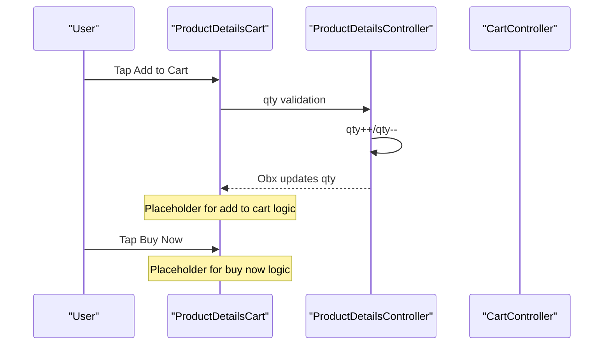

**Diagram sources**
- [product_details_cart.dart:75-95](file://lib/features/product_details.dart/widgets/product_details_view_widgets/product_details_cart.dart#L75-L95)

**Section sources**
- [product_details_cart.dart:10-188](file://lib/features/product_details.dart/widgets/product_details_view_widgets/product_details_cart.dart#L10-L188)

### Home Product Integration
Home product widgets with cart action callbacks:

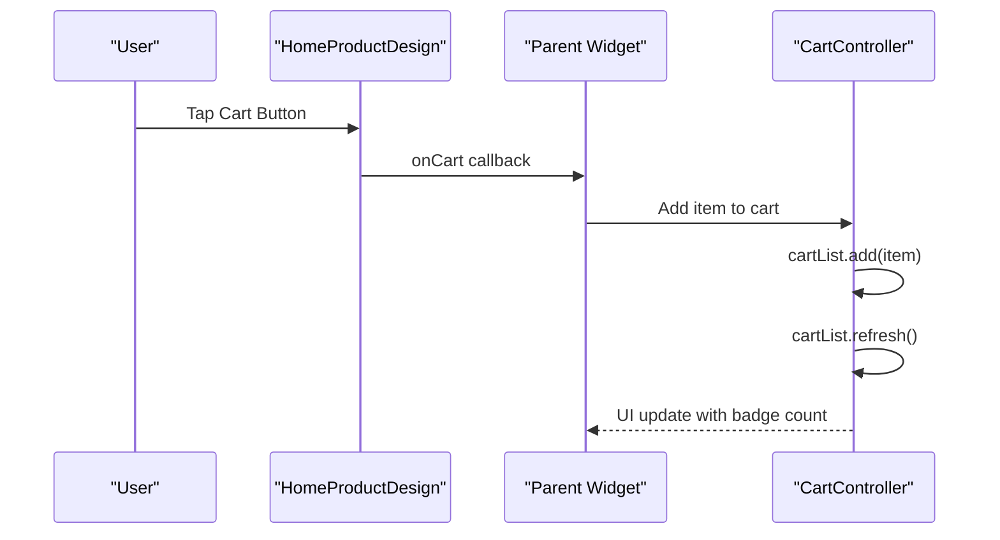

**Diagram sources**
- [home_product_design.dart:47-52](file://lib/features/home/widgets/home_widgets/home_product_design.dart#L47-L52)
- [home_new_arrival.dart:36-44](file://lib/features/home/widgets/home_widgets/home_new_arrival.dart#L36-L44)
- [home_our_products.dart:52-58](file://lib/features/home/widgets/home_widgets/home_our_products.dart#L52-L58)

**Section sources**
- [home_product_design.dart:10-105](file://lib/features/home/widgets/home_widgets/home_product_design.dart#L10-L105)
- [home_new_arrival.dart:36-44](file://lib/features/home/widgets/home_widgets/home_new_arrival.dart#L36-L44)
- [home_our_products.dart:52-58](file://lib/features/home/widgets/home_widgets/home_our_products.dart#L52-L58)

## Dependency Analysis
The cart system demonstrates excellent modularity with clear dependency boundaries and modernized architecture:

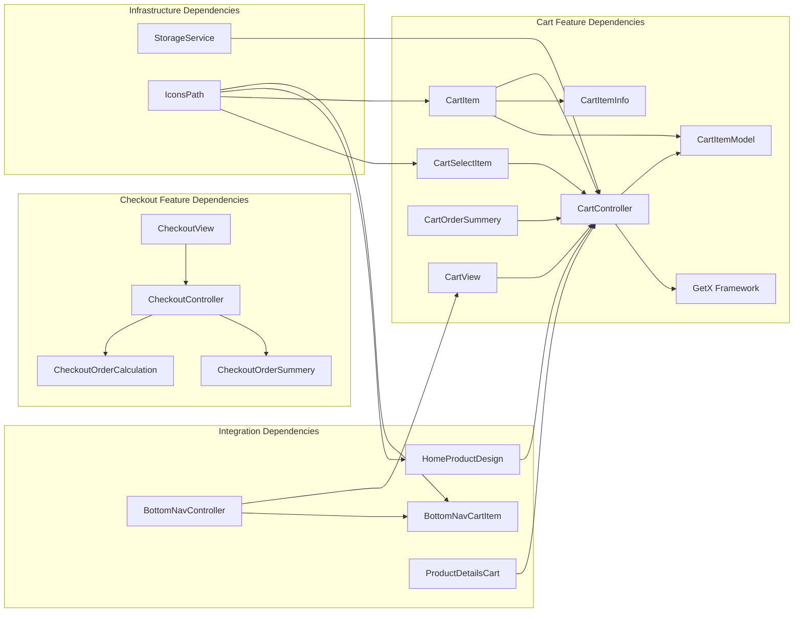

**Diagram sources**
- [cart_controller.dart:1-3](file://lib/features/cart/controller/cart_controller.dart#L1-L3)
- [cart_item_model.dart:1](file://lib/features/cart/models/cart_item_model.dart#L1)
- [cart_view.dart:3-11](file://lib/features/cart/views/cart_view.dart#L3-L11)
- [cart_item.dart:2-8](file://lib/features/cart/widgets/cart_view_widgets/cart_item.dart#L2-L8)
- [cart_item_info.dart:3-8](file://lib/features/cart/widgets/cart_view_widgets/cart_item_info.dart#L3-L8)
- [cart_order_summery.dart:3-9](file://lib/features/cart/widgets/cart_view_widgets/cart_order_summery.dart#L3-L9)
- [cart_select_item.dart:3-8](file://lib/features/cart/widgets/cart_view_widgets/cart_select_item.dart#L3-L8)
- [checkout_controller.dart:1-4](file://lib/features/cart/controller/checkout_controller.dart#L1-L4)
- [checkout_order_summery.dart:3-10](file://lib/features/cart/widgets/checkout_view_widgets/checkout_order_summery.dart#L3-L10)
- [checkout_order_calculation.dart:3-8](file://lib/features/cart/widgets/checkout_view_widgets/checkout_order_calculation.dart#L3-L8)
- [bottom_nav_controller.dart:2-6](file://lib/features/home/controller/bottom_nav_controller.dart#L2-L6)
- [bottom_nav_cart_item.dart:4-7](file://lib/features/home/widgets/bottom_nav_widgets/bottom_nav_cart_item.dart#L4-L7)
- [home_product_design.dart:4-8](file://lib/features/home/widgets/home_widgets/home_product_design.dart#L4-L8)
- [product_details_cart.dart:3-8](file://lib/features/product_details.dart/widgets/product_details_view_widgets/product_details_cart.dart#L3-L8)
- [storage_service.dart:1](file://lib/core/data/local/storage_service.dart#L1)
- [icons_path.dart:1](file://lib/core/constant/icons_path.dart#L1)

**Section sources**
- [cart_controller.dart:1-3](file://lib/features/cart/controller/cart_controller.dart#L1-L3)
- [cart_item_model.dart:1](file://lib/features/cart/models/cart_item_model.dart#L1)
- [cart_view.dart:3-11](file://lib/features/cart/views/cart_view.dart#L3-L11)
- [cart_item.dart:2-8](file://lib/features/cart/widgets/cart_view_widgets/cart_item.dart#L2-L8)
- [cart_item_info.dart:3-8](file://lib/features/cart/widgets/cart_view_widgets/cart_item_info.dart#L3-L8)
- [cart_order_summery.dart:3-9](file://lib/features/cart/widgets/cart_view_widgets/cart_order_summery.dart#L3-L9)
- [cart_select_item.dart:3-8](file://lib/features/cart/widgets/cart_view_widgets/cart_select_item.dart#L3-L8)
- [checkout_controller.dart:1-4](file://lib/features/cart/controller/checkout_controller.dart#L1-L4)
- [checkout_order_summery.dart:3-10](file://lib/features/cart/widgets/checkout_view_widgets/checkout_order_summery.dart#L3-L10)
- [checkout_order_calculation.dart:3-8](file://lib/features/cart/widgets/checkout_view_widgets/checkout_order_calculation.dart#L3-L8)
- [bottom_nav_controller.dart:2-6](file://lib/features/home/controller/bottom_nav_controller.dart#L2-L6)
- [bottom_nav_cart_item.dart:4-7](file://lib/features/home/widgets/bottom_nav_widgets/bottom_nav_cart_item.dart#L4-L7)
- [home_product_design.dart:4-8](file://lib/features/home/widgets/home_widgets/home_product_design.dart#L4-L8)
- [product_details_cart.dart:3-8](file://lib/features/product_details.dart/widgets/product_details_view_widgets/product_details_cart.dart#L3-L8)
- [storage_service.dart:1](file://lib/core/data/local/storage_service.dart#L1)
- [icons_path.dart:1](file://lib/core/constant/icons_path.dart#L1)

## Performance Considerations
The cart system implements several performance optimization strategies with modernized architecture:

- **Reactive Updates**: Uses GetX framework for efficient state management with selective UI updates
- **Virtualized Lists**: Implements ListView.separated with shrinkWrap and NeverScrollableScrollPhysics for optimal rendering
- **Conditional Rendering**: Uses Obx widgets for granular state observation and minimal rebuilds
- **Memory Management**: Proper disposal of reactive subscriptions through GetX lifecycle
- **Asset Optimization**: Cached network images for product thumbnails to reduce bandwidth usage
- **State Synchronization**: Automatic state updates prevent unnecessary manual refresh operations
- **Badge Counting**: Dynamic badge calculation based on cart length for real-time updates
- **Responsive Design**: ScreenUtil integration ensures optimal performance across device sizes
- **Modular Architecture**: Separate widget components reduce memory footprint and improve maintainability
- **Enhanced Order Calculations**: Optimized pricing calculations with lazy evaluation
- **Checkout Form Handling**: Efficient form validation and state management
- **Promotional Discount Processing**: Optimized discount calculation and application

## Troubleshooting Guide
Common issues and solutions for the modernized cart system:

**Cart State Not Updating**
- Verify reactive property usage (isSelected, isAllSelected) are properly declared as RxBool
- Ensure cartList.refresh() is called after state modifications
- Check that Obx widgets are wrapping dependent UI elements
- Verify CartItemInfo widget properly observes item.isSelected

**Quantity Controls Not Working**
- Confirm increaseQty/decreaseQty methods are properly bound to UI events
- Verify quantity validation prevents negative values
- Ensure cartList.refresh() is called after quantity changes
- Check that CartItem widget properly passes controller methods

**Selection State Issues**
- Check toggleItem method properly updates both individual and global selection states
- Verify isAllSelected calculation uses every() method correctly
- Ensure selection state persists across widget rebuilds
- Verify CartItemInfo checkbox properly triggers controller.toggleItem

**Order Summary Calculation Errors**
- Check CartOrderSummery widget properly calculates pricing
- Verify CheckoutOrderCalculation handles promo code input
- Ensure pricing arrays match expected format
- Check that total calculations update on state changes

**Checkout Form Validation Problems**
- Confirm CheckoutController properly validates form inputs
- Verify text editing controllers are properly disposed
- Check that form state updates trigger UI refreshes
- Ensure address and payment method selections work correctly

**Navigation Problems**
- Confirm BottomNavController pages array includes CartView at index 3
- Verify BottomNavCartItem badgeCount is properly calculated
- Check that selectedIndex updates trigger proper page navigation
- Verify checkout navigation flow works correctly

**Integration Issues**
- Ensure HomeProductDesign onCart callbacks are properly wired
- Verify ProductDetailsCart add to cart functionality is implemented
- Check that cart binding is registered in dependency injection system
- Verify checkout binding is properly configured

**Section sources**
- [cart_controller.dart:36-70](file://lib/features/cart/controller/cart_controller.dart#L36-L70)
- [cart_item.dart:24-83](file://lib/features/cart/widgets/cart_view_widgets/cart_item.dart#L24-L83)
- [cart_item_info.dart:20-87](file://lib/features/cart/widgets/cart_view_widgets/cart_item_info.dart#L20-L87)
- [cart_order_summery.dart:14-93](file://lib/features/cart/widgets/cart_view_widgets/cart_order_summery.dart#L14-L93)
- [checkout_controller.dart:5-82](file://lib/features/cart/controller/checkout_controller.dart#L5-L82)
- [bottom_nav_controller.dart:8-17](file://lib/features/home/controller/bottom_nav_controller.dart#L8-L17)
- [bottom_nav_cart_item.dart:25-73](file://lib/features/home/widgets/bottom_nav_widgets/bottom_nav_cart_item.dart#L25-L73)
- [home_product_design.dart:47-52](file://lib/features/home/widgets/home_widgets/home_product_design.dart#L47-L52)
- [product_details_cart.dart:75-95](file://lib/features/product_details.dart/widgets/product_details_view_widgets/product_details_cart.dart#L75-L95)

## Conclusion
The Shopping Cart system in ZB-DEZINE represents a comprehensive modernized implementation featuring a fully functional cart controller with item selection, quantity management, deletion capabilities, and enhanced UI components. The system leverages the GetX framework for reactive state management, providing efficient updates and responsive user interactions.

**Updated** Key achievements include the major cart system modernization with modular architecture, enhanced order summary components, improved cart view widgets with separated item information and quantity controls, and a complete checkout workflow with form validation and payment processing.

The modernized system features:
- Complete cart controller implementation with all CRUD operations and enhanced state management
- Modular widget architecture with CartItemInfo component for better separation of concerns
- Comprehensive UI components for individual items, bulk operations, and order summaries
- Enhanced checkout system with form handling, promotional discount processing, and order management
- Seamless integration with bottom navigation and product catalog
- Proper dependency injection through cart and checkout bindings
- Responsive design with theme support and screen adaptation
- Complete promotional discount handling in checkout order calculations
- Optimized performance with modular architecture and efficient state management

The system is designed for scalability with clear separation of concerns, making it easy to extend with additional features like advanced inventory validation, shipping calculations, and enhanced promotional discount systems. The modular architecture ensures maintainability and allows for future enhancements while maintaining optimal performance for large cart contents and complex checkout workflows.