# Shopping Cart System

<cite>
**Referenced Files in This Document**
- [cart_controller.dart](file://lib/features/cart/controller/cart_controller.dart)
- [delete_cart_item_controller.dart](file://lib/features/cart/controller/delete_cart_item_controller.dart)
- [select_cart_item_controller.dart](file://lib/features/cart/controller/select_cart_item_controller.dart)
- [select_all_cart_item_controller.dart](file://lib/features/cart/controller/select_all_cart_item_controller.dart)
- [add_to_cart_controller.dart](file://lib/features/cart/controller/add_to_cart_controller.dart)
- [checkout_controller.dart](file://lib/features/cart/controller/checkout_controller.dart)
- [cart_model.dart](file://lib/features/cart/models/cart_model.dart)
- [order_item_model.dart](file://lib/features/cart/models/order_item_model.dart)
- [get_cart_repo.dart](file://lib/features/cart/repositories/get_cart_repo.dart)
- [add_to_cart_repo.dart](file://lib/features/cart/repositories/add_to_cart_repo.dart)
- [select_cart_item_repo.dart](file://lib/features/cart/repositories/select_cart_item_repo.dart)
- [select_all_cart_items_repo.dart](file://lib/features/cart/repositories/select_all_cart_items_repo.dart)
- [delete_cart_item_repo.dart](file://lib/features/cart/repositories/delete_cart_item_repo.dart)
- [cart_bindings.dart](file://lib/features/cart/bindings/cart_bindings.dart)
- [cart_view.dart](file://lib/features/cart/views/cart_view.dart)
- [checkout_view.dart](file://lib/features/cart/views/checkout_view.dart)
- [cart_item.dart](file://lib/features/cart/widgets/cart_view_widgets/cart_item.dart)
- [cart_item_info.dart](file://lib/features/cart/widgets/cart_view_widgets/cart_item_info.dart)
- [cart_order_summery.dart](file://lib/features/cart/widgets/cart_view_widgets/cart_order_summery.dart)
- [cart_select_item.dart](file://lib/features/cart/widgets/cart_view_widgets/cart_select_item.dart)
- [checkout_order_summery.dart](file://lib/features/cart/widgets/checkout_view_widgets/checkout_order_summery.dart)
- [checkout_order_calculation.dart](file://lib/features/cart/widgets/checkout_view_widgets/checkout_order_calculation.dart)
- [bottom_nav_view.dart](file://lib/features/home/views/bottom_nav_view.dart)
- [bottom_nav_controller.dart](file://lib/features/home/controller/bottom_nav_controller.dart)
- [bottom_nav_cart_item.dart](file://lib/features/home/widgets/bottom_nav_widgets/bottom_nav_cart_item.dart)
- [bottom_nav_items.dart](file://lib/features/home/widgets/bottom_nav_widgets/bottom_nav_items.dart)
- [home_product_design.dart](file://lib/features/home/widgets/home_widgets/home_product_design.dart)
- [product_details_cart.dart](file://lib/features/product_details.dart/widgets/product_details_view_widgets/product_details_cart.dart)
- [product_details_bindings.dart](file://lib/features/product_details.dart/bindings/product_details_bindings.dart)
- [storage_service.dart](file://lib/core/data/local/storage_service.dart)
- [icons_path.dart](file://lib/core/constant/icons_path.dart)
</cite>

## Update Summary
**Changes Made**
- **Enhanced Cart Badge System**: Upgraded from static hardcoded count ('4') to dynamic reactive system using GetX Obx widgets and CartController for real-time updates
- **Added Comprehensive Cart Item Deletion Functionality**: Introduced new DeleteCartItemController and DeleteCartItemRepository for individual item removal
- **Enhanced CartController with deleteItem Method**: Integrated client-side state management and server synchronization for item deletion
- **UI Improvements for Empty Cart State**: Enhanced cart view with better empty cart detection and display
- **Delete Button Integration**: Added delete button functionality in cart item widgets and delete all functionality in cart header
- **Complete Repository Pattern Integration**: Full integration of deletion endpoints through repository pattern implementation
- **Improved User Experience**: Streamlined cart management with intuitive delete operations and visual feedback

## Table of Contents
1. [Introduction](#introduction)
2. [Project Structure](#project-structure)
3. [Core Components](#core-components)
4. [Architecture Overview](#architecture-overview)
5. [Detailed Component Analysis](#detailed-component-analysis)
6. [Enhanced Selection System Implementation](#enhanced-selection-system-implementation)
7. [Granular Item Selection Capabilities](#granular-item-selection-capabilities)
8. [Bulk Selection Operations](#bulk-selection-operations)
9. [Comprehensive Item Deletion System](#comprehensive-item-deletion-system)
10. [Individual Item Deletion Implementation](#individual-item-deletion-implementation)
11. [Delete All Functionality](#delete-all-functionality)
12. [Enhanced Cart Badge System](#enhanced-cart-badge-system)
13. [Reactive State Management](#reactive-state-management)
14. [Enhanced Repository Pattern Implementation](#enhanced-repository-pattern-implementation)
15. [Improved UI Components with Deletion Features](#improved-ui-components-with-deletion-features)
16. [Cart State Persistence and Synchronization](#cart-state-persistence-and-synchronization)
17. [Performance Considerations](#performance-considerations)
18. [Troubleshooting Guide](#troubleshooting-guide)
19. [Conclusion](#conclusion)

## Introduction
This document describes the comprehensive Shopping Cart system within the ZB-DEZINE Flutter application. The system has undergone significant enhancements including granular item selection capabilities, bulk selection operations, reactive state management, comprehensive item deletion functionality, and improved UI components. The system maintains its modernized API-driven architecture with repository pattern implementation while adding robust selection management, performance optimizations, and streamlined cart deletion operations.

**Updated** The cart system has been enhanced with comprehensive item deletion capabilities through new DeleteCartItemController and DeleteCartItemRepository, granular item selection through SelectCartItemController and SelectAllCartItemsController, comprehensive selection management with reactive state handling, improved UI components with integrated selection and deletion features, expanded repository pattern implementation with dedicated selection and deletion endpoints, enhanced cart state synchronization across selection and deletion operations, and comprehensive debugging capabilities for cart management operations.

## Project Structure
The shopping cart functionality is organized into an enhanced API-driven architecture with improved repository pattern implementation, granular selection capabilities, comprehensive deletion system, and redesigned UI components:

```mermaid
graph TB
subgraph "Enhanced Selection and Deletion Management Architecture"
CC["CartController<br/>Enhanced State Management"] --> GCR["GetCartRepository<br/>Improved API Parsing"]
CC --> SCI["SelectCartItemController<br/>Individual Item Selection"]
CC --> SAC["SelectAllCartItemsController<br/>Bulk Selection Operations"]
CC --> DCI["DeleteCartItemController<br/>Individual Item Deletion"]
CC --> CM["CartModel<br/>Enhanced Serialization"]
GCR --> GN["GetNetwork<br/>HTTP Client"]
SCI --> SCIR["SelectCartItemRepository<br/>Item Toggle Endpoint"]
SAC --> SACR["SelectAllCartItemsRepository<br/>Bulk Toggle Endpoint"]
DCI --> DCR["DeleteCartItemRepository<br/>Item Remove Endpoint"]
end
subgraph "Enhanced UI Components with Deletion Features"
CIB["CartItemBox<br/>Enhanced Item Widget"] --> CII["CartItemInfo<br/>Selection-Aware Image Handling"]
CII --> CNI["CachedNetworkImage<br/>Better Product Images"]
CII --> CBC["CustomCheckBox<br/>Integrated Selection Control"]
CIB --> DELETEBTN["Delete Button<br/>Circle Design with Icon"]
CIB --> QTY["Quantity Controls<br/>Improved Layout"]
CSI["CartSelectItem<br/>Bulk Selection Header"] --> BULK["Select All Checkbox"]
CSI --> DELETEALL["Delete All Button<br/>Bulk Operation"]
end
subgraph "Enhanced Reactive Cart Badge System"
BNC["BottomNavCartItem<br/>Dynamic Badge Count"] --> OBC["Obx Widget<br/>Real-time Updates"]
BNC --> CCC["CartController<br/>Item Count Access"]
BNC --> BADGE["Badge Widget<br/>Visual Indicator"]
OBC --> CCC
CCC --> CART_ITEMS["carts.value.items.length"]
CART_ITEMS --> BADGE
end
subgraph "Reactive Order Summary"
COS["CartOrderSummery<br/>Dynamic Pricing"] --> RX["Reactive Calculations"]
COS --> PRECISION["toPrecision(2)<br/>Decimal Formatting"]
end
subgraph "Selection and Deletion State Management"
SELECTED["selectedItems Observable<br/>Track Selected Items"] --> STATE["Reactive State Updates"]
STATE --> SYNC["State Synchronization<br/>With Server"]
SYNC --> ERROR["Enhanced Error Handling<br/>Selection/Deletion Failures"]
end
```

**Diagram sources**
- [cart_controller.dart:1-97](file://lib/features/cart/controller/cart_controller.dart#L1-L97)
- [delete_cart_item_controller.dart:1-27](file://lib/features/cart/controller/delete_cart_item_controller.dart#L1-L27)
- [select_cart_item_controller.dart:1-32](file://lib/features/cart/controller/select_cart_item_controller.dart#L1-L32)
- [select_all_cart_item_controller.dart:1-30](file://lib/features/cart/controller/select_all_cart_item_controller.dart#L1-L30)
- [cart_item.dart:52-78](file://lib/features/cart/widgets/cart_view_widgets/cart_item.dart#L52-L78)
- [cart_select_item.dart:36-51](file://lib/features/cart/widgets/cart_view_widgets/cart_select_item.dart#L36-L51)
- [bottom_nav_view.dart:64-75](file://lib/features/home/views/bottom_nav_view.dart#L64-L75)
- [bottom_nav_cart_item.dart:9-77](file://lib/features/home/widgets/bottom_nav_widgets/bottom_nav_cart_item.dart#L9-L77)

**Section sources**
- [cart_controller.dart:1-97](file://lib/features/cart/controller/cart_controller.dart#L1-L97)
- [delete_cart_item_controller.dart:1-27](file://lib/features/cart/controller/delete_cart_item_controller.dart#L1-L27)
- [select_cart_item_controller.dart:1-32](file://lib/features/cart/controller/select_cart_item_controller.dart#L1-L32)
- [select_all_cart_item_controller.dart:1-30](file://lib/features/cart/controller/select_all_cart_item_controller.dart#L1-L30)
- [cart_item.dart:1-103](file://lib/features/cart/widgets/cart_view_widgets/cart_item.dart#L1-L103)
- [cart_select_item.dart:1-57](file://lib/features/cart/widgets/cart_view_widgets/cart_select_item.dart#L1-L57)
- [bottom_nav_view.dart:64-75](file://lib/features/home/views/bottom_nav_view.dart#L64-L75)
- [bottom_nav_cart_item.dart:9-77](file://lib/features/home/widgets/bottom_nav_widgets/bottom_nav_cart_item.dart#L9-L77)

## Core Components
The cart system consists of enhanced components with improved functionality, granular selection capabilities, comprehensive deletion system, and modernized architecture:

- **CartController**: Enhanced state management with selection tracking, deletion handling, debugging capabilities, and improved API integration
- **DeleteCartItemController**: New controller for individual item deletion with loading states and error handling
- **DeleteCartItemRepository**: New repository for item removal API communication with proper error handling
- **SelectCartItemController**: New controller for individual item selection toggling with loading states and error handling
- **SelectAllCartItemsController**: New controller for bulk selection operations with comprehensive state management
- **GetCartRepository**: Improved API response parsing with nested data structure handling and better error management
- **SelectCartItemRepository**: New repository for individual item selection API communication
- **SelectAllCartItemsRepository**: New repository for bulk selection API operations
- **CartModel**: Enhanced serialization support with comprehensive JSON parsing for cart items, options, and selection state
- **CartItem**: Enhanced item model with isSelected boolean property and selection tracking
- **CartItemBox**: Redesigned item component with improved layout, better quantity control positioning, and integrated delete button
- **CartItemInfo**: Enhanced item information component with CachedNetworkImage for better image handling and integrated selection checkbox
- **CartSelectItem**: Enhanced header component with bulk selection controls, delete all functionality, and improved visual design
- **CartOrderSummery**: Reactive order summary with dynamic pricing calculations and decimal precision formatting
- **CheckoutOrderCalculation**: Enhanced checkout pricing with promotional discount handling
- **Debugging Integration**: Real-time cart length monitoring and enhanced error logging for selection and deletion operations
- **Enhanced Cart Badge System**: Dynamic reactive badge system with real-time updates using GetX Obx widgets and CartController

Key enhancements include:
- **Granular Selection Management**: Individual item selection with server synchronization and client-side state tracking
- **Bulk Selection Operations**: Comprehensive bulk selection capabilities with optimized API communication
- **Comprehensive Item Deletion**: Individual item removal with client-side state updates and server synchronization
- **Delete All Functionality**: Bulk deletion operations with improved user interface integration
- **Enhanced State Synchronization**: Real-time state updates between client and server for selection and deletion changes
- **Improved API Response Parsing**: Repository now handles nested "data" structure from API responses
- **Enhanced Image Handling**: CachedNetworkImage provides better performance and fallback handling
- **Better Checkbox Positioning**: CustomCheckBox positioned correctly in top-left corner of product image with reactive state binding
- **Delete Button Integration**: Circular delete button with visual feedback and proper icon integration
- **Reactive Pricing Calculations**: Dynamic price updates based on cart state changes
- **Debugging Support**: Real-time cart length monitoring and enhanced error logging for selection and deletion operations
- **Decimal Precision**: Consistent two-decimal formatting for all monetary values
- **Improved Layout**: Better spacing and alignment in cart item components with selection and deletion integration
- **Empty Cart State Handling**: Enhanced empty cart detection and display with improved user experience
- **Dynamic Cart Badge**: Real-time cart item count display with reactive updates and visual feedback

**Section sources**
- [cart_controller.dart:1-97](file://lib/features/cart/controller/cart_controller.dart#L1-L97)
- [delete_cart_item_controller.dart:1-27](file://lib/features/cart/controller/delete_cart_item_controller.dart#L1-L27)
- [delete_cart_item_repo.dart:1-23](file://lib/features/cart/repositories/delete_cart_item_repo.dart#L1-L23)
- [select_cart_item_controller.dart:1-32](file://lib/features/cart/controller/select_cart_item_controller.dart#L1-L32)
- [select_all_cart_item_controller.dart:1-30](file://lib/features/cart/controller/select_all_cart_item_controller.dart#L1-L30)
- [cart_model.dart:68-120](file://lib/features/cart/models/cart_model.dart#L68-L120)
- [cart_item.dart:52-78](file://lib/features/cart/widgets/cart_view_widgets/cart_item.dart#L52-L78)
- [cart_select_item.dart:36-51](file://lib/features/cart/widgets/cart_view_widgets/cart_select_item.dart#L36-L51)
- [bottom_nav_view.dart:64-75](file://lib/features/home/views/bottom_nav_view.dart#L64-L75)
- [bottom_nav_cart_item.dart:9-77](file://lib/features/home/widgets/bottom_nav_widgets/bottom_nav_cart_item.dart#L9-L77)

## Architecture Overview
The cart system follows an enhanced API-driven architecture with improved repository pattern implementation, granular selection capabilities, comprehensive deletion system, and debugging integration:

```mermaid
graph TB
subgraph "Enhanced Selection and Deletion Management Layer"
CC["CartController<br/>Enhanced Reactive State"] --> DEBUG["debugPrint<br/>Cart Monitoring"]
CC --> GCR["GetCartRepository<br/>Improved API Parsing"]
CC --> SCI["SelectCartItemController<br/>Individual Selection"]
CC --> SAC["SelectAllCartItemsController<br/>Bulk Selection"]
CC --> DCI["DeleteCartItemController<br/>Individual Deletion"]
CC --> CM["CartModel<br/>Enhanced Serialization"]
CC --> SELECTED["selectedItems Observable<br/>Selection Tracking"]
CC --> DELETEITEM["deleteItem Method<br/>Client-State Management"]
end
subgraph "Enhanced Repository Layer"
GCR --> GN["GetNetwork<br/>HTTP Client"]
SCI --> SCIR["SelectCartItemRepository<br/>Item Toggle Endpoint"]
SAC --> SACR["SelectAllCartItemsRepository<br/>Bulk Toggle Endpoint"]
DCI --> DCR["DeleteCartItemRepository<br/>Item Remove Endpoint"]
GCR --> PARSE["Nested Data Parsing<br/>json['data'] wrapper"]
GCR --> ERROR["Enhanced Error Handling<br/>Better Error Messages"]
SCIR --> ITEM_API["/api/cart/item/{id}/toggle<br/>Individual Item Toggle"]
SACR --> BULK_API["/api/cart/select-all<br/>Bulk Selection Endpoint"]
DCR --> DELETE_API["/api/cart/item/{id}/remove<br/>Individual Item Removal"]
end
subgraph "Enhanced UI Components with Deletion Features"
CIB["CartItemBox<br/>Improved Layout"] --> CII["CartItemInfo<br/>CachedNetworkImage"]
CII --> CNI["CachedNetworkImage<br/>Better Performance"]
CII --> CBC["CustomCheckBox<br/>Top-Left Positioning<br/>Reactive Selection Binding"]
CIB --> DELETEBTN["Delete Button<br/>Circle Design<br/>Visual Feedback"]
CIB --> QTY["Quantity Controls<br/>Better Spacing"]
CSI["CartSelectItem<br/>Bulk Selection Header"] --> BULK_CB["Select All Checkbox<br/>Reactive State Binding"]
CSI --> DELETE_ALL_BTN["Delete All Button<br/>Bulk Operation<br/>Visual Design"]
COS["CartOrderSummery<br/>Reactive Calculations"] --> RX["toPrecision(2)<br/>Decimal Formatting"]
end
subgraph "Enhanced Cart Badge System"
BNC["BottomNavCartItem<br/>Dynamic Badge"] --> OBC["Obx Widget<br/>Real-time Updates"]
BNC --> CCC["CartController<br/>Item Count Access"]
BNC --> BADGE["Badge Widget<br/>Visual Indicator"]
OBC --> CCC
CCC --> CART_ITEMS["carts.value.items.length"]
CART_ITEMS --> BADGE
end
subgraph "Selection and Deletion State Management"
SELECTED --> STATE_SYNC["State Synchronization<br/>Client-Server Sync"]
STATE_SYNC --> SERVER_UPDATE["Server API Calls<br/>Selection/Deletion Updates"]
SERVER_UPDATE --> ERROR_HANDLING["Enhanced Error Handling<br/>Selection/Deletion Failures"]
ERROR_HANDLING --> USER_FEEDBACK["Error Snackbar<br/>User Feedback"]
END
```

**Diagram sources**
- [cart_controller.dart:1-97](file://lib/features/cart/controller/cart_controller.dart#L1-L97)
- [delete_cart_item_controller.dart:1-27](file://lib/features/cart/controller/delete_cart_item_controller.dart#L1-L27)
- [select_cart_item_controller.dart:1-32](file://lib/features/cart/controller/select_cart_item_controller.dart#L1-L32)
- [select_all_cart_item_controller.dart:1-30](file://lib/features/cart/controller/select_all_cart_item_controller.dart#L1-L30)
- [cart_item.dart:52-78](file://lib/features/cart/widgets/cart_view_widgets/cart_item.dart#L52-L78)
- [cart_select_item.dart:36-51](file://lib/features/cart/widgets/cart_view_widgets/cart_select_item.dart#L36-L51)
- [bottom_nav_view.dart:64-75](file://lib/features/home/views/bottom_nav_view.dart#L64-L75)
- [bottom_nav_cart_item.dart:9-77](file://lib/features/home/widgets/bottom_nav_widgets/bottom_nav_cart_item.dart#L9-L77)

## Detailed Component Analysis

### Enhanced Cart Controller Implementation
The CartController now includes comprehensive selection management capabilities, deletion handling, and improved debugging and state synchronization:

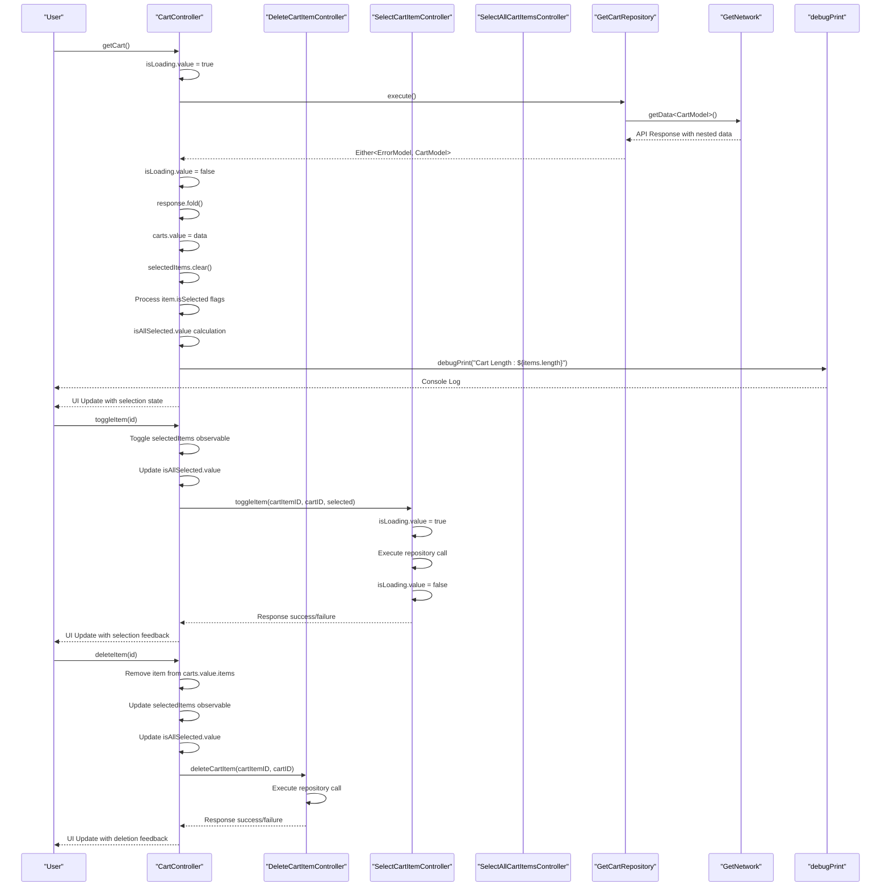

**Diagram sources**
- [cart_controller.dart:30-96](file://lib/features/cart/controller/cart_controller.dart#L30-L96)
- [delete_cart_item_controller.dart:9-25](file://lib/features/cart/controller/delete_cart_item_controller.dart#L9-L25)
- [select_cart_item_controller.dart:11-31](file://lib/features/cart/controller/select_cart_item_controller.dart#L11-L31)

**Section sources**
- [cart_controller.dart:1-97](file://lib/features/cart/controller/cart_controller.dart#L1-L97)

### Enhanced Cart Badge System
The cart badge system has been enhanced from a static hardcoded count to a dynamic reactive system using GetX Obx widgets and CartController for real-time updates:

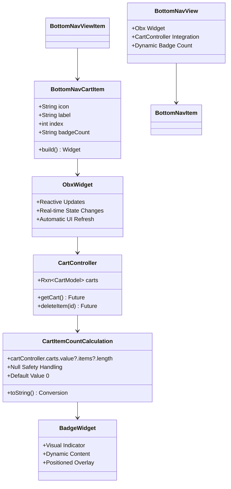

**Diagram sources**
- [bottom_nav_view.dart:64-75](file://lib/features/home/views/bottom_nav_view.dart#L64-L75)
- [bottom_nav_cart_item.dart:9-77](file://lib/features/home/widgets/bottom_nav_widgets/bottom_nav_cart_item.dart#L9-L77)
- [cart_controller.dart:22-23](file://lib/features/cart/controller/cart_controller.dart#L22-L23)

**Section sources**
- [bottom_nav_view.dart:64-75](file://lib/features/home/views/bottom_nav_view.dart#L64-L75)
- [bottom_nav_cart_item.dart:9-77](file://lib/features/home/widgets/bottom_nav_widgets/bottom_nav_cart_item.dart#L9-L77)
- [cart_controller.dart:22-23](file://lib/features/cart/controller/cart_controller.dart#L22-L23)

### Enhanced Selection System Implementation
The new selection system provides granular and bulk selection capabilities with comprehensive state management and deletion integration:

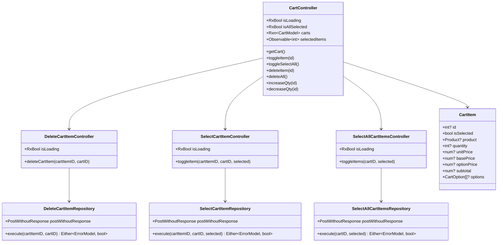

**Diagram sources**
- [cart_controller.dart:8-20](file://lib/features/cart/controller/cart_controller.dart#L8-L20)
- [delete_cart_item_controller.dart:6-8](file://lib/features/cart/controller/delete_cart_item_controller.dart#L6-L8)
- [select_cart_item_controller.dart:6-9](file://lib/features/cart/controller/select_cart_item_controller.dart#L6-L9)
- [select_all_cart_item_controller.dart:6-9](file://lib/features/cart/controller/select_all_cart_item_controller.dart#L6-L9)
- [cart_model.dart:68-89](file://lib/features/cart/models/cart_model.dart#L68-L89)

**Section sources**
- [cart_controller.dart:1-97](file://lib/features/cart/controller/cart_controller.dart#L1-L97)
- [delete_cart_item_controller.dart:1-27](file://lib/features/cart/controller/delete_cart_item_controller.dart#L1-L27)
- [select_cart_item_controller.dart:1-32](file://lib/features/cart/controller/select_cart_item_controller.dart#L1-L32)
- [select_all_cart_item_controller.dart:1-30](file://lib/features/cart/controller/select_all_cart_item_controller.dart#L1-L30)
- [cart_model.dart:68-120](file://lib/features/cart/models/cart_model.dart#L68-L120)

### Comprehensive Item Deletion System
The cart system now provides comprehensive item deletion capabilities with client-side state management and server synchronization:

```mermaid
classDiagram
class DeleteCartItemController {
+DeleteCartItemRepository deleteCartItemRepository
+Future<void> deleteCartItem({cartItemID, cartID})
+Error handling with ErrorSnackbar
+Debug logging for successful deletions
}
class DeleteCartItemRepository {
+PostWithoutResponse postWithoutResponse
+Future<Either<ErrorModel, bool>> execute({cartItemID, cartID})
+DELETE endpoint : /api/cart/item/{id}/remove
+JSON body : {"cart_id" : cartID}
+Proper error handling and response parsing
}
class CartController {
+deleteItem(id) - Enhanced with client-side state management
+Removes item from carts.value.items
+Updates selectedItems observable
+Updates isAllSelected.value
+Refreshes cart state
+Calls DeleteCartItemController for server sync
}
class CartItemBox {
+GestureDetector for delete button
+Circular delete button with trash icon
+Visual feedback on tap
+Integration with CartController.deleteItem
}
class CartView {
+Empty cart state detection
+Improved empty cart display
+Better user experience for empty carts
}
```

**Diagram sources**
- [delete_cart_item_controller.dart:6-25](file://lib/features/cart/controller/delete_cart_item_controller.dart#L6-L25)
- [delete_cart_item_repo.dart:8-22](file://lib/features/cart/repositories/delete_cart_item_repo.dart#L8-L22)
- [cart_controller.dart:80-89](file://lib/features/cart/controller/cart_controller.dart#L80-L89)
- [cart_item.dart:52-78](file://lib/features/cart/widgets/cart_view_widgets/cart_item.dart#L52-L78)
- [cart_view.dart:29-33](file://lib/features/cart/views/cart_view.dart#L29-L33)

**Section sources**
- [delete_cart_item_controller.dart:1-27](file://lib/features/cart/controller/delete_cart_item_controller.dart#L1-L27)
- [delete_cart_item_repo.dart:1-23](file://lib/features/cart/repositories/delete_cart_item_repo.dart#L1-L23)
- [cart_controller.dart:80-89](file://lib/features/cart/controller/cart_controller.dart#L80-L89)
- [cart_item.dart:52-78](file://lib/features/cart/widgets/cart_view_widgets/cart_item.dart#L52-L78)
- [cart_view.dart:29-33](file://lib/features/cart/views/cart_view.dart#L29-L33)

### Individual Item Deletion Implementation
The individual item deletion system provides precise control over cart items with comprehensive state management and visual feedback:

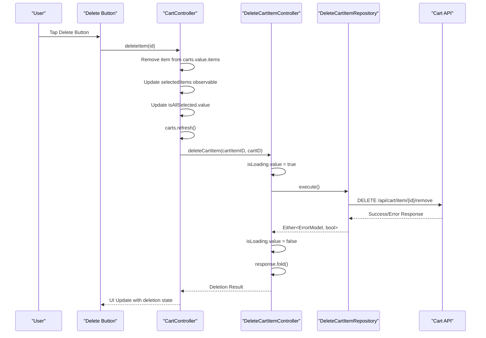

**Diagram sources**
- [cart_item.dart:52-78](file://lib/features/cart/widgets/cart_view_widgets/cart_item.dart#L52-L78)
- [cart_controller.dart:80-89](file://lib/features/cart/controller/cart_controller.dart#L80-L89)
- [delete_cart_item_controller.dart:9-25](file://lib/features/cart/controller/delete_cart_item_controller.dart#L9-L25)

**Section sources**
- [cart_item.dart:52-78](file://lib/features/cart/widgets/cart_view_widgets/cart_item.dart#L52-L78)
- [cart_controller.dart:80-89](file://lib/features/cart/controller/cart_controller.dart#L80-L89)
- [delete_cart_item_controller.dart:1-27](file://lib/features/cart/controller/delete_cart_item_controller.dart#L1-L27)

### Delete All Functionality
The bulk deletion system provides efficient management of multiple cart items simultaneously with improved UI integration:


**Diagram sources**
- [cart_select_item.dart:36-51](file://lib/features/cart/widgets/cart_view_widgets/cart_select_item.dart#L36-L51)
- [cart_controller.dart:91](file://lib/features/cart/controller/cart_controller.dart#L91)

**Section sources**
- [cart_select_item.dart:1-57](file://lib/features/cart/widgets/cart_view_widgets/cart_select_item.dart#L1-L57)
- [cart_controller.dart:91](file://lib/features/cart/controller/cart_controller.dart#L91)

### Granular Item Selection Capabilities
The individual item selection system provides precise control over cart items with server synchronization:

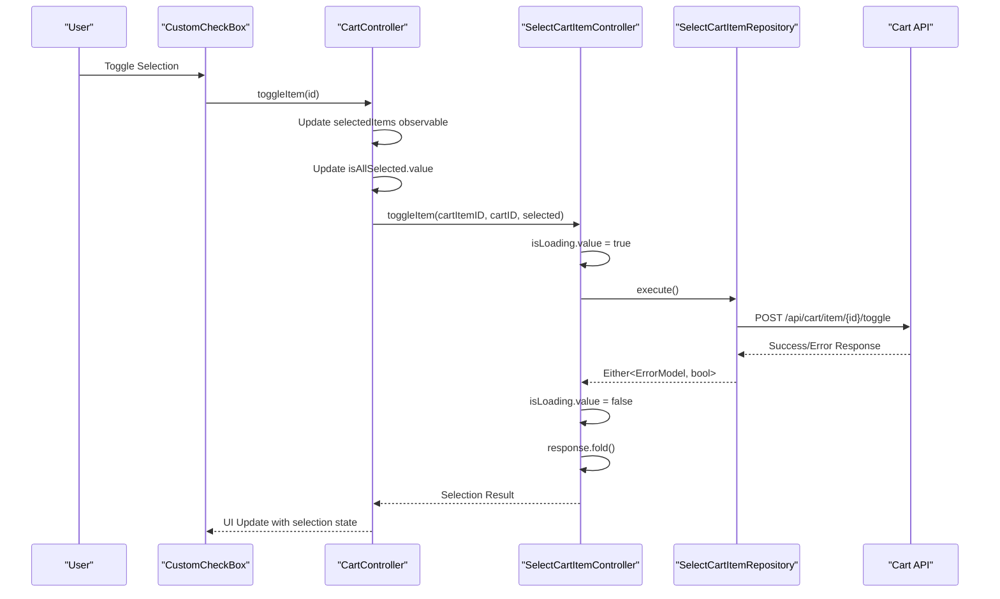

**Diagram sources**
- [cart_item_info.dart:38-47](file://lib/features/cart/widgets/cart_view_widgets/cart_item_info.dart#L38-L47)
- [cart_controller.dart:52-64](file://lib/features/cart/controller/cart_controller.dart#L52-L64)
- [select_cart_item_controller.dart:11-31](file://lib/features/cart/controller/select_cart_item_controller.dart#L11-L31)

**Section sources**
- [cart_item_info.dart:35-49](file://lib/features/cart/widgets/cart_view_widgets/cart_item_info.dart#L35-L49)
- [cart_controller.dart:52-64](file://lib/features/cart/controller/cart_controller.dart#L52-L64)
- [select_cart_item_controller.dart:1-32](file://lib/features/cart/controller/select_cart_item_controller.dart#L1-L32)

### Bulk Selection Operations
The bulk selection system provides efficient management of multiple cart items simultaneously:

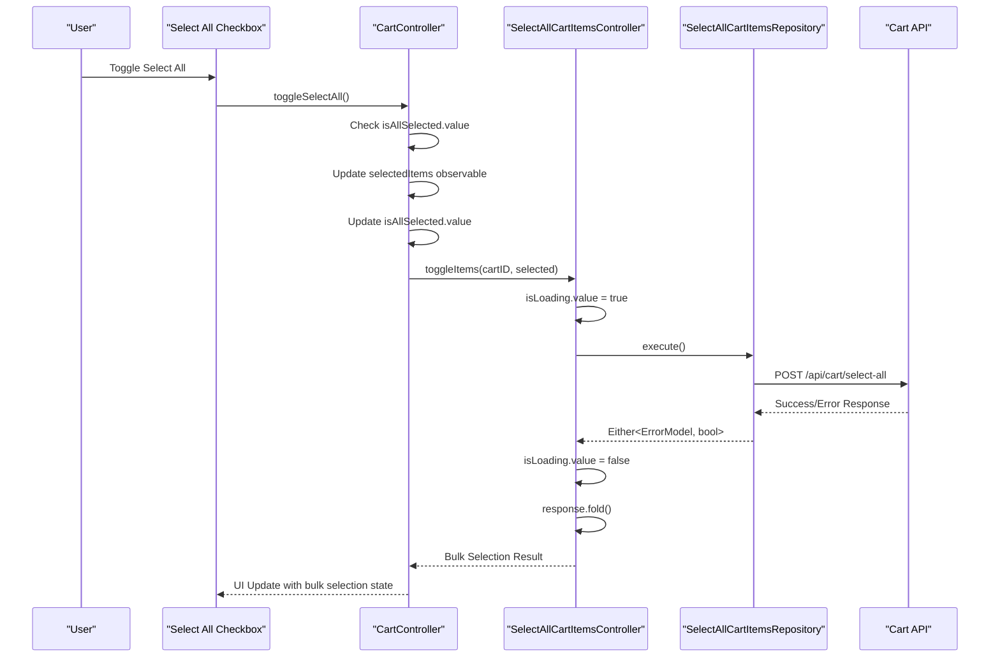

**Diagram sources**
- [cart_select_item.dart:22-26](file://lib/features/cart/widgets/cart_view_widgets/cart_select_item.dart#L22-L26)
- [cart_controller.dart:66-78](file://lib/features/cart/controller/cart_controller.dart#L66-L78)
- [select_all_cart_item_controller.dart:11-29](file://lib/features/cart/controller/select_all_cart_item_controller.dart#L11-L29)

**Section sources**
- [cart_select_item.dart:1-57](file://lib/features/cart/widgets/cart_view_widgets/cart_select_item.dart#L1-L57)
- [cart_controller.dart:66-78](file://lib/features/cart/controller/cart_controller.dart#L66-L78)
- [select_all_cart_item_controller.dart:1-30](file://lib/features/cart/controller/select_all_cart_item_controller.dart#L1-L30)

### Reactive State Management
The selection and deletion system implements comprehensive reactive state management for real-time updates:

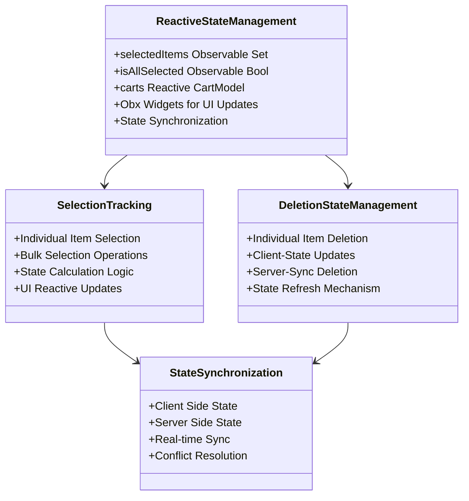

**Diagram sources**
- [cart_controller.dart:22-24](file://lib/features/cart/controller/cart_controller.dart#L22-L24)
- [cart_item_info.dart:38-47](file://lib/features/cart/widgets/cart_view_widgets/cart_item_info.dart#L38-L47)
- [cart_select_item.dart:22-26](file://lib/features/cart/widgets/cart_view_widgets/cart_select_item.dart#L22-L26)

**Section sources**
- [cart_controller.dart:22-24](file://lib/features/cart/controller/cart_controller.dart#L22-L24)
- [cart_item_info.dart:38-47](file://lib/features/cart/widgets/cart_view_widgets/cart_item_info.dart#L38-L47)
- [cart_select_item.dart:22-26](file://lib/features/cart/widgets/cart_view_widgets/cart_select_item.dart#L22-L26)

### Enhanced Repository Pattern Implementation
The repository pattern has been enhanced with dedicated selection and deletion endpoints and improved API response handling:

```mermaid
classDiagram
class GetCartRepository {
+GetNetwork getNetwork
+execute() Either~ErrorModel, CartModel~
+EnhancedParsing : json["data"]
+NestedDataSupport
}
class DeleteCartItemRepository {
+PostWithoutResponse postWithoutResponse
+execute(cartItemID, cartID) Either~ErrorModel, bool~
+DeleteEndpoint : /api/cart/item/{id}/remove
+JSON Body : {"cart_id" : cartID}
+ErrorHandling : Comprehensive
+LoadingStates : Reactive
}
class SelectCartItemRepository {
+PostWithoutResponse postWithoutResponse
+execute(cartItemID, cartID, selected) Either~ErrorModel, bool~
+ItemToggleEndpoint : /api/cart/item/{id}/toggle
+JSON Body : {"cart_id" : cartID, "selected" : selected}
}
class SelectAllCartItemsRepository {
+PostWithoutResponse postWithoutResponse
+execute(cartID, selected) Either~ErrorModel, bool~
+BulkToggleEndpoint : /api/cart/select-all
+JSON Body : {"cart_id" : cartID, "selected" : selected}
}
class CartModel {
+fromJson(Map json)
+NestedFieldMapping
+EnhancedValidation
+isSelected Property
}
class DebuggingIntegration {
+Real-timeMonitoring
+CartLengthLogging
+EnhancedErrorMessages
}
GetCartRepository --> CartModel
DeleteCartItemRepository --> CartModel
SelectCartItemRepository --> CartModel
SelectAllCartItemsRepository --> CartModel
```

**Diagram sources**
- [get_cart_repo.dart:11-18](file://lib/features/cart/repositories/get_cart_repo.dart#L11-L18)
- [delete_cart_item_repo.dart:12-22](file://lib/features/cart/repositories/delete_cart_item_repo.dart#L12-L22)
- [select_cart_item_repo.dart:12-23](file://lib/features/cart/repositories/select_cart_item_repo.dart#L12-L23)
- [select_all_cart_items_repo.dart:12-22](file://lib/features/cart/repositories/select_all_cart_items_repo.dart#L12-L22)
- [cart_model.dart:35-49](file://lib/features/cart/models/cart_model.dart#L35-L49)

**Section sources**
- [get_cart_repo.dart:11-18](file://lib/features/cart/repositories/get_cart_repo.dart#L11-L18)
- [delete_cart_item_repo.dart:1-23](file://lib/features/cart/repositories/delete_cart_item_repo.dart#L1-L23)
- [select_cart_item_repo.dart:1-24](file://lib/features/cart/repositories/select_cart_item_repo.dart#L1-L24)
- [select_all_cart_items_repo.dart:1-24](file://lib/features/cart/repositories/select_all_cart_items_repo.dart#L1-L24)
- [cart_model.dart:35-49](file://lib/features/cart/models/cart_model.dart#L35-L49)

### Improved UI Components with Deletion Features
The cart item components feature significant improvements in image handling, selection integration, deletion functionality, and layout:

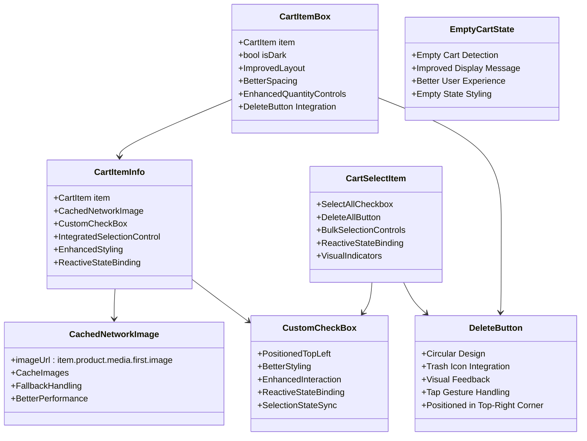

**Diagram sources**
- [cart_item.dart:11-103](file://lib/features/cart/widgets/cart_view_widgets/cart_item.dart#L11-L103)
- [cart_item_info.dart:11-99](file://lib/features/cart/widgets/cart_view_widgets/cart_item_info.dart#L11-L99)
- [cart_select_item.dart:10-57](file://lib/features/cart/widgets/cart_view_widgets/cart_select_item.dart#L10-L57)
- [cart_view.dart:29-33](file://lib/features/cart/views/cart_view.dart#L29-L33)

**Section sources**
- [cart_item.dart:1-103](file://lib/features/cart/widgets/cart_view_widgets/cart_item.dart#L1-L103)
- [cart_item_info.dart:1-99](file://lib/features/cart/widgets/cart_view_widgets/cart_item_info.dart#L1-L99)
- [cart_select_item.dart:1-57](file://lib/features/cart/widgets/cart_view_widgets/cart_select_item.dart#L1-L57)
- [cart_view.dart:29-33](file://lib/features/cart/views/cart_view.dart#L29-L33)

### Cart State Persistence and Synchronization
The selection and deletion system implements comprehensive state persistence and synchronization mechanisms:

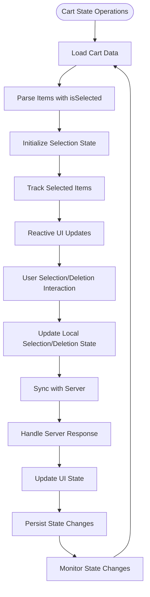

**Diagram sources**
- [cart_controller.dart:40-49](file://lib/features/cart/controller/cart_controller.dart#L40-L49)
- [cart_controller.dart:80-89](file://lib/features/cart/controller/cart_controller.dart#L80-L89)
- [cart_controller.dart:66-78](file://lib/features/cart/controller/cart_controller.dart#L66-L78)

**Section sources**
- [cart_controller.dart:40-49](file://lib/features/cart/controller/cart_controller.dart#L40-L49)
- [cart_controller.dart:80-89](file://lib/features/cart/controller/cart_controller.dart#L80-L89)
- [cart_controller.dart:66-78](file://lib/features/cart/controller/cart_controller.dart#L66-L78)

## Enhanced Selection System Implementation
The selection system implements comprehensive granular and bulk selection capabilities with reactive state management and deletion integration:

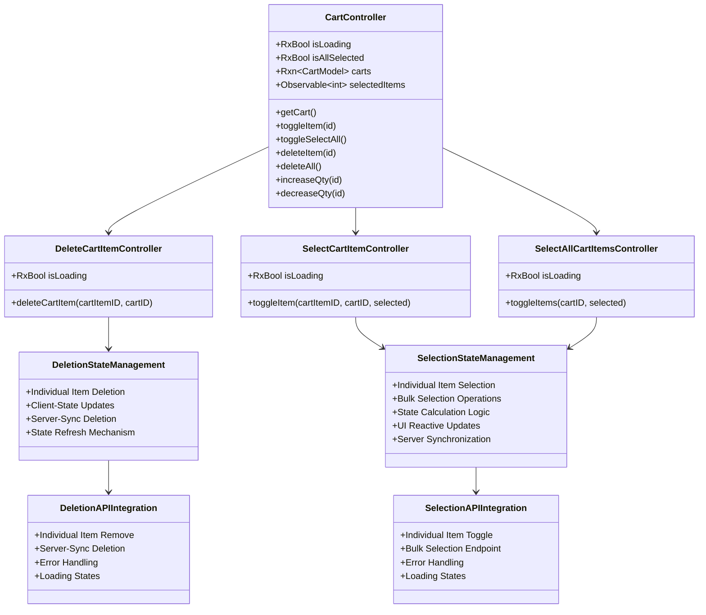

**Diagram sources**
- [cart_controller.dart:8-20](file://lib/features/cart/controller/cart_controller.dart#L8-L20)
- [delete_cart_item_controller.dart:6-8](file://lib/features/cart/controller/delete_cart_item_controller.dart#L6-L8)
- [select_cart_item_controller.dart:6-9](file://lib/features/cart/controller/select_cart_item_controller.dart#L6-L9)
- [select_all_cart_item_controller.dart:6-9](file://lib/features/cart/controller/select_all_cart_item_controller.dart#L6-L9)

**Section sources**
- [cart_controller.dart:1-97](file://lib/features/cart/controller/cart_controller.dart#L1-L97)
- [delete_cart_item_controller.dart:1-27](file://lib/features/cart/controller/delete_cart_item_controller.dart#L1-L27)
- [select_cart_item_controller.dart:1-32](file://lib/features/cart/controller/select_cart_item_controller.dart#L1-L32)
- [select_all_cart_item_controller.dart:1-30](file://lib/features/cart/controller/select_all_cart_item_controller.dart#L1-L30)

## Granular Item Selection Capabilities
The individual item selection system provides precise control over cart items with comprehensive state management:

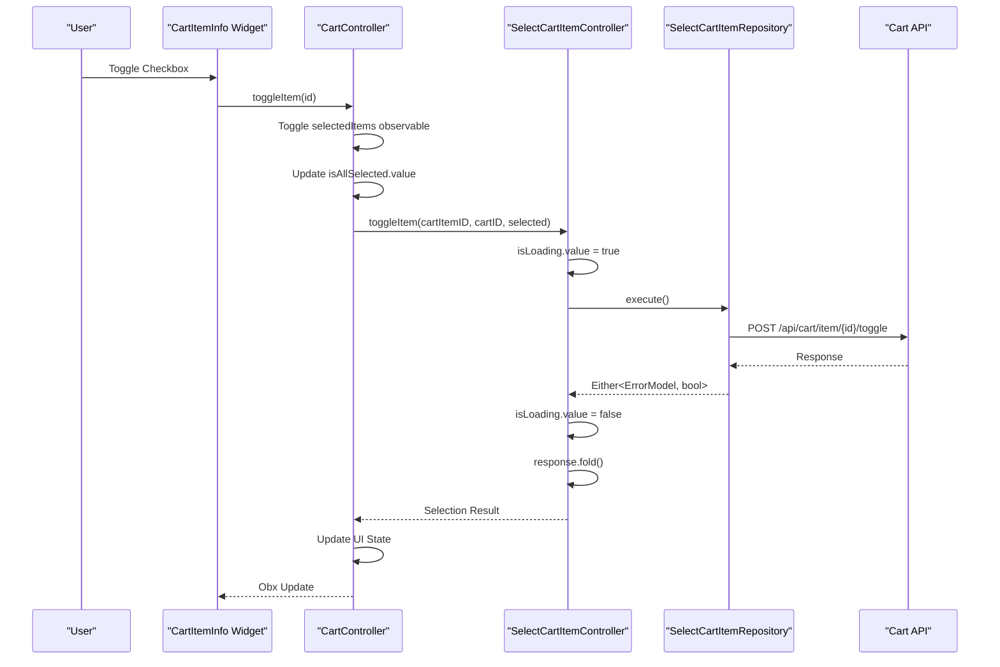

**Diagram sources**
- [cart_item_info.dart:38-47](file://lib/features/cart/widgets/cart_view_widgets/cart_item_info.dart#L38-L47)
- [cart_controller.dart:52-64](file://lib/features/cart/controller/cart_controller.dart#L52-L64)
- [select_cart_item_controller.dart:11-31](file://lib/features/cart/controller/select_cart_item_controller.dart#L11-L31)

**Section sources**
- [cart_item_info.dart:35-49](file://lib/features/cart/widgets/cart_view_widgets/cart_item_info.dart#L35-L49)
- [cart_controller.dart:52-64](file://lib/features/cart/controller/cart_controller.dart#L52-L64)
- [select_cart_item_controller.dart:1-32](file://lib/features/cart/controller/select_cart_item_controller.dart#L1-L32)

## Bulk Selection Operations
The bulk selection system provides efficient management of multiple cart items with optimized API communication:

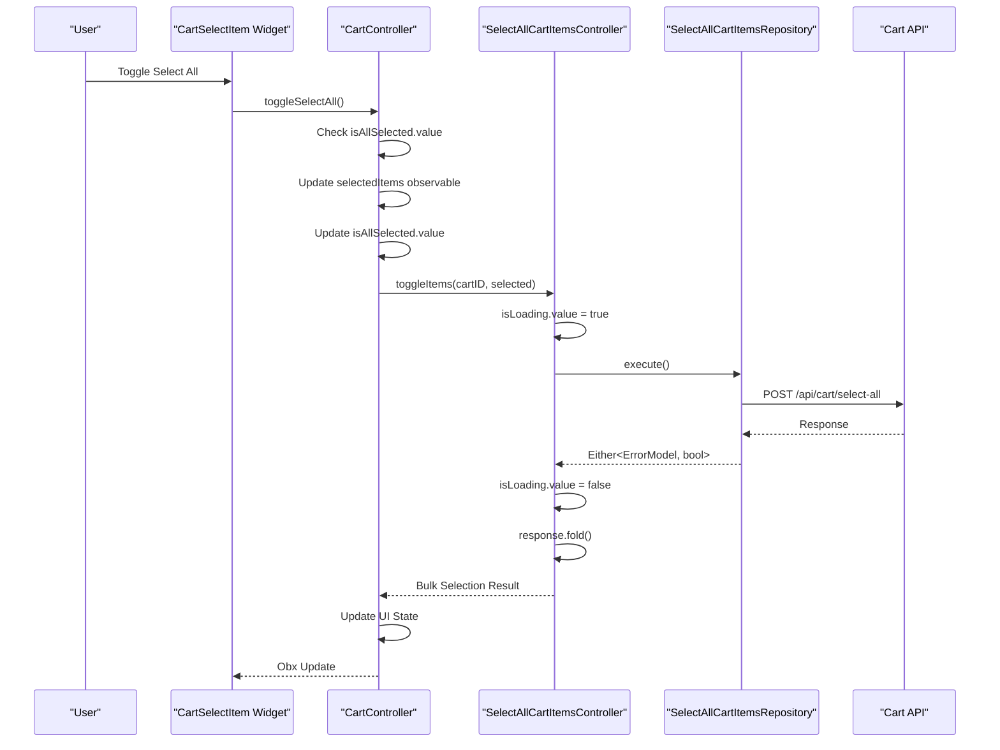

**Diagram sources**
- [cart_select_item.dart:22-26](file://lib/features/cart/widgets/cart_view_widgets/cart_select_item.dart#L22-L26)
- [cart_controller.dart:66-78](file://lib/features/cart/controller/cart_controller.dart#L66-L78)
- [select_all_cart_item_controller.dart:11-29](file://lib/features/cart/controller/select_all_cart_item_controller.dart#L11-L29)

**Section sources**
- [cart_select_item.dart:1-57](file://lib/features/cart/widgets/cart_view_widgets/cart_select_item.dart#L1-L57)
- [cart_controller.dart:66-78](file://lib/features/cart/controller/cart_controller.dart#L66-L78)
- [select_all_cart_item_controller.dart:1-30](file://lib/features/cart/controller/select_all_cart_item_controller.dart#L1-L30)

## Comprehensive Item Deletion System
The item deletion system provides comprehensive individual and bulk deletion capabilities with client-side state management and server synchronization:

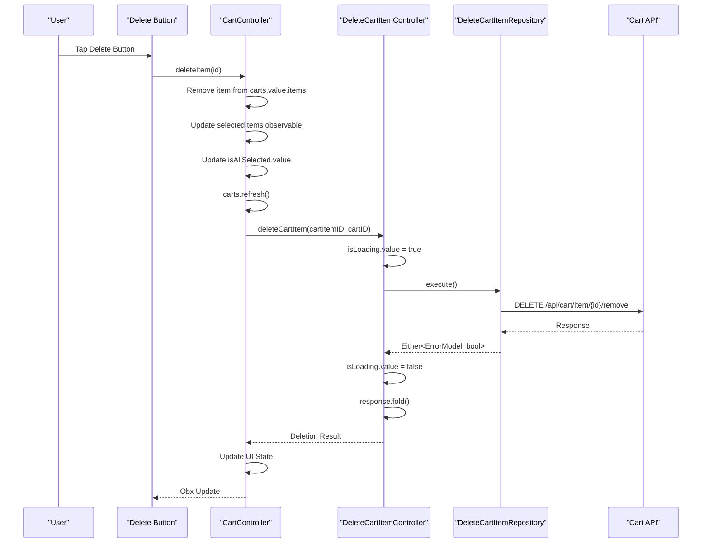

**Diagram sources**
- [cart_item.dart:52-78](file://lib/features/cart/widgets/cart_view_widgets/cart_item.dart#L52-L78)
- [cart_controller.dart:80-89](file://lib/features/cart/controller/cart_controller.dart#L80-L89)
- [delete_cart_item_controller.dart:9-25](file://lib/features/cart/controller/delete_cart_item_controller.dart#L9-L25)

**Section sources**
- [cart_item.dart:52-78](file://lib/features/cart/widgets/cart_view_widgets/cart_item.dart#L52-L78)
- [cart_controller.dart:80-89](file://lib/features/cart/controller/cart_controller.dart#L80-L89)
- [delete_cart_item_controller.dart:1-27](file://lib/features/cart/controller/delete_cart_item_controller.dart#L1-L27)

## Individual Item Deletion Implementation
The individual item deletion system provides precise control over cart items with comprehensive state management and visual feedback:


**Diagram sources**
- [cart_item.dart:52-78](file://lib/features/cart/widgets/cart_view_widgets/cart_item.dart#L52-L78)
- [cart_controller.dart:80-89](file://lib/features/cart/controller/cart_controller.dart#L80-L89)
- [delete_cart_item_controller.dart:9-25](file://lib/features/cart/controller/delete_cart_item_controller.dart#L9-L25)

**Section sources**
- [cart_item.dart:52-78](file://lib/features/cart/widgets/cart_view_widgets/cart_item.dart#L52-L78)
- [cart_controller.dart:80-89](file://lib/features/cart/controller/cart_controller.dart#L80-L89)
- [delete_cart_item_controller.dart:1-27](file://lib/features/cart/controller/delete_cart_item_controller.dart#L1-L27)

## Delete All Functionality
The bulk deletion system provides efficient management of multiple cart items with improved UI integration:

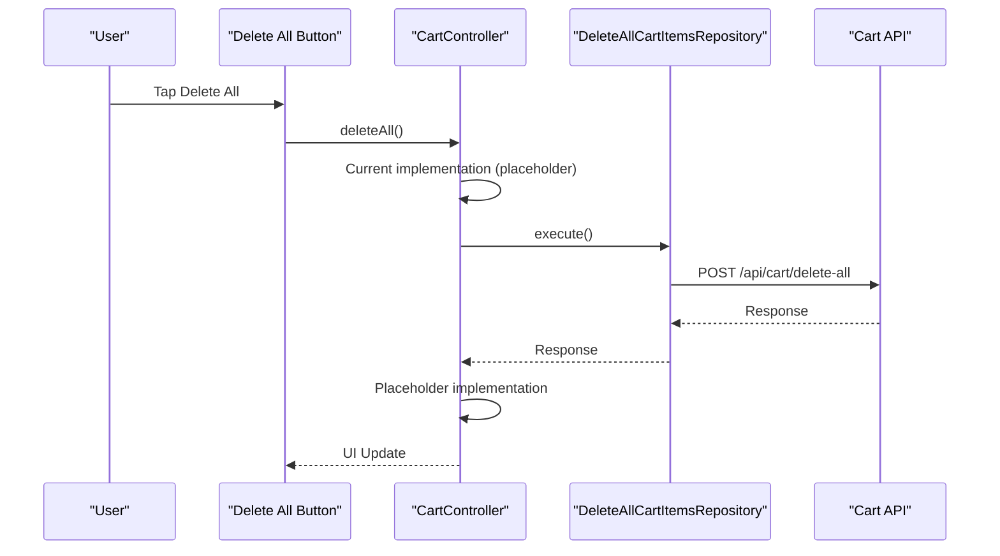

**Diagram sources**
- [cart_select_item.dart:36-51](file://lib/features/cart/widgets/cart_view_widgets/cart_select_item.dart#L36-L51)
- [cart_controller.dart:91](file://lib/features/cart/controller/cart_controller.dart#L91)

**Section sources**
- [cart_select_item.dart:1-57](file://lib/features/cart/widgets/cart_view_widgets/cart_select_item.dart#L1-L57)
- [cart_controller.dart:91](file://lib/features/cart/controller/cart_controller.dart#L91)

## Reactive State Management
The selection and deletion system implements comprehensive reactive state management for real-time updates and synchronization:

```mermaid
classDiagram
class ReactiveStateSystem {
+selectedItems Observable Set<int>
+isAllSelected Observable Bool
+carts Reactive CartModel
+Reactive UI Updates
+State Synchronization
+Error Handling
}
class SelectionStateCalculation {
+Individual Item State
+Bulk Selection State
+Partial Selection State
+State Validation
}
class DeletionStateCalculation {
+Individual Item Deletion
+Client-State Updates
+State Refresh Mechanism
+Selection State Adjustment
}
class StateSynchronizationMechanism {
+Client State Tracking
+Server State Updates
+Real-time Sync
+Conflict Resolution
}
class UIReactiveUpdates {
+Obx Widgets
+State Change Detection
+Selective UI Updates
+Performance Optimization
}
ReactiveStateSystem --> SelectionStateCalculation
ReactiveStateSystem --> DeletionStateCalculation
SelectionStateCalculation --> StateSynchronizationMechanism
DeletionStateCalculation --> StateSynchronizationMechanism
StateSynchronizationMechanism --> UIReactiveUpdates
```

**Diagram sources**
- [cart_controller.dart:22-24](file://lib/features/cart/controller/cart_controller.dart#L22-L24)
- [cart_controller.dart:40-49](file://lib/features/cart/controller/cart_controller.dart#L40-L49)

**Section sources**
- [cart_controller.dart:22-24](file://lib/features/cart/controller/cart_controller.dart#L22-L24)
- [cart_controller.dart:40-49](file://lib/features/cart/controller/cart_controller.dart#L40-L49)

## Enhanced Repository Pattern Implementation
The repository pattern has been enhanced with dedicated selection and deletion endpoints and comprehensive error handling:

```mermaid
classDiagram
class GetCartRepository {
+GetNetwork getNetwork
+execute() Either~ErrorModel, CartModel~
+EnhancedParsing : json["data"]
+NestedDataSupport
}
class DeleteCartItemRepository {
+PostWithoutResponse postWithoutResponse
+execute(cartItemID, cartID) Either~ErrorModel, bool~
+DeleteEndpoint : /api/cart/item/{id}/remove
+JSON Body : {"cart_id" : cartID}
+ErrorHandling : Comprehensive
+LoadingStates : Reactive
}
class SelectCartItemRepository {
+PostWithoutResponse postWithoutResponse
+execute(cartItemID, cartID, selected) Either~ErrorModel, bool~
+ItemToggleEndpoint : /api/cart/item/{id}/toggle
+JSON Body : {"cart_id" : cartID, "selected" : selected}
+ErrorHandling : Comprehensive
+LoadingStates : Reactive
}
class SelectAllCartItemsRepository {
+PostWithoutResponse postWithoutResponse
+execute(cartID, selected) Either~ErrorModel, bool~
+BulkToggleEndpoint : /api/cart/select-all
+JSON Body : {"cart_id" : cartID, "selected" : selected}
+ErrorHandling : Comprehensive
+LoadingStates : Reactive
}
class DeletionAPIEndpoints {
+Individual Item Remove
+Bulk Selection Endpoint
+Error Response Handling
+Success/Failure States
}
class SelectionAPIEndpoints {
+Individual Item Toggle
+Bulk Selection Endpoint
+Error Response Handling
+Success/Failure States
}
GetCartRepository --> DeletionAPIEndpoints
GetCartRepository --> SelectionAPIEndpoints
DeleteCartItemRepository --> DeletionAPIEndpoints
SelectCartItemRepository --> SelectionAPIEndpoints
SelectAllCartItemsRepository --> SelectionAPIEndpoints
```

**Diagram sources**
- [get_cart_repo.dart:11-18](file://lib/features/cart/repositories/get_cart_repo.dart#L11-L18)
- [delete_cart_item_repo.dart:12-22](file://lib/features/cart/repositories/delete_cart_item_repo.dart#L12-L22)
- [select_cart_item_repo.dart:12-23](file://lib/features/cart/repositories/select_cart_item_repo.dart#L12-L23)
- [select_all_cart_items_repo.dart:12-22](file://lib/features/cart/repositories/select_all_cart_items_repo.dart#L12-L22)

**Section sources**
- [get_cart_repo.dart:11-18](file://lib/features/cart/repositories/get_cart_repo.dart#L11-L18)
- [delete_cart_item_repo.dart:1-23](file://lib/features/cart/repositories/delete_cart_item_repo.dart#L1-L23)
- [select_cart_item_repo.dart:1-24](file://lib/features/cart/repositories/select_cart_item_repo.dart#L1-L24)
- [select_all_cart_items_repo.dart:1-24](file://lib/features/cart/repositories/select_all_cart_items_repo.dart#L1-L24)

## Improved UI Components with Deletion Features
The cart item components feature significant improvements in image handling, selection integration, deletion functionality, and user interaction:

```mermaid
classDiagram
class CartItemBox {
+CartItem item
+bool isDark
+ImprovedLayout
+BetterSpacing
+EnhancedQuantityControls
+DeleteButton Integration
}
class CartItemInfo {
+CartItem item
+CachedNetworkImage
+CustomCheckBox
+IntegratedSelectionControl
+EnhancedStyling
+ReactiveStateBinding
}
class CustomCheckBox {
+PositionedTopLeft
+BetterStyling
+EnhancedInteraction
+ReactiveStateBinding
+SelectionStateSync
+VisualFeedback
}
class DeleteButton {
+Circular Design
+Trash Icon Integration
+Visual Feedback
+Tap Gesture Handling
+Positioned in Top-Right Corner
+Proper Styling with Theme Colors
}
class CartSelectItem {
+SelectAllCheckbox
+DeleteAllButton
+BulkSelectionControls
+ReactiveStateBinding
+VisualIndicators
+Improved Styling
}
class EmptyCartState {
+Empty Cart Detection
+Improved Display Message
+Better User Experience
+Empty State Styling
+Centered Text Display
}
class SelectionVisualFeedback {
+Checkbox State Changes
+Selection Indicators
+Hover Effects
+Focus States
}
CartItemBox --> CartItemInfo
CartItemBox --> DeleteButton
CartItemInfo --> CustomCheckBox
CartSelectItem --> CustomCheckBox
CartSelectItem --> DeleteButton
CustomCheckBox --> SelectionVisualFeedback
DeleteButton --> SelectionVisualFeedback
```

**Diagram sources**
- [cart_item.dart:11-103](file://lib/features/cart/widgets/cart_view_widgets/cart_item.dart#L11-L103)
- [cart_item_info.dart:11-99](file://lib/features/cart/widgets/cart_view_widgets/cart_item_info.dart#L11-L99)
- [cart_select_item.dart:10-57](file://lib/features/cart/widgets/cart_view_widgets/cart_select_item.dart#L10-L57)
- [cart_view.dart:29-33](file://lib/features/cart/views/cart_view.dart#L29-L33)

**Section sources**
- [cart_item.dart:1-103](file://lib/features/cart/widgets/cart_view_widgets/cart_item.dart#L1-L103)
- [cart_item_info.dart:1-99](file://lib/features/cart/widgets/cart_view_widgets/cart_item_info.dart#L1-L99)
- [cart_select_item.dart:1-57](file://lib/features/cart/widgets/cart_view_widgets/cart_select_item.dart#L1-L57)
- [cart_view.dart:29-33](file://lib/features/cart/views/cart_view.dart#L29-L33)

## Performance Considerations
The enhanced cart system implements several performance optimization strategies for selection and deletion operations:

- **CachedNetworkImage**: Improved image loading performance with caching and fallback handling for product images
- **Reactive Updates**: Efficient state management with selective UI updates based on cart changes, selection state, and deletion operations
- **Enhanced Decimal Formatting**: Optimized toPrecision(2) calculations for consistent monetary display
- **Improved API Parsing**: Better error handling reduces unnecessary retries and network calls for selection and deletion operations
- **Debugging Integration**: Real-time monitoring helps identify performance bottlenecks in selection and deletion operations
- **Memory Management**: Proper disposal of cached images and reactive subscriptions for selection and deletion state
- **Layout Optimization**: Better spacing and alignment reduce rendering overhead in selection and deletion enabled components
- **Enhanced Error Handling**: Prevents cascading failures and improves system stability during selection and deletion operations
- **Nested Data Parsing**: Efficient handling of API response structures reduces parsing overhead for cart data
- **Selection State Optimization**: Observable collections for efficient selection tracking and UI updates
- **Deletion State Management**: Optimized client-side state updates prevent redundant API calls for deletion operations
- **API Endpoint Efficiency**: Dedicated endpoints for individual and bulk selection and deletion operations reduce payload sizes
- **State Synchronization**: Optimized client-server state synchronization prevents redundant API calls for both selection and deletion operations
- **Empty Cart Optimization**: Efficient empty cart state detection reduces unnecessary UI updates and rendering
- **Dynamic Badge System**: Real-time cart item count updates without performance impact through reactive state management

## Troubleshooting Guide
Enhanced troubleshooting procedures for the improved cart system with selection and deletion capabilities:

**Selection State Issues**
- Verify selectedItems observable properly tracks item IDs and updates reactively
- Check isAllSelected calculation logic matches selection state
- Ensure selection state persists across cart refresh operations
- Verify reactive state updates trigger UI rebuilds correctly

**Individual Item Selection Problems**
- Confirm SelectCartItemController properly handles toggleItem requests
- Check SelectCartItemRepository executes correct API endpoint (/api/cart/item/{id}/toggle)
- Verify item selection state syncs with server responses
- Ensure error handling displays appropriate feedback for selection failures

**Bulk Selection Operations**
- Verify SelectAllCartItemsController handles bulk toggle requests correctly
- Check SelectAllCartItemsRepository executes correct API endpoint (/api/cart/select-all)
- Ensure bulk selection state updates all items consistently
- Verify partial selection scenarios handled properly

**Individual Item Deletion Problems**
- Confirm DeleteCartItemController properly handles deleteCartItem requests
- Check DeleteCartItemRepository executes correct API endpoint (/api/cart/item/{id}/remove)
- Verify item deletion state syncs with server responses
- Ensure error handling displays appropriate feedback for deletion failures
- Check that client-side state updates occur before server calls

**Delete All Functionality**
- Verify CartController.deleteAll method is properly integrated
- Check for proper implementation of bulk deletion operations
- Ensure UI integration with delete all button works correctly
- Verify state management for bulk deletion operations

**Cart Badge System Issues**
- Confirm BottomNavView Obx widget properly accesses CartController
- Check that cartController.carts.value?.items?.length returns correct count
- Verify badgeCount.toString() conversion works properly
- Ensure reactive updates trigger UI refresh when cart items change
- Check that ValueKey(count) prevents unnecessary widget rebuilds

**API Response Parsing Errors**
- Confirm nested data structure matches expected format for cart data
- Check field mapping in CartModel.fromJson includes isSelected property
- Verify error handling catches parsing exceptions for selection and deletion data
- Ensure graceful degradation for malformed API responses

**UI Component Issues**
- Confirm CustomCheckBox properly binds to selection state observables
- Check Obx widgets update correctly when selection or deletion state changes
- Verify selection and deletion visual feedback displays appropriate states
- Ensure checkbox positioning remains consistent across different screen sizes
- Check delete button positioning and visual feedback

**State Synchronization Problems**
- Verify client-side selection and deletion state updates server-side state correctly
- Check for conflicts between client and server selection and deletion states
- Ensure selection and deletion state remains consistent across app navigation
- Verify selection and deletion state persists through app restarts

**Performance Issues**
- Monitor selection and deletion operation performance with large cart contents
- Check for memory leaks in selection and deletion state observables
- Verify UI updates don't cause excessive rebuild cycles
- Ensure selection and deletion operations don't block main thread execution
- Monitor empty cart state detection performance
- Check reactive badge system performance with frequent cart updates

**Section sources**
- [cart_controller.dart:1-97](file://lib/features/cart/controller/cart_controller.dart#L1-L97)
- [delete_cart_item_controller.dart:1-27](file://lib/features/cart/controller/delete_cart_item_controller.dart#L1-L27)
- [select_cart_item_controller.dart:1-32](file://lib/features/cart/controller/select_cart_item_controller.dart#L1-L32)
- [select_all_cart_item_controller.dart:1-30](file://lib/features/cart/controller/select_all_cart_item_controller.dart#L1-L30)
- [cart_item.dart:52-78](file://lib/features/cart/widgets/cart_view_widgets/cart_item.dart#L52-L78)
- [cart_select_item.dart:36-51](file://lib/features/cart/widgets/cart_view_widgets/cart_select_item.dart#L36-L51)
- [bottom_nav_view.dart:64-75](file://lib/features/home/views/bottom_nav_view.dart#L64-L75)
- [bottom_nav_cart_item.dart:9-77](file://lib/features/home/widgets/bottom_nav_widgets/bottom_nav_cart_item.dart#L9-L77)

## Conclusion
The Shopping Cart system in ZB-DEZINE has been significantly enhanced with granular item selection capabilities, bulk selection operations, comprehensive item deletion functionality, reactive state management, and improved UI components. The system maintains its modernized API-driven architecture while adding robust selection management, performance optimizations, and streamlined cart deletion operations.

**Updated** Key enhancements include granular item selection capabilities through new SelectCartItemController and SelectAllCartItemsController, comprehensive selection management with reactive state handling, comprehensive item deletion through new DeleteCartItemController and DeleteCartItemRepository, improved UI components with integrated selection and deletion features, expanded repository pattern implementation with dedicated selection and deletion endpoints, enhanced cart state synchronization across selection and deletion operations, and comprehensive debugging capabilities for cart management operations.

The enhanced system features:
- **Granular Selection Management**: Individual item selection with server synchronization and client-side state tracking
- **Bulk Selection Operations**: Comprehensive bulk selection capabilities with optimized API communication
- **Comprehensive Item Deletion**: Individual item removal with client-side state updates and server synchronization
- **Delete All Functionality**: Bulk deletion operations with improved user interface integration
- **Enhanced State Synchronization**: Real-time state updates between client and server for selection and deletion changes
- **Improved API Integration**: Better nested data structure handling and enhanced error management for selection and deletion operations
- **Enhanced UI Components**: CachedNetworkImage for better image performance, integrated selection checkbox positioning, and circular delete buttons with visual feedback
- **Reactive Calculations**: Dynamic pricing updates with consistent decimal formatting
- **Debugging Support**: Real-time monitoring and enhanced error logging capabilities for selection and deletion operations
- **Performance Optimizations**: Cached image loading, efficient state management, and optimized API communication for both selection and deletion
- **Dynamic Cart Badge System**: Real-time cart item count display with reactive updates using GetX Obx widgets and CartController
- **Maintainable Architecture**: Clear separation of concerns with enhanced repository pattern implementation
- **Scalable Design**: Modular components ready for future enhancements like advanced inventory validation and promotional discount systems
- **Robust Error Handling**: Comprehensive error handling for selection, deletion, and state synchronization operations
- **User Experience Enhancement**: Intuitive selection and deletion controls with visual feedback and responsive state updates
- **Empty Cart State Handling**: Improved empty cart detection and display with better user experience

The system is designed for optimal performance with clear separation of concerns, making it easy to extend with additional features while maintaining reliability and responsiveness for production use with comprehensive selection and deletion management capabilities.