# Shopping Cart System

<cite>
**Referenced Files in This Document**
- [cart_controller.dart](file://lib/features/cart/controller/cart_controller.dart)
- [select_cart_item_controller.dart](file://lib/features/cart/controller/select_cart_item_controller.dart)
- [select_all_cart_item_controller.dart](file://lib/features/cart/controller/select_all_cart_item_controller.dart)
- [add_to_cart_controller.dart](file://lib/features/cart/controller/add_to_cart_controller.dart)
- [checkout_controller.dart](file://lib/features/cart/controller/checkout_controller.dart)
- [cart_model.dart](file://lib/features/cart/models/cart_model.dart)
- [order_item_model.dart](file://lib/features/cart/models/order_item_model.dart)
- [get_cart_repo.dart](file://lib/features/cart/repositories/get_cart_repo.dart)
- [add_to_cart_repo.dart](file://lib/features/cart/repositories/add_to_cart_repo.dart)
- [select_cart_item_repo.dart](file://lib/features/cart/repositories/select_cart_item_repo.dart)
- [select_all_cart_items_repo.dart](file://lib/features/cart/repositories/select_all_cart_items_repo.dart)
- [cart_bindings.dart](file://lib/features/cart/bindings/cart_bindings.dart)
- [cart_view.dart](file://lib/features/cart/views/cart_view.dart)
- [checkout_view.dart](file://lib/features/cart/views/checkout_view.dart)
- [cart_item.dart](file://lib/features/cart/widgets/cart_view_widgets/cart_item.dart)
- [cart_item_info.dart](file://lib/features/cart/widgets/cart_view_widgets/cart_item_info.dart)
- [cart_order_summery.dart](file://lib/features/cart/widgets/cart_view_widgets/cart_order_summery.dart)
- [cart_select_item.dart](file://lib/features/cart/widgets/cart_view_widgets/cart_select_item.dart)
- [checkout_order_summery.dart](file://lib/features/cart/widgets/checkout_view_widgets/checkout_order_summery.dart)
- [checkout_order_calculation.dart](file://lib/features/cart/widgets/checkout_view_widgets/checkout_order_calculation.dart)
- [bottom_nav_view.dart](file://lib/features/home/views/bottom_nav_view.dart)
- [bottom_nav_controller.dart](file://lib/features/home/controller/bottom_nav_controller.dart)
- [bottom_nav_cart_item.dart](file://lib/features/home/widgets/bottom_nav_widgets/bottom_nav_cart_item.dart)
- [home_product_design.dart](file://lib/features/home/widgets/home_widgets/home_product_design.dart)
- [product_details_cart.dart](file://lib/features/product_details.dart/widgets/product_details_view_widgets/product_details_cart.dart)
- [product_details_bindings.dart](file://lib/features/product_details.dart/bindings/product_details_bindings.dart)
- [storage_service.dart](file://lib/core/data/local/storage_service.dart)
- [icons_path.dart](file://lib/core/constant/icons_path.dart)
</cite>

## Update Summary
**Changes Made**
- **Enhanced Cart Selection System**: Added granular item selection capabilities with new SelectCartItemController and SelectAllCartItemsController
- **Comprehensive Selection Management**: Implemented reactive state management for individual and bulk cart item selection
- **Improved UI Components**: Enhanced cart item widgets with integrated selection checkboxes and improved user interaction
- **Advanced Repository Pattern**: Added new repositories for individual item toggling and bulk selection operations
- **Enhanced Cart State Handling**: Improved cart controller with selection tracking and bulk operation support
- **Expanded Binding Architecture**: Updated cart bindings to include new selection controllers and repositories

## Table of Contents
1. [Introduction](#introduction)
2. [Project Structure](#project-structure)
3. [Core Components](#core-components)
4. [Architecture Overview](#architecture-overview)
5. [Detailed Component Analysis](#detailed-component-analysis)
6. [Enhanced Selection System Implementation](#enhanced-selection-system-implementation)
7. [Granular Item Selection Capabilities](#granular-item-selection-capabilities)
8. [Bulk Selection Operations](#bulk-selection-operations)
9. [Reactive State Management](#reactive-state-management)
10. [Enhanced Repository Pattern Implementation](#enhanced-repository-pattern-implementation)
11. [Improved UI Components with Selection Features](#improved-ui-components-with-selection-features)
12. [Cart State Persistence and Synchronization](#cart-state-persistence-and-synchronization)
13. [Performance Considerations](#performance-considerations)
14. [Troubleshooting Guide](#troubleshooting-guide)
15. [Conclusion](#conclusion)

## Introduction
This document describes the comprehensive Shopping Cart system within the ZB-DEZINE Flutter application. The system has undergone significant enhancements including granular item selection capabilities, bulk selection operations, reactive state management, and improved UI components. The system maintains its modernized API-driven architecture with repository pattern implementation while adding robust selection management and performance optimizations.

**Updated** The cart system has been enhanced with granular item selection capabilities through new SelectCartItemController and SelectAllCartItemsController, comprehensive selection management with reactive state handling, improved UI components with integrated selection checkboxes, expanded repository pattern implementation with dedicated selection endpoints, and enhanced cart state synchronization across selection operations.

## Project Structure
The shopping cart functionality is organized into an enhanced API-driven architecture with improved repository pattern implementation, granular selection capabilities, and redesigned UI components:

```mermaid
graph TB
subgraph "Enhanced Selection Management Architecture"
CC["CartController<br/>Enhanced State Management"] --> GCR["GetCartRepository<br/>Improved API Parsing"]
CC --> SCI["SelectCartItemController<br/>Individual Item Selection"]
CC --> SAC["SelectAllCartItemsController<br/>Bulk Selection Operations"]
CC --> CM["CartModel<br/>Enhanced Serialization"]
GCR --> GN["GetNetwork<br/>HTTP Client"]
SCI --> SCIR["SelectCartItemRepository<br/>Item Toggle Endpoint"]
SAC --> SACR["SelectAllCartItemsRepository<br/>Bulk Toggle Endpoint"]
end
subgraph "Enhanced UI Components"
CIB["CartItemBox<br/>Enhanced Item Widget"] --> CII["CartItemInfo<br/>Selection-Aware Image Handling"]
CII --> CNI["CachedNetworkImage<br/>Better Product Images"]
CII --> CBC["CustomCheckBox<br/>Integrated Selection Control"]
CIB --> QTY["Quantity Controls<br/>Improved Layout"]
CSI["CartSelectItem<br/>Bulk Selection Header"] --> BULK["Select All Checkbox"]
CSI --> DELETE["Delete All Button"]
end
subgraph "Reactive Order Summary"
COS["CartOrderSummery<br/>Dynamic Pricing"] --> RX["Reactive Calculations"]
COS --> PRECISION["toPrecision(2)<br/>Decimal Formatting"]
end
subgraph "Selection State Management"
SELECTED["selectedItems Observable<br/>Track Selected Items"] --> STATE["Reactive State Updates"]
STATE --> SYNC["State Synchronization<br/>With Server"]
SYNC --> ERROR["Enhanced Error Handling<br/>Selection Failures"]
end
```

**Diagram sources**
- [cart_controller.dart:1-85](file://lib/features/cart/controller/cart_controller.dart#L1-L85)
- [select_cart_item_controller.dart:1-32](file://lib/features/cart/controller/select_cart_item_controller.dart#L1-L32)
- [select_all_cart_item_controller.dart:1-30](file://lib/features/cart/controller/select_all_cart_item_controller.dart#L1-L30)
- [cart_item_info.dart:35-49](file://lib/features/cart/widgets/cart_view_widgets/cart_item_info.dart#L35-L49)
- [cart_select_item.dart:22-26](file://lib/features/cart/widgets/cart_view_widgets/cart_select_item.dart#L22-L26)

**Section sources**
- [cart_controller.dart:1-85](file://lib/features/cart/controller/cart_controller.dart#L1-L85)
- [select_cart_item_controller.dart:1-32](file://lib/features/cart/controller/select_cart_item_controller.dart#L1-L32)
- [select_all_cart_item_controller.dart:1-30](file://lib/features/cart/controller/select_all_cart_item_controller.dart#L1-L30)
- [cart_item_info.dart:1-99](file://lib/features/cart/widgets/cart_view_widgets/cart_item_info.dart#L1-L99)
- [cart_select_item.dart:1-53](file://lib/features/cart/widgets/cart_view_widgets/cart_select_item.dart#L1-L53)

## Core Components
The cart system consists of enhanced components with improved functionality, granular selection capabilities, and modernized architecture:

- **CartController**: Enhanced state management with selection tracking, debugging capabilities, and improved API integration
- **SelectCartItemController**: New controller for individual item selection toggling with loading states and error handling
- **SelectAllCartItemsController**: New controller for bulk selection operations with comprehensive state management
- **GetCartRepository**: Improved API response parsing with nested data structure handling and better error management
- **SelectCartItemRepository**: New repository for individual item selection API communication
- **SelectAllCartItemsRepository**: New repository for bulk selection API operations
- **CartModel**: Enhanced serialization support with comprehensive JSON parsing for cart items, options, and selection state
- **CartItem**: Enhanced item model with isSelected boolean property and selection tracking
- **CartItemBox**: Redesigned item component with improved layout and better quantity control positioning
- **CartItemInfo**: Enhanced item information component with CachedNetworkImage for better image handling and integrated selection checkbox
- **CartSelectItem**: Enhanced header component with bulk selection controls and delete all functionality
- **CartOrderSummery**: Reactive order summary with dynamic pricing calculations and decimal precision formatting
- **CheckoutOrderCalculation**: Enhanced checkout pricing with promotional discount handling
- **Debugging Integration**: Real-time cart length monitoring and enhanced error logging for selection operations

Key enhancements include:
- **Granular Selection Management**: Individual item selection with server synchronization and client-side state tracking
- **Bulk Selection Operations**: Comprehensive bulk selection capabilities with optimized API communication
- **Enhanced State Synchronization**: Real-time state updates between client and server for selection changes
- **Improved API Response Parsing**: Repository now handles nested "data" structure from API responses
- **Enhanced Image Handling**: CachedNetworkImage provides better performance and fallback handling
- **Better Checkbox Positioning**: CustomCheckBox positioned correctly in top-left corner of product image with reactive state binding
- **Reactive Pricing Calculations**: Dynamic price updates based on cart state changes
- **Debugging Support**: Real-time cart length monitoring and enhanced error logging for selection operations
- **Decimal Precision**: Consistent two-decimal formatting for all monetary values
- **Improved Layout**: Better spacing and alignment in cart item components with selection integration

**Section sources**
- [cart_controller.dart:1-85](file://lib/features/cart/controller/cart_controller.dart#L1-L85)
- [select_cart_item_controller.dart:1-32](file://lib/features/cart/controller/select_cart_item_controller.dart#L1-L32)
- [select_all_cart_item_controller.dart:1-30](file://lib/features/cart/controller/select_all_cart_item_controller.dart#L1-L30)
- [cart_model.dart:68-120](file://lib/features/cart/models/cart_model.dart#L68-L120)
- [cart_item_info.dart:35-49](file://lib/features/cart/widgets/cart_view_widgets/cart_item_info.dart#L35-L49)
- [cart_select_item.dart:22-26](file://lib/features/cart/widgets/cart_view_widgets/cart_select_item.dart#L22-L26)

## Architecture Overview
The cart system follows an enhanced API-driven architecture with improved repository pattern implementation, granular selection capabilities, and debugging integration:

```mermaid
graph TB
subgraph "Enhanced Selection Management Layer"
CC["CartController<br/>Enhanced Reactive State"] --> DEBUG["debugPrint<br/>Cart Monitoring"]
CC --> GCR["GetCartRepository<br/>Improved API Parsing"]
CC --> SCI["SelectCartItemController<br/>Individual Selection"]
CC --> SAC["SelectAllCartItemsController<br/>Bulk Selection"]
CC --> CM["CartModel<br/>Enhanced Serialization"]
CC --> SELECTED["selectedItems Observable<br/>Selection Tracking"]
end
subgraph "Enhanced Repository Layer"
GCR --> GN["GetNetwork<br/>HTTP Client"]
SCI --> SCIR["SelectCartItemRepository<br/>Item Toggle Endpoint"]
SAC --> SACR["SelectAllCartItemsRepository<br/>Bulk Toggle Endpoint"]
GCR --> PARSE["Nested Data Parsing<br/>json['data'] wrapper"]
GCR --> ERROR["Enhanced Error Handling<br/>Better Error Messages"]
SCIR --> ITEM_API["/api/cart/item/{id}/toggle<br/>Individual Item Toggle"]
SACR --> BULK_API["/api/cart/select-all<br/>Bulk Selection Endpoint"]
end
subgraph "Enhanced UI Components"
CIB["CartItemBox<br/>Improved Layout"] --> CII["CartItemInfo<br/>CachedNetworkImage"]
CII --> CNI["CachedNetworkImage<br/>Better Performance"]
CII --> CBC["CustomCheckBox<br/>Top-Left Positioning<br/>Reactive Selection Binding"]
CIB --> QTY["Quantity Controls<br/>Better Spacing"]
CSI["CartSelectItem<br/>Bulk Selection Header"] --> BULK_CB["Select All Checkbox<br/>Reactive State Binding"]
CSI --> DELETE_BTN["Delete All Button<br/>Bulk Operation"]
COS["CartOrderSummery<br/>Reactive Calculations"] --> RX["toPrecision(2)<br/>Decimal Formatting"]
end
subgraph "Selection State Management"
SELECTED --> STATE_SYNC["State Synchronization<br/>Client-Server Sync"]
STATE_SYNC --> SERVER_UPDATE["Server API Calls<br/>Selection Updates"]
SERVER_UPDATE --> ERROR_HANDLING["Enhanced Error Handling<br/>Selection Failures"]
ERROR_HANDLING --> USER_FEEDBACK["Error Snackbar<br/>User Feedback"]
END
```

**Diagram sources**
- [cart_controller.dart:1-85](file://lib/features/cart/controller/cart_controller.dart#L1-L85)
- [select_cart_item_controller.dart:1-32](file://lib/features/cart/controller/select_cart_item_controller.dart#L1-L32)
- [select_all_cart_item_controller.dart:1-30](file://lib/features/cart/controller/select_all_cart_item_controller.dart#L1-L30)
- [cart_item_info.dart:35-49](file://lib/features/cart/widgets/cart_view_widgets/cart_item_info.dart#L35-L49)
- [cart_select_item.dart:22-26](file://lib/features/cart/widgets/cart_view_widgets/cart_select_item.dart#L22-L26)

## Detailed Component Analysis

### Enhanced Cart Controller Implementation
The CartController now includes comprehensive selection management capabilities with improved debugging and state synchronization:

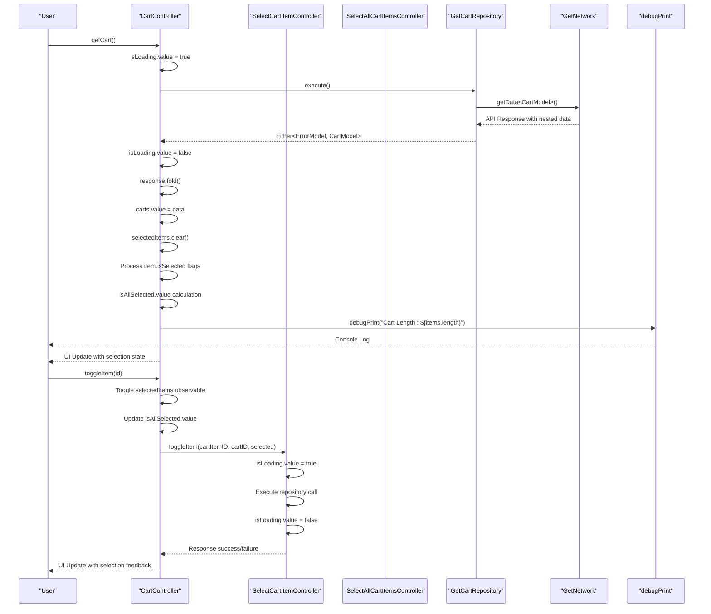

**Diagram sources**
- [cart_controller.dart:27-85](file://lib/features/cart/controller/cart_controller.dart#L27-L85)
- [select_cart_item_controller.dart:11-31](file://lib/features/cart/controller/select_cart_item_controller.dart#L11-L31)

**Section sources**
- [cart_controller.dart:1-85](file://lib/features/cart/controller/cart_controller.dart#L1-L85)

### Enhanced Selection System Implementation
The new selection system provides granular and bulk selection capabilities with comprehensive state management:

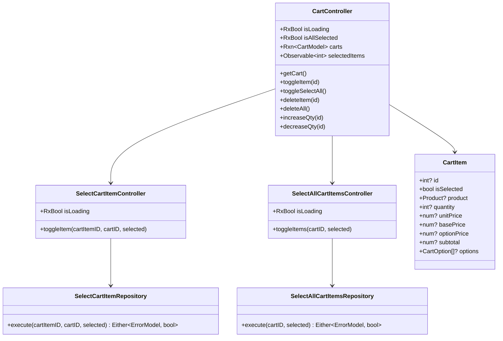

**Diagram sources**
- [cart_controller.dart:8-21](file://lib/features/cart/controller/cart_controller.dart#L8-L21)
- [select_cart_item_controller.dart:6-9](file://lib/features/cart/controller/select_cart_item_controller.dart#L6-L9)
- [select_all_cart_item_controller.dart:6-9](file://lib/features/cart/controller/select_all_cart_item_controller.dart#L6-L9)
- [cart_model.dart:68-89](file://lib/features/cart/models/cart_model.dart#L68-L89)

**Section sources**
- [cart_controller.dart:1-85](file://lib/features/cart/controller/cart_controller.dart#L1-L85)
- [select_cart_item_controller.dart:1-32](file://lib/features/cart/controller/select_cart_item_controller.dart#L1-L32)
- [select_all_cart_item_controller.dart:1-30](file://lib/features/cart/controller/select_all_cart_item_controller.dart#L1-L30)
- [cart_model.dart:68-120](file://lib/features/cart/models/cart_model.dart#L68-L120)

### Granular Item Selection Capabilities
The individual item selection system provides precise control over cart items with server synchronization:

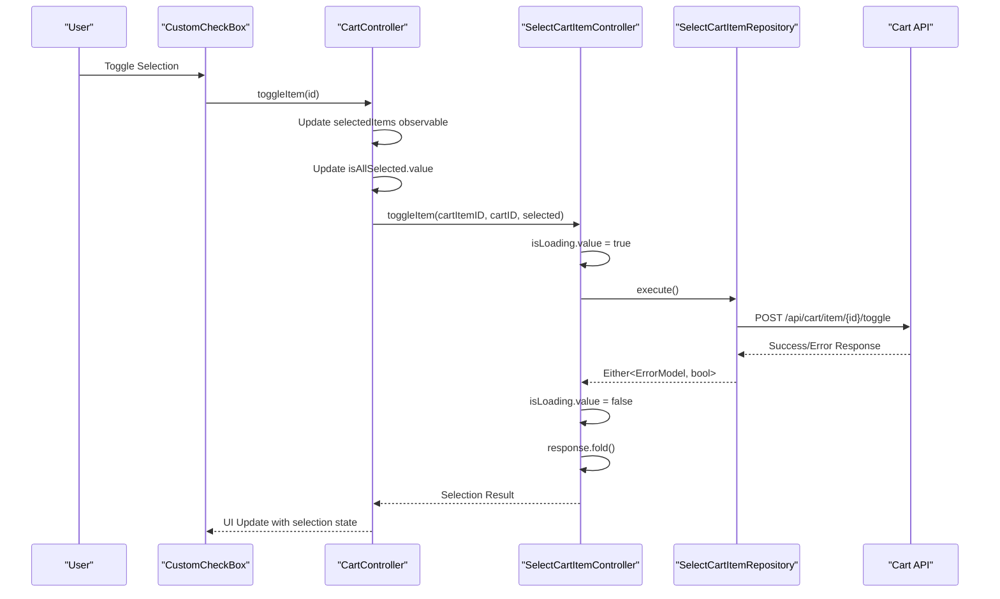

**Diagram sources**
- [cart_item_info.dart:38-47](file://lib/features/cart/widgets/cart_view_widgets/cart_item_info.dart#L38-L47)
- [cart_controller.dart:49-61](file://lib/features/cart/controller/cart_controller.dart#L49-L61)
- [select_cart_item_controller.dart:11-31](file://lib/features/cart/controller/select_cart_item_controller.dart#L11-L31)

**Section sources**
- [cart_item_info.dart:35-49](file://lib/features/cart/widgets/cart_view_widgets/cart_item_info.dart#L35-L49)
- [cart_controller.dart:49-61](file://lib/features/cart/controller/cart_controller.dart#L49-L61)
- [select_cart_item_controller.dart:1-32](file://lib/features/cart/controller/select_cart_item_controller.dart#L1-L32)

### Bulk Selection Operations
The bulk selection system provides efficient management of multiple cart items simultaneously:

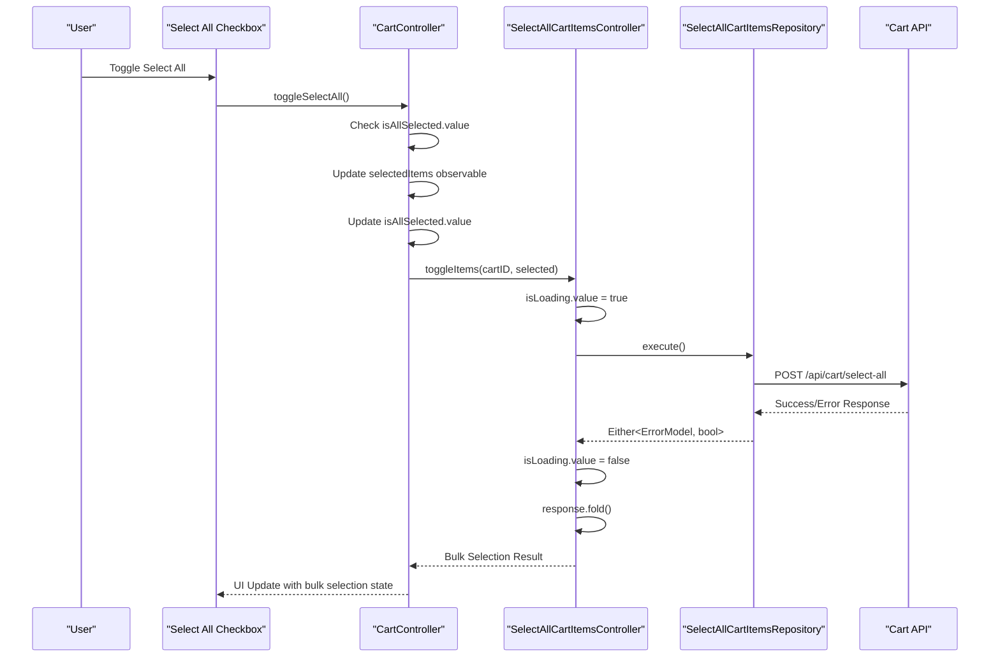

**Diagram sources**
- [cart_select_item.dart:22-26](file://lib/features/cart/widgets/cart_view_widgets/cart_select_item.dart#L22-L26)
- [cart_controller.dart:63-75](file://lib/features/cart/controller/cart_controller.dart#L63-L75)
- [select_all_cart_item_controller.dart:11-29](file://lib/features/cart/controller/select_all_cart_item_controller.dart#L11-L29)

**Section sources**
- [cart_select_item.dart:1-53](file://lib/features/cart/widgets/cart_view_widgets/cart_select_item.dart#L1-L53)
- [cart_controller.dart:63-75](file://lib/features/cart/controller/cart_controller.dart#L63-L75)
- [select_all_cart_item_controller.dart:1-30](file://lib/features/cart/controller/select_all_cart_item_controller.dart#L1-L30)

### Reactive State Management
The selection system implements comprehensive reactive state management for real-time updates:

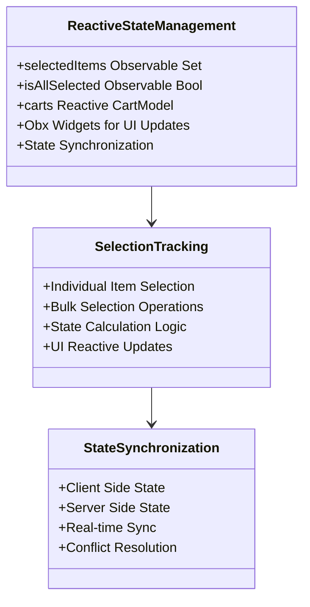

**Diagram sources**
- [cart_controller.dart:18-20](file://lib/features/cart/controller/cart_controller.dart#L18-L20)
- [cart_item_info.dart:38-47](file://lib/features/cart/widgets/cart_view_widgets/cart_item_info.dart#L38-L47)
- [cart_select_item.dart:22-26](file://lib/features/cart/widgets/cart_view_widgets/cart_select_item.dart#L22-L26)

**Section sources**
- [cart_controller.dart:17-25](file://lib/features/cart/controller/cart_controller.dart#L17-L25)
- [cart_item_info.dart:38-47](file://lib/features/cart/widgets/cart_view_widgets/cart_item_info.dart#L38-L47)
- [cart_select_item.dart:22-26](file://lib/features/cart/widgets/cart_view_widgets/cart_select_item.dart#L22-L26)

### Enhanced Repository Pattern Implementation
The repository pattern has been enhanced with dedicated selection endpoints and improved API response handling:

```mermaid
classDiagram
class GetCartRepository {
+GetNetwork getNetwork
+execute() Either~ErrorModel, CartModel~
+EnhancedParsing : json["data"]
+NestedDataSupport
}
class SelectCartItemRepository {
+PostWithoutResponse postWithoutResponse
+execute(cartItemID, cartID, selected) Either~ErrorModel, bool~
+ItemToggleEndpoint : /api/cart/item/{id}/toggle
+JSON Body : {"cart_id" : cartID, "selected" : selected}
}
class SelectAllCartItemsRepository {
+PostWithoutResponse postWithoutResponse
+execute(cartID, selected) Either~ErrorModel, bool~
+BulkToggleEndpoint : /api/cart/select-all
+JSON Body : {"cart_id" : cartID, "selected" : selected}
}
class CartModel {
+fromJson(Map json)
+NestedFieldMapping
+EnhancedValidation
+isSelected Property
}
class DebuggingIntegration {
+Real-timeMonitoring
+CartLengthLogging
+EnhancedErrorMessages
}
GetCartRepository --> CartModel
SelectCartItemRepository --> CartModel
SelectAllCartItemsRepository --> CartModel
```

**Diagram sources**
- [get_cart_repo.dart:11-18](file://lib/features/cart/repositories/get_cart_repo.dart#L11-L18)
- [select_cart_item_repo.dart:8-24](file://lib/features/cart/repositories/select_cart_item_repo.dart#L8-L24)
- [select_all_cart_items_repo.dart:8-23](file://lib/features/cart/repositories/select_all_cart_items_repo.dart#L8-L23)
- [cart_model.dart:35-49](file://lib/features/cart/models/cart_model.dart#L35-L49)

**Section sources**
- [get_cart_repo.dart:11-18](file://lib/features/cart/repositories/get_cart_repo.dart#L11-L18)
- [select_cart_item_repo.dart:1-24](file://lib/features/cart/repositories/select_cart_item_repo.dart#L1-L24)
- [select_all_cart_items_repo.dart:1-23](file://lib/features/cart/repositories/select_all_cart_items_repo.dart#L1-L23)
- [cart_model.dart:35-49](file://lib/features/cart/models/cart_model.dart#L35-L49)

### Improved UI Components with Selection Features
The cart item components feature significant improvements in image handling, selection integration, and layout:

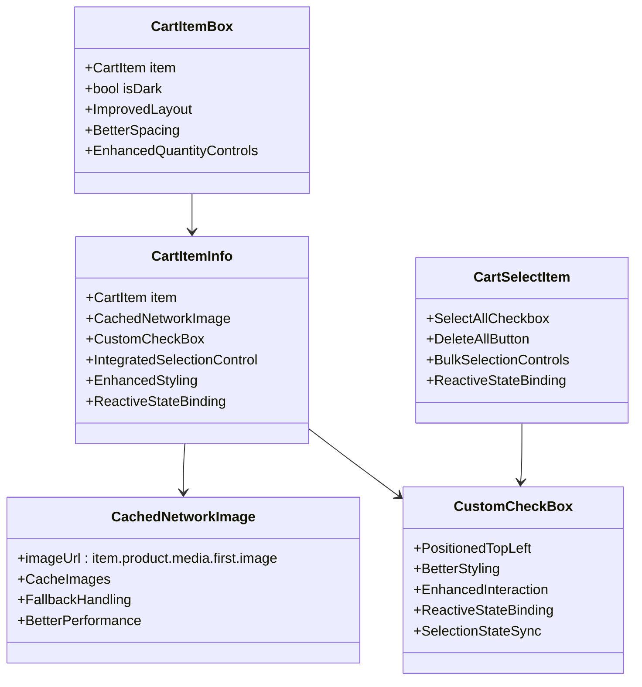

**Diagram sources**
- [cart_item.dart:11-103](file://lib/features/cart/widgets/cart_view_widgets/cart_item.dart#L11-L103)
- [cart_item_info.dart:11-99](file://lib/features/cart/widgets/cart_view_widgets/cart_item_info.dart#L11-L99)
- [cart_select_item.dart:10-52](file://lib/features/cart/widgets/cart_view_widgets/cart_select_item.dart#L10-L52)

**Section sources**
- [cart_item.dart:1-103](file://lib/features/cart/widgets/cart_view_widgets/cart_item.dart#L1-L103)
- [cart_item_info.dart:1-99](file://lib/features/cart/widgets/cart_view_widgets/cart_item_info.dart#L1-L99)
- [cart_select_item.dart:1-53](file://lib/features/cart/widgets/cart_view_widgets/cart_select_item.dart#L1-L53)

### Cart State Persistence and Synchronization
The selection system implements comprehensive state persistence and synchronization mechanisms:

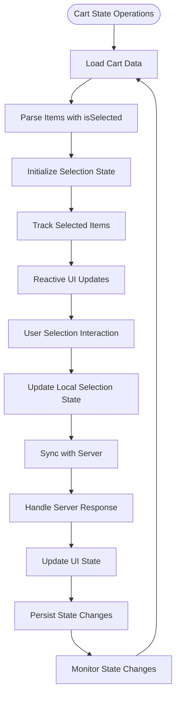

**Diagram sources**
- [cart_controller.dart:37-46](file://lib/features/cart/controller/cart_controller.dart#L37-L46)
- [cart_controller.dart:49-61](file://lib/features/cart/controller/cart_controller.dart#L49-L61)
- [cart_controller.dart:63-75](file://lib/features/cart/controller/cart_controller.dart#L63-L75)

**Section sources**
- [cart_controller.dart:37-46](file://lib/features/cart/controller/cart_controller.dart#L37-L46)
- [cart_controller.dart:49-61](file://lib/features/cart/controller/cart_controller.dart#L49-L61)
- [cart_controller.dart:63-75](file://lib/features/cart/controller/cart_controller.dart#L63-L75)

## Enhanced Selection System Implementation
The selection system implements comprehensive granular and bulk selection capabilities with reactive state management:

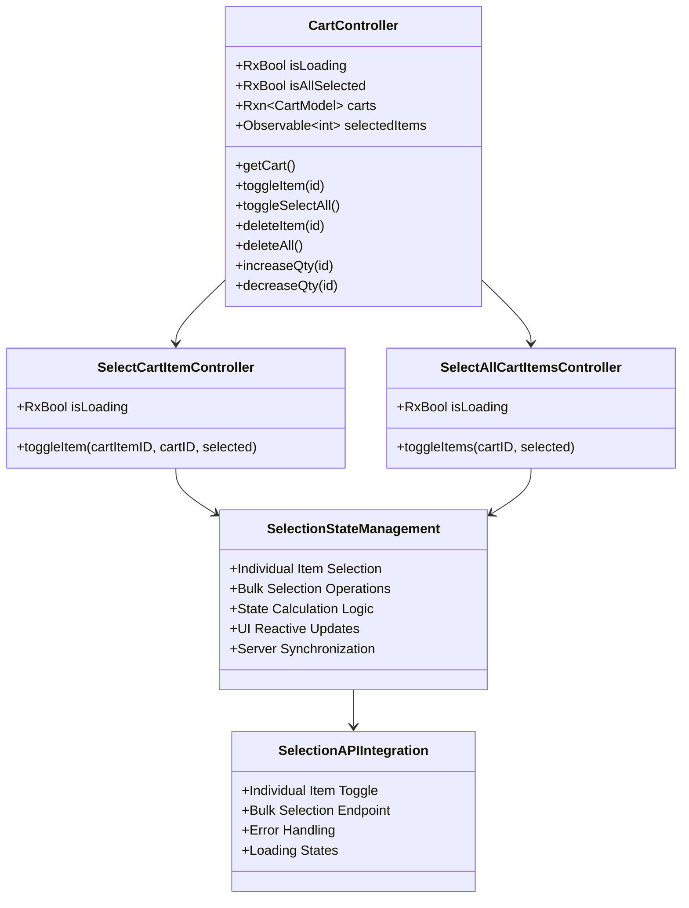

**Diagram sources**
- [cart_controller.dart:8-21](file://lib/features/cart/controller/cart_controller.dart#L8-L21)
- [select_cart_item_controller.dart:6-9](file://lib/features/cart/controller/select_cart_item_controller.dart#L6-L9)
- [select_all_cart_item_controller.dart:6-9](file://lib/features/cart/controller/select_all_cart_item_controller.dart#L6-L9)

**Section sources**
- [cart_controller.dart:1-85](file://lib/features/cart/controller/cart_controller.dart#L1-L85)
- [select_cart_item_controller.dart:1-32](file://lib/features/cart/controller/select_cart_item_controller.dart#L1-L32)
- [select_all_cart_item_controller.dart:1-30](file://lib/features/cart/controller/select_all_cart_item_controller.dart#L1-L30)

## Granular Item Selection Capabilities
The individual item selection system provides precise control over cart items with comprehensive state management:

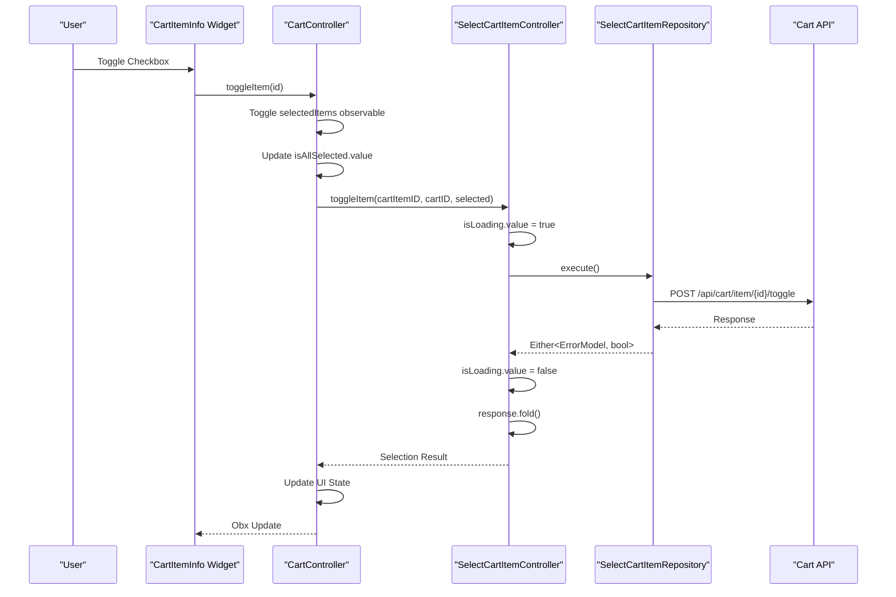

**Diagram sources**
- [cart_item_info.dart:38-47](file://lib/features/cart/widgets/cart_view_widgets/cart_item_info.dart#L38-L47)
- [cart_controller.dart:49-61](file://lib/features/cart/controller/cart_controller.dart#L49-L61)
- [select_cart_item_controller.dart:11-31](file://lib/features/cart/controller/select_cart_item_controller.dart#L11-L31)

**Section sources**
- [cart_item_info.dart:35-49](file://lib/features/cart/widgets/cart_view_widgets/cart_item_info.dart#L35-L49)
- [cart_controller.dart:49-61](file://lib/features/cart/controller/cart_controller.dart#L49-L61)
- [select_cart_item_controller.dart:1-32](file://lib/features/cart/controller/select_cart_item_controller.dart#L1-L32)

## Bulk Selection Operations
The bulk selection system provides efficient management of multiple cart items with optimized API communication:

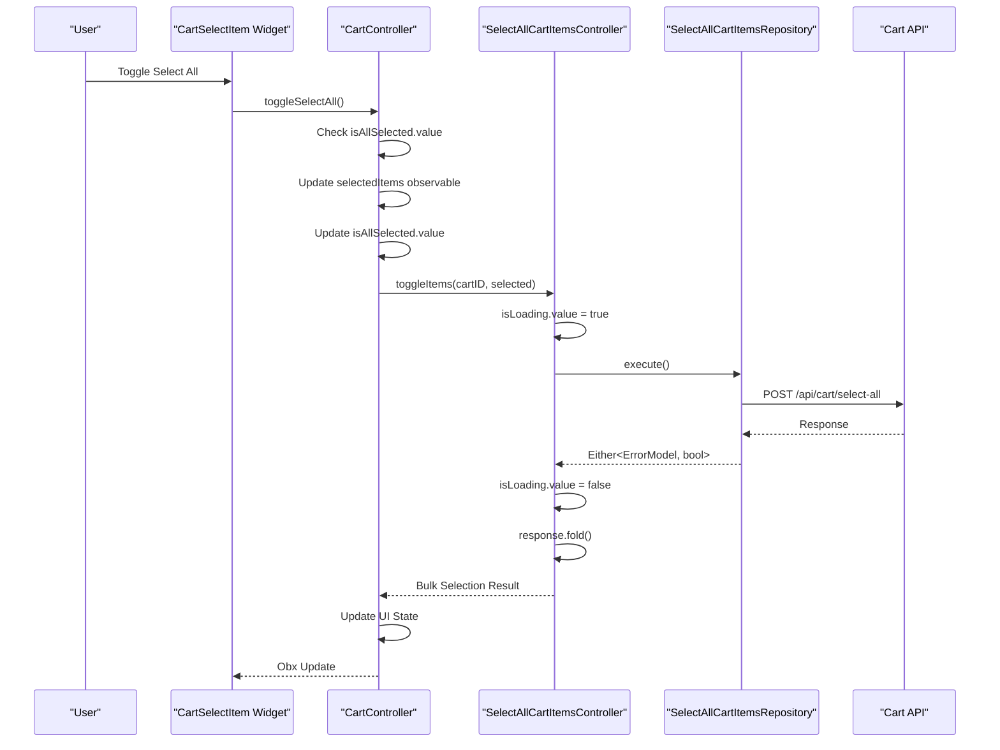

**Diagram sources**
- [cart_select_item.dart:22-26](file://lib/features/cart/widgets/cart_view_widgets/cart_select_item.dart#L22-L26)
- [cart_controller.dart:63-75](file://lib/features/cart/controller/cart_controller.dart#L63-L75)
- [select_all_cart_item_controller.dart:11-29](file://lib/features/cart/controller/select_all_cart_item_controller.dart#L11-L29)

**Section sources**
- [cart_select_item.dart:1-53](file://lib/features/cart/widgets/cart_view_widgets/cart_select_item.dart#L1-L53)
- [cart_controller.dart:63-75](file://lib/features/cart/controller/cart_controller.dart#L63-L75)
- [select_all_cart_item_controller.dart:1-30](file://lib/features/cart/controller/select_all_cart_item_controller.dart#L1-L30)

## Reactive State Management
The selection system implements comprehensive reactive state management for real-time updates and synchronization:

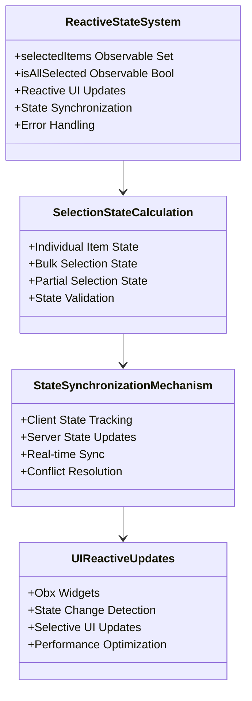

**Diagram sources**
- [cart_controller.dart:18-20](file://lib/features/cart/controller/cart_controller.dart#L18-L20)
- [cart_controller.dart:43-44](file://lib/features/cart/controller/cart_controller.dart#L43-L44)

**Section sources**
- [cart_controller.dart:17-25](file://lib/features/cart/controller/cart_controller.dart#L17-L25)
- [cart_controller.dart:43-44](file://lib/features/cart/controller/cart_controller.dart#L43-L44)

## Enhanced Repository Pattern Implementation
The repository pattern has been enhanced with dedicated selection endpoints and comprehensive error handling:

```mermaid
classDiagram
class GetCartRepository {
+GetNetwork getNetwork
+execute() Either~ErrorModel, CartModel~
+EnhancedParsing : json["data"]
+NestedDataSupport
}
class SelectCartItemRepository {
+PostWithoutResponse postWithoutResponse
+execute(cartItemID, cartID, selected) Either~ErrorModel, bool~
+ItemToggleEndpoint : /api/cart/item/{id}/toggle
+JSON Body : {"cart_id" : cartID, "selected" : selected}
+ErrorHandling : Comprehensive
+LoadingStates : Reactive
}
class SelectAllCartItemsRepository {
+PostWithoutResponse postWithoutResponse
+execute(cartID, selected) Either~ErrorModel, bool~
+BulkToggleEndpoint : /api/cart/select-all
+JSON Body : {"cart_id" : cartID, "selected" : selected}
+ErrorHandling : Comprehensive
+LoadingStates : Reactive
}
class SelectionAPIEndpoints {
+Individual Item Toggle
+Bulk Selection Endpoint
+Error Response Handling
+Success/Failure States
}
GetCartRepository --> SelectionAPIEndpoints
SelectCartItemRepository --> SelectionAPIEndpoints
SelectAllCartItemsRepository --> SelectionAPIEndpoints
```

**Diagram sources**
- [get_cart_repo.dart:11-18](file://lib/features/cart/repositories/get_cart_repo.dart#L11-L18)
- [select_cart_item_repo.dart:12-23](file://lib/features/cart/repositories/select_cart_item_repo.dart#L12-L23)
- [select_all_cart_items_repo.dart:12-22](file://lib/features/cart/repositories/select_all_cart_items_repo.dart#L12-L22)

**Section sources**
- [get_cart_repo.dart:11-18](file://lib/features/cart/repositories/get_cart_repo.dart#L11-L18)
- [select_cart_item_repo.dart:1-24](file://lib/features/cart/repositories/select_cart_item_repo.dart#L1-L24)
- [select_all_cart_items_repo.dart:1-23](file://lib/features/cart/repositories/select_all_cart_items_repo.dart#L1-L23)

## Improved UI Components with Selection Features
The cart item components feature significant improvements in image handling, selection integration, and user interaction:

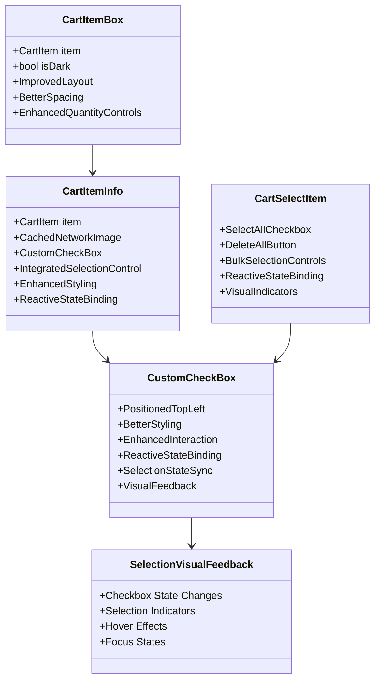

**Diagram sources**
- [cart_item.dart:11-103](file://lib/features/cart/widgets/cart_view_widgets/cart_item.dart#L11-L103)
- [cart_item_info.dart:11-99](file://lib/features/cart/widgets/cart_view_widgets/cart_item_info.dart#L11-L99)
- [cart_select_item.dart:10-52](file://lib/features/cart/widgets/cart_view_widgets/cart_select_item.dart#L10-L52)

**Section sources**
- [cart_item.dart:1-103](file://lib/features/cart/widgets/cart_view_widgets/cart_item.dart#L1-L103)
- [cart_item_info.dart:1-99](file://lib/features/cart/widgets/cart_view_widgets/cart_item_info.dart#L1-L99)
- [cart_select_item.dart:1-53](file://lib/features/cart/widgets/cart_view_widgets/cart_select_item.dart#L1-L53)

## Performance Considerations
The enhanced cart system implements several performance optimization strategies for selection operations:

- **CachedNetworkImage**: Improved image loading performance with caching and fallback handling for product images
- **Reactive Updates**: Efficient state management with selective UI updates based on cart changes and selection state
- **Enhanced Decimal Formatting**: Optimized toPrecision(2) calculations for consistent monetary display
- **Improved API Parsing**: Better error handling reduces unnecessary retries and network calls for selection operations
- **Debugging Integration**: Real-time monitoring helps identify performance bottlenecks in selection operations
- **Memory Management**: Proper disposal of cached images and reactive subscriptions for selection state
- **Layout Optimization**: Better spacing and alignment reduce rendering overhead in selection-enabled components
- **Enhanced Error Handling**: Prevents cascading failures and improves system stability during selection operations
- **Nested Data Parsing**: Efficient handling of API response structures reduces parsing overhead for cart data
- **Selection State Optimization**: Observable collections for efficient selection tracking and UI updates
- **API Endpoint Efficiency**: Dedicated endpoints for individual and bulk selection operations reduce payload sizes
- **State Synchronization**: Optimized client-server state synchronization prevents redundant API calls

## Troubleshooting Guide
Enhanced troubleshooting procedures for the improved cart system with selection capabilities:

**Selection State Issues**
- Verify selectedItems observable properly tracks item IDs and updates reactively
- Check isAllSelected calculation logic matches selection state
- Ensure selection state persists across cart refresh operations
- Verify reactive state updates trigger UI rebuilds correctly

**Individual Item Selection Problems**
- Confirm SelectCartItemController properly handles toggleItem requests
- Check SelectCartItemRepository executes correct API endpoint (/api/cart/item/{id}/toggle)
- Verify item selection state syncs with server responses
- Ensure error handling displays appropriate feedback for selection failures

**Bulk Selection Operations**
- Verify SelectAllCartItemsController handles bulk toggle requests correctly
- Check SelectAllCartItemsRepository executes correct API endpoint (/api/cart/select-all)
- Ensure bulk selection state updates all items consistently
- Verify partial selection scenarios handled properly

**API Response Parsing Errors**
- Confirm nested data structure matches expected format for cart data
- Check field mapping in CartModel.fromJson includes isSelected property
- Verify error handling catches parsing exceptions for selection data
- Ensure graceful degradation for malformed API responses

**UI Component Issues**
- Confirm CustomCheckBox properly binds to selection state observables
- Check Obx widgets update correctly when selection state changes
- Verify selection visual feedback displays appropriate states
- Ensure checkbox positioning remains consistent across different screen sizes

**State Synchronization Problems**
- Verify client-side selection state updates server-side state correctly
- Check for conflicts between client and server selection states
- Ensure selection state remains consistent across app navigation
- Verify selection state persists through app restarts

**Performance Issues**
- Monitor selection operation performance with large cart contents
- Check for memory leaks in selection state observables
- Verify UI updates don't cause excessive rebuild cycles
- Ensure selection operations don't block main thread execution

**Section sources**
- [cart_controller.dart:1-85](file://lib/features/cart/controller/cart_controller.dart#L1-L85)
- [select_cart_item_controller.dart:1-32](file://lib/features/cart/controller/select_cart_item_controller.dart#L1-L32)
- [select_all_cart_item_controller.dart:1-30](file://lib/features/cart/controller/select_all_cart_item_controller.dart#L1-L30)
- [cart_item_info.dart:35-49](file://lib/features/cart/widgets/cart_view_widgets/cart_item_info.dart#L35-L49)
- [cart_select_item.dart:22-26](file://lib/features/cart/widgets/cart_view_widgets/cart_select_item.dart#L22-L26)

## Conclusion
The Shopping Cart system in ZB-DEZINE has been significantly enhanced with granular item selection capabilities, bulk selection operations, reactive state management, and improved UI components. The system maintains its modernized API-driven architecture while adding robust selection management and performance optimizations.

**Updated** Key enhancements include granular item selection capabilities through new SelectCartItemController and SelectAllCartItemsController, comprehensive selection management with reactive state handling, improved UI components with integrated selection checkboxes, expanded repository pattern implementation with dedicated selection endpoints, enhanced cart state synchronization across selection operations, and comprehensive debugging capabilities for selection-related issues.

The enhanced system features:
- **Granular Selection Management**: Individual item selection with server synchronization and client-side state tracking
- **Bulk Selection Operations**: Comprehensive bulk selection capabilities with optimized API communication
- **Enhanced State Synchronization**: Real-time state updates between client and server for selection changes
- **Improved API Integration**: Better nested data structure handling and enhanced error management for selection operations
- **Enhanced UI Components**: CachedNetworkImage for better image performance and integrated selection checkbox positioning
- **Reactive Calculations**: Dynamic pricing updates with consistent decimal formatting
- **Debugging Support**: Real-time monitoring and enhanced error logging capabilities for selection operations
- **Performance Optimizations**: Cached image loading, efficient state management, and optimized API communication
- **Maintainable Architecture**: Clear separation of concerns with enhanced repository pattern implementation
- **Scalable Design**: Modular components ready for future enhancements like advanced inventory validation and promotional discount systems
- **Robust Error Handling**: Comprehensive error handling for selection operations and state synchronization
- **User Experience Enhancement**: Intuitive selection controls with visual feedback and responsive state updates

The system is designed for optimal performance with clear separation of concerns, making it easy to extend with additional features while maintaining reliability and responsiveness for production use with comprehensive selection management capabilities.