# Shopping Cart System

<cite>
**Referenced Files in This Document**
- [cart_controller.dart](file://lib/features/cart/controller/cart_controller.dart)
- [cart_item_model.dart](file://lib/features/cart/models/cart_item_model.dart)
- [cart_view.dart](file://lib/features/cart/views/cart_view.dart)
- [cart_item.dart](file://lib/features/cart/widgets/cart_item.dart)
- [cart_select_item.dart](file://lib/features/cart/widgets/cart_select_item.dart)
- [cart_bindings.dart](file://lib/features/cart/bindings/cart_bindings.dart)
- [bottom_nav_view.dart](file://lib/features/home/views/bottom_nav_view.dart)
- [bottom_nav_controller.dart](file://lib/features/home/controller/bottom_nav_controller.dart)
- [bottom_nav_cart_item.dart](file://lib/features/home/widgets/bottom_nav_widgets/bottom_nav_cart_item.dart)
- [home_product_design.dart](file://lib/features/home/widgets/home_widgets/home_product_design.dart)
- [home_new_arrival.dart](file://lib/features/home/widgets/home_widgets/home_new_arrival.dart)
- [home_our_products.dart](file://lib/features/home/widgets/home_widgets/home_our_products.dart)
- [product_details_cart.dart](file://lib/features/product_details.dart/widgets/product_details_view_widgets/product_details_cart.dart)
- [storage_service.dart](file://lib/core/data/local/storage_service.dart)
- [icons_path.dart](file://lib/core/constant/icons_path.dart)
</cite>

## Update Summary
**Changes Made**
- Added comprehensive cart controller implementation with item selection and quantity management
- Integrated new cart model with reactive properties for state management
- Implemented cart view with item list rendering and interactive controls
- Added cart widget components for individual items and bulk operations
- Enhanced bottom navigation with cart badge integration
- Updated product details integration with cart functionality
- Added cart binding configuration for dependency injection

## Table of Contents
1. [Introduction](#introduction)
2. [Project Structure](#project-structure)
3. [Core Components](#core-components)
4. [Architecture Overview](#architecture-overview)
5. [Detailed Component Analysis](#detailed-component-analysis)
6. [Dependency Analysis](#dependency-analysis)
7. [Performance Considerations](#performance-considerations)
8. [Troubleshooting Guide](#troubleshooting-guide)
9. [Conclusion](#conclusion)

## Introduction
This document describes the comprehensive Shopping Cart system within the ZB-DEZINE Flutter application. The system features a fully implemented cart controller with item selection capabilities, quantity management, deletion functionality, and enhanced UI components. It includes detailed cart state handling, item management operations, and seamless integration with the product catalog and navigation system.

## Project Structure
The shopping cart functionality is organized into a modular architecture with dedicated controllers, models, views, and widgets:

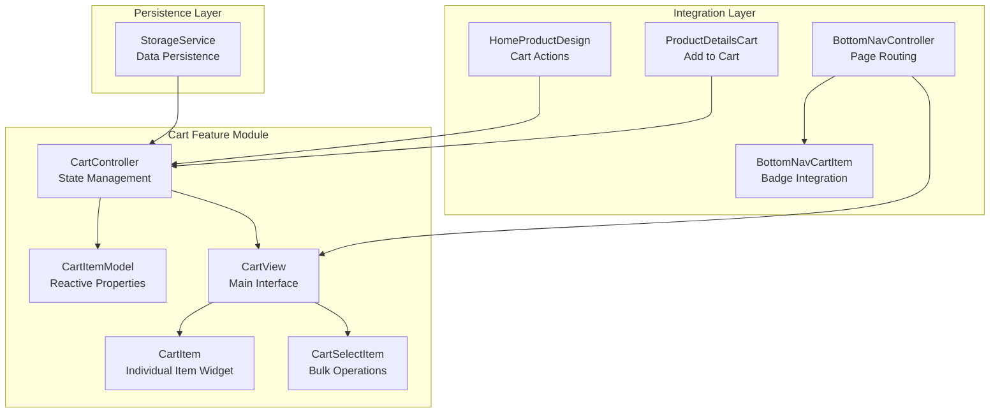

**Diagram sources**
- [cart_controller.dart:5-99](file://lib/features/cart/controller/cart_controller.dart#L5-L99)
- [cart_item_model.dart:3-22](file://lib/features/cart/models/cart_item_model.dart#L3-L22)
- [cart_view.dart:11-53](file://lib/features/cart/views/cart_view.dart#L11-L53)
- [cart_item.dart:9-123](file://lib/features/cart/widgets/cart_item.dart#L9-L123)
- [cart_select_item.dart:10-51](file://lib/features/cart/widgets/cart_select_item.dart#L10-L51)
- [bottom_nav_controller.dart:8-17](file://lib/features/home/controller/bottom_nav_controller.dart#L8-L17)
- [bottom_nav_cart_item.dart:9-75](file://lib/features/home/widgets/bottom_nav_widgets/bottom_nav_cart_item.dart#L9-L75)
- [home_product_design.dart:10-105](file://lib/features/home/widgets/home_widgets/home_product_design.dart#L10-L105)
- [product_details_cart.dart:10-188](file://lib/features/product_details.dart/widgets/product_details_view_widgets/product_details_cart.dart#L10-L188)
- [storage_service.dart:3-24](file://lib/core/data/local/storage_service.dart#L3-L24)

**Section sources**
- [cart_controller.dart:5-99](file://lib/features/cart/controller/cart_controller.dart#L5-L99)
- [cart_item_model.dart:3-22](file://lib/features/cart/models/cart_item_model.dart#L3-L22)
- [cart_view.dart:11-53](file://lib/features/cart/views/cart_view.dart#L11-L53)
- [cart_item.dart:9-123](file://lib/features/cart/widgets/cart_item.dart#L9-L123)
- [cart_select_item.dart:10-51](file://lib/features/cart/widgets/cart_select_item.dart#L10-L51)
- [bottom_nav_controller.dart:8-17](file://lib/features/home/controller/bottom_nav_controller.dart#L8-L17)
- [bottom_nav_cart_item.dart:9-75](file://lib/features/home/widgets/bottom_nav_widgets/bottom_nav_cart_item.dart#L9-L75)
- [home_product_design.dart:10-105](file://lib/features/home/widgets/home_widgets/home_product_design.dart#L10-L105)
- [product_details_cart.dart:10-188](file://lib/features/product_details.dart/widgets/product_details_view_widgets/product_details_cart.dart#L10-L188)
- [storage_service.dart:3-24](file://lib/core/data/local/storage_service.dart#L3-L24)

## Core Components
The cart system consists of several key components working together:

- **CartController**: Manages cart state with reactive properties, item selection, quantity operations, and deletion functionality
- **CartItemModel**: Defines cart item structure with reactive boolean properties for selection state
- **CartView**: Main cart interface displaying items in a scrollable list with custom appbar
- **CartItem Widget**: Individual cart item component with selection checkbox, image, details, quantity controls, and delete button
- **CartSelectItem Widget**: Bulk operations component with select all functionality and delete all option
- **Bottom Navigation Integration**: Cart badge with item count and navigation to cart page
- **Product Details Integration**: Add to cart functionality with quantity selection

Key responsibilities include:
- State management with reactive updates usingGetX framework
- Item selection with individual and bulk operations
- Quantity adjustment with validation and refresh mechanisms
- Item deletion with state synchronization
- UI integration with responsive design and theming
- Navigation integration with badge count updates

**Section sources**
- [cart_controller.dart:5-99](file://lib/features/cart/controller/cart_controller.dart#L5-L99)
- [cart_item_model.dart:3-22](file://lib/features/cart/models/cart_item_model.dart#L3-L22)
- [cart_view.dart:11-53](file://lib/features/cart/views/cart_view.dart#L11-L53)
- [cart_item.dart:9-123](file://lib/features/cart/widgets/cart_item.dart#L9-L123)
- [cart_select_item.dart:10-51](file://lib/features/cart/widgets/cart_select_item.dart#L10-L51)
- [bottom_nav_cart_item.dart:9-75](file://lib/features/home/widgets/bottom_nav_widgets/bottom_nav_cart_item.dart#L9-L75)
- [product_details_cart.dart:10-188](file://lib/features/product_details.dart/widgets/product_details_view_widgets/product_details_cart.dart#L10-L188)

## Architecture Overview
The cart system follows a reactive architecture pattern using theGetX framework:

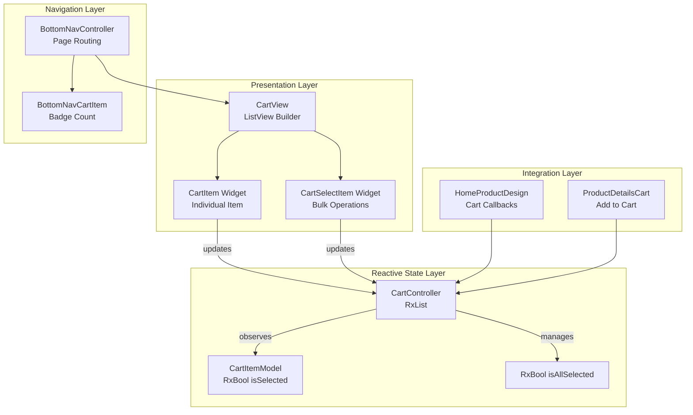

**Diagram sources**
- [cart_controller.dart:5-99](file://lib/features/cart/controller/cart_controller.dart#L5-L99)
- [cart_item_model.dart:3-22](file://lib/features/cart/models/cart_item_model.dart#L3-L22)
- [cart_view.dart:11-53](file://lib/features/cart/views/cart_view.dart#L11-L53)
- [cart_item.dart:9-123](file://lib/features/cart/widgets/cart_item.dart#L9-L123)
- [cart_select_item.dart:10-51](file://lib/features/cart/widgets/cart_select_item.dart#L10-L51)
- [bottom_nav_controller.dart:8-17](file://lib/features/home/controller/bottom_nav_controller.dart#L8-L17)
- [bottom_nav_cart_item.dart:9-75](file://lib/features/home/widgets/bottom_nav_widgets/bottom_nav_cart_item.dart#L9-L75)
- [home_product_design.dart:10-105](file://lib/features/home/widgets/home_widgets/home_product_design.dart#L10-L105)
- [product_details_cart.dart:10-188](file://lib/features/product_details.dart/widgets/product_details_view_widgets/product_details_cart.dart#L10-L188)

## Detailed Component Analysis

### Cart Controller Implementation
The CartController manages all cart operations with reactive state management:

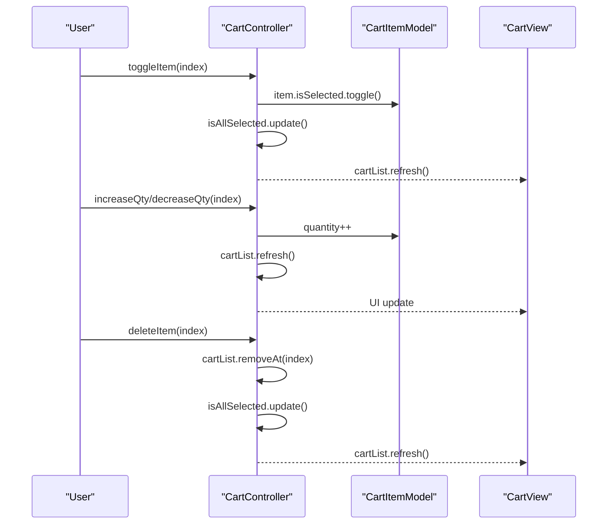

**Diagram sources**
- [cart_controller.dart:44-98](file://lib/features/cart/controller/cart_controller.dart#L44-L98)

**Section sources**
- [cart_controller.dart:5-99](file://lib/features/cart/controller/cart_controller.dart#L5-L99)

### Cart Item Model with Reactive Properties
The CartItemModel defines the structure for cart items with reactive selection properties:

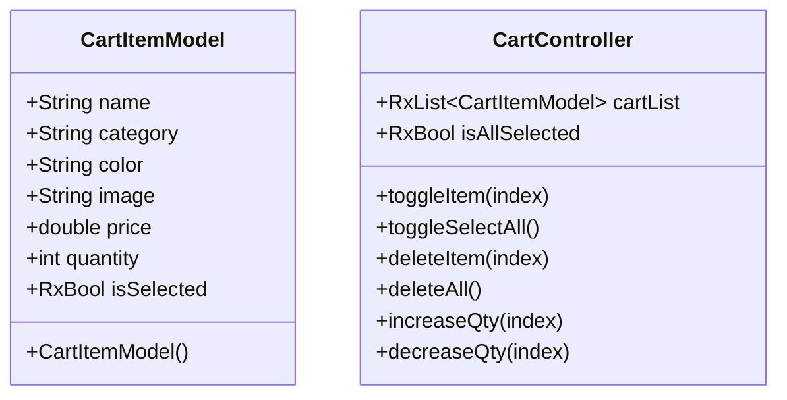

**Diagram sources**
- [cart_item_model.dart:3-22](file://lib/features/cart/models/cart_item_model.dart#L3-L22)
- [cart_controller.dart:5-99](file://lib/features/cart/controller/cart_controller.dart#L5-L99)

**Section sources**
- [cart_item_model.dart:3-22](file://lib/features/cart/models/cart_item_model.dart#L3-L22)

### Cart View and Item Rendering
The CartView provides the main interface for cart management with dynamic item rendering:

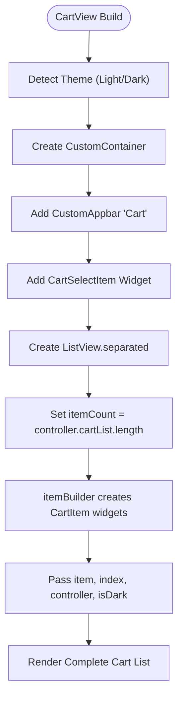

**Diagram sources**
- [cart_view.dart:11-53](file://lib/features/cart/views/cart_view.dart#L11-L53)

**Section sources**
- [cart_view.dart:11-53](file://lib/features/cart/views/cart_view.dart#L11-L53)

### Cart Item Widget with Interactive Controls
The CartItem widget handles individual item operations with comprehensive UI controls:

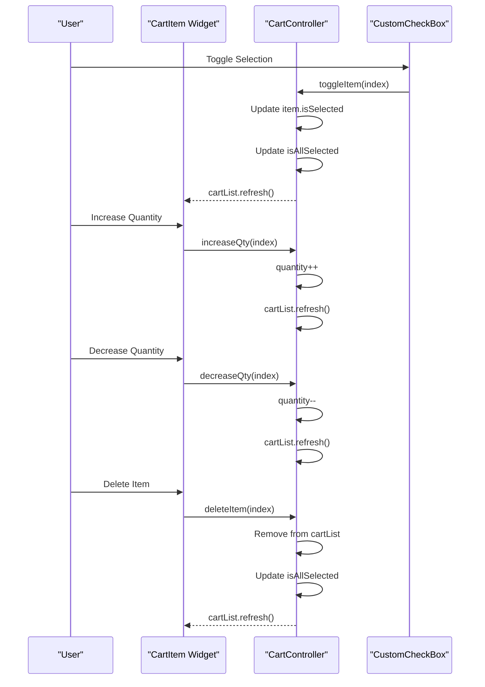

**Diagram sources**
- [cart_item.dart:27-106](file://lib/features/cart/widgets/cart_item.dart#L27-L106)
- [cart_controller.dart:44-98](file://lib/features/cart/controller/cart_controller.dart#L44-L98)

**Section sources**
- [cart_item.dart:9-123](file://lib/features/cart/widgets/cart_item.dart#L9-L123)

### Cart Selection and Bulk Operations
The CartSelectItem widget provides bulk cart management capabilities:

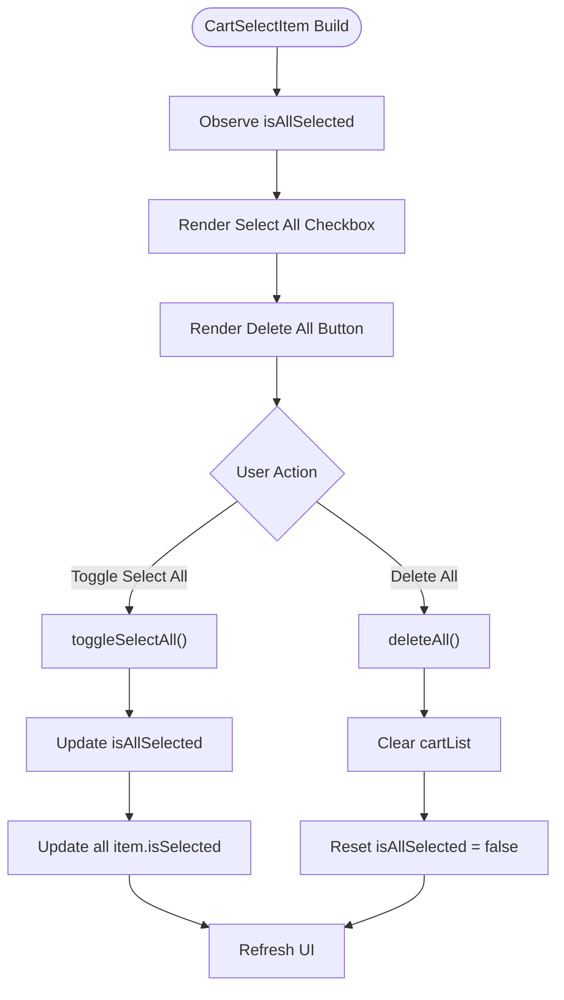

**Diagram sources**
- [cart_select_item.dart:15-49](file://lib/features/cart/widgets/cart_select_item.dart#L15-L49)
- [cart_controller.dart:55-82](file://lib/features/cart/controller/cart_controller.dart#L55-L82)

**Section sources**
- [cart_select_item.dart:10-51](file://lib/features/cart/widgets/cart_select_item.dart#L10-L51)

### Bottom Navigation Cart Integration
Enhanced bottom navigation with cart badge integration and page routing:

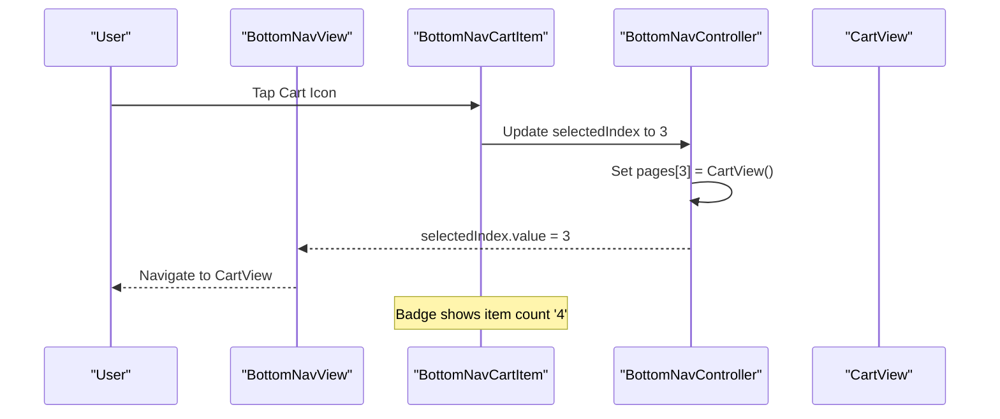

**Diagram sources**
- [bottom_nav_view.dart:12-80](file://lib/features/home/views/bottom_nav_view.dart#L12-L80)
- [bottom_nav_controller.dart:8-17](file://lib/features/home/controller/bottom_nav_controller.dart#L8-L17)
- [bottom_nav_cart_item.dart:25-73](file://lib/features/home/widgets/bottom_nav_widgets/bottom_nav_cart_item.dart#L25-L73)

**Section sources**
- [bottom_nav_view.dart:12-80](file://lib/features/home/views/bottom_nav_view.dart#L12-L80)
- [bottom_nav_controller.dart:8-17](file://lib/features/home/controller/bottom_nav_controller.dart#L8-L17)
- [bottom_nav_cart_item.dart:9-75](file://lib/features/home/widgets/bottom_nav_widgets/bottom_nav_cart_item.dart#L9-L75)

### Product Details Cart Integration
Product details page with integrated cart functionality:

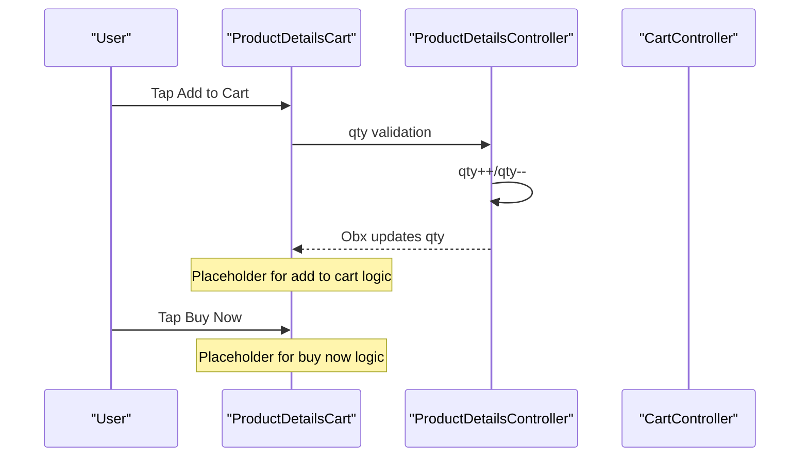

**Diagram sources**
- [product_details_cart.dart:75-95](file://lib/features/product_details.dart/widgets/product_details_view_widgets/product_details_cart.dart#L75-L95)

**Section sources**
- [product_details_cart.dart:10-188](file://lib/features/product_details.dart/widgets/product_details_view_widgets/product_details_cart.dart#L10-L188)

### Home Product Integration
Home product widgets with cart action callbacks:

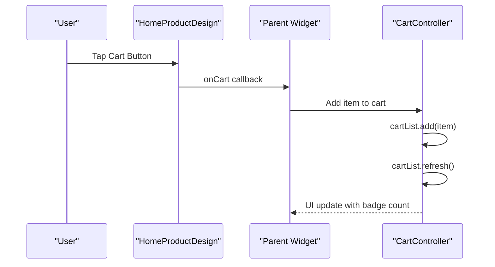

**Diagram sources**
- [home_product_design.dart:47-52](file://lib/features/home/widgets/home_widgets/home_product_design.dart#L47-L52)
- [home_new_arrival.dart:36-44](file://lib/features/home/widgets/home_widgets/home_new_arrival.dart#L36-L44)
- [home_our_products.dart:52-58](file://lib/features/home/widgets/home_widgets/home_our_products.dart#L52-L58)

**Section sources**
- [home_product_design.dart:10-105](file://lib/features/home/widgets/home_widgets/home_product_design.dart#L10-L105)
- [home_new_arrival.dart:36-44](file://lib/features/home/widgets/home_widgets/home_new_arrival.dart#L36-L44)
- [home_our_products.dart:52-58](file://lib/features/home/widgets/home_widgets/home_our_products.dart#L52-L58)

## Dependency Analysis
The cart system demonstrates excellent modularity with clear dependency boundaries:

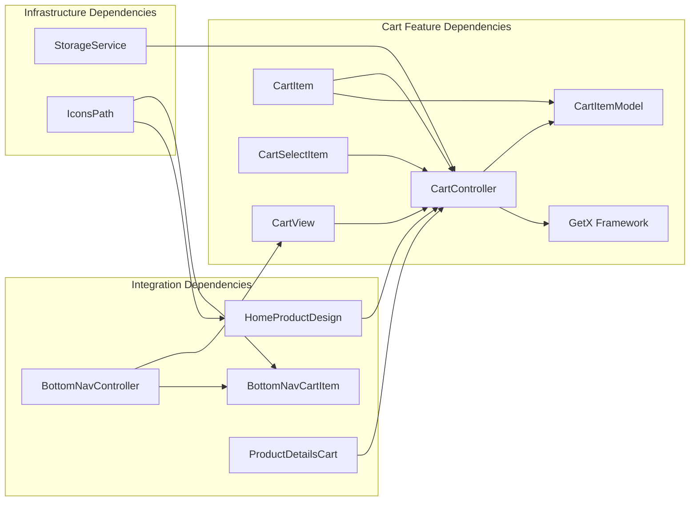

**Diagram sources**
- [cart_controller.dart:1-3](file://lib/features/cart/controller/cart_controller.dart#L1-L3)
- [cart_item_model.dart:1](file://lib/features/cart/models/cart_item_model.dart#L1)
- [cart_view.dart:3-10](file://lib/features/cart/views/cart_view.dart#L3-L10)
- [cart_item.dart:2-8](file://lib/features/cart/widgets/cart_item.dart#L2-L8)
- [cart_select_item.dart:3-8](file://lib/features/cart/widgets/cart_select_item.dart#L3-L8)
- [bottom_nav_controller.dart:2-6](file://lib/features/home/controller/bottom_nav_controller.dart#L2-L6)
- [bottom_nav_cart_item.dart:4-7](file://lib/features/home/widgets/bottom_nav_widgets/bottom_nav_cart_item.dart#L4-L7)
- [home_product_design.dart:4-8](file://lib/features/home/widgets/home_widgets/home_product_design.dart#L4-L8)
- [product_details_cart.dart:3-8](file://lib/features/product_details.dart/widgets/product_details_view_widgets/product_details_cart.dart#L3-L8)
- [storage_service.dart:1](file://lib/core/data/local/storage_service.dart#L1)
- [icons_path.dart:1](file://lib/core/constant/icons_path.dart#L1)

**Section sources**
- [cart_controller.dart:1-3](file://lib/features/cart/controller/cart_controller.dart#L1-L3)
- [cart_item_model.dart:1](file://lib/features/cart/models/cart_item_model.dart#L1)
- [cart_view.dart:3-10](file://lib/features/cart/views/cart_view.dart#L3-L10)
- [cart_item.dart:2-8](file://lib/features/cart/widgets/cart_item.dart#L2-L8)
- [cart_select_item.dart:3-8](file://lib/features/cart/widgets/cart_select_item.dart#L3-L8)
- [bottom_nav_controller.dart:2-6](file://lib/features/home/controller/bottom_nav_controller.dart#L2-L6)
- [bottom_nav_cart_item.dart:4-7](file://lib/features/home/widgets/bottom_nav_widgets/bottom_nav_cart_item.dart#L4-L7)
- [home_product_design.dart:4-8](file://lib/features/home/widgets/home_widgets/home_product_design.dart#L4-L8)
- [product_details_cart.dart:3-8](file://lib/features/product_details.dart/widgets/product_details_view_widgets/product_details_cart.dart#L3-L8)
- [storage_service.dart:1](file://lib/core/data/local/storage_service.dart#L1)
- [icons_path.dart:1](file://lib/core/constant/icons_path.dart#L1)

## Performance Considerations
The cart system implements several performance optimization strategies:

- **Reactive Updates**: UsesGetX framework for efficient state management with selective UI updates
- **Virtualized Lists**: Implements ListView.separated with shrinkWrap and NeverScrollableScrollPhysics for optimal rendering
- **Conditional Rendering**: Uses Obx widgets for granular state observation and minimal rebuilds
- **Memory Management**: Proper disposal of reactive subscriptions through GetX lifecycle
- **Asset Optimization**: Cached network images for product thumbnails to reduce bandwidth usage
- **State Synchronization**: Automatic state updates prevent unnecessary manual refresh operations
- **Badge Counting**: Dynamic badge calculation based on cart length for real-time updates
- **Responsive Design**: ScreenUtil integration ensures optimal performance across device sizes

## Troubleshooting Guide
Common issues and solutions for the cart system:

**Cart State Not Updating**
- Verify reactive property usage (isSelected, isAllSelected) are properly declared as RxBool
- Ensure cartList.refresh() is called after state modifications
- Check that Obx widgets are wrapping dependent UI elements

**Quantity Controls Not Working**
- Confirm increaseQty/decreaseQty methods are properly bound to UI events
- Verify quantity validation prevents negative values
- Ensure cartList.refresh() is called after quantity changes

**Selection State Issues**
- Check toggleItem method properly updates both individual and global selection states
- Verify isAllSelected calculation uses every() method correctly
- Ensure selection state persists across widget rebuilds

**Navigation Problems**
- Confirm BottomNavController pages array includes CartView at index 3
- Verify BottomNavCartItem badgeCount is properly calculated
- Check that selectedIndex updates trigger proper page navigation

**Integration Issues**
- Ensure HomeProductDesign onCart callbacks are properly wired
- Verify ProductDetailsCart add to cart functionality is implemented
- Check that cart binding is registered in dependency injection system

**Section sources**
- [cart_controller.dart:44-98](file://lib/features/cart/controller/cart_controller.dart#L44-L98)
- [cart_item.dart:27-106](file://lib/features/cart/widgets/cart_item.dart#L27-L106)
- [bottom_nav_controller.dart:8-17](file://lib/features/home/controller/bottom_nav_controller.dart#L8-L17)
- [bottom_nav_cart_item.dart:25-73](file://lib/features/home/widgets/bottom_nav_widgets/bottom_nav_cart_item.dart#L25-L73)
- [home_product_design.dart:47-52](file://lib/features/home/widgets/home_widgets/home_product_design.dart#L47-L52)
- [product_details_cart.dart:75-95](file://lib/features/product_details.dart/widgets/product_details_view_widgets/product_details_cart.dart#L75-L95)

## Conclusion
The Shopping Cart system in ZB-DEZINE represents a comprehensive implementation featuring a fully functional cart controller with item selection, quantity management, deletion capabilities, and enhanced UI components. The system leverages theGetX framework for reactive state management, providing efficient updates and responsive user interactions.

Key achievements include:
- Complete cart controller implementation with all CRUD operations
- Reactive item models with proper state management
- Comprehensive UI components for individual items and bulk operations
- Seamless integration with bottom navigation and product catalog
- Proper dependency injection through cart bindings
- Responsive design with theme support and screen adaptation

The system is designed for scalability with clear separation of concerns, making it easy to extend with additional features like promotional discounts, inventory validation, and advanced cart persistence. The modular architecture ensures maintainability and allows for future enhancements while maintaining optimal performance for large cart contents.