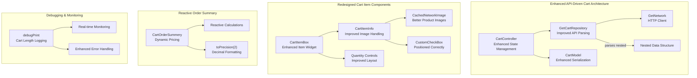
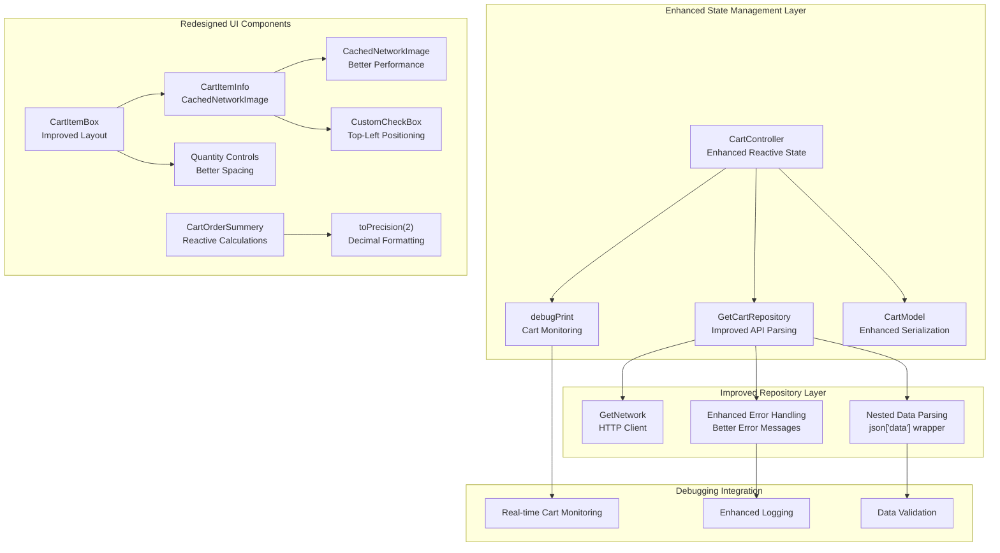
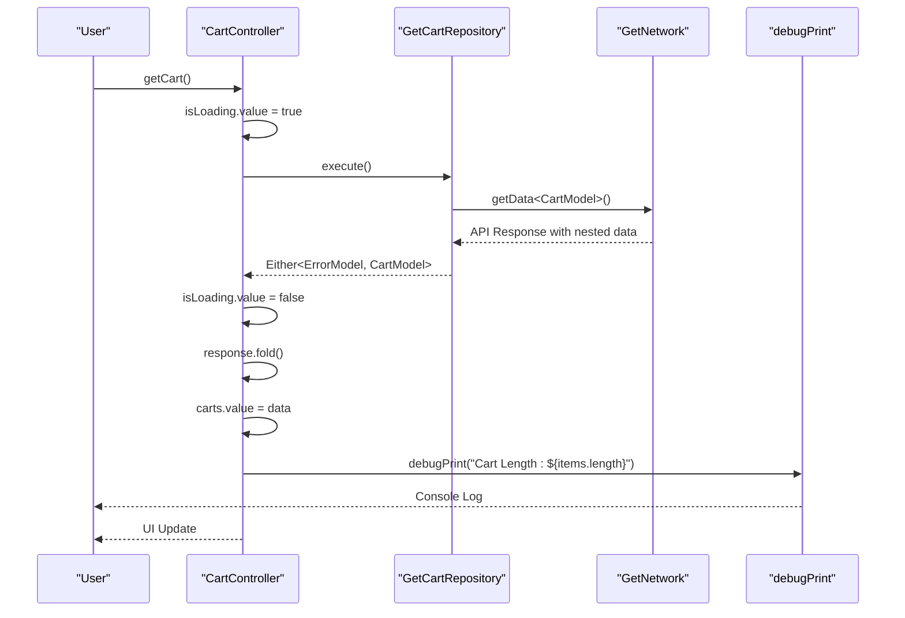
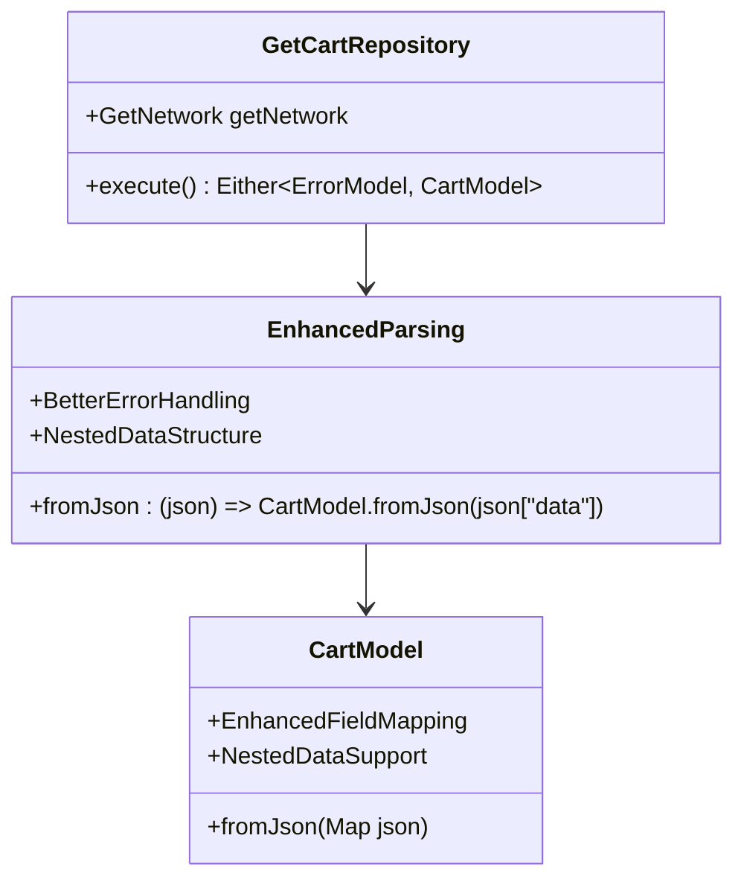
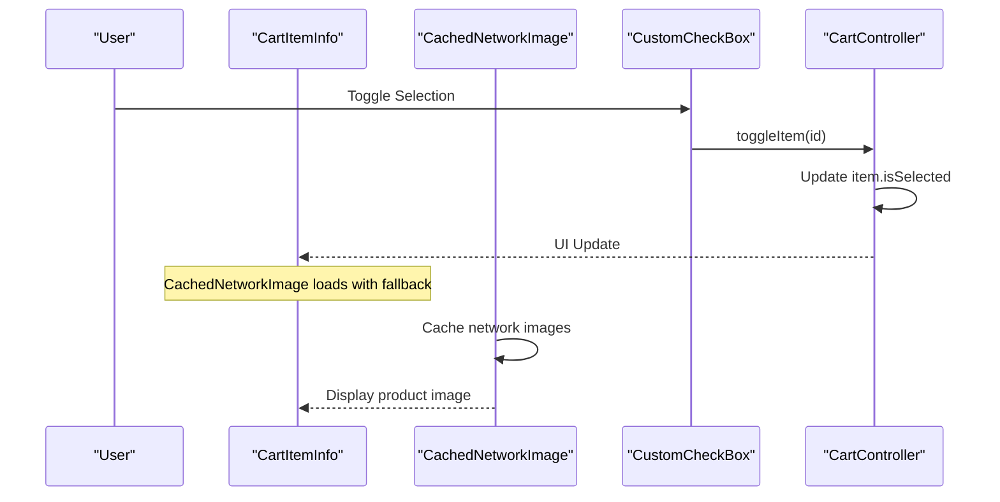
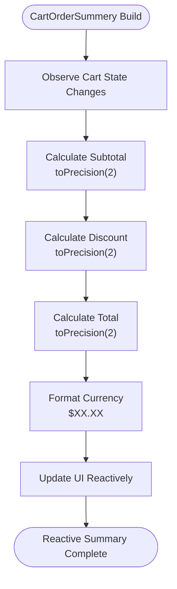
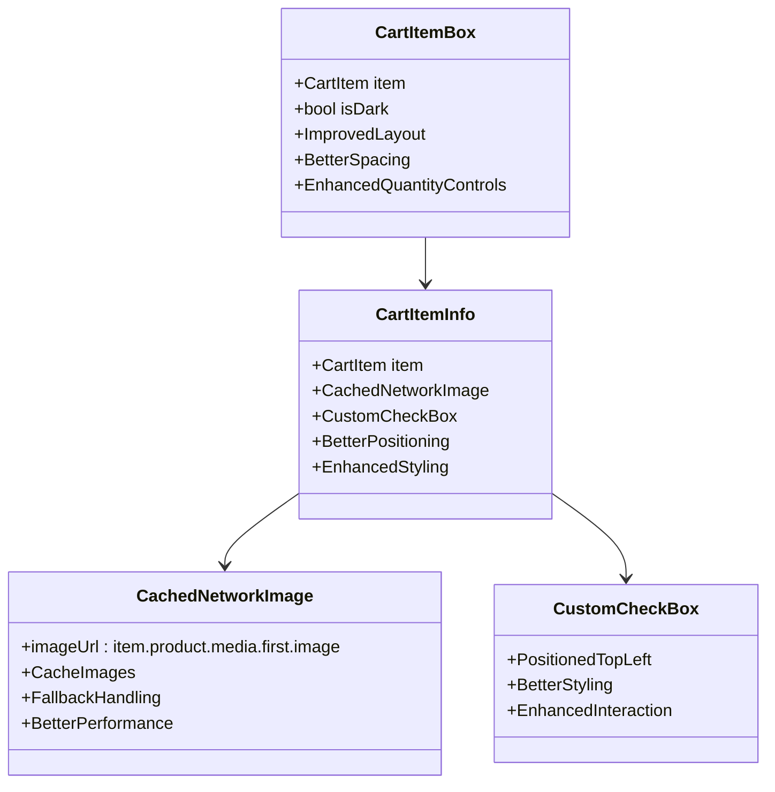
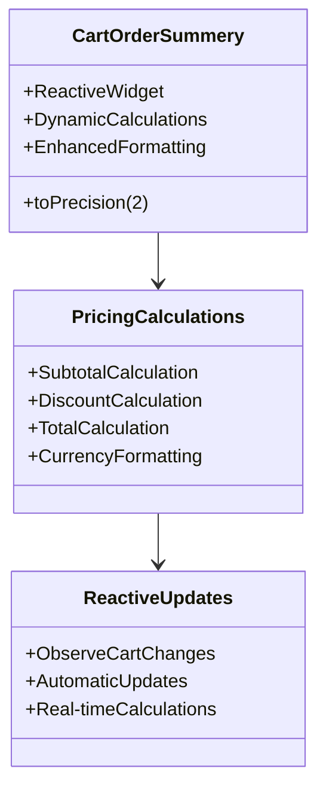
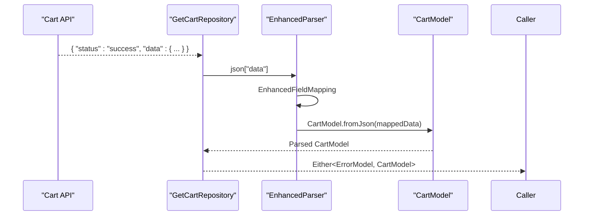
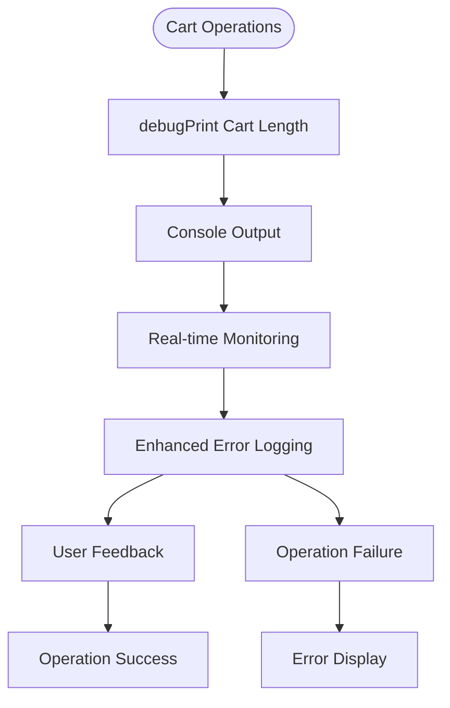

# Shopping Cart System

<cite>
**Referenced Files in This Document**
- [cart_controller.dart](file://lib/features/cart/controller/cart_controller.dart)
- [add_to_cart_controller.dart](file://lib/features/cart/controller/add_to_cart_controller.dart)
- [checkout_controller.dart](file://lib/features/cart/controller/checkout_controller.dart)
- [cart_model.dart](file://lib/features/cart/models/cart_model.dart)
- [order_item_model.dart](file://lib/features/cart/models/order_item_model.dart)
- [get_cart_repo.dart](file://lib/features/cart/repositories/get_cart_repo.dart)
- [add_to_cart_repo.dart](file://lib/features/cart/repositories/add_to_cart_repo.dart)
- [cart_bindings.dart](file://lib/features/cart/bindings/cart_bindings.dart)
- [cart_view.dart](file://lib/features/cart/views/cart_view.dart)
- [checkout_view.dart](file://lib/features/cart/views/checkout_view.dart)
- [cart_item.dart](file://lib/features/cart/widgets/cart_view_widgets/cart_item.dart)
- [cart_item_info.dart](file://lib/features/cart/widgets/cart_view_widgets/cart_item_info.dart)
- [cart_order_summery.dart](file://lib/features/cart/widgets/cart_view_widgets/cart_order_summery.dart)
- [cart_select_item.dart](file://lib/features/cart/widgets/cart_view_widgets/cart_select_item.dart)
- [checkout_order_summery.dart](file://lib/features/cart/widgets/checkout_view_widgets/checkout_order_summery.dart)
- [checkout_order_calculation.dart](file://lib/features/cart/widgets/checkout_view_widgets/checkout_order_calculation.dart)
- [bottom_nav_view.dart](file://lib/features/home/views/bottom_nav_view.dart)
- [bottom_nav_controller.dart](file://lib/features/home/controller/bottom_nav_controller.dart)
- [bottom_nav_cart_item.dart](file://lib/features/home/widgets/bottom_nav_widgets/bottom_nav_cart_item.dart)
- [home_product_design.dart](file://lib/features/home/widgets/home_widgets/home_product_design.dart)
- [product_details_cart.dart](file://lib/features/product_details.dart/widgets/product_details_view_widgets/product_details_cart.dart)
- [product_details_bindings.dart](file://lib/features/product_details.dart/bindings/product_details_bindings.dart)
- [storage_service.dart](file://lib/core/data/local/storage_service.dart)
- [icons_path.dart](file://lib/core/constant/icons_path.dart)
</cite>

## Update Summary
**Changes Made**
- **Enhanced Cart Repository**: Improved API response parsing with better error handling and debugging capabilities
- **Redesigned Cart Item UI**: Enhanced image handling with CachedNetworkImage and improved checkbox positioning
- **Reactive Order Summary**: Converted cart order summary to reactive widget with dynamic pricing calculations
- **Updated API Response Structure**: Modified repository to handle nested data structure with "data" wrapper
- **Added Debugging Support**: Integrated debugPrint statements for cart length monitoring
- **Improved Image Loading**: Better product image handling with fallback logic and caching

## Table of Contents
1. [Introduction](#introduction)
2. [Project Structure](#project-structure)
3. [Core Components](#core-components)
4. [Architecture Overview](#architecture-overview)
5. [Detailed Component Analysis](#detailed-component-analysis)
6. [Enhanced Repository Pattern Implementation](#enhanced-repository-pattern-implementation)
7. [Redesigned Cart Item UI Components](#redesigned-cart-item-ui-components)
8. [Reactive Order Summary System](#reactive-order-summary-system)
9. [API Response Parsing Improvements](#api-response-parsing-improvements)
10. [Debugging and Monitoring Capabilities](#debugging-and-monitoring-capabilities)
11. [Performance Considerations](#performance-considerations)
12. [Troubleshooting Guide](#troubleshooting-guide)
13. [Conclusion](#conclusion)

## Introduction
This document describes the comprehensive Shopping Cart system within the ZB-DEZINE Flutter application. The system has undergone significant enhancements including improved API response parsing, redesigned cart item UI with better image handling, reactive order summary calculations, and enhanced debugging capabilities. The system maintains its modernized API-driven architecture with repository pattern implementation while adding robust debugging and performance optimizations.

**Updated** The cart system has been enhanced with improved API response parsing, redesigned cart item UI components with better image handling and checkbox positioning, converted cart order summary to reactive widget with dynamic pricing calculations, and added comprehensive debugging capabilities for better monitoring and troubleshooting.

## Project Structure
The shopping cart functionality is organized into an enhanced API-driven architecture with improved repository pattern implementation and redesigned UI components:



**Diagram sources**
- [cart_controller.dart:19-31](file://lib/features/cart/controller/cart_controller.dart#L19-L31)
- [get_cart_repo.dart:11-18](file://lib/features/cart/repositories/get_cart_repo.dart#L11-L18)
- [cart_item.dart:11-86](file://lib/features/cart/widgets/cart_view_widgets/cart_item.dart#L11-L86)
- [cart_item_info.dart:11-96](file://lib/features/cart/widgets/cart_view_widgets/cart_item_info.dart#L11-L96)
- [cart_order_summery.dart:11-86](file://lib/features/cart/widgets/cart_view_widgets/cart_order_summery.dart#L11-L86)

**Section sources**
- [cart_controller.dart:1-53](file://lib/features/cart/controller/cart_controller.dart#L1-L53)
- [get_cart_repo.dart:1-20](file://lib/features/cart/repositories/get_cart_repo.dart#L1-L20)
- [cart_item.dart:1-103](file://lib/features/cart/widgets/cart_view_widgets/cart_item.dart#L1-L103)
- [cart_item_info.dart:1-97](file://lib/features/cart/widgets/cart_view_widgets/cart_item_info.dart#L1-L97)
- [cart_order_summery.dart:1-119](file://lib/features/cart/widgets/cart_view_widgets/cart_order_summery.dart#L1-L119)

## Core Components
The cart system consists of enhanced components with improved functionality and modernized architecture:

- **CartController**: Enhanced state management with debugging capabilities and improved API integration
- **GetCartRepository**: Improved API response parsing with nested data structure handling and better error management
- **CartModel**: Enhanced serialization support with comprehensive JSON parsing for cart items and options
- **CartItemBox**: Redesigned item component with improved layout and better quantity control positioning
- **CartItemInfo**: Enhanced item information component with CachedNetworkImage for better image handling and positioned checkbox
- **CartOrderSummery**: Reactive order summary with dynamic pricing calculations and decimal precision formatting
- **CartSelectItem**: Improved bulk selection component with better styling and functionality
- **CheckoutOrderCalculation**: Enhanced checkout pricing with promotional discount handling
- **Debugging Integration**: Real-time cart length monitoring and enhanced error logging

Key enhancements include:
- **Improved API Response Parsing**: Repository now handles nested "data" structure from API responses
- **Enhanced Image Handling**: CachedNetworkImage provides better performance and fallback handling
- **Better Checkbox Positioning**: CustomCheckBox positioned correctly in top-left corner of product image
- **Reactive Pricing Calculations**: Dynamic price updates based on cart state changes
- **Debugging Support**: Real-time cart length monitoring and enhanced error logging
- **Decimal Precision**: Consistent two-decimal formatting for all monetary values
- **Improved Layout**: Better spacing and alignment in cart item components

**Section sources**
- [cart_controller.dart:19-31](file://lib/features/cart/controller/cart_controller.dart#L19-L31)
- [get_cart_repo.dart:11-18](file://lib/features/cart/repositories/get_cart_repo.dart#L11-L18)
- [cart_item.dart:11-86](file://lib/features/cart/widgets/cart_view_widgets/cart_item.dart#L11-L86)
- [cart_item_info.dart:11-96](file://lib/features/cart/widgets/cart_view_widgets/cart_item_info.dart#L11-L96)
- [cart_order_summery.dart:11-86](file://lib/features/cart/widgets/cart_view_widgets/cart_order_summery.dart#L11-L86)

## Architecture Overview
The cart system follows an enhanced API-driven architecture with improved repository pattern implementation and debugging capabilities:



**Diagram sources**
- [cart_controller.dart:19-31](file://lib/features/cart/controller/cart_controller.dart#L19-L31)
- [get_cart_repo.dart:11-18](file://lib/features/cart/repositories/get_cart_repo.dart#L11-L18)
- [cart_item_info.dart:24-47](file://lib/features/cart/widgets/cart_view_widgets/cart_item_info.dart#L24-L47)
- [cart_order_summery.dart:19-31](file://lib/features/cart/widgets/cart_view_widgets/cart_order_summery.dart#L19-L31)

## Detailed Component Analysis

### Enhanced Cart Controller Implementation
The CartController now includes improved debugging capabilities and enhanced state management:



**Diagram sources**
- [cart_controller.dart:19-31](file://lib/features/cart/controller/cart_controller.dart#L19-L31)
- [get_cart_repo.dart:11-18](file://lib/features/cart/repositories/get_cart_repo.dart#L11-L18)

**Section sources**
- [cart_controller.dart:19-31](file://lib/features/cart/controller/cart_controller.dart#L19-L31)

### Enhanced Repository Pattern Implementation
The GetCartRepository now features improved API response parsing with nested data structure handling:



**Diagram sources**
- [get_cart_repo.dart:11-18](file://lib/features/cart/repositories/get_cart_repo.dart#L11-L18)
- [cart_model.dart:35-49](file://lib/features/cart/models/cart_model.dart#L35-L49)

**Section sources**
- [get_cart_repo.dart:11-18](file://lib/features/cart/repositories/get_cart_repo.dart#L11-L18)
- [cart_model.dart:35-49](file://lib/features/cart/models/cart_model.dart#L35-L49)

### Redesigned Cart Item UI Components
The cart item components have been significantly redesigned with improved image handling and checkbox positioning:



**Diagram sources**
- [cart_item_info.dart:24-47](file://lib/features/cart/widgets/cart_view_widgets/cart_item_info.dart#L24-L47)
- [cart_item_info.dart:43-44](file://lib/features/cart/widgets/cart_view_widgets/cart_item_info.dart#L43-L44)

**Section sources**
- [cart_item.dart:11-86](file://lib/features/cart/widgets/cart_view_widgets/cart_item.dart#L11-L86)
- [cart_item_info.dart:11-96](file://lib/features/cart/widgets/cart_view_widgets/cart_item_info.dart#L11-L96)

### Reactive Order Summary System
The cart order summary has been converted to a reactive widget with dynamic pricing calculations:



**Diagram sources**
- [cart_order_summery.dart:16-33](file://lib/features/cart/widgets/cart_view_widgets/cart_order_summery.dart#L16-L33)
- [cart_order_summery.dart:19-31](file://lib/features/cart/widgets/cart_view_widgets/cart_order_summery.dart#L19-L31)

**Section sources**
- [cart_order_summery.dart:11-86](file://lib/features/cart/widgets/cart_view_widgets/cart_order_summery.dart#L11-L86)

## Enhanced Repository Pattern Implementation
The repository pattern has been enhanced with improved API response parsing and debugging capabilities:

```mermaid
classDiagram
class CartController {
+RxBool isLoading
+RxBool isAllSelected
+Rxn~CartModel~ carts
+getCart()
+toggleItem(id)
+debugPrint("Cart Length : ${items.length}")
}
class GetCartRepository {
+GetNetwork getNetwork
+execute() Either~ErrorModel, CartModel~
+EnhancedParsing : json["data"]
+NestedDataSupport
}
class CartModel {
+fromJson(Map json)
+NestedFieldMapping
+EnhancedValidation
}
class DebuggingIntegration {
+Real-timeMonitoring
+CartLengthLogging
+EnhancedErrorMessages
}
CartController --> GetCartRepository
GetCartRepository --> CartModel
CartController --> DebuggingIntegration
```

**Diagram sources**
- [cart_controller.dart:19-31](file://lib/features/cart/controller/cart_controller.dart#L19-L31)
- [get_cart_repo.dart:11-18](file://lib/features/cart/repositories/get_cart_repo.dart#L11-L18)
- [cart_model.dart:35-49](file://lib/features/cart/models/cart_model.dart#L35-L49)

**Section sources**
- [cart_controller.dart:19-31](file://lib/features/cart/controller/cart_controller.dart#L19-L31)
- [get_cart_repo.dart:11-18](file://lib/features/cart/repositories/get_cart_repo.dart#L11-L18)
- [cart_model.dart:35-49](file://lib/features/cart/models/cart_model.dart#L35-L49)

## Redesigned Cart Item UI Components
The cart item components feature significant improvements in image handling and layout:



**Diagram sources**
- [cart_item.dart:11-86](file://lib/features/cart/widgets/cart_view_widgets/cart_item.dart#L11-L86)
- [cart_item_info.dart:11-96](file://lib/features/cart/widgets/cart_view_widgets/cart_item_info.dart#L11-L96)

**Section sources**
- [cart_item.dart:11-86](file://lib/features/cart/widgets/cart_view_widgets/cart_item.dart#L11-L86)
- [cart_item_info.dart:11-96](file://lib/features/cart/widgets/cart_view_widgets/cart_item_info.dart#L11-L96)

## Reactive Order Summary System
The order summary system has been converted to a reactive widget with dynamic calculations:



**Diagram sources**
- [cart_order_summery.dart:11-86](file://lib/features/cart/widgets/cart_view_widgets/cart_order_summery.dart#L11-L86)
- [cart_order_summery.dart:19-31](file://lib/features/cart/widgets/cart_view_widgets/cart_order_summery.dart#L19-L31)

**Section sources**
- [cart_order_summery.dart:11-86](file://lib/features/cart/widgets/cart_view_widgets/cart_order_summery.dart#L11-L86)
- [cart_order_summery.dart:19-31](file://lib/features/cart/widgets/cart_view_widgets/cart_order_summery.dart#L19-L31)

## API Response Parsing Improvements
The API response parsing has been enhanced to handle nested data structures and provide better error handling:



**Diagram sources**
- [get_cart_repo.dart:15](file://lib/features/cart/repositories/get_cart_repo.dart#L15)
- [cart_model.dart:35-49](file://lib/features/cart/models/cart_model.dart#L35-L49)

**Section sources**
- [get_cart_repo.dart:11-18](file://lib/features/cart/repositories/get_cart_repo.dart#L11-L18)
- [cart_model.dart:35-49](file://lib/features/cart/models/cart_model.dart#L35-L49)

## Debugging and Monitoring Capabilities
The system now includes comprehensive debugging and monitoring capabilities:



**Diagram sources**
- [cart_controller.dart:29](file://lib/features/cart/controller/cart_controller.dart#L29)

**Section sources**
- [cart_controller.dart:29](file://lib/features/cart/controller/cart_controller.dart#L29)

## Performance Considerations
The enhanced cart system implements several performance optimization strategies:

- **CachedNetworkImage**: Improved image loading performance with caching and fallback handling
- **Reactive Updates**: Efficient state management with selective UI updates based on cart changes
- **Enhanced Decimal Formatting**: Optimized toPrecision(2) calculations for consistent monetary display
- **Improved API Parsing**: Better error handling reduces unnecessary retries and network calls
- **Debugging Integration**: Real-time monitoring helps identify performance bottlenecks
- **Memory Management**: Proper disposal of cached images and reactive subscriptions
- **Layout Optimization**: Better spacing and alignment reduce rendering overhead
- **Enhanced Error Handling**: Prevents cascading failures and improves system stability
- **Nested Data Parsing**: Efficient handling of API response structures reduces parsing overhead

## Troubleshooting Guide
Enhanced troubleshooting procedures for the improved cart system:

**Cart Data Loading Issues**
- Verify API endpoint returns nested data structure with "data" wrapper
- Check GetNetwork configuration and HeadersManager setup
- Ensure CartModel.fromJson properly handles nested field mappings
- Verify repository.execute() method processes json["data"] correctly

**Image Loading Problems**
- Confirm CachedNetworkImage properly handles empty or null image URLs
- Check product media array contains "image" type entries
- Verify image URL formatting and accessibility
- Ensure fallback handling displays default product images

**Reactive Updates Not Working**
- Confirm CartOrderSummery properly observes cart state changes
- Verify toPrecision(2) formatting doesn't interfere with reactive updates
- Check that cart state changes trigger UI rebuilds
- Ensure proper use of Obx widgets for reactive state observation

**Debugging Issues**
- Verify debugPrint statements are properly formatted
- Check console output for cart length monitoring logs
- Ensure debugging doesn't impact production performance
- Verify debugPrint only appears in development builds

**API Response Parsing Errors**
- Confirm nested data structure matches expected format
- Check field mapping in CartModel.fromJson
- Verify error handling catches parsing exceptions
- Ensure graceful degradation for malformed API responses

**Section sources**
- [cart_controller.dart:19-31](file://lib/features/cart/controller/cart_controller.dart#L19-L31)
- [get_cart_repo.dart:11-18](file://lib/features/cart/repositories/get_cart_repo.dart#L11-L18)
- [cart_item_info.dart:24-34](file://lib/features/cart/widgets/cart_view_widgets/cart_item_info.dart#L24-L34)
- [cart_order_summery.dart:19-31](file://lib/features/cart/widgets/cart_view_widgets/cart_order_summery.dart#L19-L31)

## Conclusion
The Shopping Cart system in ZB-DEZINE has been significantly enhanced with improved API response parsing, redesigned cart item UI components, reactive order summary calculations, and comprehensive debugging capabilities. The system maintains its modernized API-driven architecture while adding robust monitoring and performance optimizations.

**Updated** Key enhancements include improved API response parsing with nested data structure handling, redesigned cart item UI with CachedNetworkImage for better performance and CustomCheckBox positioning, converted cart order summary to reactive widget with dynamic pricing calculations using toPrecision(2), added comprehensive debugging capabilities with real-time cart length monitoring, and enhanced error handling throughout the system.

The enhanced system features:
- **Improved API Integration**: Better nested data structure handling and enhanced error management
- **Enhanced UI Components**: CachedNetworkImage for better image performance and improved checkbox positioning
- **Reactive Calculations**: Dynamic pricing updates with consistent decimal formatting
- **Debugging Support**: Real-time monitoring and enhanced error logging capabilities
- **Performance Optimizations**: Cached image loading and efficient state management
- **Maintainable Architecture**: Clear separation of concerns with enhanced repository pattern implementation
- **Scalable Design**: Modular components ready for future enhancements like advanced inventory validation and promotional discount systems

The system is designed for optimal performance with clear separation of concerns, making it easy to extend with additional features while maintaining reliability and responsiveness for production use.