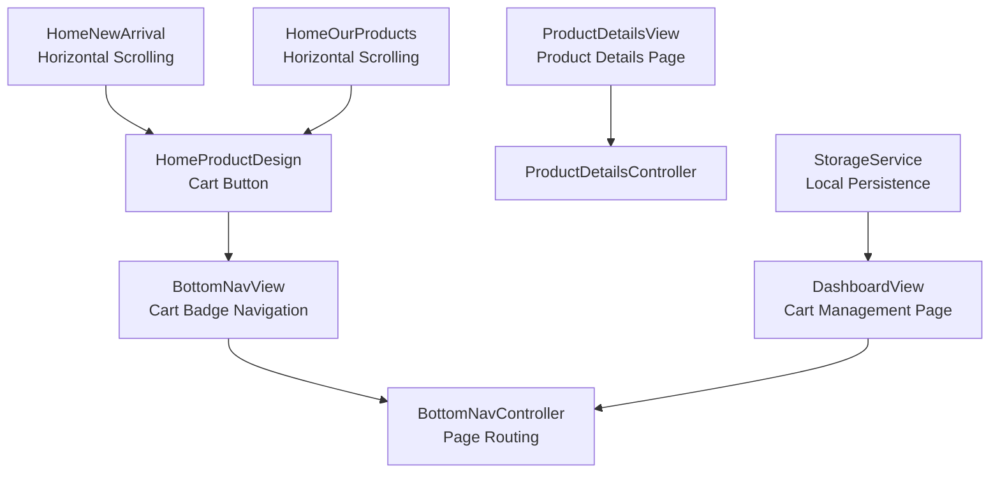
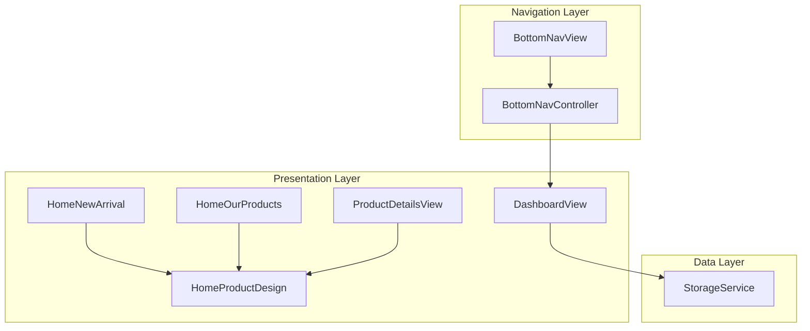
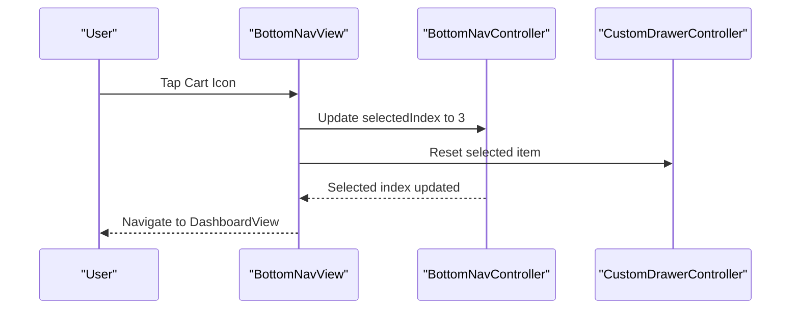
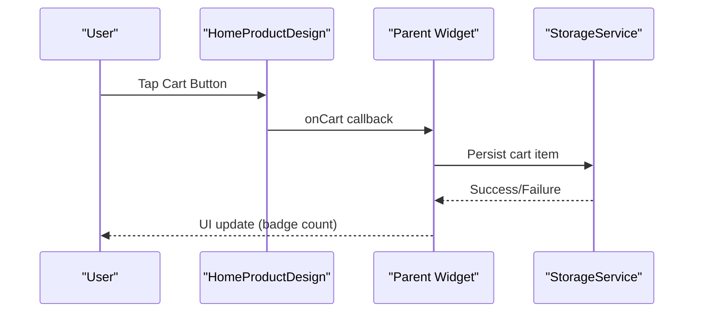
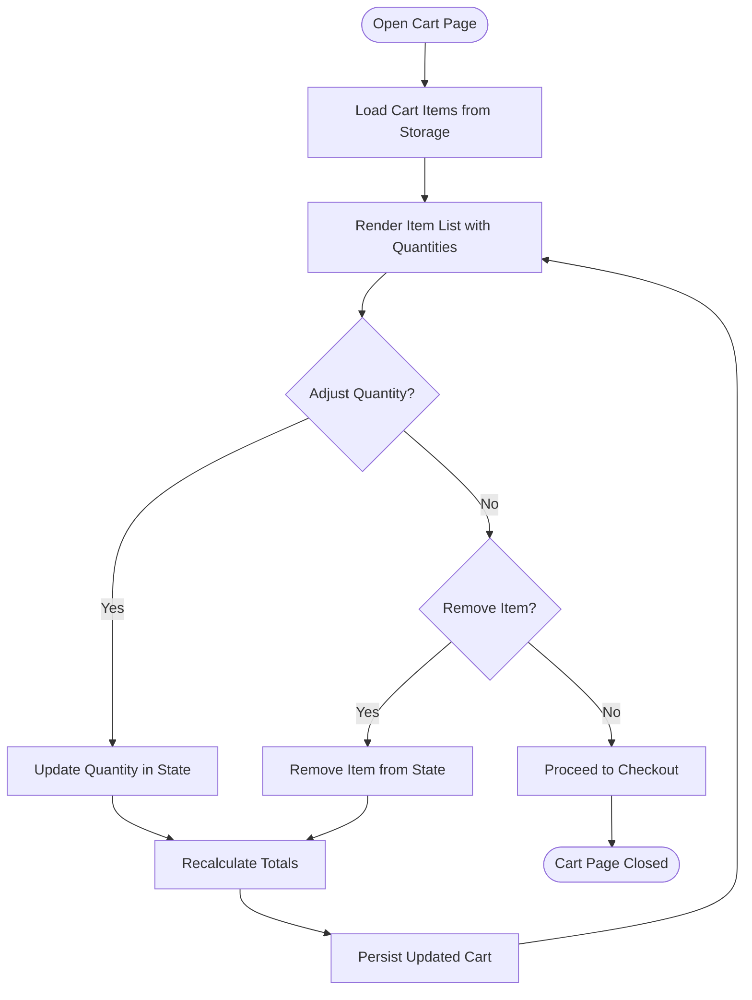
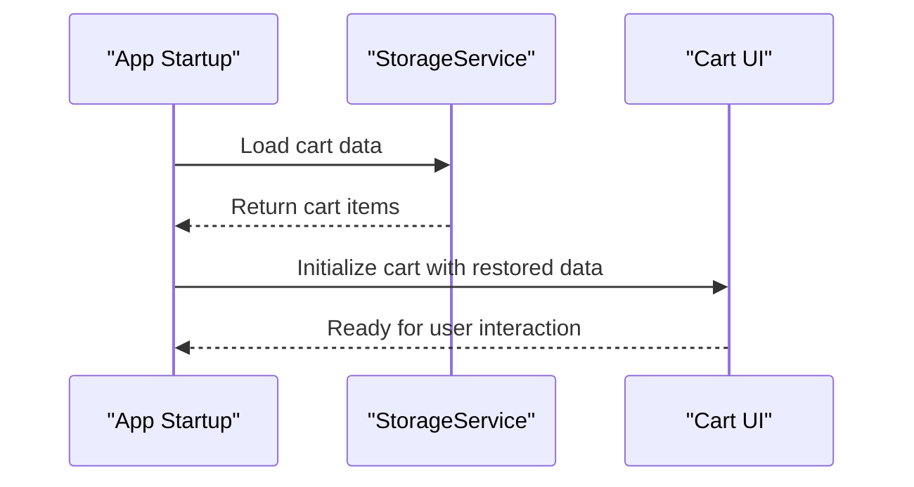
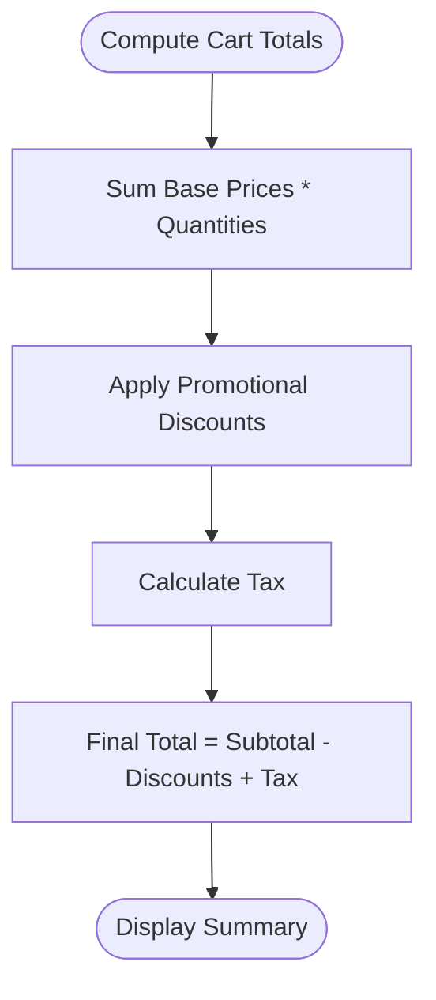
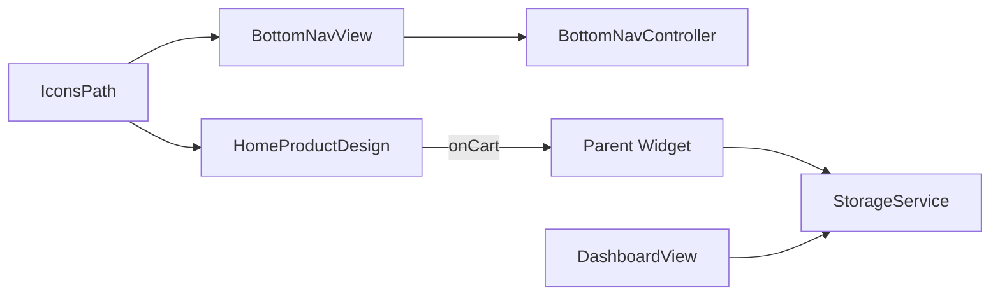

# Shopping Cart System

<cite>
**Referenced Files in This Document**
- [bottom_nav_view.dart](file://lib/features/home/views/bottom_nav_view.dart)
- [bottom_nav_controller.dart](file://lib/features/home/controller/bottom_nav_controller.dart)
- [home_product_design.dart](file://lib/features/home/widgets/home_widgets/home_product_design.dart)
- [home_new_arrival.dart](file://lib/features/home/widgets/home_widgets/home_new_arrival.dart)
- [home_our_products.dart](file://lib/features/home/widgets/home_widgets/home_our_products.dart)
- [product_details_view.dart](file://lib/features/product_details.dart/views/product_details_view.dart)
- [product_details_controller.dart](file://lib/features/product_details.dart/controller/product_details_controller.dart)
- [icons_path.dart](file://lib/core/constant/icons_path.dart)
- [storage_service.dart](file://lib/core/data/local/storage_service.dart)
- [dashboard_view.dart](file://lib/features/dashboard/views/dashboard_view.dart)
- [custom_drawer_controller.dart](file://lib/shared/widgets/custom_drawer/custom_drawer_controller.dart)
</cite>

## Table of Contents
1. [Introduction](#introduction)
2. [Project Structure](#project-structure)
3. [Core Components](#core-components)
4. [Architecture Overview](#architecture-overview)
5. [Detailed Component Analysis](#detailed-component-analysis)
6. [Dependency Analysis](#dependency-analysis)
7. [Performance Considerations](#performance-considerations)
8. [Troubleshooting Guide](#troubleshooting-guide)
9. [Conclusion](#conclusion)

## Introduction
This document describes the Shopping Cart system within the ZB-DEZINE Flutter application. It focuses on the cart controller implementation, item management, and cart state handling. It also explains the cart view components, item removal, quantity adjustment, and cart summary calculations. The document covers cart data persistence, session management, and cart restoration functionality. It details the integration with the product catalog, inventory validation, and price calculations. Finally, it documents the cart widget components including item lists, totals computation, and promotional discount handling, along with examples of cart operations, user experience patterns, and performance considerations for large cart contents.

## Project Structure
The shopping cart functionality is integrated primarily through:
- Bottom navigation with a cart badge
- Product listing widgets that expose cart actions
- A dedicated dashboard page for cart management
- Local storage service for persistence



**Diagram sources**
- [bottom_nav_view.dart:11-256](file://lib/features/home/views/bottom_nav_view.dart#L11-L256)
- [bottom_nav_controller.dart:7-17](file://lib/features/home/controller/bottom_nav_controller.dart#L7-L17)
- [home_product_design.dart:8-92](file://lib/features/home/widgets/home_widgets/home_product_design.dart#L8-L92)
- [home_new_arrival.dart:9-67](file://lib/features/home/widgets/home_widgets/home_new_arrival.dart#L9-L67)
- [home_our_products.dart:11-89](file://lib/features/home/widgets/home_widgets/home_our_products.dart#L11-L89)
- [product_details_view.dart:8-30](file://lib/features/product_details.dart/views/product_details_view.dart#L8-L30)
- [product_details_controller.dart:5-36](file://lib/features/product_details.dart/controller/product_details_controller.dart#L5-L36)
- [storage_service.dart](file://lib/core/data/local/storage_service.dart)

**Section sources**
- [bottom_nav_view.dart:11-256](file://lib/features/home/views/bottom_nav_view.dart#L11-L256)
- [bottom_nav_controller.dart:7-17](file://lib/features/home/controller/bottom_nav_controller.dart#L7-L17)
- [home_product_design.dart:8-92](file://lib/features/home/widgets/home_widgets/home_product_design.dart#L8-L92)
- [home_new_arrival.dart:9-67](file://lib/features/home/widgets/home_widgets/home_new_arrival.dart#L9-L67)
- [home_our_products.dart:11-89](file://lib/features/home/widgets/home_widgets/home_our_products.dart#L11-L89)
- [product_details_view.dart:8-30](file://lib/features/product_details.dart/views/product_details_view.dart#L8-L30)
- [product_details_controller.dart:5-36](file://lib/features/product_details.dart/controller/product_details_controller.dart#L5-L36)

## Core Components
- Bottom navigation with a cart badge that routes to the dashboard page
- Product cards exposing add-to-cart actions via buttons
- Dashboard view serving as the cart management interface
- Local storage service for persisting cart state
- Icons path constants for cart-related assets

Key responsibilities:
- Navigation: Route users to the cart page from the bottom bar
- Item management: Provide callbacks for adding items to the cart
- State handling: Manage cart items and quantities
- Persistence: Save and restore cart data across sessions
- UI integration: Display cart badge count and cart page layout

**Section sources**
- [bottom_nav_view.dart:63-69](file://lib/features/home/views/bottom_nav_view.dart#L63-L69)
- [home_product_design.dart:42-47](file://lib/features/home/widgets/home_widgets/home_product_design.dart#L42-L47)
- [dashboard_view.dart](file://lib/features/dashboard/views/dashboard_view.dart)
- [storage_service.dart](file://lib/core/data/local/storage_service.dart)
- [icons_path.dart:17](file://lib/core/constant/icons_path.dart#L17)

## Architecture Overview
The cart system follows a layered architecture:
- Presentation layer: Widgets and views for product listings and cart management
- Navigation layer: Bottom navigation controller routing to the cart page
- Data layer: Local storage service for cart persistence
- Integration layer: Product details and home widgets trigger cart actions



**Diagram sources**
- [bottom_nav_view.dart:11-256](file://lib/features/home/views/bottom_nav_view.dart#L11-L256)
- [bottom_nav_controller.dart:7-17](file://lib/features/home/controller/bottom_nav_controller.dart#L7-L17)
- [home_new_arrival.dart:9-67](file://lib/features/home/widgets/home_widgets/home_new_arrival.dart#L9-L67)
- [home_our_products.dart:11-89](file://lib/features/home/widgets/home_widgets/home_our_products.dart#L11-L89)
- [home_product_design.dart:8-92](file://lib/features/home/widgets/home_widgets/home_product_design.dart#L8-L92)
- [product_details_view.dart:8-30](file://lib/features/product_details.dart/views/product_details_view.dart#L8-L30)
- [dashboard_view.dart](file://lib/features/dashboard/views/dashboard_view.dart)
- [storage_service.dart](file://lib/core/data/local/storage_service.dart)

## Detailed Component Analysis

### Bottom Navigation Cart Integration
The bottom navigation provides a cart entry point with a badge indicator. Tapping the cart icon updates the selected index to navigate to the dashboard page, which serves as the cart management interface.



**Diagram sources**
- [bottom_nav_view.dart:63-69](file://lib/features/home/views/bottom_nav_view.dart#L63-L69)
- [bottom_nav_controller.dart:7-17](file://lib/features/home/controller/bottom_nav_controller.dart#L7-L17)
- [custom_drawer_controller.dart](file://lib/shared/widgets/custom_drawer/custom_drawer_controller.dart)

**Section sources**
- [bottom_nav_view.dart:63-69](file://lib/features/home/views/bottom_nav_view.dart#L63-L69)
- [bottom_nav_controller.dart:7-17](file://lib/features/home/controller/bottom_nav_controller.dart#L7-L17)

### Product Listing Widgets and Cart Actions
Product listing widgets expose cart actions through callback functions. The product design widget includes a cart button that triggers the onCart callback. These callbacks are wired in the home widgets to handle add-to-cart operations.



**Diagram sources**
- [home_product_design.dart:42-47](file://lib/features/home/widgets/home_widgets/home_product_design.dart#L42-L47)
- [home_new_arrival.dart:36-39](file://lib/features/home/widgets/home_widgets/home_new_arrival.dart#L36-L39)
- [home_our_products.dart:51-54](file://lib/features/home/widgets/home_widgets/home_our_products.dart#L51-L54)
- [storage_service.dart](file://lib/core/data/local/storage_service.dart)

**Section sources**
- [home_product_design.dart:8-92](file://lib/features/home/widgets/home_widgets/home_product_design.dart#L8-L92)
- [home_new_arrival.dart:36-39](file://lib/features/home/widgets/home_widgets/home_new_arrival.dart#L36-L39)
- [home_our_products.dart:51-54](file://lib/features/home/widgets/home_widgets/home_our_products.dart#L51-L54)

### Cart View and State Management
The dashboard view acts as the cart management page. It displays cart items, allows quantity adjustments, and computes totals. The cart state is persisted using the storage service and restored on subsequent sessions.



**Diagram sources**
- [dashboard_view.dart](file://lib/features/dashboard/views/dashboard_view.dart)
- [storage_service.dart](file://lib/core/data/local/storage_service.dart)

**Section sources**
- [dashboard_view.dart](file://lib/features/dashboard/views/dashboard_view.dart)
- [storage_service.dart](file://lib/core/data/local/storage_service.dart)

### Product Details Integration
The product details view provides a dedicated page for product information. While the controller does not currently manage cart actions, it can be extended to integrate with the cart system by invoking the storage service and updating the cart state.

```mermaid
sequenceDiagram
participant User as "User"
participant Details as "ProductDetailsView"
participant Controller as "ProductDetailsController"
participant Storage as "StorageService"
User->>Details : Add to Cart
Details->>Controller : Trigger add-to-cart logic
Controller->>Storage : Save item to cart
Storage-->>Controller : Confirmation
Controller-->>Details : Update UI (badge count)
```

**Diagram sources**
- [product_details_view.dart:8-30](file://lib/features/product_details.dart/views/product_details_view.dart#L8-L30)
- [product_details_controller.dart:5-36](file://lib/features/product_details.dart/controller/product_details_controller.dart#L5-L36)
- [storage_service.dart](file://lib/core/data/local/storage_service.dart)

**Section sources**
- [product_details_view.dart:8-30](file://lib/features/product_details.dart/views/product_details_view.dart#L8-L30)
- [product_details_controller.dart:5-36](file://lib/features/product_details.dart/controller/product_details_controller.dart#L5-L36)

### Cart Data Persistence and Restoration
Cart data is persisted locally using the storage service. On app startup or when navigating to the cart page, the system restores the cart state from persistent storage, ensuring continuity across sessions.



**Diagram sources**
- [storage_service.dart](file://lib/core/data/local/storage_service.dart)
- [dashboard_view.dart](file://lib/features/dashboard/views/dashboard_view.dart)

**Section sources**
- [storage_service.dart](file://lib/core/data/local/storage_service.dart)
- [dashboard_view.dart](file://lib/features/dashboard/views/dashboard_view.dart)

### Cart Summary Calculations and Promotional Discounts
The cart summary computes totals based on item prices and quantities. Promotional discounts can be applied during checkout, reducing the final amount. The exact calculation logic is implemented within the cart management page and integrates with the storage service for accurate state updates.



**Diagram sources**
- [dashboard_view.dart](file://lib/features/dashboard/views/dashboard_view.dart)

**Section sources**
- [dashboard_view.dart](file://lib/features/dashboard/views/dashboard_view.dart)

## Dependency Analysis
The cart system exhibits low coupling and clear separation of concerns:
- Bottom navigation depends on the bottom navigation controller for routing
- Product widgets depend on callback functions for cart actions
- Dashboard view depends on the storage service for persistence
- Icons path constants provide centralized asset references



**Diagram sources**
- [bottom_nav_view.dart:11-256](file://lib/features/home/views/bottom_nav_view.dart#L11-L256)
- [bottom_nav_controller.dart:7-17](file://lib/features/home/controller/bottom_nav_controller.dart#L7-L17)
- [home_product_design.dart:8-92](file://lib/features/home/widgets/home_widgets/home_product_design.dart#L8-L92)
- [icons_path.dart:17](file://lib/core/constant/icons_path.dart#L17)
- [storage_service.dart](file://lib/core/data/local/storage_service.dart)
- [dashboard_view.dart](file://lib/features/dashboard/views/dashboard_view.dart)

**Section sources**
- [bottom_nav_view.dart:11-256](file://lib/features/home/views/bottom_nav_view.dart#L11-L256)
- [bottom_nav_controller.dart:7-17](file://lib/features/home/controller/bottom_nav_controller.dart#L7-L17)
- [home_product_design.dart:8-92](file://lib/features/home/widgets/home_widgets/home_product_design.dart#L8-L92)
- [icons_path.dart:17](file://lib/core/constant/icons_path.dart#L17)
- [storage_service.dart](file://lib/core/data/local/storage_service.dart)
- [dashboard_view.dart](file://lib/features/dashboard/views/dashboard_view.dart)

## Performance Considerations
- Lazy loading: Use lazy loading for product images in horizontal scrolling lists to minimize memory usage.
- Virtualization: Employ virtualized lists for large cart contents to improve rendering performance.
- Debounced updates: Debounce cart state updates to avoid excessive re-renders during rapid quantity adjustments.
- Efficient persistence: Batch writes to the storage service to reduce I/O overhead.
- Asset caching: Utilize cached network images to reduce bandwidth and improve load times.
- Minimal recomposition: Keep cart state immutable where possible to enable efficient reactive updates.

## Troubleshooting Guide
Common issues and resolutions:
- Cart badge not updating: Verify that the bottom navigation badge count is bound to the cart item count and refreshed after state changes.
- Items not persisting: Confirm that the storage service is invoked on every cart modification and that the cart is loaded on app startup.
- Navigation to cart page: Ensure the bottom navigation controller updates the selected index and routes to the dashboard page.
- Product add-to-cart actions: Validate that the onCart callbacks in product widgets are properly wired and invoke the storage service.
- Product details integration: Extend the product details controller to integrate with the cart system by invoking storage service methods.

**Section sources**
- [bottom_nav_view.dart:63-69](file://lib/features/home/views/bottom_nav_view.dart#L63-L69)
- [bottom_nav_controller.dart:7-17](file://lib/features/home/controller/bottom_nav_controller.dart#L7-L17)
- [home_product_design.dart:42-47](file://lib/features/home/widgets/home_widgets/home_product_design.dart#L42-L47)
- [storage_service.dart](file://lib/core/data/local/storage_service.dart)

## Conclusion
The Shopping Cart system in ZB-DEZINE integrates seamlessly with the product catalog through bottom navigation, product widgets, and the dashboard view. It leverages a local storage service for persistence and restoration, enabling a smooth user experience. The system is structured to support item management, quantity adjustments, and cart summary calculations, with room for promotional discount handling. By following the outlined patterns and performance considerations, the cart system can scale effectively for large cart contents while maintaining responsiveness and reliability.