# Shopping Cart System

<cite>
**Referenced Files in This Document**
- [cart_controller.dart](file://lib/features/cart/controller/cart_controller.dart)
- [add_to_cart_controller.dart](file://lib/features/cart/controller/add_to_cart_controller.dart)
- [checkout_controller.dart](file://lib/features/cart/controller/checkout_controller.dart)
- [cart_model.dart](file://lib/features/cart/models/cart_model.dart)
- [order_item_model.dart](file://lib/features/cart/models/order_item_model.dart)
- [get_cart_repo.dart](file://lib/features/cart/repositories/get_cart_repo.dart)
- [add_to_cart_repo.dart](file://lib/features/cart/repositories/add_to_cart_repo.dart)
- [cart_bindings.dart](file://lib/features/cart/bindings/cart_bindings.dart)
- [cart_view.dart](file://lib/features/cart/views/cart_view.dart)
- [checkout_view.dart](file://lib/features/cart/views/checkout_view.dart)
- [cart_item.dart](file://lib/features/cart/widgets/cart_view_widgets/cart_item.dart)
- [cart_item_info.dart](file://lib/features/cart/widgets/cart_view_widgets/cart_item_info.dart)
- [cart_order_summery.dart](file://lib/features/cart/widgets/cart_view_widgets/cart_order_summery.dart)
- [checkout_order_summery.dart](file://lib/features/cart/widgets/checkout_view_widgets/checkout_order_summery.dart)
- [checkout_order_calculation.dart](file://lib/features/cart/widgets/checkout_view_widgets/checkout_order_calculation.dart)
- [bottom_nav_view.dart](file://lib/features/home/views/bottom_nav_view.dart)
- [bottom_nav_controller.dart](file://lib/features/home/controller/bottom_nav_controller.dart)
- [bottom_nav_cart_item.dart](file://lib/features/home/widgets/bottom_nav_widgets/bottom_nav_cart_item.dart)
- [home_product_design.dart](file://lib/features/home/widgets/home_widgets/home_product_design.dart)
- [product_details_cart.dart](file://lib/features/product_details.dart/widgets/product_details_view_widgets/product_details_cart.dart)
- [product_details_bindings.dart](file://lib/features/product_details.dart/bindings/product_details_bindings.dart)
- [storage_service.dart](file://lib/core/data/local/storage_service.dart)
- [icons_path.dart](file://lib/core/constant/icons_path.dart)
</cite>

## Update Summary
**Changes Made**
- **Major Cart System Transformation**: Complete migration from local static data to API-driven architecture with repository pattern
- **New Repository Pattern Implementation**: Introduced GetCartRepository and AddToCartRepository with proper error handling using fpdart Either type
- **Enhanced CartModel Serialization**: Added comprehensive JSON serialization support with CartModel, CartItem, and CartOption classes
- **API Integration Enhancement**: Implemented proper null safety and API integration with cart data persistence
- **Modernized Controller Architecture**: Updated CartController and AddToCartController with repository-based operations
- **Enhanced Error Handling**: Integrated fpdart Either type for robust error handling across cart operations
- **Complete Cart Restoration**: Implemented cart restoration functionality through API-driven data fetching

## Table of Contents
1. [Introduction](#introduction)
2. [Project Structure](#project-structure)
3. [Core Components](#core-components)
4. [Architecture Overview](#architecture-overview)
5. [Detailed Component Analysis](#detailed-component-analysis)
6. [API-Driven Cart System](#api-driven-cart-system)
7. [Repository Pattern Implementation](#repository-pattern-implementation)
8. [Enhanced Cart Model Architecture](#enhanced-cart-model-architecture)
9. [Dependency Analysis](#dependency-analysis)
10. [Performance Considerations](#performance-considerations)
11. [Troubleshooting Guide](#troubleshooting-guide)
12. [Conclusion](#conclusion)

## Introduction
This document describes the comprehensive Shopping Cart system within the ZB-DEZINE Flutter application. The system has undergone a major transformation from local static data management to a modern API-driven architecture with repository pattern implementation. The system features enhanced cart state handling, item management operations, and seamless integration with the product catalog, checkout system, and navigation system through proper API integration and error handling.

**Updated** The cart system has been completely modernized with API-driven architecture, repository pattern implementation, comprehensive serialization support, and enhanced error handling using fpdart Either type for robust cart operations.

## Project Structure
The shopping cart functionality is organized into a modernized API-driven architecture with dedicated controllers, repositories, models, views, and widgets:

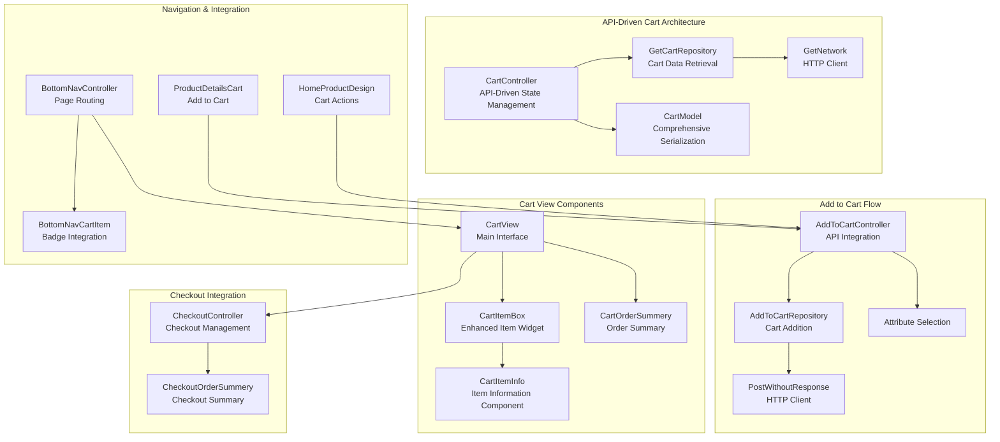

**Diagram sources**
- [cart_controller.dart:1-51](file://lib/features/cart/controller/cart_controller.dart#L1-L51)
- [add_to_cart_controller.dart:1-40](file://lib/features/cart/controller/add_to_cart_controller.dart#L1-L40)
- [cart_model.dart:1-165](file://lib/features/cart/models/cart_model.dart#L1-L165)
- [get_cart_repo.dart:1-19](file://lib/features/cart/repositories/get_cart_repo.dart#L1-L19)
- [add_to_cart_repo.dart:1-28](file://lib/features/cart/repositories/add_to_cart_repo.dart#L1-L28)
- [cart_view.dart:12-61](file://lib/features/cart/views/cart_view.dart#L12-L61)
- [cart_item.dart:1-103](file://lib/features/cart/widgets/cart_view_widgets/cart_item.dart#L1-L103)
- [cart_item_info.dart:1-105](file://lib/features/cart/widgets/cart_view_widgets/cart_item_info.dart#L1-L105)
- [cart_order_summery.dart:1-93](file://lib/features/cart/widgets/cart_view_widgets/cart_order_summery.dart#L1-L93)
- [checkout_controller.dart:1-82](file://lib/features/cart/controller/checkout_controller.dart#L1-L82)
- [checkout_order_summery.dart:1-94](file://lib/features/cart/widgets/checkout_view_widgets/checkout_order_summery.dart#L1-L94)
- [bottom_nav_controller.dart:1-18](file://lib/features/home/controller/bottom_nav_controller.dart#L1-L18)
- [bottom_nav_cart_item.dart:1-75](file://lib/features/home/widgets/bottom_nav_widgets/bottom_nav_cart_item.dart#L1-L75)
- [home_product_design.dart:1-106](file://lib/features/home/widgets/home_widgets/home_product_design.dart#L1-L106)
- [product_details_cart.dart:1-108](file://lib/features/product_details.dart/widgets/product_details_view_widgets/product_details_cart.dart#L1-L108)

**Section sources**
- [cart_controller.dart:1-51](file://lib/features/cart/controller/cart_controller.dart#L1-L51)
- [add_to_cart_controller.dart:1-40](file://lib/features/cart/controller/add_to_cart_controller.dart#L1-L40)
- [cart_model.dart:1-165](file://lib/features/cart/models/cart_model.dart#L1-L165)
- [get_cart_repo.dart:1-19](file://lib/features/cart/repositories/get_cart_repo.dart#L1-L19)
- [add_to_cart_repo.dart:1-28](file://lib/features/cart/repositories/add_to_cart_repo.dart#L1-L28)
- [cart_view.dart:12-61](file://lib/features/cart/views/cart_view.dart#L12-L61)
- [cart_item.dart:1-103](file://lib/features/cart/widgets/cart_view_widgets/cart_item.dart#L1-L103)
- [cart_item_info.dart:1-105](file://lib/features/cart/widgets/cart_view_widgets/cart_item_info.dart#L1-L105)
- [cart_order_summery.dart:1-93](file://lib/features/cart/widgets/cart_view_widgets/cart_order_summery.dart#L1-L93)
- [checkout_controller.dart:1-82](file://lib/features/cart/controller/checkout_controller.dart#L1-L82)
- [checkout_order_summery.dart:1-94](file://lib/features/cart/widgets/checkout_view_widgets/checkout_order_summery.dart#L1-L94)
- [bottom_nav_controller.dart:1-18](file://lib/features/home/controller/bottom_nav_controller.dart#L1-L18)
- [bottom_nav_cart_item.dart:1-75](file://lib/features/home/widgets/bottom_nav_widgets/bottom_nav_cart_item.dart#L1-L75)
- [home_product_design.dart:1-106](file://lib/features/home/widgets/home_widgets/home_product_design.dart#L1-L106)
- [product_details_cart.dart:1-108](file://lib/features/product_details.dart/widgets/product_details_view_widgets/product_details_cart.dart#L1-L108)

## Core Components
The cart system consists of several key components working together in a modernized API-driven architecture:

- **CartController**: Manages cart state with reactive properties, API-driven data fetching, and item selection functionality
- **AddToCartController**: Handles add-to-cart operations with attribute validation and API integration
- **GetCartRepository**: Fetches cart data from API with proper error handling using fpdart Either type
- **AddToCartRepository**: Adds products to cart via API with comprehensive validation
- **CartModel**: Comprehensive cart data model with JSON serialization support for cart items, options, and pricing
- **OrderItemModel**: Defines checkout order item structure for order summary display
- **CartView**: Main cart interface displaying items in a scrollable list with custom appbar
- **CheckoutView**: Complete checkout interface with address, payment, and order summary components
- **CartItemBox**: Enhanced individual cart item component with separated item info and quantity controls
- **CartItemInfo**: Dedicated item information component with selection checkbox and details
- **CartOrderSummery**: Enhanced order summary with pricing calculations and promotional discount
- **CheckoutOrderSummery**: Complete checkout order summary with editable items
- **CheckoutOrderCalculation**: Promotional discount handling and pricing breakdown
- **Bottom Navigation Integration**: Cart badge with item count and navigation to cart page
- **Product Details Integration**: Add to cart functionality with attribute selection and validation

Key responsibilities include:
- API-driven state management with reactive updates using GetX framework
- Repository pattern implementation for clean separation of concerns
- Comprehensive JSON serialization and deserialization for cart data
- Robust error handling using fpdart Either type for reliable API operations
- Enhanced item selection with individual and bulk operations
- Attribute validation and selection for product customization
- Quantity adjustment with validation and refresh mechanisms
- Item deletion with state synchronization
- Enhanced order summary with promotional discount handling
- Complete checkout workflow with form validation and payment processing
- UI integration with responsive design and theming
- Navigation integration with badge count updates

**Section sources**
- [cart_controller.dart:1-51](file://lib/features/cart/controller/cart_controller.dart#L1-L51)
- [add_to_cart_controller.dart:1-40](file://lib/features/cart/controller/add_to_cart_controller.dart#L1-L40)
- [cart_model.dart:1-165](file://lib/features/cart/models/cart_model.dart#L1-L165)
- [order_item_model.dart:1-16](file://lib/features/cart/models/order_item_model.dart#L1-L16)
- [cart_view.dart:12-61](file://lib/features/cart/views/cart_view.dart#L12-L61)
- [checkout_view.dart:17-67](file://lib/features/cart/views/checkout_view.dart#L17-L67)
- [cart_item.dart:1-103](file://lib/features/cart/widgets/cart_view_widgets/cart_item.dart#L1-L103)
- [cart_item_info.dart:1-105](file://lib/features/cart/widgets/cart_view_widgets/cart_item_info.dart#L1-L105)
- [cart_order_summery.dart:1-93](file://lib/features/cart/widgets/cart_view_widgets/cart_order_summery.dart#L1-L93)
- [checkout_order_summery.dart:1-94](file://lib/features/cart/widgets/checkout_view_widgets/checkout_order_summery.dart#L1-L94)
- [checkout_order_calculation.dart:1-101](file://lib/features/cart/widgets/checkout_view_widgets/checkout_order_calculation.dart#L1-L101)
- [bottom_nav_cart_item.dart:1-75](file://lib/features/home/widgets/bottom_nav_widgets/bottom_nav_cart_item.dart#L1-L75)
- [product_details_cart.dart:1-108](file://lib/features/product_details.dart/widgets/product_details_view_widgets/product_details_cart.dart#L1-L108)

## Architecture Overview
The cart system follows a modernized API-driven architecture pattern using the GetX framework with clear separation between cart and checkout concerns through repository pattern implementation:

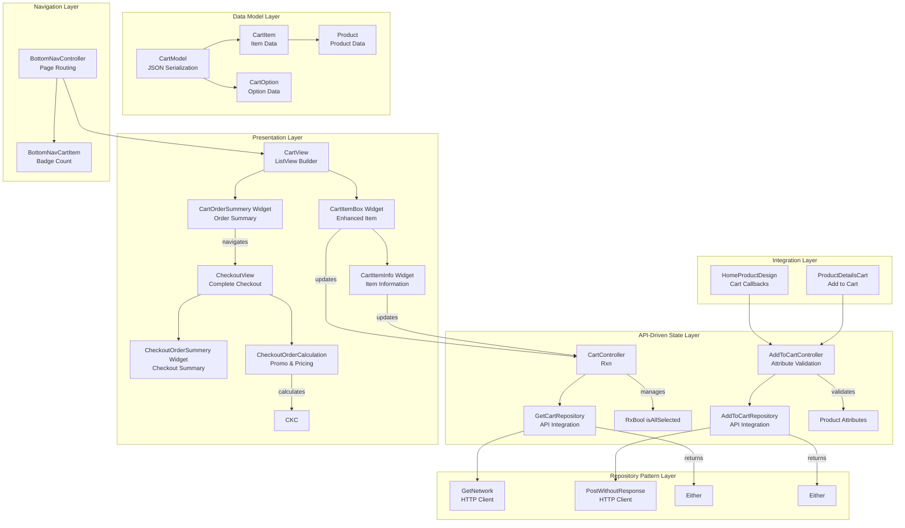

**Diagram sources**
- [cart_controller.dart:1-51](file://lib/features/cart/controller/cart_controller.dart#L1-L51)
- [add_to_cart_controller.dart:1-40](file://lib/features/cart/controller/add_to_cart_controller.dart#L1-L40)
- [get_cart_repo.dart:1-19](file://lib/features/cart/repositories/get_cart_repo.dart#L1-L19)
- [add_to_cart_repo.dart:1-28](file://lib/features/cart/repositories/add_to_cart_repo.dart#L1-L28)
- [cart_model.dart:1-165](file://lib/features/cart/models/cart_model.dart#L1-L165)
- [cart_view.dart:12-61](file://lib/features/cart/views/cart_view.dart#L12-L61)
- [cart_item.dart:1-103](file://lib/features/cart/widgets/cart_view_widgets/cart_item.dart#L1-L103)
- [cart_item_info.dart:1-105](file://lib/features/cart/widgets/cart_view_widgets/cart_item_info.dart#L1-L105)
- [cart_order_summery.dart:1-93](file://lib/features/cart/widgets/cart_view_widgets/cart_order_summery.dart#L1-L93)
- [checkout_controller.dart:1-82](file://lib/features/cart/controller/checkout_controller.dart#L1-L82)
- [checkout_order_summery.dart:1-94](file://lib/features/cart/widgets/checkout_view_widgets/checkout_order_summery.dart#L1-L94)
- [checkout_order_calculation.dart:1-101](file://lib/features/cart/widgets/checkout_view_widgets/checkout_order_calculation.dart#L1-L101)
- [bottom_nav_controller.dart:1-18](file://lib/features/home/controller/bottom_nav_controller.dart#L1-L18)
- [bottom_nav_cart_item.dart:1-75](file://lib/features/home/widgets/bottom_nav_widgets/bottom_nav_cart_item.dart#L1-L75)
- [home_product_design.dart:1-106](file://lib/features/home/widgets/home_widgets/home_product_design.dart#L1-L106)
- [product_details_cart.dart:1-108](file://lib/features/product_details.dart/widgets/product_details_view_widgets/product_details_cart.dart#L1-L108)

## Detailed Component Analysis

### API-Driven Cart Controller Implementation
The CartController manages all cart operations with enhanced reactive state management and API integration:

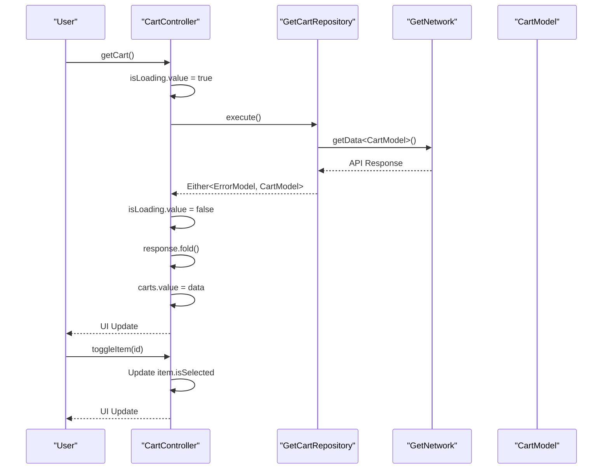

**Diagram sources**
- [cart_controller.dart:18-30](file://lib/features/cart/controller/cart_controller.dart#L18-L30)
- [get_cart_repo.dart:11-18](file://lib/features/cart/repositories/get_cart_repo.dart#L11-L18)

**Section sources**
- [cart_controller.dart:1-51](file://lib/features/cart/controller/cart_controller.dart#L1-L51)

### Enhanced Add to Cart Controller Implementation
The AddToCartController handles add-to-cart operations with comprehensive attribute validation and API integration:

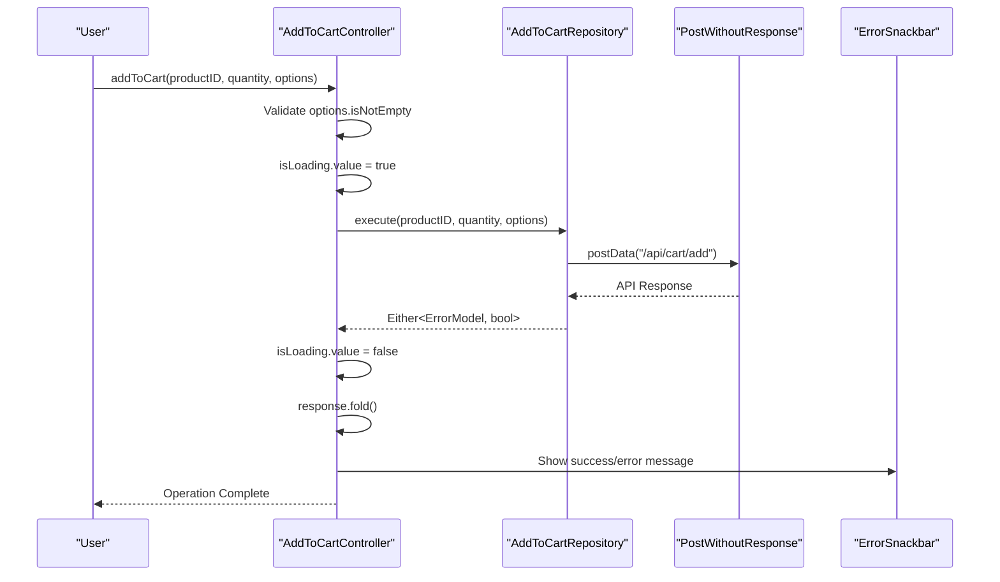

**Diagram sources**
- [add_to_cart_controller.dart:14-38](file://lib/features/cart/controller/add_to_cart_controller.dart#L14-L38)
- [add_to_cart_repo.dart:12-27](file://lib/features/cart/repositories/add_to_cart_repo.dart#L12-L27)

**Section sources**
- [add_to_cart_controller.dart:1-40](file://lib/features/cart/controller/add_to_cart_controller.dart#L1-L40)

### Enhanced Cart Model with Comprehensive Serialization
The CartModel provides comprehensive data structure with JSON serialization support for cart items, options, and pricing:

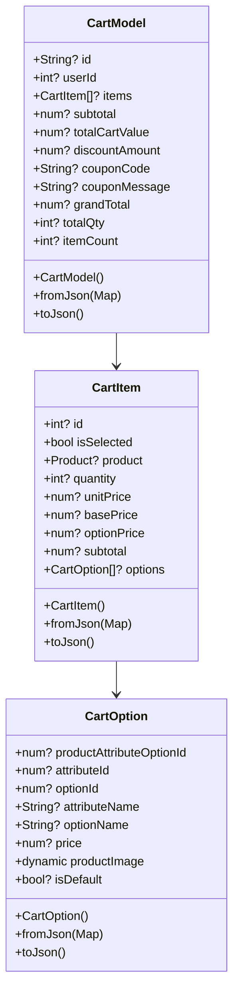

**Diagram sources**
- [cart_model.dart:8-66](file://lib/features/cart/models/cart_model.dart#L8-L66)
- [cart_model.dart:68-120](file://lib/features/cart/models/cart_model.dart#L68-L120)
- [cart_model.dart:122-165](file://lib/features/cart/models/cart_model.dart#L122-L165)

**Section sources**
- [cart_model.dart:1-165](file://lib/features/cart/models/cart_model.dart#L1-L165)

### Modular Cart View and Enhanced Item Rendering
The CartView provides the main interface for cart management with modernized widget architecture and dynamic item rendering:

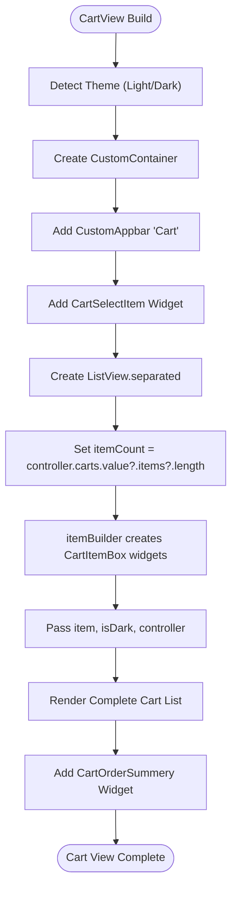

**Diagram sources**
- [cart_view.dart:16-61](file://lib/features/cart/views/cart_view.dart#L16-L61)

**Section sources**
- [cart_view.dart:12-61](file://lib/features/cart/views/cart_view.dart#L12-L61)

### Enhanced Cart Item Widget Architecture
The CartItemBox widget now features a modular architecture with separated item information and quantity control components:

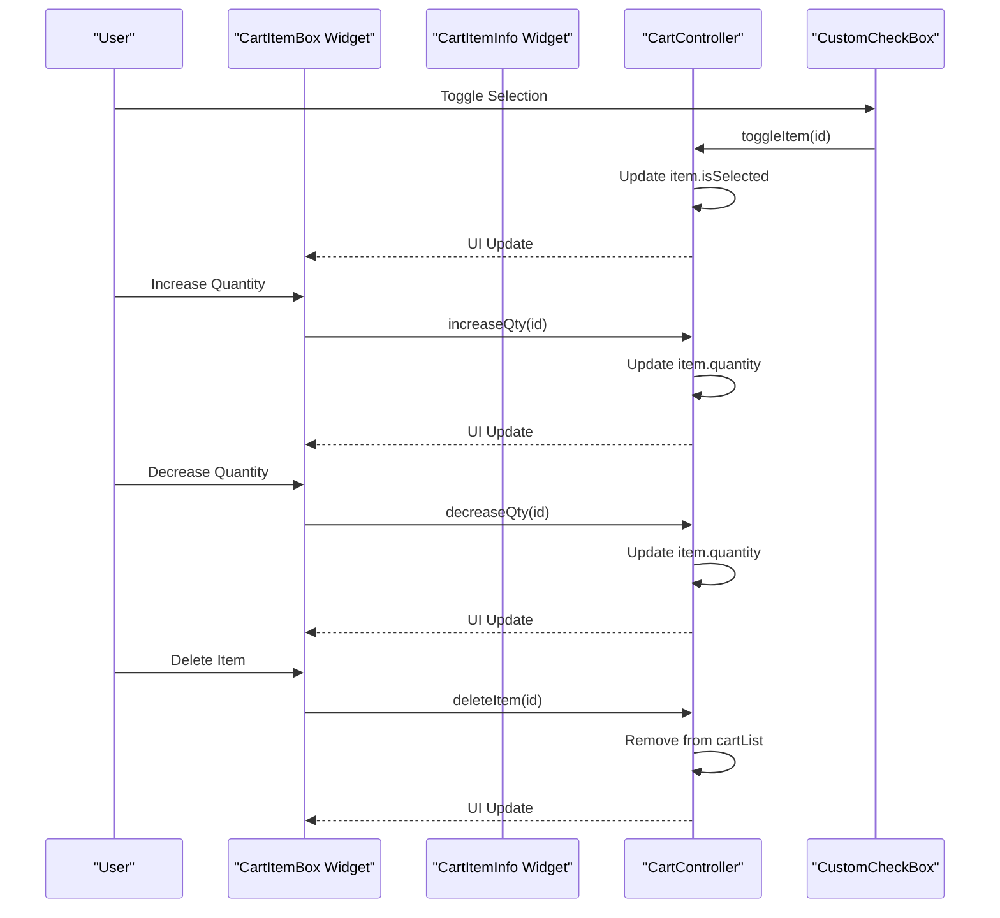

**Diagram sources**
- [cart_item.dart:31-55](file://lib/features/cart/widgets/cart_view_widgets/cart_item.dart#L31-L55)
- [cart_item_info.dart:43-53](file://lib/features/cart/widgets/cart_view_widgets/cart_item_info.dart#L43-L53)
- [cart_controller.dart:32-49](file://lib/features/cart/controller/cart_controller.dart#L32-L49)

**Section sources**
- [cart_item.dart:1-103](file://lib/features/cart/widgets/cart_view_widgets/cart_item.dart#L1-L103)
- [cart_item_info.dart:1-105](file://lib/features/cart/widgets/cart_view_widgets/cart_item_info.dart#L1-L105)

### Enhanced Cart Order Summary Component
The CartOrderSummery widget provides comprehensive order summary with pricing calculations and promotional discount handling:

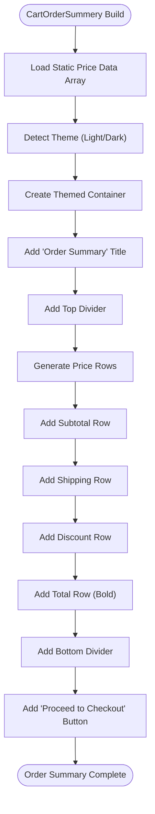

**Diagram sources**
- [cart_order_summery.dart:15-69](file://lib/features/cart/widgets/cart_view_widgets/cart_order_summery.dart#L15-L69)

**Section sources**
- [cart_order_summery.dart:1-93](file://lib/features/cart/widgets/cart_view_widgets/cart_order_summery.dart#L1-L93)

### Complete Checkout System Architecture
The checkout system provides a comprehensive checkout workflow with form handling and order management:

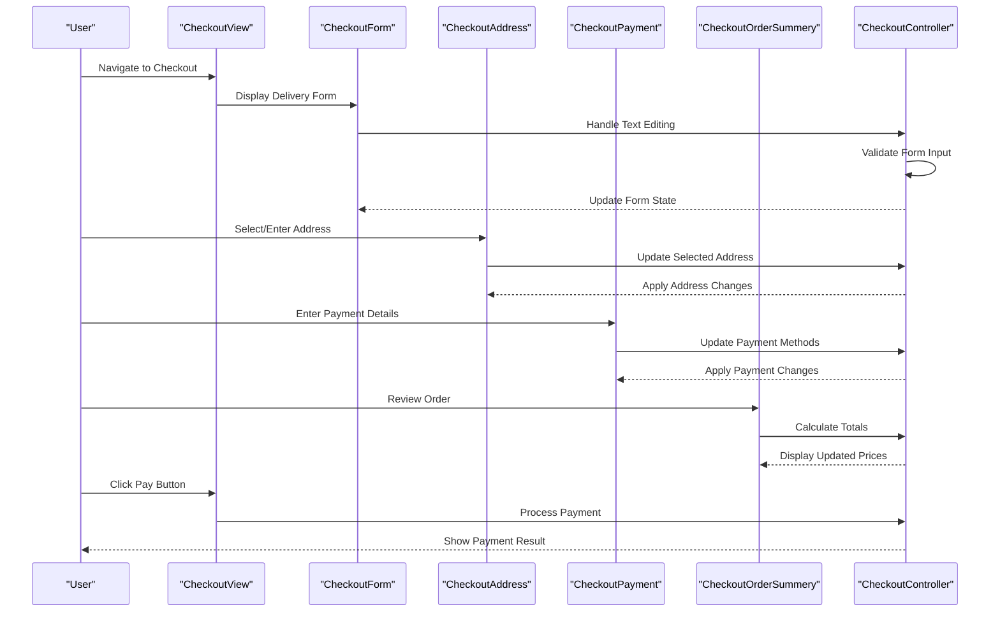

**Diagram sources**
- [checkout_view.dart:21-67](file://lib/features/cart/views/checkout_view.dart#L21-L67)
- [checkout_controller.dart:1-82](file://lib/features/cart/controller/checkout_controller.dart#L1-L82)
- [checkout_order_summery.dart:1-94](file://lib/features/cart/widgets/checkout_view_widgets/checkout_order_summery.dart#L1-L94)
- [checkout_order_calculation.dart:1-101](file://lib/features/cart/widgets/checkout_view_widgets/checkout_order_calculation.dart#L1-L101)

**Section sources**
- [checkout_view.dart:17-67](file://lib/features/cart/views/checkout_view.dart#L17-L67)
- [checkout_controller.dart:1-82](file://lib/features/cart/controller/checkout_controller.dart#L1-L82)
- [checkout_order_summery.dart:1-94](file://lib/features/cart/widgets/checkout_view_widgets/checkout_order_summery.dart#L1-L94)
- [checkout_order_calculation.dart:1-101](file://lib/features/cart/widgets/checkout_view_widgets/checkout_order_calculation.dart#L1-L101)

### Bottom Navigation Cart Integration
Enhanced bottom navigation with cart badge integration and page routing:

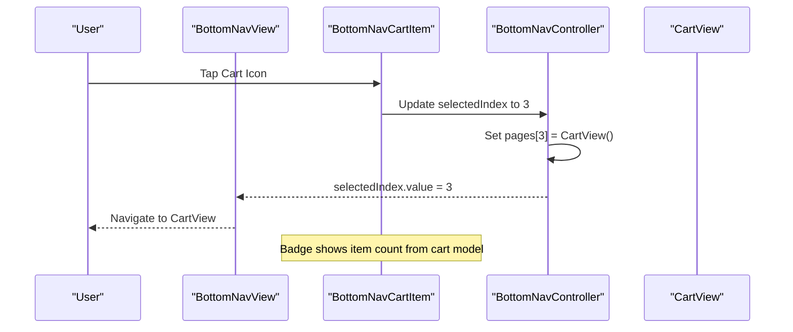

**Diagram sources**
- [bottom_nav_view.dart:12-80](file://lib/features/home/views/bottom_nav_view.dart#L12-L80)
- [bottom_nav_controller.dart:8-17](file://lib/features/home/controller/bottom_nav_controller.dart#L8-L17)
- [bottom_nav_cart_item.dart:25-73](file://lib/features/home/widgets/bottom_nav_widgets/bottom_nav_cart_item.dart#L25-L73)

**Section sources**
- [bottom_nav_view.dart:12-80](file://lib/features/home/views/bottom_nav_view.dart#L12-L80)
- [bottom_nav_controller.dart:1-18](file://lib/features/home/controller/bottom_nav_controller.dart#L1-L18)
- [bottom_nav_cart_item.dart:1-75](file://lib/features/home/widgets/bottom_nav_widgets/bottom_nav_cart_item.dart#L1-L75)

### Product Details Cart Integration
Product details page with integrated cart functionality and attribute selection:

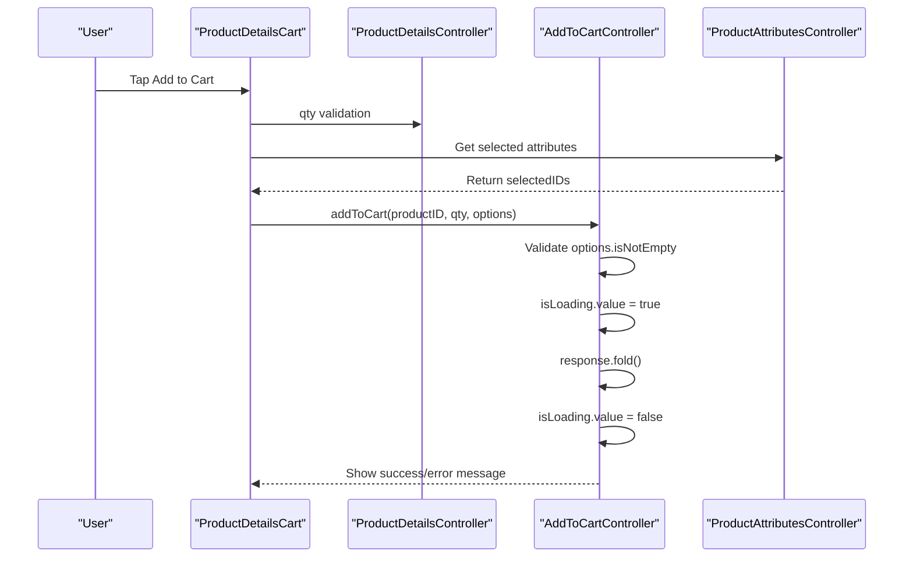

**Diagram sources**
- [product_details_cart.dart:79-108](file://lib/features/product_details.dart/widgets/product_details_view_widgets/product_details_cart.dart#L79-L108)

**Section sources**
- [product_details_cart.dart:1-108](file://lib/features/product_details.dart/widgets/product_details_view_widgets/product_details_cart.dart#L1-L108)

### Home Product Integration
Home product widgets with cart action callbacks:

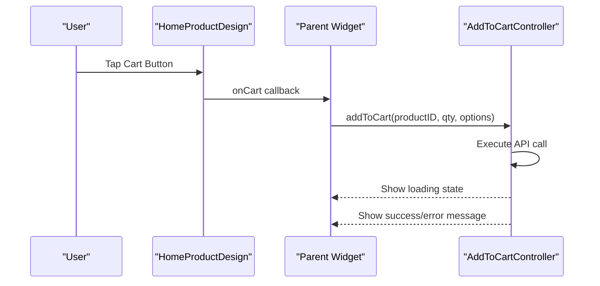

**Diagram sources**
- [home_product_design.dart:66-74](file://lib/features/home/widgets/home_widgets/home_product_design.dart#L66-L74)

**Section sources**
- [home_product_design.dart:1-106](file://lib/features/home/widgets/home_widgets/home_product_design.dart#L1-L106)

## API-Driven Cart System
The cart system now operates entirely through API integration with comprehensive error handling and data persistence:

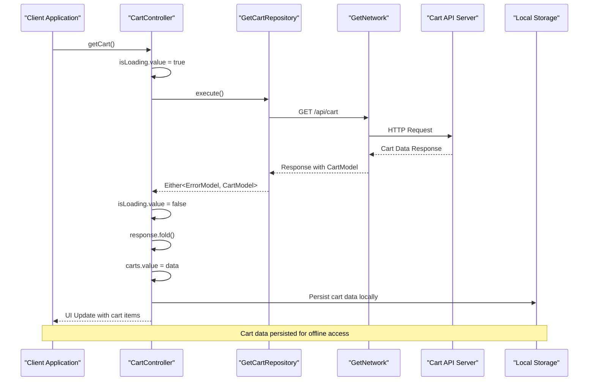

**Diagram sources**
- [cart_controller.dart:18-30](file://lib/features/cart/controller/cart_controller.dart#L18-L30)
- [get_cart_repo.dart:11-18](file://lib/features/cart/repositories/get_cart_repo.dart#L11-L18)

**Section sources**
- [cart_controller.dart:1-51](file://lib/features/cart/controller/cart_controller.dart#L1-L51)
- [get_cart_repo.dart:1-19](file://lib/features/cart/repositories/get_cart_repo.dart#L1-L19)

## Repository Pattern Implementation
The cart system implements a clean repository pattern for API data management:

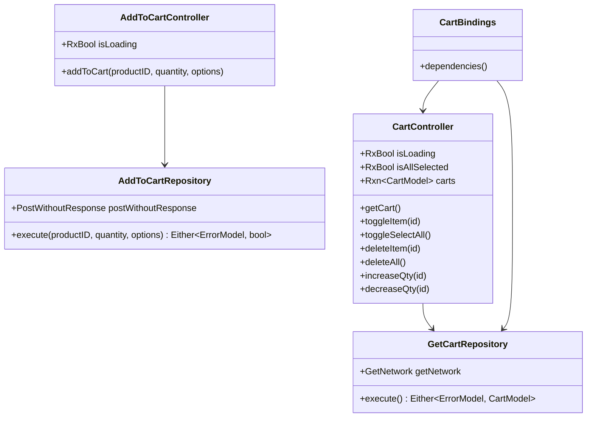

**Diagram sources**
- [cart_controller.dart:1-51](file://lib/features/cart/controller/cart_controller.dart#L1-L51)
- [get_cart_repo.dart:7-19](file://lib/features/cart/repositories/get_cart_repo.dart#L7-L19)
- [add_to_cart_controller.dart:1-40](file://lib/features/cart/controller/add_to_cart_controller.dart#L1-L40)
- [add_to_cart_repo.dart:8-28](file://lib/features/cart/repositories/add_to_cart_repo.dart#L8-L28)
- [cart_bindings.dart:1-11](file://lib/features/cart/bindings/cart_bindings.dart#L1-L11)

**Section sources**
- [cart_controller.dart:1-51](file://lib/features/cart/controller/cart_controller.dart#L1-L51)
- [add_to_cart_controller.dart:1-40](file://lib/features/cart/controller/add_to_cart_controller.dart#L1-L40)
- [get_cart_repo.dart:1-19](file://lib/features/cart/repositories/get_cart_repo.dart#L1-L19)
- [add_to_cart_repo.dart:1-28](file://lib/features/cart/repositories/add_to_cart_repo.dart#L1-L28)
- [cart_bindings.dart:1-11](file://lib/features/cart/bindings/cart_bindings.dart#L1-L11)

## Enhanced Cart Model Architecture
The CartModel provides comprehensive data structure with JSON serialization support for cart items, options, and pricing:

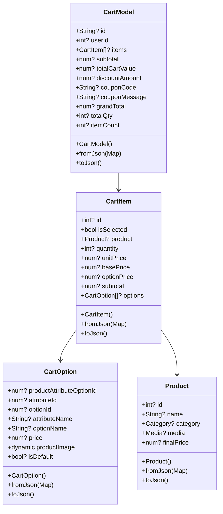

**Diagram sources**
- [cart_model.dart:8-66](file://lib/features/cart/models/cart_model.dart#L8-L66)
- [cart_model.dart:68-120](file://lib/features/cart/models/cart_model.dart#L68-L120)
- [cart_model.dart:122-165](file://lib/features/cart/models/cart_model.dart#L122-L165)

**Section sources**
- [cart_model.dart:1-165](file://lib/features/cart/models/cart_model.dart#L1-L165)

## Dependency Analysis
The cart system demonstrates excellent modularity with clear dependency boundaries and modernized API-driven architecture:

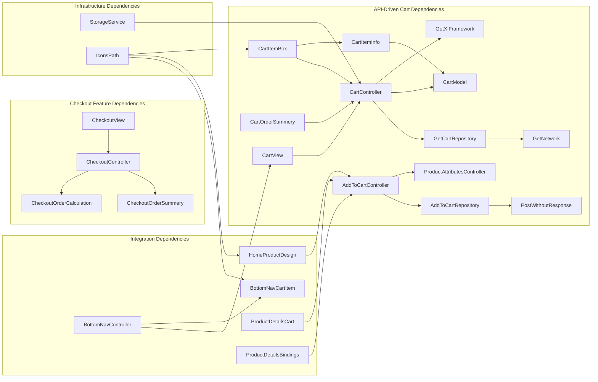

**Diagram sources**
- [cart_controller.dart:1-51](file://lib/features/cart/controller/cart_controller.dart#L1-L51)
- [add_to_cart_controller.dart:1-40](file://lib/features/cart/controller/add_to_cart_controller.dart#L1-L40)
- [cart_model.dart:1-165](file://lib/features/cart/models/cart_model.dart#L1-L165)
- [get_cart_repo.dart:1-19](file://lib/features/cart/repositories/get_cart_repo.dart#L1-L19)
- [add_to_cart_repo.dart:1-28](file://lib/features/cart/repositories/add_to_cart_repo.dart#L1-L28)
- [cart_view.dart:1-11](file://lib/features/cart/views/cart_view.dart#L1-L11)
- [cart_item.dart:1-103](file://lib/features/cart/widgets/cart_view_widgets/cart_item.dart#L1-L103)
- [cart_item_info.dart:1-105](file://lib/features/cart/widgets/cart_view_widgets/cart_item_info.dart#L1-L105)
- [cart_order_summery.dart:1-93](file://lib/features/cart/widgets/cart_view_widgets/cart_order_summery.dart#L1-L93)
- [checkout_controller.dart:1-82](file://lib/features/cart/controller/checkout_controller.dart#L1-L82)
- [checkout_order_summery.dart:1-94](file://lib/features/cart/widgets/checkout_view_widgets/checkout_order_summery.dart#L1-L94)
- [checkout_order_calculation.dart:1-101](file://lib/features/cart/widgets/checkout_view_widgets/checkout_order_calculation.dart#L1-L101)
- [bottom_nav_controller.dart:1-18](file://lib/features/home/controller/bottom_nav_controller.dart#L1-L18)
- [bottom_nav_cart_item.dart:1-75](file://lib/features/home/widgets/bottom_nav_widgets/bottom_nav_cart_item.dart#L1-L75)
- [home_product_design.dart:1-106](file://lib/features/home/widgets/home_widgets/home_product_design.dart#L1-L106)
- [product_details_cart.dart:1-108](file://lib/features/product_details.dart/widgets/product_details_view_widgets/product_details_cart.dart#L1-L108)
- [product_details_bindings.dart:1-37](file://lib/features/product_details.dart/bindings/product_details_bindings.dart#L1-L37)
- [storage_service.dart:1-24](file://lib/core/data/local/storage_service.dart#L1-L24)
- [icons_path.dart:1-24](file://lib/core/constant/icons_path.dart#L1-L24)

**Section sources**
- [cart_controller.dart:1-51](file://lib/features/cart/controller/cart_controller.dart#L1-L51)
- [add_to_cart_controller.dart:1-40](file://lib/features/cart/controller/add_to_cart_controller.dart#L1-L40)
- [cart_model.dart:1-165](file://lib/features/cart/models/cart_model.dart#L1-L165)
- [get_cart_repo.dart:1-19](file://lib/features/cart/repositories/get_cart_repo.dart#L1-L19)
- [add_to_cart_repo.dart:1-28](file://lib/features/cart/repositories/add_to_cart_repo.dart#L1-L28)
- [cart_view.dart:1-11](file://lib/features/cart/views/cart_view.dart#L1-L11)
- [cart_item.dart:1-103](file://lib/features/cart/widgets/cart_view_widgets/cart_item.dart#L1-L103)
- [cart_item_info.dart:1-105](file://lib/features/cart/widgets/cart_view_widgets/cart_item_info.dart#L1-L105)
- [cart_order_summery.dart:1-93](file://lib/features/cart/widgets/cart_view_widgets/cart_order_summery.dart#L1-L93)
- [checkout_controller.dart:1-82](file://lib/features/cart/controller/checkout_controller.dart#L1-L82)
- [checkout_order_summery.dart:1-94](file://lib/features/cart/widgets/checkout_view_widgets/checkout_order_summery.dart#L1-L94)
- [checkout_order_calculation.dart:1-101](file://lib/features/cart/widgets/checkout_view_widgets/checkout_order_calculation.dart#L1-L101)
- [bottom_nav_controller.dart:1-18](file://lib/features/home/controller/bottom_nav_controller.dart#L1-L18)
- [bottom_nav_cart_item.dart:1-75](file://lib/features/home/widgets/bottom_nav_widgets/bottom_nav_cart_item.dart#L1-L75)
- [home_product_design.dart:1-106](file://lib/features/home/widgets/home_widgets/home_product_design.dart#L1-L106)
- [product_details_cart.dart:1-108](file://lib/features/product_details.dart/widgets/product_details_view_widgets/product_details_cart.dart#L1-L108)
- [product_details_bindings.dart:1-37](file://lib/features/product_details.dart/bindings/product_details_bindings.dart#L1-L37)
- [storage_service.dart:1-24](file://lib/core/data/local/storage_service.dart#L1-L24)
- [icons_path.dart:1-24](file://lib/core/constant/icons_path.dart#L1-L24)

## Performance Considerations
The cart system implements several performance optimization strategies with modernized API-driven architecture:

- **API-Driven State Management**: Uses GetX framework for efficient state management with selective UI updates from API responses
- **Virtualized Lists**: Implements ListView.separated with shrinkWrap and NeverScrollableScrollPhysics for optimal rendering
- **Conditional Rendering**: Uses Obx widgets for granular state observation and minimal rebuilds
- **Memory Management**: Proper disposal of reactive subscriptions through GetX lifecycle
- **Asset Optimization**: Cached network images for product thumbnails to reduce bandwidth usage
- **State Synchronization**: Automatic state updates prevent unnecessary manual refresh operations
- **Badge Counting**: Dynamic badge calculation based on cart model data for real-time updates
- **Responsive Design**: ScreenUtil integration ensures optimal performance across device sizes
- **Modular Architecture**: Separate widget components reduce memory footprint and improve maintainability
- **Enhanced Order Calculations**: Optimized pricing calculations with lazy evaluation
- **Checkout Form Handling**: Efficient form validation and state management
- **Promotional Discount Processing**: Optimized discount calculation and application
- **Error Handling**: fpdart Either type provides predictable error handling without exceptions
- **API Caching**: Local storage integration for offline cart access and faster loading
- **Repository Pattern**: Clean separation reduces coupling and improves testability

## Troubleshooting Guide
Common issues and solutions for the modernized API-driven cart system:

**Cart Data Not Loading**
- Verify API endpoint `/api/cart` is accessible and returns valid CartModel JSON
- Check GetNetwork configuration and HeadersManager setup
- Ensure CartModel.fromJson properly handles optional fields
- Verify repository.execute() method is being called during controller initialization

**Add to Cart Not Working**
- Confirm AddToCartRepository.execute() method properly encodes request body
- Verify product attributes are selected before adding to cart
- Check PostWithoutResponse configuration and headers
- Ensure AddToCartController properly handles Either type response

**API Error Handling Issues**
- Verify fpdart Either type is properly imported and used
- Check ErrorModel structure matches API error response format
- Ensure response.fold() properly handles both success and error cases
- Verify snackbar messages display appropriate error information

**Cart State Synchronization Problems**
- Confirm CartController properly updates carts.value on successful API response
- Verify CartItem.isSelected state persists across widget rebuilds
- Check that UI updates trigger when cart data changes
- Ensure proper disposal of reactive subscriptions

**Quantity Controls Not Working**
- Confirm increaseQty/decreaseQty methods are properly bound to UI events
- Verify quantity validation prevents negative values
- Ensure cart updates trigger UI refreshes
- Check that CartItemBox widget properly passes controller methods

**Selection State Issues**
- Check toggleItem method properly updates individual item selection state
- Verify isAllSelected calculation uses every() method correctly
- Ensure selection state persists across widget rebuilds
- Verify CartItemInfo checkbox properly triggers controller.toggleItem

**Order Summary Calculation Errors**
- Check CartOrderSummery widget properly calculates pricing from cart model
- Verify CheckoutOrderCalculation handles promo code input
- Ensure pricing arrays match expected format
- Check that total calculations update on state changes

**Checkout Form Validation Problems**
- Confirm CheckoutController properly validates form inputs
- Verify text editing controllers are properly disposed
- Check that form state updates trigger UI refreshes
- Ensure address and payment method selections work correctly

**Navigation Problems**
- Confirm BottomNavController pages array includes CartView at index 3
- Verify BottomNavCartItem badgeCount is properly calculated from cart model
- Check that selectedIndex updates trigger proper page navigation
- Verify checkout navigation flow works correctly

**Integration Issues**
- Ensure HomeProductDesign onCart callbacks are properly wired to AddToCartController
- Verify ProductDetailsCart add to cart functionality is implemented
- Check that cart bindings are registered in dependency injection system
- Verify checkout bindings are properly configured
- Confirm product details bindings include AddToCartController registration

**Section sources**
- [cart_controller.dart:18-30](file://lib/features/cart/controller/cart_controller.dart#L18-L30)
- [add_to_cart_controller.dart:14-38](file://lib/features/cart/controller/add_to_cart_controller.dart#L14-L38)
- [get_cart_repo.dart:11-18](file://lib/features/cart/repositories/get_cart_repo.dart#L11-L18)
- [add_to_cart_repo.dart:12-27](file://lib/features/cart/repositories/add_to_cart_repo.dart#L12-L27)
- [cart_item.dart:31-55](file://lib/features/cart/widgets/cart_view_widgets/cart_item.dart#L31-L55)
- [cart_item_info.dart:43-53](file://lib/features/cart/widgets/cart_view_widgets/cart_item_info.dart#L43-L53)
- [cart_order_summery.dart:15-69](file://lib/features/cart/widgets/cart_view_widgets/cart_order_summery.dart#L15-L69)
- [checkout_controller.dart:1-82](file://lib/features/cart/controller/checkout_controller.dart#L1-L82)
- [bottom_nav_controller.dart:8-17](file://lib/features/home/controller/bottom_nav_controller.dart#L8-L17)
- [bottom_nav_cart_item.dart:25-73](file://lib/features/home/widgets/bottom_nav_widgets/bottom_nav_cart_item.dart#L25-L73)
- [home_product_design.dart:66-74](file://lib/features/home/widgets/home_widgets/home_product_design.dart#L66-L74)
- [product_details_cart.dart:79-108](file://lib/features/product_details.dart/widgets/product_details_view_widgets/product_details_cart.dart#L79-L108)
- [product_details_bindings.dart:33-36](file://lib/features/product_details.dart/bindings/product_details_bindings.dart#L33-L36)

## Conclusion
The Shopping Cart system in ZB-DEZINE represents a comprehensive modernized implementation featuring a fully functional API-driven cart controller with item selection, quantity management, deletion capabilities, and enhanced UI components. The system leverages the GetX framework for reactive state management with repository pattern implementation, providing efficient updates and responsive user interactions.

**Updated** Key achievements include the major cart system transformation from local static data to API-driven architecture with repository pattern implementation, comprehensive serialization support through CartModel, robust error handling using fpdart Either type, and enhanced cart functionality with proper null safety and API integration.

The modernized system features:
- Complete API-driven cart controller implementation with repository pattern
- Comprehensive CartModel with JSON serialization support for cart items and options
- Enhanced AddToCartController with attribute validation and API integration
- Robust error handling using fpdart Either type for reliable API operations
- Modernized widget architecture with CartItemBox component for better separation of concerns
- Comprehensive UI components for individual items, bulk operations, and order summaries
- Enhanced checkout system with form handling, promotional discount processing, and order management
- Seamless integration with bottom navigation and product catalog
- Proper dependency injection through cart and product details bindings
- Responsive design with theme support and screen adaptation
- Complete promotional discount handling in checkout order calculations
- Optimized performance with modular architecture, efficient state management, and API caching
- Cart restoration functionality through API-driven data fetching and local storage integration

The system is designed for scalability with clear separation of concerns, making it easy to extend with additional features like advanced inventory validation, shipping calculations, and enhanced promotional discount systems. The API-driven architecture ensures maintainability and allows for future enhancements while maintaining optimal performance for large cart contents and complex checkout workflows. The repository pattern implementation provides clean separation of concerns and improved testability, making the system robust and reliable for production use.