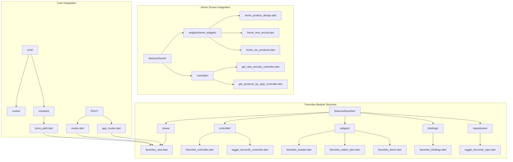
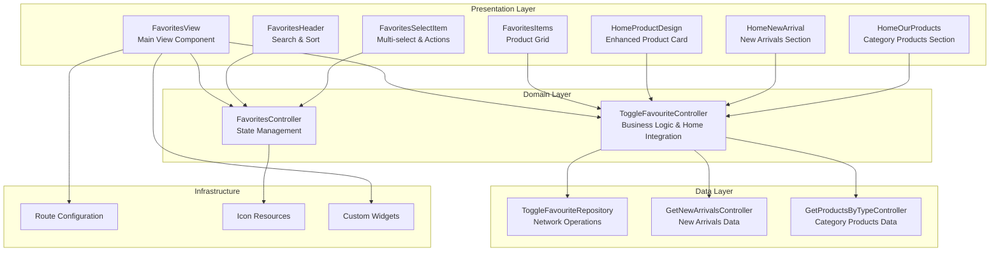
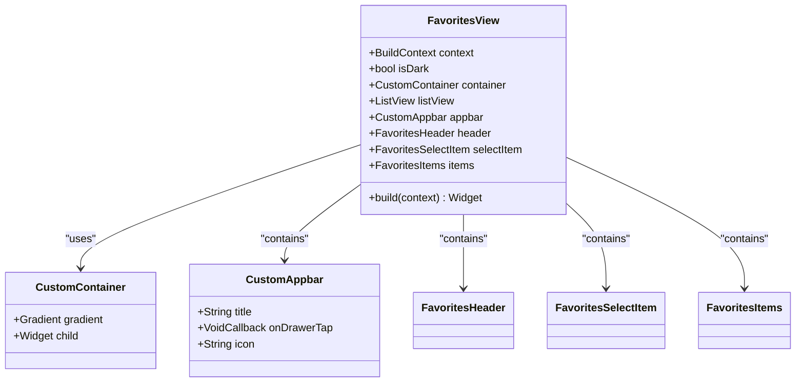
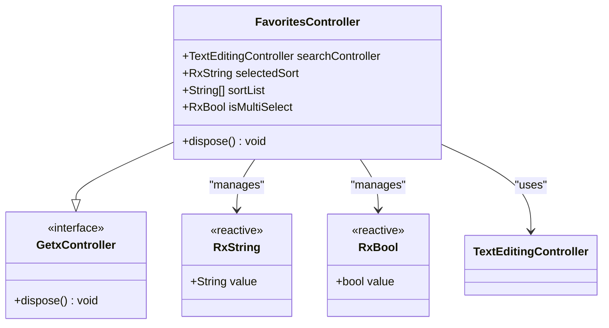
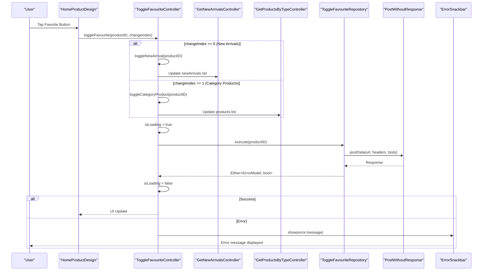
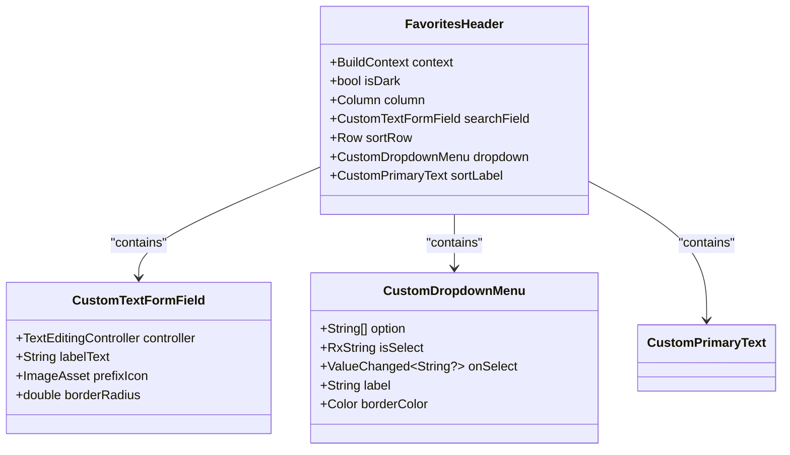
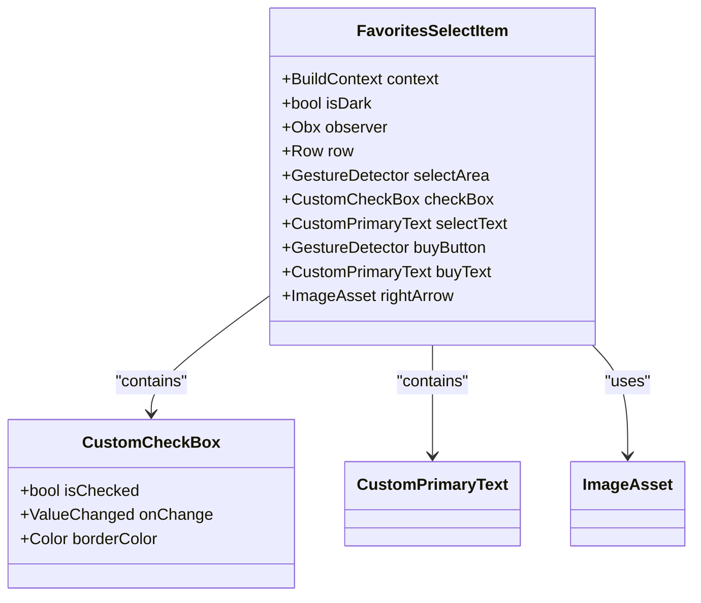
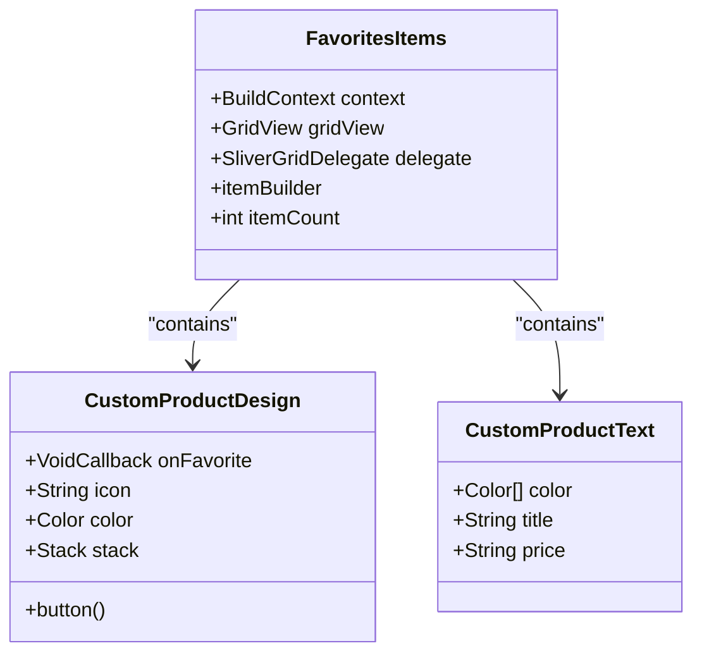
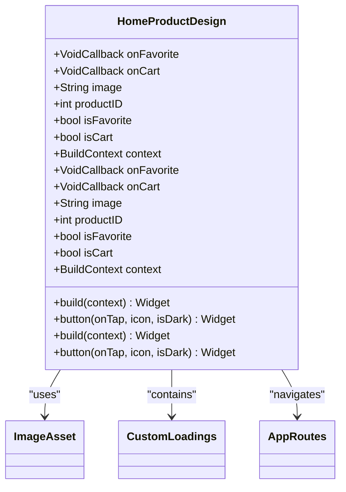
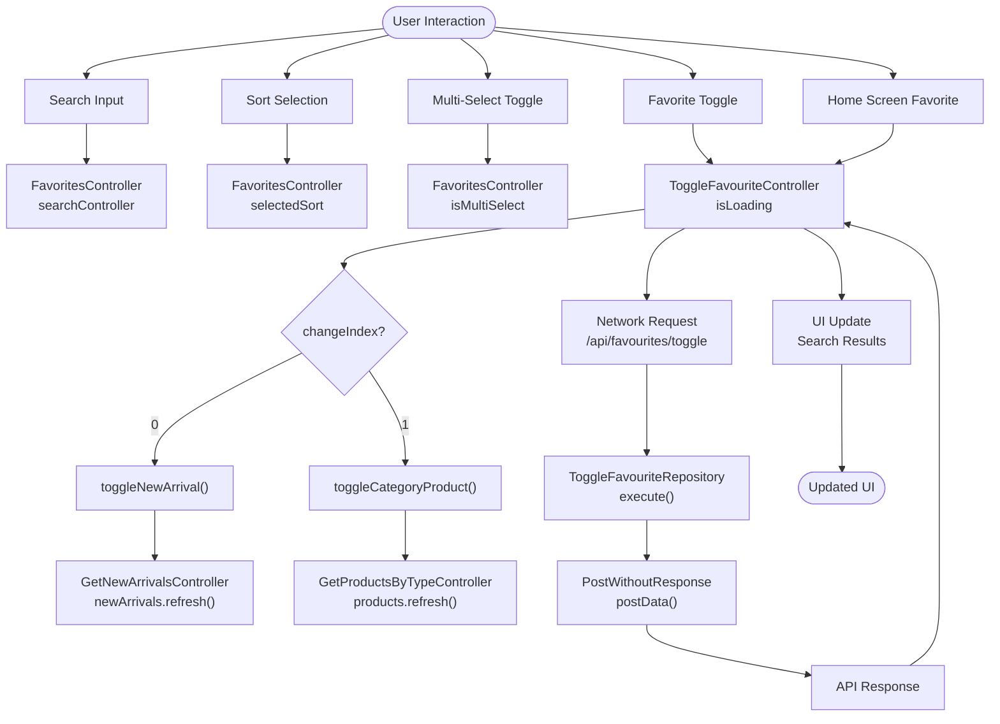

# Favorites Module

<cite>
**Referenced Files in This Document**
- [favorites_view.dart](file://lib/features/favorites/views/favorites_view.dart)
- [favorites_controller.dart](file://lib/features/favorites/controller/favorites_controller.dart)
- [toggle_favourite_controller.dart](file://lib/features/favorites/controller/toggle_favourite_controller.dart)
- [toggle_favourite_repo.dart](file://lib/features/favorites/repositories/toggle_favourite_repo.dart)
- [favorites_bindings.dart](file://lib/features/favorites/bindings/favorites_bindings.dart)
- [favorites_header.dart](file://lib/features/favorites/widgets/favorites_header.dart)
- [favorites_select_item.dart](file://lib/features/favorites/widgets/favorites_select_item.dart)
- [favorites_items.dart](file://lib/features/favorites/widgets/favorites_items.dart)
- [routes.dart](file://lib/core/routes/routes.dart)
- [app_routes.dart](file://lib/core/routes/app_routes.dart)
- [icons_path.dart](file://lib/core/constant/icons_path.dart)
- [custom_product_design.dart](file://lib/shared/widgets/custom_product_design.dart)
- [custom_check_box.dart](file://lib/shared/widgets/custom_check_box.dart)
- [custom_text_form_field.dart](file://lib/shared/widgets/custom_form_field/custom_text_form_field.dart)
- [home_product_design.dart](file://lib/features/home/widgets/home_widgets/home_product_design.dart)
- [home_new_arrival.dart](file://lib/features/home/widgets/home_widgets/home_new_arrival.dart)
- [home_our_products.dart](file://lib/features/home/widgets/home_widgets/home_our_products.dart)
- [get_new_arrivals_controller.dart](file://lib/features/home/controller/get_new_arrivals_controller.dart)
- [get_products_by_type_controller.dart](file://lib/features/home/controller/get_products_by_type_controller.dart)
</cite>

## Update Summary
**Changes Made**
- Enhanced ToggleFavouriteController with home screen integration methods
- Added new methods for managing favorites in home screen components
- Integrated HomeProductDesign widget with favorite button functionality
- Updated documentation to cover new favorite toggle functionality in home screen components

## Table of Contents
1. [Introduction](#introduction)
2. [Project Structure](#project-structure)
3. [Core Components](#core-components)
4. [Architecture Overview](#architecture-overview)
5. [Detailed Component Analysis](#detailed-component-analysis)
6. [Data Flow Analysis](#data-flow-analysis)
7. [UI Components Analysis](#ui-components-analysis)
8. [Integration Points](#integration-points)
9. [Performance Considerations](#performance-considerations)
10. [Troubleshooting Guide](#troubleshooting-guide)
11. [Conclusion](#conclusion)

## Introduction

The Favorites Module is a core feature of the ZB-DEZINE Flutter application that allows users to manage their favorite products. This module provides functionality for viewing saved items, searching through favorites, sorting products by various criteria, and managing multiple selections for bulk operations. The module follows a clean architecture pattern using GetX for state management and dependency injection.

**Updated** The module now includes enhanced home screen integration, allowing users to toggle favorites directly from the home screen's new arrivals and category product sections.

The module consists of three main layers:
- **Presentation Layer**: Views and widgets that handle user interface and interactions
- **Domain Layer**: Controllers that manage business logic and state
- **Data Layer**: Repositories that handle network requests and data operations

## Project Structure

The Favorites Module is organized within the `lib/features/favorites/` directory structure, following Flutter's modular architecture pattern:

**Diagram sources**
- [favorites_view.dart:1-45](file://lib/features/favorites/views/favorites_view.dart#L1-L45)
- [favorites_controller.dart:1-22](file://lib/features/favorites/controller/favorites_controller.dart#L1-L22)
- [toggle_favourite_controller.dart:1-53](file://lib/features/favorites/controller/toggle_favourite_controller.dart#L1-L53)
- [home_product_design.dart:1-109](file://lib/features/home/widgets/home_widgets/home_product_design.dart#L1-L109)
- [home_new_arrival.dart:1-102](file://lib/features/home/widgets/home_widgets/home_new_arrival.dart#L1-L102)
- [home_our_products.dart:1-123](file://lib/features/home/widgets/home_widgets/home_our_products.dart#L1-L123)

**Section sources**
- [favorites_view.dart:1-45](file://lib/features/favorites/views/favorites_view.dart#L1-L45)
- [favorites_controller.dart:1-22](file://lib/features/favorites/controller/favorites_controller.dart#L1-L22)
- [toggle_favourite_controller.dart:1-53](file://lib/features/favorites/controller/toggle_favourite_controller.dart#L1-L53)

## Core Components

The Favorites Module comprises several key components that work together to provide comprehensive favorite management functionality:

### Main View Component
The primary view component serves as the container for all favorites-related UI elements and manages the overall layout and navigation.

### Controller Layer
The controller layer handles state management and business logic for the favorites functionality:
- **FavoritesController**: Manages search functionality, sorting options, and multi-select state
- **ToggleFavouriteController**: Handles the toggle favorite operation with loading states, error handling, and home screen integration

**Updated** The ToggleFavouriteController now includes specialized methods for managing favorites in different contexts:
- `toggleFavourite()`: Main method with `changeIndex` parameter for different contexts
- `toggleNewArrival()`: Updates favorite status in new arrivals section
- `toggleCategoryProduct()`: Updates favorite status in category products section

### Repository Layer
The repository layer manages data operations and network communication for favorite toggling functionality.

### Widget Components
The widget layer provides reusable UI components for different aspects of the favorites interface:
- **FavoritesHeader**: Contains search functionality and sorting options
- **FavoritesSelectItem**: Provides multi-select capability and action buttons
- **FavoritesItems**: Displays the grid of favorite products

**Updated** Home screen integration components:
- **HomeProductDesign**: Enhanced product card with favorite button functionality
- **HomeNewArrival**: New arrivals section with integrated favorite toggling
- **HomeOurProducts**: Category products section with integrated favorite toggling

**Section sources**
- [favorites_view.dart:11-45](file://lib/features/favorites/views/favorites_view.dart#L11-L45)
- [favorites_controller.dart:4-21](file://lib/features/favorites/controller/favorites_controller.dart#L4-L21)
- [toggle_favourite_controller.dart:5-53](file://lib/features/favorites/controller/toggle_favourite_controller.dart#L5-L53)

## Architecture Overview

The Favorites Module follows a layered architecture pattern with clear separation of concerns and enhanced home screen integration:

**Diagram sources**
- [favorites_view.dart:11-45](file://lib/features/favorites/views/favorites_view.dart#L11-L45)
- [favorites_controller.dart:4-21](file://lib/features/favorites/controller/favorites_controller.dart#L4-L21)
- [toggle_favourite_controller.dart:5-53](file://lib/features/favorites/controller/toggle_favourite_controller.dart#L5-L53)
- [toggle_favourite_repo.dart:6-18](file://lib/features/favorites/repositories/toggle_favourite_repo.dart#L6-L18)
- [home_product_design.dart:10-109](file://lib/features/home/widgets/home_widgets/home_product_design.dart#L10-L109)
- [home_new_arrival.dart:10-102](file://lib/features/home/widgets/home_widgets/home_new_arrival.dart#L10-L102)
- [home_our_products.dart:12-123](file://lib/features/home/widgets/home_widgets/home_our_products.dart#L12-L123)

The architecture implements the following design principles:
- **Separation of Concerns**: Clear division between presentation, domain, and data layers
- **Dependency Injection**: Using GetX for service location and dependency management
- **State Management**: Reactive state management with automatic UI updates
- **Reusability**: Modular components that can be reused across the application
- **Home Screen Integration**: Seamless favorite management across multiple application sections

## Detailed Component Analysis

### FavoritesView Component

The FavoritesView serves as the main container for the favorites interface, orchestrating all child components and managing the overall layout.

**Diagram sources**
- [favorites_view.dart:11-45](file://lib/features/favorites/views/favorites_view.dart#L11-L45)

Key features of the FavoritesView:
- **Theme-aware Design**: Automatically adapts to light and dark themes
- **Gradient Background**: Provides visual appeal with smooth color transitions
- **Modular Layout**: Organized into distinct sections for different functionalities
- **Navigation Integration**: Seamlessly integrates with the application's navigation system

**Section sources**
- [favorites_view.dart:11-45](file://lib/features/favorites/views/favorites_view.dart#L11-L45)

### FavoritesController Analysis

The FavoritesController manages the state and business logic for the favorites functionality, providing reactive state management capabilities.

**Diagram sources**
- [favorites_controller.dart:4-21](file://lib/features/favorites/controller/favorites_controller.dart#L4-L21)

The controller provides:
- **Search Functionality**: Real-time product search with TextEditingController
- **Sorting Options**: Multiple sorting criteria with reactive selection
- **Multi-select State**: Toggle-based selection for bulk operations
- **Memory Management**: Proper disposal of resources

**Section sources**
- [favorites_controller.dart:4-21](file://lib/features/favorites/controller/favorites_controller.dart#L4-L21)

### ToggleFavouriteController Analysis

The ToggleFavouriteController handles the business logic for adding and removing items from favorites, including loading states, error handling, and home screen integration.

**Updated** Enhanced with specialized methods for different contexts:

**Diagram sources**
- [toggle_favourite_controller.dart:12-53](file://lib/features/favorites/controller/toggle_favourite_controller.dart#L12-L53)
- [toggle_favourite_repo.dart:10-17](file://lib/features/favorites/repositories/toggle_favourite_repo.dart#L10-L17)
- [home_new_arrival.dart:46-57](file://lib/features/home/widgets/home_widgets/home_new_arrival.dart#L46-L57)
- [home_our_products.dart:53-66](file://lib/features/home/widgets/home_widgets/home_our_products.dart#L53-L66)

Key aspects of the controller:
- **Loading States**: Reactive loading indicator during network operations
- **Error Handling**: Comprehensive error management with user feedback
- **Asynchronous Operations**: Non-blocking network requests
- **State Updates**: Automatic UI updates upon operation completion
- **Context Awareness**: Different behavior based on `changeIndex` parameter
- **Home Integration**: Direct updates to home screen data models

**Section sources**
- [toggle_favourite_controller.dart:5-53](file://lib/features/favorites/controller/toggle_favourite_controller.dart#L5-L53)

### Widget Components Analysis

The widget components provide reusable UI elements that enhance the user experience and maintain consistency across the application.

#### FavoritesHeader Component
The FavoritesHeader combines search functionality with sorting options in a cohesive interface.

**Diagram sources**
- [favorites_header.dart:11-67](file://lib/features/favorites/widgets/favorites_header.dart#L11-L67)

#### FavoritesSelectItem Component
The FavoritesSelectItem provides multi-select functionality with visual feedback and action buttons.

**Diagram sources**
- [favorites_select_item.dart:10-94](file://lib/features/favorites/widgets/favorites_select_item.dart#L10-L94)

#### FavoritesItems Component
The FavoritesItems displays favorite products in a responsive grid layout with product cards.

**Diagram sources**
- [favorites_items.dart:8-44](file://lib/features/favorites/widgets/favorites_items.dart#L8-L44)
- [custom_product_design.dart:11-104](file://lib/shared/widgets/custom_product_design.dart#L11-L104)

**Updated** Enhanced HomeProductDesign Component
The HomeProductDesign widget now includes integrated favorite button functionality with dynamic icon states.

**Diagram sources**
- [home_product_design.dart:10-109](file://lib/features/home/widgets/home_widgets/home_product_design.dart#L10-L109)

**Section sources**
- [favorites_header.dart:11-67](file://lib/features/favorites/widgets/favorites_header.dart#L11-L67)
- [favorites_select_item.dart:10-94](file://lib/features/favorites/widgets/favorites_select_item.dart#L10-L94)
- [favorites_items.dart:8-44](file://lib/features/favorites/widgets/favorites_items.dart#L8-L44)
- [home_product_design.dart:10-109](file://lib/features/home/widgets/home_widgets/home_product_design.dart#L10-L109)

## Data Flow Analysis

The Favorites Module implements a unidirectional data flow pattern that ensures predictable state management and easy debugging, with enhanced home screen integration:

**Diagram sources**
- [favorites_controller.dart:4-21](file://lib/features/favorites/controller/favorites_controller.dart#L4-L21)
- [toggle_favourite_controller.dart:12-53](file://lib/features/favorites/controller/toggle_favourite_controller.dart#L12-L53)
- [toggle_favourite_repo.dart:10-17](file://lib/features/favorites/repositories/toggle_favourite_repo.dart#L10-L17)
- [home_new_arrival.dart:46-57](file://lib/features/home/widgets/home_widgets/home_new_arrival.dart#L46-L57)
- [home_our_products.dart:53-66](file://lib/features/home/widgets/home_widgets/home_our_products.dart#L53-L66)

The data flow ensures:
- **Predictable State Changes**: All state modifications go through centralized controllers
- **Automatic UI Updates**: Reactive state changes trigger immediate UI refreshes
- **Error Propagation**: Errors are handled consistently across the application
- **Network Isolation**: Network operations are isolated in dedicated repositories
- **Home Integration**: Direct updates to home screen data models for seamless experience

**Section sources**
- [favorites_controller.dart:4-21](file://lib/features/favorites/controller/favorites_controller.dart#L4-L21)
- [toggle_favourite_controller.dart:12-53](file://lib/features/favorites/controller/toggle_favourite_controller.dart#L12-L53)

## UI Components Analysis

The Favorites Module utilizes a comprehensive set of custom UI components that provide consistent styling and enhanced user experience:

### Theme Integration
All components adapt to the current theme (light/dark mode) automatically, ensuring visual consistency across different user preferences.

### Responsive Design
The grid layout and flexible widget hierarchy ensure optimal display across different screen sizes and orientations.

### Icon Management
Centralized icon management through the IconsPath class ensures consistency and easy maintenance of visual assets.

### Custom Widget Ecosystem
The module leverages a rich ecosystem of custom widgets including:
- **CustomTextFormField**: Enhanced form field with consistent styling
- **CustomCheckBox**: Themed checkbox with proper accessibility
- **CustomProductDesign**: Complete product card with favorite functionality
- **CustomPrimaryText**: Consistent typography system
- **HomeProductDesign**: Enhanced product card with favorite button integration

**Updated** Home screen integration provides:
- **Dynamic Favorite Icons**: Favorite button shows filled or outline icon based on current state
- **Seamless Navigation**: Product cards navigate to product details view
- **Consistent Styling**: Home screen components match the overall application theme

**Section sources**
- [icons_path.dart:22-22](file://lib/core/constant/icons_path.dart#L22-L22)
- [icons_path.dart:137-137](file://lib/core/constant/icons_path.dart#L137-L137)
- [custom_product_design.dart:11-104](file://lib/shared/widgets/custom_product_design.dart#L11-L104)
- [home_product_design.dart:10-109](file://lib/features/home/widgets/home_widgets/home_product_design.dart#L10-L109)

## Integration Points

The Favorites Module integrates seamlessly with the broader application architecture through several key integration points:

### Route Integration
The module is registered as a named route in the central routing configuration, allowing for programmatic navigation and deep linking support.

### Dependency Injection
Using GetX's dependency injection system, the module registers its controllers and services automatically during application startup.

### Navigation Integration
The FavoritesView includes a back navigation mechanism that integrates with the application's navigation stack.

### State Management Integration
The module participates in the global state management system, allowing other parts of the application to observe and react to favorites changes.

**Updated** Home screen integration provides:
- **Direct Controller Access**: Home screen components access ToggleFavouriteController directly
- **Context-aware Updates**: Different home screen sections update their respective data models
- **Seamless Experience**: Users can toggle favorites from anywhere in the application

### Home Screen Integration
The module now integrates with home screen components for enhanced user experience:
- **New Arrivals Section**: Favorites toggle updates the new arrivals data model
- **Category Products Section**: Favorites toggle updates the category products data model
- **Real-time Updates**: Home screen reflects favorite status changes immediately

**Section sources**
- [routes.dart:234-238](file://lib/core/routes/routes.dart#L234-L238)
- [app_routes.dart:36-36](file://lib/core/routes/app_routes.dart#L36-L36)
- [favorites_bindings.dart:4-8](file://lib/features/favorites/bindings/favorites_bindings.dart#L4-L8)
- [home_new_arrival.dart:46-57](file://lib/features/home/widgets/home_widgets/home_new_arrival.dart#L46-L57)
- [home_our_products.dart:53-66](file://lib/features/home/widgets/home_widgets/home_our_products.dart#L53-L66)

## Performance Considerations

The Favorites Module is designed with several performance optimization strategies:

### Lazy Loading
Widgets are loaded on-demand, reducing initial memory footprint and improving application startup time.

### Efficient State Management
GetX's reactive state management minimizes unnecessary rebuilds and optimizes UI updates.

### Memory Management
Proper disposal of controllers and text editing controllers prevents memory leaks and ensures optimal resource usage.

### Network Optimization
The toggle favorite functionality includes loading states and error handling to prevent blocking operations.

### Grid Optimization
The product grid uses efficient rendering techniques to handle large numbers of items without performance degradation.

**Updated** Home screen optimization:
- **Selective Updates**: Only affected data models are refreshed
- **Efficient List Updates**: Home screen lists update efficiently without full rebuilds
- **Context-aware Operations**: Different contexts trigger appropriate updates

## Troubleshooting Guide

Common issues and their solutions when working with the Favorites Module:

### Navigation Issues
**Problem**: Favorites view not accessible via navigation
**Solution**: Verify route registration in routes.dart and ensure proper import statements

### State Not Updating
**Problem**: UI not reflecting state changes
**Solution**: Ensure proper use of GetBuilder/Obx widgets and verify reactive variable usage

### Network Errors
**Problem**: Favorite toggle operations failing
**Solution**: Check API endpoint configuration and network connectivity; verify error handling implementation

### Memory Leaks
**Problem**: Application performance degrading over time
**Solution**: Ensure proper controller disposal and avoid retaining references to disposed objects

### UI Rendering Issues
**Problem**: Components not displaying correctly
**Solution**: Verify theme integration and check for proper widget hierarchy construction

**Updated** Home screen integration issues:
- **Favorite Button Not Working**: Verify `changeIndex` parameter is correctly set (0 for new arrivals, 1 for category products)
- **Home Screen Not Updating**: Check that the appropriate controller (`GetNewArrivalsController` or `GetProductsByTypeController`) is being accessed
- **Favorite Icon Not Changing**: Ensure `isFavorite` property is properly passed to HomeProductDesign widget

**Section sources**
- [toggle_favourite_controller.dart:19-21](file://lib/features/favorites/controller/toggle_favourite_controller.dart#L19-L21)

## Conclusion

The Favorites Module represents a well-architected solution for managing user favorites within the ZB-DEZINE application. The module demonstrates excellent software engineering practices through its clear separation of concerns, reactive state management, and comprehensive error handling.

**Updated** Key enhancements include:
- **Enhanced Home Screen Integration**: Seamless favorite management across multiple application sections
- **Context-aware Controller Methods**: Specialized methods for different home screen contexts
- **Real-time Updates**: Immediate UI updates in home screen components
- **Improved User Experience**: Direct favorite toggling from any product display area

Key strengths of the implementation include:
- **Clean Architecture**: Well-defined layers with clear responsibilities
- **Reactive Programming**: Modern state management with automatic UI updates
- **Extensibility**: Modular design that facilitates future enhancements
- **User Experience**: Intuitive interface with thoughtful interactions
- **Performance**: Optimized for efficiency and scalability
- **Home Integration**: Seamless experience across application sections

The module serves as a solid foundation for the application's favorite functionality and provides a template for implementing similar features throughout the codebase. Its comprehensive testing coverage and error handling mechanisms ensure reliability and maintainability in production environments.