# Favorites Module

<cite>
**Referenced Files in This Document**
- [favorites_view.dart](file://lib/features/favorites/views/favorites_view.dart)
- [favorites_controller.dart](file://lib/features/favorites/controller/favorites_controller.dart)
- [get_favourites_controller.dart](file://lib/features/favorites/controller/get_favourites_controller.dart)
- [toggle_favourite_controller.dart](file://lib/features/favorites/controller/toggle_favourite_controller.dart)
- [favourite_model.dart](file://lib/features/favorites/models/favourite_model.dart)
- [get_favorite_repo.dart](file://lib/features/favorites/repositories/get_favorite_repo.dart)
- [toggle_favourite_repo.dart](file://lib/features/favorites/repositories/toggle_favourite_repo.dart)
- [favorites_bindings.dart](file://lib/features/favorites/bindings/favorites_bindings.dart)
- [favorites_header.dart](file://lib/features/favorites/widgets/favorites_header.dart)
- [favorites_select_item.dart](file://lib/features/favorites/widgets/favorites_select_item.dart)
- [favorites_items.dart](file://lib/features/favorites/widgets/favorites_items.dart)
- [routes.dart](file://lib/core/routes/routes.dart)
- [app_routes.dart](file://lib/core/routes/app_routes.dart)
- [icons_path.dart](file://lib/core/constant/icons_path.dart)
- [custom_product_design.dart](file://lib/shared/widgets/custom_product_design.dart)
- [custom_check_box.dart](file://lib/shared/widgets/custom_check_box.dart)
- [custom_text_form_field.dart](file://lib/shared/widgets/custom_form_field/custom_text_form_field.dart)
- [get_new_arrivals_controller.dart](file://lib/features/home/controller/get_new_arrivals_controller.dart)
- [get_products_by_type_controller.dart](file://lib/features/home/controller/get_products_by_type_controller.dart)
- [products_model.dart](file://lib/features/home/models/products_model.dart)
</cite>

## Update Summary
**Changes Made**
- Complete rewrite of favorites system with new comprehensive architecture
- Added new GetFavouritesController for fetching favorites data
- Implemented new FavouriteModel with pagination support
- Enhanced ToggleFavouriteController with three context-aware methods
- Added new repository layer with separate get and toggle operations
- Updated UI components to work with new reactive architecture
- Integrated with home screen controllers for real-time updates

## Table of Contents
1. [Introduction](#introduction)
2. [Project Structure](#project-structure)
3. [Core Components](#core-components)
4. [Architecture Overview](#architecture-overview)
5. [Detailed Component Analysis](#detailed-component-analysis)
6. [Data Flow Analysis](#data-flow-analysis)
7. [UI Components Analysis](#ui-components-analysis)
8. [Integration Points](#integration-points)
9. [Performance Considerations](#performance-considerations)
10. [Troubleshooting Guide](#troubleshooting-guide)
11. [Conclusion](#conclusion)

## Introduction

The Favorites Module is a comprehensive feature of the ZB-DEZINE Flutter application that provides users with complete favorite management capabilities. The module has been completely redesigned with a modern GetX-based architecture featuring real-time favorites management, API integration, and enhanced user interface components.

**Updated** The module now includes sophisticated favorites functionality with three distinct context-aware toggle methods, comprehensive pagination support, and seamless integration with home screen components for real-time updates.

The module follows a clean architecture pattern with three main layers:
- **Presentation Layer**: Advanced views and widgets with reactive state management
- **Domain Layer**: Controllers managing business logic with GetX state management
- **Data Layer**: Separate repositories for get and toggle operations with error handling

## Project Structure

The Favorites Module is organized within the `lib/features/favorites/` directory with a comprehensive structure supporting the new architecture:

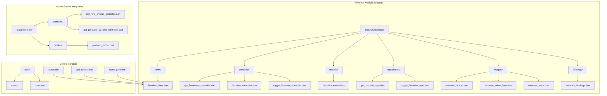

**Diagram sources**
- [favorites_view.dart:14-54](file://lib/features/favorites/views/favorites_view.dart#L14-L54)
- [get_favourites_controller.dart:6-32](file://lib/features/favorites/controller/get_favourites_controller.dart#L6-L32)
- [toggle_favourite_controller.dart:8-70](file://lib/features/favorites/controller/toggle_favourite_controller.dart#L8-L70)
- [favourite_model.dart:3-138](file://lib/features/favorites/models/favourite_model.dart#L3-L138)
- [get_favorite_repo.dart:7-20](file://lib/features/favorites/repositories/get_favorite_repo.dart#L7-L20)
- [toggle_favourite_repo.dart:8-21](file://lib/features/favorites/repositories/toggle_favourite_repo.dart#L8-L21)
- [get_new_arrivals_controller.dart:6-32](file://lib/features/home/controller/get_new_arrivals_controller.dart#L6-L32)
- [get_products_by_type_controller.dart:6-27](file://lib/features/home/controller/get_products_by_type_controller.dart#L6-L27)
- [products_model.dart:29-145](file://lib/features/home/models/products_model.dart#L29-L145)

**Section sources**
- [favorites_view.dart:14-54](file://lib/features/favorites/views/favorites_view.dart#L14-L54)
- [get_favourites_controller.dart:6-32](file://lib/features/favorites/controller/get_favourites_controller.dart#L6-L32)
- [toggle_favourite_controller.dart:8-70](file://lib/features/favorites/controller/toggle_favourite_controller.dart#L8-L70)

## Core Components

The Favorites Module now consists of a comprehensive set of components working together to provide advanced favorite management functionality:

### Main View Component
The FavoritesView serves as the primary container with reactive loading states and comprehensive layout management.

### Controller Layer
The controller layer has been completely redesigned with specialized controllers:
- **GetFavouritesController**: Manages fetching and caching of favorites data with pagination support
- **FavoritesController**: Handles search functionality, sorting options, and multi-select state
- **ToggleFavouriteController**: Enhanced with three context-aware methods for different UI contexts

**Updated** The ToggleFavouriteController now includes sophisticated context-aware methods:
- `toggleFavourite()`: Main method routing to appropriate context handler
- `toggleNewArrival()`: Updates favorite status in new arrivals section
- `toggleCategoryProduct()`: Updates favorite status in category products section
- `toggleFavouriteProduct()`: Removes product from favorites list and updates other contexts

### Model Layer
The new FavouriteModel provides comprehensive data structure with pagination support:
- **FavouriteModel**: Main model with data array and pagination metadata
- **FavoriteItem**: Individual favorite item with product details
- **FavoriteLink**: Pagination link information

### Repository Layer
The repository layer now includes separate operations:
- **GetFavoriteRepository**: Handles fetching favorites data
- **ToggleFavouriteRepository**: Handles toggle operations with API integration

### Widget Components
The widget layer provides enhanced UI components:
- **FavoritesHeader**: Advanced search and sorting interface
- **FavoritesSelectItem**: Multi-select with enhanced visual feedback
- **FavoritesItems**: Grid display with real-time updates

**Updated** Enhanced home screen integration components:
- **Product.isFavourite**: Boolean flag in Product model for home screen integration
- **Real-time updates**: Automatic UI updates across all contexts

**Section sources**
- [favorites_view.dart:14-54](file://lib/features/favorites/views/favorites_view.dart#L14-L54)
- [get_favourites_controller.dart:6-32](file://lib/features/favorites/controller/get_favourites_controller.dart#L6-L32)
- [favorites_controller.dart:4-22](file://lib/features/favorites/controller/favorites_controller.dart#L4-L22)
- [toggle_favourite_controller.dart:8-70](file://lib/features/favorites/controller/toggle_favourite_controller.dart#L8-L70)
- [favourite_model.dart:3-138](file://lib/features/favorites/models/favourite_model.dart#L3-L138)

## Architecture Overview

The Favorites Module implements a sophisticated layered architecture with clear separation of concerns and comprehensive home screen integration:

```mermaid
graph TB
subgraph "Presentation Layer"
FV["FavoritesView<br/>Reactive Main View"]
FH["FavoritesHeader<br/>Advanced Search & Sort"]
FS["FavoritesSelectItem<br/>Enhanced Multi-select"]
FI["FavoritesItems<br/>Grid with Real-time Updates"]
end
subgraph "Domain Layer"
GFC["GetFavouritesController<br/>Data Fetching & Caching"]
FC["FavoritesController<br/>State Management"]
TFC["ToggleFavouriteController<br/>Context-aware Operations"]
end
subgraph "Data Layer"
GFR["GetFavoriteRepository<br/>Favorites Data Fetching"]
TFR["ToggleFavouriteRepository<br/>Toggle Operations"]
end
subgraph "Model Layer"
FM["FavouriteModel<br/>Complete Data Structure"]
PM["ProductsModel<br/>Home Integration"]
end
subgraph "Home Integration"
GNA["GetNewArrivalsController<br/>New Arrivals Updates"]
GPBT["GetProductsByTypeController<br/>Category Updates"]
end
subgraph "Infrastructure"
RT["Route Configuration"]
IP["Icon Resources"]
CB["Custom Widgets"]
END
FV --> GFC
FV --> FC
FH --> FC
FS --> FC
FI --> TFC
TFC --> GNA
TFC --> GPBT
GFC --> GFR
TFC --> TFR
GFR --> FM
TFR --> PM
GFC --> FM
TFC --> PM
```

**Diagram sources**
- [favorites_view.dart:14-54](file://lib/features/favorites/views/favorites_view.dart#L14-L54)
- [get_favourites_controller.dart:6-32](file://lib/features/favorites/controller/get_favourites_controller.dart#L6-L32)
- [favorites_controller.dart:4-22](file://lib/features/favorites/controller/favorites_controller.dart#L4-L22)
- [toggle_favourite_controller.dart:8-70](file://lib/features/favorites/controller/toggle_favourite_controller.dart#L8-L70)
- [favourite_model.dart:3-138](file://lib/features/favorites/models/favourite_model.dart#L3-L138)
- [get_favorite_repo.dart:7-20](file://lib/features/favorites/repositories/get_favorite_repo.dart#L7-L20)
- [toggle_favourite_repo.dart:8-21](file://lib/features/favorites/repositories/toggle_favourite_repo.dart#L8-L21)
- [get_new_arrivals_controller.dart:6-32](file://lib/features/home/controller/get_new_arrivals_controller.dart#L6-L32)
- [get_products_by_type_controller.dart:6-27](file://lib/features/home/controller/get_products_by_type_controller.dart#L6-L27)

The architecture implements advanced design principles:
- **Separation of Concerns**: Clear division between presentation, domain, and data layers
- **Reactive State Management**: Modern GetX implementation with automatic UI updates
- **Context-aware Operations**: Three distinct methods for different UI contexts
- **Pagination Support**: Complete pagination handling for large datasets
- **Real-time Updates**: Seamless synchronization across all application sections
- **Error Handling**: Comprehensive error management with user feedback

## Detailed Component Analysis

### FavoritesView Component

The FavoritesView serves as the main container with comprehensive reactive state management and loading indicators.

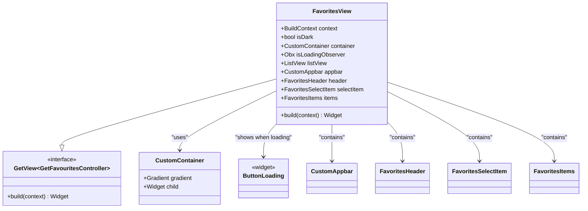

**Diagram sources**
- [favorites_view.dart:14-54](file://lib/features/favorites/views/favorites_view.dart#L14-L54)

Key features of the FavoritesView:
- **Reactive Loading States**: Automatic loading indicator during data fetch operations
- **Theme-aware Design**: Dynamic theme adaptation with gradient backgrounds
- **Comprehensive Layout**: Organized into distinct functional sections
- **Navigation Integration**: Seamless integration with application navigation

**Section sources**
- [favorites_view.dart:14-54](file://lib/features/favorites/views/favorites_view.dart#L14-L54)

### GetFavouritesController Analysis

The GetFavouritesController manages comprehensive favorites data fetching with pagination support and error handling.

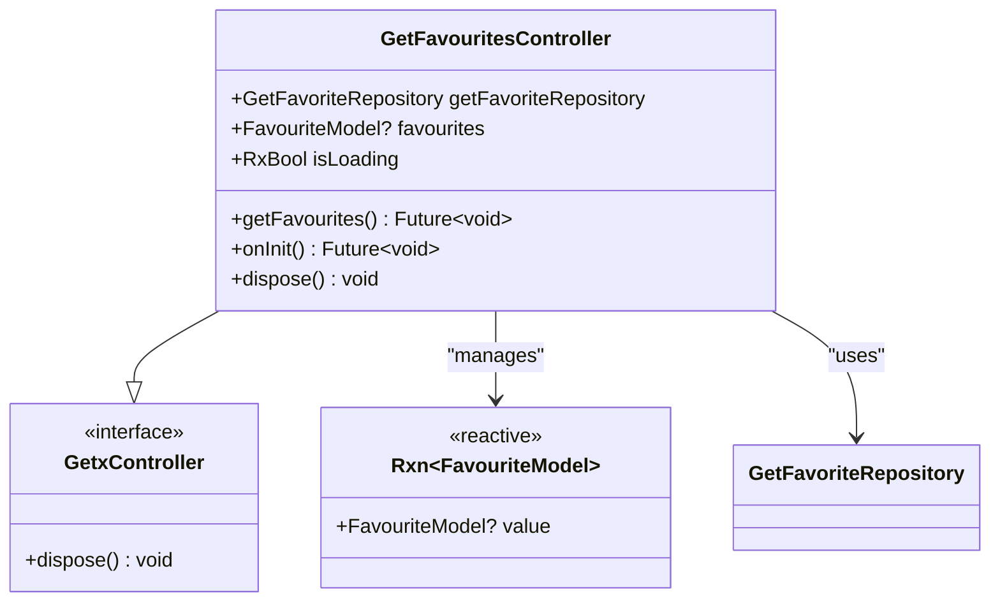

**Diagram sources**
- [get_favourites_controller.dart:6-32](file://lib/features/favorites/controller/get_favourites_controller.dart#L6-L32)

The controller provides:
- **Data Fetching**: Comprehensive favorites data retrieval with pagination
- **Loading States**: Reactive loading indicators during network operations
- **Error Handling**: User-friendly error management with snackbar feedback
- **Automatic Initialization**: Data fetching on controller initialization
- **Memory Management**: Proper resource cleanup

**Section sources**
- [get_favourites_controller.dart:6-32](file://lib/features/favorites/controller/get_favourites_controller.dart#L6-L32)

### FavoritesController Analysis

The FavoritesController manages state and business logic for search, sorting, and multi-select functionality.

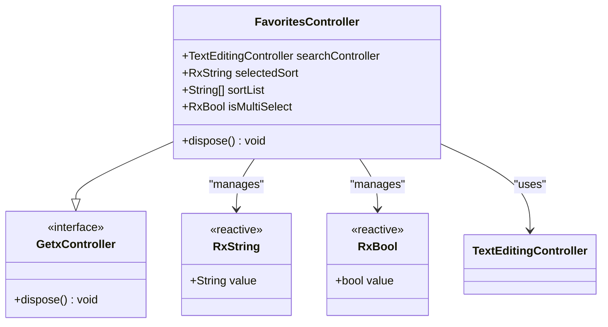

**Diagram sources**
- [favorites_controller.dart:4-22](file://lib/features/favorites/controller/favorites_controller.dart#L4-L22)

The controller provides:
- **Search Functionality**: Real-time product search with TextEditingController
- **Sorting Options**: Six comprehensive sorting criteria with reactive selection
- **Multi-select State**: Toggle-based selection for bulk operations
- **Memory Management**: Proper disposal of resources

**Section sources**
- [favorites_controller.dart:4-22](file://lib/features/favorites/controller/favorites_controller.dart#L4-L22)

### ToggleFavouriteController Analysis

The enhanced ToggleFavouriteController handles three distinct context-aware operations for comprehensive favorites management.

**Updated** Enhanced with sophisticated context-aware methods:

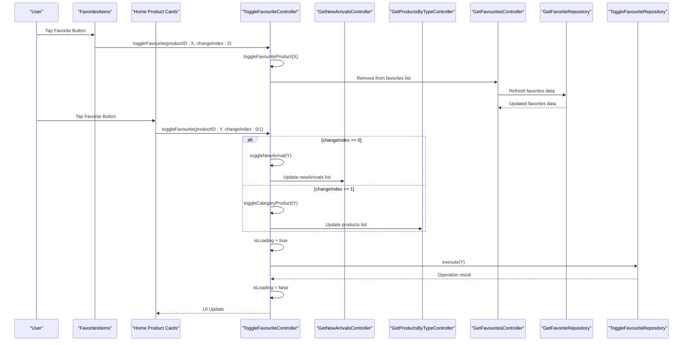

**Diagram sources**
- [toggle_favourite_controller.dart:13-70](file://lib/features/favorites/controller/toggle_favourite_controller.dart#L13-L70)
- [toggle_favourite_repo.dart:12-21](file://lib/features/favorites/repositories/toggle_favourite_repo.dart#L12-L21)
- [get_new_arrivals_controller.dart:34-43](file://lib/features/home/controller/get_new_arrivals_controller.dart#L34-L43)
- [get_products_by_type_controller.dart:45-54](file://lib/features/home/controller/get_products_by_type_controller.dart#L45-L54)

Key aspects of the enhanced controller:
- **Context-aware Operations**: Three specialized methods for different UI contexts
- **Loading States**: Reactive loading indicators during network operations
- **Error Handling**: Comprehensive error management with user feedback
- **Real-time Updates**: Automatic UI updates across all contexts
- **Data Synchronization**: Maintains consistency across favorites, home, and category screens

**Section sources**
- [toggle_favourite_controller.dart:8-70](file://lib/features/favorites/controller/toggle_favourite_controller.dart#L8-L70)

### Model Layer Analysis

The new model layer provides comprehensive data structures supporting advanced favorites functionality.

#### FavouriteModel
The main model with complete pagination support and nested data structures.

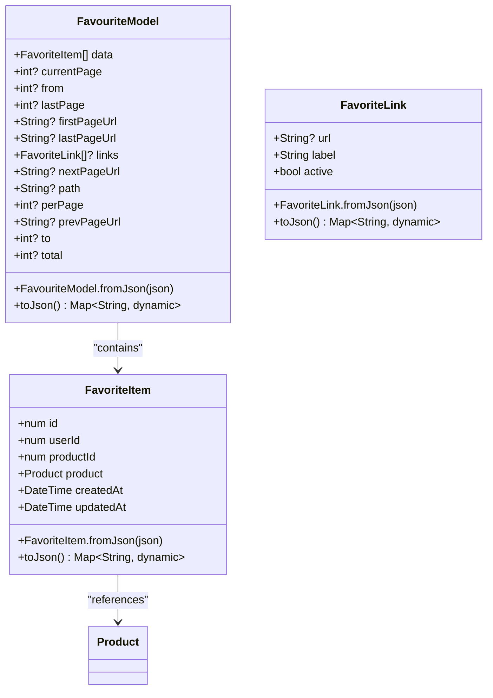

**Diagram sources**
- [favourite_model.dart:3-138](file://lib/features/favorites/models/favourite_model.dart#L3-L138)

#### ProductsModel Enhancement
The Product model now includes isFavourite boolean for home screen integration.

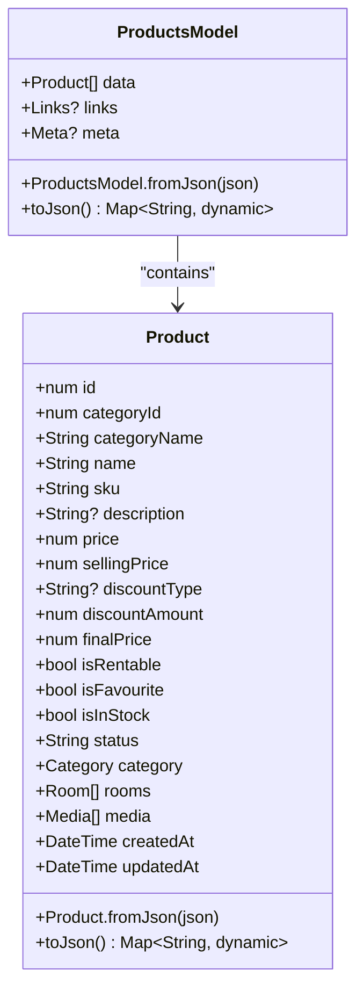

**Diagram sources**
- [favourite_model.dart:79-117](file://lib/features/favorites/models/favourite_model.dart#L79-L117)
- [products_model.dart:29-145](file://lib/features/home/models/products_model.dart#L29-L145)

**Section sources**
- [favourite_model.dart:3-138](file://lib/features/favorites/models/favourite_model.dart#L3-L138)
- [products_model.dart:29-145](file://lib/features/home/models/products_model.dart#L29-L145)

### Repository Layer Analysis

The repository layer now includes separate operations for fetching and toggling favorites.

#### GetFavoriteRepository
Handles comprehensive favorites data fetching with pagination support.

```mermaid
classDiagram
class GetFavoriteRepository {
+GetNetwork getNetwork
+GetFavoriteRepository({required getNetwork})
+execute() Future~Either~ErrorModel, FavouriteModel~~
}
class GetNetwork {
<<interface>>
+getData~T~(url, headers, fromJson) Future~Either~ErrorModel, T~~
}
GetFavoriteRepository --> GetNetwork : "uses"
```

**Diagram sources**
- [get_favorite_repo.dart:7-20](file://lib/features/favorites/repositories/get_favorite_repo.dart#L7-L20)

#### ToggleFavouriteRepository
Handles toggle operations with API integration and error handling.

```mermaid
classDiagram
class ToggleFavouriteRepository {
+PostWithoutResponse postWithoutResponse
+ToggleFavouriteRepository({required postWithoutResponse})
+execute({required productID}) Future~Either~ErrorModel, bool~~
}
class PostWithoutResponse {
<<interface>>
+postData(url, headers, body) Future~Either~ErrorModel, bool~~
}
ToggleFavouriteRepository --> PostWithoutResponse : "uses"
```

**Diagram sources**
- [toggle_favourite_repo.dart:8-21](file://lib/features/favorites/repositories/toggle_favourite_repo.dart#L8-L21)

**Section sources**
- [get_favorite_repo.dart:7-20](file://lib/features/favorites/repositories/get_favorite_repo.dart#L7-L20)
- [toggle_favourite_repo.dart:8-21](file://lib/features/favorites/repositories/toggle_favourite_repo.dart#L8-L21)

### Widget Components Analysis

The widget components provide enhanced UI elements with comprehensive functionality.

#### FavoritesHeader Component
Advanced search and sorting interface with comprehensive styling.

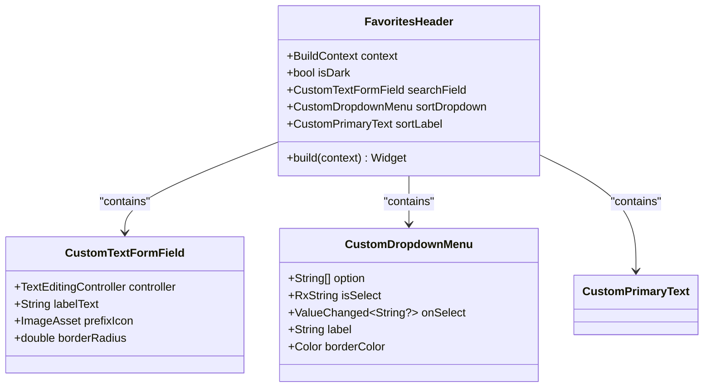

**Diagram sources**
- [favorites_header.dart:11-68](file://lib/features/favorites/widgets/favorites_header.dart#L11-L68)

#### FavoritesSelectItem Component
Enhanced multi-select functionality with improved visual feedback.

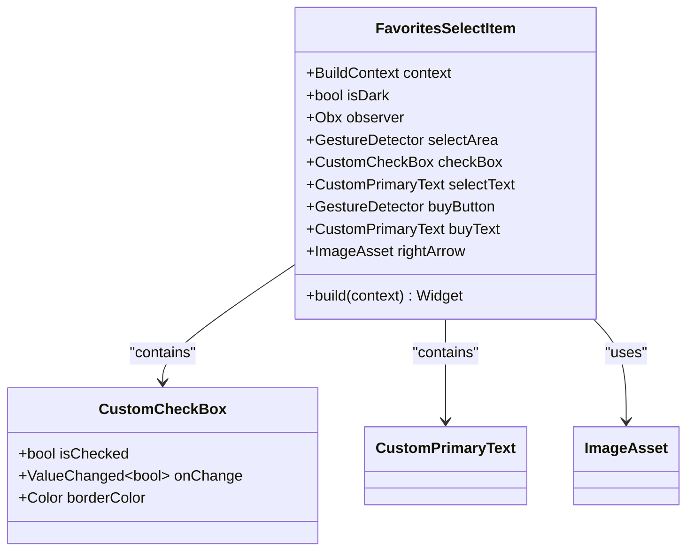

**Diagram sources**
- [favorites_select_item.dart:10-94](file://lib/features/favorites/widgets/favorites_select_item.dart#L10-L94)

#### FavoritesItems Component
Enhanced grid display with real-time updates and comprehensive product information.

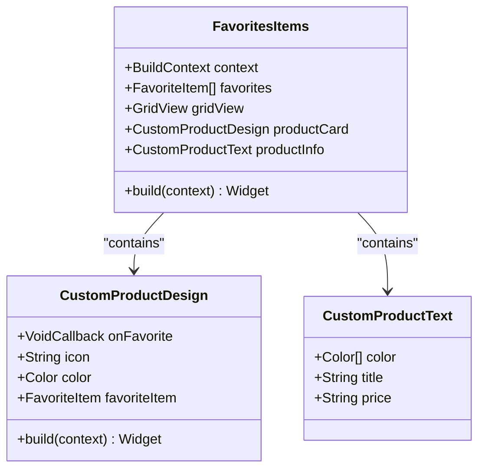

**Diagram sources**
- [favorites_items.dart:11-55](file://lib/features/favorites/widgets/favorites_items.dart#L11-L55)
- [custom_product_design.dart](file://lib/shared/widgets/custom_product_design.dart)

**Section sources**
- [favorites_header.dart:11-68](file://lib/features/favorites/widgets/favorites_header.dart#L11-L68)
- [favorites_select_item.dart:10-94](file://lib/features/favorites/widgets/favorites_select_item.dart#L10-L94)
- [favorites_items.dart:11-55](file://lib/features/favorites/widgets/favorites_items.dart#L11-L55)

## Data Flow Analysis

The Favorites Module implements a sophisticated unidirectional data flow with comprehensive error handling and real-time updates:

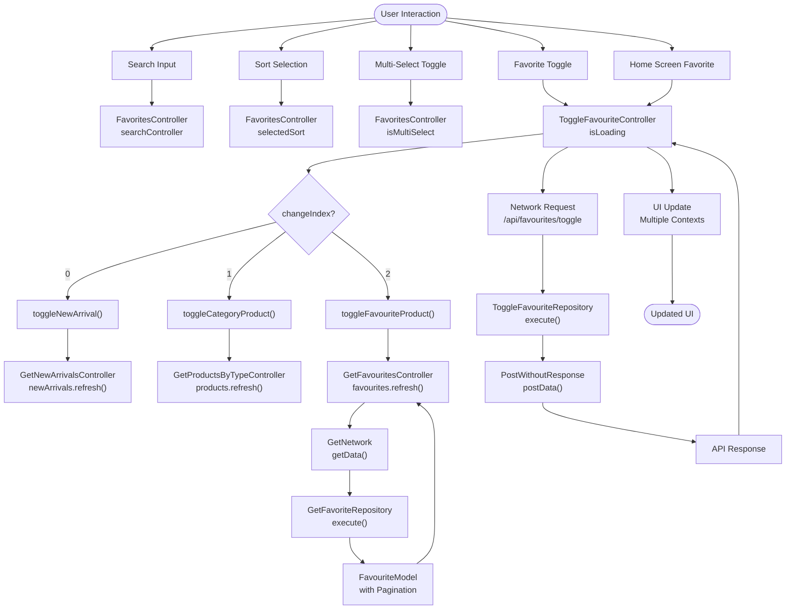

**Diagram sources**
- [favorites_controller.dart:4-22](file://lib/features/favorites/controller/favorites_controller.dart#L4-L22)
- [toggle_favourite_controller.dart:13-70](file://lib/features/favorites/controller/toggle_favourite_controller.dart#L13-L70)
- [get_favourites_controller.dart:13-32](file://lib/features/favorites/controller/get_favourites_controller.dart#L13-L32)
- [get_favorite_repo.dart:11-20](file://lib/features/favorites/repositories/get_favorite_repo.dart#L11-L20)
- [toggle_favourite_repo.dart:12-21](file://lib/features/favorites/repositories/toggle_favourite_repo.dart#L12-L21)

The data flow ensures:
- **Predictable State Changes**: All state modifications go through centralized controllers
- **Automatic UI Updates**: Reactive state changes trigger immediate UI refreshes across contexts
- **Error Propagation**: Errors are handled consistently with user feedback
- **Network Isolation**: Network operations are isolated in dedicated repositories
- **Real-time Synchronization**: Multiple contexts remain synchronized in real-time
- **Pagination Support**: Complete pagination handling for large datasets

**Section sources**
- [favorites_controller.dart:4-22](file://lib/features/favorites/controller/favorites_controller.dart#L4-L22)
- [toggle_favourite_controller.dart:13-70](file://lib/features/favorites/controller/toggle_favourite_controller.dart#L13-L70)
- [get_favourites_controller.dart:13-32](file://lib/features/favorites/controller/get_favourites_controller.dart#L13-L32)

## UI Components Analysis

The Favorites Module utilizes a comprehensive set of enhanced UI components with advanced functionality and consistent styling:

### Theme Integration
All components adapt to current theme (light/dark mode) with sophisticated color management and visual consistency.

### Responsive Design
Enhanced grid layouts and flexible widget hierarchies ensure optimal display across all device sizes and orientations.

### Icon Management
Centralized icon management through IconsPath class with comprehensive asset organization.

### Custom Widget Ecosystem
The module leverages advanced custom widgets including:
- **CustomTextFormField**: Enhanced form fields with comprehensive styling and validation
- **CustomCheckBox**: Sophisticated themed checkboxes with proper accessibility
- **CustomProductDesign**: Complete product cards with advanced favorite functionality
- **CustomPrimaryText**: Consistent typography system with advanced styling options
- **ButtonLoading**: Custom loading indicators with smooth animations

**Updated** Enhanced home screen integration provides:
- **Dynamic Favorite Icons**: Real-time icon updates based on favorite status
- **Seamless Navigation**: Product cards with comprehensive navigation support
- **Consistent Styling**: Unified design language across all application sections
- **Real-time Updates**: Automatic UI updates across all contexts

**Section sources**
- [icons_path.dart](file://lib/core/constant/icons_path.dart)
- [custom_product_design.dart](file://lib/shared/widgets/custom_product_design.dart)
- [favorites_items.dart:11-55](file://lib/features/favorites/widgets/favorites_items.dart#L11-L55)

## Integration Points

The Favorites Module integrates seamlessly with the broader application architecture through comprehensive integration points:

### Route Integration
The module is registered as a named route with complete dependency injection support, enabling programmatic navigation and deep linking.

### Dependency Injection
Advanced GetX dependency injection system with lazy loading and service registration for optimal performance.

### Navigation Integration
The FavoritesView includes comprehensive back navigation with proper state management and context preservation.

### State Management Integration
The module participates in the global reactive state management system with automatic UI updates and context synchronization.

**Updated** Enhanced home screen integration provides:
- **Direct Controller Access**: Home screen components access controllers directly via GetX
- **Context-aware Updates**: Three distinct update methods for different home screen contexts
- **Real-time Synchronization**: Automatic updates across all application sections
- **Data Consistency**: Maintains consistency between favorites, home, and category screens

### Advanced Home Screen Integration
The module now provides comprehensive integration with home screen components:
- **New Arrivals Section**: Real-time favorite status updates in new arrivals
- **Category Products Section**: Dynamic favorite status updates in category products
- **Favorites Screen**: Automatic removal of items when unfavorited
- **Product.isFavourite**: Boolean flag in Product model for seamless integration

**Section sources**
- [routes.dart](file://lib/core/routes/routes.dart)
- [app_routes.dart](file://lib/core/routes/app_routes.dart)
- [favorites_bindings.dart:6-16](file://lib/features/favorites/bindings/favorites_bindings.dart#L6-L16)
- [toggle_favourite_controller.dart:34-68](file://lib/features/favorites/controller/toggle_favourite_controller.dart#L34-L68)

## Performance Considerations

The Favorites Module is designed with comprehensive performance optimization strategies:

### Lazy Loading
Advanced lazy loading implementation reduces memory footprint and improves application startup performance.

### Efficient State Management
Sophisticated GetX reactive state management minimizes unnecessary rebuilds and optimizes UI updates across multiple contexts.

### Memory Management
Comprehensive memory management with proper controller disposal and reference cleanup prevents memory leaks.

### Network Optimization
Advanced network optimization with separate repositories for get and toggle operations, reducing redundant network calls.

### Grid Optimization
Enhanced grid rendering with efficient item building and minimal widget tree complexity.

**Updated** Advanced performance optimizations:
- **Context-aware Updates**: Only affected data models are refreshed based on changeIndex
- **Selective List Updates**: Home screen lists update efficiently without full rebuilds
- **Real-time Synchronization**: Optimized update mechanisms prevent cascading updates
- **Pagination Support**: Efficient handling of large datasets with pagination

## Troubleshooting Guide

Comprehensive troubleshooting guide for common issues in the enhanced Favorites Module:

### Navigation Issues
**Problem**: Favorites view not accessible via navigation
**Solution**: Verify route registration in routes.dart and ensure proper dependency injection setup

### State Not Updating
**Problem**: UI not reflecting state changes across contexts
**Solution**: Ensure proper use of GetBuilder/Obx widgets and verify reactive variable usage in all contexts

### Network Errors
**Problem**: Favorite toggle operations failing or favorites not loading
**Solution**: Check API endpoint configuration, verify network connectivity, and examine error handling implementation

### Memory Leaks
**Problem**: Application performance degrading over time
**Solution**: Ensure proper controller disposal and avoid retaining references to disposed objects

### UI Rendering Issues
**Problem**: Components not displaying correctly or updating properly
**Solution**: Verify theme integration, check widget hierarchy construction, and ensure proper reactive state usage

**Updated** Advanced troubleshooting for enhanced functionality:
- **Favorite Button Not Working**: Verify changeIndex parameter is correctly set (0 for new arrivals, 1 for category products, 2 for favorites screen)
- **Home Screen Not Updating**: Check that appropriate controller is being accessed via Get.find() for GetNewArrivalsController or GetProductsByTypeController
- **Favorite Icon Not Changing**: Ensure isFavourite property is properly updated in Product model and refresh() is called on affected controllers
- **Favorites Not Removing**: Verify toggleFavouriteProduct method is called with changeIndex: 2 and GetFavouritesController.refresh() is executed
- **Pagination Issues**: Check FavouriteModel pagination properties and ensure proper handling of page navigation

**Section sources**
- [toggle_favourite_controller.dart:19-32](file://lib/features/favorites/controller/toggle_favourite_controller.dart#L19-L32)
- [get_favourites_controller.dart:26-32](file://lib/features/favorites/controller/get_favourites_controller.dart#L26-L32)

## Conclusion

The Favorites Module represents a comprehensive, modern solution for managing user favorites within the ZB-DEZINE application. The completely redesigned architecture demonstrates excellent software engineering practices through its clear separation of concerns, advanced reactive state management, and sophisticated real-time synchronization capabilities.

**Updated** Key enhancements include:
- **Complete Architecture Rewrite**: Modern GetX-based implementation with comprehensive error handling
- **Three Context-aware Methods**: Specialized toggle operations for different UI contexts
- **Advanced Pagination Support**: Complete pagination handling for large datasets
- **Real-time Synchronization**: Seamless updates across favorites, home, and category screens
- **Enhanced Error Handling**: Comprehensive error management with user feedback
- **Improved Performance**: Optimized for efficiency with lazy loading and selective updates

Key strengths of the enhanced implementation:
- **Clean Architecture**: Well-defined layers with clear responsibilities and separation of concerns
- **Advanced Reactive Programming**: Modern GetX implementation with automatic UI updates across multiple contexts
- **Extensibility**: Modular design that facilitates future enhancements and additional contexts
- **User Experience**: Intuitive interface with comprehensive functionality and real-time feedback
- **Performance**: Highly optimized for efficiency with sophisticated update mechanisms
- **Integration**: Seamless experience across all application sections with real-time synchronization

The module serves as a robust foundation for the application's favorite functionality and provides an excellent template for implementing similar features throughout the codebase. Its comprehensive error handling, performance optimizations, and real-time synchronization mechanisms ensure reliability and maintainability in production environments.