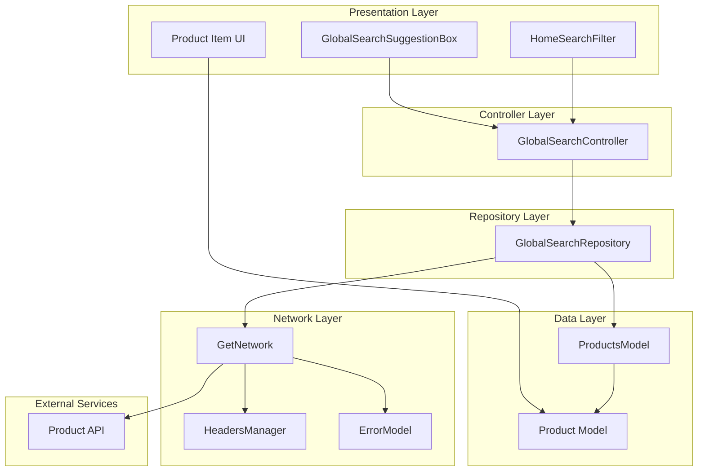
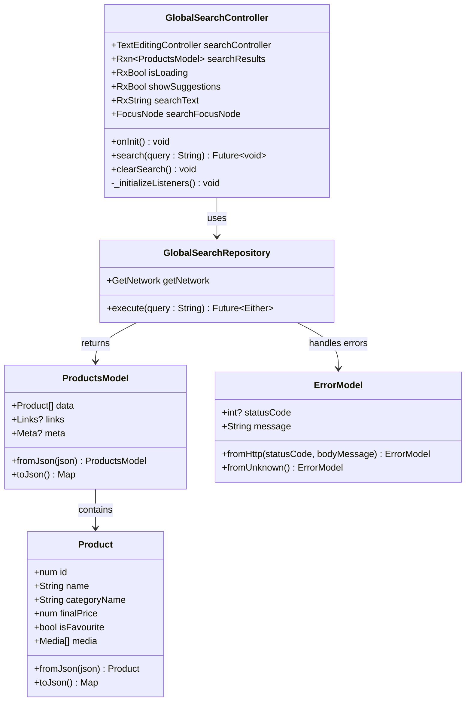
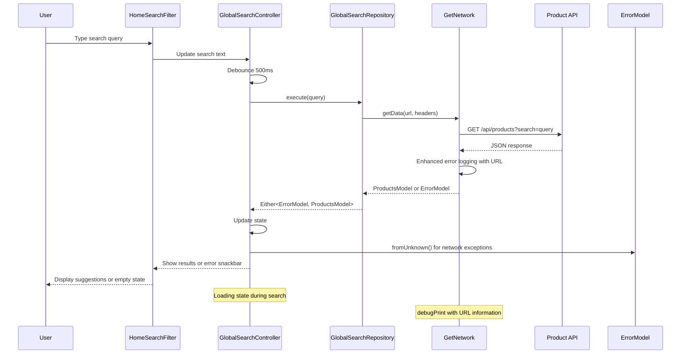
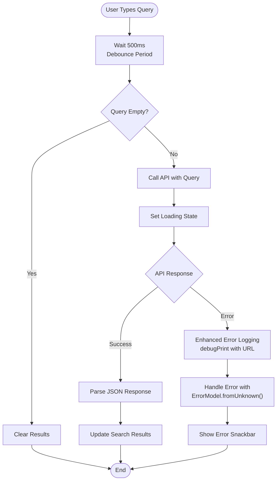
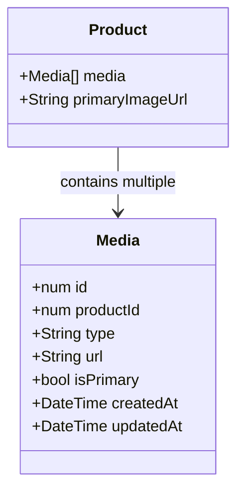
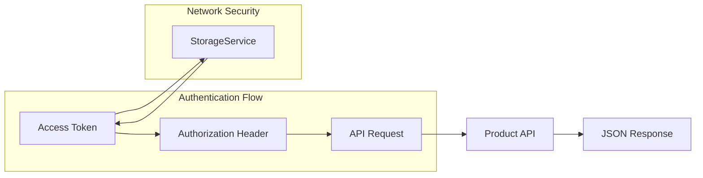

# Global Search System

<cite>
**Referenced Files in This Document**
- [main.dart](file://lib/main.dart)
- [global_search_controller.dart](file://lib/features/home/controller/global_search_controller.dart)
- [global_search_repo.dart](file://lib/features/home/repositories/global_search_repo.dart)
- [global_search_suggestion_box.dart](file://lib/features/home/widgets/home_widgets/global_search_suggestion_box.dart)
- [home_search_filter.dart](file://lib/features/home/widgets/home_widgets/home_search_filter.dart)
- [products_model.dart](file://lib/features/home/models/products_model.dart)
- [get_network.dart](file://lib/core/data/networks/get_network.dart)
- [headers_manager.dart](file://lib/core/data/networks/headers_manager.dart)
- [error_model.dart](file://lib/core/data/global_models/error_model.dart)
- [error_snackbar.dart](file://lib/shared/widgets/snackbars/error_snackbar.dart)
- [pubspec.yaml](file://pubspec.yaml)
</cite>

## Update Summary
**Changes Made**
- Enhanced error logging mechanism with URL information in debug prints
- Updated error handling strategy to consistently return ErrorModel.fromUnknown() for network exceptions
- Improved error debugging capabilities with comprehensive URL tracking
- Strengthened error handling consistency across network operations

## Table of Contents
1. [Introduction](#introduction)
2. [System Architecture](#system-architecture)
3. [Core Components](#core-components)
4. [Search Implementation](#search-implementation)
5. [Data Models](#data-models)
6. [Network Layer](#network-layer)
7. [UI Components](#ui-components)
8. [Performance Considerations](#performance-considerations)
9. [Error Handling](#error-handling)
10. [Integration Points](#integration-points)
11. [Conclusion](#conclusion)

## Introduction

The Global Search System is a comprehensive search functionality integrated into the ZB-DEZINE Flutter application. This system enables users to search for products across the platform with real-time suggestions, debounced search queries, and responsive UI feedback. The implementation follows modern Flutter architecture patterns using GetX for state management and dependency injection.

The search system is designed to provide an optimal user experience with features including instant search suggestions, loading indicators, empty state handling, and seamless integration with the application's routing system. Recent enhancements have strengthened the error handling mechanisms with improved logging capabilities and consistent error responses.

## System Architecture

The Global Search System follows a layered architecture pattern with clear separation of concerns:

**Diagram sources**
- [global_search_controller.dart:1-74](file://lib/features/home/controller/global_search_controller.dart#L1-L74)
- [global_search_repo.dart:1-22](file://lib/features/home/repositories/global_search_repo.dart#L1-L22)
- [get_network.dart:1-42](file://lib/core/data/networks/get_network.dart#L1-L42)
- [error_model.dart:1-15](file://lib/core/data/global_models/error_model.dart#L1-L15)

## Core Components

### GlobalSearchController

The GlobalSearchController serves as the central orchestrator for the search functionality, managing state, handling user interactions, and coordinating between different layers of the application.

**Diagram sources**
- [global_search_controller.dart:7-73](file://lib/features/home/controller/global_search_controller.dart#L7-L73)
- [global_search_repo.dart:7-21](file://lib/features/home/repositories/global_search_repo.dart#L7-L21)
- [products_model.dart:9-137](file://lib/features/home/models/products_model.dart#L9-L137)
- [error_model.dart:1-15](file://lib/core/data/global_models/error_model.dart#L1-L15)

**Section sources**
- [global_search_controller.dart:1-74](file://lib/features/home/controller/global_search_controller.dart#L1-L74)

### GlobalSearchRepository

The repository layer handles all data operations for the search functionality, including API communication and data transformation.

**Section sources**
- [global_search_repo.dart:1-22](file://lib/features/home/repositories/global_search_repo.dart#L1-L22)

## Search Implementation

The search implementation utilizes several sophisticated techniques to ensure optimal performance and user experience:

**Diagram sources**
- [global_search_controller.dart:45-58](file://lib/features/home/controller/global_search_controller.dart#L45-L58)
- [global_search_repo.dart:11-20](file://lib/features/home/repositories/global_search_repo.dart#L11-L20)
- [get_network.dart:11-40](file://lib/core/data/networks/get_network.dart#L11-L40)

### Debounced Search Mechanism

The system implements a 500-millisecond debounce mechanism to optimize API calls and reduce unnecessary network requests:

**Diagram sources**
- [global_search_controller.dart:35-42](file://lib/features/home/controller/global_search_controller.dart#L35-L42)
- [get_network.dart:33-38](file://lib/core/data/networks/get_network.dart#L33-L38)

**Section sources**
- [global_search_controller.dart:24-43](file://lib/features/home/controller/global_search_controller.dart#L24-L43)

## Data Models

The search system utilizes a comprehensive data model hierarchy to represent product information and search results:

### ProductsModel Structure

The ProductsModel serves as the root container for search results, containing pagination metadata and product listings:

| Property | Type | Description |
|----------|------|-------------|
| `data` | `List<Product>` | Array of matching products |
| `links` | `Links?` | Pagination navigation links |
| `meta` | `Meta?` | Search metadata and statistics |

### Product Model Properties

Each Product object contains comprehensive information about individual items:

| Property | Type | Description |
|----------|------|-------------|
| `id` | `num` | Unique product identifier |
| `name` | `String` | Product name/display name |
| `categoryName` | `String` | Associated category name |
| `finalPrice` | `num` | Final discounted price |
| `isFavourite` | `bool` | User's favorite status |
| `media` | `List<Media>` | Product media gallery |
| `isRentable` | `bool` | Availability for rental |
| `isInStock` | `bool` | Stock availability status |

### Media Management

The system supports multiple product images with primary image prioritization:

**Diagram sources**
- [products_model.dart:211-249](file://lib/features/home/models/products_model.dart#L211-L249)

**Section sources**
- [products_model.dart:1-363](file://lib/features/home/models/products_model.dart#L1-L363)

## Network Layer

The network layer provides robust communication capabilities with comprehensive error handling and authentication support. Recent enhancements have strengthened the error logging mechanism with URL information and consistent error handling.

### Authentication Integration

The system automatically includes authentication tokens for secure API requests:

**Diagram sources**
- [headers_manager.dart:9-21](file://lib/core/data/networks/headers_manager.dart#L9-L21)

### Enhanced Error Handling Strategy

The network layer implements comprehensive error handling for various failure scenarios with improved logging capabilities:

| Error Type | Status Code | Handling Strategy | Enhanced Logging |
|------------|-------------|-------------------|------------------|
| Successful Response | 200, 201, 202 | Parse and return data | No logging |
| HTTP Error | Other | Extract error message from JSON | URL information logged |
| Network Error | Exception | Return unknown error | URL information logged |
| Parsing Error | JSON Decode | Fallback to unknown error | URL information logged |

**Updated** Enhanced error logging mechanism now includes URL information in debug prints for better debugging capabilities.

**Section sources**
- [get_network.dart:1-42](file://lib/core/data/networks/get_network.dart#L1-L42)
- [headers_manager.dart:1-23](file://lib/core/data/networks/headers_manager.dart#L1-L23)

## UI Components

The user interface components provide an intuitive and responsive search experience:

### HomeSearchFilter Component

The primary search input component integrates seamlessly with the home screen design:

| Feature | Implementation | UX Benefit |
|---------|----------------|------------|
| Custom Styling | Glassmorphism effect with blur container | Modern aesthetic |
| Prefix Icon | Search icon with white color scheme | Clear visual cue |
| Suffix Actions | Clear button appears when text exists | Easy text removal |
| Focus Management | Dedicated FocusNode | Smooth keyboard handling |
| Responsive Design | ScreenUtil scaling | Consistent sizing across devices |

### GlobalSearchSuggestionBox Component

The suggestion box provides contextual search results with comprehensive state management:

| State | UI Representation | Behavior |
|-------|-------------------|----------|
| Loading | Circular progress indicator | Shows search progress |
| Results Available | Scrollable product list | Displays up to 10 results |
| Empty State | Search icon with message | Guides user to refine search |
| No Content | Hidden by default | Prevents layout shifts |

### Product Item Display

Each product suggestion includes essential information with visual enhancements:

| Element | Implementation | Purpose |
|---------|----------------|---------|
| Product Image | Network image with fallback | Visual identification |
| Name | Multi-line text with ellipsis | Clear product naming |
| Category | Secondary text styling | Contextual information |
| Price | Formatted currency display | Pricing transparency |
| Favorite Indicator | Conditional heart icon | User preference indication |

**Section sources**
- [home_search_filter.dart:1-71](file://lib/features/home/widgets/home_widgets/home_search_filter.dart#L1-L71)
- [global_search_suggestion_box.dart:1-226](file://lib/features/home/widgets/home_widgets/global_search_suggestion_box.dart#L1-L226)

## Performance Considerations

The search system implements several optimization strategies to ensure smooth performance:

### Memory Management
- Proper disposal of TextEditingController and FocusNode in onClose()
- Limited suggestion list display (max 10 items)
- Efficient image loading with error handling

### Network Optimization
- 500ms debounce to reduce API calls
- Conditional loading state management
- Error caching prevention through fresh requests

### UI Performance
- AnimatedContainer with optimized curves
- ListView.separated for efficient list rendering
- Conditional widget rendering based on state

## Error Handling

The system provides comprehensive error handling across all layers with enhanced logging capabilities:

### Frontend Error Display
- ErrorSnackbar integration for user feedback
- Graceful degradation to empty state
- Persistent loading indicators during requests

### Backend Error Management
- HTTP status code validation
- JSON parsing error recovery
- Unknown error fallback mechanisms with consistent ErrorModel.fromUnknown() return

### Enhanced Error Logging
- **Updated** Debug prints now include URL information for better troubleshooting
- **Updated** Consistent error handling across all network exceptions
- **Updated** Improved error visibility with comprehensive logging

### User Experience Considerations
- Clear error messages for failed searches
- Automatic retry capability through re-submission
- Visual feedback for all error states

**Updated** Enhanced error logging mechanism with URL information in debug prints and consistent error handling returning ErrorModel.fromUnknown() for network exceptions.

**Section sources**
- [global_search_controller.dart:49-57](file://lib/features/home/controller/global_search_controller.dart#L49-L57)
- [get_network.dart:24-39](file://lib/core/data/networks/get_network.dart#L24-L39)
- [error_model.dart:11-13](file://lib/core/data/global_models/error_model.dart#L11-L13)

## Integration Points

The Global Search System integrates with several key application components:

### Routing Integration
The search system works seamlessly with the application's routing system, appearing on relevant screens while maintaining navigation context.

### State Management
Integration with GetX provides reactive state updates and automatic UI refreshes when search results change.

### Dependency Injection
Centralized dependency injection ensures proper initialization and lifecycle management of search components.

### Theme System
Full integration with the application's theming system provides consistent visual styling across light and dark modes.

**Section sources**
- [main.dart:12-19](file://lib/main.dart#L12-L19)

## Conclusion

The Global Search System represents a well-architected solution that balances functionality, performance, and user experience. The implementation demonstrates modern Flutter development practices through:

- Clean separation of concerns across multiple architectural layers
- Comprehensive state management with reactive programming
- Robust error handling and user feedback mechanisms
- Performance optimizations including debouncing and efficient rendering
- Seamless integration with existing application infrastructure

Recent enhancements have strengthened the system's reliability and maintainability through improved error logging with URL information and consistent error handling strategies. The system provides a solid foundation for future enhancements while maintaining code quality and maintainability standards. The modular design allows for easy extension and customization as the application evolves.