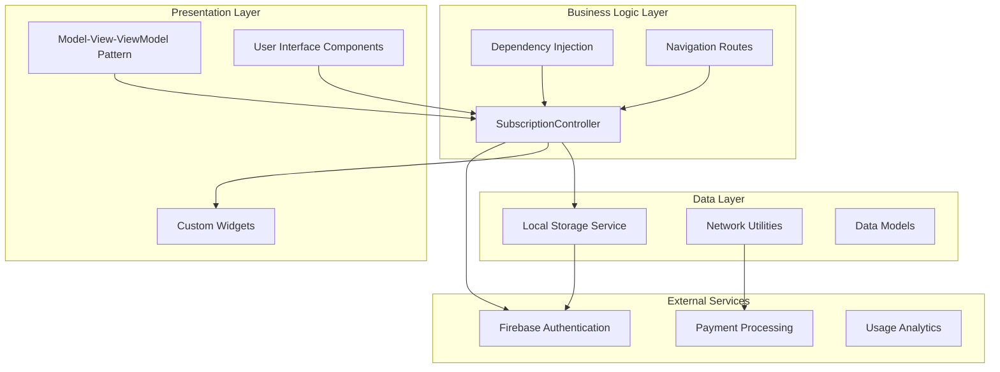
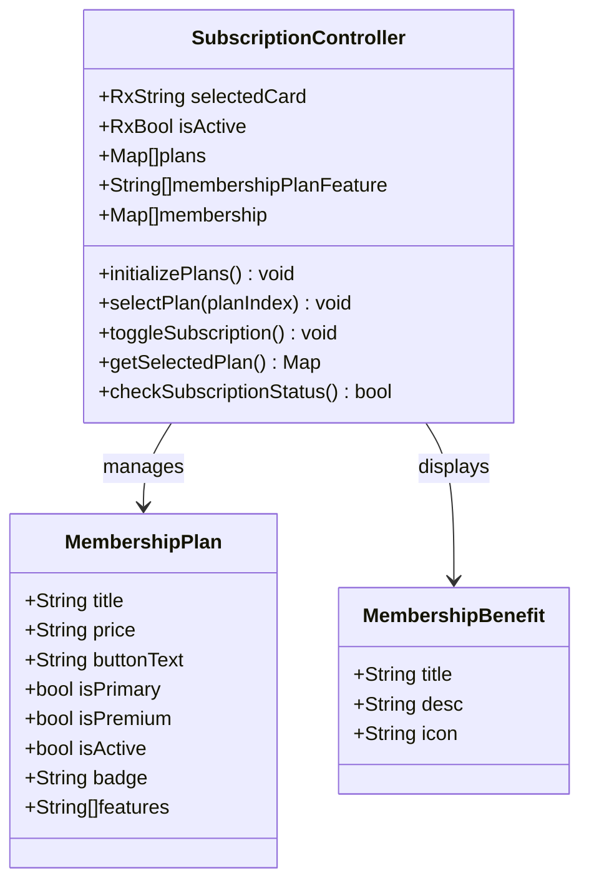
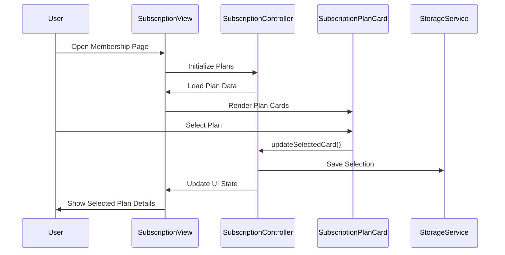
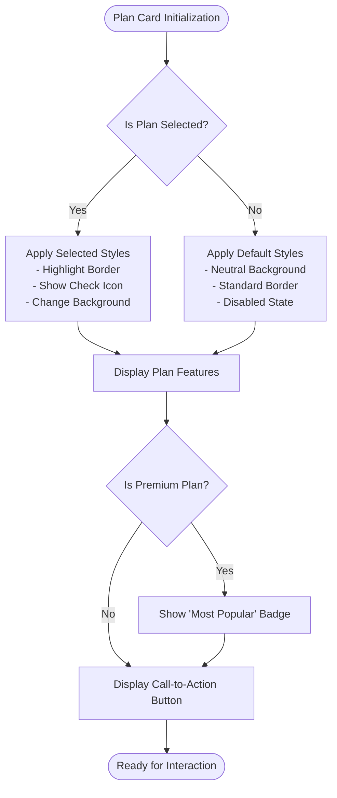
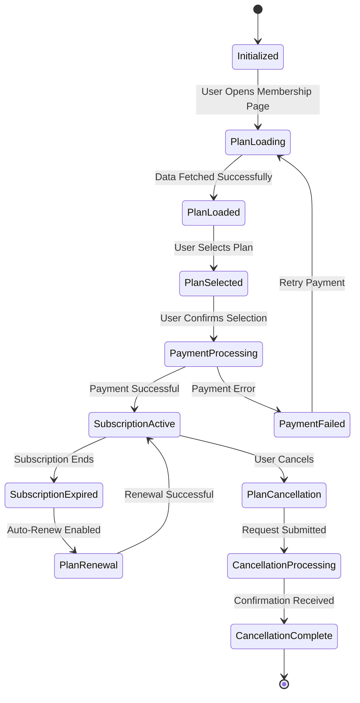
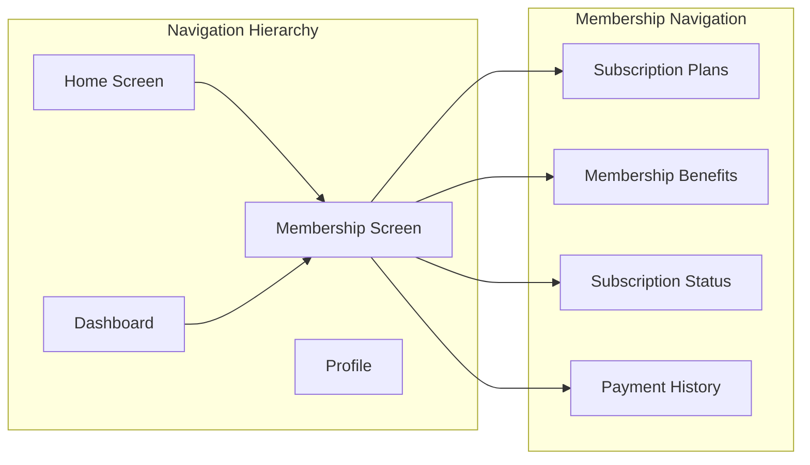
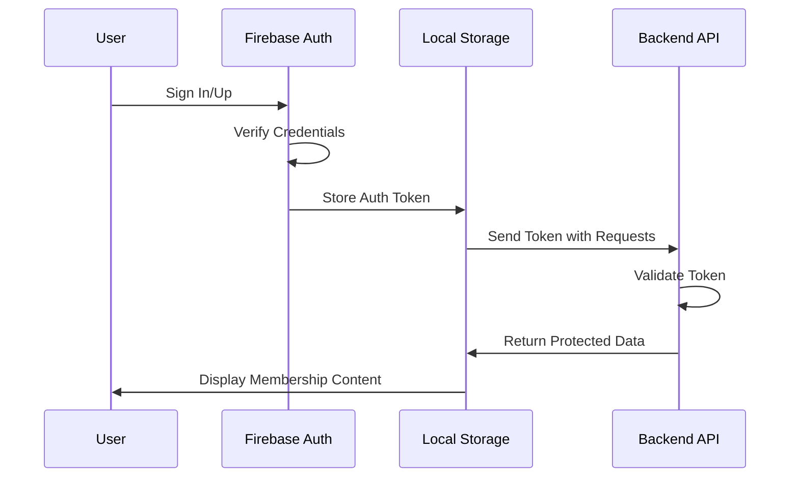

# Membership and Subscription System

<cite>
**Referenced Files in This Document**
- [main.dart](file://lib/main.dart)
- [subscription_controller.dart](file://lib/features/membership/controller/subscription_controller.dart)
- [subscription_view.dart](file://lib/features/membership/views/subscription_view.dart)
- [subscription_bindings.dart](file://lib/features/membership/bindings/subscription_bindings.dart)
- [subscription_plan_card.dart](file://lib/features/membership/widgets/subscription_plan_card.dart)
- [annual_membership.dart](file://lib/features/membership/widgets/annual_membership.dart)
- [active_subscription.dart](file://lib/features/membership/widgets/active_subscription.dart)
- [active_annual_subscription.dart](file://lib/features/membership/widgets/active_annual_subscription.dart)
- [app_routes.dart](file://lib/core/routes/app_routes.dart)
- [routes.dart](file://lib/core/routes/routes.dart)
- [firebase_google_auth.dart](file://lib/core/services/firebase_google_auth.dart)
- [storage_service.dart](file://lib/core/data/local/storage_service.dart)
- [pubspec.yaml](file://pubspec.yaml)
</cite>

## Table of Contents
1. [Introduction](#introduction)
2. [System Architecture](#system-architecture)
3. [Core Components](#core-components)
4. [Membership Plans Management](#membership-plans-management)
5. [User Interface Components](#user-interface-components)
6. [Data Flow and State Management](#data-flow-and-state-management)
7. [Integration Points](#integration-points)
8. [Security and Authentication](#security-and-authentication)
9. [Future Enhancements](#future-enhancements)
10. [Troubleshooting Guide](#troubleshooting-guide)
11. [Conclusion](#conclusion)

## Introduction

The ZB DEZIGN Membership and Subscription System is a comprehensive Flutter-based solution designed to manage user memberships, subscription plans, and premium features for an interior design and furniture marketplace. The system provides three distinct subscription tiers: Earlybird Plan, Design Plan, and Collection+, each offering progressively enhanced benefits and features tailored to different user needs and lifestyles.

This system integrates modern Flutter architecture patterns with reactive state management, providing users with flexible subscription options that can be upgraded, switched, or canceled at any time. The platform focuses on transforming users' living spaces through premium design services while maintaining accessibility and user-friendly navigation.

## System Architecture

The membership system follows a modular architecture pattern built on Flutter's GetX framework, ensuring scalability and maintainability. The system is structured around clear separation of concerns with dedicated layers for presentation, business logic, data management, and external integrations.

**Diagram sources**
- [main.dart:12-47](file://lib/main.dart#L12-L47)
- [subscription_controller.dart:4-85](file://lib/features/membership/controller/subscription_controller.dart#L4-L85)
- [subscription_bindings.dart:4-9](file://lib/features/membership/bindings/subscription_bindings.dart#L4-L9)

## Core Components

### Subscription Controller

The SubscriptionController serves as the central hub for managing membership-related data and user interactions. Built on GetX's reactive programming model, it maintains state for selected plans, subscription status, and user preferences.

**Diagram sources**
- [subscription_controller.dart:4-85](file://lib/features/membership/controller/subscription_controller.dart#L4-L85)

**Section sources**
- [subscription_controller.dart:4-85](file://lib/features/membership/controller/subscription_controller.dart#L4-L85)

### View Layer Implementation

The SubscriptionView provides the primary interface for users to explore and select membership plans. It implements a responsive design pattern that adapts to different screen sizes and device orientations.

**Diagram sources**
- [subscription_view.dart:15-82](file://lib/features/membership/views/subscription_view.dart#L15-L82)
- [subscription_controller.dart:4-85](file://lib/features/membership/controller/subscription_controller.dart#L4-L85)

**Section sources**
- [subscription_view.dart:15-82](file://lib/features/membership/views/subscription_view.dart#L15-L82)

## Membership Plans Management

### Subscription Tiers

The system offers three distinct subscription tiers, each designed to cater to different user needs and engagement levels:

#### Earlybird Plan ($4.99/month)
- **Target Audience**: Casual users and newcomers
- **Key Features**: Free furniture collection pickup, member-only rental discounts, basic promotional access
- **Ideal For**: Users exploring the platform with minimal commitment

#### Design Plan ($10/month)
- **Target Audience**: Design enthusiasts and regular users
- **Premium Features**: AI room design capabilities, unlimited design prompts, priority support
- **Ideal For**: Users actively engaging with design services

#### Collection+ ($79/month)
- **Target Audience**: Premium users and frequent customers
- **Ultimate Benefits**: Everything in Design Pro plus free collection/pickup, maximum rental discounts, early premium access
- **Ideal For**: Power users and loyal customers

### Membership Benefits

Beyond subscription tiers, the system provides core membership benefits:

| Benefit Category | Description | Value |
|------------------|-------------|-------|
| Discount Program | 15% off all products | Exclusive pricing |
| Delivery Service | Free white-glove delivery ($249 value) | Premium logistics |
| Assembly Service | Professional furniture setup | Expert craftsmanship |
| Priority Access | Early access to sales and collections | Exclusive availability |

**Section sources**
- [subscription_controller.dart:7-83](file://lib/features/membership/controller/subscription_controller.dart#L7-L83)

## User Interface Components

### Subscription Plan Card

The SubscriptionPlanCard component provides an interactive interface for displaying subscription options with visual indicators for selection status and premium features.

**Diagram sources**
- [subscription_plan_card.dart](file://lib/features/membership/widgets/subscription_plan_card.dart)

### Annual Membership Components

The system includes specialized components for annual membership management:

#### Active Subscription Display
- Real-time subscription status monitoring
- Automatic renewal date tracking
- Grace period management
- Cancellation workflow integration

#### Annual Membership Interface
- Long-term commitment options
- Annual discount calculations
- Renewal reminder system
- Premium annual benefits showcase

**Section sources**
- [annual_membership.dart](file://lib/features/membership/widgets/annual_membership.dart)
- [active_subscription.dart](file://lib/features/membership/widgets/active_subscription.dart)
- [active_annual_subscription.dart](file://lib/features/membership/widgets/active_annual_subscription.dart)

## Data Flow and State Management

### Reactive State Architecture

The membership system leverages GetX's reactive programming model to ensure real-time updates and efficient state management across all components.

**Diagram sources**
- [subscription_controller.dart:4-85](file://lib/features/membership/controller/subscription_controller.dart#L4-L85)

### Data Persistence Strategy

The system implements a multi-layered data persistence approach:

1. **Local Storage**: Immediate access to user preferences and selections
2. **Firebase Sync**: Real-time synchronization with backend services
3. **Cache Management**: Optimized loading performance with stale data handling
4. **Offline Capability**: Graceful degradation when network connectivity is limited

**Section sources**
- [subscription_controller.dart:4-85](file://lib/features/membership/controller/subscription_controller.dart#L4-L85)
- [storage_service.dart](file://lib/core/data/local/storage_service.dart)

## Integration Points

### Navigation Integration

The membership system seamlessly integrates with the application's routing architecture:

**Diagram sources**
- [app_routes.dart](file://lib/core/routes/app_routes.dart)
- [routes.dart](file://lib/core/routes/routes.dart)

### External Service Integrations

The system integrates with several external services for enhanced functionality:

| Integration Point | Purpose | Technology |
|-------------------|---------|------------|
| Firebase Authentication | User authentication and session management | OAuth 2.0, JWT tokens |
| Payment Processing | Secure transaction handling | Stripe/PayPal APIs |
| Cloud Messaging | Subscription status notifications | Firebase Cloud Messaging |
| Analytics | Usage tracking and insights | Firebase Analytics |

**Section sources**
- [firebase_google_auth.dart](file://lib/core/services/firebase_google_auth.dart)
- [pubspec.yaml:62-66](file://pubspec.yaml#L62-L66)

## Security and Authentication

### Authentication Flow

The membership system implements robust security measures to protect user data and financial transactions:

**Diagram sources**
- [firebase_google_auth.dart](file://lib/core/services/firebase_google_auth.dart)

### Data Protection Measures

- **End-to-End Encryption**: Sensitive user data encryption
- **Secure Token Storage**: Hardware-backed keystore integration
- **Network Security**: TLS 1.3 enforcement and certificate pinning
- **Privacy Compliance**: GDPR and CCPA compliance measures

**Section sources**
- [firebase_google_auth.dart](file://lib/core/services/firebase_google_auth.dart)

## Future Enhancements

### Planned Features

The membership system is designed with extensibility in mind for future enhancements:

#### Advanced Personalization
- AI-powered plan recommendation engine
- Dynamic pricing based on user behavior
- Personalized benefit customization

#### Enhanced Analytics
- Real-time usage analytics dashboard
- Predictive churn prevention
- Revenue optimization insights

#### Expanded Integration
- Third-party service partnerships
- Cross-platform synchronization
- Loyalty program integration

### Technical Debt Reduction

- Modular architecture refactoring
- Automated testing implementation
- Performance monitoring integration
- Code documentation enhancement

## Troubleshooting Guide

### Common Issues and Solutions

#### Subscription Not Updating
**Symptoms**: User sees old subscription status after payment
**Solution**: Clear local cache and force refresh subscription data

#### Plan Selection Not Persisting
**Symptoms**: User loses plan selection after app restart
**Solution**: Verify local storage initialization and data migration

#### Payment Processing Errors
**Symptoms**: Payment failures or timeout errors
**Solution**: Implement retry logic with exponential backoff

#### UI State Inconsistencies
**Symptoms**: Inconsistent plan highlighting or button states
**Solution**: Reset reactive state and reinitialize controller

### Performance Optimization

- **Lazy Loading**: Implement lazy loading for heavy components
- **Memory Management**: Optimize widget tree depth and rebuild scope
- **Network Efficiency**: Implement request batching and caching strategies
- **UI Responsiveness**: Use asynchronous operations for heavy computations

**Section sources**
- [subscription_controller.dart:4-85](file://lib/features/membership/controller/subscription_controller.dart#L4-L85)

## Conclusion

The ZB DEZIGN Membership and Subscription System represents a comprehensive solution for managing user memberships in a modern interior design marketplace. The system's modular architecture, reactive state management, and extensive feature set position it as a scalable foundation for future growth and innovation.

Key strengths include the intuitive three-tier subscription model, seamless integration with Firebase services, and responsive design that adapts to various user contexts. The system's focus on user experience, combined with robust security measures and performance optimizations, creates a solid foundation for delivering premium membership experiences.

Future development should focus on enhancing personalization capabilities, expanding integration opportunities, and continuously optimizing performance to meet growing user demands while maintaining the system's architectural integrity and user-friendly design philosophy.