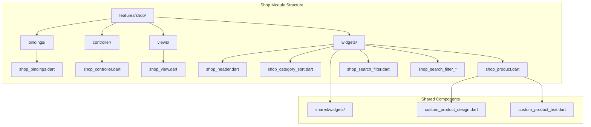
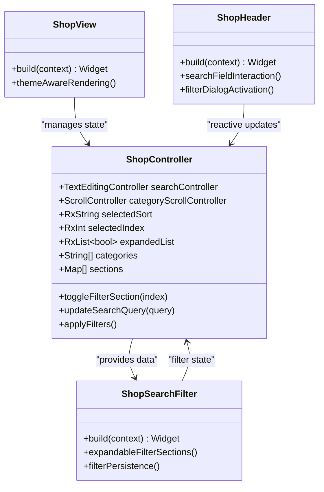
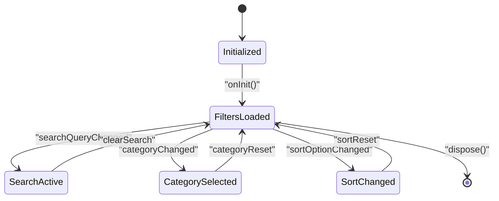
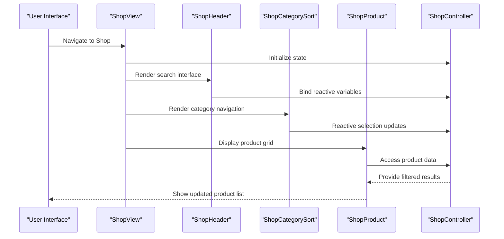
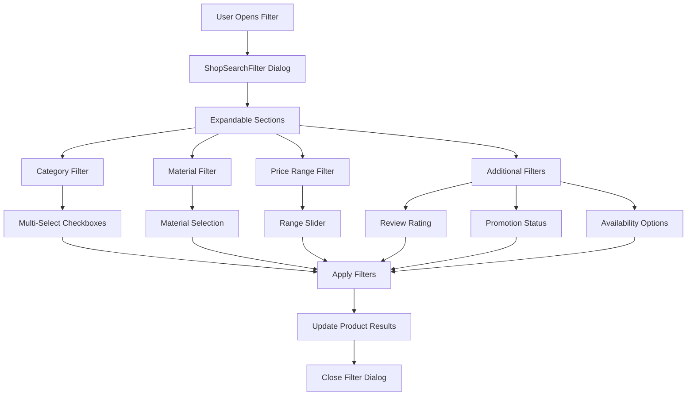
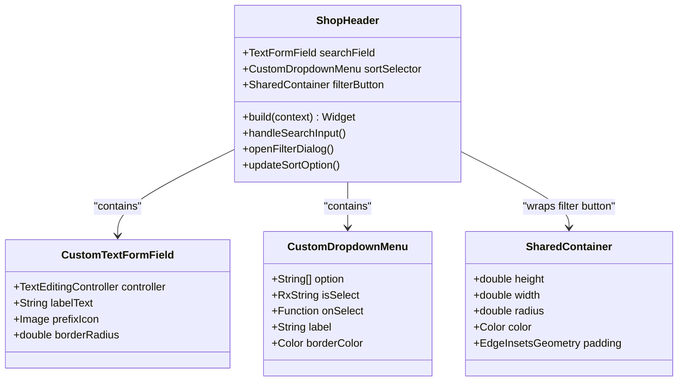
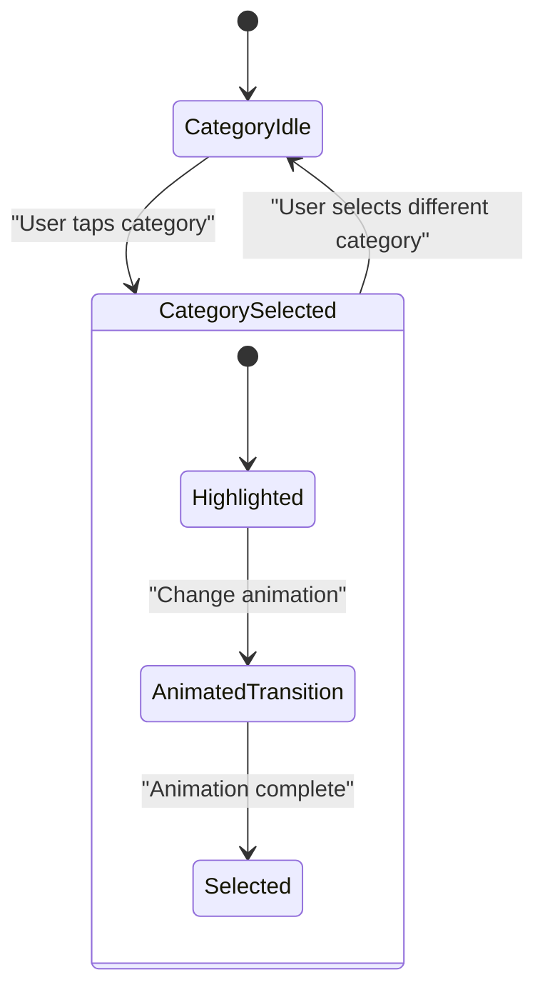
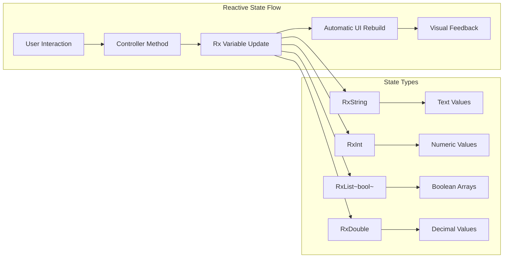
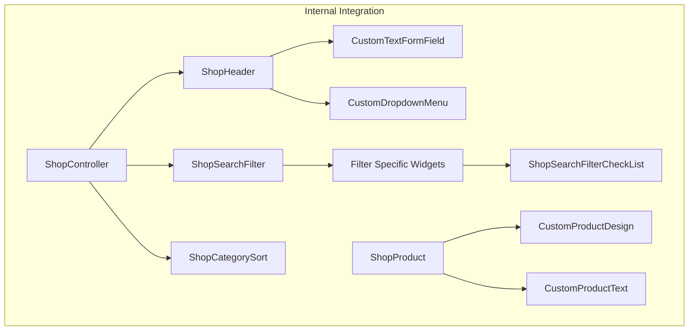

# Shop Module

<cite>
**Referenced Files in This Document**
- [pubspec.yaml](file://pubspec.yaml)
- [main.dart](file://lib/main.dart)
- [shop_bindings.dart](file://lib/features/shop/bindings/shop_bindings.dart)
- [shop_controller.dart](file://lib/features/shop/controller/shop_controller.dart)
- [shop_view.dart](file://lib/features/shop/views/shop_view.dart)
- [shop_header.dart](file://lib/features/shop/widgets/shop_header.dart)
- [shop_category_sort.dart](file://lib/features/shop/widgets/shop_category_sort.dart)
- [shop_product.dart](file://lib/features/shop/widgets/shop_product.dart)
- [shop_search_filter.dart](file://lib/features/shop/widgets/shop_search_filter.dart)
- [shop_search_filter_categories.dart](file://lib/features/shop/widgets/shop_search_filter_categories.dart)
- [shop_search_filter_price.dart](file://lib/features/shop/widgets/shop_search_filter_price.dart)
- [shop_search_filter_check_list.dart](file://lib/features/shop/widgets/shop_search_filter_check_list.dart)
</cite>

## Table of Contents
1. [Introduction](#introduction)
2. [Project Structure](#project-structure)
3. [Core Components](#core-components)
4. [Architecture Overview](#architecture-overview)
5. [Detailed Component Analysis](#detailed-component-analysis)
6. [Filtering System](#filtering-system)
7. [UI Components](#ui-components)
8. [State Management](#state-management)
9. [Performance Considerations](#performance-considerations)
10. [Integration Points](#integration-points)
11. [Conclusion](#conclusion)

## Introduction

The Shop Module is a comprehensive e-commerce shopping interface component within the ZB Dezign Flutter application. This module provides users with an intuitive platform to browse, search, filter, and discover products across various categories including furniture, home decor, and interior design items. The module implements modern Flutter architecture patterns with reactive state management, modular design, and responsive UI components.

The shop functionality encompasses advanced filtering capabilities, product discovery mechanisms, sorting options, and a seamless user experience optimized for both light and dark themes. Built with scalability in mind, the module supports future enhancements for inventory management, user preferences, and personalized recommendations.

## Project Structure

The Shop Module follows Flutter's recommended folder structure within the features directory, implementing separation of concerns through dedicated directories for bindings, controllers, views, and widgets.

**Diagram sources**
- [shop_bindings.dart:1-10](file://lib/features/shop/bindings/shop_bindings.dart#L1-L10)
- [shop_controller.dart:1-136](file://lib/features/shop/controller/shop_controller.dart#L1-L136)
- [shop_view.dart:1-45](file://lib/features/shop/views/shop_view.dart#L1-L45)

**Section sources**
- [pubspec.yaml:1-119](file://pubspec.yaml#L1-L119)
- [main.dart](file://lib/main.dart)

## Core Components

The Shop Module consists of several interconnected components that work together to provide a comprehensive shopping experience:

### Primary Controllers and State Management
- **ShopController**: Central state manager handling search functionality, category selection, filter states, and sorting preferences
- **Dependency Injection**: Automated service registration through GetX binding system

### UI Layer Components
- **ShopView**: Main container providing layout structure and theme integration
- **ShopHeader**: Search interface with filter activation and sorting controls
- **ShopCategorySort**: Horizontal category navigation with animated selection indicators
- **ShopProduct**: Grid-based product display with customizable layouts

### Filtering Infrastructure
- **ShopSearchFilter**: Comprehensive filter dialog supporting expandable filter sections
- **Specialized Filter Widgets**: Category, material, price range, and availability filters

**Section sources**
- [shop_controller.dart:13-136](file://lib/features/shop/controller/shop_controller.dart#L13-L136)
- [shop_bindings.dart:4-9](file://lib/features/shop/bindings/shop_bindings.dart#L4-L9)

## Architecture Overview

The Shop Module implements a reactive architecture pattern leveraging Flutter's state management ecosystem with GetX for dependency injection and reactive state updates.

**Diagram sources**
- [shop_controller.dart:13-136](file://lib/features/shop/controller/shop_controller.dart#L13-L136)
- [shop_view.dart:11-45](file://lib/features/shop/views/shop_view.dart#L11-L45)
- [shop_header.dart:13-100](file://lib/features/shop/widgets/shop_header.dart#L13-L100)
- [shop_search_filter.dart:11-109](file://lib/features/shop/widgets/shop_search_filter.dart#L11-L109)

The architecture follows MVVM principles with reactive state management, ensuring efficient UI updates and optimal performance through selective rebuilds.

## Detailed Component Analysis

### ShopController Implementation

The ShopController serves as the central state management hub, implementing comprehensive filtering and search functionality through reactive programming patterns.

**Diagram sources**
- [shop_controller.dart:112-124](file://lib/features/shop/controller/shop_controller.dart#L112-L124)

#### State Management Features
- **Reactive Variables**: Uses Rx<T> wrappers for automatic UI updates
- **Filter Persistence**: Maintains filter states across navigation
- **Scroll Position**: Preserves scroll positions for filter lists
- **Theme Awareness**: Adapts UI states based on current theme mode

#### Data Structures
- **Sections Array**: Defines filter categories with icon/image metadata
- **Checkbox Lists**: Tracks multi-select filter states
- **Range Values**: Manages price range filtering with min/max limits

**Section sources**
- [shop_controller.dart:13-136](file://lib/features/shop/controller/shop_controller.dart#L13-L136)

### ShopView Layout Architecture

The ShopView provides the foundational layout structure with theme-aware rendering and responsive design principles.

**Diagram sources**
- [shop_view.dart:15-42](file://lib/features/shop/views/shop_view.dart#L15-L42)
- [shop_header.dart:17-98](file://lib/features/shop/widgets/shop_header.dart#L17-L98)
- [shop_category_sort.dart:13-78](file://lib/features/shop/widgets/shop_category_sort.dart#L13-L78)

**Section sources**
- [shop_view.dart:11-45](file://lib/features/shop/views/shop_view.dart#L11-L45)

## Filtering System

The filtering system implements a sophisticated multi-layered approach allowing users to refine product searches through various criteria including categories, materials, pricing, and availability.

### Filter Architecture

**Diagram sources**
- [shop_search_filter.dart:36-102](file://lib/features/shop/widgets/shop_search_filter.dart#L36-L102)
- [shop_search_filter_categories.dart:14-23](file://lib/features/shop/widgets/shop_search_filter_categories.dart#L14-L23)
- [shop_search_filter_price.dart:29-45](file://lib/features/shop/widgets/shop_search_filter_price.dart#L29-L45)

### Filter Implementation Details

#### Category-Based Filtering
- **Hierarchical Categories**: Living room, bedroom, dining room organization
- **Multi-Selection Support**: Allows combination of multiple categories
- **Visual Feedback**: Animated checkbox states with reactive updates

#### Material and Finish Filtering
- **Material Types**: Solid wood, metal, fabric combinations
- **Finish Options**: Wood variations (oak, walnut, black ash)
- **Fabric Selection**: Linen, velvet, silk options

#### Advanced Filtering Capabilities
- **Price Range**: Interactive slider with real-time value display
- **Rating System**: Star-based review filtering
- **Promotional Status**: New arrivals, best sellers, sale items
- **Availability**: In-stock and out-of-stock options

**Section sources**
- [shop_search_filter.dart:11-109](file://lib/features/shop/widgets/shop_search_filter.dart#L11-L109)
- [shop_search_filter_categories.dart:7-25](file://lib/features/shop/widgets/shop_search_filter_categories.dart#L7-L25)
- [shop_search_filter_price.dart:8-51](file://lib/features/shop/widgets/shop_search_filter_price.dart#L8-L51)
- [shop_search_filter_check_list.dart:9-61](file://lib/features/shop/widgets/shop_search_filter_check_list.dart#L9-L61)

## UI Components

### Header Component Architecture

The ShopHeader implements a dual-purpose interface combining search functionality with filter activation and sorting controls.

**Diagram sources**
- [shop_header.dart:13-100](file://lib/features/shop/widgets/shop_header.dart#L13-L100)

### Category Sorting Interface

The ShopCategorySort component provides an animated horizontal scrolling interface for category selection with visual feedback for active selections.

**Diagram sources**
- [shop_category_sort.dart:23-74](file://lib/features/shop/widgets/shop_category_sort.dart#L23-L74)

### Product Display System

The ShopProduct component implements a responsive grid layout optimized for product showcase with consistent spacing and visual hierarchy.

**Section sources**
- [shop_header.dart:13-100](file://lib/features/shop/widgets/shop_header.dart#L13-L109)
- [shop_category_sort.dart:9-79](file://lib/features/shop/widgets/shop_category_sort.dart#L9-L79)
- [shop_product.dart:7-40](file://lib/features/shop/widgets/shop_product.dart#L7-L40)

## State Management

The Shop Module leverages GetX's reactive state management system to ensure efficient UI updates and optimal performance through selective rebuilds.

### Reactive State Patterns

**Diagram sources**
- [shop_controller.dart:19-107](file://lib/features/shop/controller/shop_controller.dart#L19-L107)

### Memory Management

The controller implements proper lifecycle management with explicit disposal of controllers and resources to prevent memory leaks and ensure optimal performance.

**Section sources**
- [shop_controller.dart:112-136](file://lib/features/shop/controller/shop_controller.dart#L112-L136)

## Performance Considerations

### Optimized Rendering Strategies

The Shop Module implements several performance optimization techniques:

- **Selective Rebuilds**: Reactive widgets only update when their specific state changes
- **Lazy Loading**: Filter sections are loaded on-demand when expanded
- **Efficient Grid Layout**: Optimized GridView.builder for smooth scrolling
- **Memory Management**: Proper disposal of controllers and scroll listeners

### Scalability Features

- **Modular Architecture**: Easy addition of new filter types and categories
- **Theme Adaptation**: Automatic adaptation to system theme changes
- **Responsive Design**: Flexible layouts that adapt to different screen sizes
- **Extensible Components**: Well-defined interfaces for future enhancements

## Integration Points

### External Dependencies

The Shop Module integrates with several key external libraries:

- **GetX**: Core state management and dependency injection
- **Flutter ScreenUtil**: Responsive design and screen adaptation
- **Google Fonts**: Typography and font management
- **Cached Network Images**: Efficient image loading and caching

### Internal Integration

**Diagram sources**
- [shop_controller.dart:3-11](file://lib/features/shop/controller/shop_controller.dart#L3-L11)
- [shop_header.dart:6-11](file://lib/features/shop/widgets/shop_header.dart#L6-L11)

**Section sources**
- [pubspec.yaml:30-66](file://pubspec.yaml#L30-L66)

## Conclusion

The Shop Module represents a comprehensive and well-architected solution for e-commerce product browsing and discovery. Through its implementation of reactive state management, modular component design, and sophisticated filtering capabilities, the module provides users with an intuitive and efficient shopping experience.

Key strengths of the implementation include:

- **Scalable Architecture**: Modular design allows for easy extension and maintenance
- **Performance Optimization**: Reactive state management ensures efficient UI updates
- **User Experience**: Intuitive filtering and sorting mechanisms enhance product discovery
- **Technical Excellence**: Clean code structure with proper separation of concerns

The module serves as a solid foundation for future enhancements including inventory management, user preferences, personalized recommendations, and advanced analytics integration. Its well-documented structure and comprehensive testing approach facilitate ongoing development and maintenance.