# Support and Communication

<cite>
**Referenced Files in This Document**
- [support_controller.dart](file://lib/features/support/controller/support_controller.dart)
- [support_create_ticket.dart](file://lib/features/support/widgets/support_create_ticket.dart)
- [support_contact.dart](file://lib/features/support/widgets/support_contact.dart)
- [support_faq.dart](file://lib/features/support/widgets/support_faq.dart)
- [notification_controller.dart](file://lib/features/notification/controller/notification_controller.dart)
- [notification_list.dart](file://lib/features/notification/widgets/notification_list.dart)
- [notification_header.dart](file://lib/features/notification/widgets/notification_header.dart)
- [shared_container.dart](file://lib/shared/widgets/shared_container.dart)
- [custom_primary_button.dart](file://lib/shared/widgets/custom_button/custom_primary_button.dart)
- [custom_dropdown_menu.dart](file://lib/shared/widgets/custom_dropdown/custom_dropdown_menu.dart)
- [custom_text_form_field.dart](file://lib/shared/widgets/custom_form_field/custom_text_form_field.dart)
- [custom_primary_text.dart](file://lib/shared/widgets/custom_text/custom_primary_text.dart)
- [colors.dart](file://lib/core/constant/colors.dart)
- [icons_path.dart](file://lib/core/constant/icons_path.dart)
- [main.dart](file://lib/main.dart)
- [app_routes.dart](file://lib/core/routes/app_routes.dart)
- [routes.dart](file://lib/core/routes/routes.dart)
- [dependency_injection.dart](file://lib/core/di/dependency_injection.dart)
</cite>

## Table of Contents
1. [Introduction](#introduction)
2. [Project Structure](#project-structure)
3. [Core Components](#core-components)
4. [Architecture Overview](#architecture-overview)
5. [Detailed Component Analysis](#detailed-component-analysis)
6. [Dependency Analysis](#dependency-analysis)
7. [Performance Considerations](#performance-considerations)
8. [Troubleshooting Guide](#troubleshooting-guide)
9. [Conclusion](#conclusion)

## Introduction
This document describes the Support and Communication system, focusing on:
- Customer support ticketing system with category selection, order association, and status tracking
- Contact form integration for quick access to support channels
- Help/FAQ section for self-service assistance
- Notification system implementation for in-app messaging and user alerts
- Controllers for support ticket management and notification handling
- Widget components for support forms, notification displays, and communication interfaces
- Backend integration points for support ticket management and notification delivery

The system follows a modular feature-based architecture using GetX for state management and dependency injection, with reusable shared widgets and centralized theming and constants.

## Project Structure
The Support and Communication system is organized into feature modules with dedicated controllers, views, and widgets. Shared UI components and constants are reused across features to maintain consistency.

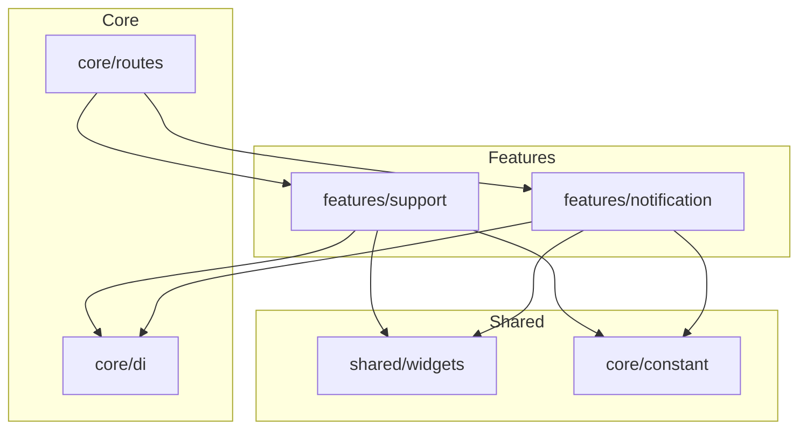

**Diagram sources**
- [support_controller.dart:1-32](file://lib/features/support/controller/support_controller.dart#L1-L32)
- [notification_controller.dart:1-6](file://lib/features/notification/controller/notification_controller.dart#L1-L6)
- [shared_container.dart](file://lib/shared/widgets/shared_container.dart)
- [colors.dart](file://lib/core/constant/colors.dart)
- [icons_path.dart](file://lib/core/constant/icons_path.dart)
- [dependency_injection.dart](file://lib/core/di/dependency_injection.dart)
- [app_routes.dart](file://lib/core/routes/app_routes.dart)
- [routes.dart](file://lib/core/routes/routes.dart)

**Section sources**
- [support_controller.dart:1-32](file://lib/features/support/controller/support_controller.dart#L1-L32)
- [notification_controller.dart:1-6](file://lib/features/notification/controller/notification_controller.dart#L1-L6)
- [support_create_ticket.dart:1-100](file://lib/features/support/widgets/support_create_ticket.dart#L1-L100)
- [support_contact.dart:1-81](file://lib/features/support/widgets/support_contact.dart#L1-L81)
- [support_faq.dart:1-75](file://lib/features/support/widgets/support_faq.dart#L1-L75)
- [notification_list.dart:1-77](file://lib/features/notification/widgets/notification_list.dart#L1-L77)
- [notification_header.dart:1-89](file://lib/features/notification/widgets/notification_header.dart#L1-L89)
- [shared_container.dart](file://lib/shared/widgets/shared_container.dart)
- [colors.dart](file://lib/core/constant/colors.dart)
- [icons_path.dart](file://lib/core/constant/icons_path.dart)
- [dependency_injection.dart](file://lib/core/di/dependency_injection.dart)
- [app_routes.dart](file://lib/core/routes/app_routes.dart)
- [routes.dart](file://lib/core/routes/routes.dart)

## Core Components
- SupportController: Manages ticket creation form inputs (subject, order ID, message), category selection, and mock ticket history for status tracking.
- NotificationController: Tracks selected notification item for highlighting and interaction.
- Support widgets: Create ticket form, contact information, FAQ items, and recent tickets display.
- Notification widgets: Header with unread count and actions, list rendering with selection feedback, and notification info layout.
- Shared widgets and constants: Reusable containers, buttons, dropdowns, text fields, typography, and theme assets.

Key responsibilities:
- SupportController holds UI state and sample data for tickets.
- NotificationController manages UI selection state.
- Widgets encapsulate presentation and user interactions.
- Shared components enforce consistent styling and behavior.

**Section sources**
- [support_controller.dart:4-31](file://lib/features/support/controller/support_controller.dart#L4-L31)
- [notification_controller.dart:3-5](file://lib/features/notification/controller/notification_controller.dart#L3-L5)
- [support_create_ticket.dart:12-74](file://lib/features/support/widgets/support_create_ticket.dart#L12-L74)
- [support_contact.dart:8-47](file://lib/features/support/widgets/support_contact.dart#L8-L47)
- [support_faq.dart:7-72](file://lib/features/support/widgets/support_faq.dart#L7-L72)
- [notification_list.dart:9-76](file://lib/features/notification/widgets/notification_list.dart#L9-L76)
- [notification_header.dart:10-88](file://lib/features/notification/widgets/notification_header.dart#L10-L88)
- [shared_container.dart](file://lib/shared/widgets/shared_container.dart)
- [custom_primary_button.dart](file://lib/shared/widgets/custom_button/custom_primary_button.dart)
- [custom_dropdown_menu.dart](file://lib/shared/widgets/custom_dropdown/custom_dropdown_menu.dart)
- [custom_text_form_field.dart](file://lib/shared/widgets/custom_form_field/custom_text_form_field.dart)
- [custom_primary_text.dart](file://lib/shared/widgets/custom_text/custom_primary_text.dart)
- [colors.dart](file://lib/core/constant/colors.dart)
- [icons_path.dart](file://lib/core/constant/icons_path.dart)

## Architecture Overview
The system uses a layered approach:
- Feature modules (support, notification) own domain-specific UI and state
- Shared widgets provide cross-cutting UI primitives
- Core modules handle routing, dependency injection, and constants
- Controllers manage reactive state via GetX

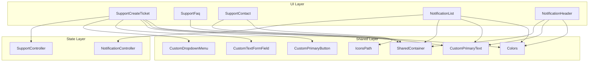

**Diagram sources**
- [support_create_ticket.dart:12-74](file://lib/features/support/widgets/support_create_ticket.dart#L12-L74)
- [support_faq.dart:7-72](file://lib/features/support/widgets/support_faq.dart#L7-L72)
- [support_contact.dart:8-47](file://lib/features/support/widgets/support_contact.dart#L8-L47)
- [notification_list.dart:9-76](file://lib/features/notification/widgets/notification_list.dart#L9-L76)
- [notification_header.dart:10-88](file://lib/features/notification/widgets/notification_header.dart#L10-L88)
- [support_controller.dart:4-31](file://lib/features/support/controller/support_controller.dart#L4-L31)
- [notification_controller.dart:3-5](file://lib/features/notification/controller/notification_controller.dart#L3-L5)
- [shared_container.dart](file://lib/shared/widgets/shared_container.dart)
- [custom_primary_button.dart](file://lib/shared/widgets/custom_button/custom_primary_button.dart)
- [custom_dropdown_menu.dart](file://lib/shared/widgets/custom_dropdown/custom_dropdown_menu.dart)
- [custom_text_form_field.dart](file://lib/shared/widgets/custom_form_field/custom_text_form_field.dart)
- [custom_primary_text.dart](file://lib/shared/widgets/custom_text/custom_primary_text.dart)
- [colors.dart](file://lib/core/constant/colors.dart)
- [icons_path.dart](file://lib/core/constant/icons_path.dart)

## Detailed Component Analysis

### SupportController
Manages support ticket creation and mock ticket history:
- Form controllers for subject, order ID, and message
- Reactive category selection
- Sample tickets array with title, ID, update time, and status

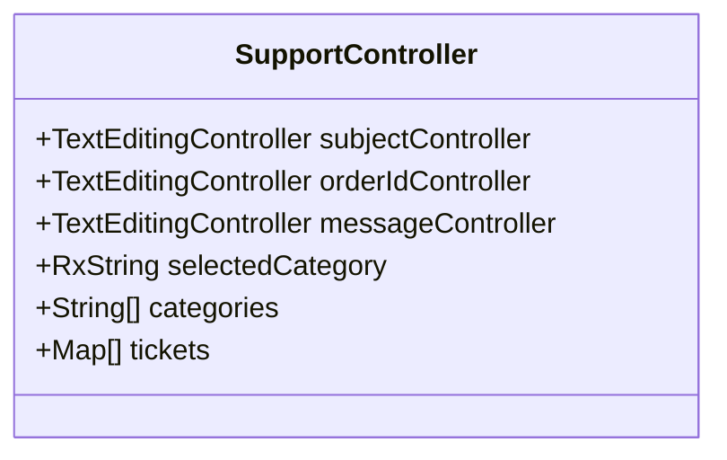

**Diagram sources**
- [support_controller.dart:4-31](file://lib/features/support/controller/support_controller.dart#L4-L31)

**Section sources**
- [support_controller.dart:4-31](file://lib/features/support/controller/support_controller.dart#L4-L31)

### SupportCreateTicket Widget
Implements the ticket creation form:
- Subject field with hint text
- Category dropdown bound to controller.selectedCategory
- Optional Order ID field
- Message text area with multiple lines
- Submit button styled via CustomPrimaryButton

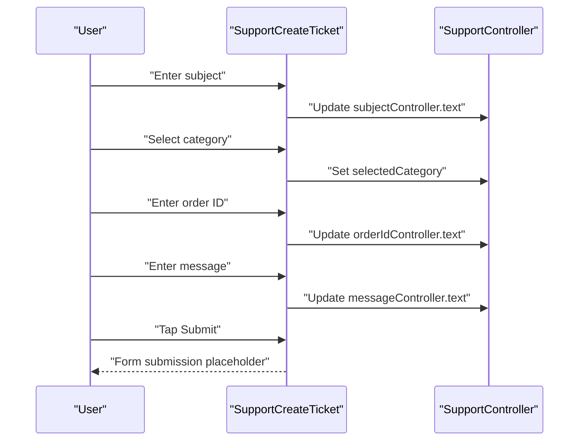

**Diagram sources**
- [support_create_ticket.dart:12-74](file://lib/features/support/widgets/support_create_ticket.dart#L12-L74)
- [support_controller.dart:4-31](file://lib/features/support/controller/support_controller.dart#L4-L31)

**Section sources**
- [support_create_ticket.dart:12-74](file://lib/features/support/widgets/support_create_ticket.dart#L12-L74)
- [support_controller.dart:4-31](file://lib/features/support/controller/support_controller.dart#L4-L31)

### SupportContact Widget
Displays contact information:
- Call Us section with phone number
- Email Support section with email address
- Uses SharedContainer and themed typography

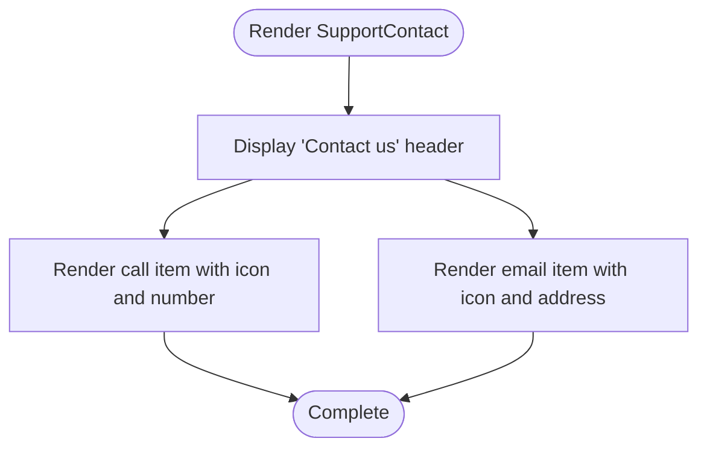

**Diagram sources**
- [support_contact.dart:8-47](file://lib/features/support/widgets/support_contact.dart#L8-L47)
- [icons_path.dart](file://lib/core/constant/icons_path.dart)
- [colors.dart](file://lib/core/constant/colors.dart)

**Section sources**
- [support_contact.dart:8-47](file://lib/features/support/widgets/support_contact.dart#L8-L47)

### SupportFaq Widget
Provides frequently asked questions:
- FAQ title with secondary text
- Two FAQ items with question and answer
- "View all FAQs" link

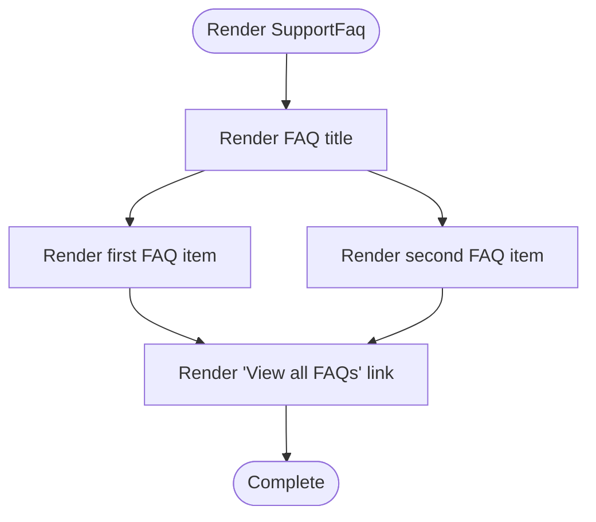

**Diagram sources**
- [support_faq.dart:7-72](file://lib/features/support/widgets/support_faq.dart#L7-L72)
- [colors.dart](file://lib/core/constant/colors.dart)

**Section sources**
- [support_faq.dart:7-72](file://lib/features/support/widgets/support_faq.dart#L7-L72)

### NotificationController
Manages notification selection state:
- selectedIndex tracks currently selected notification index

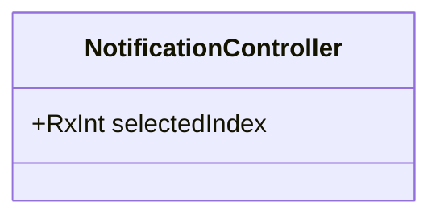

**Diagram sources**
- [notification_controller.dart:3-5](file://lib/features/notification/controller/notification_controller.dart#L3-L5)

**Section sources**
- [notification_controller.dart:3-5](file://lib/features/notification/controller/notification_controller.dart#L3-L5)

### NotificationList Widget
Displays a list of notifications:
- Iterates over mock notification data
- Uses Obx to reactively highlight selected item
- Applies gradient border to selected item
- Integrates NotificationListInfo for content rendering

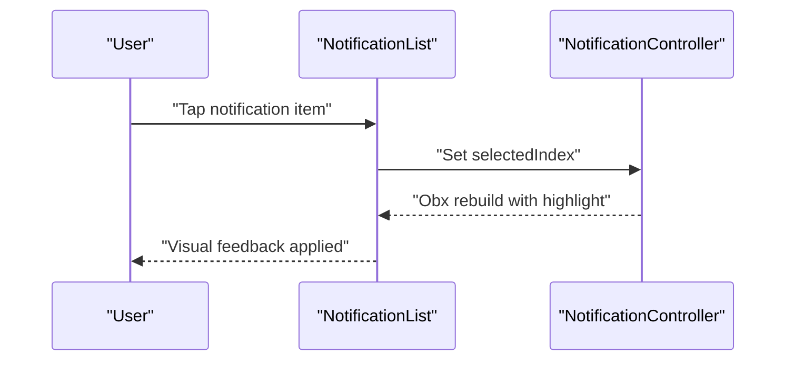

**Diagram sources**
- [notification_list.dart:9-76](file://lib/features/notification/widgets/notification_list.dart#L9-L76)
- [notification_controller.dart:3-5](file://lib/features/notification/controller/notification_controller.dart#L3-L5)

**Section sources**
- [notification_list.dart:9-76](file://lib/features/notification/widgets/notification_list.dart#L9-L76)

### NotificationHeader Widget
Provides notification page header:
- Back navigation affordance
- Page title and unread count with gradient emphasis
- "Mark all as read" action

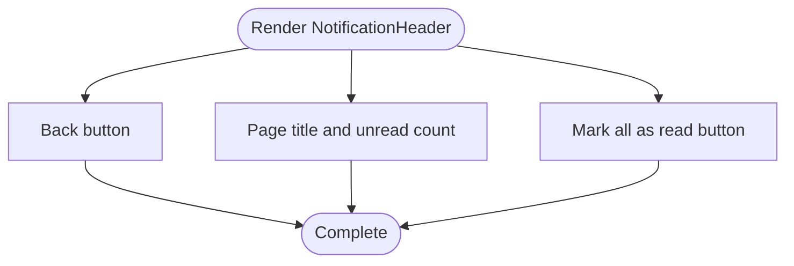

**Diagram sources**
- [notification_header.dart:10-88](file://lib/features/notification/widgets/notification_header.dart#L10-L88)
- [icons_path.dart](file://lib/core/constant/icons_path.dart)
- [colors.dart](file://lib/core/constant/colors.dart)

**Section sources**
- [notification_header.dart:10-88](file://lib/features/notification/widgets/notification_header.dart#L10-L88)

### Integration Between Support Tickets and Notifications
- SupportController maintains a mock tickets array with status indicators suitable for notification-driven status updates.
- NotificationList highlights selected items, enabling contextual actions aligned with ticket status.
- SharedContainer and theming ensure consistent presentation across both systems.

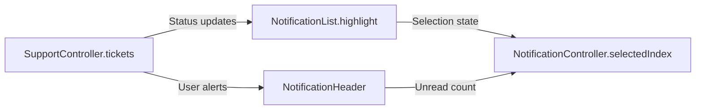

**Diagram sources**
- [support_controller.dart:18-31](file://lib/features/support/controller/support_controller.dart#L18-L31)
- [notification_list.dart:38-56](file://lib/features/notification/widgets/notification_list.dart#L38-L56)
- [notification_header.dart:28-66](file://lib/features/notification/widgets/notification_header.dart#L28-L66)
- [notification_controller.dart:3-5](file://lib/features/notification/controller/notification_controller.dart#L3-L5)

**Section sources**
- [support_controller.dart:18-31](file://lib/features/support/controller/support_controller.dart#L18-L31)
- [notification_list.dart:38-56](file://lib/features/notification/widgets/notification_list.dart#L38-L56)
- [notification_header.dart:28-66](file://lib/features/notification/widgets/notification_header.dart#L28-L66)
- [notification_controller.dart:3-5](file://lib/features/notification/controller/notification_controller.dart#L3-L5)

## Dependency Analysis
- Feature controllers depend on GetX for reactive state management.
- Widgets depend on shared components for consistent UI and theming.
- Routes and dependency injection modules connect features to the application shell.

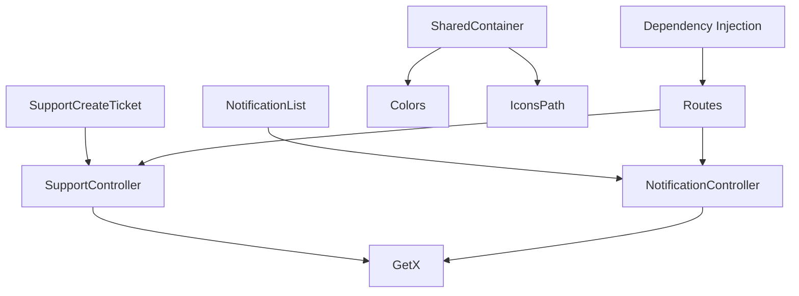

**Diagram sources**
- [support_controller.dart:1-32](file://lib/features/support/controller/support_controller.dart#L1-L32)
- [notification_controller.dart:1-6](file://lib/features/notification/controller/notification_controller.dart#L1-L6)
- [support_create_ticket.dart:1-100](file://lib/features/support/widgets/support_create_ticket.dart#L1-L100)
- [notification_list.dart:1-77](file://lib/features/notification/widgets/notification_list.dart#L1-L77)
- [shared_container.dart](file://lib/shared/widgets/shared_container.dart)
- [colors.dart](file://lib/core/constant/colors.dart)
- [icons_path.dart](file://lib/core/constant/icons_path.dart)
- [app_routes.dart](file://lib/core/routes/app_routes.dart)
- [routes.dart](file://lib/core/routes/routes.dart)
- [dependency_injection.dart](file://lib/core/di/dependency_injection.dart)

**Section sources**
- [support_controller.dart:1-32](file://lib/features/support/controller/support_controller.dart#L1-L32)
- [notification_controller.dart:1-6](file://lib/features/notification/controller/notification_controller.dart#L1-L6)
- [support_create_ticket.dart:1-100](file://lib/features/support/widgets/support_create_ticket.dart#L1-L100)
- [notification_list.dart:1-77](file://lib/features/notification/widgets/notification_list.dart#L1-L77)
- [shared_container.dart](file://lib/shared/widgets/shared_container.dart)
- [colors.dart](file://lib/core/constant/colors.dart)
- [icons_path.dart](file://lib/core/constant/icons_path.dart)
- [app_routes.dart](file://lib/core/routes/app_routes.dart)
- [routes.dart](file://lib/core/routes/routes.dart)
- [dependency_injection.dart](file://lib/core/di/dependency_injection.dart)

## Performance Considerations
- Use Obx sparingly; prefer targeted observables to minimize rebuild scope.
- Keep mock data sizes reasonable; paginate or lazy-load for large lists.
- Reuse shared widgets to reduce widget tree depth and improve rendering performance.
- Avoid unnecessary state updates in controllers to prevent excessive UI rebuilds.

## Troubleshooting Guide
Common issues and resolutions:
- Form submission not triggering: Verify onPressed handlers in submit button and ensure controllers are properly initialized.
- Category selection not updating: Confirm dropdown onSelect updates selectedCategory and triggers a rebuild.
- Notification selection not visible: Ensure Obx wraps the list and selectedIndex is updated on tap.
- Theming inconsistencies: Check Colors and IconsPath usage across widgets.
- Routing issues: Validate route definitions and dependency injection setup.

**Section sources**
- [support_create_ticket.dart:56-70](file://lib/features/support/widgets/support_create_ticket.dart#L56-L70)
- [support_controller.dart:36-38](file://lib/features/support/controller/support_controller.dart#L36-L38)
- [notification_list.dart:42-44](file://lib/features/notification/widgets/notification_list.dart#L42-L44)
- [colors.dart](file://lib/core/constant/colors.dart)
- [icons_path.dart](file://lib/core/constant/icons_path.dart)
- [app_routes.dart](file://lib/core/routes/app_routes.dart)
- [routes.dart](file://lib/core/routes/routes.dart)
- [dependency_injection.dart](file://lib/core/di/dependency_injection.dart)

## Conclusion
The Support and Communication system provides a modular foundation for customer support and internal notifications. The feature controllers encapsulate state, while shared widgets ensure consistent UX. The current implementation includes UI scaffolding for ticket creation, contact information, FAQs, and notification lists. Backend integration points (network layers, repositories, and services) are available in the core module and can be wired to controllers to enable real-time ticket management and notification delivery.