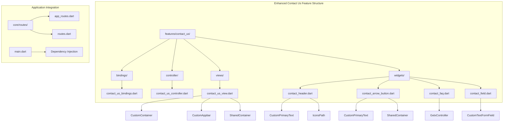
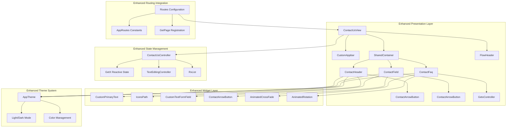
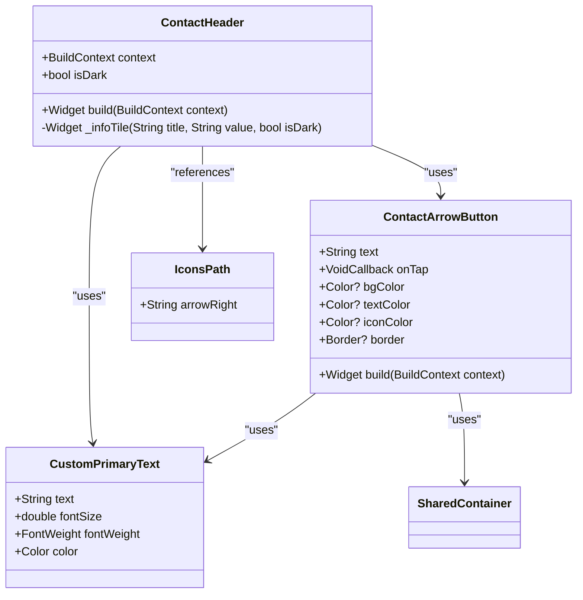
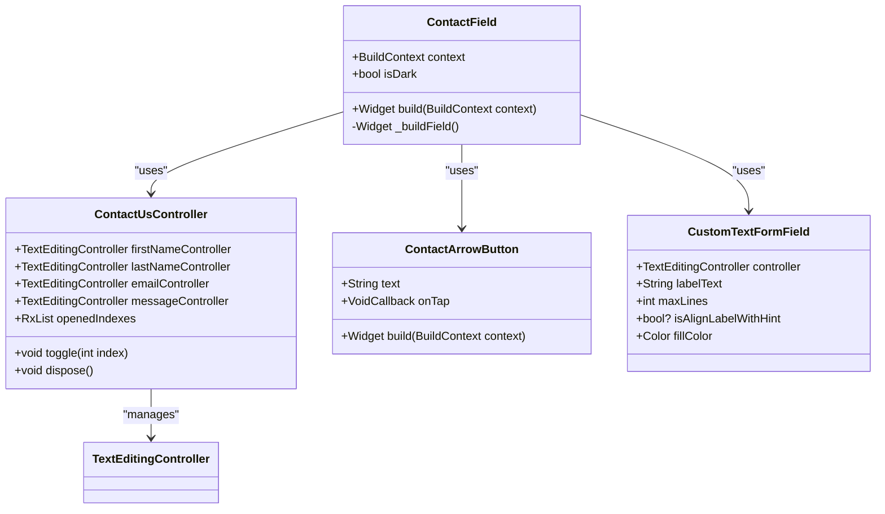
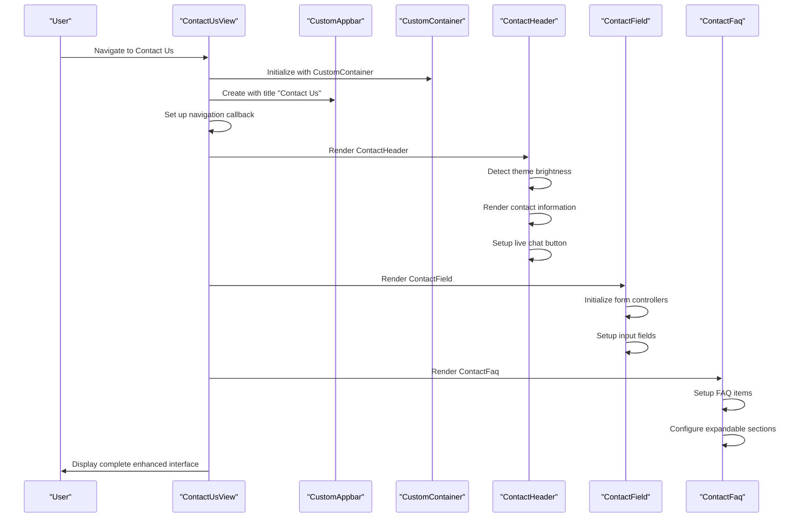
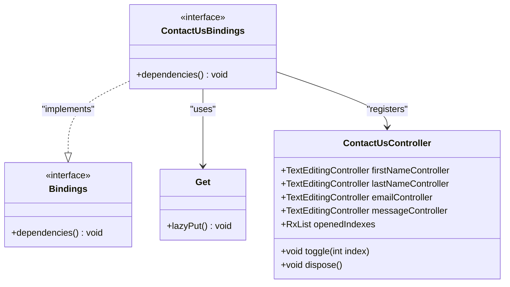
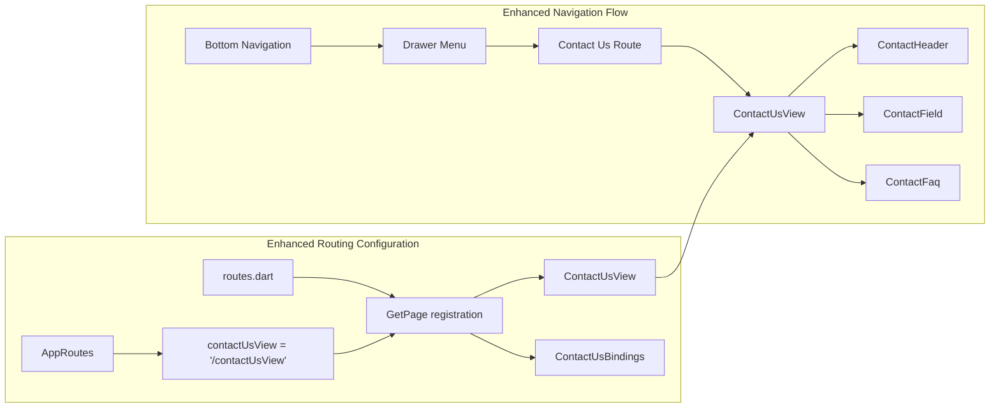
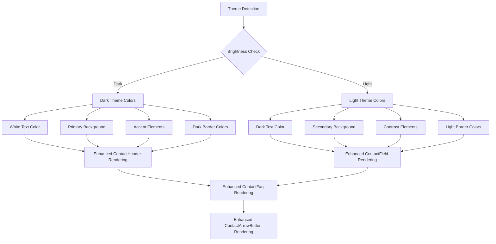
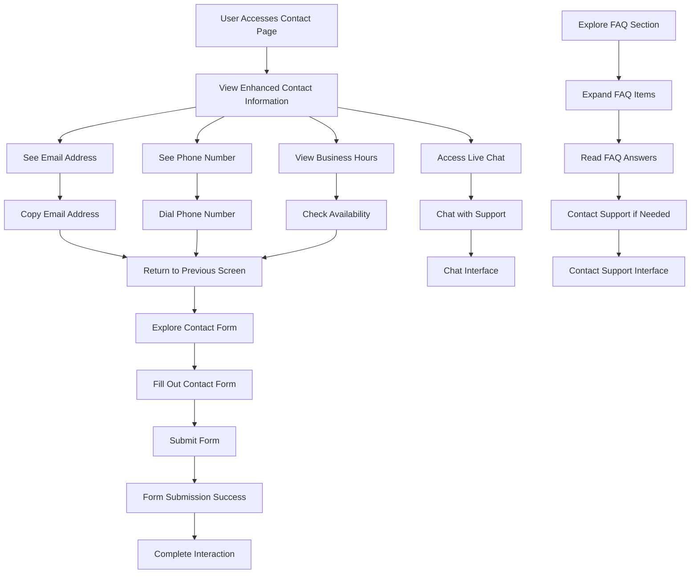
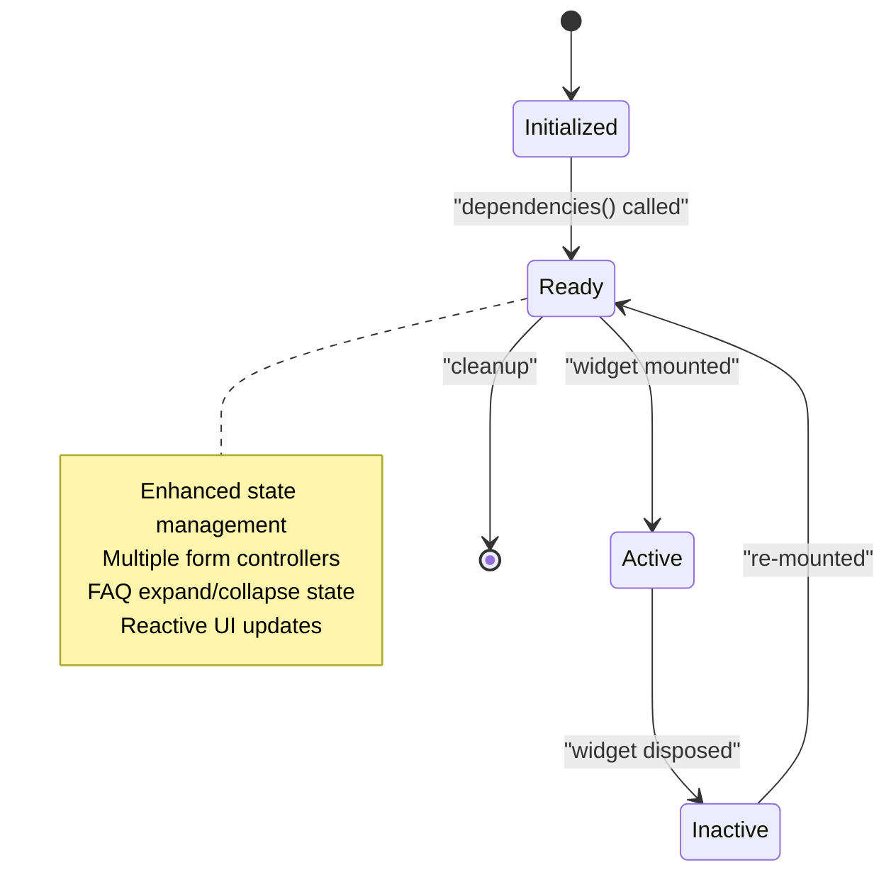

# Contact Us Feature

<cite>
**Referenced Files in This Document**
- [main.dart](file://lib/main.dart)
- [app_routes.dart](file://lib/core/routes/app_routes.dart)
- [routes.dart](file://lib/core/routes/routes.dart)
- [contact_us_bindings.dart](file://lib/features/contact_us/bindings/contact_us_bindings.dart)
- [contact_us_controller.dart](file://lib/features/contact_us/controller/contact_us_controller.dart)
- [contact_us_view.dart](file://lib/features/contact_us/views/contact_us_view.dart)
- [contact_header.dart](file://lib/features/contact_us/widgets/contact_header.dart)
- [contact_arrow_button.dart](file://lib/features/contact_us/widgets/contact_arrow_button.dart)
- [contact_faq.dart](file://lib/features/contact_us/widgets/contact_faq.dart)
- [contact_field.dart](file://lib/features/contact_us/widgets/contact_field.dart)
</cite>

## Update Summary
**Changes Made**
- Added comprehensive FAQ system with expandable/collapsible sections
- Enhanced contact form with improved input fields and state management
- Introduced new UI components: contact_arrow_button.dart, contact_faq.dart, and contact_field.dart
- Updated ContactUsController with form field controllers and FAQ state management
- Enhanced ContactUsView with integrated FAQ and contact form sections

## Table of Contents
1. [Introduction](#introduction)
2. [Project Structure](#project-structure)
3. [Core Components](#core-components)
4. [Architecture Overview](#architecture-overview)
5. [Detailed Component Analysis](#detailed-component-analysis)
6. [Integration Points](#integration-points)
7. [User Experience Flow](#user-experience-flow)
8. [Technical Implementation](#technical-implementation)
9. [New Features and Components](#new-features-and-components)
10. [Future Enhancements](#future-enhancements)
11. [Conclusion](#conclusion)

## Introduction

The Contact Us feature is a comprehensive communication hub for the ZB DEZINE Flutter application that provides users with multiple channels for customer support, inquiries, and business communications. This feature has been significantly enhanced with a complete FAQ system, interactive contact form, and improved UI components that provide immediate value and support to users.

The implementation follows modern Flutter architecture patterns using the GetX framework for reactive state management, dependency injection, and efficient widget rebuilding. The feature now encompasses contact information display, live chat functionality, comprehensive FAQ system with expandable sections, and a fully functional contact form with form field controllers and state management.

## Project Structure

The Contact Us feature maintains a well-organized structure within the features directory, demonstrating clear separation of concerns with dedicated directories for bindings, controllers, views, and widgets. The enhanced structure now includes three new UI components that work together to deliver a comprehensive user experience.



**Diagram sources**
- [contact_us_bindings.dart:1-10](file://lib/features/contact_us/bindings/contact_us_bindings.dart#L1-L10)
- [contact_us_controller.dart:1-28](file://lib/features/contact_us/controller/contact_us_controller.dart#L1-L28)
- [contact_us_view.dart:1-71](file://lib/features/contact_us/views/contact_us_view.dart#L1-L71)
- [contact_header.dart:1-81](file://lib/features/contact_us/widgets/contact_header.dart#L1-L81)
- [contact_arrow_button.dart:1-63](file://lib/features/contact_us/widgets/contact_arrow_button.dart#L1-L63)
- [contact_faq.dart:1-146](file://lib/features/contact_us/widgets/contact_faq.dart#L1-L146)
- [contact_field.dart:1-107](file://lib/features/contact_us/widgets/contact_field.dart#L1-L107)

**Section sources**
- [contact_us_bindings.dart:1-10](file://lib/features/contact_us/bindings/contact_us_bindings.dart#L1-L10)
- [contact_us_controller.dart:1-28](file://lib/features/contact_us/controller/contact_us_controller.dart#L1-L28)
- [contact_us_view.dart:1-71](file://lib/features/contact_us/views/contact_us_view.dart#L1-L71)
- [contact_header.dart:1-81](file://lib/features/contact_us/widgets/contact_header.dart#L1-L81)
- [contact_arrow_button.dart:1-63](file://lib/features/contact_us/widgets/contact_arrow_button.dart#L1-L63)
- [contact_faq.dart:1-146](file://lib/features/contact_us/widgets/contact_faq.dart#L1-L146)
- [contact_field.dart:1-107](file://lib/features/contact_us/widgets/contact_field.dart#L1-L107)

## Core Components

The Contact Us feature now consists of six primary components that work together to deliver a comprehensive user experience:

### ContactUsBindings
The binding class implements the GetX Bindings interface, providing dependency injection configuration for the Contact Us feature. It registers the ContactUsController with Get.lazyPut for lazy initialization and efficient memory management.

### ContactUsController
Extends GetxController and serves as the central state management layer for the Contact Us feature. The controller now manages:
- Form field controllers for first name, last name, email, and message
- FAQ state management with expandable/collapsible sections
- Reactive state updates for UI components
- Proper resource cleanup through dispose method

### ContactUsView
The main view component that orchestrates the layout and presentation of contact information, contact form, and FAQ sections. It integrates with the application's theme system and utilizes custom widgets for consistent design.

### ContactHeader
A specialized widget responsible for rendering contact information, including email addresses, phone numbers, business hours, and live chat functionality. Now enhanced with improved styling and integration with new components.

### ContactArrowButton
A new reusable button component featuring an arrow icon and customizable styling. Supports both light and dark themes with automatic color adaptation and responsive design.

### ContactFaq
A comprehensive FAQ system with expandable/collapsible sections. Implements animated transitions, reactive state management, and dynamic content rendering with smooth user interactions.

### ContactField
An enhanced contact form component with multiple input fields, proper validation support, and integrated submit functionality. Features improved styling, responsive design, and seamless integration with the controller.

**Section sources**
- [contact_us_bindings.dart:1-10](file://lib/features/contact_us/bindings/contact_us_bindings.dart#L1-L10)
- [contact_us_controller.dart:1-28](file://lib/features/contact_us/controller/contact_us_controller.dart#L1-L28)
- [contact_us_view.dart:14-71](file://lib/features/contact_us/views/contact_us_view.dart#L14-L71)
- [contact_header.dart:7-81](file://lib/features/contact_us/widgets/contact_header.dart#L7-L81)
- [contact_arrow_button.dart:8-63](file://lib/features/contact_us/widgets/contact_arrow_button.dart#L8-L63)
- [contact_faq.dart:8-146](file://lib/features/contact_us/widgets/contact_faq.dart#L8-L146)
- [contact_field.dart:11-107](file://lib/features/contact_us/widgets/contact_field.dart#L11-L107)

## Architecture Overview

The Contact Us feature follows a layered architecture pattern that separates concerns and promotes maintainability. The architecture leverages Flutter's widget tree structure combined with GetX's reactive programming model and enhanced with new UI components.



**Diagram sources**
- [contact_us_view.dart:18-69](file://lib/features/contact_us/views/contact_us_view.dart#L18-L69)
- [contact_header.dart:11-52](file://lib/features/contact_us/widgets/contact_header.dart#L11-L52)
- [contact_field.dart:15-76](file://lib/features/contact_us/widgets/contact_field.dart#L15-L76)
- [contact_faq.dart:12-145](file://lib/features/contact_us/widgets/contact_faq.dart#L12-L145)
- [routes.dart:286-290](file://lib/core/routes/routes.dart#L286-L290)
- [app_routes.dart:44](file://lib/core/routes/app_routes.dart#L44)

The architecture demonstrates clear separation between presentation, state management, and integration concerns. The enhanced GetX framework provides reactive state management with improved performance through selective widget rebuilds and enhanced state synchronization.

**Section sources**
- [routes.dart:286-290](file://lib/core/routes/routes.dart#L286-L290)
- [app_routes.dart:44](file://lib/core/routes/app_routes.dart#L44)
- [contact_us_view.dart:18-69](file://lib/features/contact_us/views/contact_us_view.dart#L18-L69)

## Detailed Component Analysis

### Enhanced Contact Header Widget Analysis

The ContactHeader widget serves as the primary content renderer for the Contact Us feature, implementing a sophisticated layout system that adapts to different screen sizes and themes. The widget now integrates seamlessly with the new ContactArrowButton component.



**Diagram sources**
- [contact_header.dart:7-81](file://lib/features/contact_us/widgets/contact_header.dart#L7-L81)
- [contact_arrow_button.dart:8-63](file://lib/features/contact_us/widgets/contact_arrow_button.dart#L8-L63)

The widget implements dynamic theming through brightness detection, ensuring proper color contrast across light and dark themes. It utilizes a column-based layout system with consistent spacing using Flutter's ScreenUtil package for responsive design and integrates the new ContactArrowButton component for live chat functionality.

**Section sources**
- [contact_header.dart:7-81](file://lib/features/contact_us/widgets/contact_header.dart#L7-L81)
- [contact_arrow_button.dart:8-63](file://lib/features/contact_us/widgets/contact_arrow_button.dart#L8-L63)

### Comprehensive Contact Field Widget Analysis

The ContactField widget represents a significant enhancement to the Contact Us feature, providing a complete contact form with multiple input fields and state management integration.



**Diagram sources**
- [contact_field.dart:11-107](file://lib/features/contact_us/widgets/contact_field.dart#L11-L107)
- [contact_us_controller.dart:4-27](file://lib/features/contact_us/controller/contact_us_controller.dart#L4-27)

The widget implements a sophisticated form layout with proper spacing, validation support, and integration with the ContactUsController for state management. It features multiple input fields including first name, last name, email address, and message with appropriate styling and responsive design.

**Section sources**
- [contact_field.dart:11-107](file://lib/features/contact_us/widgets/contact_field.dart#L11-L107)
- [contact_us_controller.dart:4-27](file://lib/features/contact_us/controller/contact_us_controller.dart#L4-27)

### Advanced Contact FAQ Widget Analysis

The ContactFaq widget introduces a comprehensive FAQ system with expandable/collapsible sections, animated transitions, and reactive state management.

```mermaid
classDiagram
class ContactFaq {
+BuildContext context
+bool isDark
+Widget build(BuildContext context)
}
class ContactUsController {
+RxList<int> openedIndexes
+void toggle(int index)
}
class AnimatedCrossFade {
+Duration duration
+CrossFadeState crossFadeState
+Widget firstChild
+Widget secondChild
}
class AnimatedRotation {
+Duration duration
+double turns
+Widget child
}
ContactFaq --> ContactUsController : "uses"
ContactFaq --> AnimatedCrossFade : "uses"
ContactFaq --> AnimatedRotation : "uses"
ContactUsController --> RxList<int> : "manages"
```

**Diagram sources**
- [contact_faq.dart:8-146](file://lib/features/contact_us/widgets/contact_faq.dart#L8-L146)
- [contact_us_controller.dart:9](file://lib/features/contact_us/controller/contact_us_controller.dart#L9)

The widget implements a sophisticated FAQ system with smooth animations, proper state management, and dynamic content rendering. Each FAQ item features an expandable section with animated rotation of the dropdown arrow and fade-in/fade-out transitions for the answer content.

**Section sources**
- [contact_faq.dart:8-146](file://lib/features/contact_us/widgets/contact_faq.dart#L8-L146)
- [contact_us_controller.dart:9](file://lib/features/contact_us/controller/contact_us_controller.dart#L9)

### Enhanced View Component Architecture

The ContactUsView component demonstrates excellent separation of concerns by delegating specific UI responsibilities to specialized widgets while maintaining overall layout control and integrating all new components.



**Diagram sources**
- [contact_us_view.dart:18-69](file://lib/features/contact_us/views/contact_us_view.dart#L18-L69)
- [contact_header.dart:11-52](file://lib/features/contact_us/widgets/contact_header.dart#L11-L52)
- [contact_field.dart:15-76](file://lib/features/contact_us/widgets/contact_field.dart#L15-L76)
- [contact_faq.dart:12-145](file://lib/features/contact_us/widgets/contact_faq.dart#L12-L145)

The view component efficiently manages the enhanced widget tree hierarchy, ensuring optimal performance through strategic use of SizedBox widgets for spacing and proper widget composition. The integration of all new components creates a cohesive and comprehensive user experience.

**Section sources**
- [contact_us_view.dart:14-71](file://lib/features/contact_us/views/contact_us_view.dart#L14-L71)

### Enhanced Binding and Dependency Injection

The ContactUsBindings class implements the Bindings interface from GetX, providing dependency injection capabilities for the enhanced feature module with improved resource management.



**Diagram sources**
- [contact_us_bindings.dart:4-9](file://lib/features/contact_us/bindings/contact_us_bindings.dart#L4-L9)
- [contact_us_controller.dart:4-27](file://lib/features/contact_us/controller/contact_us_controller.dart#L4-27)

The binding configuration uses Get.lazyPut for deferred instantiation, optimizing memory usage and initialization performance. The enhanced controller now manages multiple form field controllers and FAQ state management through reactive programming.

**Section sources**
- [contact_us_bindings.dart:1-10](file://lib/features/contact_us/bindings/contact_us_bindings.dart#L1-L10)
- [contact_us_controller.dart:1-28](file://lib/features/contact_us/controller/contact_us_controller.dart#L1-L28)

## Integration Points

### Enhanced Routing Integration

The Contact Us feature is seamlessly integrated into the application's routing system through the AppRoutes constants and routes.dart configuration, now supporting the enhanced component structure.



**Diagram sources**
- [app_routes.dart:44](file://lib/core/routes/app_routes.dart#L44)
- [routes.dart:286-290](file://lib/core/routes/routes.dart#L286-L290)

The routing system ensures consistent navigation patterns and supports deep linking capabilities for improved user experience with the enhanced component structure.

**Section sources**
- [app_routes.dart:44](file://lib/core/routes/app_routes.dart#L44)
- [routes.dart:286-290](file://lib/core/routes/routes.dart#L286-L290)

### Enhanced Theme System Integration

The Contact Us feature integrates deeply with the application's theme system, supporting both light and dark modes through automatic color adaptation and enhanced component styling.



**Diagram sources**
- [contact_header.dart:12-50](file://lib/features/contact_us/widgets/contact_header.dart#L12-L50)
- [contact_field.dart:16-21](file://lib/features/contact_us/widgets/contact_field.dart#L16-L21)
- [contact_faq.dart:44-87](file://lib/features/contact_us/widgets/contact_faq.dart#L44-87)
- [contact_arrow_button.dart:27-35](file://lib/features/contact_us/widgets/contact_arrow_button.dart#L27-L35)

The enhanced theme integration ensures accessibility compliance and provides an optimal viewing experience across different lighting conditions and user preferences, with improved color schemes for the new components.

**Section sources**
- [contact_header.dart:12-50](file://lib/features/contact_us/widgets/contact_header.dart#L12-L50)
- [contact_field.dart:16-21](file://lib/features/contact_us/widgets/contact_field.dart#L16-L21)
- [contact_faq.dart:44-87](file://lib/features/contact_us/widgets/contact_faq.dart#L44-87)
- [contact_arrow_button.dart:27-35](file://lib/features/contact_us/widgets/contact_arrow_button.dart#L27-L35)

## User Experience Flow

The Contact Us feature provides a comprehensive user experience focused on immediate access to support information, communication channels, and frequently asked questions.



The user flow emphasizes discoverability and immediate action, with clear visual hierarchy and intuitive navigation patterns that guide users toward their desired outcome. The enhanced feature now provides multiple pathways for user engagement through contact information, live chat, contact form, and comprehensive FAQ system.

## Technical Implementation

### Enhanced State Management Architecture

The Contact Us feature leverages GetX's reactive state management system, providing efficient state updates and reduced boilerplate code through enhanced controller implementation.



The enhanced state management approach reflects the feature's expanded complexity while maintaining scalability for future enhancements. The ContactUsController now manages multiple form field controllers and FAQ state through reactive programming patterns.

**Section sources**
- [contact_us_controller.dart:1-28](file://lib/features/contact_us/controller/contact_us_controller.dart#L1-L28)

### Enhanced Responsive Design Implementation

The feature implements responsive design principles through Flutter's ScreenUtil package, ensuring consistent appearance across different device sizes and orientations with enhanced component layouts.

The layout system uses a combination of SizedBox widgets for spacing and flexible containers that adapt to screen dimensions. The enhanced approach maintains visual consistency while accommodating various screen densities and aspect ratios through improved component design and better spacing calculations.

**Section sources**
- [contact_us_view.dart:19-69](file://lib/features/contact_us/views/contact_us_view.dart#L19-L69)
- [contact_header.dart:13-52](file://lib/features/contact_us/widgets/contact_header.dart#L13-L52)
- [contact_field.dart:18-76](file://lib/features/contact_us/widgets/contact_field.dart#L18-L76)
- [contact_faq.dart:13-145](file://lib/features/contact_us/widgets/contact_faq.dart#L13-L145)

## New Features and Components

### Comprehensive FAQ System
The ContactFaq widget introduces a sophisticated FAQ system with expandable/collapsible sections, animated transitions, and reactive state management. Each FAQ item features smooth animations, proper state synchronization, and dynamic content rendering.

### Enhanced Contact Form
The ContactField widget provides a complete contact form with multiple input fields, proper validation support, and seamless integration with the ContactUsController. The form includes first name, last name, email address, and message fields with appropriate styling and responsive design.

### Reusable Contact Arrow Button
The ContactArrowButton component offers a versatile button solution with arrow icon integration, customizable styling, and automatic theme adaptation. Supports both light and dark themes with proper color contrast and responsive design.

### Improved State Management
The ContactUsController now manages multiple form field controllers and FAQ state through reactive programming patterns, providing efficient state updates and reduced boilerplate code.

### Enhanced UI Integration
All new components integrate seamlessly with the existing design system, maintaining consistency while adding new functionality and improved user experience.

**Section sources**
- [contact_faq.dart:15-35](file://lib/features/contact_us/widgets/contact_faq.dart#L15-L35)
- [contact_field.dart:25-53](file://lib/features/contact_us/widgets/contact_field.dart#L25-L53)
- [contact_arrow_button.dart:27-55](file://lib/features/contact_us/widgets/contact_arrow_button.dart#L27-L55)
- [contact_us_controller.dart:5-9](file://lib/features/contact_us/controller/contact_us_controller.dart#L5-L9)

## Future Enhancements

### Form Integration and Validation
Implementation of comprehensive form validation, submission handling, and feedback mechanisms through the existing ContactUsController infrastructure.

### API Integration
Future iterations could integrate with backend services for live chat functionality, ticket submission, real-time FAQ updates, and form submission processing.

### Enhanced Analytics Tracking
Implementation of user interaction analytics to track contact method preferences, FAQ engagement, form completion rates, and optimize the user experience based on usage patterns.

### Accessibility Improvements
Enhanced accessibility features including screen reader support, keyboard navigation, high contrast mode compatibility, and improved focus management for all new components.

### Performance Optimization
Further optimization of widget rebuilds, state management efficiency, and component loading performance for better user experience on lower-end devices.

## Conclusion

The Contact Us feature represents a significantly enhanced and well-architected component of the ZB DEZINE application that effectively balances simplicity with comprehensive functionality. The implementation demonstrates strong adherence to Flutter best practices through proper separation of concerns, reactive state management, and responsive design principles.

The enhanced feature now provides users with immediate access to support information, communication channels, comprehensive FAQ system, and a fully functional contact form. The addition of three new UI components (ContactArrowButton, ContactFaq, and ContactField) along with improved state management through ContactUsController creates a robust and scalable foundation for continued growth and enhancement.

The feature's modular structure facilitates easy maintenance and future enhancements while providing immediate value to users seeking support and communication channels. The integration with the broader application ecosystem ensures consistency and seamless user experience across all application screens, with enhanced theming support and responsive design principles.

Through thoughtful design decisions and clean code architecture, the enhanced Contact Us feature establishes a solid foundation for continued evolution as the application grows to meet user needs and business requirements, with particular emphasis on user engagement through comprehensive FAQ system and improved contact form functionality.