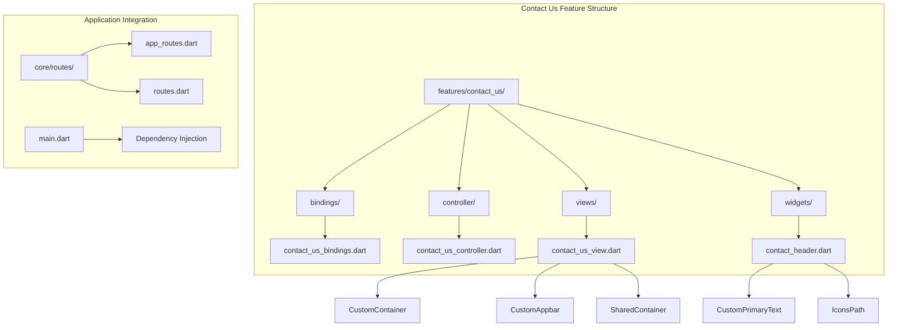
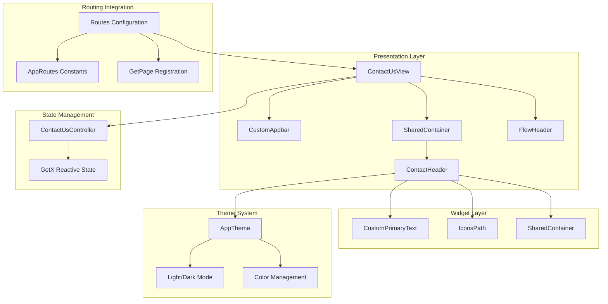
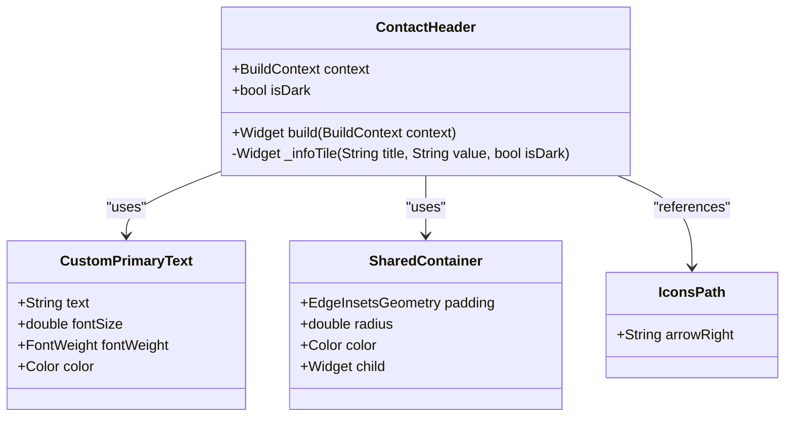
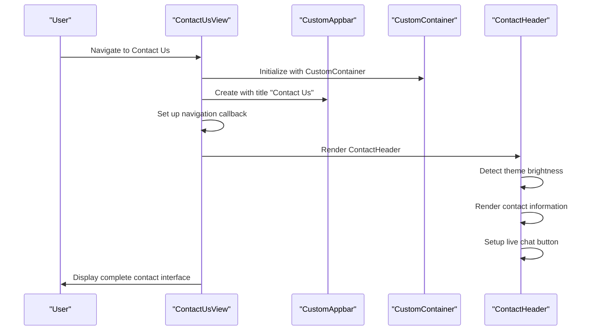
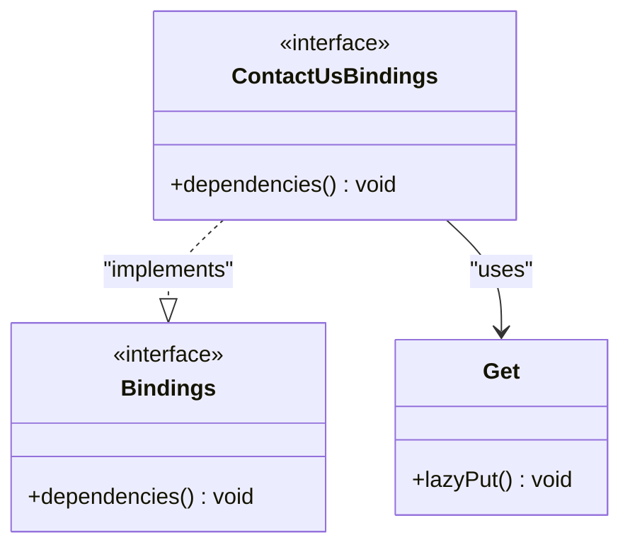
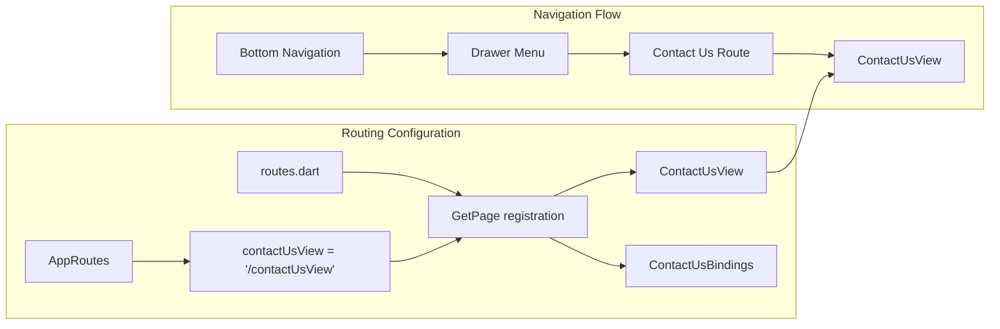
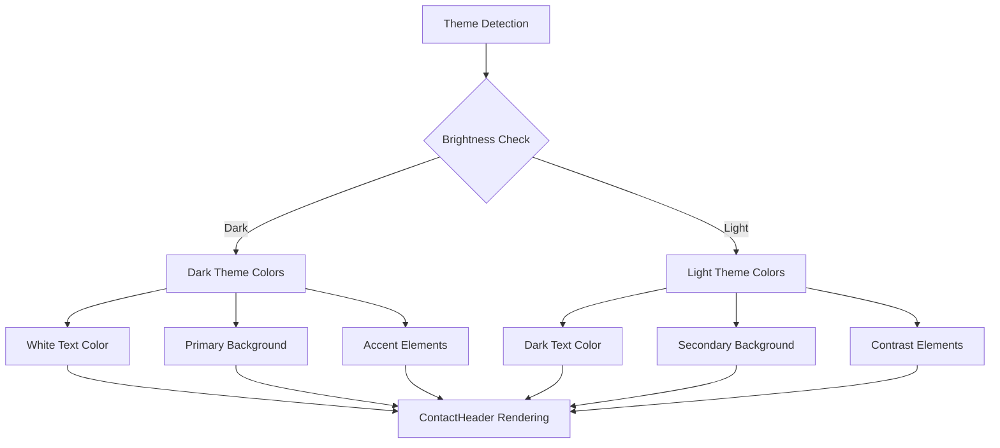
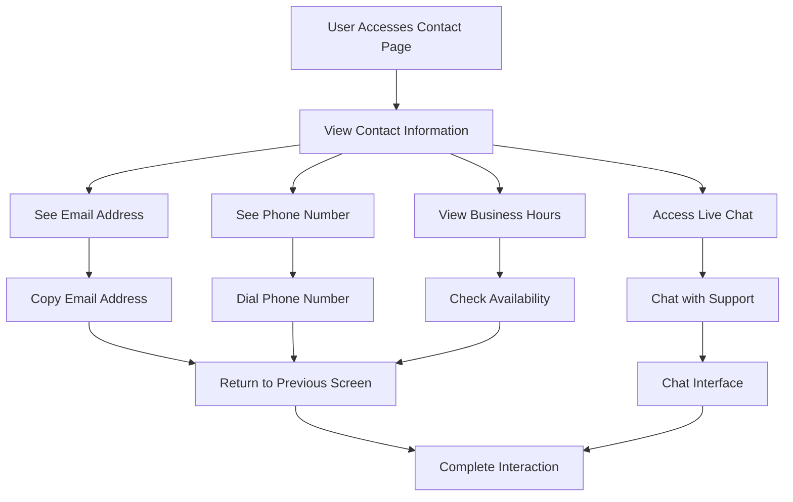
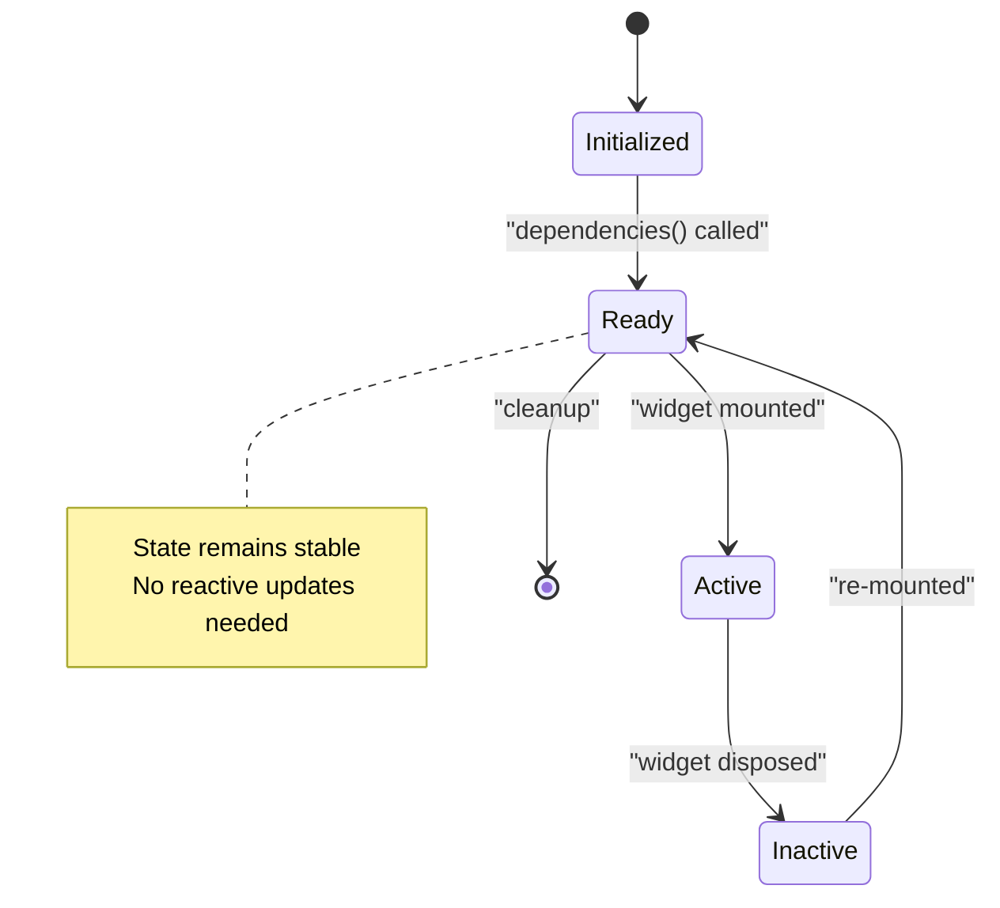

# Contact Us Feature

<cite>
**Referenced Files in This Document**
- [main.dart](file://lib/main.dart)
- [app_routes.dart](file://lib/core/routes/app_routes.dart)
- [routes.dart](file://lib/core/routes/routes.dart)
- [contact_us_bindings.dart](file://lib/features/contact_us/bindings/contact_us_bindings.dart)
- [contact_us_controller.dart](file://lib/features/contact_us/controller/contact_us_controller.dart)
- [contact_us_view.dart](file://lib/features/contact_us/views/contact_us_view.dart)
- [contact_header.dart](file://lib/features/contact_us/widgets/contact_header.dart)
</cite>

## Table of Contents
1. [Introduction](#introduction)
2. [Project Structure](#project-structure)
3. [Core Components](#core-components)
4. [Architecture Overview](#architecture-overview)
5. [Detailed Component Analysis](#detailed-component-analysis)
6. [Integration Points](#integration-points)
7. [User Experience Flow](#user-experience-flow)
8. [Technical Implementation](#technical-implementation)
9. [Future Enhancements](#future-enhancements)
10. [Conclusion](#conclusion)

## Introduction

The Contact Us feature is a crucial component of the ZB DEZIGN Flutter application that provides users with essential communication channels and support information. This feature serves as a centralized hub for customer inquiries, support requests, and general business communications. The implementation follows modern Flutter architecture patterns using the GetX framework for state management and dependency injection.

The feature encompasses contact information display, live chat functionality, and integration points with the broader application ecosystem. It is designed to be responsive, accessible, and consistent with the application's design system while providing practical utility for user engagement.

## Project Structure

The Contact Us feature is organized within the features directory following Flutter's modular architecture pattern. The structure demonstrates clear separation of concerns with dedicated directories for bindings, controllers, views, and widgets.

**Diagram sources**
- [contact_us_bindings.dart:1-9](file://lib/features/contact_us/bindings/contact_us_bindings.dart#L1-L9)
- [contact_us_controller.dart:1-3](file://lib/features/contact_us/controller/contact_us_controller.dart#L1-L3)
- [contact_us_view.dart:1-42](file://lib/features/contact_us/views/contact_us_view.dart#L1-L42)
- [contact_header.dart:1-107](file://lib/features/contact_us/widgets/contact_header.dart#L1-L107)

**Section sources**
- [contact_us_bindings.dart:1-9](file://lib/features/contact_us/bindings/contact_us_bindings.dart#L1-L9)
- [contact_us_controller.dart:1-3](file://lib/features/contact_us/controller/contact_us_controller.dart#L1-L3)
- [contact_us_view.dart:1-42](file://lib/features/contact_us/views/contact_us_view.dart#L1-L42)
- [contact_header.dart:1-107](file://lib/features/contact_us/widgets/contact_header.dart#L1-L107)

## Core Components

The Contact Us feature consists of four primary components that work together to deliver a cohesive user experience:

### ContactUsBindings
The binding class implements the GetX Bindings interface, providing dependency injection configuration for the Contact Us feature. Currently, it registers the binding with Get.lazyPut for lazy initialization.

### ContactUsController
Extends GetxController and serves as the state management layer for the Contact Us feature. While minimal in current implementation, it provides a foundation for future enhancements such as form handling, API integration, and state synchronization.

### ContactUsView
The main view component that orchestrates the layout and presentation of contact information. It integrates with the application's theme system and utilizes custom widgets for consistent design.

### ContactHeader
A specialized widget responsible for rendering contact information, including email addresses, phone numbers, business hours, and live chat functionality.

**Section sources**
- [contact_us_bindings.dart:1-9](file://lib/features/contact_us/bindings/contact_us_bindings.dart#L1-L9)
- [contact_us_controller.dart:1-3](file://lib/features/contact_us/controller/contact_us_controller.dart#L1-L3)
- [contact_us_view.dart:10-42](file://lib/features/contact_us/views/contact_us_view.dart#L10-L42)
- [contact_header.dart:8-107](file://lib/features/contact_us/widgets/contact_header.dart#L8-L107)

## Architecture Overview

The Contact Us feature follows a layered architecture pattern that separates concerns and promotes maintainability. The architecture leverages Flutter's widget tree structure combined with GetX's reactive programming model.

**Diagram sources**
- [contact_us_view.dart:14-40](file://lib/features/contact_us/views/contact_us_view.dart#L14-L40)
- [contact_header.dart:12-79](file://lib/features/contact_us/widgets/contact_header.dart#L12-L79)
- [routes.dart:279-283](file://lib/core/routes/routes.dart#L279-L283)
- [app_routes.dart:45](file://lib/core/routes/app_routes.dart#L45)

The architecture demonstrates clear separation between presentation, state management, and integration concerns. The GetX framework provides reactive state management while maintaining performance through selective widget rebuilds.

**Section sources**
- [routes.dart:279-283](file://lib/core/routes/routes.dart#L279-L283)
- [app_routes.dart:45](file://lib/core/routes/app_routes.dart#L45)
- [contact_us_view.dart:14-40](file://lib/features/contact_us/views/contact_us_view.dart#L14-L40)

## Detailed Component Analysis

### Contact Header Widget Analysis

The ContactHeader widget serves as the primary content renderer for the Contact Us feature, implementing a sophisticated layout system that adapts to different screen sizes and themes.

**Diagram sources**
- [contact_header.dart:8-107](file://lib/features/contact_us/widgets/contact_header.dart#L8-L107)

The widget implements dynamic theming through brightness detection, ensuring proper color contrast across light and dark themes. It utilizes a column-based layout system with consistent spacing using Flutter's ScreenUtil package for responsive design.

**Section sources**
- [contact_header.dart:8-107](file://lib/features/contact_us/widgets/contact_header.dart#L8-L107)

### View Component Architecture

The ContactUsView component demonstrates excellent separation of concerns by delegating specific UI responsibilities to specialized widgets while maintaining overall layout control.

**Diagram sources**
- [contact_us_view.dart:14-40](file://lib/features/contact_us/views/contact_us_view.dart#L14-L40)
- [contact_header.dart:12-79](file://lib/features/contact_us/widgets/contact_header.dart#L12-L79)

The view component efficiently manages the widget tree hierarchy, ensuring optimal performance through strategic use of SizedBox widgets for spacing and proper widget composition.

**Section sources**
- [contact_us_view.dart:10-42](file://lib/features/contact_us/views/contact_us_view.dart#L10-L42)

### Binding and Dependency Injection

The ContactUsBindings class implements the Bindings interface from GetX, providing dependency injection capabilities for the feature module.

**Diagram sources**
- [contact_us_bindings.dart:3-8](file://lib/features/contact_us/bindings/contact_us_bindings.dart#L3-L8)

The binding configuration uses Get.lazyPut for deferred instantiation, optimizing memory usage and initialization performance.

**Section sources**
- [contact_us_bindings.dart:1-9](file://lib/features/contact_us/bindings/contact_us_bindings.dart#L1-L9)

## Integration Points

### Routing Integration

The Contact Us feature is seamlessly integrated into the application's routing system through the AppRoutes constants and routes.dart configuration.

**Diagram sources**
- [app_routes.dart:45](file://lib/core/routes/app_routes.dart#L45)
- [routes.dart:279-283](file://lib/core/routes/routes.dart#L279-L283)

The routing system ensures consistent navigation patterns and supports deep linking capabilities for improved user experience.

**Section sources**
- [app_routes.dart:45](file://lib/core/routes/app_routes.dart#L45)
- [routes.dart:279-283](file://lib/core/routes/routes.dart#L279-L283)

### Theme System Integration

The Contact Us feature integrates deeply with the application's theme system, supporting both light and dark modes through automatic color adaptation.

**Diagram sources**
- [contact_header.dart:13-105](file://lib/features/contact_us/widgets/contact_header.dart#L13-L105)

The theme integration ensures accessibility compliance and provides an optimal viewing experience across different lighting conditions and user preferences.

**Section sources**
- [contact_header.dart:13-105](file://lib/features/contact_us/widgets/contact_header.dart#L13-L105)

## User Experience Flow

The Contact Us feature provides a streamlined user experience focused on immediate access to support information and communication channels.

The user flow emphasizes discoverability and immediate action, with clear visual hierarchy and intuitive navigation patterns that guide users toward their desired outcome.

## Technical Implementation

### State Management Architecture

The Contact Us feature leverages GetX's reactive state management system, providing efficient state updates and reduced boilerplate code.

The minimal state management approach reflects the feature's current simplicity while maintaining scalability for future enhancements.

**Section sources**
- [contact_us_controller.dart:1-3](file://lib/features/contact_us/controller/contact_us_controller.dart#L1-L3)

### Responsive Design Implementation

The feature implements responsive design principles through Flutter's ScreenUtil package, ensuring consistent appearance across different device sizes and orientations.

The layout system uses a combination of SizedBox widgets for spacing and flexible containers that adapt to screen dimensions. This approach maintains visual consistency while accommodating various screen densities and aspect ratios.

**Section sources**
- [contact_us_view.dart:15-40](file://lib/features/contact_us/views/contact_us_view.dart#L15-L40)
- [contact_header.dart:14-79](file://lib/features/contact_us/widgets/contact_header.dart#L14-L79)

## Future Enhancements

### Form Integration
The ContactUsController provides a foundation for implementing contact forms with validation, submission handling, and feedback mechanisms.

### API Integration
Future iterations could integrate with backend services for live chat functionality, ticket submission, and real-time support availability.

### Analytics Tracking
Implementation of user interaction analytics to track contact method preferences and optimize the user experience based on usage patterns.

### Accessibility Improvements
Enhanced accessibility features including screen reader support, keyboard navigation, and high contrast mode compatibility.

## Conclusion

The Contact Us feature represents a well-architected component of the ZB DEZIGN application that effectively balances simplicity with functionality. The implementation demonstrates strong adherence to Flutter best practices through proper separation of concerns, reactive state management, and responsive design principles.

The feature's modular structure facilitates easy maintenance and future enhancements while providing immediate value to users seeking support and communication channels. The integration with the broader application ecosystem ensures consistency and seamless user experience across all application screens.

Through thoughtful design decisions and clean code architecture, the Contact Us feature establishes a solid foundation for continued growth and enhancement as the application evolves to meet user needs and business requirements.